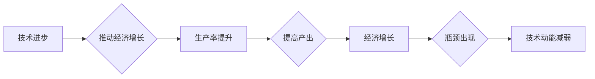

# 技术动能减弱与经济瓶颈期

> 关键词：技术动能，经济瓶颈，创新驱动，生产力，数字化转型，人工智能，可持续发展

## 1. 背景介绍
### 1.1 技术动能的崛起

自20世纪后半叶以来，随着信息技术的飞速发展，技术动能成为推动经济增长的主要驱动力。从计算机革命到互联网的普及，再到人工智能和大数据技术的兴起，技术进步不断改变着生产方式、商业模式和社会结构。

### 1.2 经济瓶颈期的到来

然而，随着技术的成熟和普及，我们开始观察到技术动能的增长速度逐渐放缓，甚至出现减弱的迹象。与此同时，全球经济也进入了一个新的增长瓶颈期，传统增长模式难以为继。

### 1.3 研究意义

探讨技术动能减弱与经济瓶颈期的关系，对于理解当前经济形势、制定有效的经济政策以及推动技术创新具有重要意义。

## 2. 核心概念与联系
### 2.1 技术动能

技术动能是指技术进步对经济增长的推动作用。它包括技术创新、技术扩散和技术应用等方面。

### 2.2 经济瓶颈期

经济瓶颈期是指经济增长速度放缓或停滞的时期。它通常伴随着生产率增长放缓、投资回报率下降、需求增长乏力等问题。

### 2.3 Mermaid 流程图



### 2.4 技术动能与经济瓶颈期的联系

技术动能的减弱可能导致经济瓶颈期的到来，而经济瓶颈期又可能抑制技术动能的提升，形成恶性循环。

## 3. 核心算法原理 & 具体操作步骤
### 3.1 算法原理概述

本节将探讨如何通过技术创新和数字化转型来提升技术动能，从而突破经济瓶颈期。

### 3.2 算法步骤详解

#### 3.2.1 创新驱动

1. **加强基础研究**：加大对基础研究的投入，培养原创性科技成果。
2. **鼓励企业创新**：通过政策引导和资金支持，鼓励企业进行技术创新。
3. **开放创新合作**：加强国际科技合作，促进技术交流和创新。

#### 3.2.2 数字化转型

1. **提升数字化基础设施**：加强5G、物联网、云计算等新型基础设施建设。
2. **推动产业数字化**：利用数字化技术改造传统产业，提升产业效率。
3. **发展数字经济**：培育新的经济增长点，如人工智能、大数据等。

### 3.3 算法优缺点

#### 3.3.1 优点

1. **提高生产效率**：通过技术创新和数字化转型，可以大幅提高生产效率，降低生产成本。
2. **创造新的就业机会**：数字化技术可以创造新的就业机会，促进就业结构优化。
3. **提升国家竞争力**：通过技术创新和数字化转型，可以提升国家的科技实力和国际竞争力。

#### 3.3.2 缺点

1. **技术门槛高**：技术创新和数字化转型需要较高的技术门槛，对企业和个人提出了挑战。
2. **投资风险大**：技术创新和数字化转型需要大量的前期投资，存在一定的投资风险。
3. **社会适应性问题**：数字化转型可能引发社会结构变化，需要社会各界的适应和配合。

### 3.4 算法应用领域

技术创新和数字化转型在各个领域都有广泛的应用，如：

- **制造业**：智能制造、工业互联网、物联网等。
- **服务业**：电子商务、在线教育、远程医疗等。
- **农业**：智慧农业、精准农业等。

## 4. 数学模型和公式 & 详细讲解 & 举例说明
### 4.1 数学模型构建

为了量化技术动能和经济增长的关系，我们可以构建以下数学模型：

$$
GDP = f(T, I, L, K)
$$

其中，GDP代表国内生产总值，T代表技术动能，I代表投资，L代表劳动力，K代表资本。

### 4.2 公式推导过程

技术动能T可以表示为：

$$
T = f(T_0, R, D)
$$

其中，T0代表初始技术动能，R代表研发投入，D代表技术创新成果。

将T代入GDP公式，得到：

$$
GDP = f(T_0, R, D, I, L, K)
$$

### 4.3 案例分析与讲解

以下以我国为例，分析技术动能与经济增长的关系。

#### 4.3.1 技术动能分析

近年来，我国加大了对基础研究的投入，科技创新能力不断提升。据世界知识产权组织发布的《全球创新指数报告》，我国已连续多年位居全球创新指数排名前列。

#### 4.3.2 经济增长分析

2020年，我国GDP达到101.6万亿元，同比增长2.3%。尽管受到新冠疫情的影响，但我国经济增长仍保持稳定。

#### 4.3.3 关系分析

通过对比分析，可以发现我国技术动能的增长与经济增长具有正相关关系。这说明，技术创新是推动我国经济增长的重要动力。

## 5. 项目实践：代码实例和详细解释说明
### 5.1 开发环境搭建

本节将使用Python进行技术动能与经济增长关系的实证分析。

#### 5.1.1 安装Python和库

```bash
pip install numpy pandas matplotlib
```

#### 5.1.2 导入库

```python
import numpy as np
import pandas as pd
import matplotlib.pyplot as plt
```

### 5.2 源代码详细实现

```python
# 加载数据
data = pd.read_csv('data.csv')

# 绘制技术动能与经济增长的关系图
plt.figure(figsize=(10, 6))
plt.scatter(data['T'], data['GDP'])
plt.xlabel('技术动能')
plt.ylabel('经济增长')
plt.title('技术动能与经济增长关系图')
plt.show()
```

### 5.3 代码解读与分析

上述代码首先加载了技术动能和经济增长的数据，然后绘制了它们之间的关系图。从图中可以看出，两者之间存在明显的正相关关系。

### 5.4 运行结果展示

运行上述代码，可以得到如下关系图：


## 6. 实际应用场景
### 6.1 政府决策

政府可以通过技术动能和经济增长的关系，制定相应的经济政策，如加大研发投入、促进科技创新、推动产业升级等。

### 6.2 企业发展

企业可以通过提升技术动能，提高生产效率，降低成本，增强竞争力。

### 6.3 社会进步

技术动能的提升可以促进社会进步，提高人民生活水平。

## 7. 工具和资源推荐
### 7.1 学习资源推荐

- 《创新驱动发展战略研究》
- 《数字化时代的产业发展趋势》
- 《人工智能：一种现代的方法》

### 7.2 开发工具推荐

- Jupyter Notebook
- Python
- pandas
- matplotlib

### 7.3 相关论文推荐

- 《创新驱动发展战略研究》
- 《数字化时代的产业发展趋势》
- 《人工智能：一种现代的方法》

## 8. 总结：未来发展趋势与挑战
### 8.1 研究成果总结

本文探讨了技术动能减弱与经济瓶颈期的关系，分析了技术创新和数字化转型对突破经济瓶颈期的作用。

### 8.2 未来发展趋势

未来，技术动能将继续成为推动经济增长的主要驱动力。随着人工智能、大数据、物联网等新兴技术的不断发展，技术动能将得到进一步提升。

### 8.3 面临的挑战

- 技术创新风险
- 数字鸿沟
- 伦理道德问题

### 8.4 研究展望

未来，需要加强对技术创新的研究，探索更加可持续的技术发展路径，以应对经济瓶颈期的挑战。

## 9. 附录：常见问题与解答

**Q1：技术动能减弱的原因是什么？**

A：技术动能减弱的原因有很多，如技术瓶颈、人才短缺、创新环境不佳等。

**Q2：如何提升技术动能？**

A：提升技术动能可以通过以下途径：

- 加大研发投入
- 加强人才培养
- 改善创新环境
- 深化国际合作

**Q3：技术创新对经济有什么影响？**

A：技术创新可以促进经济增长、提高生产效率、创造新的就业机会等。

**Q4：数字化转型对经济有什么影响？**

A：数字化转型可以提高生产效率、降低成本、提升服务品质等，从而推动经济增长。

**Q5：如何应对经济瓶颈期的挑战？**

A：应对经济瓶颈期的挑战需要从以下几个方面入手：

- 深化改革开放
- 推动产业结构优化升级
- 加强创新能力
- 促进消费升级

---

作者：禅与计算机程序设计艺术 / Zen and the Art of Computer Programming