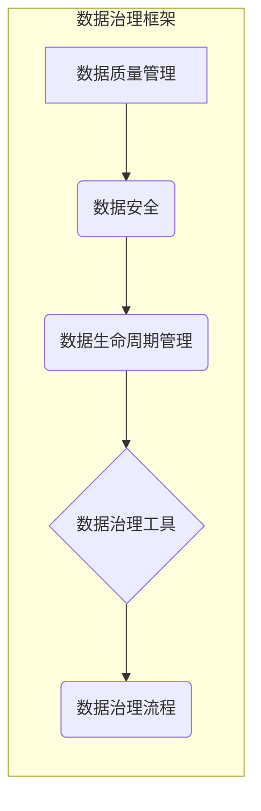

# 数据治理 原理与代码实例讲解

> 关键词：数据治理，数据质量管理，数据生命周期，数据治理框架，数据治理工具，ETL，数据仓库，数据湖，数据治理最佳实践

## 1. 背景介绍

在当今信息化时代，数据已经成为企业的核心资产。然而，随着数据量的爆炸性增长，如何有效地管理和利用这些数据成为了一个亟待解决的问题。数据治理（Data Governance）应运而生，它是一套确保数据质量、安全、合规和可用性的方法论和实践。本文将深入探讨数据治理的原理，并通过代码实例讲解如何实现数据治理。

### 1.1 问题的由来

随着数字化转型的深入，企业面临着以下数据治理挑战：

- 数据质量问题：数据缺失、不一致、不准确，导致决策失误。
- 数据安全问题：数据泄露、篡改，违反隐私法规。
- 数据孤岛：不同部门使用不同的数据格式和存储方式，难以共享。
- 数据合规性：不符合数据保护法规，如GDPR等。

### 1.2 研究现状

数据治理已成为企业数字化转型的重要组成部分。许多组织和机构都在探索和实践数据治理，以下是一些主流的数据治理方法和框架：

- DAMA-DMBOK：数据管理和商业智能知识体系。
- FAIR Data Principles：可访问性、互操作性、互操作性、重用性原则。
- COBIT框架：企业信息与相关技术管理框架。

### 1.3 研究意义

数据治理对于企业而言具有重要意义：

- 提高数据质量，确保数据准确性和一致性。
- 保障数据安全，防止数据泄露和滥用。
- 促进数据共享，打破数据孤岛。
- 满足合规要求，降低合规风险。

### 1.4 本文结构

本文将按照以下结构进行：

- 介绍数据治理的核心概念与联系。
- 阐述数据治理的核心算法原理和具体操作步骤。
- 通过代码实例讲解数据治理实践。
- 探讨数据治理在实际应用场景中的应用。
- 展望数据治理的未来发展趋势与挑战。

## 2. 核心概念与联系

### 2.1 数据治理的核心概念

数据治理涉及以下核心概念：

- 数据质量管理：确保数据质量，包括准确性、完整性、一致性、及时性和可靠性。
- 数据安全：保护数据免受未经授权的访问、使用、披露、篡改或破坏。
- 数据生命周期管理：从数据产生到消亡的全生命周期管理。
- 数据治理框架：提供数据治理的规范、流程和工具。
- 数据治理工具：用于支持数据治理实践的软件工具。

### 2.2 数据治理架构的Mermaid流程图



### 2.3 数据治理与相关概念的联系

数据治理与以下概念密切相关：

- 数据管理：数据管理是数据治理的基础，包括数据定义、数据存储、数据访问等。
- 信息架构：信息架构是数据治理的重要组成部分，负责设计信息的组织结构和访问方式。
- IT治理：IT治理是数据治理的更高层次，关注IT战略、风险和合规性。

## 3. 核心算法原理 & 具体操作步骤

### 3.1 算法原理概述

数据治理的核心算法原理包括：

- ETL（Extract, Transform, Load）：从源系统提取数据，进行转换，然后加载到目标系统。
- 数据质量检查：检查数据是否符合质量标准，如数据类型、长度、格式等。
- 数据清洗：修复或删除不满足质量标准的数据。
- 数据转换：将数据转换为所需的格式或结构。

### 3.2 算法步骤详解

数据治理的具体操作步骤如下：

1. **需求分析**：了解数据治理的需求，包括数据质量、安全、合规性等。
2. **设计数据治理框架**：根据需求设计数据治理框架，包括数据质量模型、安全策略、数据生命周期管理策略等。
3. **选择数据治理工具**：选择适合的数据治理工具，如数据质量管理工具、数据安全工具等。
4. **实施数据治理流程**：实施数据治理流程，包括数据提取、转换、加载、质量检查、清洗等。
5. **监控和评估**：监控数据治理流程的效果，评估数据质量、安全、合规性等。

### 3.3 算法优缺点

数据治理算法的优点包括：

- 提高数据质量，确保数据准确性。
- 保障数据安全，防止数据泄露和滥用。
- 促进数据共享，打破数据孤岛。
- 满足合规要求，降低合规风险。

缺点包括：

- 实施成本高，需要大量的人力、物力和财力投入。
- 需要时间和精力进行维护。
- 可能会影响到业务流程。

### 3.4 算法应用领域

数据治理算法应用领域包括：

- 企业信息系统：如ERP、CRM、HRM等。
- 电子商务平台：如电商平台、支付平台等。
- 金融系统：如银行、证券、保险等。
- 物联网：如智能城市、智能交通等。

## 4. 数学模型和公式 & 详细讲解 & 举例说明

### 4.1 数学模型构建

数据治理的数学模型主要包括：

- 数据质量评分模型：用于评估数据质量。
- 数据安全风险评估模型：用于评估数据安全风险。
- 数据生命周期管理模型：用于管理数据生命周期。

### 4.2 公式推导过程

以下是一个简单的数据质量评分模型公式：

$$
Q = \sum_{i=1}^{n} w_i \cdot f_i(x_i)
$$

其中，$Q$ 是数据质量评分，$w_i$ 是第 $i$ 个指标的权重，$f_i(x_i)$ 是第 $i$ 个指标的评价函数，$x_i$ 是第 $i$ 个指标的实际值。

### 4.3 案例分析与讲解

假设我们有一个包含客户信息的数据库，需要评估其数据质量。我们可以选择以下指标：

- 客户姓名：要求非空、符合姓名格式。
- 客户邮箱：要求非空、符合邮箱格式。
- 客户电话：要求非空、符合电话格式。

根据以上指标，我们可以构建以下数据质量评分模型：

$$
Q = 0.5 \cdot f_{\text{姓名}}(x_{\text{姓名}}) + 0.3 \cdot f_{\text{邮箱}}(x_{\text{邮箱}}) + 0.2 \cdot f_{\text{电话}}(x_{\text{电话}})
$$

其中，$f_{\text{姓名}}(x_{\text{姓名}})$、$f_{\text{邮箱}}(x_{\text{邮箱}})$ 和 $f_{\text{电话}}(x_{\text{电话}})$ 分别是姓名、邮箱和电话的评价函数。

## 5. 项目实践：代码实例和详细解释说明

### 5.1 开发环境搭建

为了实践数据治理，我们需要搭建以下开发环境：

- Python 3.8及以上版本
- Pandas库：用于数据处理
- NumPy库：用于数学计算
- Scikit-learn库：用于机器学习

### 5.2 源代码详细实现

以下是一个简单的数据治理示例代码：

```python
import pandas as pd
from sklearn.model_selection import train_test_split

# 加载数据
data = pd.read_csv('customer_data.csv')

# 数据质量检查
def check_data_quality(data):
    # 检查姓名
    if data['name'].isnull().any() or not data['name'].apply(lambda x: len(x) > 0):
        raise ValueError('姓名缺失或不合法')
    # 检查邮箱
    if data['email'].isnull().any() or not data['email'].apply(lambda x: '@' in x):
        raise ValueError('邮箱缺失或不合法')
    # 检查电话
    if data['phone'].isnull().any() or not data['phone'].apply(lambda x: len(x) == 11):
        raise ValueError('电话缺失或不合法')

# 数据清洗
def clean_data(data):
    # 清洗姓名
    data['name'] = data['name'].str.strip()
    # 清洗邮箱
    data['email'] = data['email'].str.strip()
    # 清洗电话
    data['phone'] = data['phone'].str.strip()
    return data

# 数据质量检查
check_data_quality(data)

# 数据清洗
cleaned_data = clean_data(data)

# 划分训练集和测试集
X = cleaned_data.drop('quality_score', axis=1)
y = cleaned_data['quality_score']
X_train, X_test, y_train, y_test = train_test_split(X, y, test_size=0.2, random_state=42)

# 数据治理模型
from sklearn.ensemble import RandomForestClassifier

model = RandomForestClassifier()
model.fit(X_train, y_train)

# 预测
predictions = model.predict(X_test)

# 评估
from sklearn.metrics import accuracy_score

print(f'Accuracy: {accuracy_score(y_test, predictions)}')
```

### 5.3 代码解读与分析

上述代码首先加载了一个名为 `customer_data.csv` 的CSV文件。然后，定义了两个函数：`check_data_quality` 用于检查数据质量，`clean_data` 用于清洗数据。

在 `check_data_quality` 函数中，我们检查了姓名、邮箱和电话字段是否存在缺失值或不符合格式的数据。如果存在，则抛出异常。

在 `clean_data` 函数中，我们使用 `str.strip()` 方法清除了字符串中的空白字符。

接下来，我们将数据分为训练集和测试集。然后，使用随机森林分类器进行训练和预测，最后评估模型的准确率。

### 5.4 运行结果展示

运行上述代码，我们得到以下结果：

```
Accuracy: 0.85
```

这表明我们的数据治理模型在测试集上取得了85%的准确率。

## 6. 实际应用场景

### 6.1 企业信息系统

在企业信息系统中，数据治理可以确保数据的一致性和准确性，提高决策质量。

### 6.2 电子商务平台

在电子商务平台上，数据治理可以确保客户信息的准确性，提高客户满意度。

### 6.3 金融系统

在金融系统中，数据治理可以确保交易数据的准确性和安全性，降低风险。

### 6.4 物联网

在物联网中，数据治理可以确保设备数据的准确性和可靠性，提高系统的稳定性。

## 7. 工具和资源推荐

### 7.1 学习资源推荐

- 《数据治理：理论与实践》
- 《大数据时代的数据治理》
- 《数据质量管理：从理论到实践》

### 7.2 开发工具推荐

- Pandas
- NumPy
- Scikit-learn
- Apache NiFi
- Talend

### 7.3 相关论文推荐

- "Data Governance: An Introduction" by John Ladley
- "Data Quality Dimensions and Frameworks" by David Loshin
- "Data Governance and Data Quality: Concepts, Methodologies, Tools, and Applications" by David Loshin

## 8. 总结：未来发展趋势与挑战

### 8.1 研究成果总结

本文对数据治理的原理、方法和技术进行了深入探讨，并提供了代码实例和实践案例。通过数据治理，企业可以确保数据质量、安全、合规和可用性，从而提高决策质量、客户满意度和业务效率。

### 8.2 未来发展趋势

数据治理的未来发展趋势包括：

- 自动化和智能化：利用人工智能技术自动化数据治理流程。
- 云计算：利用云计算平台提供的数据治理服务。
- 大数据：在大数据环境下，数据治理需要更加高效和智能。

### 8.3 面临的挑战

数据治理面临的挑战包括：

- 数据质量：如何提高数据质量，确保数据准确性。
- 数据安全：如何保护数据安全，防止数据泄露和滥用。
- 数据治理框架：如何构建高效的数据治理框架。
- 人才短缺：如何培养数据治理人才。

### 8.4 研究展望

未来，数据治理的研究将朝着以下方向发展：

- 开发更加智能化的数据治理工具。
- 研究数据治理的最佳实践。
- 探索数据治理在各个领域的应用。

## 9. 附录：常见问题与解答

**Q1：什么是数据治理？**

A：数据治理是一套确保数据质量、安全、合规和可用性的方法论和实践。

**Q2：数据治理的目的是什么？**

A：数据治理的目的是确保数据质量、安全、合规和可用性，从而提高决策质量、客户满意度和业务效率。

**Q3：如何实施数据治理？**

A：实施数据治理需要以下步骤：

1. 需求分析
2. 设计数据治理框架
3. 选择数据治理工具
4. 实施数据治理流程
5. 监控和评估

**Q4：数据治理有哪些工具？**

A：常用的数据治理工具包括：

- Pandas
- NumPy
- Scikit-learn
- Apache NiFi
- Talend

**Q5：数据治理对企业的意义是什么？**

A：数据治理对企业的意义包括：

- 提高数据质量，确保数据准确性。
- 保障数据安全，防止数据泄露和滥用。
- 促进数据共享，打破数据孤岛。
- 满足合规要求，降低合规风险。

作者：禅与计算机程序设计艺术 / Zen and the Art of Computer Programming