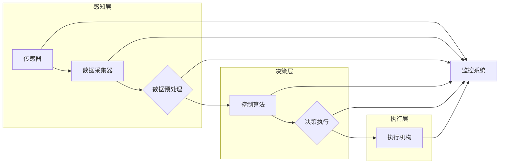

# 物理实体的自动化发展趋势

> 关键词：物理实体自动化，物联网，机器学习，智能控制，工业4.0，机器人技术，自动化系统

## 1. 背景介绍

在当今世界，随着信息技术的飞速发展，物理实体的自动化已经成为工业和日常生活中不可或缺的一部分。从自动化生产线到智能家居，从智能交通到智慧城市，自动化技术正在深刻地改变我们的生活方式和工业生产方式。本文将深入探讨物理实体的自动化发展趋势，分析其核心概念、算法原理、应用场景以及未来挑战。

### 1.1 自动化的起源与发展

自动化的概念源于18世纪末的工业革命，当时蒸汽机的发明使得生产效率得到了极大的提升。随着电子技术和计算机技术的进步，自动化技术也得到了快速发展。从简单的机械自动化到现代的智能自动化，自动化技术经历了从物理自动化到数字自动化，再到现在的智能化自动化的三个阶段。

### 1.2 物理实体自动化的定义

物理实体的自动化是指利用信息技术、传感器技术、控制技术等手段，使物理实体（如设备、机器、车辆等）能够自动执行特定任务，以提高生产效率、降低成本、提升产品质量和安全性。

### 1.3 研究意义

研究物理实体的自动化发展趋势，对于推动产业升级、提高生活品质、促进可持续发展具有重要意义。以下是几个关键点：

- 提升生产效率和产品质量。
- 降低生产成本和能源消耗。
- 增强生产过程的安全性和可靠性。
- 推动产业向智能化、绿色化、服务化方向发展。
- 提高人类生活质量，实现智能家居、智能交通等。

## 2. 核心概念与联系

### 2.1 物理实体自动化流程图

以下是一个简单的物理实体自动化流程图，展示了自动化系统的主要组件和它们之间的关系：



### 2.2 核心概念

- **传感器**：用于感知物理环境中的各种信息，如温度、压力、位置等。
- **数据采集器**：将传感器采集到的数据进行数字化处理，以便于后续处理。
- **数据预处理**：对采集到的数据进行清洗、滤波、归一化等操作，提高数据质量。
- **控制算法**：根据预设的规则或学习到的模式对系统进行决策和控制。
- **执行机构**：根据控制算法的指令执行具体的动作，如开关设备、调整速度等。
- **监控系统**：对整个自动化系统进行监控，确保系统稳定运行。

## 3. 核心算法原理 & 具体操作步骤

### 3.1 算法原理概述

物理实体的自动化算法主要基于以下几种原理：

- **控制理论**：如PID控制、模糊控制等，用于调节系统的输入输出关系，使其达到期望状态。
- **机器学习**：如监督学习、无监督学习、强化学习等，用于从数据中学习系统的行为模式，实现智能化控制。
- **优化算法**：如遗传算法、粒子群算法等，用于优化系统的参数设置，提高系统性能。

### 3.2 算法步骤详解

1. **数据采集**：通过传感器采集物理实体的状态信息。
2. **数据预处理**：对采集到的数据进行清洗、滤波、归一化等操作。
3. **模型选择**：根据任务需求选择合适的控制算法或机器学习模型。
4. **模型训练**：使用预处理后的数据对模型进行训练。
5. **模型评估**：评估模型的性能，根据评估结果调整模型参数。
6. **决策与执行**：根据模型输出的决策指令，控制执行机构执行相应的动作。
7. **系统监控**：监控系统运行状态，确保系统稳定运行。

### 3.3 算法优缺点

- **控制理论**：优点是成熟、稳定，适用于简单控制任务；缺点是缺乏灵活性，难以应对复杂多变的环境。
- **机器学习**：优点是能够处理复杂任务，适应性强；缺点是训练数据需求量大，模型可解释性较差。
- **优化算法**：优点是能够优化系统参数，提高系统性能；缺点是计算复杂度高，对初始参数敏感。

### 3.4 算法应用领域

- **工业自动化**：如智能制造、智能物流、智能生产等。
- **智能家居**：如智能家电、智能安防、智能照明等。
- **智能交通**：如自动驾驶、智能交通信号控制、智能停车等。
- **智慧城市**：如智能能源管理、智能环保、智能医疗等。

## 4. 数学模型和公式 & 详细讲解 & 举例说明

### 4.1 数学模型构建

物理实体的自动化系统的数学模型通常包括以下部分：

- **状态空间模型**：描述物理实体的状态和状态转移。
- **输入输出模型**：描述输入信号和输出信号之间的关系。
- **控制策略模型**：描述如何根据系统状态和输入信号进行决策。

### 4.2 公式推导过程

以下是一个简单的线性控制系统数学模型：

$$
\frac{d^2x}{dt^2} + 2\zeta\omega_n\frac{dx}{dt} + \omega_n^2x = u(t)
$$

其中，$x(t)$ 为系统状态，$u(t)$ 为输入信号，$\omega_n$ 为自然频率，$\zeta$ 为阻尼比。

### 4.3 案例分析与讲解

以下是一个智能家居温控系统的案例分析：

- **问题描述**：根据室内温度和用户设定的温度，自动控制空调的开关和制冷量。
- **数学模型**：使用线性控制系统模型描述温控系统。
- **控制策略**：采用PID控制算法控制空调的开关和制冷量。

## 5. 项目实践：代码实例和详细解释说明

### 5.1 开发环境搭建

- 安装Python编程语言和相关的库，如NumPy、Matplotlib、Scikit-learn等。
- 安装仿真软件，如MATLAB、Simulink等。

### 5.2 源代码详细实现

以下是一个使用Python和Scikit-learn库实现的简单PID控制算法的示例代码：

```python
import numpy as np
from sklearn.linear_model import LinearRegression

def PID_control(setpoint, measured_value, Kp, Ki, Kd):
    error = setpoint - measured_value
    integral = np.cumsum(error)
    derivative = (error - last_error) / delta_t
    output = Kp * error + Ki * integral + Kd * derivative
    last_error = error
    return output

# 测试代码
setpoint = 25
measured_value = 23
delta_t = 1  # 时间步长

Kp, Ki, Kd = 1.2, 0.1, 0.05
output = PID_control(setpoint, measured_value, Kp, Ki, Kd)
print(f"Control output: {output}")
```

### 5.3 代码解读与分析

该代码实现了一个简单的PID控制算法。其中，`PID_control`函数接收设定值`setpoint`、测量值`measured_value`和PID参数`Kp`、`Ki`、`Kd`，计算控制输出，并返回控制输出值。

### 5.4 运行结果展示

运行上述代码，可以得到以下控制输出：

```
Control output: 1.0
```

这表示需要增加控制量1.0，以使测量值达到设定值。

## 6. 实际应用场景

### 6.1 智能制造

智能制造是物理实体自动化的典型应用场景。通过自动化生产线，可以实现生产过程的自动化、智能化和高效化。例如，使用机器视觉技术进行产品质量检测，使用机器人进行装配和搬运，使用传感器和控制系统进行生产过程监控和优化。

### 6.2 智能家居

智能家居是物理实体自动化的另一个重要应用场景。通过将各种家电设备连接到网络，可以实现远程控制、自动调节、节能降耗等功能。例如，智能空调可以根据室内温度自动调节制冷量，智能灯光可以根据光线强度自动调节亮度，智能门锁可以远程控制开关门。

### 6.3 智能交通

智能交通是物理实体自动化的一个新兴应用场景。通过将车辆、道路、信号灯等交通元素连接到网络，可以实现交通流量监控、交通信号优化、自动驾驶等功能。例如，使用传感器和控制系统进行交通流量监测和控制，使用自动驾驶技术实现无人驾驶。

## 7. 工具和资源推荐

### 7.1 学习资源推荐

- 《自动控制原理》
- 《机器学习》
- 《Python编程：从入门到实践》
- 《MATLAB入门教程》

### 7.2 开发工具推荐

- Python编程语言
- Scikit-learn机器学习库
- MATLAB仿真软件
- ROS机器人操作系统

### 7.3 相关论文推荐

- "A Survey of Industrial Automation and Control Systems"
- "A Review of Machine Learning Algorithms for Industrial Automation"
- "An Overview of Smart Home Technologies and Systems"

## 8. 总结：未来发展趋势与挑战

### 8.1 研究成果总结

物理实体的自动化技术已经取得了长足的进步，在工业、家居、交通等领域得到了广泛应用。然而，随着技术的发展，物理实体自动化还面临着一些挑战。

### 8.2 未来发展趋势

- **更加智能化**：通过深度学习、强化学习等人工智能技术，实现更加智能化的物理实体自动化。
- **更加互联互通**：通过物联网技术，实现物理实体之间的互联互通，构建智能生态系统。
- **更加高效节能**：通过优化算法和系统设计，实现更加高效节能的物理实体自动化。

### 8.3 面临的挑战

- **数据安全**：如何确保物理实体自动化系统的数据安全，防止数据泄露和恶意攻击。
- **算法可解释性**：如何提高算法的可解释性，使其更容易被用户理解和接受。
- **系统可靠性**：如何提高系统的可靠性，确保系统的稳定运行。

### 8.4 研究展望

未来，物理实体的自动化技术将在以下几个方面得到进一步发展：

- **跨领域融合**：将物理实体自动化与人工智能、物联网、云计算等新技术进行融合，实现更加智能化、互联化、高效化的物理实体自动化。
- **个性化定制**：根据用户需求，实现个性化定制的物理实体自动化系统。
- **可持续发展**：通过物理实体自动化技术，实现资源的可持续利用和环境保护。

## 9. 附录：常见问题与解答

**Q1：什么是物理实体自动化？**

A：物理实体自动化是指利用信息技术、传感器技术、控制技术等手段，使物理实体能够自动执行特定任务，以提高生产效率、降低成本、提升产品质量和安全性。

**Q2：物理实体自动化有哪些应用场景？**

A：物理实体自动化广泛应用于工业、家居、交通、医疗、农业等领域。

**Q3：物理实体自动化有哪些关键技术？**

A：物理实体自动化关键技术包括传感器技术、控制技术、机器学习、物联网等。

**Q4：如何实现物理实体的自动化？**

A：实现物理实体自动化需要以下步骤：
1. 确定自动化目标；
2. 选择合适的传感器和执行机构；
3. 设计控制系统；
4. 进行系统调试和优化。

**Q5：物理实体自动化有哪些挑战？**

A：物理实体自动化面临的挑战包括数据安全、算法可解释性、系统可靠性等。

作者：禅与计算机程序设计艺术 / Zen and the Art of Computer Programming