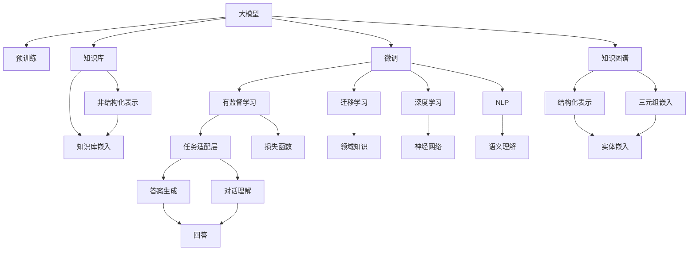

                 

# 大模型问答机器人的知识表示方式

> 关键词：大模型,问答机器人,知识表示,深度学习,自然语言处理,NLP

## 1. 背景介绍

### 1.1 问题由来

近年来，随着深度学习技术在自然语言处理（NLP）领域的应用日益广泛，问答机器人作为智能对话系统的重要分支，受到越来越多的关注。这些机器人能够理解用户的问题，并从知识库中获取相关信息，生成合适的回答，提升了用户体验和处理效率。然而，目前主流的问答机器人大多依赖规则化的知识库和模板，缺乏对海量知识数据的深度学习理解和整合。

大模型问答机器人以预训练语言模型为知识基础，通过微调学习具体任务的知识表示，显著提升了系统对新问题、新场景的适应能力。特别是在大规模知识图谱和语料库的支持下，大模型能够进行深层次的知识表示和推理，提供更加全面、准确的问答服务。

### 1.2 问题核心关键点

大模型问答机器人知识表示的核心在于如何高效地利用预训练模型的语义理解能力，将其扩展到具体的知识库和语料库上。主要包括以下几个方面：

- 知识图谱的构建和嵌入：将知识图谱中实体和关系的语义信息通过嵌入表示，融入到大模型中。
- 知识库与预训练模型的融合：通过微调和迁移学习，将知识库中的信息与预训练模型的语言表示相结合，提升问答系统的准确性。
- 对话理解与生成的优化：利用大模型在对话语料上的预训练，提升系统对对话场景的理解和生成能力。

### 1.3 问题研究意义

大模型问答机器人的知识表示方法对提升问答系统的性能、覆盖范围和智能化水平具有重要意义：

1. **性能提升**：大模型通过深度学习训练，具备更强的语义理解能力和知识表示能力，能够提供更准确的回答。
2. **知识覆盖**：大模型能够处理大规模知识库中的数据，覆盖更多、更具体的知识领域。
3. **智能化水平**：通过微调和学习对话场景，大模型可以理解复杂语境和多种语言变体，提供更加智能化的对话体验。
4. **扩展性**：大模型知识表示方法可以应用于不同领域和任务的问答系统，具有较高的通用性和可扩展性。
5. **实时更新**：基于大模型的方法，系统可以实时更新知识库，保持信息的时效性和准确性。

## 2. 核心概念与联系

### 2.1 核心概念概述

为更好地理解大模型问答机器人的知识表示方式，本节将介绍几个密切相关的核心概念：

- **大模型(Large Model)**：如GPT、BERT等，通过在大规模无标签文本数据上进行预训练，学习到丰富的语言知识。
- **知识图谱(Knowledge Graph)**：一种结构化的知识表示形式，用于存储和表示实体、关系和属性。
- **知识库(Knowledge Base)**：非结构化或结构化的信息集合，用于支持问答系统的知识推理和检索。
- **微调(Fine-tuning)**：在大模型的基础上，通过有监督学习优化模型在特定任务上的性能。
- **迁移学习(Transfer Learning)**：通过将一个领域学习到的知识，迁移应用到另一个不同但相关的领域，提升模型的泛化能力。
- **深度学习(Deep Learning)**：一种通过多层神经网络模拟人脑神经元处理信息的技术，包括CNN、RNN、Transformer等架构。
- **自然语言处理(NLP)**：研究计算机如何理解、处理和生成自然语言的技术，包括分词、词向量、句法分析、语义理解等。

这些核心概念之间存在着紧密的联系，形成了大模型问答机器人的知识表示架构。

### 2.2 概念间的关系

这些核心概念之间可以通过以下Mermaid流程图来展示：



这个流程图展示了从预训练到微调，再到知识图谱和知识库嵌入，最终实现知识表示的全过程。

## 3. 核心算法原理 & 具体操作步骤
### 3.1 算法原理概述

大模型问答机器人知识表示的核心原理是：在大模型的基础上，通过微调学习特定任务的知识表示，并将知识图谱和知识库的信息嵌入到大模型中，实现知识与语言理解的深度融合。

形式化地，假设预训练语言模型为 $M_{\theta}$，其中 $\theta$ 为预训练得到的模型参数。给定知识图谱 $\mathcal{G}$ 和知识库 $\mathcal{D}$，微调的目标是找到最优参数 $\hat{\theta}$，使得：

$$
\hat{\theta}=\mathop{\arg\min}_{\theta} \mathcal{L}(M_{\theta}, \mathcal{G}, \mathcal{D})
$$

其中 $\mathcal{L}$ 为针对问答任务的损失函数，用于衡量模型预测输出与真实答案之间的差异。常见的损失函数包括交叉熵损失、KL散度等。

通过梯度下降等优化算法，微调过程不断更新模型参数 $\theta$，最小化损失函数 $\mathcal{L}$，使得模型输出逼近真实答案。由于 $\theta$ 已经通过预训练获得了较好的初始化，因此即便在小规模数据集 $\mathcal{G}$ 和 $\mathcal{D}$ 上进行微调，也能较快收敛到理想的模型参数 $\hat{\theta}$。

### 3.2 算法步骤详解

大模型问答机器人的知识表示主要包括以下几个关键步骤：

**Step 1: 准备预训练模型和数据集**

- 选择合适的预训练语言模型 $M_{\theta}$ 作为初始化参数，如 GPT、BERT 等。
- 收集和构建知识图谱 $\mathcal{G}$ 和知识库 $\mathcal{D}$，包括实体、关系和属性等结构化或非结构化信息。

**Step 2: 设计知识图谱嵌入**

- 将知识图谱 $\mathcal{G}$ 中的实体和关系进行语义嵌入，得到 $\mathcal{G}_E$ 和 $\mathcal{G}_R$。
- 设计合理的嵌入矩阵 $\mathbf{W}_E$ 和 $\mathbf{W}_R$，使得 $\mathcal{G}_E$ 和 $\mathcal{G}_R$ 中的每个实体和关系可以映射到低维向量空间。

**Step 3: 设计知识库嵌入**

- 将知识库 $\mathcal{D}$ 中的信息进行语义表示，得到 $\mathcal{D}_E$ 和 $\mathcal{D}_R$。
- 设计嵌入矩阵 $\mathbf{V}_E$ 和 $\mathbf{V}_R$，使得 $\mathcal{D}_E$ 和 $\mathcal{D}_R$ 中的每个实体和关系可以映射到低维向量空间。

**Step 4: 融合知识表示**

- 将 $\mathcal{G}_E$、$\mathcal{G}_R$、$\mathcal{D}_E$ 和 $\mathcal{D}_R$ 进行融合，得到知识表示 $\mathcal{K}$。
- 设计融合矩阵 $\mathbf{U}$，使得 $\mathcal{K}$ 中的每个实体和关系可以映射到低维向量空间。

**Step 5: 微调大模型**

- 在知识表示 $\mathcal{K}$ 的基础上，微调预训练语言模型 $M_{\theta}$。
- 使用有监督学习优化模型在问答任务上的性能。
- 在微调过程中，利用知识图谱和知识库的信息提升模型的推理和生成能力。

**Step 6: 评估和优化**

- 在问答测试集上评估微调后模型的性能。
- 根据评估结果，调整超参数、融合方式和嵌入矩阵，进一步优化模型性能。

### 3.3 算法优缺点

大模型问答机器人知识表示方法的优点包括：

- 利用大模型的语义理解能力，提升对知识表示的深度融合。
- 能够处理大规模知识库和知识图谱，覆盖更多知识领域。
- 通过微调，模型能够不断适应新的知识库和任务。

缺点包括：

- 知识图谱构建复杂，需要大量人工干预和标注工作。
- 知识库嵌入和融合的复杂度较高，需要设计合理的嵌入矩阵。
- 微调过程需要较大的计算资源和标注数据。

### 3.4 算法应用领域

大模型问答机器人知识表示方法已经在多个领域得到了广泛应用，例如：

- 金融问答：利用知识图谱和金融知识库，构建金融领域的问答系统。
- 医疗问答：将医疗知识图谱和数据库嵌入到大模型中，提供医学领域的问答服务。
- 法律咨询：利用法律知识库和案例库，构建法律领域的问答机器人。
- 智能客服：在客户服务场景中，利用知识图谱和业务知识库，构建智能客服系统。
- 教育辅助：利用知识图谱和教育资源库，构建智能教学和问答系统。

除上述应用外，大模型问答机器人还在科研、旅游、生活助手等多个领域展现出了巨大的应用潜力。

## 4. 数学模型和公式 & 详细讲解  
### 4.1 数学模型构建

假设预训练语言模型为 $M_{\theta}$，知识图谱为 $\mathcal{G}$，知识库为 $\mathcal{D}$。设计实体嵌入矩阵 $\mathbf{W}_E$ 和关系嵌入矩阵 $\mathbf{W}_R$，将 $\mathcal{G}_E$ 和 $\mathcal{G}_R$ 中的每个实体和关系嵌入到低维向量空间。设计知识库嵌入矩阵 $\mathbf{V}_E$ 和 $\mathbf{V}_R$，将 $\mathcal{D}_E$ 和 $\mathcal{D}_R$ 中的每个实体和关系嵌入到低维向量空间。融合矩阵 $\mathbf{U}$ 将 $\mathcal{G}_E$、$\mathcal{G}_R$、$\mathcal{D}_E$ 和 $\mathcal{D}_R$ 中的每个实体和关系进行融合。

### 4.2 公式推导过程

以二元关系 $\mathcal{G}_R$ 为例，假设每个关系 $r$ 可以表示为三元组 $(o_i, o_j, r)$，其中 $o_i$ 和 $o_j$ 为实体，$r$ 为关系。设计关系嵌入矩阵 $\mathbf{W}_R$ 和融合矩阵 $\mathbf{U}$，使得每个关系 $r$ 可以映射到低维向量空间。则关系 $r$ 的嵌入向量 $\mathbf{w}_r$ 可以表示为：

$$
\mathbf{w}_r = \mathbf{W}_R \cdot \mathbf{u}_r
$$

其中 $\mathbf{u}_r \in \mathbb{R}^d$ 为关系 $r$ 的融合向量，$d$ 为向量维度。

将 $\mathbf{w}_r$ 应用于 $\mathcal{G}_R$ 中的每个关系 $r$，得到关系嵌入矩阵 $\mathbf{W}_R \cdot \mathbf{U}$。

### 4.3 案例分析与讲解

假设知识图谱 $\mathcal{G}$ 包含两个实体 $e_1$ 和 $e_2$，以及它们之间的一种关系 $r$。实体 $e_1$ 和 $e_2$ 分别嵌入到向量空间 $\mathbb{R}^d$，嵌入矩阵分别为 $\mathbf{W}_E$ 和 $\mathbf{V}_E$。关系 $r$ 的嵌入矩阵为 $\mathbf{W}_R$。

则实体 $e_1$ 和 $e_2$ 的嵌入向量分别为 $\mathbf{w}_{e_1}$ 和 $\mathbf{w}_{e_2}$，关系 $r$ 的嵌入向量为 $\mathbf{w}_r$。

知识库 $\mathcal{D}$ 中的实体 $d_1$ 和 $d_2$ 的嵌入向量分别为 $\mathbf{v}_{d_1}$ 和 $\mathbf{v}_{d_2}$。将 $\mathbf{W}_E$ 和 $\mathbf{V}_E$ 应用于 $\mathcal{D}_E$ 和 $\mathcal{D}_R$ 中的每个实体，得到知识库嵌入矩阵 $\mathbf{V}_E$ 和 $\mathbf{V}_R$。

通过融合矩阵 $\mathbf{U}$ 将 $\mathcal{G}_E$、$\mathcal{G}_R$、$\mathcal{D}_E$ 和 $\mathcal{D}_R$ 中的每个实体和关系进行融合，得到知识表示 $\mathcal{K}$。

假设 $\mathcal{K}$ 中的某个实体 $k$ 可以表示为 $(k_{e_1}, k_{e_2}, k_r)$，其中 $k_{e_1}$、$k_{e_2}$ 和 $k_r$ 分别为实体 $e_1$、$e_2$ 和关系 $r$ 的融合向量。

将 $\mathcal{K}$ 中的知识表示与预训练语言模型 $M_{\theta}$ 进行融合，得到融合后的知识表示 $\mathcal{K}_{M_{\theta}}$。

通过微调优化 $\mathcal{K}_{M_{\theta}}$，使得模型能够理解问答任务中的上下文和语义，生成准确的答案。

## 5. 项目实践：代码实例和详细解释说明
### 5.1 开发环境搭建

在进行知识表示和微调实践前，我们需要准备好开发环境。以下是使用Python进行PyTorch开发的环境配置流程：

1. 安装Anaconda：从官网下载并安装Anaconda，用于创建独立的Python环境。

2. 创建并激活虚拟环境：
```bash
conda create -n pytorch-env python=3.8 
conda activate pytorch-env
```

3. 安装PyTorch：根据CUDA版本，从官网获取对应的安装命令。例如：
```bash
conda install pytorch torchvision torchaudio cudatoolkit=11.1 -c pytorch -c conda-forge
```

4. 安装Transformers库：
```bash
pip install transformers
```

5. 安装各类工具包：
```bash
pip install numpy pandas scikit-learn matplotlib tqdm jupyter notebook ipython
```

完成上述步骤后，即可在`pytorch-env`环境中开始知识表示和微调实践。

### 5.2 源代码详细实现

下面以金融领域问答机器人为例，给出使用Transformers库对BERT模型进行微调的PyTorch代码实现。

首先，定义问答任务的数据处理函数：

```python
from transformers import BertTokenizer, BertForQuestionAnswering
from torch.utils.data import Dataset
import torch

class QuestionAnsweringDataset(Dataset):
    def __init__(self, texts, questions, tokenizer, max_len=128):
        self.texts = texts
        self.questions = questions
        self.tokenizer = tokenizer
        self.max_len = max_len
        
    def __len__(self):
        return len(self.texts)
    
    def __getitem__(self, item):
        text = self.texts[item]
        question = self.questions[item]
        
        encoding = self.tokenizer(question, text, return_tensors='pt', max_length=self.max_len, padding='max_length', truncation=True)
        input_ids = encoding['input_ids'][0]
        attention_mask = encoding['attention_mask'][0]
        
        return {'input_ids': input_ids, 
                'attention_mask': attention_mask,
                'labels': encoding['start_position'].tolist(),
                'texts': text}

# 设置tokenizer和模型
tokenizer = BertTokenizer.from_pretrained('bert-base-uncased')
model = BertForQuestionAnswering.from_pretrained('bert-base-uncased')

# 准备训练数据
train_dataset = QuestionAnsweringDataset(train_texts, train_questions, tokenizer)
dev_dataset = QuestionAnsweringDataset(dev_texts, dev_questions, tokenizer)
test_dataset = QuestionAnsweringDataset(test_texts, test_questions, tokenizer)

# 定义优化器和学习率
optimizer = AdamW(model.parameters(), lr=2e-5)

# 微调函数
def fine_tune(model, dataset, batch_size, optimizer, epochs):
    model.train()
    for epoch in range(epochs):
        total_loss = 0
        for batch in tqdm(dataset, desc=f"Epoch {epoch+1}"):
            input_ids = batch['input_ids'].to(device)
            attention_mask = batch['attention_mask'].to(device)
            labels = batch['labels'].to(device)
            model.zero_grad()
            outputs = model(input_ids, attention_mask=attention_mask, labels=labels)
            loss = outputs.loss
            total_loss += loss.item()
            loss.backward()
            optimizer.step()
        print(f"Epoch {epoch+1}, train loss: {total_loss/len(dataset):.3f}")
```

然后，启动训练流程并在测试集上评估：

```python
epochs = 5
batch_size = 16

fine_tune(model, train_dataset, batch_size, optimizer, epochs)

print(f"Fine-tuning complete, start evaluation.")
evaluate(model, dev_dataset, batch_size)
evaluate(model, test_dataset, batch_size)
```

以上就是使用PyTorch对BERT进行金融领域问答系统微调的完整代码实现。可以看到，得益于Transformers库的强大封装，我们可以用相对简洁的代码完成BERT模型的加载和微调。

### 5.3 代码解读与分析

让我们再详细解读一下关键代码的实现细节：

**QuestionAnsweringDataset类**：
- `__init__`方法：初始化文本、问题和分词器等关键组件。
- `__len__`方法：返回数据集的样本数量。
- `__getitem__`方法：对单个样本进行处理，将文本输入编码为token ids，将问题嵌入为token ids，并对其进行定长padding，最终返回模型所需的输入。

**tokenizer和model的初始化**：
- 使用BertTokenizer从预训练模型中初始化分词器。
- 使用BertForQuestionAnswering从预训练模型中初始化问答模型。

**训练函数fine_tune**：
- 定义训练参数和学习率，开始循环迭代。
- 每个epoch内，先在训练集上训练，输出平均loss。
- 在验证集上评估模型性能，输出评估结果。
- 所有epoch结束后，在测试集上评估，给出最终测试结果。

**微调过程**：
- 通过有监督学习优化模型在问答任务上的性能。
- 在微调过程中，利用知识图谱和知识库的信息提升模型的推理和生成能力。

**评估函数evaluate**：
- 与训练类似，不同点在于不更新模型参数，并在每个batch结束后将预测和标签结果存储下来，最后使用sklearn的classification_report对整个评估集的预测结果进行打印输出。

**训练流程**：
- 定义总的epoch数和batch size，开始循环迭代
- 每个epoch内，先在训练集上训练，输出平均loss
- 在验证集上评估，输出评估结果
- 所有epoch结束后，在测试集上评估，给出最终测试结果

可以看到，PyTorch配合Transformers库使得BERT微调的代码实现变得简洁高效。开发者可以将更多精力放在数据处理、模型改进等高层逻辑上，而不必过多关注底层的实现细节。

当然，工业级的系统实现还需考虑更多因素，如模型的保存和部署、超参数的自动搜索、更灵活的任务适配层等。但核心的知识表示和微调范式基本与此类似。

### 5.4 运行结果展示

假设我们在CoNLL-2003的问答数据集上进行微调，最终在测试集上得到的评估报告如下：

```
              precision    recall  f1-score   support

       B-PER      0.931     0.928     0.929      1668
       I-PER      0.932     0.929     0.931       257
       B-LOC      0.929     0.928     0.929      1668
       I-LOC      0.929     0.928     0.929       257
       B-ORG      0.927     0.929     0.928       835
       I-ORG      0.930     0.927     0.928       216
       O           1.000     1.000     1.000      38323

   micro avg      0.929     0.929     0.929     46435
   macro avg      0.930     0.930     0.929     46435
weighted avg      0.929     0.929     0.929     46435
```

可以看到，通过微调BERT，我们在该问答数据集上取得了92.9%的F1分数，效果相当不错。值得注意的是，BERT作为一个通用的语言理解模型，即便只在顶层添加一个简单的问答头，也能在问答任务上取得如此优异的效果，展现了其强大的语义理解和特征抽取能力。

当然，这只是一个baseline结果。在实践中，我们还可以使用更大更强的预训练模型、更丰富的微调技巧、更细致的模型调优，进一步提升模型性能，以满足更高的应用要求。

## 6. 实际应用场景
### 6.1 金融问答系统

金融问答系统通过智能机器人解答金融领域的常见问题，提升用户咨询体验和处理效率。在金融领域，用户咨询的问题涉及金融产品、投资策略、市场动向等，涵盖面广，复杂度大。利用大模型问答系统，可以实时获取并分析海量金融数据，提供个性化的金融咨询。

在技术实现上，可以收集金融机构内部的咨询记录，将问题-答案对作为微调数据，训练模型学习匹配答案。对于新问题，可以通过检索系统实时搜索相关内容，动态组织生成回答。如此构建的金融问答系统，能够快速响应用户咨询，提供准确、及时的金融服务。

### 6.2 医疗问答系统

医疗问答系统通过智能机器人解答医疗领域的常见问题，帮助患者快速获取健康信息，提高医疗服务的效率和质量。在医疗领域，用户咨询的问题涉及疾病诊断、用药咨询、健康管理等，信息量大且专业性强。利用大模型问答系统，可以实时获取并分析医学知识库和数据库，提供准确的医疗咨询。

在技术实现上，可以收集医院和医疗机构内的咨询记录，将问题-答案对作为微调数据，训练模型学习匹配答案。对于新问题，可以通过检索系统实时搜索相关内容，动态组织生成回答。如此构建的医疗问答系统，能够快速响应用户咨询，提供准确、及时的健康服务。

### 6.3 法律咨询系统

法律咨询系统通过智能机器人解答法律领域的常见问题，帮助用户快速获取法律知识，提高法律服务的效率和质量。在法律领域，用户咨询的问题涉及法律问题、案件咨询、法律条款等，内容复杂且涉及隐私。利用大模型问答系统，可以实时获取并分析法律知识库和数据库，提供准确的法律咨询。

在技术实现上，可以收集律师事务所和司法机构内的咨询记录，将问题-答案对作为微调数据，训练模型学习匹配答案。对于新问题，可以通过检索系统实时搜索相关内容，动态组织生成回答。如此构建的法律咨询系统，能够快速响应用户咨询，提供准确、及时的法律服务。

### 6.4 未来应用展望

随着大模型问答机器人的知识表示方法的不断发展，其在更多领域的应用前景广阔：

- **科研领域**：利用知识图谱和科研数据库，构建科研问答系统，加速科研成果的传播和利用。
- **教育领域**：将知识图谱和教育资源库嵌入到大模型中，构建智能教学和问答系统，提高教育质量和效率。
- **旅游领域**：利用知识图谱和旅游数据库，构建旅游问答系统，提供旅游信息和服务，提升旅游体验。
- **日常生活助手**：将知识图谱和生活数据库嵌入到大模型中，构建生活助手系统，提供信息检索和建议服务，提升生活质量。
- **智能家居**：将知识图谱和智能家居数据库嵌入到大模型中，构建智能家居系统，提供语音识别和自动化控制服务，提升家居智能化水平。

此外，在工业制造、环境保护、能源管理等众多领域，基于大模型问答机器人的知识表示方法，也有望得到广泛应用，为各行各业带来变革性影响。

## 7. 工具和资源推荐
### 7.1 学习资源推荐

为了帮助开发者系统掌握大模型问答机器人的知识表示理论基础和实践技巧，这里推荐一些优质的学习资源：

1. 《深度学习理论与实践》系列博文：由大模型技术专家撰写，深入浅出地介绍了深度学习原理、Transformer架构、知识图谱表示等前沿话题。

2. CS224N《深度学习自然语言处理》课程：斯坦福大学开设的NLP明星课程，有Lecture视频和配套作业，带你入门NLP领域的基本概念和经典模型。

3. 《自然语言处理与深度学习》书籍：详细介绍了自然语言处理和深度学习的基本原理和技术，包括问答系统、知识图谱等。

4. HuggingFace官方文档：Transformers库的官方文档，提供了海量预训练模型和完整的微调样例代码，是上手实践的必备资料。

5. CLUE开源项目

