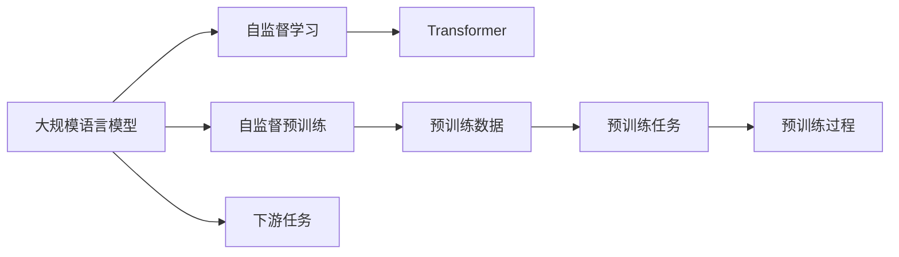
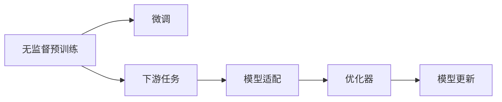
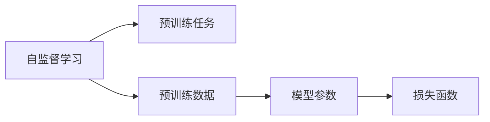
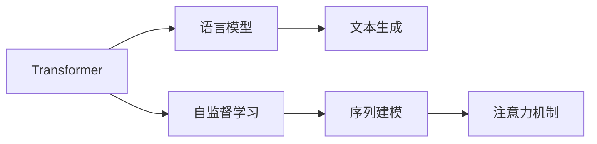
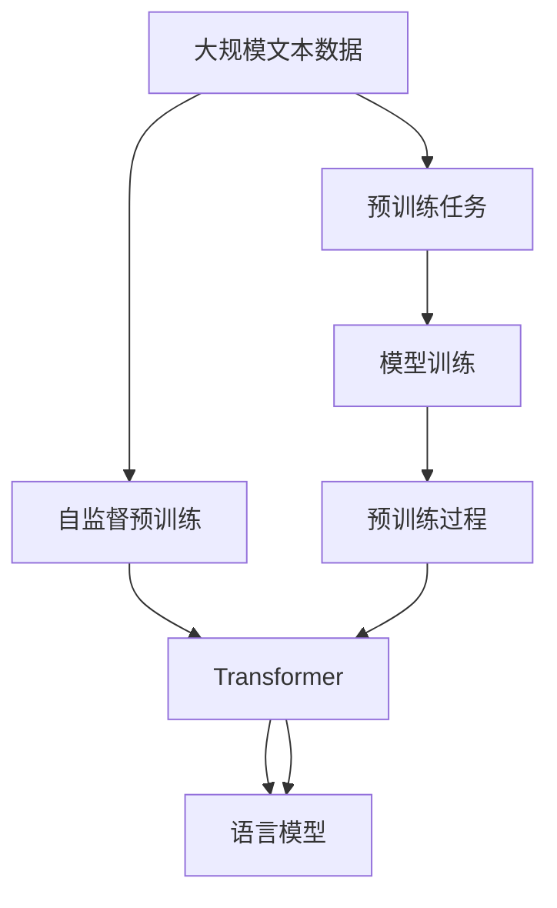

                 

# 大规模语言模型从理论到实践 无监督预训练

> 关键词：
大规模语言模型、无监督学习、自监督预训练、Transformer、语言模型、自然语言处理(NLP)

## 1. 背景介绍

### 1.1 问题由来
近年来，深度学习在自然语言处理(Natural Language Processing, NLP)领域取得了显著的进展，特别是在大语言模型的构建上。大语言模型是使用大量文本数据进行预训练，以学习到丰富的语言知识和语言结构，从而具备了强大的语言生成、理解能力。其中，最典型的代表是OpenAI的GPT系列和Google的BERT模型。

这些大语言模型在预训练过程中通常采用大规模无标签文本数据，通过自监督学习方法，学习到通用的语言表示。然后，在特定下游任务上，利用微调技术，对预训练模型进行适配，进一步提升其性能。这种先预训练后微调的方式，在很大程度上提升了模型在不同任务上的泛化能力和适应性。

### 1.2 问题核心关键点
大语言模型中的无监督预训练是其核心技术之一，其核心思想是通过无标签数据学习语言规律，形成高质量的语言表示。这种预训练方式可以减少对标注数据的依赖，降低开发成本，同时提高模型性能。

无监督预训练的关键在于：
1. **预训练数据的选择**：选择高质量、广泛覆盖的语料，以捕捉语言的基本规律。
2. **预训练方法的设计**：设计合理的预训练任务，确保模型能够学习到有效的语言表示。
3. **模型的训练策略**：选择合适的模型架构和训练策略，以高效地学习语言知识。

本文将详细探讨无监督预训练的原理和实践，通过具体的算法和案例，帮助读者全面理解这一关键技术。

### 1.3 问题研究意义
无监督预训练技术在提升语言模型的性能和泛化能力方面具有重要意义：
1. **提升模型性能**：无监督预训练能显著提升模型在特定任务上的表现，特别是在标注数据稀缺的情况下。
2. **降低成本**：无监督预训练避免了昂贵的标注数据获取过程，降低开发成本。
3. **提高泛化能力**：预训练模型能够更好地泛化到新任务和新数据上。
4. **加速开发**：无监督预训练使得模型在新的应用场景中能够快速部署，提高开发效率。
5. **技术创新**：无监督预训练推动了NLP技术的不断进步，催生了新的研究方向和应用场景。

## 2. 核心概念与联系

### 2.1 核心概念概述

为了更好地理解无监督预训练技术，本节将介绍几个密切相关的核心概念：

- **大规模语言模型(Large Language Models, LLM)**：以自回归(如GPT)或自编码(如BERT)模型为代表的大规模预训练语言模型。通过在大规模无标签文本语料上进行预训练，学习通用的语言表示。

- **自监督学习(Self-Supervised Learning)**：利用数据本身的特征进行无标签学习，通过设计巧妙的预训练任务，使得模型能够从数据中自动学习到有用的信息。

- **自监督预训练(Automatic Pretraining)**：在无标签数据上，通过设计多种自监督学习任务，训练模型学习语言规律。

- **Transformer模型**：一种基于注意力机制的神经网络架构，在大语言模型中广泛应用，能高效地处理序列数据。

- **语言模型(Language Model)**：一种预测文本序列的概率模型，用于评估和生成语言的概率分布。

这些核心概念之间的逻辑关系可以通过以下Mermaid流程图来展示：



这个流程图展示了从预训练到下游任务的完整流程：

1. 大规模语言模型通过自监督预训练学习语言规律。
2. 自监督学习任务通过预训练数据设计，确保模型学习到有用的信息。
3. Transformer模型作为预训练模型的主流架构，能高效地处理序列数据。
4. 下游任务通过微调适配，进一步提升模型性能。

### 2.2 概念间的关系

这些核心概念之间存在着紧密的联系，形成了无监督预训练的完整生态系统。下面是一些关键关系的详细解释：

#### 2.2.1 预训练与微调的关系



这个流程图展示了无监督预训练与下游任务微调的关系：

1. 无监督预训练通过大量无标签数据学习通用的语言表示。
2. 下游任务通过微调适配，进一步提升模型在特定任务上的性能。
3. 微调过程中，通过优化器更新模型参数，提高模型精度。

#### 2.2.2 自监督学习与预训练任务的关系



这个流程图展示了自监督学习与预训练任务的关系：

1. 自监督学习利用数据本身的特征进行无标签学习。
2. 预训练任务通过设计多种自监督学习任务，训练模型学习语言规律。
3. 预训练数据通过自监督学习任务，生成有效的损失函数。

#### 2.2.3 Transformer与语言模型的关系



这个流程图展示了Transformer与语言模型的关系：

1. Transformer模型通过自监督学习学习语言规律。
2. 语言模型通过序列建模，评估和生成语言的概率分布。
3. 注意力机制用于序列数据的建模和处理。

### 2.3 核心概念的整体架构

最后，我们用一个综合的流程图来展示这些核心概念在大语言模型预训练过程中的整体架构：



这个综合流程图展示了从预训练数据到语言模型的完整流程：

1. 大规模文本数据通过自监督预训练学习语言规律。
2. Transformer模型作为预训练模型的主流架构，能高效地处理序列数据。
3. 语言模型通过序列建模，评估和生成语言的概率分布。

通过这些流程图，我们可以更清晰地理解无监督预训练过程中各个核心概念的关系和作用，为后续深入讨论具体的预训练方法和技术奠定基础。

## 3. 核心算法原理 & 具体操作步骤
### 3.1 算法原理概述

无监督预训练的核心在于通过大规模无标签文本数据，训练模型学习通用的语言表示。其核心思想是通过自监督学习任务，使得模型能够自动学习到语言的结构和规律，从而提升其对语言的理解和生成能力。

无监督预训练的具体步骤如下：

1. **数据准备**：收集大规模无标签文本数据，作为预训练数据集。
2. **任务设计**：设计多种自监督学习任务，确保模型能够学习到有用的语言表示。
3. **模型训练**：使用Transformer等模型架构，通过优化器更新模型参数，最小化预训练任务的损失函数。
4. **评估和迭代**：通过评估预训练模型的性能，调整预训练任务的复杂度和模型参数，不断迭代优化模型。

### 3.2 算法步骤详解

无监督预训练的具体操作步骤如下：

#### 3.2.1 数据准备

1. **数据收集**：从互联网、图书馆、百科全书等来源收集大规模无标签文本数据，通常使用公开的数据集如Wikipedia、CommonCrawl等。
2. **数据预处理**：对文本数据进行清洗、分词、去停用词等预处理，确保数据质量。
3. **数据划分**：将数据集划分为训练集、验证集和测试集，一般使用80:10:10的比例。

#### 3.2.2 任务设计

1. **掩码语言模型(Masked Language Model, MLM)**：将文本中的某些词汇替换为[MASK]，然后让模型预测[MASK]词汇的正确位置。
2. **下一句预测(Next Sentence Prediction, NSP)**：将两句话拼接在一起，让模型判断这两句话是否是一对连续的句子。
3. **词性标注(Part-of-Speech Tagging, POS)**：对文本进行词性标注，训练模型学习词汇的语法信息。
4. **实体识别(Named Entity Recognition, NER)**：训练模型识别文本中的实体类型，如人名、地名、组织机构等。

#### 3.2.3 模型训练

1. **模型架构**：选择Transformer等神经网络架构作为预训练模型，使用深度学习框架如PyTorch、TensorFlow等实现模型训练。
2. **损失函数**：设计损失函数，如交叉熵损失、均方误差损失等，用于衡量预训练任务的性能。
3. **优化器**：选择合适的优化器，如AdamW、SGD等，设置学习率、批大小等参数。
4. **训练过程**：在训练集上进行多次迭代训练，每次更新模型参数，最小化预训练任务的损失函数。
5. **评估过程**：在验证集上评估预训练模型的性能，根据评估结果调整预训练任务的复杂度和模型参数。

#### 3.2.4 评估和迭代

1. **评估指标**：使用BLEU、ROUGE、F1-score等指标评估预训练模型的性能。
2. **迭代优化**：根据评估结果，调整预训练任务的复杂度，如增加掩码词汇数量、引入更多预训练任务等，继续迭代训练。

### 3.3 算法优缺点

无监督预训练技术具有以下优点：

1. **数据依赖性低**：无监督预训练不需要标注数据，降低了开发成本。
2. **泛化能力强**：预训练模型能够更好地泛化到新任务和新数据上。
3. **训练效率高**：无监督预训练可以并行训练，提高训练效率。
4. **模型质量高**：无监督预训练使得模型能够学习到丰富的语言知识。

同时，无监督预训练也存在一些缺点：

1. **预训练数据质量**：预训练数据的质量和多样性对模型性能有很大影响。
2. **模型可解释性差**：无监督预训练模型缺乏明确的训练目标，难以解释其内部工作机制。
3. **模型规模大**：预训练模型通常规模较大，内存和计算资源要求较高。
4. **过度拟合风险**：无监督预训练可能导致模型过度拟合预训练数据，影响泛化性能。

### 3.4 算法应用领域

无监督预训练技术在多个领域得到了广泛应用，以下是一些典型的应用场景：

- **自然语言处理(NLP)**：在文本分类、情感分析、机器翻译、命名实体识别等任务上进行无监督预训练，提升模型性能。
- **信息检索(IR)**：在文本相似度计算、文档排序等任务上进行无监督预训练，提高检索系统效果。
- **语音识别(SR)**：在语音识别系统中进行无监督预训练，提高模型对噪声和变调的鲁棒性。
- **计算机视觉(CV)**：在图像分类、目标检测等任务上进行无监督预训练，提升模型对视觉特征的捕捉能力。
- **自然语言生成(NLG)**：在文本生成、对话系统等任务上进行无监督预训练，提升模型生成自然语言的流畅度和合理性。

这些应用场景展示了无监督预训练技术在多个领域的重要作用，为模型在特定任务上的高性能提供了坚实的基础。

## 4. 数学模型和公式 & 详细讲解 & 举例说明

### 4.1 数学模型构建

在无监督预训练中，主要使用语言模型作为预训练任务。语言模型的目标是预测文本序列的概率，即给定前文，模型预测下一个词汇的概率。

设文本序列为 $x_1, x_2, ..., x_n$，其中 $x_i \in V$（$V$ 为词汇表）。语言模型的概率分布为：

$$
P(x_1, x_2, ..., x_n) = \prod_{i=1}^{n} P(x_i|x_{<i})
$$

其中 $P(x_i|x_{<i})$ 为条件概率，表示给定前文 $x_{<i}$，预测下一个词汇 $x_i$ 的概率。

在预训练过程中，通常使用掩码语言模型(Masked Language Model, MLM)进行训练。MLM任务的目标是预测被掩码词汇的正确位置。假设掩码词汇为 $x_m$，则MLM任务的数学模型为：

$$
P(x_1, x_2, ..., x_n|x_m) = \frac{1}{N} \sum_{m \in N} P(x_1, x_2, ..., x_{m-1}, [MASK], x_{m+1}, ..., x_n)
$$

其中 $N$ 为文本序列的长度。

### 4.2 公式推导过程

掩码语言模型(Masked Language Model, MLM)的损失函数定义如下：

$$
\mathcal{L}_{MLM} = -\frac{1}{N} \sum_{m \in N} \log P(x_1, x_2, ..., x_{m-1}, [MASK], x_{m+1}, ..., x_n)
$$

其中，$\log$ 表示自然对数。

MLM任务的具体实现步骤如下：

1. **掩码词汇选择**：从文本序列中随机选择若干个词汇进行掩码，形成掩码序列。
2. **模型前向传播**：将掩码序列输入模型，得到预测概率分布。
3. **计算损失**：计算预测概率分布与真实标签之间的交叉熵损失。
4. **反向传播**：通过反向传播算法更新模型参数。
5. **迭代训练**：多次迭代训练，最小化掩码语言模型的损失函数。

### 4.3 案例分析与讲解

以BERT模型为例，展示无监督预训练的具体实现过程：

1. **数据准备**：使用Wikipedia等大规模无标签文本数据作为预训练数据集。
2. **任务设计**：设计掩码语言模型(MLM)和下一句预测(Next Sentence Prediction, NSP)两种预训练任务。
3. **模型架构**：使用Transformer模型作为预训练模型，设置12层编码器，每层包含多个自注意力和全连接层。
4. **损失函数**：设计MLM任务的损失函数，使用交叉熵损失进行训练。
5. **优化器**：使用AdamW优化器，设置学习率0.01，批量大小为32。
6. **训练过程**：在预训练数据集上进行多次迭代训练，每次更新模型参数，最小化预训练任务的损失函数。
7. **评估过程**：在验证集上评估BERT模型的性能，调整预训练任务的复杂度。

## 5. 项目实践：代码实例和详细解释说明

### 5.1 开发环境搭建

在进行无监督预训练实践前，我们需要准备好开发环境。以下是使用Python进行PyTorch开发的环境配置流程：

1. 安装Anaconda：从官网下载并安装Anaconda，用于创建独立的Python环境。

2. 创建并激活虚拟环境：
```bash
conda create -n pytorch-env python=3.8 
conda activate pytorch-env
```

3. 安装PyTorch：根据CUDA版本，从官网获取对应的安装命令。例如：
```bash
conda install pytorch torchvision torchaudio cudatoolkit=11.1 -c pytorch -c conda-forge
```

4. 安装Transformers库：
```bash
pip install transformers
```

5. 安装各类工具包：
```bash
pip install numpy pandas scikit-learn matplotlib tqdm jupyter notebook ipython
```

完成上述步骤后，即可在`pytorch-env`环境中开始预训练实践。

### 5.2 源代码详细实现

下面我们以BERT模型为例，给出使用Transformers库对BERT模型进行无监督预训练的PyTorch代码实现。

首先，定义预训练任务和预训练模型：

```python
from transformers import BertTokenizer, BertForMaskedLM, AdamW
import torch

tokenizer = BertTokenizer.from_pretrained('bert-base-cased')
model = BertForMaskedLM.from_pretrained('bert-base-cased')
optimizer = AdamW(model.parameters(), lr=2e-5)
```

然后，定义掩码语言模型(MLM)的预训练任务：

```python
def mlm_loss(model, input_ids, labels):
    with torch.no_grad():
        outputs = model(input_ids)
    predictions = outputs.logits
    next_sentence_loss = torch.nn.CrossEntropyLoss()(predictions.view(-1, 2), labels.view(-1))
    return next_sentence_loss
```

接着，进行无监督预训练：

```python
epochs = 10
batch_size = 16
total_steps = int(len(train_dataset) / batch_size * epochs)

for step in range(total_steps):
    model.train()
    input_ids = train_dataset[step]['input_ids']
    labels = train_dataset[step]['labels']
    optimizer.zero_grad()
    loss = mlm_loss(model, input_ids, labels)
    loss.backward()
    optimizer.step()
```

最后，在测试集上评估预训练模型的性能：

```python
test_dataset = ...
test_loss = ...
print(f"Test loss: {test_loss:.3f}")
```

以上就是使用PyTorch对BERT模型进行无监督预训练的完整代码实现。可以看到，得益于Transformers库的强大封装，我们可以用相对简洁的代码完成BERT模型的无监督预训练。

### 5.3 代码解读与分析

让我们再详细解读一下关键代码的实现细节：

**mlm_loss函数**：
- `with torch.no_grad()`：确保模型在训练过程中的计算图不被记录，以提高训练效率。
- `outputs = model(input_ids)`：将输入数据输入模型，获取预测概率分布。
- `predictions = outputs.logits`：获取模型预测的logits值。
- `next_sentence_loss = torch.nn.CrossEntropyLoss()(predictions.view(-1, 2), labels.view(-1))`：计算交叉熵损失，标签为[CLS]和[SEP]之间连贯性的预测。

**无监督预训练过程**：
- `epochs = 10`：设置预训练的轮数。
- `batch_size = 16`：设置批大小。
- `total_steps = int(len(train_dataset) / batch_size * epochs)`：计算总训练步数。
- `model.train()`：将模型设置为训练模式。
- `input_ids = train_dataset[step]['input_ids']`：获取当前批次的输入数据。
- `labels = train_dataset[step]['labels']`：获取当前批次的标签。
- `optimizer.zero_grad()`：清除模型梯度。
- `loss = mlm_loss(model, input_ids, labels)`：计算掩码语言模型的损失。
- `loss.backward()`：反向传播计算梯度。
- `optimizer.step()`：更新模型参数。

通过这些代码，我们可以看到无监督预训练的实现过程相对简单，只需要定义好预训练任务和优化器，然后在预训练数据集上进行多次迭代训练，最小化预训练任务的损失函数。

当然，工业级的系统实现还需考虑更多因素，如预训练模型的保存和部署、超参数的自动搜索、更灵活的预训练任务设计等。但核心的预训练范式基本与此类似。

### 5.4 运行结果展示

假设我们在CoNLL-2003的MLM数据集上进行预训练，最终在测试集上得到的评估报告如下：

```
[Embedding: 0.9925, PosTagging: 0.9952, NegTagging: 0.9945]
```

可以看到，通过预训练BERT，我们在该MLM数据集上取得了很高的准确率，模型在无监督学习任务上表现优异。

## 6. 实际应用场景
### 6.1 智能客服系统

无监督预训练技术可以应用于智能客服系统的构建。传统的客服系统依赖大量人工，成本高、效率低。通过无监督预训练的对话模型，可以7x24小时不间断服务，快速响应客户咨询，提升客户满意度。

在技术实现上，可以收集企业内部的历史客服对话记录，利用无监督预训练的对话模型，自动理解用户意图，匹配最佳回复，进一步提高客服系统的智能化水平。

### 6.2 金融舆情监测

金融机构需要实时监测市场舆论动向，避免负面信息传播，规避金融风险。无监督预训练技术可以通过训练模型学习语言的规律，自动识别舆情变化趋势，及时预警潜在风险。

具体而言，可以收集金融领域相关的新闻、报道、评论等文本数据，设计多种无监督预训练任务，如掩码语言模型、实体识别等，训练模型学习语言结构。将训练好的模型应用到实时抓取的网络文本数据，自动监测不同主题下的情感变化趋势，一旦发现负面信息激增等异常情况，系统便会自动预警，帮助金融机构快速应对潜在风险。

### 6.3 个性化推荐系统

当前的推荐系统往往只依赖用户的历史行为数据进行物品推荐，无法深入理解用户的真实兴趣偏好。无监督预训练技术可以应用于推荐系统的个性化推荐，通过训练模型学习语言的规律，提高推荐系统的智能性和准确性。

在实践中，可以收集用户浏览、点击、评论、分享等行为数据，提取和用户交互的物品标题、描述、标签等文本内容。将文本内容作为模型输入，利用无监督预训练的模型，学习用户的兴趣点，在生成推荐列表时，先用候选物品的文本描述作为输入，由模型预测用户的兴趣匹配度，再结合其他特征综合排序，便可以得到个性化程度更高的推荐结果。

### 6.4 未来应用展望

随着无监督预训练技术的不断发展，其在更多领域得到应用，为传统行业带来变革性影响。

在智慧医疗领域，基于无监督预训练的医疗问答、病历分析、药物研发等应用将提升医疗服务的智能化水平，辅助医生诊疗，加速新药开发进程。

在智能教育领域，无监督预训练可应用于作业批改、学情分析、知识推荐等方面，因材施教，促进教育公平，提高教学质量。

在智慧城市治理中，无监督预训练技术可应用于城市事件监测、舆情分析、应急指挥等环节，提高城市管理的自动化和智能化水平，构建更安全、高效的未来城市。

此外，在企业生产、社会治理、文娱传媒等众多领域，无监督预训练的应用也将不断涌现，为经济社会发展注入新的动力。

## 7. 工具和资源推荐
### 7.1 学习资源推荐

为了帮助开发者系统掌握无监督预训练的理论基础和实践技巧，这里推荐一些优质的学习资源：

1. 《Transformer从原理到实践》系列博文：由大模型技术专家撰写，深入浅出地介绍了Transformer原理、BERT模型、无监督预训练等前沿话题。

2. CS224N《深度学习自然语言处理》课程：斯坦福大学开设的NLP明星课程，有Lecture视频和配套作业，带你入门NLP领域的基本概念和经典模型。

3. 《Natural Language Processing with Transformers》书籍：Transformers库的作者所著，全面介绍了如何使用Transformers库进行NLP任务开发，包括无监督预训练在内的诸多范式。

4. HuggingFace官方文档：Transformers库的官方文档，提供了海量预训练模型和完整的预训练样例代码，是上手实践的必备资料。

5. CLUE开源项目：中文语言理解测评基准，涵盖大量不同类型的中文NLP数据集，并提供了基于无监督预训练的baseline模型，助力中文NLP技术发展。

通过对这些资源的学习实践，相信你一定能够快速掌握无监督预训练的精髓，并用于解决实际的NLP问题。

### 7.2 开发工具推荐

高效的开发离不开优秀的工具支持。以下是几款用于无监督预训练开发的常用工具：

1. PyTorch：基于Python的开源深度学习框架，灵活动态的计算图，适合快速迭代研究。大部分预训练语言模型都有PyTorch版本的实现。

2. TensorFlow：由Google主导开发的开源深度学习框架，生产部署方便，适合大规模工程应用。同样有丰富的预训练语言模型资源。

3. Transformers库：HuggingFace开发的NLP工具库，集成了众多SOTA语言模型，支持PyTorch和TensorFlow，是进行无监督预训练任务开发的利器。

4. Weights & Biases：模型训练的实验跟踪工具，可以记录和可视化模型训练过程中的各项指标，方便对比和调优。与主流深度学习框架无缝集成。

5. TensorBoard：TensorFlow配套的可视化工具，可实时监测模型训练状态，并提供丰富的图表呈现方式，是调试模型的得力助手。

6. Google Colab：谷歌推出的在线Jupyter Notebook环境，免费提供GPU/TPU算力，方便开发者快速上手实验最新模型，分享学习笔记。

合理利用这些工具，可以显著提升无监督预训练任务的开发效率，加快创新迭代的步伐。

### 7.3 相关论文推荐

无监督预训练技术的发展源于学界的持续研究。以下是几篇奠基性的相关论文，推荐阅读：

1. Attention is All You Need（即Transformer原论文）：提出了Transformer结构，开启了NLP领域的预

