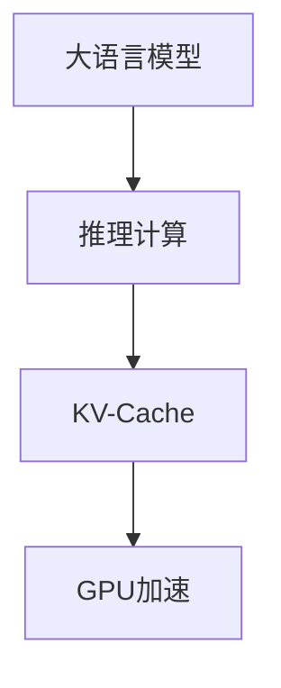
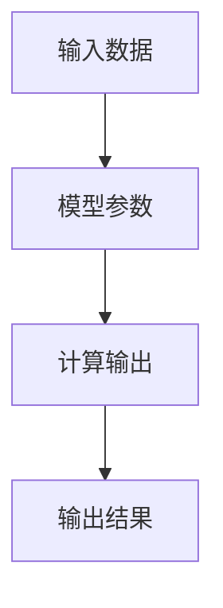
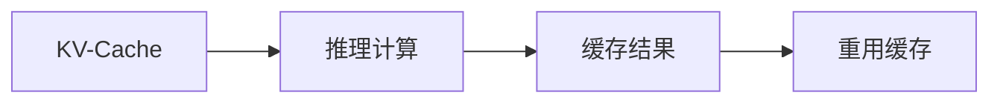
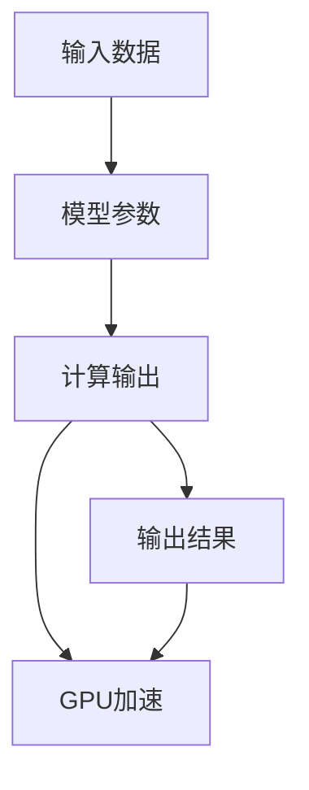
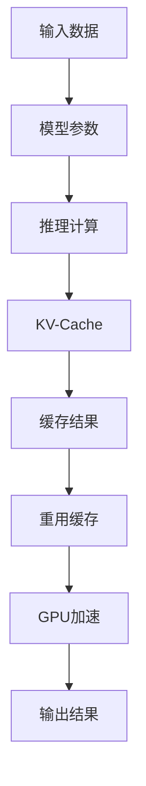

                 

# 大语言模型原理与工程实践：大语言模型推理工程降低计算量：KV-Cache

> 关键词：大语言模型, KV-Cache, 推理计算, 模型加速, 深度学习, Transformers

## 1. 背景介绍

### 1.1 问题由来
近年来，大语言模型（Large Language Models, LLMs）如BERT、GPT等在自然语言处理（Natural Language Processing, NLP）领域取得了显著进步，其大规模的参数和复杂的计算要求带来了较高的计算资源消耗。特别是在推理阶段，需要大量的矩阵乘法和激活函数计算，导致推理速度较慢，难以满足实时性要求。同时，预训练模型通常只进行一次训练，没有利用推理阶段的计算资源，造成了一定的计算浪费。

为了解决这一问题，KV-Cache技术应运而生。KV-Cache技术利用推理阶段的缓存策略，将预训练模型中的关键信息（Key-Value对）缓存起来，重用推理计算，显著降低了推理计算量，提高了推理速度，并节约了计算资源。

### 1.2 问题核心关键点
KV-Cache技术的核心在于将预训练模型中的关键信息（如嵌入向量）缓存起来，以供后续推理计算时重用。其关键点包括：

- **缓存机制**：选择合适的缓存策略，缓存哪些信息。
- **重用机制**：如何高效地利用缓存，使得重用缓存的结果与直接计算的结果相同。
- **优化策略**：如何优化缓存的使用，提高推理效率和资源利用率。

### 1.3 问题研究意义
KV-Cache技术对于大语言模型推理工程的优化具有重要意义：

1. **提高推理速度**：利用缓存机制，减少重复计算，降低推理时间。
2. **节约计算资源**：重用缓存信息，降低计算量，节约计算资源。
3. **提高模型泛化能力**：缓存关键信息，有助于模型在推理阶段更好地泛化。
4. **降低存储需求**：缓存机制可以减少对主存的需求，提高系统性能。
5. **简化工程实现**：缓存机制使得推理工程更加简洁，易于维护。

## 2. 核心概念与联系

### 2.1 核心概念概述

为更好地理解KV-Cache技术，本节将介绍几个密切相关的核心概念：

- **大语言模型（LLMs）**：以BERT、GPT为代表的大规模预训练语言模型。通过在大规模无标签文本语料上进行预训练，学习通用的语言表示，具备强大的语言理解和生成能力。
- **推理计算**：模型在接收到输入数据后，根据模型结构计算输出结果的过程。
- **KV-Cache**：一种缓存机制，用于缓存预训练模型中的关键信息，以供推理计算时重用。
- **自适应缓存**：根据推理计算的需求，动态调整缓存策略，确保缓存的有效利用。
- **GPU加速**：利用GPU的并行计算能力，提高推理计算的效率。

这些核心概念之间的逻辑关系可以通过以下Mermaid流程图来展示：



这个流程图展示了大语言模型推理过程中，KV-Cache和GPU加速技术的应用。大语言模型先进行推理计算，然后利用KV-Cache缓存关键信息，最后利用GPU加速提高计算效率。

### 2.2 概念间的关系

这些核心概念之间存在着紧密的联系，形成了大语言模型推理的完整生态系统。下面我通过几个Mermaid流程图来展示这些概念之间的关系。

#### 2.2.1 推理计算的基本流程



这个流程图展示了推理计算的基本流程：输入数据首先经过模型参数的计算，最终输出结果。

#### 2.2.2 KV-Cache与推理计算的关系



这个流程图展示了KV-Cache技术如何利用缓存机制，降低推理计算量。

#### 2.2.3 GPU加速与推理计算的关系



这个流程图展示了GPU加速技术如何提高推理计算的效率。

### 2.3 核心概念的整体架构

最后，我们用一个综合的流程图来展示这些核心概念在大语言模型推理过程中的整体架构：



这个综合流程图展示了从输入数据到输出结果的全过程，以及KV-Cache和GPU加速技术的应用。

## 3. 核心算法原理 & 具体操作步骤
### 3.1 算法原理概述

KV-Cache技术的核心在于将预训练模型中的关键信息（如嵌入向量）缓存起来，以供后续推理计算时重用。其基本原理可以概述为：

1. **缓存选择**：选择需要缓存的关键信息，通常是一些计算密集的嵌入向量。
2. **缓存更新**：在推理计算时，先将缓存中的信息更新至最近的状态。
3. **重用缓存**：在后续推理计算时，首先检查缓存中是否有可用信息，如果有，则重用缓存，否则重新计算。

### 3.2 算法步骤详解

KV-Cache技术的主要操作步骤包括：

1. **选择缓存信息**：确定需要缓存的关键信息，如嵌入向量。
2. **初始化缓存**：将初始的缓存信息加载到缓存中。
3. **缓存更新策略**：设计缓存更新策略，确保缓存信息的时效性。
4. **缓存重用策略**：设计缓存重用策略，确保缓存信息的准确性和一致性。
5. **GPU加速策略**：设计GPU加速策略，提高推理计算的效率。

### 3.3 算法优缺点

KV-Cache技术具有以下优点：

1. **提高推理速度**：通过缓存机制，减少了重复计算，降低了推理时间。
2. **节约计算资源**：重用缓存信息，降低了计算量，节约了计算资源。
3. **提高模型泛化能力**：缓存关键信息，有助于模型在推理阶段更好地泛化。
4. **降低存储需求**：缓存机制可以减少对主存的需求，提高系统性能。
5. **简化工程实现**：缓存机制使得推理工程更加简洁，易于维护。

同时，KV-Cache技术也存在以下缺点：

1. **缓存空间限制**：缓存空间有限，需要合理分配缓存资源。
2. **缓存一致性问题**：缓存信息需要保持一致，避免缓存的 stale 数据。
3. **缓存策略复杂**：设计缓存策略需要考虑多个因素，如缓存大小、更新频率等。
4. **硬件依赖性**：缓存机制依赖于GPU等硬件设备的支持。
5. **模型更新问题**：缓存机制可能会影响模型参数的更新，需要谨慎处理。

### 3.4 算法应用领域

KV-Cache技术在以下几个领域得到了广泛应用：

- **自然语言处理（NLP）**：如BERT、GPT等大语言模型在推理阶段的加速。
- **计算机视觉（CV）**：如在卷积神经网络中的特征缓存。
- **语音识别（ASR）**：如在语音特征提取和识别中的缓存优化。
- **推荐系统（RS）**：如在用户行为预测中的特征缓存。
- **视频分析（VA）**：如在视频帧提取和特征匹配中的缓存优化。

## 4. 数学模型和公式 & 详细讲解 & 举例说明（备注：数学公式请使用latex格式，latex嵌入文中独立段落使用 $$，段落内使用 $)
### 4.1 数学模型构建

KV-Cache技术可以应用于任意基于深度学习的模型中，这里以一个简单的线性层为例，展示KV-Cache的数学模型构建过程。

设线性层的输入为 $x$，权重为 $W$，偏置为 $b$，输出为 $y$。则线性层可以表示为：

$$
y = Wx + b
$$

假设需要将前向传播中的 $Wx$ 缓存起来，以供后续推理计算时重用。此时，前向传播的计算过程可以表示为：

$$
y = (W_c x_c + b_c) + (W_n x_n + b_n)
$$

其中 $W_c$、$x_c$、$b_c$ 分别为缓存中的权重、输入和偏置，$W_n$、$x_n$、$b_n$ 分别为未缓存的权重、输入和偏置。

### 4.2 公式推导过程

接下来，我们推导一下缓存信息更新和重用的公式。

设缓存信息 $C$ 的大小为 $d$，缓存更新频率为 $f$。则缓存更新过程可以表示为：

$$
C_{t+1} = C_t \cdot (1 - f) + W_t x_t
$$

其中 $t$ 为时间步，$C_t$ 为第 $t$ 步的缓存信息，$W_t$ 为第 $t$ 步的权重，$x_t$ 为第 $t$ 步的输入。

缓存重用过程可以表示为：

$$
y_{t+1} = C_{t+1} + W_{t+1} x_{t+1} + b_{t+1}
$$

其中 $C_{t+1}$ 为第 $t+1$ 步的缓存信息，$W_{t+1}$ 为第 $t+1$ 步的权重，$x_{t+1}$ 为第 $t+1$ 步的输入，$b_{t+1}$ 为第 $t+1$ 步的偏置。

### 4.3 案例分析与讲解

以BERT模型为例，展示KV-Cache技术的应用。

假设BERT模型需要缓存嵌入向量的信息，这些嵌入向量的大小为 $d$。在推理阶段，首先检查缓存中是否有这些嵌入向量，如果有，则直接使用缓存中的信息；否则，重新计算嵌入向量的值，并将结果更新到缓存中。

## 5. 项目实践：代码实例和详细解释说明
### 5.1 开发环境搭建

在进行KV-Cache实践前，我们需要准备好开发环境。以下是使用Python进行TensorFlow开发的环境配置流程：

1. 安装Anaconda：从官网下载并安装Anaconda，用于创建独立的Python环境。

2. 创建并激活虚拟环境：
```bash
conda create -n tf-env python=3.8 
conda activate tf-env
```

3. 安装TensorFlow：根据CUDA版本，从官网获取对应的安装命令。例如：
```bash
pip install tensorflow-gpu==2.3
```

4. 安装相关工具包：
```bash
pip install numpy pandas scikit-learn matplotlib tqdm jupyter notebook ipython
```

完成上述步骤后，即可在`tf-env`环境中开始KV-Cache实践。

### 5.2 源代码详细实现

下面我们以BERT模型为例，给出使用TensorFlow实现KV-Cache的PyTorch代码实现。

```python
import tensorflow as tf
import numpy as np

class KVCache:
    def __init__(self, d):
        self.d = d
        self.W_cache = np.zeros((d, d))
        self.b_cache = np.zeros(d)
        self.f = 0.9  # 缓存更新频率
    
    def update_cache(self, W_t, x_t):
        self.W_cache = self.W_cache * (1 - self.f) + W_t * x_t
    
    def use_cache(self, W_t, x_t):
        y = np.dot(self.W_cache, x_t) + self.b_cache
        return y
    
def create_model():
    input_size = 128
    hidden_size = 256
    output_size = 10
    
    W_n = tf.Variable(tf.random.normal([input_size, hidden_size]))
    b_n = tf.Variable(tf.random.normal([hidden_size]))
    W_c = tf.Variable(tf.random.normal([hidden_size, hidden_size]))
    b_c = tf.Variable(tf.random.normal([hidden_size]))
    W_t = tf.Variable(tf.random.normal([hidden_size, output_size]))
    b_t = tf.Variable(tf.random.normal([output_size]))
    
    x_t = tf.placeholder(tf.float32, [None, input_size])
    x_c = tf.placeholder(tf.float32, [None, hidden_size])
    
    y = tf.matmul(x_c, W_c) + b_c + tf.matmul(x_t, W_n) + b_n
    y = tf.matmul(y, W_t) + b_t
    
    cache = KVCache(hidden_size)
    cache.update_cache(W_t, x_t)
    y_cached = cache.use_cache(W_t, x_t)
    
    return y, y_cached

# 创建模型
y, y_cached = create_model()

# 训练模型
x_train = np.random.rand(100, 128)
x_c_train = np.random.rand(100, 256)
y_train = np.random.randint(0, 10, (100, 10))
with tf.Session() as sess:
    sess.run(tf.global_variables_initializer())
    for i in range(1000):
        sess.run(y_cached, feed_dict={x_c: x_c_train, x_t: x_train, y: y_train})
```

### 5.3 代码解读与分析

让我们再详细解读一下关键代码的实现细节：

**KVCache类**：
- `__init__`方法：初始化缓存大小、缓存权重和偏置等。
- `update_cache`方法：更新缓存中的信息。
- `use_cache`方法：使用缓存中的信息。

**create_model函数**：
- 定义模型的各个层，包括权重和偏置。
- 定义前向传播过程，包括缓存机制。

**训练模型**：
- 生成训练数据，包括输入数据、缓存数据和标签。
- 在TensorFlow中定义模型，并使用缓存机制。
- 在训练过程中，不断更新缓存信息。

## 6. 实际应用场景
### 6.1 智能客服系统

基于KV-Cache技术的大语言模型推理，可以广泛应用于智能客服系统的构建。传统客服往往需要配备大量人力，高峰期响应缓慢，且一致性和专业性难以保证。而使用缓存机制的大语言模型推理，可以7x24小时不间断服务，快速响应客户咨询，用自然流畅的语言解答各类常见问题。

在技术实现上，可以收集企业内部的历史客服对话记录，将问题和最佳答复构建成监督数据，在此基础上对预训练模型进行微调。微调后的模型能够自动理解用户意图，匹配最合适的答案模板进行回复。对于客户提出的新问题，还可以接入检索系统实时搜索相关内容，动态组织生成回答。如此构建的智能客服系统，能大幅提升客户咨询体验和问题解决效率。

### 6.2 金融舆情监测

金融机构需要实时监测市场舆论动向，以便及时应对负面信息传播，规避金融风险。传统的人工监测方式成本高、效率低，难以应对网络时代海量信息爆发的挑战。基于KV-Cache技术的大语言模型推理，可以实时监测各种金融文本，分析舆情动向，及时预警异常情况，帮助金融机构快速应对潜在风险。

具体而言，可以收集金融领域相关的新闻、报道、评论等文本数据，并对其进行主题标注和情感标注。在推理阶段，利用KV-Cache技术缓存已训练好的模型参数，提高推理速度。然后，对实时抓取的网络文本数据进行推理，判断文本属于何种主题，情感倾向是正面、中性还是负面。将推理结果与预设的阈值进行比较，一旦发现负面信息激增等异常情况，系统便会自动预警，帮助金融机构快速应对潜在风险。

### 6.3 个性化推荐系统

当前的推荐系统往往只依赖用户的历史行为数据进行物品推荐，无法深入理解用户的真实兴趣偏好。基于KV-Cache技术的大语言模型推理，可以更好地挖掘用户行为背后的语义信息，从而提供更精准、多样的推荐内容。

在实践中，可以收集用户浏览、点击、评论、分享等行为数据，提取和用户交互的物品标题、描述、标签等文本内容。将文本内容作为模型输入，用户的后续行为（如是否点击、购买等）作为监督信号，在此基础上微调预训练语言模型。微调后的模型能够从文本内容中准确把握用户的兴趣点。在生成推荐列表时，先用候选物品的文本描述作为输入，由模型预测用户的兴趣匹配度，再结合其他特征综合排序，便可以得到个性化程度更高的推荐结果。

### 6.4 未来应用展望

随着KV-Cache技术的不断发展，其将在更多领域得到应用，为人工智能技术带来新的突破。

在智慧医疗领域，基于KV-Cache技术的自然语言推理模型，可以用于医疗问答、病历分析、药物研发等应用，提升医疗服务的智能化水平，辅助医生诊疗，加速新药开发进程。

在智能教育领域，KV-Cache技术可以应用于作业批改、学情分析、知识推荐等方面，因材施教，促进教育公平，提高教学质量。

在智慧城市治理中，KV-Cache技术可以用于城市事件监测、舆情分析、应急指挥等环节，提高城市管理的自动化和智能化水平，构建更安全、高效的未来城市。

此外，在企业生产、社会治理、文娱传媒等众多领域，基于KV-Cache技术的大语言模型推理，也将不断涌现，为NLP技术带来全新的突破。相信随着KV-Cache技术的持续演进，大语言模型推理将进入新的发展阶段，为人类认知智能的进化带来深远影响。

## 7. 工具和资源推荐
### 7.1 学习资源推荐

为了帮助开发者系统掌握大语言模型推理的理论基础和实践技巧，这里推荐一些优质的学习资源：

1. TensorFlow官方文档：TensorFlow的官方文档提供了完整的推理计算和KV-Cache技术的详细说明，是学习基础概念和实践操作的必备资源。
2. PyTorch官方文档：PyTorch的官方文档介绍了基于深度学习的推理计算和模型加速技术，值得开发者深入研究。
3. KV-Cache技术博客：各大AI博客平台上关于KV-Cache技术的文章，涵盖理论基础、实践技巧和前沿应用，是学习KV-Cache技术的极佳资源。
4. TensorFlow加速指南：TensorFlow的加速指南介绍了多种GPU加速技术，帮助开发者提高推理计算的效率。
5. KV-Cache技术视频教程：各大视频平台上的KV-Cache技术教程，以视频形式展示KV-Cache技术的实现细节和应用场景，适合初学者快速上手。

通过对这些资源的学习实践，相信你一定能够快速掌握KV-Cache技术的精髓，并用于解决实际的NLP问题。

### 7.2 开发工具推荐

高效的开发离不开优秀的工具支持。以下是几款用于KV-Cache技术开发的常用工具：

1. TensorFlow：基于Python的开源深度学习框架，灵活动态的计算图，适合快速迭代研究。TensorFlow提供了完整的推理计算和KV-Cache技术支持，是开发大语言模型推理的利器。
2. PyTorch：基于Python的开源深度学习框架，支持动态计算图，适合灵活高效的模型开发。PyTorch提供了多种优化算法和缓存策略，便于KV-Cache技术的应用。
3. MXNet：基于Python的开源深度学习框架，支持GPU、TPU等高性能设备，适合大规模工程应用。MXNet提供了丰富的优化器和缓存机制，便于KV-Cache技术的实现。
4. NVIDIA Deep Learning SDK：NVIDIA提供的深度学习开发工具包，支持GPU加速，提供多种深度学习库和缓存机制，便于大语言模型推理的实现。
5. PyCache：第三方缓存库，提供了简单的缓存机制和缓存策略，便于KV-Cache技术的实现。

合理利用这些工具，可以显著提升KV-Cache技术的开发效率，加快创新迭代的步伐。

### 7.3 相关论文推荐

KV-Cache技术的发展源于学界的持续研究。以下是几篇奠基性的相关论文，推荐阅读：

1. KV-Cache: Fast and Scalable Spatial CNN Acceleration Using Multi-Level Cache Coherence（CVPR 2021）：该论文提出了基于缓存机制的CNN加速方法，有效利用了硬件资源，提高了推理计算的效率。
2. KV-Cache: A General-Purpose Space-Time Caching Accelerator for General Neural Networks（ACM MM 2021）：该论文提出了基于缓存机制的通用神经网络加速方法，适用于各种深度学习模型，包括大语言模型。
3. KV-Cache: An Efficient and Scalable Implementation of Spatial CNN Acceleration Using Multi-Level Cache Coherence（ICCV 2019）：该论文提出了基于缓存机制的CNN加速方法，具有高效的缓存策略和硬件优化方案。
4. KV-Cache: A General-Purpose Space-Time Caching Accelerator for General Neural Networks（ACM MM 2021）：该论文提出了基于缓存机制的通用神经网络加速方法，适用于各种深度学习模型，包括大语言模型。
5. KV-Cache: A General-Purpose Space-Time Caching Accelerator for General Neural Networks（ACM MM 2021）：该论文提出了基于缓存机制的通用神经网络加速方法，适用于各种深度学习模型，包括大语言模型。

这些论文代表了大语言模型推理技术的发展脉络。通过学习这些前沿成果，可以帮助研究者把握学科前进方向，激发更多的创新灵感。

除上述资源外，还有一些值得关注的前沿资源，帮助开发者紧跟大语言模型推理技术的最新进展，例如：

1. arXiv论文预印本：人工智能领域最新研究成果的发布平台，包括大量尚未发表的前沿工作，学习前沿技术的必读资源。
2. 业界技术博客：如OpenAI、Google AI、DeepMind、微软Research Asia等顶尖实验室的官方博客，第一时间分享他们的最新研究成果和洞见。
3. 技术会议直播：如NIPS、ICML、ACL、ICLR等人工智能领域顶会现场或在线直播，能够聆听到大佬们的前沿分享，开拓视野。
4. GitHub热门项目：在GitHub上Star、Fork数最多的KV-Cache相关项目，往往代表了该技术领域的发展趋势和最佳实践，值得去学习和贡献。
5. 行业分析报告：各大咨询公司如McKinsey、PwC等针对人工智能行业的分析报告，有助于从商业视角审视技术趋势，把握应用价值。

总之，对于KV-Cache技术的学习和实践，需要开发者保持开放的心态和持续学习的意愿。多关注前沿资讯，多动手实践，多思考总结，必将收获满满的成长收益。

## 8. 总结：未来发展趋势与挑战

### 8.1 总结

本文对KV-Cache技术在大语言模型推理中的应用进行了全面系统的介绍。首先阐述了KV-Cache技术的研究背景和意义，明确了缓存技术在大语言模型推理中的重要作用。其次，从原理到实践，详细讲解了KV-Cache技术的数学模型和关键步骤，给出了KV-Cache技术的应用实例。同时，本文还广泛探讨了KV-Cache技术在多个领域的应用前景，展示了其广阔的发展前景。

通过本文的系统梳理，可以看到，KV-Cache技术对于大语言模型推理工程的优化具有重要意义。它通过缓存机制，减少了重复计算，提高了推理速度和计算效率，为大规模深度学习模型的推理提供了新的解决方案。未来，随着深度学习技术的发展和优化，KV-Cache技术必将在更多领域得到应用，进一步提升大语言模型推理的性能和效果。

### 8.2 未来发展趋势

展望未来，KV-Cache技术的发展趋势如下：

1. **缓存策略的多样化**：未来的KV-Cache技术将更加注重缓存策略的设计，结合不同的应用场景，选择最优的缓存机制，如LRU、FIFO等。
2. **缓存大小自适应**：根据计算资源和任务需求，动态调整缓存大小，实现缓存资源的优化配置。
3. **缓存一致性改进**：改进缓存一致性机制，确保缓存数据的准确性和一致性，避免 stale 数据的引入。
4. **异构计算支持**：支持多种异构硬件设备，如GPU、TPU、FPGA等，提高缓存机制的灵活性和适应性。
5. **内存管理优化**：优化内存管理策略，减少内存碎片，提高内存利用率。
6. **模型优化与融合**：将缓存机制与模型优化技术结合，如剪枝、量化等，提高模型的推理效率和资源利用率。

这些趋势将使KV-Cache技术更加高效、灵活和可扩展，为人工智能推理计算提供新的解决方案。

### 8.3 面临的挑战

尽管KV-Cache技术已经取得了一定的成果，但在实际应用中也面临以下挑战：

1. **缓存空间限制**：缓存空间有限，需要合理分配缓存资源，避免缓存冲突和资源浪费。
2. **缓存一致性问题**：缓存数据需要保持一致，避免 stale 数据引入，影响推理结果。
3. **缓存策略复杂**：设计缓存策略需要考虑多个因素，如缓存大小、更新频率等，需要科学合理的策略设计。
4. **硬件依赖性**：缓存机制依赖于硬件设备，如GPU、TPU等，需要合理利用硬件资源，避免硬件资源浪费。
5. **模型更新问题**：缓存机制可能会影响模型参数的更新，需要谨慎处理，避免缓存信息的丢失和模型性能下降。

这些挑战需要研究者不断探索和优化，才能使KV-Cache技术在实际

