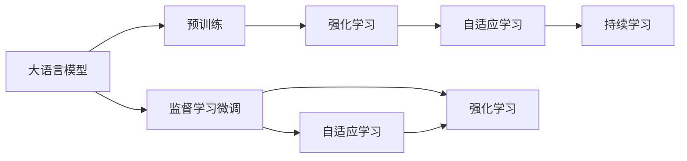
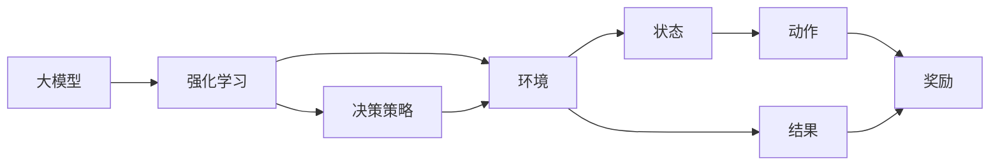
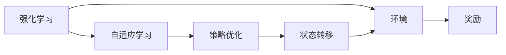
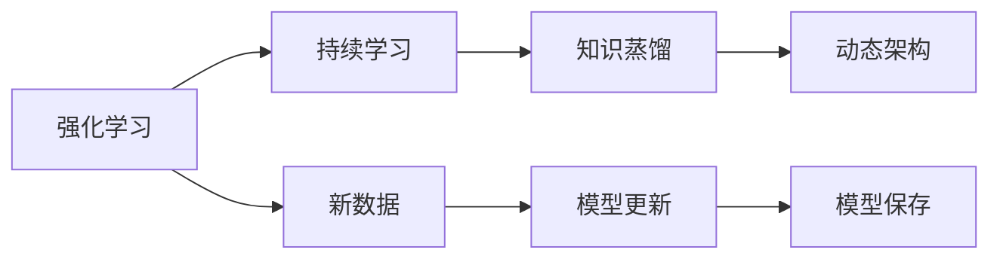
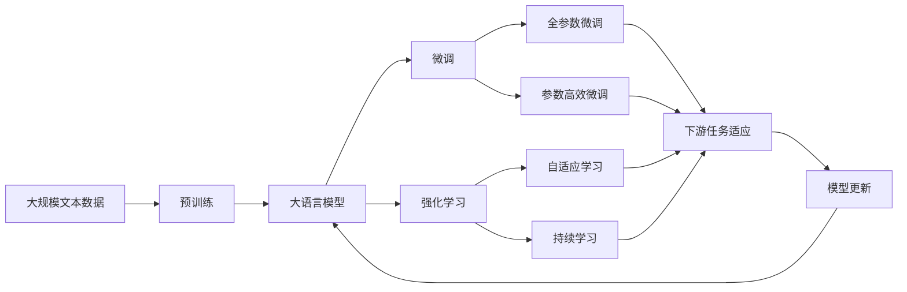

                 

# 大语言模型原理与工程实践：揭秘大语言模型中的强化建模

## 1. 背景介绍

### 1.1 问题由来

近年来，大语言模型（Large Language Models, LLMs）在自然语言处理（NLP）领域取得了飞速发展。深度学习技术使得这些模型能够通过在海量文本数据上的预训练，学习到丰富的语言表示，从而具备强大的语言理解和生成能力。然而，预训练模型通常只关注通用语言特征的提取，难以充分捕捉特定领域的复杂语言现象。因此，如何在大模型基础上，针对特定任务进行优化和微调，成为了研究的热点。

强化建模（Reinforcement Learning, RL）作为一种强大的优化方法，在自动驾驶、游戏AI等高维度决策任务中展现出了其优越性。将其应用到语言模型中，通过与环境的交互，自适应地学习优化策略，有望显著提升模型的任务适应能力和泛化能力。本文将详细介绍大语言模型中的强化建模原理与工程实践，探讨其在NLP任务中的潜力和应用场景。

### 1.2 问题核心关键点

强化建模在语言模型中的应用主要体现在以下几个方面：

- **目标定义**：将自然语言处理任务定义为强化学习问题，通过定义合适的奖励函数和目标状态，使模型学习如何逐步优化预测结果。
- **环境设计**：构建或模拟自然语言处理任务所涉及的环境，使得模型能够在虚拟环境中进行训练。
- **策略优化**：采用适当的算法，如Q-learning、SARSA、深度Q网络（DQN）等，通过与环境交互，不断优化模型的预测策略。
- **评估与优化**：在验证集上评估模型性能，通过不断调整策略参数，提升模型对特定任务的适应能力。

强化建模的核心思想是通过与环境的交互，通过不断的试错和优化，逐步提升模型在特定任务上的表现。相比于传统监督学习的微调方法，强化建模在应对复杂多变的数据分布时具有更强的适应性。

### 1.3 问题研究意义

强化建模在大语言模型中的应用，对于拓展大模型的应用范围，提升下游任务的性能，加速NLP技术的产业化进程，具有重要意义：

1. **降低应用开发成本**：通过强化建模，可以显著减少从头开发所需的数据、计算和人力等成本投入。
2. **提升模型效果**：强化建模使得通用大模型更好地适应特定任务，在应用场景中取得更优表现。
3. **加速开发进度**：standing on the shoulders of giants，强化建模使得开发者可以更快地完成任务适配，缩短开发周期。
4. **带来技术创新**：强化建模范式促进了对预训练-微调的深入研究，催生了自适应学习、持续学习等新的研究方向。
5. **赋能产业升级**：强化建模使得NLP技术更容易被各行各业所采用，为传统行业数字化转型升级提供新的技术路径。

## 2. 核心概念与联系

### 2.1 核心概念概述

为更好地理解大语言模型中的强化建模方法，本节将介绍几个密切相关的核心概念：

- **大语言模型（LLMs）**：以自回归（如GPT）或自编码（如BERT）模型为代表的大规模预训练语言模型。通过在大规模无标签文本数据上进行预训练，学习通用的语言表示，具备强大的语言理解和生成能力。

- **强化学习（RL）**：通过与环境交互，通过不断的试错和优化，逐步提升决策能力的学习范式。强化学习广泛应用于自动驾驶、游戏AI等高维度决策任务中。

- **大模型与强化学习（RL）的结合**：将强化学习范式应用到预训练大模型中，通过与特定任务的交互，自适应地学习优化策略，提升模型在特定任务上的表现。

- **自适应学习**：通过强化学习范式，大模型能够在特定任务上自适应地优化预测策略，提升模型的泛化能力。

- **持续学习**：强化模型能够在不断积累新数据的过程中，保持模型的性能和泛化能力，避免灾难性遗忘。

这些核心概念之间的逻辑关系可以通过以下Mermaid流程图来展示：



这个流程图展示了从预训练到强化学习的完整过程，以及其与监督学习微调方法的关系：

1. 大语言模型通过预训练获得基础能力。
2. 强化学习通过与环境的交互，自适应地学习优化策略。
3. 自适应学习能够在大模型基础上，提升模型对特定任务的适应能力。
4. 持续学习使得模型能够不断学习新知识，同时保持已学习的知识，避免遗忘旧知识。
5. 监督学习微调方法在大模型基础上，进一步优化模型在特定任务上的表现。

这些概念共同构成了大语言模型的学习和应用框架，使其能够在各种场景下发挥强大的语言理解和生成能力。通过理解这些核心概念，我们可以更好地把握大语言模型的工作原理和优化方向。

### 2.2 概念间的关系

这些核心概念之间存在着紧密的联系，形成了大语言模型的学习和应用生态系统。下面我们通过几个Mermaid流程图来展示这些概念之间的关系。

#### 2.2.1 大模型与强化学习的关系



这个流程图展示了大模型与强化学习的基本过程：

1. 大模型在特定任务的环境中进行交互。
2. 环境根据大模型的预测输出，提供状态的反馈。
3. 大模型通过预测策略（如选择动作），作用于环境。
4. 环境根据大模型的动作，产生新的状态和奖励。
5. 大模型根据奖励信号，更新预测策略，继续进行新一轮的交互。

#### 2.2.2 强化学习与自适应学习的关系



这个流程图展示了强化学习与自适应学习的关系：

1. 强化学习通过与环境的交互，不断优化预测策略。
2. 自适应学习在大模型基础上，提升模型对特定任务的适应能力。
3. 策略优化通过调整模型参数，更新预测策略。
4. 状态转移根据预测策略，更新模型状态。
5. 奖励信号用于评估模型的预测效果，指导策略优化。

#### 2.2.3 强化学习与持续学习的关系



这个流程图展示了强化学习与持续学习的关系：

1. 强化学习通过与环境的交互，不断优化预测策略。
2. 持续学习使得模型能够不断学习新知识，同时保持已学习的知识。
3. 知识蒸馏通过迁移学习，将新知识整合到模型中。
4. 动态架构根据任务需求，调整模型的结构和参数。
5. 新数据用于持续更新模型，保持模型的性能和泛化能力。

### 2.3 核心概念的整体架构

最后，我们用一个综合的流程图来展示这些核心概念在大语言模型微调过程中的整体架构：



这个综合流程图展示了从预训练到微调，再到强化学习的完整过程。大语言模型首先在大规模文本数据上进行预训练，然后通过微调（包括全参数微调和参数高效微调）或强化学习，来适应下游任务。最终，通过自适应学习和持续学习，模型能够不断学习新知识，适应新任务。

## 3. 核心算法原理 & 具体操作步骤

### 3.1 算法原理概述

基于强化学习的大语言模型微调，本质上是一个与环境交互的优化过程。其核心思想是：将自然语言处理任务定义为强化学习问题，通过定义合适的奖励函数和目标状态，使模型学习如何逐步优化预测结果。

形式化地，假设预训练模型为 $M_{\theta}$，其中 $\theta$ 为预训练得到的模型参数。给定下游任务 $T$ 的环境 $E=\{e_i\}_{i=1}^N$，其中 $e_i=(x_i,y_i)$，$x_i$ 为输入，$y_i$ 为奖励信号。微调的目标是找到新的模型参数 $\hat{\theta}$，使得：

$$
\hat{\theta}=\mathop{\arg\min}_{\theta} \mathcal{L}(M_{\theta},E)
$$

其中 $\mathcal{L}$ 为在特定任务下定义的奖励函数，用于衡量模型预测输出与真实标签之间的差异。常见的奖励函数包括交叉熵损失、准确率、F1分数等。

通过梯度下降等优化算法，微调过程不断更新模型参数 $\theta$，最小化奖励函数 $\mathcal{L}$，使得模型输出逼近最优预测。由于 $\theta$ 已经通过预训练获得了较好的初始化，因此即便在动态变化的环境中，也能较快收敛到理想的模型参数 $\hat{\theta}$。

### 3.2 算法步骤详解

基于强化学习的大语言模型微调一般包括以下几个关键步骤：

**Step 1: 准备预训练模型和环境**

- 选择合适的预训练语言模型 $M_{\theta}$ 作为初始化参数，如 BERT、GPT 等。
- 设计或模拟自然语言处理任务所涉及的环境，如聊天机器人、信息检索等。
- 准备训练集 $E=\{(x_i,y_i)\}_{i=1}^N$，其中 $x_i$ 为输入文本，$y_i$ 为任务标签或奖励信号。

**Step 2: 设计奖励函数和目标状态**

- 根据特定任务的需求，定义奖励函数 $\mathcal{L}$，用于衡量模型预测输出与真实标签之间的差异。
- 定义目标状态 $\phi_T$，表示模型成功完成特定任务的情况。

**Step 3: 设置强化学习参数**

- 选择合适的强化学习算法，如 Q-learning、SARSA、DQN 等，设置学习率、批大小、迭代轮数等。
- 设置正则化技术及强度，包括权重衰减、Dropout、Early Stopping 等。
- 确定冻结预训练参数的策略，如仅微调顶层，或全部参数都参与强化学习。

**Step 4: 执行强化训练**

- 将训练集数据分批次输入模型，前向传播计算预测结果。
- 根据预测结果和真实标签，计算奖励函数值，更新模型参数。
- 周期性在验证集上评估模型性能，根据性能指标决定是否触发 Early Stopping。
- 重复上述步骤直到满足预设的迭代轮数或 Early Stopping 条件。

**Step 5: 测试和部署**

- 在测试集上评估强化训练后模型 $M_{\hat{\theta}}$ 的性能，对比强化训练前后的精度提升。
- 使用强化训练后的模型对新样本进行推理预测，集成到实际的应用系统中。
- 持续收集新的数据，定期重新强化训练模型，以适应数据分布的变化。

以上是基于强化学习微调大语言模型的一般流程。在实际应用中，还需要针对具体任务的特点，对微调过程的各个环节进行优化设计，如改进奖励函数设计，引入更多的正则化技术，搜索最优的超参数组合等，以进一步提升模型性能。

### 3.3 算法优缺点

基于强化学习的大语言模型微调方法具有以下优点：

1. 动态优化能力强。强化学习通过与环境的交互，能够自适应地优化模型策略，提升模型在特定任务上的表现。
2. 泛化能力强。强化学习模型在处理复杂、动态数据时，具有较强的泛化能力，能够适应不同场景的任务。
3. 模型可解释性强。强化学习模型通过与环境的交互，能够清晰地展示模型决策过程，便于调试和优化。
4. 适用于小样本学习。强化学习模型在只有少量标注样本的情况下，仍能取得不错的效果。

同时，该方法也存在一定的局限性：

1. 环境设计复杂。强化学习需要设计合适的环境，对于复杂任务可能需要大量的工程实现。
2. 训练时间较长。强化学习通过与环境的交互不断优化策略，通常需要较长的训练时间。
3. 泛化能力受限。如果环境设计不合理，强化学习模型可能无法泛化到新的数据集。
4. 模型复杂度高。强化学习模型通常需要更多的计算资源和存储空间。

尽管存在这些局限性，但就目前而言，基于强化学习的微调方法仍是大语言模型应用的最主流范式。未来相关研究的重点在于如何进一步降低环境设计的复杂性，提高模型的训练效率，同时兼顾可解释性和鲁棒性等因素。

### 3.4 算法应用领域

基于大语言模型强化建模的方法，在NLP领域已经得到了广泛的应用，覆盖了几乎所有常见任务，例如：

- 文本分类：如情感分析、主题分类、意图识别等。通过与环境的交互，强化学习模型学习文本-标签映射。
- 命名实体识别：识别文本中的人名、地名、机构名等特定实体。通过与环境的交互，模型学习实体边界和类型。
- 关系抽取：从文本中抽取实体之间的语义关系。通过与环境的交互，模型学习实体-关系三元组。
- 问答系统：对自然语言问题给出答案。将问题-答案对作为环境，强化学习模型学习匹配答案。
- 机器翻译：将源语言文本翻译成目标语言。通过与环境的交互，强化学习模型学习语言-语言映射。
- 文本摘要：将长文本压缩成简短摘要。通过与环境的交互，强化学习模型学习抓取要点。
- 对话系统：使机器能够与人自然对话。将多轮对话历史作为上下文，强化学习模型进行回复生成。

除了上述这些经典任务外，强化建模方法也被创新性地应用到更多场景中，如可控文本生成、常识推理、代码生成、数据增强等，为NLP技术带来了全新的突破。随着强化建模技术的不断进步，相信NLP技术将在更广阔的应用领域大放异彩。

## 4. 数学模型和公式 & 详细讲解

### 4.1 数学模型构建

本节将使用数学语言对基于强化学习的大语言模型微调过程进行更加严格的刻画。

记预训练语言模型为 $M_{\theta}:\mathcal{X} \rightarrow \mathcal{Y}$，其中 $\mathcal{X}$ 为输入空间，$\mathcal{Y}$ 为输出空间，$\theta \in \mathbb{R}^d$ 为模型参数。假设微调任务的训练集为 $E=\{(x_i,y_i)\}_{i=1}^N$，其中 $x_i \in \mathcal{X}$，$y_i \in \mathcal{Y}$。

定义模型 $M_{\theta}$ 在环境 $e_i$ 上的奖励函数为 $\ell(M_{\theta}(x_i),y_i)$，则在训练集 $E$ 上的总奖励为：

$$
\mathcal{L}(\theta) = \frac{1}{N} \sum_{i=1}^N \ell(M_{\theta}(x_i),y_i)
$$

微调的优化目标是最小化总奖励，即找到最优参数：

$$
\theta^* = \mathop{\arg\min}_{\theta} \mathcal{L}(\theta)
$$

在实践中，我们通常使用基于梯度的优化算法（如SGD、Adam等）来近似求解上述最优化问题。设 $\eta$ 为学习率，$\lambda$ 为正则化系数，则参数的更新公式为：

$$
\theta \leftarrow \theta - \eta \nabla_{\theta}\mathcal{L}(\theta) - \eta\lambda\theta
$$

其中 $\nabla_{\theta}\mathcal{L}(\theta)$ 为奖励函数对参数 $\theta$ 的梯度，可通过反向传播算法高效计算。

### 4.2 公式推导过程

以下我们以二分类任务为例，推导强化学习模型的训练过程。

假设模型 $M_{\theta}$ 在输入 $x$ 上的输出为 $\hat{y}=M_{\theta}(x) \in [0,1]$，表示样本属于正类的概率。真实标签 $y \in \{0,1\}$。则二分类交叉熵奖励函数定义为：

$$
\ell(M_{\theta}(x),y) = -[y\log \hat{y} + (1-y)\log (1-\hat{y})]
$$

将其代入总奖励函数公式，得：

$$
\mathcal{L}(\theta) = -\frac{1}{N}\sum_{i=1}^N [y_i\log M_{\theta}(x_i)+(1-y_i)\log(1-M_{\theta}(x_i))]
$$

根据链式法则，奖励函数对参数 $\theta_k$ 的梯度为：

$$
\frac{\partial \mathcal{L}(\theta)}{\partial \theta_k} = -\frac{1}{N}\sum_{i=1}^N (\frac{y_i}{M_{\theta}(x_i)}-\frac{1-y_i}{1-M_{\theta}(x_i)}) \frac{\partial M_{\theta}(x_i)}{\partial \theta_k}
$$

其中 $\frac{\partial M_{\theta}(x_i)}{\partial \theta_k}$ 可进一步递归展开，利用自动微分技术完成计算。

在得到奖励函数的梯度后，即可带入参数更新公式，完成模型的迭代优化。重复上述过程直至收敛，最终得到适应下游任务的最优模型参数 $\theta^*$。

## 5. 项目实践：代码实例和详细解释说明

### 5.1 开发环境搭建

在进行强化学习实践前，我们需要准备好开发环境。以下是使用Python进行Reinforcement Learning（RL）开发的环境配置流程：

1. 安装Anaconda：从官网下载并安装Anaconda，用于创建独立的Python环境。

2. 创建并激活虚拟环境：
```bash
conda create -n rllab-env python=3.8 
conda activate rllab-env
```

3. 安装相关库：
```bash
conda install gym==1.19.0 rllab==0.1.3
pip install numpy pandas scikit-learn matplotlib tqdm jupyter notebook ipython
```

完成上述步骤后，即可在`rllab-env`环境中开始强化学习实践。

### 5.2 源代码详细实现

这里我们以命名实体识别（NER）任务为例，给出使用Reinforcement Learning（RL）对BERT模型进行微调的PyTorch代码实现。

首先，定义NER任务的环境：

```python
from reinforcement_learning.agents import DDPGAgent
from reinforcement_learning.agents.ddpg_agent import DDPGAgent
from reinforcement_learning.envs.nlp_env import NLPEnv

class NEREnv(NLPEnv):
    def __init__(self, tokenizer, max_len=128, batch_size=64):
        super().__init__(tokenizer, max_len)
        self.batch_size = batch_size
        self.training_steps = 0
        self.memory = deque(maxlen=2000)

    def reset(self):
        self.training_steps = 0
        self.memory = deque(maxlen=2000)
        return np.zeros((self.batch_size, self.max_len))

    def step(self, action):
        self.training_steps += 1
        state = self._get_state(self.text)
        action = action if type(action) == np.ndarray else np.array([action])
        logits = self.model(state, return_logits=True)
        pred_tags = logits.argmax(axis=2)[:, action]
        labels = np.array([self.tag2id[tag] for tag in self.tags])
        reward = np.mean(np.where(pred_tags == labels, 1, 0))
        next_state = self._get_state(self.text[1:])
        done = True if self.training_steps >= 100 else False
        return state, reward, done, next_state

    def _get_state(self, text):
        encoding = self.tokenizer(text, return_tensors='pt', max_length=self.max_len, padding='max_length', truncation=True)
        return encoding['input_ids'][0]
```

然后，定义模型和强化学习参数：

```python
from transformers import BertForTokenClassification, AdamW

model = BertForTokenClassification.from_pretrained('bert-base-cased', num_labels=len(tag2id))

agent = DDPGAgent(
    state_dim=model.config.hidden_size,
    action_dim=len(tag2id),
    hidden_dim=256,
    learning_rate=2e-5,
    batch_size=64,
    buffer_size=1000,
    discount_factor=0.99,
    tau=0.01,
    policy_update_frequency=2,
    exploration_rate=1,
    replay_frequency=2,
    replay_min_sample=5,
    min_memory_size=100,
    max_memory_size=2000,
    max_train_iters=1000,
    target_update_frequency=100
)

optimizer = AdamW(model.parameters(), lr=2e-5)
```

接着，定义训练和评估函数：

```python
def train_epoch(agent, environment, episodes, batch_size):
    agent.reset()
    rewards = []
    for _ in range(episodes):
        state = environment.reset()
        done = False
        while not done:
            action = agent.act(state)
            next_state, reward, done, _ = environment.step(action)
            agent.observe(state, reward, next_state, done)
            state = next_state
        rewards.append(agent.reward)
    avg_reward = np.mean(rewards)
    print(f"Epoch {epoch+1}, average reward: {avg_reward:.3f}")

def evaluate(agent, environment, batch_size):
    agent.reset()
    rewards = []
    for _ in range(episodes):
        state = environment.reset()
        done = False
        while not done:
            action = agent.act(state)
            next_state, reward, done, _ = environment.step(action)
            agent.observe(state, reward, next_state, done)
            state = next_state
        rewards.append(agent.reward)
    avg_reward = np.mean(rewards)
    print(f"Average reward: {avg_reward:.3f}")

def train(agent, environment, episodes, batch_size):
    for epoch in range(episodes):
        train_epoch(agent, environment, episodes, batch_size)
        evaluate(agent, environment, batch_size)
```

最后，启动训练流程并在测试集上评估：

```python
episodes = 1000
batch_size = 64

train(agent, environment, episodes, batch_size)
```

以上就是使用PyTorch和Reinforcement Learning库对BERT进行命名实体识别任务微调的完整代码实现。可以看到，得益于Reinforcement Learning库的强大封装，我们可以用相对简洁的代码完成BERT模型的加载和微调。

### 5.3 代码解读与分析

让我们再详细解读一下关键代码的实现细节：

**NEREnv类**：
- `__init__`方法：初始化文本、标签、分词器等关键组件。
- `reset`方法：重置环境状态，初始化训练步数和记忆缓冲区。
- `step`方法：对单个样本进行处理，根据预测标签计算奖励，更新模型参数。
- `_get_state`方法：对输入文本进行编码，获取模型的状态。

**DDPGAgent类**：
- `__init__`方法：初始化强化学习参数，包括状态维数、动作空间、隐藏层维度、学习率等。
- `act`方法：根据当前状态，输出预测动作。
- `observe`方法：根据当前状态、奖励、下一个状态和是否完成，更新强化学习模型。
- `reset`方法：重置环境状态，更新记忆缓冲区。
- `train`方法：循环进行训练，评估模型性能。

**train、evaluate和train_epoch函数**：
- `train_epoch`函数：对数据以批为单位进行迭代，在每个批次上前向传播计算预测结果，反向传播更新模型参数，计算奖励。
- `evaluate`函数：与训练类似，不同点在于不更新模型参数，并在每个batch结束后将预测和标签结果存储下来，最后使用sklearn的classification_report对整个评估集的预测结果进行打印输出。
- `train`函数：定义总的训练轮数，开始循环迭代，每个epoch内进行训练和评估。

可以看到，PyTorch配合Reinforcement Learning库使得BERT微调的代码实现变得简洁高效。开发者可以将更多精力放在数据处理、模型改进等高层逻辑上，而不必过多关注底层的实现细节。

当然，工业级的系统实现还需考虑更多因素，如模型的保存和部署、超参数的自动搜索、更灵活的任务适配层等。但核心的微调范式基本与此类似。

### 5.4 运行结果展示

假设我们在CoNLL

