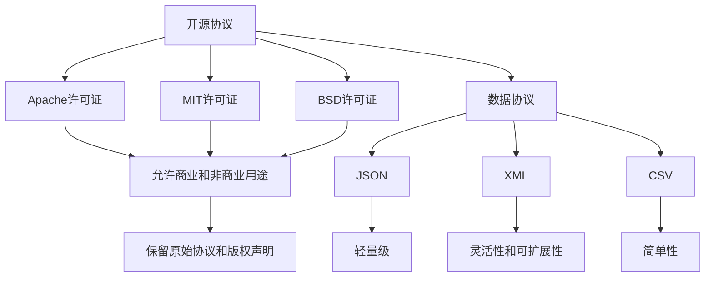

# 广泛使用的开源协议和数据协议

> 关键词：开源协议，数据协议，Apache，MIT，BSD，GPL，数据共享，数据交换，JSON，XML，API

## 1. 背景介绍

在信息技术高速发展的今天，开源协议和数据协议作为软件开发和数据交换的重要基石，扮演着至关重要的角色。开源协议确保了软件的自由流通和二次开发，而数据协议则保证了数据在不同系统之间的有效交换和互操作性。本文将深入探讨这些协议的核心概念、原理、操作步骤以及实际应用，为读者提供全面的技术视角。

### 1.1 开源协议的兴起

开源协议的兴起源于对软件自由共享和创新的追求。最早的开源协议之一是1988年的GNU通用公共许可证（GPL），它要求任何基于GPL协议的软件都必须保持开源，且在修改或分发时不得限制其他人的自由。随后，一系列开源协议相继出现，如Apache许可证、MIT许可证和BSD许可证等，它们在保证开源的同时，提供了不同程度的灵活性。

### 1.2 数据协议的重要性

随着大数据时代的到来，数据成为了一种新的战略资源。数据协议确保了数据在不同系统和平台之间的流通，促进了数据的共享和利用。常见的数据协议包括JSON、XML、CSV等，它们定义了数据的格式和交换规则。

## 2. 核心概念与联系

### 2.1 开源协议

开源协议是指授权用户在使用、研究、修改和分发软件时不受限制的协议。以下是一些常用的开源协议及其特点：

- **Apache许可证**：允许用户在商业和非商业用途下自由使用、修改和分发软件，但要求在修改后的版本中保留原始协议和版权声明。
- **MIT许可证**：与Apache许可证类似，MIT许可证同样允许用户在商业和非商业用途下自由使用、修改和分发软件，且无需保留原始协议和版权声明。
- **BSD许可证**：BSD许可证是较为宽松的开源许可证，允许用户在商业和非商业用途下自由使用、修改和分发软件，但要求在修改后的版本中保留原始协议和版权声明。

### 2.2 数据协议

数据协议是指用于定义数据格式和交换规则的协议。以下是一些常用的数据协议及其特点：

- **JSON**：JavaScript Object Notation，是一种轻量级的数据交换格式，易于阅读和编写，同时易于机器解析和生成。
- **XML**：可扩展标记语言，是一种用于存储和传输数据的标记语言，具有灵活性和可扩展性。
- **CSV**：逗号分隔值，是一种简单的数据格式，适用于表格数据的存储和交换。

### 2.3 Mermaid流程图

## 3. 核心算法原理 & 具体操作步骤

### 3.1 算法原理概述

开源协议和数据协议的原理相对简单，主要涉及授权和格式定义。

- 开源协议的原理是明确授权用户对软件的使用、修改和分发权利。
- 数据协议的原理是定义数据的格式和交换规则，确保数据的兼容性和互操作性。

### 3.2 算法步骤详解

#### 开源协议

1. 选择合适的开源协议。
2. 在软件项目中包含协议文本。
3. 在软件分发时，明确声明遵循该协议。

#### 数据协议

1. 选择合适的数据协议。
2. 定义数据格式和交换规则。
3. 在数据交换过程中遵循协议规定。

### 3.3 算法优缺点

#### 开源协议

优点：
- 促进软件共享和开源文化。
- 保障用户自由使用、修改和分发软件的权利。

缺点：
- 可能导致软件版权纠纷。
- 对软件质量和稳定性要求较高。

#### 数据协议

优点：
- 保证数据格式的一致性。
- 促进数据在不同系统之间的交换和共享。

缺点：
- 需要维护协议的兼容性和可扩展性。
- 可能导致数据转换复杂。

### 3.4 算法应用领域

开源协议和数据协议广泛应用于软件和数据交换领域，以下是一些典型应用场景：

- 软件开发：开源协议用于发布和共享开源软件，数据协议用于数据交换和共享。
- 数据交换：数据协议用于不同系统之间的数据交互。
- 云计算：开源协议和数据协议用于云计算平台上的软件和数据交换。

## 4. 数学模型和公式 & 详细讲解 & 举例说明

### 4.1 数学模型构建

开源协议和数据协议的数学模型相对简单，主要涉及授权和数据格式。

- 开源协议的数学模型可以表示为：$P(A \rightarrow B)$，表示软件A授权用户B进行使用、修改和分发。
- 数据协议的数学模型可以表示为：$F(X, Y)$，表示数据X按照格式Y进行交换。

### 4.2 公式推导过程

开源协议和数据协议的推导过程相对简单，主要涉及协议的具体规定。

- 开源协议的推导过程为：根据协议文本，明确授权内容。
- 数据协议的推导过程为：根据协议规定，定义数据格式和交换规则。

### 4.3 案例分析与讲解

#### 开源协议案例

假设某个开源项目遵循Apache许可证，则用户A可以使用、修改和分发该软件，并在修改后的版本中保留原始协议和版权声明。

#### 数据协议案例

假设某个数据交换遵循JSON协议，则数据格式应符合JSON规范，便于不同系统之间的数据交换。

## 5. 项目实践：代码实例和详细解释说明

### 5.1 开发环境搭建

由于开源协议和数据协议的实践不涉及具体的编程语言，因此本节不涉及开发环境搭建。

### 5.2 源代码详细实现

开源协议和数据协议的实践通常不涉及源代码实现，而是关注协议的选择和应用。

### 5.3 代码解读与分析

开源协议和数据协议的实践主要关注协议的选择和应用，因此本节不涉及代码解读与分析。

### 5.4 运行结果展示

开源协议和数据协议的实践结果体现在软件的发布、数据的交换和共享等方面。

## 6. 实际应用场景

### 6.1 软件开发

开源协议和数据协议在软件开发中的应用非常广泛，以下是一些典型应用场景：

- 使用开源协议发布和共享开源软件。
- 使用数据协议进行数据交换和共享。

### 6.2 数据交换

数据协议在数据交换中的应用包括：

- 不同系统之间的数据交互。
- 云计算平台上的数据交换。

### 6.3 云计算

开源协议和数据协议在云计算中的应用包括：

- 云计算平台上的软件发布和共享。
- 云计算平台上的数据交换和共享。

## 7. 工具和资源推荐

### 7.1 学习资源推荐

- 《开源许可协议详解》
- 《数据交换格式与协议》

### 7.2 开发工具推荐

- Git：用于版本控制和开源项目协作。
- Docker：用于容器化软件应用。

### 7.3 相关论文推荐

- 《开源软件许可证的选择与使用》
- 《数据交换格式与协议的发展趋势》

## 8. 总结：未来发展趋势与挑战

### 8.1 研究成果总结

开源协议和数据协议在软件开发和数据交换领域发挥着重要作用，为软件的自由共享和数据的有效交换提供了有力保障。

### 8.2 未来发展趋势

- 开源协议将更加多样化和灵活。
- 数据协议将更加标准化和统一。
- 开源协议和数据协议将更加注重安全性和隐私保护。

### 8.3 面临的挑战

- 开源协议可能引发知识产权纠纷。
- 数据协议的标准化和统一面临挑战。
- 开源协议和数据协议的安全性和隐私保护需要加强。

### 8.4 研究展望

未来，开源协议和数据协议将继续发展，为软件和数据交换领域提供更加完善的解决方案。同时，我们需要关注协议的安全性和隐私保护，以应对日益严峻的网络安全威胁。

## 9. 附录：常见问题与解答

**Q1：开源协议与商业软件有什么区别？**

A：开源协议允许用户自由使用、修改和分发软件，而商业软件通常受到版权保护，用户只能在授权范围内使用。

**Q2：数据协议的目的是什么？**

A：数据协议的目的是定义数据的格式和交换规则，确保数据在不同系统之间的兼容性和互操作性。

**Q3：如何选择合适的开源协议？**

A：选择合适的开源协议需要考虑软件的用途、授权范围等因素。

**Q4：如何选择合适的数据协议？**

A：选择合适的数据协议需要考虑数据的格式、交换频率等因素。

**Q5：开源协议和数据协议的安全性和隐私保护如何保障？**

A：开源协议和数据协议的安全性和隐私保护需要通过技术手段和法律法规进行保障。

---

作者：禅与计算机程序设计艺术 / Zen and the Art of Computer Programming