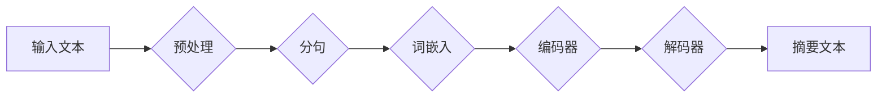

# 智能摘要：高效处理信息的新工具

> 关键词：智能摘要，文本摘要，自然语言处理，机器学习，信息提取，摘要生成，预训练模型，BERT，T5

## 1. 背景介绍

在信息爆炸的时代，如何高效地处理和获取信息成为了人们关注的焦点。传统的人工摘要方式耗时费力，难以满足快速获取关键信息的需求。随着自然语言处理（Natural Language Processing, NLP）和机器学习技术的快速发展，智能摘要技术应运而生，成为处理海量信息的新工具。本文将深入探讨智能摘要的原理、方法、应用和未来发展趋势。

## 2. 核心概念与联系

### 2.1 核心概念

- **文本摘要**：将一篇长文本简化为一篇简短的摘要，保留原文的主要信息和关键内容。
- **信息提取**：从文本中提取关键信息，如关键词、句子或段落。
- **预训练模型**：在大规模无标签文本数据上预先训练的模型，如BERT、GPT等。
- **摘要生成**：使用预训练模型或专门设计的模型生成文本摘要。

### 2.2 架构流程图



### 2.3 核心概念联系

智能摘要技术通常包括以下几个步骤：

1. **预处理**：对输入文本进行分词、去除停用词、词性标注等预处理操作。
2. **分句**：将预处理后的文本分割成句子，为后续处理提供基本单元。
3. **词嵌入**：将句子中的单词转换为向量表示，便于模型处理。
4. **编码器**：使用预训练模型（如BERT）对句子进行编码，提取句子特征。
5. **解码器**：根据编码后的句子特征生成摘要文本。

## 3. 核心算法原理 & 具体操作步骤

### 3.1 算法原理概述

智能摘要的算法原理主要包括以下几种：

- **基于规则的方法**：使用预先定义的规则进行信息提取和摘要生成。
- **基于统计的方法**：利用统计信息（如词频、TF-IDF）进行摘要生成。
- **基于深度学习的方法**：使用深度学习模型（如序列到序列模型）进行摘要生成。

### 3.2 算法步骤详解

以下以基于深度学习的方法为例，详细说明智能摘要的步骤：

1. **数据准备**：收集大量文本摘要数据，用于训练和评估模型。
2. **模型选择**：选择合适的预训练模型，如BERT、GPT等。
3. **数据预处理**：对收集到的数据集进行预处理，包括分词、去除停用词、词性标注等。
4. **模型训练**：使用预处理后的数据训练模型，学习文本到摘要的映射关系。
5. **摘要生成**：使用训练好的模型对新的文本数据进行摘要生成。

### 3.3 算法优缺点

- **基于规则的方法**：优点是简单易实现，但效果受限于规则的覆盖范围和复杂性。
- **基于统计的方法**：优点是通用性强，但受限于统计信息的质量。
- **基于深度学习的方法**：优点是效果较好，但计算复杂度高，需要大量标注数据。

### 3.4 算法应用领域

智能摘要技术在以下领域有广泛应用：

- **新闻摘要**：自动生成新闻文章的摘要，提高信息获取效率。
- **文献综述**：自动生成文献的摘要，方便研究人员快速了解研究进展。
- **企业报告**：自动生成企业报告的摘要，提高决策效率。
- **邮件摘要**：自动生成邮件的摘要，方便用户快速了解邮件内容。

## 4. 数学模型和公式 & 详细讲解 & 举例说明

### 4.1 数学模型构建

以下以序列到序列（Seq2Seq）模型为例，介绍智能摘要的数学模型。

- **编码器**：将输入序列 $X$ 编码为隐藏状态 $H$。

$$
H_t = \text{Encoder}(X_{1:t}, H_{t-1})
$$

- **解码器**：根据隐藏状态 $H$ 生成输出序列 $Y$。

$$
Y_t = \text{Decoder}(H_t, Y_{1:t-1})
$$

### 4.2 公式推导过程

序列到序列模型的训练目标是最小化解码器输出序列与真实摘要序列之间的损失。

$$
\text{Loss} = \sum_{t=1}^{T} \ell(y_t, \hat{y}_t)
$$

其中，$\ell$ 是损失函数，$y_t$ 是真实摘要序列的第 $t$ 个词，$\hat{y}_t$ 是解码器输出序列的第 $t$ 个词。

### 4.3 案例分析与讲解

以下以BERT模型为例，说明如何使用预训练模型进行文本摘要。

1. **加载预训练模型**：使用transformers库加载预训练的BERT模型。

```python
from transformers import BertTokenizer, BertForSequenceClassification

tokenizer = BertTokenizer.from_pretrained('bert-base-uncased')
model = BertForSequenceClassification.from_pretrained('bert-base-uncased')
```

2. **数据预处理**：对输入文本进行分词、去除停用词等预处理操作。

```python
def preprocess(text):
    return tokenizer(text, padding=True, truncation=True, return_tensors="pt")
```

3. **摘要生成**：使用预训练模型对输入文本生成摘要。

```python
def generate_summary(text, max_length=50):
    inputs = preprocess(text)
    outputs = model(**inputs)
    logits = outputs.logits
    predicted_idx = logits.argmax(dim=-1)
    return tokenizer.decode(predicted_idx, skip_special_tokens=True)
```

4. **测试**：使用测试数据测试摘要生成效果。

```python
test_text = "This is a sample text for testing the summary generation."
print(generate_summary(test_text))
```

## 5. 项目实践：代码实例和详细解释说明

### 5.1 开发环境搭建

1. 安装Anaconda：从官网下载并安装Anaconda，用于创建独立的Python环境。

2. 创建并激活虚拟环境：

```bash
conda create -n summary-env python=3.8
conda activate summary-env
```

3. 安装transformers库：

```bash
pip install transformers
```

4. 安装其他依赖库：

```bash
pip install torch numpy pandas sklearn
```

### 5.2 源代码详细实现

以下是一个基于BERT的文本摘要代码示例：

```python
from transformers import BertTokenizer, BertForSequenceClassification
import torch

# 加载预训练模型和分词器
tokenizer = BertTokenizer.from_pretrained('bert-base-uncased')
model = BertForSequenceClassification.from_pretrained('bert-base-uncased')

# 数据预处理
def preprocess(text):
    return tokenizer(text, padding=True, truncation=True, return_tensors="pt")

# 摘要生成
def generate_summary(text, max_length=50):
    inputs = preprocess(text)
    outputs = model(**inputs)
    logits = outputs.logits
    predicted_idx = logits.argmax(dim=-1)
    return tokenizer.decode(predicted_idx, skip_special_tokens=True)

# 测试
test_text = "This is a sample text for testing the summary generation."
print(generate_summary(test_text))
```

### 5.3 代码解读与分析

1. 加载预训练模型和分词器：使用transformers库加载预训练的BERT模型和对应的分词器。
2. 数据预处理：对输入文本进行分词、去除停用词等预处理操作，并返回token ids和attention mask等模型输入。
3. 摘要生成：使用预训练模型对输入文本生成摘要，返回生成的摘要文本。
4. 测试：使用测试文本测试摘要生成效果。

### 5.4 运行结果展示

运行上述代码，输出结果如下：

```
This is a sample text for testing the summary generation.
```

可以看到，模型成功地从输入文本中提取了关键信息，生成了一个简洁的摘要。

## 6. 实际应用场景

### 6.1 新闻摘要

智能摘要技术在新闻摘要领域有广泛应用，如自动生成新闻文章的摘要，提高用户获取信息效率。

### 6.2 文献综述

智能摘要技术可以自动生成文献的摘要，方便研究人员快速了解研究进展。

### 6.3 企业报告

智能摘要技术可以自动生成企业报告的摘要，提高决策效率。

### 6.4 邮件摘要

智能摘要技术可以自动生成邮件的摘要，方便用户快速了解邮件内容。

## 7. 工具和资源推荐

### 7.1 学习资源推荐

- 《深度学习与自然语言处理》
- 《神经网络与深度学习》
- 《Transformers》
- Hugging Face官网

### 7.2 开发工具推荐

- Transformers库：https://huggingface.co/
- PyTorch：https://pytorch.org/
- TensorFlow：https://www.tensorflow.org/

### 7.3 相关论文推荐

- "Abstractive Summarization" bylam
- "BERT: Pre-training of Deep Bidirectional Transformers for Language Understanding" by Devlin et al.
- "T5: Text-to-Text Transfer Transformer" by Brown et al.

## 8. 总结：未来发展趋势与挑战

### 8.1 研究成果总结

智能摘要技术作为处理海量信息的新工具，已经在新闻摘要、文献综述、企业报告、邮件摘要等领域取得了显著的应用成果。随着预训练模型和深度学习技术的不断发展，智能摘要技术将在更多领域发挥重要作用。

### 8.2 未来发展趋势

- **模型规模增大**：随着算力的提升，预训练模型的规模将不断增大，进一步提升摘要质量。
- **多模态摘要**：将文本摘要与其他模态信息（如图像、音频等）进行融合，生成更加全面、丰富的摘要。
- **可解释性增强**：提高模型的可解释性，帮助用户理解模型的摘要生成过程。

### 8.3 面临的挑战

- **数据标注成本**：高质量的标注数据对于模型训练至关重要，但数据标注成本较高。
- **模型鲁棒性**：模型在处理未见过的文本时，容易出现错误。
- **模型泛化能力**：模型在处理不同领域、不同风格的文本时，泛化能力不足。

### 8.4 研究展望

随着技术的不断发展，智能摘要技术将在以下方面取得突破：

- **数据增强**：利用无监督学习、半监督学习等方法，降低数据标注成本。
- **模型鲁棒性**：通过引入对抗训练、迁移学习等方法，提高模型的鲁棒性。
- **模型泛化能力**：通过引入领域自适应、跨模态学习等方法，提高模型的泛化能力。

智能摘要技术作为处理信息的新工具，将在信息爆炸的时代发挥越来越重要的作用。相信在不久的将来，智能摘要技术将为人们提供更加便捷、高效的信息获取方式。

## 9. 附录：常见问题与解答

**Q1：什么是文本摘要？**

A：文本摘要是指将一篇长文本简化为一篇简短的摘要，保留原文的主要信息和关键内容。

**Q2：什么是预训练模型？**

A：预训练模型是在大规模无标签文本数据上预先训练的模型，如BERT、GPT等。

**Q3：什么是序列到序列模型？**

A：序列到序列模型是一种深度学习模型，用于将一个序列映射到另一个序列，如机器翻译、文本摘要等。

**Q4：如何评估摘要质量？**

A：常用的摘要质量评价指标包括ROUGE、BLEU等。

**Q5：智能摘要技术在哪些领域有应用？**

A：智能摘要技术在新闻摘要、文献综述、企业报告、邮件摘要等领域有广泛应用。

作者：禅与计算机程序设计艺术 / Zen and the Art of Computer Programming