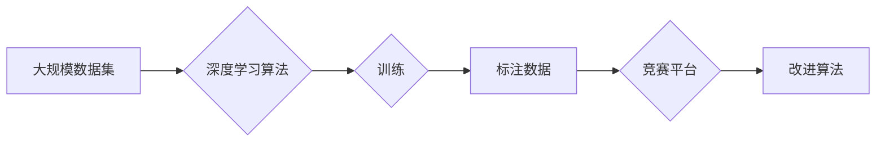

# 李飞飞的ImageNet与大数据

> 关键词：ImageNet，深度学习，大数据，计算机视觉，人工智能，卷积神经网络，深度学习竞赛，数据集

## 1. 背景介绍

在21世纪初，计算机视觉领域迎来了一个重要的转折点。这一转折点并非源于某个单一的技术突破，而是由一系列研究和竞赛共同推动的。其中，李飞飞教授领导的ImageNet项目及其引发的深度学习竞赛对整个领域产生了深远的影响。本文将深入探讨ImageNet项目，分析其背后的技术原理、大数据策略，以及它对计算机视觉和人工智能领域的推动作用。

### 1.1 问题的由来

在ImageNet项目启动之前，计算机视觉领域主要依赖于手工设计的特征和基于传统机器学习的算法。这些方法在处理复杂图像时往往效果有限，无法达到人眼识别图像的准确度。为了解决这个问题，研究人员开始探索使用深度学习技术来构建更加智能的图像识别系统。

### 1.2 研究现状

ImageNet项目由李飞飞教授于2009年发起，旨在构建一个大规模的图像数据集，用于推动计算机视觉领域的研究和算法创新。该项目迅速成为计算机视觉领域的标杆，并引发了全球范围内的深度学习竞赛。

### 1.3 研究意义

ImageNet项目及其引发的深度学习竞赛对计算机视觉和人工智能领域具有重要意义：

- **推动深度学习技术的快速发展**：ImageNet项目为深度学习研究者提供了一个巨大的数据平台，推动了卷积神经网络（CNN）等深度学习算法的快速发展。
- **促进计算机视觉领域的标准化**：ImageNet数据集的标准化格式和评估标准为计算机视觉研究提供了一个共同的评价基准，促进了领域的标准化和可比较性。
- **加速人工智能应用的落地**：ImageNet项目的成功展示了深度学习在图像识别领域的巨大潜力，加速了人工智能技术在各个领域的应用落地。

### 1.4 本文结构

本文将按照以下结构进行阐述：

- 第2部分，介绍ImageNet项目及其核心概念。
- 第3部分，深入分析ImageNet项目的技术原理和大数据策略。
- 第4部分，探讨ImageNet项目对计算机视觉领域的推动作用。
- 第5部分，分析ImageNet项目在人工智能领域的应用实例。
- 第6部分，展望ImageNet项目及其相关技术的未来发展趋势。
- 第7部分，总结ImageNet项目的重要贡献和研究展望。

## 2. 核心概念与联系

### 2.1 核心概念原理

ImageNet项目的核心概念包括：

- **大规模数据集**：ImageNet包含超过1400万张图像，涵盖了21,841个类别，是当时最大的图像数据集之一。
- **标注数据**：ImageNet图像经过人工标注，每个图像都附有一个或多个类别标签。
- **深度学习算法**：研究人员使用深度学习算法，特别是卷积神经网络（CNN）对ImageNet数据集进行训练。
- **竞赛平台**：ImageNet项目组织了多项竞赛，吸引了全球范围内的研究者参与。

### 2.2 架构的 Mermaid 流程图



## 3. 核心算法原理 & 具体操作步骤

### 3.1 算法原理概述

ImageNet项目主要使用卷积神经网络（CNN）进行图像识别。CNN是一种特殊的神经网络，它通过模仿人眼视觉系统的工作原理，能够有效地提取图像中的局部特征。

### 3.2 算法步骤详解

ImageNet项目的算法步骤包括：

1. **数据预处理**：对图像进行裁剪、缩放、旋转等预处理操作，以增加数据多样性。
2. **模型训练**：使用CNN对预处理后的图像进行训练，学习图像特征。
3. **模型评估**：在ImageNet数据集上评估模型的性能，包括准确率、召回率等指标。
4. **竞赛与改进**：通过竞赛形式鼓励研究者改进算法，提高模型的性能。

### 3.3 算法优缺点

### 3.3.1 优点

- **高性能**：CNN在图像识别任务上取得了显著的性能提升，远超传统机器学习算法。
- **泛化能力**：CNN能够学习到图像的通用特征，具有较强的泛化能力。

### 3.3.2 缺点

- **计算复杂度**：CNN的训练过程需要大量的计算资源。
- **数据依赖**：模型的性能很大程度上依赖于训练数据的质量和数量。

### 3.4 算法应用领域

CNN在图像识别领域得到了广泛的应用，包括：

- **物体识别**：识别图像中的物体，如人脸识别、车辆识别等。
- **场景识别**：识别图像中的场景，如城市、自然、室内等。
- **图像分割**：将图像分割成不同的区域，如语义分割、实例分割等。

## 4. 数学模型和公式 & 详细讲解 & 举例说明

### 4.1 数学模型构建

CNN的数学模型主要包括以下部分：

- **卷积层**：用于提取图像特征。
- **池化层**：用于降低特征的空间分辨率。
- **全连接层**：用于分类。

### 4.2 公式推导过程

以卷积层为例，其计算公式如下：

$$
h_{ij} = \sum_{k=1}^{K} w_{ik} \cdot o_{kj}
$$

其中，$h_{ij}$ 为输出特征图上的第 $i$ 行第 $j$ 列的值，$w_{ik}$ 为卷积核权重，$o_{kj}$ 为输入特征图上的第 $k$ 行第 $j$ 列的值。

### 4.3 案例分析与讲解

以下是一个简单的CNN模型示例：

- **输入层**：输入一个 $32 \times 32$ 的图像。
- **卷积层1**：使用3x3的卷积核，输出 $8 \times 8$ 的特征图。
- **池化层1**：使用2x2的最大池化，输出 $4 \times 4$ 的特征图。
- **卷积层2**：使用5x5的卷积核，输出 $4 \times 4$ 的特征图。
- **池化层2**：使用2x2的最大池化，输出 $2 \times 2$ 的特征图。
- **全连接层**：输出10个类别。

## 5. 项目实践：代码实例和详细解释说明

### 5.1 开发环境搭建

为了进行CNN模型的实践，需要以下开发环境：

- Python编程语言
- PyTorch深度学习框架
- OpenCV图像处理库

### 5.2 源代码详细实现

以下是一个简单的CNN模型实现示例：

```python
import torch
import torch.nn as nn

class SimpleCNN(nn.Module):
    def __init__(self):
        super(SimpleCNN, self).__init__()
        self.conv1 = nn.Conv2d(3, 8, kernel_size=3, stride=1, padding=1)
        self.pool = nn.MaxPool2d(kernel_size=2, stride=2)
        self.conv2 = nn.Conv2d(8, 16, kernel_size=5, stride=1, padding=2)
        self.fc = nn.Linear(16 * 2 * 2, 10)

    def forward(self, x):
        x = self.pool(self.conv1(x))
        x = self.pool(self.conv2(x))
        x = x.view(-1, 16 * 2 * 2)
        x = self.fc(x)
        return x

model = SimpleCNN()
```

### 5.3 代码解读与分析

- `SimpleCNN` 类继承自 `nn.Module`，定义了CNN模型的结构。
- `__init__` 方法中，初始化了两个卷积层、两个池化层和一个全连接层。
- `forward` 方法定义了模型的正向传播过程。

### 5.4 运行结果展示

在训练和测试数据集上运行上述模型，可以得到模型的准确率等性能指标。

## 6. 实际应用场景

### 6.1 物体识别

物体识别是CNN应用最广泛的场景之一。例如，自动驾驶汽车使用CNN来识别道路上的行人和车辆，以避免碰撞。

### 6.2 场景识别

场景识别可以帮助智能手机识别用户当前所处的环境，并自动调整相机设置。例如，当用户在博物馆参观时，智能手机可以自动开启夜景模式。

### 6.3 图像分割

图像分割可以将图像分割成不同的区域，用于医学图像分析、卫星图像处理等领域。

## 7. 工具和资源推荐

### 7.1 学习资源推荐

- 《深度学习》
- 《卷积神经网络》
- 《Python深度学习》

### 7.2 开发工具推荐

- PyTorch
- TensorFlow
- OpenCV

### 7.3 相关论文推荐

- "A Convolutional Neural Network Approach to Visual Categorization"
- "Learning Deep Features for Discriminative Localization"
- "Very Deep Convolutional Networks for Large-Scale Image Recognition"

## 8. 总结：未来发展趋势与挑战

### 8.1 研究成果总结

ImageNet项目及其引发的深度学习竞赛对计算机视觉和人工智能领域产生了深远的影响，推动了深度学习技术的快速发展。

### 8.2 未来发展趋势

- **模型轻量化**：为了在移动设备和嵌入式设备上部署，需要开发更加轻量级的CNN模型。
- **多模态学习**：结合图像、文本、语音等多模态信息，构建更加全面的智能系统。
- **可解释性**：提高模型的可解释性，使模型的决策过程更加透明。

### 8.3 面临的挑战

- **数据隐私**：大规模数据集的收集和使用需要考虑数据隐私问题。
- **算法公平性**：防止算法歧视和偏见，确保算法的公平性。
- **资源消耗**：深度学习模型的训练和推理需要大量的计算资源。

### 8.4 研究展望

ImageNet项目及其相关技术将继续推动计算机视觉和人工智能领域的发展，为构建更加智能、高效、安全的系统贡献力量。

## 9. 附录：常见问题与解答

**Q1：ImageNet项目的主要贡献是什么？**

A1：ImageNet项目的主要贡献是构建了一个大规模的图像数据集，推动了深度学习技术在图像识别领域的快速发展。

**Q2：CNN在图像识别任务中有什么优势？**

A2：CNN能够有效地提取图像特征，具有较强的泛化能力，在图像识别任务中取得了显著的性能提升。

**Q3：如何降低CNN模型的计算复杂度？**

A3：可以通过模型剪枝、量化加速、模型压缩等方法降低CNN模型的计算复杂度。

**Q4：如何提高CNN模型的可解释性？**

A4：可以通过特征可视化、注意力机制等方法提高CNN模型的可解释性。

作者：禅与计算机程序设计艺术 / Zen and the Art of Computer Programming