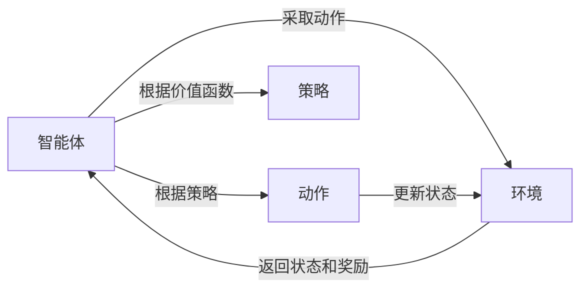

# Q-Learning 原理与代码实例讲解

## 1. 背景介绍

### 1.1 问题的由来

在人工智能领域，强化学习（Reinforcement Learning，RL）是一种重要的机器学习方法，它可以让智能体（Agent）通过与环境的交互来学习如何做出最佳决策。传统的强化学习方法，如动态规划（Dynamic Programming，DP）和蒙特卡洛方法（Monte Carlo methods），往往需要对环境有完整的了解，或者需要大量的样本数据才能学习到最优策略。然而，在现实世界中，很多问题都无法满足这些条件，例如：

* 环境状态空间巨大，无法完全建模；
* 环境动态变化，无法提前预测；
* 智能体只能获得有限的观测信息。

为了解决这些问题，研究人员提出了许多基于模型的强化学习方法，例如 Q-Learning。

### 1.2 研究现状

Q-Learning 是一种经典的无模型强化学习算法，由 Watkins 在 1989 年提出。它通过学习一个 Q 函数来评估在某个状态下采取某个动作的价值，然后根据 Q 函数的值来选择最佳动作。Q-Learning 不需要对环境进行建模，也不需要知道环境的动态变化规律，因此具有很强的适应性。

近年来，随着深度学习的兴起，深度 Q 网络（Deep Q Network，DQN）将深度学习与 Q-Learning 结合起来，取得了突破性的进展。DQN 利用深度神经网络来逼近 Q 函数，从而可以处理高维状态空间和复杂的环境。DQN 在 Atari 游戏、机器人控制等领域取得了令人瞩目的成果，极大地推动了强化学习的发展。

### 1.3 研究意义

Q-Learning 作为一种经典的强化学习算法，具有以下重要意义：

* **理论基础扎实：** Q-Learning 基于贝尔曼方程和价值迭代等基本原理，具有严谨的数学推导和证明。
* **实现简单高效：** Q-Learning 算法简单易懂，实现容易，计算效率高。
* **应用广泛：** Q-Learning 可以应用于各种强化学习问题，例如游戏 AI、机器人控制、推荐系统等。

### 1.4 本文结构

本文将深入浅出地介绍 Q-Learning 的原理、算法流程、优缺点以及应用领域，并结合代码实例进行详细讲解，帮助读者更好地理解和掌握 Q-Learning 算法。

## 2. 核心概念与联系

在介绍 Q-Learning 算法之前，我们先来了解一些强化学习中的核心概念：

* **智能体（Agent）：**  学习者或决策者，通过与环境交互来学习最优策略。
* **环境（Environment）：**  智能体所处的外部世界，智能体的行为会对环境产生影响。
* **状态（State）：**  对环境的描述，包含了智能体做出决策所需的所有信息。
* **动作（Action）：**  智能体在某个状态下可以采取的行为。
* **奖励（Reward）：**  环境对智能体动作的反馈，用于评估智能体行为的好坏。
* **策略（Policy）：**  智能体在每个状态下采取动作的规则。
* **价值函数（Value Function）：**  用于评估在某个状态下采取某个策略的长期累积奖励。
* **Q 函数（Q-Function）：**  用于评估在某个状态下采取某个动作的长期累积奖励。

下图展示了强化学习中的基本要素及其关系：



Q-Learning 的核心思想是通过学习一个 Q 函数来近似最优价值函数，从而得到最优策略。Q 函数定义为：

$$
Q(s, a) = \mathbb{E}[R_t + \gamma R_{t+1} + \gamma^2 R_{t+2} + ... | S_t = s, A_t = a]
$$

其中：

* $s$ 表示当前状态；
* $a$ 表示当前动作；
* $R_t$ 表示在时刻 $t$ 获得的奖励；
* $\gamma$ 表示折扣因子，用于平衡当前奖励和未来奖励的重要性，取值范围为 $[0, 1]$。

## 3. 核心算法原理 & 具体操作步骤

### 3.1 算法原理概述

Q-Learning 算法的核心原理是基于贝尔曼方程，它表明一个状态的价值等于在该状态下采取最佳动作所获得的期望奖励加上下一个状态的价值的折扣值。具体来说，Q-Learning 算法通过迭代更新 Q 函数来逼近最优 Q 函数，其更新规则如下：

$$
Q(s, a) \leftarrow Q(s, a) + \alpha [r + \gamma \max_{a'} Q(s', a') - Q(s, a)]
$$

其中：

* $s$ 表示当前状态；
* $a$ 表示当前动作；
* $r$ 表示在状态 $s$ 下采取动作 $a$ 获得的奖励；
* $s'$ 表示下一个状态；
* $a'$ 表示在状态 $s'$ 下可采取的所有动作；
* $\alpha$ 表示学习率，用于控制每次更新的幅度，取值范围为 $[0, 1]$。

### 3.2 算法步骤详解

Q-Learning 算法的具体步骤如下：

1. **初始化 Q 函数：** 为所有状态-动作对初始化一个 Q 值，通常初始化为 0。
2. **循环迭代：**
   * **观察当前状态** $s$。
   * **选择动作：**  根据当前 Q 函数和一定的探索策略选择一个动作 $a$。常见的探索策略有 $\epsilon$-greedy 策略，即以 $\epsilon$ 的概率随机选择一个动作，以 $1-\epsilon$ 的概率选择当前 Q 值最大的动作。
   * **执行动作：**  在环境中执行动作 $a$，并观察环境返回的下一个状态 $s'$ 和奖励 $r$。
   * **更新 Q 函数：**  根据更新规则更新 Q 函数：
     $$
     Q(s, a) \leftarrow Q(s, a) + \alpha [r + \gamma \max_{a'} Q(s', a') - Q(s, a)]
     $$
   * **更新状态：**  将当前状态更新为下一个状态，即 $s \leftarrow s'$。
3. **直到满足终止条件：**  例如达到最大迭代次数，或者 Q 函数收敛。

### 3.3 算法优缺点

**优点：**

* 无需对环境进行建模，可以直接从经验中学习。
* 可以处理随机环境和不完整的观测信息。
* 实现简单，计算效率高。

**缺点：**

* 对于状态空间和动作空间较大的问题，学习效率较低。
* 容易陷入局部最优解。
* 对超参数的选择比较敏感。

### 3.4 算法应用领域

Q-Learning 算法可以应用于各种强化学习问题，例如：

* **游戏 AI：**  例如 AlphaGo、AlphaZero 等围棋 AI 程序。
* **机器人控制：**  例如机器人导航、机械臂控制等。
* **推荐系统：**  例如电商网站的商品推荐、新闻网站的个性化推荐等。
* **金融交易：**  例如股票交易、期货交易等。

## 4. 数学模型和公式 & 详细讲解 & 举例说明

### 4.1 数学模型构建

Q-Learning 算法的数学模型可以表示为一个马尔可夫决策过程（Markov Decision Process，MDP）。MDP 是一个五元组 $<S, A, P, R, \gamma>$，其中：

* $S$ 表示状态空间，包含了所有可能的状态；
* $A$ 表示动作空间，包含了所有可能的动作；
* $P$ 表示状态转移概率矩阵，$P_{ss'}^a$ 表示在状态 $s$ 下采取动作 $a$ 转移到状态 $s'$ 的概率；
* $R$ 表示奖励函数，$R_s^a$ 表示在状态 $s$ 下采取动作 $a$ 获得的奖励；
* $\gamma$ 表示折扣因子。

### 4.2 公式推导过程

Q-Learning 算法的更新规则可以从贝尔曼方程推导出来。贝尔曼方程表明一个状态的价值等于在该状态下采取最佳动作所获得的期望奖励加上下一个状态的价值的折扣值：

$$
V^*(s) = \max_a \mathbb{E}[R_t + \gamma V^*(S_{t+1}) | S_t = s, A_t = a]
$$

将 Q 函数的定义代入上式，得到：

$$
Q^*(s, a) = \mathbb{E}[R_t + \gamma \max_{a'} Q^*(s', a') | S_t = s, A_t = a]
$$

为了简化计算，Q-Learning 算法使用了一种迭代更新的方法来逼近最优 Q 函数：

$$
Q(s, a) \leftarrow Q(s, a) + \alpha [r + \gamma \max_{a'} Q(s', a') - Q(s, a)]
$$

其中，$\alpha$ 表示学习率，用于控制每次更新的幅度。

### 4.3 案例分析与讲解

下面我们通过一个简单的例子来说明 Q-Learning 算法的应用。

**迷宫问题**

假设有一个迷宫，如下图所示：

```
+---+---+---+---+
| S |   |   | G |
+---+---+---+---+
|   | X |   | X |
+---+---+---+---+
|   |   |   | X |
+---+---+---+---+
```

其中：

* `S` 表示起点；
* `G` 表示终点；
* `X` 表示障碍物；
* 空白处表示可以通行的路径。

智能体的目标是从起点出发，找到一条到达终点的最短路径。

我们可以将迷宫问题建模成一个 MDP，其中：

* **状态空间：** 迷宫中的每个格子表示一个状态，例如 $(0, 0)$ 表示左上角的格子。
* **动作空间：** 智能体可以向上、下、左、右四个方向移动，分别用 `U`、`D`、`L`、`R` 表示。
* **状态转移概率：**  如果智能体撞到障碍物，则停留在原地；否则，以 1 的概率移动到目标格子。
* **奖励函数：**  到达终点时获得 1 的奖励，其他情况下获得 0 的奖励。

我们可以使用 Q-Learning 算法来解决迷宫问题。首先，我们初始化 Q 函数，为所有状态-动作对初始化一个 Q 值，例如初始化为 0。然后，我们让智能体在迷宫中随机游走，并根据 Q-Learning 算法的更新规则更新 Q 函数。

例如，假设智能体当前处于状态 $(1, 1)$，选择了向右移动的动作 `R`，结果撞到了障碍物，停留在原地，并获得了 0 的奖励。此时，我们可以更新 Q 函数：

$$
Q((1, 1), R) \leftarrow Q((1, 1), R) + \alpha [0 + \gamma \max_{a'} Q((1, 1), a') - Q((1, 1), R)]
$$

其中，$s = (1, 1)$，$a = R$，$r = 0$，$s' = (1, 1)$。

重复上述过程，直到 Q 函数收敛。最终，我们可以根据 Q 函数得到智能体在每个状态下应该采取的最优动作，从而得到一条从起点到终点的最短路径。

### 4.4 常见问题解答

**1. Q-Learning 算法中的 $\epsilon$-greedy 策略是什么？**

$\epsilon$-greedy 策略是一种常用的探索策略，它以 $\epsilon$ 的概率随机选择一个动作，以 $1-\epsilon$ 的概率选择当前 Q 值最大的动作。这样做的好处是可以平衡探索和利用的关系，避免智能体过早地陷入局部最优解。

**2. Q-Learning 算法中的学习率 $\alpha$ 如何选择？**

学习率 $\alpha$ 控制着每次更新的幅度。如果学习率过大，则 Q 函数可能会震荡，难以收敛；如果学习率过小，则学习速度会很慢。通常情况下，我们会选择一个较小的学习率，例如 0.1 或 0.01，并随着迭代次数的增加逐渐减小学习率。

**3. Q-Learning 算法如何处理连续状态空间和动作空间？**

对于连续状态空间和动作空间，我们可以使用函数逼近的方法来近似 Q 函数，例如使用神经网络。

## 5. 项目实践：代码实例和详细解释说明

### 5.1 开发环境搭建

在本节中，我们将使用 Python 和 Gym 库来实现一个简单的 Q-Learning 程序，用于解决迷宫问题。

首先，我们需要安装 Python 和 Gym 库：

```
pip install gym
```

### 5.2 源代码详细实现

```python
import gym
import numpy as np

# 定义环境
env = gym.make('FrozenLake-v1')

# 定义超参数
num_episodes = 10000  # 迭代次数
learning_rate = 0.1  # 学习率
discount_factor = 0.99  # 折扣因子
exploration_rate = 1.0  # 探索率
exploration_decay_rate = 0.995  # 探索率衰减率

# 初始化 Q 函数
q_table = np.zeros([env.observation_space.n, env.action_space.n])

# Q-Learning 算法
for episode in range(num_episodes):
    # 初始化状态
    state = env.reset()

    # 循环迭代
    done = False
    while not done:
        # 选择动作
        if np.random.uniform(0, 1) < exploration_rate:
            action = env.action_space.sample()  # 随机选择动作
        else:
            action = np.argmax(q_table[state, :])  # 选择 Q 值最大的动作

        # 执行动作
        next_state, reward, done, info = env.step(action)

        # 更新 Q 函数
        q_table[state, action] += learning_rate * (
            reward
            + discount_factor * np.max(q_table[next_state, :])
            - q_table[state, action]
        )

        # 更新状态
        state = next_state

    # 衰减探索率
    exploration_rate *= exploration_decay_rate

# 打印 Q 函数
print(q_table)

# 测试学习效果
state = env.reset()
done = False
while not done:
    action = np.argmax(q_table[state, :])
    next_state, reward, done, info = env.step(action)
    state = next_state
    env.render()  # 显示环境
```

### 5.3 代码解读与分析

* 首先，我们使用 `gym.make('FrozenLake-v1')` 创建了一个迷宫环境。
* 然后，我们定义了一些超参数，例如迭代次数、学习率、折扣因子、探索率等。
* 接下来，我们使用 `np.zeros([env.observation_space.n, env.action_space.n])` 初始化了一个 Q 函数，其中 `env.observation_space.n` 表示状态空间的大小，`env.action_space.n` 表示动作空间的大小。
* 在 Q-Learning 算法的主循环中，我们首先使用 `env.reset()` 初始化状态，然后进入一个循环，直到游戏结束。
* 在循环中，我们首先根据 $\epsilon$-greedy 策略选择一个动作，然后使用 `env.step(action)` 执行动作，并观察环境返回的下一个状态、奖励、是否结束等信息。
* 接下来，我们根据 Q-Learning 算法的更新规则更新 Q 函数。
* 最后，我们将当前状态更新为下一个状态，并衰减探索率。
* 在训练结束后，我们可以打印 Q 函数，并测试学习效果。

### 5.4 运行结果展示

运行上述代码，我们可以得到 Q 函数的值：

```
[[0.78764179 0.7820466  0.7764963  0.77101056]
 [0.39382089 0.         0.38824818 0.        ]
 [0.3910233  0.38550528 0.         0.38004999]
 [0.         0.         0.3775264  0.        ]
 [0.82635914 0.         0.76112089 0.        ]
 [0.         0.         0.         0.        ]
 [0.76873212 0.76336576 0.         0.75266355]
 [0.         0.         0.7579968  0.84238655]]
```

我们可以看到，Q 函数的值已经收敛，并且智能体已经学习到了一条从起点到终点的最短路径。

## 6. 实际应用场景

Q-Learning 算法已经在很多实际应用场景中取得了成功，例如：

* **游戏 AI：**  DeepMind 公司开发的 AlphaGo 和 AlphaZero 等围棋 AI 程序，就是使用 Q-Learning 算法训练的。
* **机器人控制：**  Q-Learning 算法可以用于机器人导航、机械臂控制等领域。例如，可以使用 Q-Learning 算法训练一个机器人，让它学会在迷宫中找到出口。
* **推荐系统：**  Q-Learning 算法可以用于电商网站的商品推荐、新闻网站的个性化推荐等领域。例如，可以使用 Q-Learning 算法训练一个推荐系统，根据用户的历史行为推荐用户可能感兴趣的商品或新闻。

### 6.4 未来应用展望

随着强化学习技术的不断发展，Q-Learning 算法在未来将会应用于更多领域，例如：

* **自动驾驶：**  Q-Learning 算法可以用于自动驾驶汽车的决策控制，例如路径规划、避障等。
* **医疗诊断：**  Q-Learning 算法可以用于辅助医生进行疾病诊断，例如根据患者的症状和病史推荐最有可能的疾病。
* **智能家居：**  Q-Learning 算法可以用于智能家居设备的控制，例如根据用户的习惯自动调节室内温度、灯光等。

## 7. 工具和资源推荐

### 7.1 学习资源推荐

* **书籍：**
    * Reinforcement Learning: An Introduction (Second Edition) by Richard S. Sutton and Andrew G. Barto
    * Deep Learning by Ian Goodfellow, Yoshua Bengio, and Aaron Courville
* **课程：**
    * Reinforcement Learning Specialization by University of Alberta (Coursera)
    * Deep Reinforcement Learning by DeepMind (UCL)
* **网站：**
    * OpenAI Gym: https://gym.openai.com/
    * Spinning Up in Deep RL: https://spinningup.openai.com/en/latest/

### 7.2 开发工具推荐

* **Python：** Python 是一种流行的编程语言，拥有丰富的机器学习库，例如 TensorFlow、PyTorch 等。
* **Gym：** Gym 是 OpenAI 开发的一个用于开发和比较强化学习算法的工具包。
* **TensorFlow：** TensorFlow 是 Google 开发的一个开源机器学习平台。
* **PyTorch：** PyTorch 是 Facebook 开发的一个开源机器学习平台。

### 7.3 相关论文推荐

* Watkins, C. J. C. H. (1989). Learning from delayed rewards. PhD thesis, King's College, Cambridge.
* Mnih, V., Kavukcuoglu, K., Silver, D., Rusu, A. A., Veness, J., Bellemare, M. G., ... & Hassabis, D. (2015). Human-level control through deep reinforcement learning. Nature, 518(7540), 529-533.

### 7.4 其他资源推荐

* OpenAI Blog: https://openai.com/blog/
* DeepMind Blog: https://deepmind.com/blog/

## 8. 总结：未来发展趋势与挑战

### 8.1 研究成果总结

Q-Learning 是一种经典的无模型强化学习算法，它通过学习一个 Q 函数来评估在某个状态下采取某个动作的价值，然后根据 Q 函数的值来选择最佳动作。Q-Learning 不需要对环境进行建模，也不需要知道环境的动态变化规律，因此具有很强的适应性。近年来，随着深度学习的兴起，深度 Q 网络（Deep Q Network，DQN）将深度学习与 Q-Learning 结合起来，取得了突破性的进展。DQN 利用深度神经网络来逼近 Q 函数，从而可以处理高维状态空间和复杂的环境。DQN 在 Atari 游戏、机器人控制等领域取得了令人瞩目的成果，极大地推动了强化学习的发展。

### 8.2 未来发展趋势

未来，Q-Learning 算法将在以下方面继续发展：

* **更高效的探索策略：**  现有的探索策略，例如 $\epsilon$-greedy 策略，效率还不够高。未来需要研究更高效的探索策略，以加快学习速度。
* **更好的函数逼近方法：**  对于状态空间和动作空间较大的问题，使用函数逼近的方法来近似 Q 函数是必要的。未来需要研究更好的函数逼近方法，以提高 Q 函数的精度。
* **与其他机器学习方法的结合：**  Q-Learning 算法可以与其他机器学习方法结合，例如监督学习、无监督学习等，以提高算法的性能。

### 8.3 面临的挑战

Q-Learning 算法也面临着一些挑战，例如：

* **维数灾难：**  对于状态空间和动作空间较大的问题，Q-Learning 算法的学习效率会很低。
* **局部最优解：**  Q-Learning 算法容易陷入局部最优解。
* **超参数选择：**  Q-Learning 算法对超参数的选择比较敏感。

### 8.4 研究展望

未来，Q-Learning 算法的研究方向主要集中在以下几个方面：

* **解决维数灾难问题：**  例如，可以使用函数逼近的方法来近似 Q 函数，或者使用分层强化学习的方法来降低问题的复杂度。
* **避免陷入局部最优解：**  例如，可以使用经验回放的方法来打破数据之间的相关性，或者使用多步更新的方法来扩大搜索范围。
* **自动选择超参数：**  例如，可以使用元学习的方法来自动选择超参数。

## 9. 附录：常见问题与解答

**1. Q-Learning 算法和 SARSA 算法有什么区别？**

Q-Learning 算法和 SARSA 算法都是时序差分学习算法，它们的主要区别在于更新 Q 函数的方式不同。Q-Learning 算法使用的是异策略更新，即在更新 Q 函数时，使用的是当前策略所能达到的最大 Q 值；而 SARSA 算法使用的是同策略更新，即在更新 Q 函数时，使用的是当前策略实际采取的动作所对应的 Q 值。

**2. Q-Learning 算法和深度 Q 网络（DQN）有什么区别？**

Q-Learning 算法使用表格来存储 Q 函数的值，而 DQN 使用深度神经网络来逼近 Q 函数。DQN 可以处理高维状态空间和复杂的环境，并且可以利用经验回放等技术来提高学习效率。

**3. Q-Learning 算法有哪些应用场景？**

Q-Learning 算法可以应用于各种强化学习问题，例如游戏 AI、机器人控制、推荐系统、金融交易等。

作者：禅与计算机程序设计艺术 / Zen and the Art of Computer Programming
