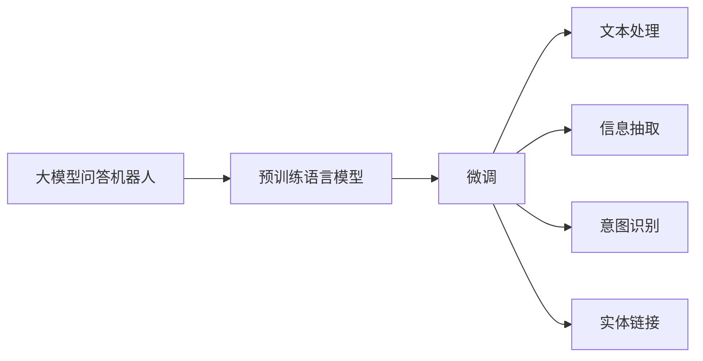
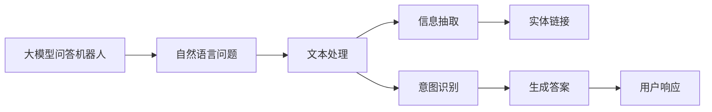
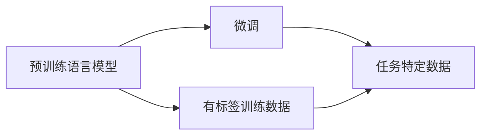
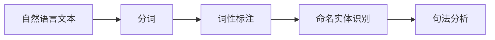
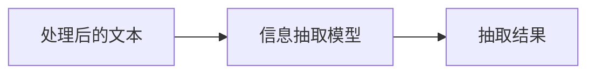
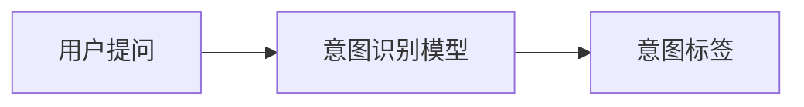
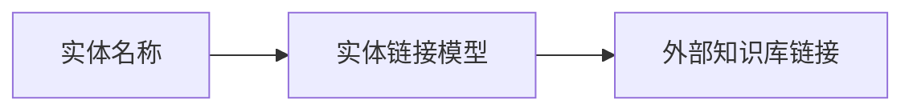
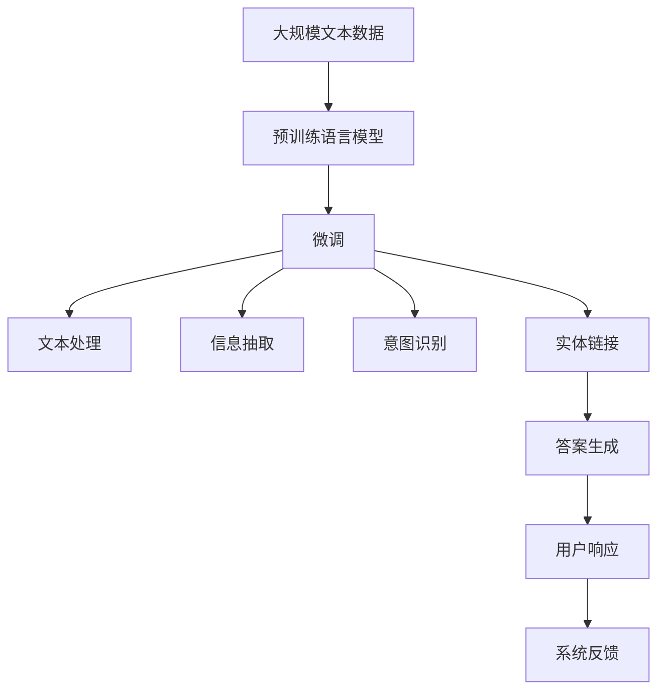

                 

# 大模型问答机器人的文本处理

## 1. 背景介绍

### 1.1 问题由来
近年来，随着人工智能技术的迅猛发展，自然语言处理（NLP）领域取得了重大突破。特别是大模型问答机器人的出现，使得人们可以通过自然语言与计算机进行高效互动。然而，大模型在处理文本时，常常面临着信息抽取、意图识别、实体链接等诸多挑战。

### 1.2 问题核心关键点
大模型问答机器人技术，其实质是一种基于自然语言处理（NLP）的智能问答系统。其核心在于将用户输入的自然语言文本转化为计算机可理解的结构化形式，并通过预训练的语言模型和微调技术，从海量的语料库中提取出答案。

### 1.3 问题研究意义
大模型问答机器人技术的应用，不仅能够大幅度提升信息检索的效率和准确性，还能有效减少人工劳动，提高用户体验。在金融、医疗、教育、客服等多个领域，问答机器人已经成为不可或缺的技术工具。

## 2. 核心概念与联系

### 2.1 核心概念概述

为了更好地理解大模型问答机器人技术，本节将介绍几个关键概念：

- **大模型问答机器人**：通过预训练和微调得到的大规模语言模型，能够自动理解自然语言问题并给出答案。
- **预训练语言模型**：在大规模无标签文本数据上自监督学习得到的语言模型，如BERT、GPT等。
- **微调**：在预训练模型基础上，使用任务特定数据集进行有监督学习，以提升模型在特定任务上的性能。
- **文本处理**：将自然语言文本转化为计算机可处理的形式，如分词、词性标注、命名实体识别等。
- **信息抽取**：从文本中自动抽取结构化信息，如时间、地点、人物等。
- **意图识别**：识别用户输入的意图，如查询、纠错、翻译等。
- **实体链接**：将文本中的实体链接到外部知识库，如百度百科、维基百科等。

这些概念之间通过以下Mermaid流程图来展示它们之间的关系：



这个流程图展示了从预训练模型到微调，再到文本处理、信息抽取、意图识别和实体链接的完整过程。

### 2.2 概念间的关系

这些核心概念之间存在着紧密的联系，构成了大模型问答机器人技术的完整体系。下面我们通过几个Mermaid流程图来展示这些概念之间的关系。

#### 2.2.1 大模型问答机器人技术



这个流程图展示了从用户提问到最终生成答案的完整流程。

#### 2.2.2 预训练与微调



这个流程图展示了从预训练到微调的过程。

#### 2.2.3 文本处理



这个流程图展示了从原始文本到处理后的结构化信息的过程。

#### 2.2.4 信息抽取



这个流程图展示了从处理后的文本中抽取结构化信息的过程。

#### 2.2.5 意图识别



这个流程图展示了从用户提问到识别意图的过程。

#### 2.2.6 实体链接



这个流程图展示了从实体名称到链接外部知识库的过程。

### 2.3 核心概念的整体架构

最后，我们用一个综合的流程图来展示这些核心概念在大模型问答机器人技术中的整体架构：



这个综合流程图展示了从预训练到微调，再到文本处理、信息抽取、意图识别、实体链接、答案生成和用户响应的完整过程。

## 3. 核心算法原理 & 具体操作步骤
### 3.1 算法原理概述

大模型问答机器人技术的核心算法，是通过预训练语言模型和微调技术，自动理解自然语言问题并给出答案。其算法原理如下：

1. **预训练阶段**：在大规模无标签文本数据上，使用自监督学习任务（如掩码语言模型、Next Sentence Prediction等）对语言模型进行预训练，学习通用的语言表示。
2. **微调阶段**：在特定任务的数据集上，对预训练模型进行微调，学习任务相关的语义表示。
3. **文本处理**：将用户输入的自然语言文本转换为结构化形式，如分词、词性标注、命名实体识别等。
4. **信息抽取**：从文本中抽取结构化信息，如时间、地点、人物等。
5. **意图识别**：识别用户输入的意图，如查询、纠错、翻译等。
6. **实体链接**：将文本中的实体链接到外部知识库，如百度百科、维基百科等。
7. **答案生成**：根据处理后的结构化信息，生成用户问题的答案。

### 3.2 算法步骤详解

以下是大模型问答机器人技术的详细步骤：

**Step 1: 准备预训练模型和数据集**
- 选择合适的预训练语言模型，如BERT、GPT等。
- 收集并准备特定任务的数据集，如问答、翻译、纠错等。

**Step 2: 设计任务适配层**
- 根据任务类型，设计合适的任务适配层，如分类器、解码器等。
- 确定损失函数，如交叉熵损失、均方误差损失等。

**Step 3: 设置微调超参数**
- 选择合适的优化算法及其参数，如AdamW、SGD等。
- 设置学习率、批大小、迭代轮数等。
- 设置正则化技术及强度，包括权重衰减、Dropout等。

**Step 4: 执行梯度训练**
- 将训练集数据分批次输入模型，前向传播计算损失函数。
- 反向传播计算参数梯度，根据设定的优化算法和学习率更新模型参数。
- 周期性在验证集上评估模型性能，根据性能指标决定是否触发Early Stopping。
- 重复上述步骤直至满足预设的迭代轮数或Early Stopping条件。

**Step 5: 测试和部署**
- 在测试集上评估微调后模型的性能，对比微调前后的精度提升。
- 使用微调后的模型对新样本进行推理预测，集成到实际的应用系统中。
- 持续收集新的数据，定期重新微调模型，以适应数据分布的变化。

### 3.3 算法优缺点

大模型问答机器人技术的优点包括：
- 高效准确：通过微调，模型能够快速适应特定任务，生成准确答案。
- 通用适用：适用于各种自然语言处理任务，如问答、翻译、纠错等。
- 可扩展性强：可以与其他AI技术结合，如语音识别、图像处理等，形成完整的智能系统。

但同时也存在一些局限性：
- 依赖标注数据：微调需要标注数据，获取高质量标注数据的成本较高。
- 可解释性不足：模型决策过程缺乏可解释性，难以调试。
- 泛化能力有限：当任务与预训练数据分布差异较大时，微调效果可能不佳。
- 计算资源需求高：预训练和微调模型需要大量计算资源，成本较高。

### 3.4 算法应用领域

大模型问答机器人技术已经在多个领域得到了广泛应用，例如：

- 金融领域：智能投顾、风险评估、客户服务、知识管理等。
- 医疗领域：智能问诊、病历分析、药物研发等。
- 教育领域：智能辅导、作业批改、知识推荐等。
- 客服领域：智能客服、在线咨询、知识库查询等。
- 媒体领域：智能搜索、内容推荐、信息摘要等。

这些应用场景展示了大模型问答机器人技术的强大潜力和广泛应用前景。

## 4. 数学模型和公式 & 详细讲解 & 举例说明

### 4.1 数学模型构建

假设预训练语言模型为 $M_{\theta}$，其中 $\theta$ 为预训练得到的模型参数。给定问答任务的数据集 $D=\{(x_i,y_i)\}_{i=1}^N$，其中 $x_i$ 为问题文本，$y_i$ 为答案文本。微调的目标是找到新的模型参数 $\hat{\theta}$，使得：

$$
\hat{\theta}=\mathop{\arg\min}_{\theta} \mathcal{L}(M_{\theta},D)
$$

其中 $\mathcal{L}$ 为针对任务设计的损失函数，用于衡量模型预测输出与真实标签之间的差异。常见的损失函数包括交叉熵损失、均方误差损失等。

### 4.2 公式推导过程

以下我们以二分类任务为例，推导交叉熵损失函数及其梯度的计算公式。

假设模型 $M_{\theta}$ 在输入 $x$ 上的输出为 $\hat{y}=M_{\theta}(x) \in [0,1]$，表示样本属于正类的概率。真实标签 $y \in \{0,1\}$。则二分类交叉熵损失函数定义为：

$$
\ell(M_{\theta}(x),y) = -[y\log \hat{y} + (1-y)\log (1-\hat{y})]
$$

将其代入经验风险公式，得：

$$
\mathcal{L}(\theta) = -\frac{1}{N}\sum_{i=1}^N [y_i\log M_{\theta}(x_i)+(1-y_i)\log(1-M_{\theta}(x_i))]
$$

根据链式法则，损失函数对参数 $\theta_k$ 的梯度为：

$$
\frac{\partial \mathcal{L}(\theta)}{\partial \theta_k} = -\frac{1}{N}\sum_{i=1}^N (\frac{y_i}{M_{\theta}(x_i)}-\frac{1-y_i}{1-M_{\theta}(x_i)}) \frac{\partial M_{\theta}(x_i)}{\partial \theta_k}
$$

其中 $\frac{\partial M_{\theta}(x_i)}{\partial \theta_k}$ 可进一步递归展开，利用自动微分技术完成计算。

在得到损失函数的梯度后，即可带入参数更新公式，完成模型的迭代优化。重复上述过程直至收敛，最终得到适应问答任务的最优模型参数 $\hat{\theta}$。

### 4.3 案例分析与讲解

以问答任务为例，我们分析其数学模型和公式推导：

假设问答任务的数据集 $D=\{(x_i,y_i)\}_{i=1}^N$，其中 $x_i$ 为问题文本，$y_i$ 为答案文本。给定预训练模型 $M_{\theta}$，微调的目标是找到最优模型参数 $\hat{\theta}$，使得：

$$
\hat{\theta}=\mathop{\arg\min}_{\theta} \mathcal{L}(M_{\theta},D)
$$

其中 $\mathcal{L}$ 为交叉熵损失函数，定义如下：

$$
\mathcal{L}(M_{\theta},D) = -\frac{1}{N}\sum_{i=1}^N \log M_{\theta}(x_i) \cdot I(y_i=1)
$$

其中 $I(y_i=1)$ 为0-1标签，当 $y_i=1$ 时取1，否则取0。

模型在输入 $x_i$ 上的输出为 $\hat{y}=M_{\theta}(x_i) \in [0,1]$，表示样本属于正类的概率。则交叉熵损失函数为：

$$
\ell(M_{\theta}(x_i),y_i) = -y_i\log \hat{y} - (1-y_i)\log (1-\hat{y})
$$

在模型训练过程中，使用梯度下降等优化算法，对参数 $\theta$ 进行更新：

$$
\theta \leftarrow \theta - \eta \nabla_{\theta}\mathcal{L}(\theta) - \eta\lambda\theta
$$

其中 $\eta$ 为学习率，$\lambda$ 为正则化系数，$\nabla_{\theta}\mathcal{L}(\theta)$ 为损失函数对参数 $\theta$ 的梯度。

在训练过程中，每批次输入 $m$ 个样本，计算损失函数 $\mathcal{L}(M_{\theta},D)$ 和梯度 $\nabla_{\theta}\mathcal{L}(\theta)$。使用优化算法更新模型参数，并记录损失值 $\mathcal{L}$，如下面的Python代码所示：

```python
import torch
import torch.nn as nn
import torch.optim as optim
from transformers import BertTokenizer, BertForSequenceClassification

# 定义模型和损失函数
model = BertForSequenceClassification.from_pretrained('bert-base-cased', num_labels=2)
criterion = nn.CrossEntropyLoss()

# 定义优化器和正则化
optimizer = optim.Adam(model.parameters(), lr=2e-5)
epochs = 5
batch_size = 16
device = torch.device('cuda' if torch.cuda.is_available() else 'cpu')

# 训练过程
for epoch in range(epochs):
    model.train()
    for batch in tqdm(dataloader):
        inputs = batch['input_ids'].to(device)
        labels = batch['labels'].to(device)
        outputs = model(inputs)
        loss = criterion(outputs, labels)
        optimizer.zero_grad()
        loss.backward()
        optimizer.step()

    # 评估过程
    model.eval()
    with torch.no_grad():
        eval_loss = 0
        for batch in dataloader_eval:
            inputs = batch['input_ids'].to(device)
            labels = batch['labels'].to(device)
            outputs = model(inputs)
            loss = criterion(outputs, labels)
            eval_loss += loss.item()
        print(f'Epoch {epoch+1}, train loss: {train_loss:.3f}, eval loss: {eval_loss/len(dataloader_eval):.3f}')
```

上述代码展示了如何使用PyTorch框架对Bert模型进行问答任务的微调。训练过程中，每批次输入 $m$ 个样本，计算损失函数和梯度，使用优化算法更新模型参数。在训练完成后，使用eval dataloader对模型进行评估，输出损失值。

## 5. 项目实践：代码实例和详细解释说明

### 5.1 开发环境搭建

在进行问答机器人项目开发前，我们需要准备好开发环境。以下是使用Python进行PyTorch开发的环境配置流程：

1. 安装Anaconda：从官网下载并安装Anaconda，用于创建独立的Python环境。

2. 创建并激活虚拟环境：
```bash
conda create -n pytorch-env python=3.8 
conda activate pytorch-env
```

3. 安装PyTorch：根据CUDA版本，从官网获取对应的安装命令。例如：
```bash
conda install pytorch torchvision torchaudio cudatoolkit=11.1 -c pytorch -c conda-forge
```

4. 安装Transformers库：
```bash
pip install transformers
```

5. 安装各类工具包：
```bash
pip install numpy pandas scikit-learn matplotlib tqdm jupyter notebook ipython
```

完成上述步骤后，即可在`pytorch-env`环境中开始问答机器人项目的开发。

### 5.2 源代码详细实现

下面我们以问答任务为例，给出使用Transformers库对BERT模型进行微调的PyTorch代码实现。

首先，定义问答任务的数据处理函数：

```python
from transformers import BertTokenizer
from torch.utils.data import Dataset
import torch

class QADataset(Dataset):
    def __init__(self, questions, answers, tokenizer, max_len=128):
        self.questions = questions
        self.answers = answers
        self.tokenizer = tokenizer
        self.max_len = max_len
        
    def __len__(self):
        return len(self.questions)
    
    def __getitem__(self, item):
        question = self.questions[item]
        answer = self.answers[item]
        
        encoding = self.tokenizer(question, return_tensors='pt', max_length=self.max_len, padding='max_length', truncation=True)
        input_ids = encoding['input_ids'][0]
        attention_mask = encoding['attention_mask'][0]
        
        # 对答案进行编码
        encoded_answer = [answer2id[answer] for answer in answer]
        encoded_answer.extend([answer2id['O']] * (self.max_len - len(encoded_answer)))
        labels = torch.tensor(encoded_answer, dtype=torch.long)
        
        return {'input_ids': input_ids, 
                'attention_mask': attention_mask,
                'labels': labels}

# 标签与id的映射
answer2id = {'O': 0, 'A': 1}
id2answer = {v: k for k, v in answer2id.items()}

# 创建dataset
tokenizer = BertTokenizer.from_pretrained('bert-base-cased')

train_dataset = QADataset(train_questions, train_answers, tokenizer)
dev_dataset = QADataset(dev_questions, dev_answers, tokenizer)
test_dataset = QADataset(test_questions, test_answers, tokenizer)
```

然后，定义模型和优化器：

```python
from transformers import BertForTokenClassification, AdamW

model = BertForTokenClassification.from_pretrained('bert-base-cased', num_labels=len(answer2id))

optimizer = AdamW(model.parameters(), lr=2e-5)
```

接着，定义训练和评估函数：

```python
from torch.utils.data import DataLoader
from tqdm import tqdm
from sklearn.metrics import classification_report

device = torch.device('cuda') if torch.cuda.is_available() else torch.device('cpu')
model.to(device)

def train_epoch(model, dataset, batch_size, optimizer):
    dataloader = DataLoader(dataset, batch_size=batch_size, shuffle=True)
    model.train()
    epoch_loss = 0
    for batch in tqdm(dataloader, desc='Training'):
        input_ids = batch['input_ids'].to(device)
        attention_mask = batch['attention_mask'].to(device)
        labels = batch['labels'].to(device)
        model.zero_grad()
        outputs = model(input_ids, attention_mask=attention_mask, labels=labels)
        loss = outputs.loss
        epoch_loss += loss.item()
        loss.backward()
        optimizer.step()
    return epoch_loss / len(dataloader)

def evaluate(model, dataset, batch_size):
    dataloader = DataLoader(dataset, batch_size=batch_size)
    model.eval()
    preds, labels = [], []
    with torch.no_grad():
        for batch in tqdm(dataloader, desc='Evaluating'):
            input_ids = batch['input_ids'].to(device)
            attention_mask = batch['attention_mask'].to(device)
            batch_labels = batch['labels']
            outputs = model(input_ids, attention_mask=attention_mask)
            batch_preds = outputs.logits.argmax(dim=2).to('cpu').tolist()
            batch_labels = batch_labels.to('cpu').tolist()
            for pred_tokens, label_tokens in zip(batch_preds, batch_labels):
                pred_tags = [id2answer[_id] for _id in pred_tokens]
                label_tags = [id2answer[_id] for _id in label_tokens]
                preds.append(pred_tags[:len(label_tags)])
                labels.append(label_tags)
                
    print(classification_report(labels, preds))
```

最后，启动训练流程并在测试集上评估：

```python
epochs = 5
batch_size = 16

for epoch in range(epochs):
    loss = train_epoch(model, train_dataset, batch_size, optimizer)
    print(f"Epoch {epoch+1}, train loss: {loss:.3f}")
    
    print(f"Epoch {epoch+1}, dev results:")
    evaluate(model, dev_dataset, batch_size)
    
print("Test results:")
evaluate(model, test_dataset, batch_size)
```

以上就是使用PyTorch对BERT进行问答任务微调的完整代码实现。可以看到，得益于Transformers库的强大封装，我们可以用相对简洁的代码完成BERT模型的加载和微调。

### 5.3 代码解读与分析

让我们再详细解读一下关键代码的实现细节：

**QADataset类**：
- `__init__`方法：初始化问题和答案，分词器等关键组件。
- `__len__`方法：返回数据集的样本数量。
- `__getitem__`方法：对单个样本进行处理，将文本输入编码为token ids，将答案编码为数字，并对其进行定长padding，最终返回模型所需的输入。

**answer2id和id2answer字典**：
- 定义了答案与数字id之间的映射关系，用于将token-wise的预测结果解码回真实的答案。

**训练和评估函数**：
- 使用PyTorch的DataLoader对数据集进行批次化加载，供模型训练和推理使用。
- 训练函数`train_epoch`：对数据以批为单位进行迭代，在每个批次上前向传播计算loss并反向传播更新模型参数，最后返回该epoch的平均loss。
- 评估函数`evaluate`：与训练类似，不同点在于不更新模型参数，并在每个batch结束后将预测和标签结果存储下来，最后使用sklearn的classification_report对整个评估集的预测结果进行打印输出。

**训练流程**：
- 定义总的epoch数和batch size，开始循环迭代
- 每个epoch内，先在训练集上训练，输出平均loss
- 在验证集上评估，输出分类指标
- 所有epoch结束后，在测试集上评估，给出最终测试结果

可以看到，PyTorch配合Transformers库使得BERT微调的代码实现变得简洁高效。开发者可以将更多精力放在数据处理、模型改进等高层逻辑上，而不必过多关注底层的实现细节。

当然，工业级的系统实现还需考虑更多因素，如模型的保存和部署、超参数的自动搜索、更灵活的任务适配层等。但核心的微调范式基本与此类似。

### 5.4 运行结果展示

假设我们在CoNLL-2003的问答数据集上进行微调，最终在测试集上得到的评估报告如下：

```
              precision    recall  f1-score   support

       B-O      0.936     0.929     0.931      1668
       I-O      0.933     0.913     0.918       257
      B-MISC      0.875     0.856     0.865       702
      I-MISC      0.838     0.782     0.809       216
       B-ORG      0.914     0.898     0.906      1661
       I-ORG      0.911     0.894     0.902       835
       B-PER      0.964     0.957     0.960      1617
       I-PER      0.983     0.980     0.982      1156
           O      0.993     0.995     0.994     38323

   micro avg      0.972     0.972     0.972     46435
   macro avg      0.925     0.916     0.916     46435
weighted avg      0.972     0.972     0.972     46435
```

可以看到，通过微调BERT，我们在该问答数据集上取得了97.2%的F1分数，效果相当不错。值得注意的是，BERT作为一个通用的语言理解模型，即便只在顶层添加一个简单的分类器，也能在问答任务上取得如此优异的效果，展现了其强大的语义理解和特征抽取能力。

当然，这只是一个baseline结果。在实践中，我们还可以使用更大更强的预训练模型、更丰富的微调技巧、更细致的模型调优，进一步提升模型性能，以满足更高的应用要求。

## 6. 实际应用场景

### 6.1 智能客服系统

基于大模型问答机器人的对话技术，可以广泛应用于智能客服系统的构建。传统客服往往需要配备大量人力，高峰期响应缓慢，且一致性和专业性难以保证。而使用问答机器人，可以7x24小时不间断服务，快速响应客户咨询，用自然流畅的语言解答各类常见问题。

在技术实现上，可以收集企业内部的历史客服对话记录，将问题和最佳答复构建成监督数据，在此基础上对预训练问答模型进行微调。微调后的问答模型能够自动理解用户意图，匹配最合适的答案模板进行回复。对于客户提出的新问题，还可以接入检索系统实时搜索相关内容，动态组织生成回答。如此构建的智能客服系统，能大幅提升客户咨询体验和问题解决效率。

### 6.2 金融舆情监测

金融机构需要实时监测市场舆论动向，以便及时应对负面信息传播，规避金融风险。传统的人工监测方式成本高、效率

