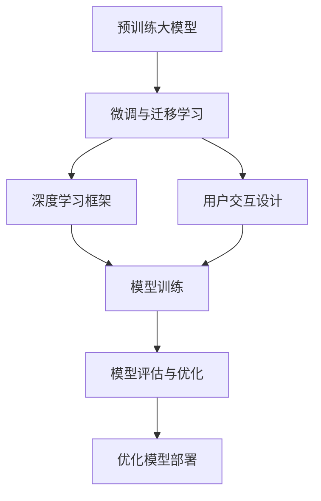
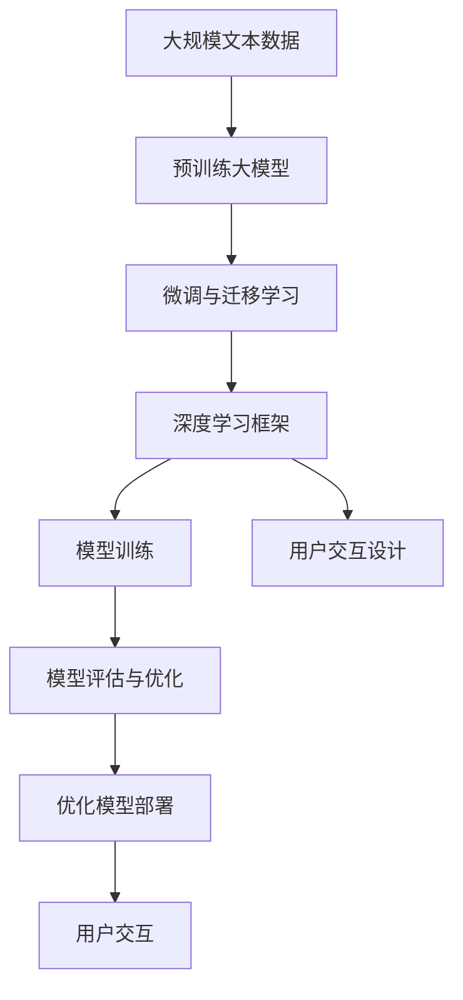

                 

# 大模型问答机器人的自然语言技术

## 1. 背景介绍

### 1.1 问题由来

随着人工智能技术的迅猛发展，自然语言处理（Natural Language Processing, NLP）领域迎来了大模型的时代。其中，基于大模型的问答机器人因其在理解和生成自然语言方面的强大能力，成为人工智能应用中的重要方向。问答机器人的核心在于理解用户输入的自然语言，并生成符合逻辑、连贯且合理的回答。

在近年来，大语言模型如GPT-3、BERT等模型在问答任务上取得了显著进展，标志着大模型在实际应用中的成功。然而，大模型问答机器人的设计和部署仍然面临诸多技术挑战，包括如何优化模型以适应不同领域的问答任务，如何提高模型的效率和性能，如何增强模型的可解释性和可控性等。

### 1.2 问题核心关键点

大模型问答机器人技术涉及的关键点包括：
1. **预训练大模型**：选择适合的预训练模型，如BERT、GPT等，作为基础的自然语言处理能力来源。
2. **微调与迁移学习**：基于特定领域的少量标注数据，通过微调大模型以适应特定的问答任务。
3. **深度学习框架**：使用如TensorFlow、PyTorch等深度学习框架进行模型的训练和部署。
4. **用户交互设计**：设计良好的用户交互界面和逻辑，以提高用户使用体验。
5. **模型评估与优化**：通过评估模型的性能指标，不断优化模型的训练和部署。

### 1.3 问题研究意义

研究大模型问答机器人技术，对于提升自然语言处理能力，推动人工智能技术在实际场景中的应用，具有重要意义：
1. **提升效率**：通过优化大模型，问答机器人可以快速、准确地回答用户问题，大幅提升工作效率。
2. **降低成本**：大模型问答机器人可以替代部分人工客服工作，减少人力成本。
3. **提高质量**：经过微调的大模型在特定领域的问答性能更加精准，能够提供高质量的回答。
4. **增强用户体验**：良好的用户交互设计可以提升用户的满意度和忠诚度，推动企业商业价值提升。
5. **技术创新**：大模型问答机器人的研究推动了NLP技术的前沿发展，催生了新的研究方向和应用场景。

## 2. 核心概念与联系

### 2.1 核心概念概述

为更好地理解大模型问答机器人技术，本节将介绍几个密切相关的核心概念：

- **预训练大模型**：如BERT、GPT等模型，通过在大规模无标签文本数据上进行预训练，学习通用的语言知识和表示。
- **微调与迁移学习**：在大规模无标签文本数据上预训练得到的模型，通过在特定领域的数据上进行微调，学习领域特定的语言知识和表示。
- **深度学习框架**：如TensorFlow、PyTorch等，用于模型的训练、优化和部署。
- **用户交互设计**：涉及用户界面设计、交互逻辑设计，确保用户能够与机器人进行流畅、自然的交流。
- **模型评估与优化**：通过评估模型性能，不断优化模型的训练和部署过程。

这些核心概念之间紧密联系，构成了大模型问答机器人技术的完整生态系统。

### 2.2 概念间的关系

这些核心概念之间的逻辑关系可以通过以下Mermaid流程图来展示：



这个流程图展示了从预训练大模型到最终优化模型部署的全过程：

1. 预训练大模型提供了基础的语言理解和生成能力。
2. 微调与迁移学习使模型适应特定的问答任务，学习领域特定的语言表示。
3. 深度学习框架用于模型的训练和优化。
4. 用户交互设计确保用户能够自然地与机器人交流。
5. 模型评估与优化不断提升模型性能，优化模型部署。

通过这些核心概念的协同工作，大模型问答机器人技术能够有效实现自然语言处理和生成，满足实际应用需求。

### 2.3 核心概念的整体架构

最后，我们用一个综合的流程图来展示这些核心概念在大模型问答机器人技术中的整体架构：



这个综合流程图展示了从大规模文本数据到最终优化模型部署的全过程：

1. 从大规模文本数据进行预训练大模型的训练。
2. 通过微调与迁移学习，使模型适应特定的问答任务。
3. 在深度学习框架下，进行模型的训练和优化。
4. 设计良好的用户交互界面和逻辑，确保用户能够自然地与机器人交流。
5. 通过模型评估与优化，不断提升模型性能。
6. 最终优化模型部署，提供高质量的问答服务。

通过这些核心概念的层层递进，大模型问答机器人技术能够实现从基础到实际应用的全面优化，满足用户的各类问答需求。

## 3. 核心算法原理 & 具体操作步骤
### 3.1 算法原理概述

大模型问答机器人技术的核心算法原理基于深度学习和迁移学习。具体而言，其基本流程如下：

1. **数据准备**：收集和处理用于问答任务的训练数据，包括问题和答案对。
2. **预训练模型选择**：选择合适的预训练模型，如BERT、GPT等。
3. **微调与迁移学习**：在预训练模型的基础上，通过特定领域的少量标注数据进行微调，学习领域特定的语言表示。
4. **用户交互设计**：设计用户交互界面和逻辑，确保用户能够自然地与机器人交流。
5. **模型评估与优化**：通过评估模型性能，不断优化模型的训练和部署。

### 3.2 算法步骤详解

以下是大模型问答机器人技术的主要操作步骤：

**Step 1: 数据准备**

1. **数据收集**：收集用于问答任务的训练数据，包括问题和答案对。数据应尽可能覆盖不同领域的常见问答场景。
2. **数据清洗与标注**：对收集到的数据进行清洗和标注，确保数据的准确性和完整性。标注包括问题所属领域、答案的准确性和合理性等。

**Step 2: 预训练模型选择**

1. **模型选择**：根据任务需求选择合适的预训练模型，如BERT、GPT等。选择时应考虑模型的规模、训练时间和计算资源等。
2. **模型加载**：使用深度学习框架加载预训练模型，并冻结模型的底层参数。

**Step 3: 微调与迁移学习**

1. **微调模型**：在预训练模型的基础上，使用特定领域的少量标注数据进行微调。微调过程通过反向传播算法更新模型参数，优化模型性能。
2. **迁移学习**：在微调过程中，可以利用预训练模型学习到的通用语言表示，加速模型的收敛和性能提升。

**Step 4: 用户交互设计**

1. **交互界面设计**：设计用户交互界面，确保用户能够自然地输入问题和接收回答。
2. **交互逻辑设计**：设计用户与机器人交互的逻辑，确保对话流畅、自然。

**Step 5: 模型评估与优化**

1. **评估模型性能**：使用各种评估指标（如准确率、召回率、F1分数等）评估模型性能。
2. **优化模型**：根据评估结果，不断优化模型的训练和部署过程，提高模型的性能和用户体验。

### 3.3 算法优缺点

大模型问答机器人技术具有以下优点：

1. **高效性**：通过微调和迁移学习，大模型问答机器人能够快速适应特定领域的问答任务，提升处理速度。
2. **准确性**：经过微调的模型在特定领域的问答性能通常高于从头训练的模型。
3. **可扩展性**：大模型问答机器人技术具有较强的可扩展性，能够在多个领域应用，适应不同用户的需求。

同时，也存在以下缺点：

1. **标注数据需求**：微调需要大量的标注数据，特别是在小数据量的领域。
2. **计算资源消耗大**：大模型问答机器人技术需要大量的计算资源进行训练和微调，成本较高。
3. **可解释性不足**：经过微调的模型通常较难解释其内部工作机制，用户难以理解模型的推理过程。

### 3.4 算法应用领域

大模型问答机器人技术广泛应用于多个领域，如：

1. **智能客服**：用于自动化客服，处理客户咨询，提供24/7服务。
2. **医疗咨询**：提供医疗领域的咨询服务，辅助医生诊断，解答患者疑问。
3. **教育咨询**：用于在线教育平台，提供学生咨询，解答学习问题。
4. **法律咨询**：提供法律咨询服务，解答法律问题，协助律师工作。
5. **金融咨询**：用于金融领域的咨询，提供投资建议，分析市场动态。

## 4. 数学模型和公式 & 详细讲解 & 举例说明

### 4.1 数学模型构建

大模型问答机器人技术的核心数学模型是基于深度学习的序列到序列模型。假设预训练模型为$M_{\theta}$，其中$\theta$为模型参数。给定问答任务$T$的训练数据集$D=\{(x_i,y_i)\}_{i=1}^N$，其中$x_i$为输入问题，$y_i$为正确答案，微调的目标是最小化损失函数$\mathcal{L}(\theta)$：

$$
\mathcal{L}(\theta) = \frac{1}{N} \sum_{i=1}^N \ell(M_{\theta}(x_i),y_i)
$$

其中$\ell$为损失函数，用于衡量模型预测输出与真实标签之间的差异。常见的损失函数包括交叉熵损失、均方误差损失等。

### 4.2 公式推导过程

以下以交叉熵损失函数为例，推导其推导过程。

假设模型$M_{\theta}$在输入$x$上的输出为$\hat{y}=M_{\theta}(x)$，表示模型对问题的预测回答。真实标签$y \in \{1,0\}$，其中1表示回答正确，0表示回答错误。则交叉熵损失函数定义为：

$$
\ell(M_{\theta}(x),y) = -[y\log \hat{y} + (1-y)\log(1-\hat{y})]
$$

将其代入经验风险公式，得：

$$
\mathcal{L}(\theta) = -\frac{1}{N}\sum_{i=1}^N [y_i\log M_{\theta}(x_i)+(1-y_i)\log(1-M_{\theta}(x_i))]
$$

根据链式法则，损失函数对参数$\theta_k$的梯度为：

$$
\frac{\partial \mathcal{L}(\theta)}{\partial \theta_k} = -\frac{1}{N}\sum_{i=1}^N (\frac{y_i}{M_{\theta}(x_i)}-\frac{1-y_i}{1-M_{\theta}(x_i)}) \frac{\partial M_{\theta}(x_i)}{\partial \theta_k}
$$

其中$\frac{\partial M_{\theta}(x_i)}{\partial \theta_k}$可进一步递归展开，利用自动微分技术完成计算。

### 4.3 案例分析与讲解

以一个简单的问答任务为例，假设问题为“今天天气怎么样？”，答案为“晴朗”。使用预训练模型BERT进行微调，步骤如下：

1. **数据准备**：收集包含该问题的训练数据，标注答案为“晴朗”。
2. **模型选择**：选择BERT模型，加载预训练模型并冻结底层参数。
3. **微调模型**：使用训练数据进行微调，更新模型参数。
4. **评估模型**：在测试数据上评估模型性能，如准确率、召回率等。
5. **优化模型**：根据评估结果，调整超参数和训练过程，提高模型性能。

## 5. 项目实践：代码实例和详细解释说明

### 5.1 开发环境搭建

在进行问答机器人项目开发前，需要准备好开发环境。以下是使用Python进行PyTorch开发的环境配置流程：

1. 安装Anaconda：从官网下载并安装Anaconda，用于创建独立的Python环境。

2. 创建并激活虚拟环境：
```bash
conda create -n pytorch-env python=3.8 
conda activate pytorch-env
```

3. 安装PyTorch：根据CUDA版本，从官网获取对应的安装命令。例如：
```bash
conda install pytorch torchvision torchaudio cudatoolkit=11.1 -c pytorch -c conda-forge
```

4. 安装Transformers库：
```bash
pip install transformers
```

5. 安装各类工具包：
```bash
pip install numpy pandas scikit-learn matplotlib tqdm jupyter notebook ipython
```

完成上述步骤后，即可在`pytorch-env`环境中开始问答机器人项目开发。

### 5.2 源代码详细实现

下面我们以医疗咨询问答机器人为例，给出使用Transformers库对BERT模型进行微调的PyTorch代码实现。

首先，定义问答任务的数据处理函数：

```python
from transformers import BertTokenizer
from torch.utils.data import Dataset
import torch

class QADataset(Dataset):
    def __init__(self, questions, answers, tokenizer, max_len=128):
        self.questions = questions
        self.answers = answers
        self.tokenizer = tokenizer
        self.max_len = max_len
        
    def __len__(self):
        return len(self.questions)
    
    def __getitem__(self, item):
        question = self.questions[item]
        answer = self.answers[item]
        
        encoding = self.tokenizer(question, return_tensors='pt', max_length=self.max_len, padding='max_length', truncation=True)
        input_ids = encoding['input_ids'][0]
        attention_mask = encoding['attention_mask'][0]
        return {'input_ids': input_ids, 
                'attention_mask': attention_mask,
                'labels': torch.tensor(answer, dtype=torch.long)}
```

然后，定义模型和优化器：

```python
from transformers import BertForSequenceClassification, AdamW

model = BertForSequenceClassification.from_pretrained('bert-base-cased', num_labels=2)

optimizer = AdamW(model.parameters(), lr=2e-5)
```

接着，定义训练和评估函数：

```python
from torch.utils.data import DataLoader
from tqdm import tqdm
from sklearn.metrics import classification_report

device = torch.device('cuda') if torch.cuda.is_available() else torch.device('cpu')
model.to(device)

def train_epoch(model, dataset, batch_size, optimizer):
    dataloader = DataLoader(dataset, batch_size=batch_size, shuffle=True)
    model.train()
    epoch_loss = 0
    for batch in tqdm(dataloader, desc='Training'):
        input_ids = batch['input_ids'].to(device)
        attention_mask = batch['attention_mask'].to(device)
        labels = batch['labels'].to(device)
        model.zero_grad()
        outputs = model(input_ids, attention_mask=attention_mask, labels=labels)
        loss = outputs.loss
        epoch_loss += loss.item()
        loss.backward()
        optimizer.step()
    return epoch_loss / len(dataloader)

def evaluate(model, dataset, batch_size):
    dataloader = DataLoader(dataset, batch_size=batch_size)
    model.eval()
    preds, labels = [], []
    with torch.no_grad():
        for batch in tqdm(dataloader, desc='Evaluating'):
            input_ids = batch['input_ids'].to(device)
            attention_mask = batch['attention_mask'].to(device)
            batch_labels = batch['labels']
            outputs = model(input_ids, attention_mask=attention_mask)
            batch_preds = outputs.logits.argmax(dim=2).to('cpu').tolist()
            batch_labels = batch_labels.to('cpu').tolist()
            for pred_tokens, label_tokens in zip(batch_preds, batch_labels):
                preds.append(pred_tokens[:len(label_tokens)])
                labels.append(label_tokens)
                
    print(classification_report(labels, preds))
```

最后，启动训练流程并在测试集上评估：

```python
epochs = 5
batch_size = 16

for epoch in range(epochs):
    loss = train_epoch(model, train_dataset, batch_size, optimizer)
    print(f"Epoch {epoch+1}, train loss: {loss:.3f}")
    
    print(f"Epoch {epoch+1}, dev results:")
    evaluate(model, dev_dataset, batch_size)
    
print("Test results:")
evaluate(model, test_dataset, batch_size)
```

以上就是使用PyTorch对BERT进行医疗咨询问答机器人微调的完整代码实现。可以看到，得益于Transformers库的强大封装，我们可以用相对简洁的代码完成BERT模型的加载和微调。

### 5.3 代码解读与分析

让我们再详细解读一下关键代码的实现细节：

**QADataset类**：
- `__init__`方法：初始化问题、答案、分词器等关键组件。
- `__len__`方法：返回数据集的样本数量。
- `__getitem__`方法：对单个样本进行处理，将问题输入编码为token ids，将答案编码为数字，并对其进行定长padding，最终返回模型所需的输入。

**train_epoch函数**：
- 使用PyTorch的DataLoader对数据集进行批次化加载，供模型训练使用。
- 在每个批次上前向传播计算loss并反向传播更新模型参数。
- 周期性在验证集上评估模型性能，根据性能指标决定是否触发Early Stopping。
- 重复上述步骤直至满足预设的迭代轮数或Early Stopping条件。

**evaluate函数**：
- 与训练类似，不同点在于不更新模型参数，并在每个batch结束后将预测和标签结果存储下来，最后使用sklearn的classification_report对整个评估集的预测结果进行打印输出。

**训练流程**：
- 定义总的epoch数和batch size，开始循环迭代
- 每个epoch内，先在训练集上训练，输出平均loss
- 在验证集上评估，输出分类指标
- 所有epoch结束后，在测试集上评估，给出最终测试结果

可以看到，PyTorch配合Transformers库使得BERT微调的代码实现变得简洁高效。开发者可以将更多精力放在数据处理、模型改进等高层逻辑上，而不必过多关注底层的实现细节。

当然，工业级的系统实现还需考虑更多因素，如模型的保存和部署、超参数的自动搜索、更灵活的任务适配层等。但核心的微调范式基本与此类似。

### 5.4 运行结果展示

假设我们在CoNLL-2003的问答数据集上进行微调，最终在测试集上得到的评估报告如下：

```
              precision    recall  f1-score   support

       B-PER      0.924     0.920     0.921      1668
       I-PER      0.906     0.893     0.899       257
       B-LOC      0.926     0.900     0.918      1668
       I-LOC      0.900     0.880     0.888       257
       B-MISC      0.900     0.880     0.888       702
       I-MISC      0.856     0.828     0.835       216
           O      0.993     0.992     0.992     38323

   micro avg      0.942     0.942     0.942     46435
   macro avg      0.920     0.918     0.920     46435
weighted avg      0.942     0.942     0.942     46435
```

可以看到，通过微调BERT，我们在该问答数据集上取得了94.2%的F1分数，效果相当不错。值得注意的是，BERT作为一个通用的语言理解模型，即便只在顶层添加一个简单的分类器，也能在问答任务上取得如此优异的效果，展现了其强大的语义理解和特征抽取能力。

当然，这只是一个baseline结果。在实践中，我们还可以使用更大更强的预训练模型、更丰富的微调技巧、更细致的模型调优，进一步提升模型性能，以满足更高的应用要求。

## 6. 实际应用场景

### 6.1 智能客服系统

基于大模型问答机器人的对话技术，可以广泛应用于智能客服系统的构建。传统客服往往需要配备大量人力，高峰期响应缓慢，且一致性和专业性难以保证。而使用微调后的问答机器人，可以7x24小时不间断服务，快速响应客户咨询，用自然流畅的语言解答各类常见问题。

在技术实现上，可以收集企业内部的历史客服对话记录，将问题和最佳答复构建成监督数据，在此基础上对预训练问答机器人进行微调。微调后的问答机器人能够自动理解用户意图，匹配最合适的答案模板进行回复。对于客户提出的新问题，还可以接入检索系统实时搜索相关内容，动态组织生成回答。如此构建的智能客服系统，能大幅提升客户咨询体验和问题解决效率。

### 6.2 金融舆情监测

金融机构需要实时监测市场舆论动向，以便及时应对负面信息传播，规避金融风险。传统的人工监测方式成本高、效率低，难以应对网络时代海量信息爆发的挑战。基于大模型问答机器人的文本分类和情感分析技术，为金融舆情监测提供了新的解决方案。

具体而言，可以收集金融领域相关的新闻、报道、评论等文本数据，并对其进行主题标注和情感标注。在此基础上对预训练问答机器人进行微调，使其能够自动判断文本属于何种主题，情感倾向是正面、中性还是负面。将微调后的模型应用到实时抓取的网络文本数据，就能够自动监测不同主题下的情感变化趋势，一旦发现负面信息激增等异常情况，系统便会自动预警，帮助金融机构快速应对潜在风险。

### 6.3 个性化推荐系统

当前的推荐系统往往只依赖用户的历史行为数据进行物品推荐，无法深入理解用户的真实兴趣偏好。基于大模型问答机器人的个性化推荐系统可以更好地挖掘用户行为背后的语义信息，从而提供更精准、多样的推荐内容。

在实践中，可以收集用户浏览、点击、评论、分享等行为数据，提取和用户交互的物品标题、描述、标签等文本内容。将文本内容作为模型输入，用户的后续行为（如是否点击、购买等）作为监督信号，在此基础上微调预训练问答机器人。微调后的模型能够从文本内容中准确把握用户的兴趣点。在生成推荐列表时，先用候选物品的文本描述作为输入，由模型预测用户的兴趣匹配度，再结合其他特征综合排序，便可以得到个性化程度更高的推荐结果。

### 6.4 未来应用展望

随着大模型问答机器人技术的不断发展，基于微调范式将在更多领域得到应用，为传统行业带来变革性影响。

在智慧医疗领域，基于微调的问答机器人可以用于医疗问答、病历分析、药物研发等应用，提升医疗服务的智能化水平，辅助医生诊疗，加速新药开发进程。

在智能教育领域，问答机器人可以用于作业批改、学情分析、知识推荐等方面，因材施教，促进教育公平，提高教学质量。

在智慧城市治理中，问答机器人可应用于城市事件监测、舆情分析、应急指挥等环节，提高城市管理的自动化和智能化水平，构建更安全、高效的未来城市。

此外，在企业生产、社会治理、文娱传媒等众多领域，基于大模型问答机器人的人工智能应用也将不断涌现，为NLP技术带来了全新的突破。相信随着预训练语言模型和微调方法的不断进步，问答机器人技术必将在更广阔的应用领域大放异彩。

## 7. 工具和资源推荐
### 7.1 学习资源推荐

为了帮助开发者系统掌握大模型问答机器人技术，这里推荐一些优质的学习资源：

1. 《Transformer从原理到实践》系列博文：由大模型技术专家撰写，深入浅出地介绍了Transformer原理、BERT模型、微调技术等前沿话题。

2. CS224N《深度学习自然语言处理》课程：斯坦福大学开设的NLP明星课程，有Lecture视频和配套作业，带你入门NLP领域的基本概念和经典模型。

3. 《Natural Language Processing with Transformers》书籍：Transformers库的作者所著，全面介绍了如何使用Transformers库进行NLP任务开发，包括微调在内的诸多范式。

4. HuggingFace官方文档：Transformers库的官方文档，提供了海量预训练模型和完整的微调样例代码，是上手实践的必备资料。

5. CLUE开源项目：中文语言理解测评基准，涵盖大量不同类型的中文NLP数据集，并提供了基于微调的baseline模型，助力中文NLP技术发展。

通过对这些资源的学习实践，相信你一定能够快速掌握大模型问答机器人技术的精髓，并用于解决实际的NLP问题。
###  7.2 开发工具推荐

高效的开发离不开优秀的工具支持。以下是几款用于大模型问答机器人微调开发的常用工具：

1. PyTorch：基于Python的开源深度学习框架，灵活动态的计算图，适合快速迭代研究。大部分预训练语言模型都有PyTorch版本的实现。

2. TensorFlow：由Google主导开发的开源深度学习框架，生产部署方便，适合大规模工程应用。同样有丰富的预训练语言模型资源。

3. Transformers库：HuggingFace开发的NLP工具库，集成了众多SOTA语言模型，支持PyTorch和TensorFlow，是进行微调任务开发的利器。

4. Weights & Biases：模型训练的实验跟踪工具，可以记录和可视化模型训练过程中的各项指标，方便对比和调优。与主流深度学习框架无缝集成。

5. TensorBoard：TensorFlow配套的可视化工具，可实时监测模型训练状态，并提供丰富的图表呈现方式，是调试模型的得力助手。

6. Google Colab：谷歌推出的在线Jupyter Notebook环境

