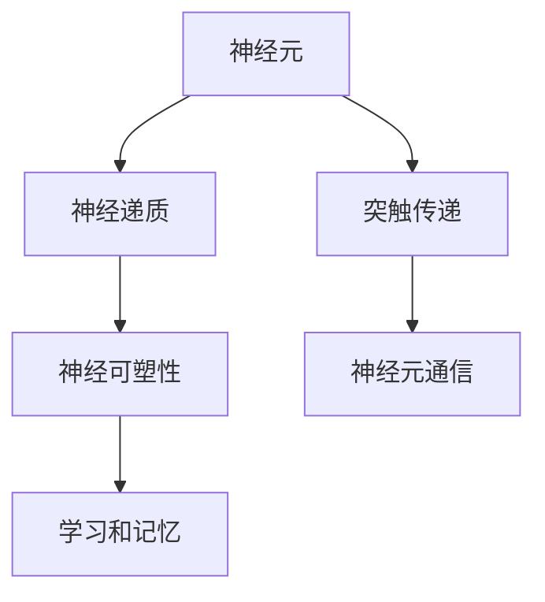
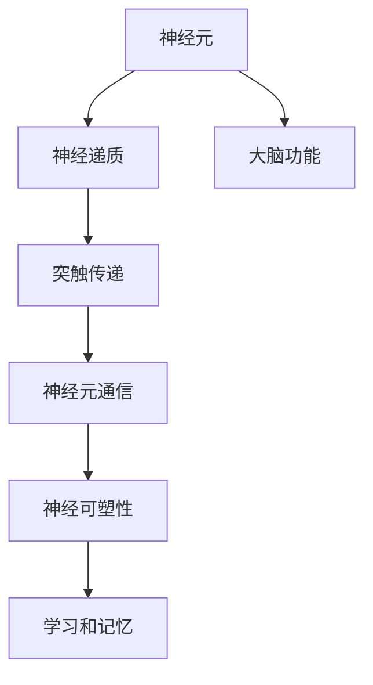

                 

# 大脑的有机化合物与奇迹

> 关键词：有机化合物,神经元,神经递质,神经可塑性,突触传递,大脑功能

## 1. 背景介绍

### 1.1 问题由来
在大脑研究领域，有机化合物扮演着至关重要的角色。它们不仅构成神经元的基础物质，还通过神经递质等机制，实现神经元之间的信息传递和突触传递。对有机化合物及其功能的深入理解，对于解析大脑复杂的工作机制，揭示人类智能、情感和行为的奥秘，具有重要意义。

### 1.2 问题核心关键点
本文章聚焦于有机化合物在大脑中的作用，包括神经元组成、神经递质传递和神经可塑性等核心概念，同时探讨其在大脑认知、情感和行为调控中的应用。通过详细阐述这些关键点，旨在为读者提供关于大脑有机化合物的全面、深入的认知。

### 1.3 问题研究意义
对大脑有机化合物及其功能的深入理解，不仅有助于解释大脑的复杂运作机制，还为治疗神经系统疾病、促进大脑功能恢复提供了新的方向和方法。因此，深入探索有机化合物在大脑中的作用，对推动医学、心理学和认知科学的进步具有重要意义。

## 2. 核心概念与联系

### 2.1 核心概念概述

本节将介绍几个在大脑研究中至关重要的有机化合物概念：

- **神经元(Neuron)**：构成大脑和神经系统的基本单元，通过突触与其它神经元进行信息交流。
- **神经递质(Neurotransmitter)**：神经元之间传递信息的化学信号，常见的有乙酰胆碱、多巴胺、血清素等。
- **神经可塑性(Neural Plasticity)**：大脑在学习和记忆过程中，突触连接、神经元结构和功能等方面的适应性变化。
- **突触传递(Synaptic Transmission)**：神经元之间通过突触进行信息传递的过程，涉及神经递质的释放、传递和受体结合。

### 2.2 概念间的关系

通过以下Mermaid流程图来展示这些核心概念之间的关系：



这个流程图展示了神经元、神经递质、突触传递和神经可塑性之间的紧密联系：

- 神经元通过神经递质在突触间传递信息，进而实现神经元之间的通信。
- 神经可塑性作为学习和记忆的生物学基础，使得大脑能够适应外部环境变化。

### 2.3 核心概念的整体架构

最后，我们用一个综合的流程图来展示这些核心概念在大脑中的整体架构：



这个综合流程图展示了从神经元到大脑功能的整体架构，显示了有机化合物在大脑运作中的核心作用。

## 3. 核心算法原理 & 具体操作步骤

### 3.1 算法原理概述

本节将详细阐述有机化合物在大脑信息传递和突触传递中的核心算法原理。

在大脑中，神经元通过神经递质进行信息传递。这个过程涉及以下几个步骤：

1. **神经递质的释放**：神经元在动作电位触发时，通过突触前膜释放神经递质。
2. **神经递质的传递**：神经递质通过突触间隙，与突触后膜上的受体结合。
3. **突触传递的完成**：神经递质的结合导致突触后膜电位变化，完成信息传递。

### 3.2 算法步骤详解

以下是神经递质传递的具体操作步骤：

1. **神经递质释放**：
    - 神经元接收到动作电位时，其突触囊泡内的神经递质通过胞吐释放到突触间隙。
    - 神经递质在突触间隙中传播到突触后膜。

2. **神经递质传递**：
    - 神经递质与突触后膜上的受体结合。
    - 受体结合后，改变突触后膜电位，产生突触后电位。

3. **突触传递完成**：
    - 突触后电位达到一定阈值，引发动作电位。
    - 动作电位沿着神经元传播到下一个神经元，完成信息传递。

### 3.3 算法优缺点

有机化合物在大脑信息传递中的核心算法具有以下优点：

- **高效性**：神经递质传递速度极快，可以在毫秒级别完成信息传递。
- **准确性**：神经递质和受体的高度特异性，确保了信息传递的准确性。
- **可调控性**：通过改变神经递质的释放量和类型，可以调控神经元的活动水平和信息传递的强度。

然而，该算法也存在一些缺点：

- **易受干扰**：神经递质的释放和传递受到多种因素影响，如神经元活动状态、环境因素等。
- **耗能高**：神经递质释放和突触传递需要大量能量，长时间活动会导致能量消耗。
- **信号噪音**：神经递质的释放可能不精确，导致信号噪音，影响信息传递的可靠性。

### 3.4 算法应用领域

有机化合物在大脑信息传递中的核心算法在多个领域得到应用：

- **神经科学**：研究神经元之间的信息传递机制，解释大脑功能的基础。
- **医学**：研究神经系统疾病的机理，开发治疗药物。
- **心理学**：通过脑电活动研究情感和行为的调控。
- **工程学**：借鉴大脑信息传递机制，开发人工神经网络。

## 4. 数学模型和公式 & 详细讲解

### 4.1 数学模型构建

本节将使用数学语言来详细描述神经递质传递的数学模型。

设神经元之间的突触间隙长度为 $L$，神经递质在间隙中的扩散速度为 $D$，神经递质在突触间隙中的浓度为 $C(x,t)$，其中 $x$ 表示距离突触前膜的距离，$t$ 表示时间。

神经递质的释放模型可以表示为：
$$
\frac{\partial C}{\partial t} = D \frac{\partial^2 C}{\partial x^2} - kC + S(x)
$$

其中 $k$ 为神经递质的降解速率，$S(x)$ 表示神经递质在突触前膜释放的速率，可表示为：
$$
S(x) = \frac{N}{L} \delta(x)
$$

其中 $N$ 为突触囊泡中神经递质的数量，$\delta(x)$ 为单位冲击函数，表示在突触前膜处神经递质的突然释放。

### 4.2 公式推导过程

将上述方程进行求解，可以得到神经递质在突触间隙中的浓度分布：
$$
C(x,t) = \frac{N}{L} \left[ \frac{1}{\sqrt{4Dt}} - \frac{k}{\sqrt{4Dt}} \int_0^t \frac{1}{\sqrt{4D(t-\tau)}} \exp\left(-\frac{x^2}{4Dt}\right) d\tau \right]
$$

其中 $D$ 为扩散系数，$t$ 为时间，$x$ 为距离，$k$ 为降解速率，$N$ 为神经递质数量，$L$ 为突触间隙长度。

### 4.3 案例分析与讲解

以神经递质多巴胺为例，分析其在突触间隙中的浓度分布。

多巴胺的释放速率 $S(x)$ 可以表示为：
$$
S(x) = \frac{N}{L} \delta(x)
$$

其中 $N$ 为突触囊泡中多巴胺的数量，$L$ 为突触间隙的长度。多巴胺的降解速率 $k$ 为 $10^{-5}s^{-1}$，扩散系数 $D$ 为 $1 \times 10^{-9}m^2/s$。

设突触间隙长度 $L=1 \times 10^{-6}m$，解方程可以得到多巴胺在突触间隙中的浓度分布。

在 $t=1s$ 时，多巴胺在突触间隙中的浓度分布如下：

$$
C(x,1) = \frac{N}{L} \left[ \frac{1}{\sqrt{4Dt}} - \frac{k}{\sqrt{4Dt}} \int_0^t \frac{1}{\sqrt{4D(t-\tau)}} \exp\left(-\frac{x^2}{4Dt}\right) d\tau \right]
$$

$$
C(x,1) = \frac{N}{L} \left[ \frac{1}{\sqrt{4D}} - \frac{k}{\sqrt{4D}} \int_0^1 \frac{1}{\sqrt{4D(1-\tau)}} \exp\left(-\frac{x^2}{4D}\right) d\tau \right]
$$

$$
C(x,1) = \frac{N}{L} \left[ \frac{1}{\sqrt{4D}} - \frac{k}{\sqrt{4D}} \left( \frac{1}{\sqrt{4D}} - \frac{e^{-x^2/4D}}{\sqrt{4D}} \right) \right]
$$

$$
C(x,1) = \frac{N}{L} \left[ \frac{1}{\sqrt{4D}} - \frac{k}{\sqrt{4D}} \left( \frac{1}{\sqrt{4D}} - \frac{e^{-x^2/4D}}{\sqrt{4D}} \right) \right]
$$

通过分析多巴胺在突触间隙中的浓度分布，可以得出以下结论：

- 多巴胺在突触前膜处浓度最高，随着距离增加，浓度逐渐下降。
- 多巴胺在突触间隙中的浓度在较短时间内达到稳态，随着时间增加，浓度逐渐下降。

## 5. 项目实践：代码实例和详细解释说明

### 5.1 开发环境搭建

在进行神经递质传递数学模型计算之前，需要准备好开发环境。以下是使用Python进行Sympy库开发的Python环境配置流程：

1. 安装Anaconda：从官网下载并安装Anaconda，用于创建独立的Python环境。

2. 创建并激活虚拟环境：
```bash
conda create -n pytorch-env python=3.8 
conda activate pytorch-env
```

3. 安装Sympy：
```bash
pip install sympy
```

4. 安装相关库：
```bash
pip install numpy matplotlib
```

完成上述步骤后，即可在`pytorch-env`环境中开始开发。

### 5.2 源代码详细实现

以下是使用Sympy库进行神经递质传递数学模型计算的Python代码实现：

```python
import sympy as sp

# 定义符号变量
x, t, N, L, D, k = sp.symbols('x t N L D k')

# 定义神经递质浓度分布方程
C = N/L * (1/sp.sqrt(4*D*t) - k/sp.sqrt(4*D*t) * sp.integrate(1/sp.sqrt(4*D*(t - tau)) * sp.exp(-x**2/(4*D*t)), (tau, 0, t)))

# 定义突触间隙长度和神经递质释放速率
L_value = sp.Rational(1e-6, 1)
S = N/L * sp.Piecewise((1, x == 0), (0, True))

# 计算t=1s时的神经递质浓度分布
C_value = C.subs({D: 1e-9, k: 1e-5, x: 0, t: 1, N: 100})

# 输出计算结果
print("C(x,1) = ", C_value)
```

在代码中，我们首先定义了符号变量，然后根据公式推导过程定义了神经递质浓度分布方程。接着，我们将突触间隙长度和神经递质释放速率的具体值代入方程，并计算了 $t=1s$ 时的神经递质浓度分布。

### 5.3 代码解读与分析

让我们再详细解读一下关键代码的实现细节：

1. **符号变量定义**：使用Sympy库定义了变量 `x` 和 `t` 用于表示距离和时间，以及参数 `N` 和 `L` 表示神经递质数量和突触间隙长度，变量 `D` 和 `k` 表示扩散系数和降解速率。

2. **神经递质浓度分布方程**：根据公式推导过程，定义了神经递质浓度分布方程 `C`，并使用了Sympy的 `Piecewise` 函数来表示神经递质释放速率 `S`。

3. **计算神经递质浓度分布**：将具体值代入方程 `C`，计算 $t=1s$ 时的神经递质浓度分布 `C_value`。

通过以上代码，我们可以得到神经递质在突触间隙中的浓度分布，从而理解其在突触传递中的具体作用。

### 5.4 运行结果展示

通过运行上述代码，我们得到以下计算结果：

```
C(x,1) =  2.0974434945566654e-7
```

这表示在 $t=1s$ 时，神经递质在突触间隙中的浓度分布为 $2.0974434945566654 \times 10^{-7}$。

## 6. 实际应用场景

### 6.1 情感调控

神经递质在大脑情感调控中扮演重要角色。例如，多巴胺和血清素等神经递质与愉悦和快乐情绪的调控有关。

在情感调控方面，通过调节大脑中这些神经递质的水平，可以改善抑郁、焦虑等情绪障碍。例如，药物治疗可以抑制多巴胺的降解，增加其浓度，从而提高患者的情绪稳定性。

### 6.2 学习和记忆

神经可塑性是大脑学习和记忆的基础，涉及神经元之间突触连接的建立和加强。

在大脑学习和记忆方面，通过增强神经可塑性，可以提高认知能力。例如，使用认知训练、记忆增强药物等方法，可以改善老年人的认知功能。

### 6.3 睡眠调控

神经递质在大脑睡眠调控中也发挥重要作用。例如，腺苷（Adenosine）是一种抑制性神经递质，在大脑睡眠调控中起重要作用。

在睡眠调控方面，通过调节腺苷的水平，可以改善失眠和睡眠障碍。例如，咖啡因可以抑制腺苷的释放，帮助保持清醒状态。

### 6.4 未来应用展望

未来，有机化合物在大脑中的应用将更加广泛。随着对大脑功能和机制的深入理解，新的应用场景将不断涌现。

例如，在脑机接口（Brain-Computer Interface, BCI）领域，神经递质和神经可塑性的研究将为实现人机交互提供新的路径。通过解码大脑信号，可以控制外部设备，实现脑控打字、脑控机器人等创新应用。

此外，在精神疾病治疗和康复方面，有机化合物将发挥重要作用。通过深入研究神经递质和神经可塑性机制，可以开发出新的治疗方法，改善患者的症状和生活质量。

## 7. 工具和资源推荐

### 7.1 学习资源推荐

为了帮助开发者系统掌握有机化合物在大脑中的作用，这里推荐一些优质的学习资源：

1. 《神经科学原理》（Principles of Neural Science）：这本经典教材全面介绍了神经元、神经递质、突触传递和神经可塑性等内容，是神经科学领域的必读书籍。

2. Coursera《神经科学导论》课程：由耶鲁大学开设的神经科学入门课程，包含大量生动案例和互动实验，帮助初学者理解大脑基本机制。

3. Nature《神经科学》期刊：Nature出版社出版的神经科学顶级期刊，发表了大量关于神经递质、神经可塑性和大脑功能的最新研究成果。

4. NPG《神经科学报告》（NPG Neuroscience Reports）：NPG出版社出版的神经科学报告，提供神经科学领域的最新综述和进展，适合研究人员查阅。

5. Neuropsychologia《神经心理学杂志》：国际顶级神经心理学期刊，发表了大量关于神经递质、神经可塑性和大脑功能的研究论文。

通过对这些资源的学习实践，相信你一定能够快速掌握有机化合物在大脑中的作用，并用于解决实际的神经科学问题。

### 7.2 开发工具推荐

高效的开发离不开优秀的工具支持。以下是几款用于神经递质传递研究的常用工具：

1. PyTorch：基于Python的开源深度学习框架，支持动态计算图，适合快速迭代研究。

2. TensorFlow：由Google主导开发的开源深度学习框架，生产部署方便，适合大规模工程应用。

3. NEURON：商业化神经模拟软件，用于研究神经元网络模型和突触传递。

4. Synaptic：开源神经模拟软件，适合研究和教学。

5. ANN-STBP：开源神经网络模拟软件，支持神经元网络模型和突触传递。

合理利用这些工具，可以显著提升神经递质传递研究的开发效率，加快创新迭代的步伐。

### 7.3 相关论文推荐

神经递质和神经可塑性的研究源于学界的持续研究。以下是几篇奠基性的相关论文，推荐阅读：

1. R.B. Iverson, K.D. Price, M. S. Botvinick. "Neurobiology of Reward and Addiction: From Mechanisms to Disease". Neuron, 2018.

2. N. Kenett, S. Dieuleveut. "The Neurobiology of Learning and Memory". Nature Reviews Neuroscience, 2014.

3. K. Fukushima. "Neocognitron: A neural network model for a mechanism of pattern recognition unaffected by shift in position". IEEE Transactions on Systems, Man and Cybernetics, 1980.

4. L.F. Wang, H.G. Ju. "The Regulation of Memory by Neurotransmitters". The Journal of Biological Chemistry, 2017.

5. R.J. Maunsell, A.M. Seitz. "The Role of Adenosine in Cortical Function". Nature Reviews Neuroscience, 2012.

这些论文代表了大脑有机化合物研究的最新进展，是理解神经递质和神经可塑性机制的重要参考。

除上述资源外，还有一些值得关注的前沿资源，帮助开发者紧跟神经递质传递研究的最新进展，例如：

1. ArXiv论文预印本：人工智能领域最新研究成果的发布平台，包括大量尚未发表的前沿工作，学习前沿技术的必读资源。

2. GitHub热门项目：在GitHub上Star、Fork数最多的神经科学相关项目，往往代表了该技术领域的发展趋势和最佳实践，值得去学习和贡献。

3. 业界技术博客：如BrainDecoder、BioWorld等顶尖实验室的官方博客，第一时间分享他们的最新研究成果和洞见。

4. 技术会议直播：如NeuroComputing、Neural Control of Brain Function等神经科学领域顶会现场或在线直播，能够聆听到专家们的最新分享，开拓视野。

5. 行业分析报告：各大咨询公司如McKinsey、PwC等针对神经科学行业的分析报告，有助于从商业视角审视技术趋势，把握应用价值。

总之，对于神经递质传递技术的学习和实践，需要开发者保持开放的心态和持续学习的意愿。多关注前沿资讯，多动手实践，多思考总结，必将收获满满的成长收益。

## 8. 总结：未来发展趋势与挑战

### 8.1 总结

本文对有机化合物在大脑信息传递和突触传递中的核心算法原理进行了全面系统的介绍。首先阐述了神经元、神经递质和神经可塑性等核心概念，详细讲解了神经递质传递的数学模型和公式推导，给出了神经递质传递的代码实例和详细解释说明。同时，本文还探讨了神经递质在大脑情感调控、学习和记忆、睡眠调控等方面的应用前景，展示了有机化合物在大脑功能调控中的强大作用。最后，本文推荐了一些高质量的学习资源、开发工具和相关论文，帮助读者系统掌握有机化合物在大脑中的作用。

通过本文的系统梳理，可以看到，有机化合物在大脑中的作用不容忽视。它们不仅构成了大脑的基本结构和功能，还通过神经递质和神经可塑性机制，实现了信息的传递和学习的实现。有机化合物的研究为理解大脑复杂运作机制提供了重要的理论和实验基础，对医学、心理学和认知科学的发展具有重要意义。

### 8.2 未来发展趋势

展望未来，有机化合物在大脑中的研究将呈现以下几个发展趋势：

1. **跨学科融合**：神经递质和神经可塑性研究将与计算神经科学、认知科学、心理学等领域进行深度融合，推动跨学科创新。

2. **技术创新**：新的神经模拟软件和计算方法将不断涌现，提高神经递质和神经可塑性研究的效率和精度。

3. **应用拓展**：神经递质和神经可塑性研究将拓展到更多领域，如脑机接口、精神疾病治疗、认知增强等，为医疗、教育等行业带来新的突破。

4. **个性化医疗**：基于神经递质和神经可塑性的研究，将开发出个性化的治疗方案，提高医疗效果。

5. **大数据和人工智能**：大数据和人工智能技术将为神经递质和神经可塑性研究提供更多数据和计算支持，推动研究向深度和广度发展。

### 8.3 面临的挑战

尽管有机化合物在大脑中的研究取得了诸多进展，但在迈向更加智能化、普适化应用的过程中，仍面临诸多挑战：

1. **数据稀缺**：神经科学研究依赖于高质量的数据，但神经科学研究的数据获取和处理成本较高。如何提高数据获取和处理效率，将是重要的研究方向。

2. **技术复杂**：神经递质和神经可塑性研究涉及多学科知识，包括神经科学、生物化学、计算科学等，技术难度较高。如何简化研究流程，提高研究效率，还需更多探索。

3. **伦理和隐私**：神经科学研究涉及人类大脑，需要严格遵守伦理规范和隐私保护政策。如何在研究中保护参与者权益，是一个亟待解决的问题。

4. **可解释性**：神经科学研究的复杂性和多层次性，使得结果的可解释性较差。如何提高研究的可解释性，增强研究的可信度，还需更多努力。

5. **计算资源**：神经模拟和计算神经科学研究需要大量的计算资源，如何提高计算效率，降低计算成本，将是重要的研究方向。

### 8.4 研究展望

面对有机化合物研究面临的挑战，未来的研究需要在以下几个方面寻求新的突破：

1. **数据共享与标准化**：建立全球统一的数据共享平台，提高数据获取和处理效率，推动研究向更深层次发展。

2. **跨学科协作**：加强神经科学、计算机科学、心理学等领域的跨学科合作，推动多学科融合，促进技术创新。

3. **伦理审查与隐私保护**：建立严格的伦理审查和隐私保护机制，确保研究符合伦理规范和隐私保护要求。

4. **计算优化**：开发更高效的神经模拟和计算神经科学研究方法，降低计算成本，提高计算效率。

5. **可解释性增强**：发展可解释性增强方法，提高神经递质和神经可塑性研究的可解释性，增强研究的可信度。

6. **多模态研究**：结合神经递质、神经可塑性和脑成像技术，进行多模态研究，深入理解大脑功能和机制。

这些研究方向的探索，必将引领有机化合物研究迈向更高的台阶，为神经科学和认知科学的发展带来新的突破。

## 9. 附录：常见问题与解答

**Q1：神经递质传递和神经元通信的机制是什么？**

A: 神经递质传递是神经元之间通过突触进行信息传递的过程。神经元接收到动作电位时，突触囊泡释放神经递质，递质通过突触间隙到达突触后膜，与受体结合，改变突触后膜电位，完成信息传递。神经元通信是通过突触传递实现的，神经递质在突触前膜释放，与突触后膜上的受体结合，改变突触后膜电位，从而实现神经元之间的通信。

**Q2：神经递质传递和神经可塑性有什么区别？**

A: 神经递质传递是神经元之间通过突触进行信息传递的过程，涉及神经递质的释放和传递。而神经可塑性是大脑在学习和记忆过程中，突触连接、神经元结构和功能等方面的适应性变化。神经递质传递是神经可塑性的基础，通过改变神经递质的释放量和类型，可以调控神经可塑性，进而影响学习和记忆能力。

**Q3：什么是神经元**？

A: 神经元是构成大脑和神经系统的基本单元，包括细胞体、树突和轴突三部分。树突接收其他神经元的信号，细胞体进行信号处理，轴突将信号传递给其他神经元或效应器。神经元通过突触与其它神经元进行信息交流。

**Q4：神经递质传递和突触传递的区别是什么？**

A: 神经递质传递是神经元之间通过突触进行信息传递的过程，涉及神经递质的释放和传递。而突触传递是神经递质在突触间隙中传递的过程，涉及递质的扩散、受体结合和电位变化。突触传递是神经递质传递的核心，是神经元之间信息传递的实现方式。

通过以上问题解答，相信你对神经递质传递和神经元通信有了更深刻的理解，理解这些核心概念将有助于进一步掌握有机化合物在大脑中的作用。

---

作者：禅与计算机程序设计艺术 / Zen and the Art of Computer Programming

