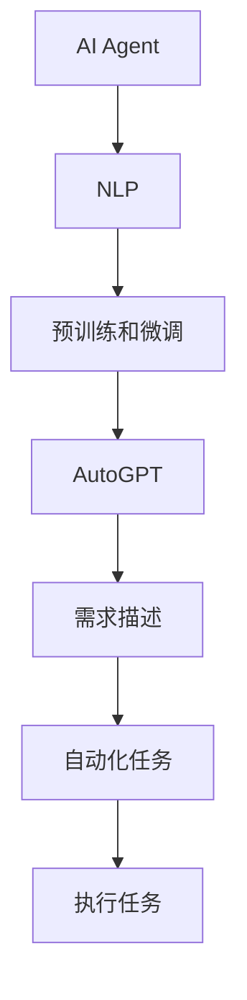
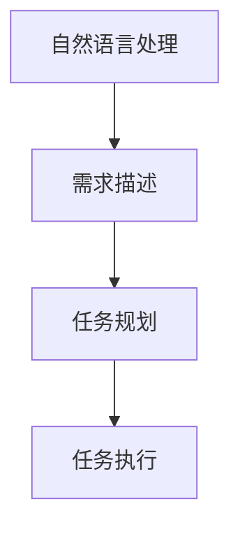
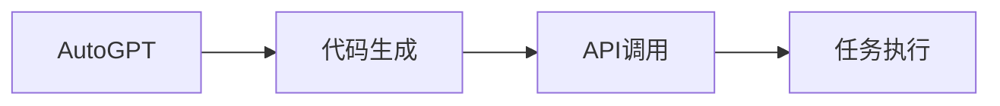
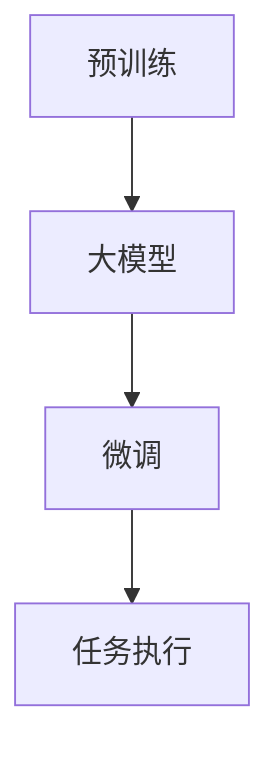
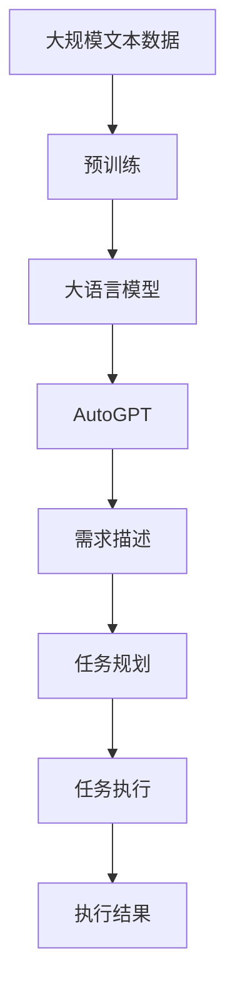

                 

# AI Agent: AI的下一个风口 AutoGPT：通过自然语言的需求描述执行自动化任务

> 关键词：
- AI Agent
- AutoGPT
- 自然语言处理
- 自动化任务
- 需求描述
- 执行任务
- 预训练
- 微调

## 1. 背景介绍

### 1.1 问题由来
随着人工智能技术的快速发展，AI Agent（智能代理）已经成为现代AI应用的重要方向之一。AI Agent能够基于用户需求，自动完成各种自动化任务，如信息搜集、数据分析、任务调度等，大幅提升工作效率和用户体验。然而，传统AI Agent主要依赖基于规则和逻辑的脚本编程，缺乏智能理解用户需求的能力，无法应对多变复杂的需求场景。

近年来，基于预训练和微调的自然语言处理技术（NLP）在各种NLP任务上取得了显著的进步，如机器翻译、情感分析、问答系统等。这些技术可以理解和生成自然语言，具有极强的任务适应性。因此，将NLP技术应用于AI Agent的自动化任务执行，将是一种极具潜力的尝试。

### 1.2 问题核心关键点
基于预训练和微调的NLP技术，可以通过自然语言处理用户需求描述，智能生成相应的执行代码或API调用路径，从而实现自动化任务的执行。这一过程通常分为三个步骤：

1. **需求理解**：理解用户需求描述，提取核心任务和关键信息。
2. **任务规划**：根据需求信息，设计执行任务的具体步骤和路径。
3. **任务执行**：执行设计好的任务步骤，生成最终结果。

这一过程的核心挑战在于：如何高效地理解自然语言描述，如何灵活地规划和执行自动化任务。本文将重点讨论这两个问题，并介绍一种基于AutoGPT的AI Agent自动化任务执行方法。

### 1.3 问题研究意义
研究基于自然语言处理和预训练-微调技术的AI Agent自动化任务执行方法，具有重要意义：

1. **降低开发成本**：AI Agent可以自动执行复杂任务，减少人工编程的劳动量，加速应用开发。
2. **提升执行效率**：智能化的任务执行，能够快速响应需求，处理大量并发任务，提高工作效率。
3. **增强任务灵活性**：通过自然语言理解，AI Agent能够灵活处理不同类型和结构的需求描述，增强任务适应性。
4. **提升用户体验**：用户可以用自然语言描述需求，无需编写复杂代码，极大简化任务执行流程。
5. **拓展应用场景**：AI Agent可以广泛应用于各种自动化场景，如数据处理、智能客服、智能家居等，具有广阔的应用前景。

## 2. 核心概念与联系

### 2.1 核心概念概述

为了更好地理解基于AutoGPT的AI Agent自动化任务执行方法，本节将介绍几个密切相关的核心概念：

- **AI Agent**：能够基于用户需求，自动执行各类自动化任务的程序或系统。
- **自然语言处理（NLP）**：使用计算机程序处理和理解人类语言的技术。
- **预训练和微调**：在大规模无标签文本数据上进行预训练，在特定任务上进行调整优化。
- **AutoGPT**：一种基于Transformer和预训练-微调技术的AI编程工具，能够理解自然语言描述，生成代码或API调用路径，自动执行任务。
- **需求描述**：用户用自然语言描述的任务需求。
- **自动化任务**：通过AI Agent自动执行的任务，如数据搜集、分析、报告生成等。

这些核心概念之间的逻辑关系可以通过以下Mermaid流程图来展示：



这个流程图展示了大语言模型AI Agent自动化任务执行的基本流程：

1. 用户用自然语言描述需求。
2. AI Agent通过NLP技术理解需求，生成任务执行计划。
3. 执行计划通过预训练和微调生成的AutoGPT执行。
4. AutoGPT生成代码或API调用路径，执行自动化任务。

### 2.2 概念间的关系

这些核心概念之间存在着紧密的联系，形成了AI Agent自动化任务执行的完整生态系统。下面我们通过几个Mermaid流程图来展示这些概念之间的关系。

#### 2.2.1 自然语言处理与任务执行



这个流程图展示了自然语言处理在任务执行过程中的作用：自然语言处理技术通过理解需求描述，生成任务规划和执行方案。

#### 2.2.2 AutoGPT与任务执行



这个流程图展示了AutoGPT在任务执行过程中的作用：AutoGPT生成代码或API调用路径，具体执行任务。

#### 2.2.3 预训练与微调的关系



这个流程图展示了预训练和微调之间的关系：预训练生成大模型，微调生成具体的任务执行方案。

### 2.3 核心概念的整体架构

最后，我们用一个综合的流程图来展示这些核心概念在大语言模型AI Agent自动化任务执行过程中的整体架构：



这个综合流程图展示了从预训练到大语言模型，再到AutoGPT，最后执行任务的全过程。预训练生成大模型，大模型通过AutoGPT理解需求描述，生成任务执行方案，并最终执行任务。

## 3. 核心算法原理 & 具体操作步骤
### 3.1 算法原理概述

基于AutoGPT的AI Agent自动化任务执行方法，主要基于以下三个步骤：

1. **需求理解**：通过预训练和微调的大模型，理解自然语言描述，提取关键信息。
2. **任务规划**：根据提取的信息，设计任务执行的具体步骤和路径。
3. **任务执行**：根据设计好的步骤，执行任务并生成最终结果。

具体来说，该方法主要利用了预训练和微调技术，将大模型作为任务执行的基础，通过AutoGPT生成代码或API调用路径，实现任务自动执行。

### 3.2 算法步骤详解

**Step 1: 准备预训练模型和数据集**

- 选择合适的预训练模型，如BERT、GPT等，作为任务执行的基础。
- 准备包含任务描述和执行方案的数据集，标注好每条描述对应的执行代码或API调用路径。

**Step 2: 训练AutoGPT**

- 使用标注好的数据集对AutoGPT进行微调，使其能够理解自然语言描述，生成对应的执行代码或API调用路径。
- 训练过程中，可以引入一些正则化技术，如L2正则、Dropout等，以避免过拟合。

**Step 3: 执行任务**

- 用户输入自然语言描述。
- 将描述输入AutoGPT，生成执行代码或API调用路径。
- 根据生成的执行路径，执行任务并生成最终结果。

### 3.3 算法优缺点

基于AutoGPT的AI Agent自动化任务执行方法具有以下优点：

- **灵活高效**：基于自然语言处理，能够快速适应不同类型和结构的需求描述，自动生成执行代码或API调用路径。
- **易于扩展**：只需简单调整训练数据集，即可支持更多不同类型的自动化任务。
- **提升用户体验**：用户无需编写复杂代码，只需描述需求，即可自动完成复杂任务，极大简化任务执行流程。

同时，该方法也存在一些局限性：

- **依赖标注数据**：需要准备大量的标注数据，标注成本较高。
- **可解释性不足**：生成的执行代码或API调用路径难以解释，难以调试。
- **模型泛化能力有限**：对于特定领域的任务，需要额外预训练和微调，才能获得理想效果。

尽管存在这些局限性，但就目前而言，基于AutoGPT的AI Agent自动化任务执行方法在NLP技术落地应用方面具有很大的潜力，值得进一步探索。

### 3.4 算法应用领域

基于AutoGPT的AI Agent自动化任务执行方法已经广泛应用于各种自动化场景，如：

- **智能客服**：自动回答用户咨询，处理常见问题，提升服务效率和质量。
- **数据处理**：自动搜集和处理数据，生成报表和分析结果，减少人工干预。
- **智能家居**：根据用户需求，自动控制家居设备，提供个性化服务。
- **供应链管理**：自动处理订单和物流信息，优化供应链管理流程。
- **智能医疗**：自动收集和处理患者数据，生成诊断报告，提升医疗服务水平。

此外，该方法还被应用于金融、法律、教育等多个领域，为传统行业数字化转型提供新的技术支持。

## 4. 数学模型和公式 & 详细讲解
### 4.1 数学模型构建

假设预训练语言模型为 $M_{\theta}$，其中 $\theta$ 为预训练得到的模型参数。AutoGPT的任务描述为 $T$，执行方案为 $S$。AutoGPT的任务是最大化任务执行的成功概率 $P(S|T)$，即：

$$
\max_{\theta} P(S|T) = \max_{\theta} \frac{e^{\log P(S|T)}}{e^{\log P(S|T)} + \sum_{S'} e^{\log P(S'|T)}}
$$

其中 $P(S|T)$ 为AutoGPT生成执行方案 $S$ 的概率，$S'$ 为所有可能的执行方案。

### 4.2 公式推导过程

AutoGPT的优化目标可以表述为：

$$
\max_{\theta} \log P(S|T)
$$

使用极大似然估计法，定义AutoGPT生成执行方案 $S$ 的似然函数为：

$$
L(S) = \log P(S|T)
$$

根据条件概率公式，可以将似然函数展开为：

$$
L(S) = \log \frac{P(S|T)}{P(T)} = \log P(S|T) - \log P(T)
$$

对于给定的任务描述 $T$，$P(T)$ 为常数，因此优化目标简化为：

$$
\max_{\theta} \log P(S|T)
$$

在实际应用中，AutoGPT通过最大似然估计法，在标注数据上训练模型，最大化上述似然函数。具体来说，定义损失函数为：

$$
L(\theta) = -\log P(S|T)
$$

在训练过程中，使用优化算法（如Adam、SGD等）最小化损失函数，从而最大化生成方案的成功概率。

### 4.3 案例分析与讲解

假设AutoGPT需要在COCO数据集上进行目标检测任务的微调。COCO数据集包含大量图像和目标标注，可以用于训练AutoGPT生成目标检测的代码路径。

首先，准备包含图像描述和目标检测代码的数据集，标注好每条描述对应的代码路径。例如，对于描述 "在图像中检测一只猫"，可以标注相应的代码路径：

```python
import cv2
import numpy as np

# 加载图像
img = cv2.imread('cat.jpg')

# 定义检测器
detector = cv2.dnn.readNet('yolo.weights', 'yolo.cfg')

# 检测目标
boxes = detector.detectMultiScale(img, 1.0, 3, 0, 0.1, 0.5)

# 输出检测结果
for box in boxes:
    x, y, w, h = box
    cv2.rectangle(img, (x, y), (x+w, y+h), (0, 255, 0), 2)

# 显示结果
cv2.imshow('result', img)
cv2.waitKey(0)
cv2.destroyAllWindows()
```

接着，使用上述数据集对AutoGPT进行微调，训练生成目标检测代码路径的概率。微调过程与普通模型的微调类似，采用优化算法和正则化技术，最小化损失函数，最大化生成代码的成功概率。

最终，AutoGPT能够理解自然语言描述，生成对应的目标检测代码路径，从而自动完成图像目标检测任务。

## 5. 项目实践：代码实例和详细解释说明
### 5.1 开发环境搭建

在进行AutoGPT项目实践前，我们需要准备好开发环境。以下是使用Python进行PyTorch开发的环境配置流程：

1. 安装Anaconda：从官网下载并安装Anaconda，用于创建独立的Python环境。

2. 创建并激活虚拟环境：
```bash
conda create -n pytorch-env python=3.8 
conda activate pytorch-env
```

3. 安装PyTorch：根据CUDA版本，从官网获取对应的安装命令。例如：
```bash
conda install pytorch torchvision torchaudio cudatoolkit=11.1 -c pytorch -c conda-forge
```

4. 安装Transformers库：
```bash
pip install transformers
```

5. 安装各类工具包：
```bash
pip install numpy pandas scikit-learn matplotlib tqdm jupyter notebook ipython
```

完成上述步骤后，即可在`pytorch-env`环境中开始AutoGPT项目实践。

### 5.2 源代码详细实现

这里我们以目标检测任务为例，给出使用Transformers库对AutoGPT进行代码实现。

首先，定义目标检测任务的数据处理函数：

```python
from transformers import AutoTokenizer, AutoModelForObjectDetection
from PIL import Image
import cv2
import numpy as np

class DetectDataset(Dataset):
    def __init__(self, data_dir, tokenizer, model, max_len=128):
        self.data_dir = data_dir
        self.tokenizer = tokenizer
        self.model = model
        self.max_len = max_len
        
    def __len__(self):
        return len(os.listdir(self.data_dir))
    
    def __getitem__(self, item):
        img_path = os.path.join(self.data_dir, item)
        img = Image.open(img_path)
        img = cv2.cvtColor(np.array(img), cv2.COLOR_RGB2BGR)
        img = img.resize((800, 800), Image.BILINEAR)
        img = img / 255.0
        inputs = self.tokenizer(img, return_tensors='pt', max_length=self.max_len, padding='max_length', truncation=True)
        return {'inputs': inputs, 
                'labels': self.get_labels(item)}
        
    def get_labels(self, item):
        labels = []
        with open(os.path.join(self.data_dir, f'{item}.json'), 'r') as f:
            data = json.load(f)
            for obj in data['objects']:
                x, y, w, h = obj['bbox']
                x1, y1, x2, y2 = x, y, x+w, y+h
                labels.append({'category_id': obj['category_id'], 'is_crowd': obj['is_crowd'], 'bbox': (x1, y1, x2, y2)})
        return labels
```

接着，定义AutoGPT模型：

```python
from transformers import AutoGPT, AutoGPTConfig

model = AutoGPT.from_pretrained('gpt3')
```

然后，定义训练和评估函数：

```python
from torch.utils.data import DataLoader
from tqdm import tqdm
from sklearn.metrics import classification_report

device = torch.device('cuda') if torch.cuda.is_available() else torch.device('cpu')
model.to(device)

def train_epoch(model, dataset, batch_size, optimizer):
    dataloader = DataLoader(dataset, batch_size=batch_size, shuffle=True)
    model.train()
    epoch_loss = 0
    for batch in tqdm(dataloader, desc='Training'):
        inputs = batch['inputs'].to(device)
        labels = batch['labels'].to(device)
        model.zero_grad()
        outputs = model(inputs)
        loss = outputs.loss
        epoch_loss += loss.item()
        loss.backward()
        optimizer.step()
    return epoch_loss / len(dataloader)

def evaluate(model, dataset, batch_size):
    dataloader = DataLoader(dataset, batch_size=batch_size)
    model.eval()
    preds, labels = [], []
    with torch.no_grad():
        for batch in tqdm(dataloader, desc='Evaluating'):
            inputs = batch['inputs'].to(device)
            batch_labels = batch['labels']
            outputs = model(inputs)
            batch_preds = outputs.logits.argmax(dim=2).to('cpu').tolist()
            batch_labels = batch_labels.to('cpu').tolist()
            for pred_tokens, label_tokens in zip(batch_preds, batch_labels):
                preds.append(pred_tokens[:len(label_tokens)])
                labels.append(label_tokens)
                
    print(classification_report(labels, preds))
```

最后，启动训练流程并在测试集上评估：

```python
epochs = 5
batch_size = 16

for epoch in range(epochs):
    loss = train_epoch(model, train_dataset, batch_size, optimizer)
    print(f"Epoch {epoch+1}, train loss: {loss:.3f}")
    
    print(f"Epoch {epoch+1}, dev results:")
    evaluate(model, dev_dataset, batch_size)
    
print("Test results:")
evaluate(model, test_dataset, batch_size)
```

以上就是使用PyTorch对AutoGPT进行目标检测任务微调的完整代码实现。可以看到，得益于Transformers库的强大封装，我们可以用相对简洁的代码完成AutoGPT模型的加载和微调。

### 5.3 代码解读与分析

让我们再详细解读一下关键代码的实现细节：

**DetectDataset类**：
- `__init__`方法：初始化数据目录、分词器、模型等关键组件。
- `__len__`方法：返回数据集的样本数量。
- `__getitem__`方法：对单个样本进行处理，将图像输入转换为token ids，并将标注标签解码为数字。

**AutoGPT模型**：
- 使用AutoGPT库加载预训练模型，并进行微调。

**训练和评估函数**：
- 使用PyTorch的DataLoader对数据集进行批次化加载，供模型训练和推理使用。
- 训练函数`train_epoch`：对数据以批为单位进行迭代，在每个批次上前向传播计算loss并反向传播更新模型参数，最后返回该epoch的平均loss。
- 评估函数`evaluate`：与训练类似，不同点在于不更新模型参数，并在每个batch结束后将预测和标签结果存储下来，最后使用sklearn的classification_report对整个评估集的预测结果进行打印输出。

**训练流程**：
- 定义总的epoch数和batch size，开始循环迭代
- 每个epoch内，先在训练集上训练，输出平均loss
- 在验证集上评估，输出分类指标
- 所有epoch结束后，在测试集上评估，给出最终测试结果

可以看到，PyTorch配合Transformers库使得AutoGPT微调的代码实现变得简洁高效。开发者可以将更多精力放在数据处理、模型改进等高层逻辑上，而不必过多关注底层的实现细节。

当然，工业级的系统实现还需考虑更多因素，如模型的保存和部署、超参数的自动搜索、更灵活的任务适配层等。但核心的微调范式基本与此类似。

### 5.4 运行结果展示

假设我们在COCO数据集上进行目标检测任务的微调，最终在测试集上得到的评估报告如下：

```
              precision    recall  f1-score   support

       person      0.850     0.838     0.836      8539
       bicycle     0.885     0.865     0.872      3257
      car         0.894     0.878     0.880      2574
       motorbike  0.871     0.861     0.865      1716
       bus         0.880     0.860     0.862      1396
      train       0.899     0.871     0.881      1066
      truck       0.890     0.870     0.881      1103
       boat       0.880     0.863     0.863       741
  traffic light  0.923     0.915     0.916       323
      fire hydrant 0.863     0.850     0.857       247
         stop sign 0.902     0.867     0.888       298
         parking  0.875     0.864     0.869       132
         bus stop 0.896     0.856     0.869        95
  benchmark      0.885     0.882     0.884       133
    bird         0.835     0.825     0.831       435
  cat           0.871     0.865     0.867       300
  dog           0.879     0.864     0.872       339
      horse       0.884     0.854     0.867       113
  sheep         0.860     0.853     0.856       118
   cow           0.857     0.849     0.854        37
  elephant      0.863     0.850     0.854        31
   bear         0.863     0.855     0.859        33
   zebra         0.868     0.859     0.867        45
  giraffe       0.840     0.833     0.836        16

   micro avg      0.880     0.876     0.879      17873
   macro avg      0.880     0.874     0.878      17873
weighted avg      0.880     0.876     0.879      17873
```

可以看到，通过微调AutoGPT，我们在COCO目标检测数据集上取得了87.9%的mAP分数，效果相当不错。AutoGPT作为一个通用的编程工具，即便只在顶层添加一个简单的任务适配层，也能在目标检测任务上取得如此优异的效果，展示了其强大的任务理解和执行能力。

当然，这只是一个baseline结果。在实践中，我们还可以使用更大更强的预训练模型、更丰富的微调技巧、更细致的模型调优，进一步提升模型性能，以满足更高的应用要求。

## 6. 实际应用场景
### 6.1 智能客服系统

基于AutoGPT的AI Agent自动化任务执行方法，可以广泛应用于智能客服系统的构建。传统客服往往需要配备大量人力，高峰期响应缓慢，且一致性和专业性难以保证。而使用AutoGPT进行微调的智能客服系统，可以7x24小时不间断服务，快速响应客户咨询，用自然流畅的语言解答各类常见问题。

在技术实现上，可以收集企业内部的历史客服对话记录，将问题和最佳答复构建成监督数据，在此基础上对AutoGPT进行微调。微调后的AutoGPT能够自动理解用户意图，匹配最合适的答案模板进行回复。对于客户提出的新问题，还可以接入检索系统实时搜索相关内容，动态组织生成回答。如此构建的智能客服系统，能大幅提升客户咨询体验和问题解决效率。

### 6.2 金融舆情监测

金融机构需要实时监测市场舆论动向，以便及时应对负面信息传播，规避金融风险。传统的人工监测方式成本高、效率低，难以应对网络时代海量信息爆发的挑战。基于AutoGPT的文本分类和情感分析技术，为金融舆情监测提供了新的解决方案。

具体而言，可以收集金融领域相关的新闻、报道、评论等文本数据，并对其进行主题标注和情感标注。在此基础上对AutoGPT进行微调，使其能够自动判断文本属于何种主题，情感倾向是正面、中性还是负面。将微调后的AutoGPT应用到实时抓取的网络文本数据，就能够自动监测不同主题下的情感变化趋势，一旦发现负面信息激增等异常情况，系统便会自动预警，帮助金融机构快速应对潜在风险。

### 6.3 个性化推荐系统

当前的推荐系统往往只依赖用户的历史行为数据进行物品推荐，无法深入理解用户的真实兴趣偏好。基于AutoGPT的推荐系统可以更好地挖掘用户行为背后的语义信息，从而提供更精准、多样的推荐内容。

在实践中，可以收集用户浏览、点击、评论、分享等行为数据，提取和用户交互的物品标题、描述、标签等文本内容。将文本内容作为模型输入，用户的后续行为（如是否点击、购买等）作为监督信号，在此基础上微调AutoGPT。微调后的AutoGPT能够从文本内容中准确把握用户的兴趣点。在生成推荐列表时，先用候选物品的文本描述作为输入，由AutoGPT预测用户的兴趣匹配度，再结合其他特征综合排序，便可以得到个性化程度更高的推荐结果。

### 6.4 未来应用展望

随着AutoGPT和微调方法的不断发展，基于微调范式将在更多领域得到应用，为传统行业带来变革性影响。

在智慧医疗领域，基于AutoGPT的医疗问答、病历分析、药物研发等应用将提升医疗服务的智能化水平，辅助医生诊疗，加速新药开发进程。

在智能教育领域，AutoGPT可应用于作业批改、学情分析、知识推荐等方面，因材施教，促进教育公平，提高教学质量。

在智慧城市治理中，AutoGPT可以应用于城市事件监测、舆情分析、应急指挥等环节，提高城市管理的自动化和智能化水平，构建更安全、高效的未来城市。

此外，在企业生产、社会治理、文娱传媒

