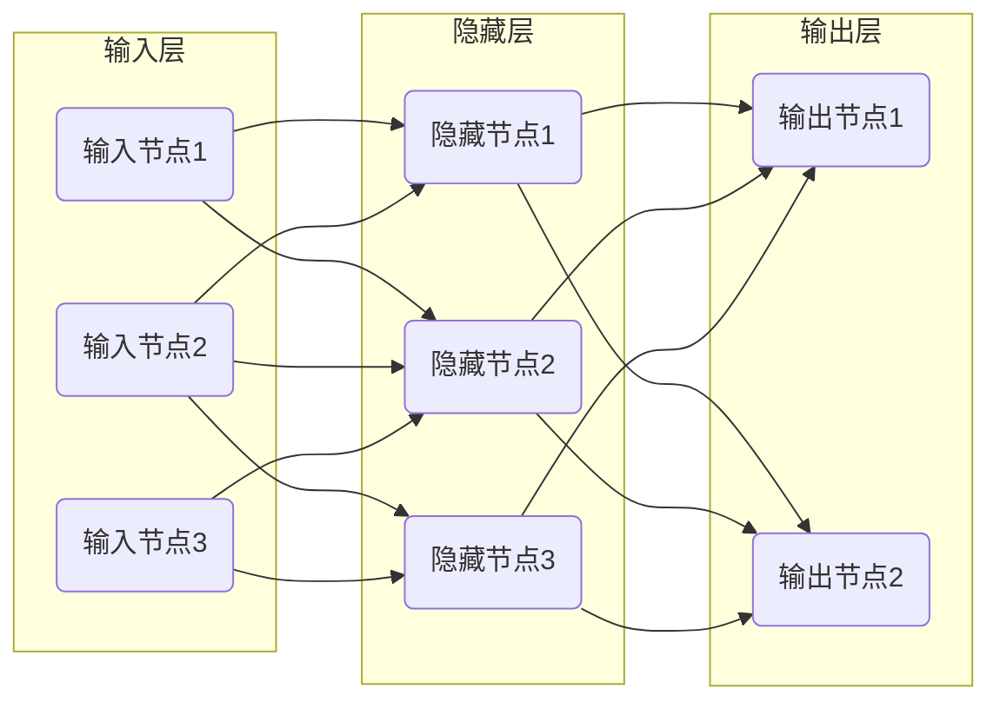

# Python深度学习实践：入门篇 - 你的第一个神经网络

## 1. 背景介绍

### 1.1 问题的由来

在当今的数字时代，数据无处不在。无论是社交媒体平台、电子商务网站还是物联网设备,都在不断产生海量的数据。然而,这些原始数据本身并没有太多价值,直到我们能够从中提取有用的信息和见解。这就是机器学习和深度学习大显身手的时候了。

作为机器学习的一个强大分支,深度学习已经在计算机视觉、自然语言处理、推荐系统等诸多领域取得了令人瞩目的成就。神经网络作为深度学习的核心模型,正在帮助我们解决越来越复杂的问题。然而,对于初学者来说,深度学习往往显得高深莫测,门槛较高。

### 1.2 研究现状

近年来,深度学习的发展如火如荼,相关的理论和应用研究层出不穷。著名的深度学习框架,如TensorFlow、PyTorch和Keras等,极大地降低了深度学习模型的开发和部署难度。同时,开源社区也在不断贡献优秀的教程和资源,使得深度学习的学习曲线变得更加平缓。

然而,对于绝大多数初学者而言,深度学习仍然存在一定的入门障碍。许多人在学习过程中容易被大量的数学公式和抽象概念所困扰,难以真正掌握深度学习的本质。因此,如何以一种简单而实用的方式,引导初学者逐步深入了解和实践深度学习,成为了一个亟待解决的问题。

### 1.3 研究意义

本文旨在为深度学习初学者提供一个渐进式的学习路径,帮助他们从浅入深地掌握深度学习的核心概念和实践技能。通过构建一个简单的神经网络模型,读者将能够亲身体会深度学习模型的训练和预测过程,加深对深度学习原理的理解。

同时,本文还将介绍深度学习中的一些关键概念,如损失函数、优化器和激活函数等,并详细解释它们在神经网络中的作用和重要性。此外,本文还将探讨深度学习模型的评估指标,帮助读者掌握模型性能评估的方法。

通过本文的学习,读者不仅能够掌握构建和训练一个基本的神经网络模型的能力,而且还能为未来深入学习更高级的深度学习技术打下坚实的基础。

### 1.4 本文结构

本文将按照以下结构展开:

1. 背景介绍
2. 核心概念与联系
3. 核心算法原理与具体操作步骤
4. 数学模型和公式详细讲解与举例说明
5. 项目实践:代码实例和详细解释说明
6. 实际应用场景
7. 工具和资源推荐
8. 总结:未来发展趋势与挑战
9. 附录:常见问题与解答

## 2. 核心概念与联系

在深入探讨神经网络的细节之前,我们需要先了解一些核心概念,这些概念贯穿于整个深度学习领域,对于理解神经网络的工作原理至关重要。

### 2.1 人工神经网络

人工神经网络(Artificial Neural Network,ANN)是一种受生物神经网络启发而设计的计算模型。它由大量互连的节点(神经元)组成,这些节点通过权重连接彼此传递信号。神经网络的目标是通过学习过程调整这些权重,从而能够从输入数据中捕获潜在的模式和规律,并对新的输入数据做出预测或决策。

### 2.2 前馈神经网络

前馈神经网络(Feedforward Neural Network,FNN)是最基本的神经网络结构。在这种网络中,信息只能从输入层向前传播到隐藏层,再到输出层,不存在反馈连接。每个节点的输出是通过将其输入与权重相乘,然后通过激活函数进行非线性转换得到的。

### 2.3 损失函数

损失函数(Loss Function)用于衡量神经网络的预测输出与真实标签之间的差异。通过最小化损失函数,我们可以不断调整神经网络的权重,使其预测结果越来越接近真实值。常见的损失函数包括均方误差(Mean Squared Error,MSE)和交叉熵损失(Cross-Entropy Loss)等。

### 2.4 优化器

优化器(Optimizer)是一种算法,用于根据损失函数的梯度信息,有效地更新神经网络中的权重参数。常见的优化器包括随机梯度下降(Stochastic Gradient Descent,SGD)、Adam优化器等。选择合适的优化器对于神经网络的训练效率和收敛性能至关重要。

### 2.5 激活函数

激活函数(Activation Function)是神经网络中的一个关键组成部分,它引入了非线性,使得神经网络能够学习复杂的映射关系。常见的激活函数包括Sigmoid函数、Tanh函数、ReLU(Rectified Linear Unit)函数等。选择合适的激活函数可以提高神经网络的表达能力和训练效率。

### 2.6 正则化

正则化(Regularization)是一种用于防止神经网络过拟合的技术。过拟合是指模型在训练数据上表现良好,但在新的未见过的数据上表现较差。常见的正则化方法包括L1正则化(Lasso Regularization)、L2正则化(Ridge Regularization)和Dropout等。

这些核心概念相互关联,共同构建了神经网络的基础架构。掌握了这些概念,我们就能更好地理解神经网络的工作原理,并为后续的深入学习打下坚实的基础。

## 3. 核心算法原理与具体操作步骤

### 3.1 算法原理概述

神经网络的核心算法原理是通过反向传播(Backpropagation)算法,根据输出与期望值之间的误差,不断调整网络中的权重参数,使得神经网络能够逐步学习到最优的映射关系。

反向传播算法主要包括以下几个步骤:

1. 前向传播(Forward Propagation):输入数据通过神经网络的各层节点进行前向计算,得到最终的输出结果。

2. 计算损失(Loss Computation):将神经网络的输出结果与真实标签进行比较,计算损失函数的值。

3. 反向传播(Backpropagation):根据损失函数的值,利用链式法则计算每个权重参数对损失函数的梯度,即该权重对损失函数的影响程度。

4. 权重更新(Weight Update):利用优化算法(如随机梯度下降),根据计算得到的梯度,更新每个权重参数的值,使得损失函数的值逐渐减小。

5. 迭代训练(Iterative Training):重复执行前面的步骤,不断地调整权重参数,直到损失函数的值达到预期的水平或者达到最大迭代次数。

通过这种反复的迭代训练过程,神经网络就能够逐步学习到最优的权重参数,从而实现对输入数据的精确映射和预测。

### 3.2 算法步骤详解

现在,我们将详细解释神经网络训练过程中的每一个步骤。为了便于理解,我们将以一个简单的二分类问题为例进行说明。

#### 3.2.1 前向传播

在前向传播阶段,输入数据通过神经网络的各层节点进行计算,得到最终的输出结果。具体步骤如下:

1. 将输入数据传递给输入层的节点。

2. 对于每个隐藏层节点,计算其输入的加权和,然后通过激活函数进行非线性转换,得到该节点的输出。

   $$o_j = f\left(\sum_{i} w_{ij}x_i + b_j\right)$$

   其中,\(o_j\)是第\(j\)个隐藏层节点的输出,\(f\)是激活函数,\(w_{ij}\)是连接输入层第\(i\)个节点和隐藏层第\(j\)个节点的权重,\(x_i\)是输入层第\(i\)个节点的值,\(b_j\)是第\(j\)个隐藏层节点的偏置项。

3. 重复上一步,将隐藏层的输出传递给输出层,计算输出层节点的输出值。

4. 输出层的输出值就是神经网络对于当前输入数据的预测结果。

#### 3.2.2 计算损失

在得到神经网络的预测输出后,我们需要计算该输出与真实标签之间的差异,即损失函数的值。常见的损失函数包括均方误差(MSE)和交叉熵损失(Cross-Entropy Loss)等。

对于二分类问题,我们通常使用二元交叉熵损失函数,其定义如下:

$$J(\theta) = -\frac{1}{m}\sum_{i=1}^{m}\left[y^{(i)}\log\left(h_\theta\left(x^{(i)}\right)\right) + \left(1-y^{(i)}\right)\log\left(1-h_\theta\left(x^{(i)}\right)\right)\right]$$

其中,\(m\)是训练样本的数量,\(y^{(i)}\)是第\(i\)个样本的真实标签(0或1),\(h_\theta\left(x^{(i)}\right)\)是神经网络对第\(i\)个样本的预测输出,\(\theta\)表示神经网络的所有权重参数。

我们的目标是通过调整\(\theta\)来最小化损失函数\(J(\theta)\)的值,使得神经网络的预测结果尽可能接近真实标签。

#### 3.2.3 反向传播

反向传播算法是神经网络训练的核心部分,它利用链式法则计算每个权重参数对损失函数的梯度,从而确定如何调整权重参数以最小化损失函数。

具体步骤如下:

1. 计算输出层每个节点的误差项,即该节点的输出与真实标签之间的差异。

   $$\delta^L_j = \frac{\partial J}{\partial o^L_j}$$

   其中,\(\delta^L_j\)是输出层第\(j\)个节点的误差项,\(o^L_j\)是该节点的输出值。

2. 计算隐藏层每个节点的误差项,即该节点的输出对输出层节点误差项的贡献之和。

   $$\delta^l_j = \left(\sum_k w^{l+1}_{jk}\delta^{l+1}_k\right)f'\left(z^l_j\right)$$

   其中,\(\delta^l_j\)是第\(l\)层第\(j\)个节点的误差项,\(w^{l+1}_{jk}\)是连接该节点与下一层第\(k\)个节点的权重,\(\delta^{l+1}_k\)是下一层第\(k\)个节点的误差项,\(f'\)是激活函数的导数,\(z^l_j\)是该节点的加权输入。

3. 计算每个权重参数对损失函数的梯度。

   $$\frac{\partial J}{\partial w^l_{jk}} = a^{l-1}_k\delta^l_j$$

   其中,\(a^{l-1}_k\)是上一层第\(k\)个节点的输出值(即激活值)。

4. 根据计算得到的梯度,利用优化算法(如随机梯度下降)更新每个权重参数的值。

   $$w^l_{jk} \leftarrow w^l_{jk} - \eta\frac{\partial J}{\partial w^l_{jk}}$$

   其中,\(\eta\)是学习率,决定了每次更新的步长大小。

通过不断地