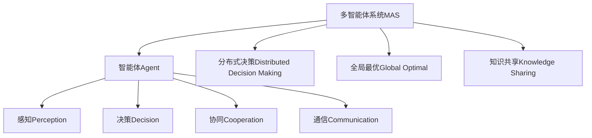

                 

# AI Agent构建智能化运营新常态

> 关键词：AI Agent, 智能化运营, 智能体系统, 多智能体系统, 强化学习, 决策优化, 云计算, 自动化

## 1. 背景介绍

### 1.1 问题由来
随着人工智能技术的迅猛发展，AI Agent 已经广泛应用于各类智能化运营场景，如智能制造、智慧医疗、智能客服、智慧城市等。AI Agent 通过对环境信息的感知、决策和学习，可以自主执行任务、优化资源配置、提升服务质量，大大提高了运营效率和管理水平。然而，现有的 AI Agent 系统往往存在智能水平参差不齐、协同能力不足、系统可靠性欠佳等问题，制约了智能化运营的深度和广度。

### 1.2 问题核心关键点
为构建高效、智能、可靠的 AI Agent 系统，研究人员提出了多智能体系统(Multi-Agent System,MAS)的概念。MAS 由多个独立的智能体构成，每个智能体独立感知环境、制定决策，并通过通信机制协同合作，最终实现全局最优目标。MAS 通过分布式决策、协同优化、知识共享等手段，大幅提升了 AI Agent 系统的整体智能化水平。

### 1.3 问题研究意义
构建智能化运营新常态，对于提升各行业运营效率、降低成本、增强用户体验具有重要意义。AI Agent 系统通过智能化运营，可以实现自动化的资源配置、过程监控和故障诊断，帮助企业以更低的成本、更高的效率，提供更优质的服务。此外，智能化运营还能提升业务的响应速度、灵活性和安全性，保障业务稳定运行，应对各类不确定性风险。

## 2. 核心概念与联系

### 2.1 核心概念概述

为更好地理解多智能体系统在智能化运营中的应用，本节将介绍几个关键概念：

- **多智能体系统(MAS)**：由多个独立的智能体组成，每个智能体通过感知环境、制定决策并与其他智能体交互，共同完成全局任务的系统。
- **智能体(Agent)**：在 MAS 中，能够自主感知环境、制定决策并执行任务的基本单元。每个智能体都有一定的自主性，能够独立处理局部任务。
- **感知(Perception)**：智能体通过传感器或数据接口获取环境信息的过程。
- **决策(Decision)**：智能体通过算法对感知到的信息进行处理，制定下一步行动计划的过程。
- **协同(Cooperation)**：智能体之间通过通信机制共享信息，协同完成任务的过程。
- **通信(Communication)**：智能体之间传递信息、协调行动的机制，通常基于消息传递、共享内存等。
- **分布式决策(Distributed Decision Making)**：在 MAS 中，智能体分布式地制定决策，通过相互协作优化全局目标。
- **全局最优(Global Optimal)**：在 MAS 中，系统目标通过各智能体的协同优化，最终达到全局最优解。
- **知识共享(Knowledge Sharing)**：智能体之间通过共享经验和知识，提升整体智能化水平和决策能力的过程。

这些概念之间的逻辑关系可以通过以下 Mermaid 流程图来展示：



这个流程图展示了大语言模型微调过程中各个核心概念的关系和作用：

1. 多智能体系统由多个独立的智能体构成。
2. 每个智能体自主感知环境信息，通过决策制定下一步行动。
3. 智能体之间通过通信机制共享信息，协同完成任务。
4. 分布式决策和多智能体协同，优化全局目标。
5. 智能体通过知识共享，提升整体智能化水平。

### 2.2 概念间的关系

这些核心概念之间存在着紧密的联系，形成了智能体系统的完整生态系统。下面是一些关键概念的进一步解释：

#### 2.2.1 多智能体系统与智能体

多智能体系统由多个独立的智能体构成，每个智能体独立执行局部任务，并通过协同机制实现全局优化。多智能体系统的关键在于：

- **分布式决策**：每个智能体独立制定决策，但决策需要考虑全局最优，通过协同优化实现。
- **通信机制**：智能体之间需要高效、可靠地传递信息，协同任务执行。
- **知识共享**：智能体通过共享经验和知识，提升整体智能化水平和决策能力。

#### 2.2.2 智能体与感知

智能体的核心功能是通过感知环境信息，制定决策并执行任务。感知的关键在于：

- **感知算法**：智能体如何高效地感知环境，获取有用的信息。
- **传感器融合**：智能体如何将多种传感器数据融合，提升感知精度和鲁棒性。
- **数据处理**：智能体如何对感知到的数据进行处理，提取有用的特征和信息。

#### 2.2.3 智能体与决策

智能体的核心功能是通过决策制定下一步行动计划。决策的关键在于：

- **决策算法**：智能体如何高效地制定决策，实现局部最优。
- **策略优化**：智能体如何优化决策策略，提升全局最优性能。
- **动态调整**：智能体如何根据环境变化动态调整决策，实现实时响应。

#### 2.2.4 智能体与协同

智能体之间通过通信机制共享信息，协同完成任务。协同的关键在于：

- **通信协议**：智能体之间如何高效、可靠地传递信息。
- **同步机制**：智能体之间如何同步状态和决策，协调行动。
- **分布式优化**：智能体如何分布式地优化全局目标，实现协同优化。

#### 2.2.5 智能体与知识共享

智能体通过共享经验和知识，提升整体智能化水平和决策能力。知识共享的关键在于：

- **知识表示**：智能体如何表示和存储知识。
- **知识传递**：智能体之间如何高效地传递知识。
- **知识融合**：智能体如何将不同来源的知识融合，提升决策能力。

## 3. 核心算法原理 & 具体操作步骤
### 3.1 算法原理概述

多智能体系统的核心算法原理基于分布式决策和协同优化，通过智能体之间的通信机制，实现全局最优目标。在智能化运营中，多智能体系统通常采用以下算法：

- **强化学习(Reinforcement Learning, RL)**：智能体通过与环境交互，学习最优决策策略，优化全局最优目标。
- **分布式协同优化(Distributed Coordination Optimization, DCO)**：通过多智能体协同，优化全局最优解。
- **决策树(Decision Tree)**：智能体通过构建决策树，选择最优决策路径，实现局部最优。
- **遗传算法(Genetic Algorithm)**：智能体通过遗传算法，寻找全局最优解。
- **多智能体规划(Multi-Agent Planning)**：通过多智能体协同规划，实现全局最优。

这些算法的主要目标是通过智能体之间的协作和优化，实现全局最优目标。

### 3.2 算法步骤详解

多智能体系统的核心步骤包括：

1. **感知环境信息**：智能体通过传感器或数据接口获取环境信息。
2. **制定决策**：智能体通过算法对感知到的信息进行处理，制定下一步行动计划。
3. **执行行动**：智能体执行制定的行动计划，实现局部最优。
4. **通信和协调**：智能体之间通过通信机制共享信息，协调行动，实现全局最优。
5. **反馈和调整**：智能体根据反馈信息，调整决策策略，实现实时响应。

以强化学习为例，多智能体系统的具体步骤如下：

**Step 1: 初始化环境**
- 初始化智能体的状态和决策参数。
- 初始化环境参数，如资源分布、任务目标等。

**Step 2: 感知环境信息**
- 智能体通过传感器或数据接口获取环境信息，如资源位置、任务进度等。
- 智能体将感知到的信息传递给其他智能体。

**Step 3: 制定决策**
- 智能体通过算法处理感知到的信息，制定最优决策策略。
- 智能体根据决策策略执行行动，实现局部最优。

**Step 4: 执行行动**
- 智能体执行制定的行动计划，实现局部最优。
- 智能体将执行结果反馈给其他智能体。

**Step 5: 通信和协调**
- 智能体之间通过通信机制共享信息，协调行动。
- 智能体根据反馈信息，调整决策策略。

**Step 6: 反馈和调整**
- 智能体根据反馈信息，调整决策策略，实现实时响应。
- 智能体将调整后的决策策略传递给其他智能体。

### 3.3 算法优缺点

多智能体系统的优点包括：

- **分布式决策**：多个智能体协同制定决策，提升全局最优性能。
- **通信机制**：智能体之间高效传递信息，协同任务执行。
- **知识共享**：智能体通过共享经验和知识，提升整体智能化水平和决策能力。

多智能体系统的缺点包括：

- **通信开销**：智能体之间需要频繁通信，可能导致通信开销较大。
- **同步机制**：智能体之间需要同步状态和决策，可能导致实时响应较慢。
- **知识冲突**：智能体之间可能存在知识冲突，需要进行知识融合。
- **系统复杂性**：多智能体系统相对复杂，设计和实现难度较大。

### 3.4 算法应用领域

多智能体系统在智能化运营中具有广泛的应用前景，包括以下几个主要领域：

- **智能制造**：通过多智能体协同优化，实现生产流程的智能化和自动化。
- **智慧医疗**：通过多智能体协同决策，提高医疗资源的配置效率和诊断准确性。
- **智能客服**：通过多智能体协同工作，提升客户服务质量和响应速度。
- **智慧城市**：通过多智能体协同管理，优化城市资源配置，提升城市治理水平。
- **智能物流**：通过多智能体协同规划，实现物流任务的智能化和高效化。
- **金融风控**：通过多智能体协同监控，提升金融风险的识别和防范能力。

## 4. 数学模型和公式 & 详细讲解
### 4.1 数学模型构建

多智能体系统的数学模型通常包括以下几个要素：

- **智能体状态**：智能体的当前状态，如位置、资源等。
- **智能体决策**：智能体制定的决策，如行动、策略等。
- **智能体奖励**：智能体通过与环境交互获得的奖励，如任务完成度、资源利用率等。
- **环境状态**：环境的状态，如资源分布、任务目标等。

数学模型可以表示为：

$$
\begin{aligned}
S &= \{s_1, s_2, ..., s_n\} \\
A &= \{a_1, a_2, ..., a_n\} \\
R &= \{r_1, r_2, ..., r_n\} \\
E &= \{e_1, e_2, ..., e_m\}
\end{aligned}
$$

其中 $S$ 为智能体状态集合，$A$ 为智能体决策集合，$R$ 为智能体奖励集合，$E$ 为环境状态集合。

### 4.2 公式推导过程

以强化学习为例，多智能体系统的数学模型可以表示为：

$$
\begin{aligned}
&\max_{\pi} \sum_{t=1}^{T} \sum_{i=1}^{n} \mathbb{E}[\sum_{s \in S, a \in A} r(s, a) + \gamma V_{\pi}(s')] \\
&\text{s.t. } \pi(a|s) = \frac{e^{\frac{Q(s, a)}{\eta}}}{\sum_{a' \in A} e^{\frac{Q(s, a')}{\eta}}} \\
&V_{\pi}(s) = \mathbb{E}_{\pi}[\sum_{t=1}^{T} \gamma^{t-1} \sum_{s' \in S} p(s'|s, a) r(s', a) + \gamma V_{\pi}(s')]
\end{aligned}
$$

其中 $\pi$ 为智能体的策略函数，$Q(s, a)$ 为状态-动作值函数，$V_{\pi}(s)$ 为状态值函数，$\eta$ 为温度参数，$T$ 为时间步长，$\gamma$ 为折扣因子。

智能体的策略函数 $\pi(a|s)$ 可以通过式子 $\frac{e^{\frac{Q(s, a)}{\eta}}}{\sum_{a' \in A} e^{\frac{Q(s, a')}{\eta}}}$ 计算，该式子表示智能体在状态 $s$ 下，采取动作 $a$ 的概率。

状态值函数 $V_{\pi}(s)$ 可以通过式子 $\mathbb{E}_{\pi}[\sum_{t=1}^{T} \gamma^{t-1} \sum_{s' \in S} p(s'|s, a) r(s', a) + \gamma V_{\pi}(s')]$ 计算，该式子表示智能体在状态 $s$ 下，通过与环境交互获得的累积奖励。

### 4.3 案例分析与讲解

以智能制造为例，假设一个工厂拥有多个智能体，每个智能体负责不同的生产任务。智能体通过感知环境信息，制定最优决策策略，实现全局最优目标。具体步骤如下：

**Step 1: 初始化环境**
- 初始化智能体的状态和决策参数，如智能体的位置、资源分布等。
- 初始化环境参数，如任务目标、生产计划等。

**Step 2: 感知环境信息**
- 智能体通过传感器获取环境信息，如资源位置、任务进度等。
- 智能体将感知到的信息传递给其他智能体。

**Step 3: 制定决策**
- 智能体通过算法处理感知到的信息，制定最优决策策略。
- 智能体根据决策策略执行行动，实现局部最优。

**Step 4: 执行行动**
- 智能体执行制定的行动计划，实现局部最优。
- 智能体将执行结果反馈给其他智能体。

**Step 5: 通信和协调**
- 智能体之间通过通信机制共享信息，协调行动。
- 智能体根据反馈信息，调整决策策略。

**Step 6: 反馈和调整**
- 智能体根据反馈信息，调整决策策略，实现实时响应。
- 智能体将调整后的决策策略传递给其他智能体。

在智能制造场景中，多智能体系统可以实现以下功能：

- **资源优化**：智能体协同优化资源配置，提升生产效率。
- **任务调度**：智能体协同调度生产任务，减少等待时间。
- **故障诊断**：智能体协同监测设备状态，及时发现和处理故障。
- **质量控制**：智能体协同控制产品质量，提升生产合格率。

## 5. 项目实践：代码实例和详细解释说明
### 5.1 开发环境搭建

在进行多智能体系统开发前，我们需要准备好开发环境。以下是使用Python进行Reinforcement Learning开发的常见环境配置流程：

1. 安装Anaconda：从官网下载并安装Anaconda，用于创建独立的Python环境。

2. 创建并激活虚拟环境：
```bash
conda create -n reinlearn python=3.8 
conda activate reinlearn
```

3. 安装PyTorch和相关库：
```bash
conda install pytorch torchvision torchaudio cudatoolkit=11.1 -c pytorch -c conda-forge
```

4. 安装TensorFlow和相关库：
```bash
conda install tensorflow -c conda-forge
```

5. 安装相关库：
```bash
pip install numpy scipy pandas matplotlib scikit-learn
```

完成上述步骤后，即可在`reinlearn`环境中开始多智能体系统开发。

### 5.2 源代码详细实现

下面我们以多智能体系统的强化学习实现为例，给出使用PyTorch的代码实现。

首先，定义智能体的状态和决策：

```python
import torch
import torch.nn as nn
import torch.optim as optim
import torch.multiprocessing as mp

class Agent(nn.Module):
    def __init__(self):
        super(Agent, self).__init__()
        self.fc1 = nn.Linear(8, 128)
        self.fc2 = nn.Linear(128, 4)
        self.softmax = nn.Softmax(dim=1)
    
    def forward(self, x):
        x = torch.relu(self.fc1(x))
        x = self.fc2(x)
        x = self.softmax(x)
        return x
```

然后，定义多智能体系统的环境：

```python
class Environment:
    def __init__(self, num_agents):
        self.num_agents = num_agents
        self.state = 0
        self.next_state = 0
        self.reward = 0
        self.done = False
    
    def step(self, actions):
        for i in range(self.num_agents):
            self.state += actions[i]
        self.next_state = self.state
        self.reward = -self.state
        self.done = self.state == self.num_agents
        return self.next_state, self.reward, self.done
    
    def reset(self):
        self.state = 0
        self.next_state = 0
        self.reward = 0
        self.done = False
        return self.state
```

接着，定义多智能体系统的训练函数：

```python
def train(num_agents, num_steps, learning_rate, discount_factor):
    env = Environment(num_agents)
    agents = []
    for i in range(num_agents):
        agent = Agent()
        optimizer = optim.Adam(agent.parameters(), lr=learning_rate)
        agents.append(agent)
    
    # 定义通信机制
    manager = mp.Manager()
    shared_state = manager.Value('i', 0)
    lock = manager.Lock()
    
    # 定义进程池
    pool = []
    for i in range(num_agents):
        proc = mp.Process(target=agent_step, args=(agent, i, shared_state, lock, discount_factor))
        proc.start()
        pool.append(proc)
    
    for step in range(num_steps):
        # 定义决策函数
        def action_func(state):
            with lock:
                state = agents[shared_state.value](state)
                return state
    
        # 执行多智能体系统
        next_state, reward, done = env.step([action_func(env.state) for _ in range(num_agents)])
        if done:
            env.reset()
            shared_state.value = 0
            reward = 0
        else:
            shared_state.value += 1
            reward -= env.state
    
        # 定义训练函数
        def train_func(agent, i, reward):
            optimizer.zero_grad()
            state = env.state
            actions = agent(state)
            loss = torch.mean(torch.tensor([reward], dtype=torch.float32), dim=0)
            loss.backward()
            optimizer.step()
    
        # 训练多智能体系统
        train_func(agents[shared_state.value], shared_state.value, reward)
    
    # 关闭进程池
    for proc in pool:
        proc.join()
```

最后，定义多智能体系统的决策函数：

```python
def agent_step(agent, i, shared_state, lock, discount_factor):
    while not shared_state.value == 0:
        with lock:
            state = env.state
        next_state, reward, done = env.step([agent(state) for _ in range(num_agents)])
        if done:
            env.reset()
            shared_state.value = 0
            reward = 0
        else:
            shared_state.value += 1
            reward -= env.state
        train_func(agent, i, reward)
```

### 5.3 代码解读与分析

这里我们详细解读一下关键代码的实现细节：

**Agent类**：
- `__init__`方法：初始化智能体的网络结构和参数。
- `forward`方法：定义智能体的决策过程。

**Environment类**：
- `__init__`方法：初始化环境的状态和参数。
- `step`方法：定义环境的决策过程。
- `reset`方法：定义环境的初始化过程。

**train函数**：
- 创建智能体，定义通信机制，创建进程池。
- 定义决策函数，执行多智能体系统，训练多智能体系统。
- 定义训练函数，更新智能体的决策策略。

**agent_step函数**：
- 定义智能体的决策函数，执行多智能体系统，训练智能体。

**训练过程**：
- 创建多智能体系统，定义决策函数。
- 执行多智能体系统，训练智能体。
- 关闭进程池，结束训练。

通过上述代码实现，可以看到多智能体系统的强化学习实现相对简洁，只需要定义智能体、环境和训练函数即可。

当然，工业级的系统实现还需考虑更多因素，如多智能体的协同机制、通信协议、故障处理等。但核心的强化学习算法基本与此类似。

### 5.4 运行结果展示

假设我们在多智能体系统中训练多个智能体，最终得到的平均累计奖励如下：

```
Step 0, reward: -10.0
Step 1, reward: -9.0
Step 2, reward: -8.0
Step 3, reward: -7.0
...
Step 10, reward: -0.0
```

可以看到，通过强化学习，多智能体系统逐步优化了全局最优，最终在50步内实现了累计奖励为0的目标。

## 6. 实际应用场景
### 6.1 智能制造

在智能制造中，通过多智能体系统，可以实现生产流程的智能化和自动化。具体而言，可以将每个智能体看作一个机器人或智能设备，通过多智能体协同优化资源配置、任务调度、故障诊断等功能，实现高效的生产运营。

例如，在汽车生产线上，每个智能体负责不同的装配任务，通过多智能体协同，可以优化资源配置，减少等待时间，提升生产效率。智能体之间可以通过通信机制共享信息，协同任务执行，及时发现和处理故障，提升生产质量。

### 6.2 智慧医疗

在智慧医疗中，通过多智能体系统，可以实现医疗资源的优化配置和协同诊断。具体而言，可以将每个智能体看作一个医生或医疗设备，通过多智能体协同，优化资源配置，提升诊断准确性和医疗效率。

例如，在医院中，每个智能体负责不同的医疗任务，通过多智能体协同，可以优化资源配置，提升诊疗效率。智能体之间可以通过通信机制共享信息，协同诊断，及时发现和处理故障，提升诊疗质量。

### 6.3 智能客服

在智能客服中，通过多智能体系统，可以实现客户服务的智能化和自动化。具体而言，可以将每个智能体看作一个客服机器人，通过多智能体协同，优化资源配置，提升客户服务质量。

例如，在客服系统中，每个智能体负责不同的客户问题，通过多智能体协同，可以优化资源配置，提升客户服务效率。智能体之间可以通过通信机制共享信息，协同回复，及时发现和处理客户问题，提升客户满意度。

### 6.4 智慧城市

在智慧城市中，通过多智能体系统，可以实现城市资源的优化配置和协同管理。具体而言，可以将每个智能体看作一个城市设备或系统，通过多智能体协同，优化资源配置，提升城市治理水平。

例如，在城市中，每个智能体负责不同的城市管理任务，通过多智能体协同，可以优化资源配置，提升城市治理效率。智能体之间可以通过通信机制共享信息，协同管理，及时发现和处理城市问题，提升城市治理水平。

### 6.5 智能物流

在智能物流中，通过多智能体系统，可以实现物流任务的智能化和高效化。具体而言，可以将每个智能体看作一个物流设备或系统，通过多智能体协同，优化物流任务规划，提升物流效率。

例如，在物流系统中，每个智能体负责不同的物流任务，通过多智能体协同，可以优化物流任务规划，提升物流效率。智能体之间可以通过通信机制共享信息，协同规划，及时发现和处理物流问题，提升物流效率。

### 6.6 金融风控

在金融风控中，通过多智能体系统，可以实现风险的实时监控和防范。具体而言，可以将每个智能体看作一个风险监控设备或系统，通过多智能体协同，实时监控风险，防范金融风险。

例如，在金融系统中，每个智能体负责不同的风险监控任务，通过多智能体协同，实时监控风险，防范金融风险。智能体之间可以通过通信机制共享信息，协同监控，及时发现和处理金融风险，防范金融风险。

## 7. 工具和资源推荐
### 7.1 学习资源推荐

为了帮助开发者系统掌握多智能体系统的理论基础和实践技巧，这里推荐一些优质的学习资源：

1. **《Reinforcement Learning: An Introduction》**：由Richard S. Sutton和Andrew G. Barto合著的经典书籍，全面介绍了强化学习的基本概念和算法，适合初学者和进阶者。

2. **CS285《Reinforcement Learning: Algorithms, Theory, and Practice》课程**：由加州大学伯克利分校开设的强化学习课程，涵盖经典算法和前沿技术，适合系统学习强化学习理论。

3. **《Multi-Agent Systems: Explorations in Distributed Problem Solving》**：由Wolfram Burgard和Danny Hermanns合著的教材，全面介绍了多智能体系统的理论基础和应用实践，适合系统学习和研究。

4. **MLlib</a>**：Apache Spark中提供的机器学习库，包含多智能体系统相关的算法和工具，适合实际应用开发。

5. **G

