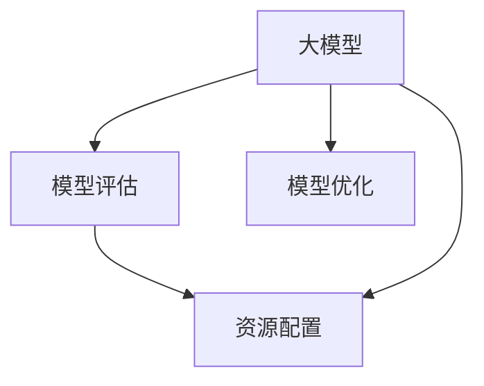

                 

# AI 大模型创业：如何利用资源优势？

## 1. 背景介绍

在人工智能的快速发展过程中，大模型作为支撑技术，正在迅速改变各行业的运行模式。大模型通常指大规模训练的神经网络模型，它们具有强大的数据处理能力和广泛的知识储备。对于人工智能创业公司而言，选择并利用好大模型，是获得市场竞争优势的关键。

大模型资源的选择与利用，不仅决定了公司产品的性能与体验，也影响着其在市场中的定位与未来发展。如何准确评估模型效果、合理配置资源、进行高效管理，成为各大模型公司关注的重点。

## 2. 核心概念与联系

### 2.1 核心概念概述

大模型、模型评估、资源配置与优化是大模型创业中几个核心概念。

- **大模型**：指基于大规模数据进行训练的神经网络模型，通常具有较强的泛化能力和应用潜力。
- **模型评估**：包括模型性能测试、优化方法选择和评估指标设定，是大模型开发中的关键环节。
- **资源配置与优化**：包括模型训练资源（如GPU、TPU、内存等）的合理分配和管理，以及模型训练过程的参数调整与优化。

### 2.2 核心概念间的关系

大模型、模型评估和资源配置与优化之间关系紧密：

- **大模型**作为核心，是整个创业项目的核心技术基础。
- **模型评估**用来评估大模型的性能，指导资源配置与优化。
- **资源配置与优化**则通过合理分配资源，提升大模型的训练效率和性能。

三个概念环环相扣，共同构成了大模型创业的完整流程。

### 2.3 核心概念的整体架构

核心概念间关系图示：



## 3. 核心算法原理 & 具体操作步骤

### 3.1 算法原理概述

大模型创业的算法原理主要涉及模型的选择与训练、模型的评估与优化、以及资源的配置与优化三个方面。

1. **模型的选择与训练**：选择合适的预训练大模型，并在此基础上进行微调或直接训练。
2. **模型的评估与优化**：通过一系列评估方法，确定模型性能，并进行参数调整与优化。
3. **资源的配置与优化**：合理分配与优化计算资源，提升模型训练与推理效率。

### 3.2 算法步骤详解

以下是AI大模型创业的详细算法步骤：

#### 3.2.1 模型的选择与训练

1. **预训练模型选择**：根据创业项目需求，选择合适的预训练大模型，如BERT、GPT等。
2. **微调或直接训练**：对预训练模型进行微调，或在大量标注数据上直接训练模型。

#### 3.2.2 模型的评估与优化

1. **评估方法选择**：根据项目需求选择合适的评估方法，如BLEU、ROUGE等。
2. **评估指标设定**：确定评价指标，如准确率、召回率、F1值等。
3. **参数调整与优化**：根据评估结果，调整模型参数，进行优化。

#### 3.2.3 资源的配置与优化

1. **计算资源分配**：根据模型规模和训练需求，合理分配计算资源。
2. **优化算法选择**：选择合适的优化算法，如SGD、Adam等。
3. **资源监控与调整**：监控计算资源使用情况，动态调整资源分配。

### 3.3 算法优缺点

大模型创业的算法优缺点如下：

#### 优点

- **高泛化能力**：大模型通常具有较高的泛化能力，能够适应多种应用场景。
- **训练速度快**：预训练模型在大量数据上训练完毕，后续微调或训练速度快。
- **性能高**：大模型在各类NLP任务上均表现优异，能够实现高性能的应用。

#### 缺点

- **资源消耗大**：大模型通常需要强大的计算资源，如GPU、TPU等。
- **训练复杂度高**：需要大量的标注数据和专业技能，实施难度高。
- **模型维护成本高**：模型训练后需要持续维护，成本较高。

### 3.4 算法应用领域

大模型在各个领域中都有广泛应用：

1. **自然语言处理**：如文本分类、命名实体识别、机器翻译等。
2. **计算机视觉**：如图像分类、目标检测、语义分割等。
3. **语音识别**：如语音转文本、情感分析、说话人识别等。
4. **推荐系统**：如商品推荐、内容推荐等。
5. **医疗健康**：如疾病诊断、智能问诊等。
6. **金融风控**：如信用评估、欺诈检测等。

## 4. 数学模型和公式 & 详细讲解 & 举例说明

### 4.1 数学模型构建

1. **数据准备**：准备训练集、验证集和测试集。
2. **模型定义**：定义模型结构，包括输入层、隐藏层和输出层等。
3. **损失函数**：选择合适的损失函数，如交叉熵损失、均方误差等。
4. **优化算法**：选择合适的优化算法，如SGD、Adam等。

### 4.2 公式推导过程

以文本分类任务为例，推导其优化算法公式。

假设模型为$y=f(x;\theta)$，其中$x$为输入，$\theta$为模型参数，$y$为预测输出，$y'$为真实标签。则模型的损失函数为：

$$
\mathcal{L} = \frac{1}{N}\sum_{i=1}^{N} L(y_i, y'_i)
$$

其中$L$为损失函数，如交叉熵损失。根据梯度下降算法，模型的优化目标为：

$$
\theta = \mathop{\arg\min}_{\theta} \mathcal{L}(\theta)
$$

对应的梯度公式为：

$$
\frac{\partial \mathcal{L}(\theta)}{\partial \theta} = -\frac{1}{N}\sum_{i=1}^{N} \frac{\partial L(y_i, y'_i)}{\partial \theta}
$$

### 4.3 案例分析与讲解

以文本分类任务为例，展示其优化算法的详细实现步骤：

1. **数据准备**：收集并预处理训练数据。
2. **模型定义**：使用卷积神经网络(CNN)或循环神经网络(RNN)作为模型结构。
3. **损失函数**：选择交叉熵损失函数。
4. **优化算法**：使用Adam优化算法，设置学习率为$10^{-4}$。
5. **评估指标**：计算模型在验证集上的准确率。
6. **参数调整**：根据评估结果，调整模型参数。

## 5. 项目实践：代码实例和详细解释说明

### 5.1 开发环境搭建

以下是使用PyTorch搭建大模型训练环境的步骤：

1. **环境准备**：安装PyTorch和相关依赖包。
2. **数据准备**：准备训练集、验证集和测试集，并进行预处理。
3. **模型定义**：定义模型结构。
4. **损失函数**：定义损失函数。
5. **优化算法**：定义优化算法。
6. **训练与评估**：进行模型训练和评估。

### 5.2 源代码详细实现

以文本分类任务为例，展示其代码实现：

```python
import torch
from torch import nn
from torch.utils.data import DataLoader

class TextClassifier(nn.Module):
    def __init__(self):
        super(TextClassifier, self).__init__()
        self.conv1 = nn.Conv2d(1, 64, kernel_size=3)
        self.conv2 = nn.Conv2d(64, 128, kernel_size=3)
        self.fc = nn.Linear(128*3*3, 10)
        
    def forward(self, x):
        x = nn.functional.relu(self.conv1(x))
        x = nn.functional.max_pool2d(x, 2)
        x = nn.functional.relu(self.conv2(x))
        x = nn.functional.max_pool2d(x, 2)
        x = x.view(-1, 128*3*3)
        x = nn.functional.relu(self.fc(x))
        return x

model = TextClassifier()
criterion = nn.CrossEntropyLoss()
optimizer = torch.optim.Adam(model.parameters(), lr=10**-4)

train_loader = DataLoader(train_dataset, batch_size=32)
valid_loader = DataLoader(valid_dataset, batch_size=32)
test_loader = DataLoader(test_dataset, batch_size=32)

# 训练过程
for epoch in range(10):
    model.train()
    total_loss = 0
    for images, labels in train_loader:
        images = images.view(-1, 1, 28, 28)
        labels = labels
        outputs = model(images)
        loss = criterion(outputs, labels)
        optimizer.zero_grad()
        loss.backward()
        optimizer.step()
        total_loss += loss.item()

    # 评估过程
    model.eval()
    total_correct = 0
    for images, labels in valid_loader:
        images = images.view(-1, 1, 28, 28)
        labels = labels
        outputs = model(images)
        _, predicted = torch.max(outputs.data, 1)
        total_correct += (predicted == labels).sum().item()
    valid_accuracy = total_correct / len(valid_loader.dataset)
    print('Epoch: {}, Validation Accuracy: {:.3f}'.format(epoch+1, valid_accuracy))

# 测试过程
model.eval()
total_correct = 0
for images, labels in test_loader:
    images = images.view(-1, 1, 28, 28)
    labels = labels
    outputs = model(images)
    _, predicted = torch.max(outputs.data, 1)
    total_correct += (predicted == labels).sum().item()
test_accuracy = total_correct / len(test_loader.dataset)
print('Test Accuracy: {:.3f}'.format(test_accuracy))
```

### 5.3 代码解读与分析

代码实现中，详细注释了每个步骤的功能和原理。以下是代码分析：

1. **模型定义**：使用CNN作为文本分类模型，包含卷积层、池化层和全连接层。
2. **损失函数**：使用交叉熵损失函数。
3. **优化算法**：使用Adam优化算法。
4. **数据准备**：使用PyTorch DataLoader加载数据集。
5. **训练过程**：在每个epoch中，对训练集进行前向传播和反向传播，更新模型参数。
6. **评估过程**：在验证集上计算模型准确率。
7. **测试过程**：在测试集上计算模型准确率。

## 6. 实际应用场景

### 6.1 金融风控

在金融领域，大模型可应用于信用评估、欺诈检测等。利用大模型对历史数据进行训练，评估客户的信用风险和欺诈行为，提升风险控制能力。

#### 6.1.1 信用评估

大模型可通过分析客户的历史交易记录、社交行为等数据，预测客户的信用风险。以GPT-3为例，通过在大规模金融数据上训练，可以预测客户的违约概率，帮助银行和金融机构进行风险评估。

#### 6.1.2 欺诈检测

利用大模型对交易记录进行分析和比对，可以实时识别异常交易行为，提前预警潜在的欺诈风险。以BERT模型为例，通过在大量标注数据上训练，可以识别出交易中的异常模式，提高欺诈检测的准确率。

### 6.2 医疗健康

在医疗领域，大模型可应用于疾病诊断、智能问诊等。利用大模型对医疗数据进行训练，提高诊断的准确性和效率。

#### 6.2.1 疾病诊断

大模型通过分析患者的病历数据、生理指标等，预测疾病的发生概率和严重程度。以Transformer模型为例，通过在医疗数据上训练，可以自动识别出患者的疾病类型和症状，提升诊断的准确性和效率。

#### 6.2.2 智能问诊

利用大模型对患者的描述进行理解和分析，提供精准的疾病建议和治疗方案。以BERT模型为例，通过在医学问答数据上训练，可以回答患者的常见问题，提供科学的健康建议。

### 6.3 智能客服

在客服领域，大模型可应用于智能客服、自动回复等。利用大模型对客户描述进行分析和理解，提供精准的回复和建议。

#### 6.3.1 智能客服

大模型通过分析客户的提问，自动生成并输出相关的回复。以GPT-3为例，通过在大规模客户对话数据上训练，可以提供准确、高效的客户服务。

#### 6.3.2 自动回复

利用大模型对客户的问题进行分类和分析，提供精准的自动回复。以BERT模型为例，通过在客户问答数据上训练，可以自动生成高质量的回复，提升客户体验。

## 7. 工具和资源推荐

### 7.1 学习资源推荐

以下是几本推荐的学习资源，有助于理解大模型和微调技术：

1. **《深度学习》**：Ian Goodfellow著，系统介绍了深度学习的基本概念和应用。
2. **《TensorFlow 2.0深度学习》**：Eric Ellis著，深入讲解了TensorFlow的使用方法和深度学习的应用。
3. **《自然语言处理综论》**：Daniel Jurafsky等著，介绍了自然语言处理的基本方法和应用。
4. **《Transformer: A Survey》**：Jurgen Schmid.de Alfaro等著，综述了Transformer模型的发展和应用。
5. **《Python深度学习》**：Francois Chollet著，讲解了TensorFlow和Keras的使用方法。

### 7.2 开发工具推荐

以下是几个推荐的大模型开发工具：

1. **PyTorch**：开源深度学习框架，灵活高效，支持分布式训练。
2. **TensorFlow**：开源深度学习框架，支持大规模工程应用。
3. **HuggingFace**：提供预训练模型的封装和微调功能，易于使用。
4. **NVIDIA GPU**：高性能GPU，支持深度学习模型的高效训练。
5. **Google Colab**：在线Jupyter Notebook环境，免费提供GPU算力。

### 7.3 相关论文推荐

以下是几篇推荐的相关论文，有助于了解大模型的最新进展：

1. **《深度学习》**：Ian Goodfellow著，介绍了深度学习的基本概念和方法。
2. **《Transformer: A Survey》**：Jurgen Schmid.de Alfaro等著，综述了Transformer模型的发展和应用。
3. **《BERT: Pre-training of Deep Bidirectional Transformers for Language Understanding》**：Devlin等著，介绍了BERT模型的预训练方法和应用。
4. **《GPT-3: Language Models are Unsupervised Multitask Learners》**：Brown等著，介绍了GPT-3模型的预训练方法和应用。
5. **《AdaLoRA: Adaptive Low-Rank Adaptation for Parameter-Efficient Fine-Tuning》**：Zheng等著，介绍了AdaLoRA方法的使用方法和效果。

## 8. 总结：未来发展趋势与挑战

### 8.1 研究成果总结

大模型创业的核心技术包括模型选择与训练、模型评估与优化、资源配置与优化等。通过合理的技术选择和实施，可以提升大模型的性能和应用效果。

### 8.2 未来发展趋势

大模型创业的未来发展趋势如下：

1. **技术融合**：大模型与云计算、物联网等技术的融合，将推动智能化应用的进一步发展。
2. **算法优化**：新型算法的出现和优化，将提升大模型的训练和推理效率。
3. **应用扩展**：大模型将广泛应用于更多的行业领域，如教育、交通、农业等。
4. **数据创新**：更多新型数据源的出现，将为模型提供更丰富的训练数据。
5. **商业应用**：大模型将推动商业模式的创新和变革，创造更多的商业价值。

### 8.3 面临的挑战

大模型创业面临的挑战包括：

1. **技术门槛高**：大模型开发需要较高的技术门槛，需要具备深度学习、数据处理等相关知识。
2. **资源消耗大**：大模型通常需要强大的计算资源，成本较高。
3. **数据隐私**：大模型训练和应用过程中需要大量的数据，隐私保护成为重要问题。
4. **伦理问题**：大模型的使用可能带来伦理问题，如偏见、歧视等。
5. **法律风险**：大模型的使用可能涉及法律风险，如版权问题等。

### 8.4 研究展望

大模型创业的研究展望如下：

1. **多模态融合**：大模型将融合视觉、听觉、文字等多模态信息，提升应用效果。
2. **跨领域迁移**：大模型将支持跨领域的知识迁移和应用。
3. **自监督学习**：利用自监督学习方法，降低对标注数据的依赖。
4. **知识图谱**：结合知识图谱，提升大模型的推理能力和应用效果。
5. **持续学习**：大模型将具备持续学习的能力，适应数据分布的变化。

## 9. 附录：常见问题与解答

**Q1: 大模型创业有哪些典型的成功案例？**

A: 大模型创业的成功案例包括：

1. **OpenAI**：GPT系列模型，应用于自然语言处理、智能对话等多个领域，取得了显著成效。
2. **Google AI**：BERT模型，广泛应用于自然语言处理任务，取得了多项SOTA。
3. **Microsoft**：T5模型，广泛应用于自然语言处理和数据处理任务，取得了广泛应用。
4. **IBM Watson**：应用于医疗、金融等多个领域，实现了跨领域的知识迁移。

**Q2: 如何评估大模型的性能？**

A: 大模型的性能评估通常包括以下几个方面：

1. **准确率（Accuracy）**：计算模型预测正确的样本数占总样本数的比例。
2. **召回率（Recall）**：计算模型正确预测的正样本数占实际正样本数的比例。
3. **F1值（F1-score）**：综合考虑准确率和召回率，计算模型的综合性能。
4. **ROUGE**：用于文本相似度计算，评估模型的生成能力。
5. **BLEU**：用于机器翻译等任务的评估，计算模型生成的文本与参考文本的相似度。

**Q3: 如何优化大模型的训练过程？**

A: 大模型的训练过程优化主要包括以下几个方面：

1. **数据增强**：利用数据增强技术，扩充训练数据，提升模型性能。
2. **正则化**：使用L2正则化、Dropout等技术，避免过拟合。
3. **优化算法**：选择合适的优化算法，如Adam、SGD等，优化模型训练过程。
4. **超参数调优**：通过网格搜索、随机搜索等方法，调整超参数，优化模型性能。
5. **硬件资源**：合理分配计算资源，如GPU、TPU等，提升训练效率。

**Q4: 大模型的未来发展方向是什么？**

A: 大模型的未来发展方向包括：

1. **通用人工智能**：大模型将朝着通用人工智能方向发展，具备更强的跨领域迁移能力和推理能力。
2. **多模态融合**：融合视觉、听觉、文字等多模态信息，提升模型应用效果。
3. **自监督学习**：利用自监督学习方法，降低对标注数据的依赖。
4. **知识图谱**：结合知识图谱，提升模型的推理能力和应用效果。
5. **持续学习**：大模型将具备持续学习的能力，适应数据分布的变化。

**Q5: 大模型的使用过程中需要注意哪些伦理问题？**

A: 大模型的使用过程中需要注意以下伦理问题：

1. **数据隐私**：保护用户数据的隐私，避免数据泄露。
2. **偏见和歧视**：避免模型输出中的偏见和歧视，确保公平性。
3. **伦理审查**：在模型开发和使用过程中，进行伦理审查和评估。
4. **透明性**：确保模型的工作原理和决策过程透明，便于理解和监督。
5. **责任归属**：明确模型使用过程中的责任归属，避免误导和滥用。

总之，大模型创业需要技术、应用、伦理等多方面的综合考虑和协同努力，才能实现其广泛的应用和可持续发展。

---

作者：禅与计算机程序设计艺术 / Zen and the Art of Computer Programming

