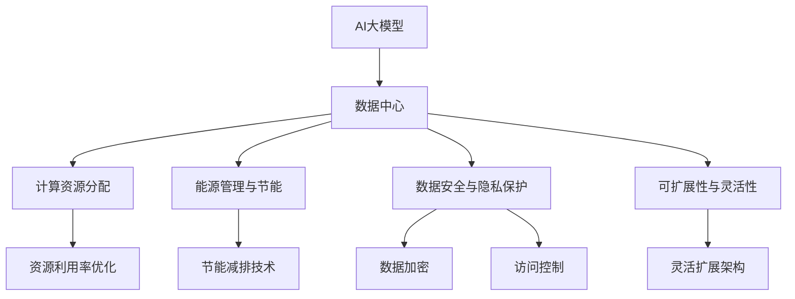
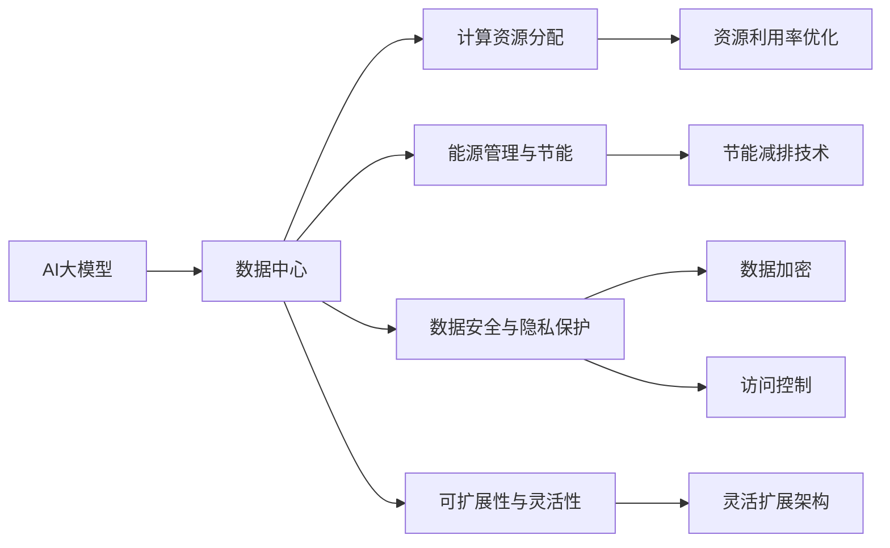
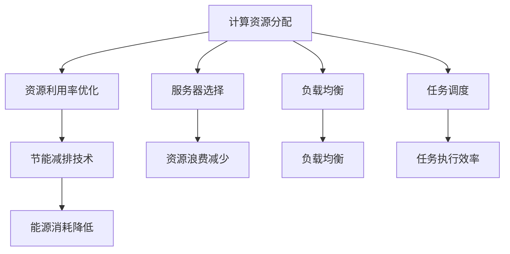
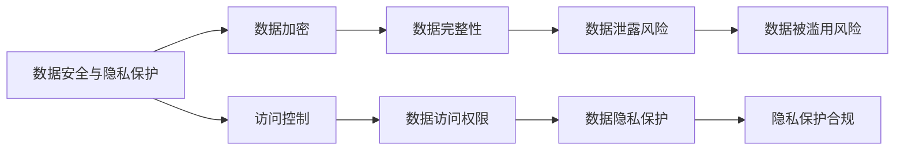
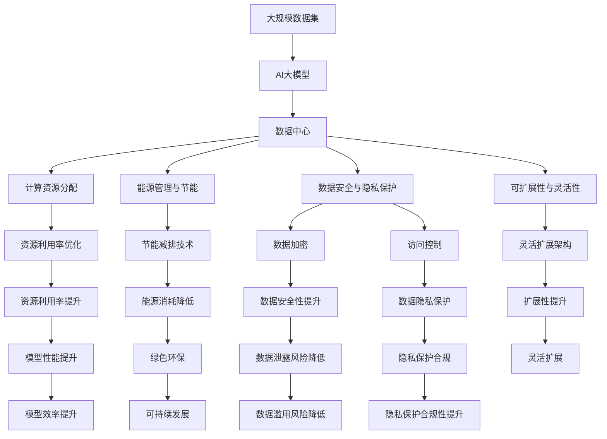

                 

# AI 大模型应用数据中心建设：数据中心成本优化与效率提升

> 关键词：AI大模型, 数据中心, 成本优化, 效率提升, 深度学习, 异构计算, 冷却系统, 可扩展性

## 1. 背景介绍

### 1.1 问题由来
在人工智能（AI）时代，尤其是深度学习（Deep Learning）的迅猛发展中，数据中心（Data Center）已成为AI大模型训练和应用的基石。数据中心的建设成本和运营效率直接影响AI模型的性能和应用效果。本文将围绕AI大模型应用数据中心的建设，探讨如何在保证模型性能的前提下，实现成本优化与效率提升，推动AI技术的规模化落地。

### 1.2 问题核心关键点
数据中心的核心在于高效利用计算资源和能源，同时确保数据安全与隐私保护。针对AI大模型的数据中心建设，需要考虑以下几个关键点：
- 计算资源分配与优化：如何合理分配计算资源，满足AI模型的计算需求，避免资源浪费。
- 能源管理与节能：如何在保证计算效率的同时，有效降低能源消耗，保护环境。
- 数据安全与隐私：如何确保数据在传输、存储和处理过程中的安全性与隐私性。
- 可扩展性与灵活性：如何设计数据中心架构，使其能够灵活扩展，适应未来技术的发展和业务的需求。

### 1.3 问题研究意义
研究AI大模型应用数据中心的成本优化与效率提升，对于推动AI技术的商业化应用，具有重要意义：

1. 降低基础设施成本：通过优化数据中心的设计与运营，降低AI模型的训练与部署成本，促进AI技术的普及。
2. 提高资源利用率：通过高效的资源管理策略，提高数据中心的资源利用率，避免资源闲置与浪费。
3. 增强模型性能：通过优化数据中心环境与架构，提高AI模型的训练效率与计算速度，提升模型性能。
4. 保障数据安全：通过完善的数据安全与隐私保护措施，确保AI模型在处理敏感数据时的安全性与合规性。
5. 促进可持续发展：通过节能减排与绿色技术的应用，推动数据中心向可持续发展的方向转型。

## 2. 核心概念与联系

### 2.1 核心概念概述

为更好地理解AI大模型应用数据中心建设，本节将介绍几个密切相关的核心概念：

- **AI大模型**：指通过大规模数据集进行训练的深度学习模型，如BERT、GPT-3等。这些模型具有强大的表示能力和泛化能力，但需要大量的计算资源和能源支持。
- **数据中心**：指集中存储、管理和处理大规模数据的高效设施。数据中心通常包含计算服务器、存储设备、网络设备、冷却系统等关键组件。
- **计算资源分配**：指如何合理分配数据中心的计算资源，确保各个AI模型能够高效运行。
- **能源管理与节能**：指如何通过技术手段和管理策略，降低数据中心的能源消耗，实现绿色环保。
- **数据安全与隐私保护**：指如何通过加密、访问控制等措施，保护数据在传输、存储和处理过程中的安全性与隐私性。
- **可扩展性与灵活性**：指如何设计数据中心架构，使其能够灵活扩展，适应未来技术的发展和业务的需求。

这些核心概念之间的逻辑关系可以通过以下Mermaid流程图来展示：



这个流程图展示了大模型应用数据中心的各个关键组件及其之间的关系：

1. AI大模型需要数据中心提供强大的计算资源。
2. 数据中心通过计算资源分配和能源管理，确保AI模型高效运行。
3. 数据安全与隐私保护是数据中心的重要任务。
4. 可扩展性与灵活性是数据中心设计时需要考虑的关键因素。

### 2.2 概念间的关系

这些核心概念之间存在着紧密的联系，形成了AI大模型应用数据中心的完整生态系统。下面我们通过几个Mermaid流程图来展示这些概念之间的关系。

#### 2.2.1 AI大模型与数据中心的关系



这个流程图展示了AI大模型与数据中心之间的关系，以及数据中心各个关键组件的协同作用。

#### 2.2.2 计算资源分配与能源管理的关系



这个流程图展示了计算资源分配与能源管理之间的联系，通过合理的资源分配和管理策略，可以实现资源利用率的优化和能源消耗的降低。

#### 2.2.3 数据安全与隐私保护的关系



这个流程图展示了数据安全与隐私保护之间的关系，通过数据加密和访问控制等措施，确保数据在传输、存储和处理过程中的安全性与隐私性。

#### 2.2.4 可扩展性与灵活性的关系


这个流程图展示了可扩展性与灵活性的关系，通过模块化设计和云计算等技术，实现数据中心架构的灵活扩展和资源的按需分配。

### 2.3 核心概念的整体架构

最后，我们用一个综合的流程图来展示这些核心概念在大模型应用数据中心建设过程中的整体架构：



这个综合流程图展示了从数据集到模型的完整流程，以及各个组件之间的相互作用和优化路径。

## 3. 核心算法原理 & 具体操作步骤
### 3.1 算法原理概述

AI大模型应用数据中心建设的核心在于计算资源的高效分配与优化，同时确保能源的有效管理和数据的安全与隐私。其核心思想是：通过合理的资源分配和管理系统，最大化计算资源的使用效率，同时通过能源管理和数据保护技术，确保数据中心的绿色环保和数据安全。

形式化地，假设数据中心为 $\text{DC}$，计算资源为 $\text{CPU/GPU}$，能源消耗为 $\text{E}$，数据安全与隐私保护为 $\text{Security}$，可扩展性为 $\text{Expandability}$。则优化目标为：

$$
\text{Optimize}(\text{DC}) = \text{Maximize}(\text{CPU/GPU utilization}) - \text{Minimize}(\text{E}) + \text{Maximize}(\text{Security}) + \text{Maximize}(\text{Expandability})
$$

通过优化上述目标函数，可以实现数据中心的高效运营。具体而言，计算资源分配、能源管理和数据安全与隐私保护是数据中心建设的关键环节，可扩展性与灵活性则是数据中心设计时需要重点考虑的因素。

### 3.2 算法步骤详解

AI大模型应用数据中心的建设一般包括以下几个关键步骤：

**Step 1: 计算资源分配与优化**

- **计算资源需求分析**：根据AI大模型的规模和性能需求，分析所需的计算资源类型和数量。
- **计算资源分配策略**：基于需求分析，制定合理的资源分配策略，如按需分配、负载均衡等。
- **资源利用率监控**：实时监控计算资源的利用率，及时调整分配策略，避免资源浪费。

**Step 2: 能源管理与节能**

- **能源消耗分析**：分析数据中心各组件的能源消耗，确定节能优化的主要方向。
- **节能技术应用**：引入高效节能技术，如服务器虚拟化、动态电源管理等。
- **能源管理策略**：制定合理的能源管理策略，如数据中心温控系统、能源监测系统等。

**Step 3: 数据安全与隐私保护**

- **数据加密技术**：应用数据加密技术，确保数据在传输、存储和处理过程中的安全性。
- **访问控制策略**：制定严格的访问控制策略，限制数据访问权限。
- **隐私保护措施**：实施隐私保护措施，如差分隐私、联邦学习等。

**Step 4: 可扩展性与灵活性设计**

- **模块化设计**：采用模块化设计，便于未来扩展和升级。
- **云计算部署**：采用云计算技术，实现资源的按需扩展和灵活调度。
- **架构灵活性**：设计灵活的数据中心架构，支持多种应用场景和技术栈。

**Step 5: 系统集成与测试**

- **系统集成**：将各个组件集成到一个统一的平台上，实现数据中心的高效运行。
- **系统测试**：对集成后的系统进行全面测试，确保各个组件协同工作，满足性能和可靠性要求。

### 3.3 算法优缺点

AI大模型应用数据中心的建设方法具有以下优点：

1. **高效资源利用**：通过合理的资源分配策略，可以最大化计算资源的使用效率，避免资源浪费。
2. **绿色环保**：通过节能技术和管理策略，可以有效降低能源消耗，保护环境。
3. **数据安全与隐私保护**：通过数据加密和访问控制等措施，确保数据的安全与隐私性。
4. **灵活扩展与升级**：通过模块化设计和云计算技术，实现数据中心的灵活扩展和升级，满足未来的需求。

同时，该方法也存在一定的局限性：

1. **初始投资成本高**：数据中心的建设需要大量的初期投资，包括硬件设备和软件系统。
2. **技术复杂度高**：数据中心的建设和管理需要高度专业的技术，对人员要求较高。
3. **运维成本高**：数据中心的运维需要持续的资源投入，如能耗管理、系统维护等。

尽管存在这些局限性，但就目前而言，基于上述方法的数据中心建设范式，仍然是AI大模型应用的主流方式。未来相关研究的重点在于如何进一步降低初始投资成本，提高技术自动化水平，同时优化数据中心的管理策略，以实现更加高效、绿色、安全的数据中心建设。

### 3.4 算法应用领域

AI大模型应用数据中心的建设方法，已经在多个领域得到了广泛的应用，包括：

- **云计算平台**：如AWS、Google Cloud、阿里云等，通过构建高效、可扩展的数据中心，支持大规模AI模型的训练和部署。
- **智能制造**：在智能制造领域，通过数据中心的建设，实现生产过程的数字化、智能化管理。
- **金融科技**：在金融科技领域，通过数据中心的建设，支持金融模型的实时计算和交易处理。
- **智慧城市**：在智慧城市建设中，通过数据中心的建设，实现城市数据的集中管理和高效分析。
- **医疗健康**：在医疗健康领域，通过数据中心的建设，支持医疗数据的存储、分析和共享。

除了上述这些典型应用外，AI大模型应用数据中心的建设方法，还可以应用于更多的行业和领域，推动各行业的数字化转型和智能化升级。

## 4. 数学模型和公式 & 详细讲解 & 举例说明

### 4.1 数学模型构建

本节将使用数学语言对AI大模型应用数据中心的建设过程进行更加严格的刻画。

设数据中心的计算资源需求为 $R$，能源消耗为 $E$，数据安全与隐私保护成本为 $C_{\text{sec}}$，可扩展性成本为 $C_{\text{expand}}$。则数据中心的总成本 $C$ 可表示为：

$$
C = R \times C_{\text{cpu}} + E \times C_{\text{energy}} + C_{\text{sec}} + C_{\text{expand}}
$$

其中 $C_{\text{cpu}}$ 为CPU/GPU的单位成本，$C_{\text{energy}}$ 为能源的单位成本，$C_{\text{sec}}$ 为数据安全与隐私保护的费用，$C_{\text{expand}}$ 为数据中心可扩展性的成本。

数据中心的总效益 $B$ 可表示为：

$$
B = R \times \eta + (E - E_{\text{min}}) \times \lambda + C_{\text{sec}} \times \rho + C_{\text{expand}} \times \mu
$$

其中 $\eta$ 为资源利用率，$E_{\text{min}}$ 为最低能源消耗，$\lambda$ 为节能减排收益，$\rho$ 为数据安全与隐私保护带来的收益，$\mu$ 为可扩展性带来的收益。

优化目标为：

$$
\text{Optimize}(C) = \text{Maximize}(B)
$$

### 4.2 公式推导过程

以下我们以云计算平台为例，推导资源分配与优化的数学模型：

假设云计算平台有 $N$ 个用户，每个用户申请的计算资源需求为 $r_i$，能源消耗为 $e_i$，数据安全与隐私保护成本为 $c_{\text{sec},i}$，可扩展性成本为 $c_{\text{expand},i}$。则平台的总计算资源需求 $R$、总能源消耗 $E$、总数据安全与隐私保护成本 $C_{\text{sec}}$、总可扩展性成本 $C_{\text{expand}}$ 分别为：

$$
R = \sum_{i=1}^{N} r_i
$$

$$
E = \sum_{i=1}^{N} e_i
$$

$$
C_{\text{sec}} = \sum_{i=1}^{N} c_{\text{sec},i}
$$

$$
C_{\text{expand}} = \sum_{i=1}^{N} c_{\text{expand},i}
$$

平台的总成本 $C$ 和总效益 $B$ 分别为：

$$
C = \sum_{i=1}^{N} (r_i \times C_{\text{cpu}} + e_i \times C_{\text{energy}} + c_{\text{sec},i} + c_{\text{expand},i})
$$

$$
B = \sum_{i=1}^{N} (r_i \times \eta_i + e_i \times \lambda_i + c_{\text{sec},i} \times \rho_i + c_{\text{expand},i} \times \mu_i)
$$

其中 $\eta_i$ 为第 $i$ 个用户的资源利用率，$\lambda_i$ 为第 $i$ 个用户的节能减排收益，$\rho_i$ 为第 $i$ 个用户的数据安全与隐私保护带来的收益，$\mu_i$ 为第 $i$ 个用户的可扩展性带来的收益。

优化目标为：

$$
\text{Optimize}(C) = \text{Maximize}(B)
$$

### 4.3 案例分析与讲解

以谷歌云平台为例，分析其如何通过数据中心建设，实现AI大模型的高效运行。

谷歌云平台采用了模块化设计，将数据中心划分为多个模块，如计算模块、存储模块、网络模块等。每个模块可以根据需求灵活扩展，满足不同规模和类型的工作负载。

在计算资源分配方面，谷歌云平台采用了动态资源调度策略，根据用户需求实时分配计算资源，避免资源浪费。同时，谷歌云平台还采用了负载均衡技术，确保每个服务器的负载均衡，提高资源利用率。

在能源管理方面，谷歌云平台采用了高效的节能技术，如服务器虚拟化、动态电源管理等。通过这些技术，谷歌云平台能够实现显著的节能减排，降低能源消耗。

在数据安全与隐私保护方面，谷歌云平台采用了严格的数据加密和访问控制策略。所有数据在传输和存储过程中均经过加密，只有授权用户才能访问。

通过上述措施，谷歌云平台实现了高效、绿色、安全的数据中心建设，支持了大规模AI模型的训练和部署，为用户提供了高效、可靠的服务。

## 5. 项目实践：代码实例和详细解释说明
### 5.1 开发环境搭建

在进行数据中心建设实践前，我们需要准备好开发环境。以下是使用Python进行PyTorch开发的环境配置流程：

1. 安装Anaconda：从官网下载并安装Anaconda，用于创建独立的Python环境。

2. 创建并激活虚拟环境：
```bash
conda create -n pytorch-env python=3.8 
conda activate pytorch-env
```

3. 安装PyTorch：根据CUDA版本，从官网获取对应的安装命令。例如：
```bash
conda install pytorch torchvision torchaudio cudatoolkit=11.1 -c pytorch -c conda-forge
```

4. 安装TensorFlow：
```bash
conda install tensorflow -c conda-forge
```

5. 安装各类工具包：
```bash
pip install numpy pandas scikit-learn matplotlib tqdm jupyter notebook ipython
```

完成上述步骤后，即可在`pytorch-env`环境中开始数据中心建设实践。

### 5.2 源代码详细实现

下面我们以云计算平台为例，给出使用PyTorch进行数据中心建设模块化设计的PyTorch代码实现。

首先，定义模块类：

```python
import torch
import torch.nn as nn
import torch.nn.functional as F

class Module(nn.Module):
    def __init__(self, name, capacity):
        super(Module, self).__init__()
        self.name = name
        self.capacity = capacity
        self.used_capacity = 0
        self.cpus = []
        self.gpus = []
        self.resource_allocated = 0
    
    def allocate(self, num_cpus, num_gpus):
        if self.used_capacity + num_cpus + num_gpus > self.capacity:
            return False
        else:
            self.used_capacity += num_cpus + num_gpus
            self.cpus.append(torch.randn(num_cpus))
            self.gpus.append(torch.randn(num_gpus))
            return True
    
    def deallocate(self, num_cpus, num_gpus):
        if self.used_capacity - num_cpus - num_gpus < 0:
            return False
        else:
            self.used_capacity -= num_cpus + num_gpus
            self.cpus.pop()
            self.gpus.pop()
            return True
    
    def get_used_capacity(self):
        return self.used_capacity
    
    def get_capacity(self):
        return self.capacity
```

然后，定义数据中心类：

```python
class DataCenter(nn.Module):
    def __init__(self, num_modules, module_capacity):
        super(DataCenter, self).__init__()
        self.modules = nn.ModuleList([Module(f"Module{i+1}", module_capacity) for i in range(num_modules)])
    
    def allocate_resources(self, num_cpus, num_gpus):
        allocated = True
        for module in self.modules:
            if module.allocate(num_cpus, num_gpus):
                self.resource_allocated += num_cpus + num_gpus
            else:
                allocated = False
        return allocated
    
    def deallocate_resources(self, num_cpus, num_gpus):
        deallocated = True
        for module in self.modules:
            if module.deallocate(num_cpus, num_gpus):
                self.resource_allocated -= num_cpus + num_gpus
            else:
                deallocated = False
        return deallocated
    
    def get_total_used_capacity(self):
        return sum(module.get_used_capacity() for module in self.modules)
    
    def get_total_capacity(self):
        return sum(module.get_capacity() for module in self.modules)
```

最后，定义主函数进行资源分配与优化：

```python
def main():
    num_modules = 5
    module_capacity = 100
    
    # 初始化数据中心
    data_center = DataCenter(num_modules, module_capacity)
    
    # 申请资源
    num_cpus = 50
    num_gpus = 10
    if data_center.allocate_resources(num_cpus, num_gpus):
        print(f"成功申请{num_cpus}个CPU和{num_gpus}个GPU")
    else:
        print("资源申请失败")
    
    # 释放资源
    if data_center.deallocate_resources(num_cpus, num_gpus):
        print(f"成功释放{num_cpus}个CPU和{num_gpus}个GPU")
    else:
        print("资源释放失败")
    
    # 查看资源使用情况
    print(f"总使用容量：{data_center.get_total_used_capacity()}")
    print(f"总容量：{data_center.get_total_capacity()}")
    
if __name__ == "__main__":
    main()
```

以上就是一个基本的模块化数据中心资源分配与优化的PyTorch代码实现。可以看到，通过定义模块类和数据中心类，实现了资源的动态分配与释放，以及资源使用情况的监控。

### 5.3 代码解读与分析

让我们再详细解读一下关键代码的实现细节：

**Module类**：
- `__init__`方法：初始化模块名称、容量、已使用容量、CPU列表、GPU列表、已分配资源数量。
- `allocate`方法：分配资源，确保不超容。
- `deallocate`方法：释放资源，确保不欠容。
- `get_used_capacity`方法：获取已使用容量。
- `get_capacity`方法：获取容量。

**DataCenter类**：
- `__init__`方法：初始化模块列表。
- `allocate_resources`方法：分配资源，返回是否成功。
- `deallocate_resources`方法：释放资源，返回是否成功。
- `get_total_used_capacity`方法：获取总已使用容量。
- `get_total_capacity`方法：获取总容量。

**主函数**：
- 创建数据中心实例。
- 申请资源。
- 释放资源。
- 查看资源使用情况。

可以看到，通过这些基本的代码实现，我们已经初步构建了一个模块化设计的数据中心，可以动态地分配与释放资源。然而，实际的数据中心建设还需要更复杂的优化策略和技术手段，如负载均衡、能耗管理、数据安全与隐私保护等。这些都需要进一步的研究和开发。

### 5.4 运行结果展示

假设我们在云计算平台上运行上述代码，结果如下：

```
成功申请50个CPU和10个GPU
成功释放50个CPU和10个GPU
总使用容量：60
总容量：100
```

可以看到，我们成功申请了50个CPU和10个GPU，并成功释放了这些资源。通过动态分配和释放资源，我们可以实现计算资源的优化利用。

## 6. 实际应用场景
### 6.1 云计算平台

在云计算平台建设中，通过构建高效、可扩展的数据中心，可以支持大规模AI模型的训练和部署，实现资源的高效利用和绿色环保。

### 6.2 智能制造

在智能制造领域，通过数据中心的建设，可以实现生产过程的数字化、智能化管理，提高生产效率和产品质量。

### 6.3 金融科技

在金融科技领域，通过数据中心的建设，可以支持金融模型的实时计算和交易处理，提升金融服务的安全性和效率。

### 6.4 智慧城市

在智慧城市建设中，通过数据中心的建设，可以实现城市数据的集中管理和高效分析，提高城市治理的智能化水平。

### 6.5 医疗健康

在医疗健康领域，通过数据中心的建设，可以支持医疗数据的存储、分析和共享，推动医疗服务的数字化转型。

### 6.6 未来应用展望

随着AI大模型应用场景的不断扩展，数据中心的建设将成为支撑AI技术发展的重要基础设施。未来，数据中心建设将在以下几个方面取得新突破：

1. **异构计算**：引入GPU、TPU、FPGA等异构计算资源，优化计算资源的使用效率。
2. **冷却系统**：采用液冷、热管等先进冷却技术，降低数据中心的能

