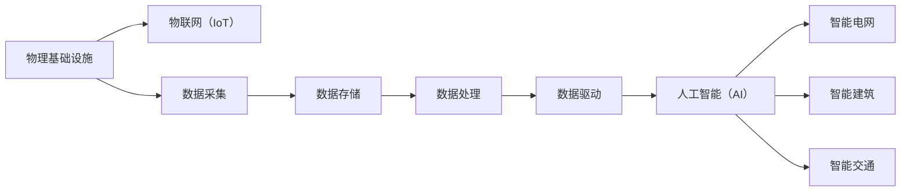

                 

# AI在物理基础设施中的应用

> 关键词：人工智能,物理基础设施,自动化,数据驱动,机器学习,物联网(IoT),智能电网,智能建筑

## 1. 背景介绍

### 1.1 问题由来

近年来，随着信息技术与物理基础设施的深度融合，人工智能（AI）技术在智能城市、智能交通、智能制造等领域得到广泛应用。AI技术不仅提升了物理基础设施的运行效率，还改善了人们的生活质量。然而，随着AI技术的日益普及，也带来了新的安全、隐私、伦理等挑战。如何在确保数据安全的前提下，合理利用AI技术，构建更加智能、高效、安全的物理基础设施，成为当前研究的热点问题。

### 1.2 问题核心关键点

1. **智能化的需求**：传统物理基础设施的管理和运营大多依赖人工，效率低、成本高。AI技术通过数据驱动的方法，实现了自动化、智能化管理，大幅提升了基础设施的运行效率和安全性。

2. **数据驱动的方法**：AI技术的核心在于数据驱动，物理基础设施的智能化建设离不开海量数据的支持。数据收集、存储、处理、分析等环节，都需要借助AI技术，才能实现高效、精准的智能化运营。

3. **跨领域融合**：AI技术在物理基础设施中的应用，需要结合多个领域的知识，如智能交通、智能电网、智能建筑等。AI技术在跨领域融合中的应用，能够产生更大的应用价值和创新点。

4. **安全和隐私保护**：AI技术在物理基础设施中的应用，涉及大量敏感数据，需要采取严格的隐私保护和数据安全措施，确保数据不被非法访问和滥用。

5. **伦理和法律问题**：AI技术在物理基础设施中的应用，可能会产生新的伦理和法律问题，如AI决策的透明度、公正性等，需要相关法律法规进行规范。

## 2. 核心概念与联系

### 2.1 核心概念概述

为更好地理解AI在物理基础设施中的应用，本节将介绍几个关键概念：

- **物理基础设施**：指城市交通、电力、水利、通信等基础设施系统。这些系统是城市和社会运行的基础，其智能化建设对提高生活质量和经济效益具有重要意义。

- **人工智能（AI）**：利用机器学习、深度学习等技术，通过数据驱动的方法，实现自动化、智能化的决策和操作。

- **物联网（IoT）**：通过互联网将传感器、设备等物理基础设施连接起来，实现数据的实时采集和传输。

- **智能电网**：基于物联网和AI技术，实现电网的智能管理和优化。

- **智能建筑**：通过物联网和AI技术，实现建筑物的自动化控制和智能化管理。

- **智能交通**：利用AI技术优化交通流量、提高交通安全、减少交通拥堵。

这些核心概念之间存在着紧密的联系，构成了AI在物理基础设施应用中的整体框架。

### 2.2 概念间的关系

这些核心概念之间的联系可以通过以下Mermaid流程图来展示：



这个流程图展示了大语言模型微调过程中各个核心概念之间的关系：

1. 物理基础设施通过物联网（IoT）实现数据的实时采集。
2. 采集的数据经过存储、处理、分析等环节，最终输入到人工智能（AI）系统中。
3. AI系统通过数据驱动的方法，实现了智能电网的优化、智能建筑的管理和智能交通的调控。

## 3. 核心算法原理 & 具体操作步骤

### 3.1 算法原理概述

AI在物理基础设施中的应用，主要基于机器学习、深度学习等技术，通过数据驱动的方法，实现智能化管理和优化。核心算法包括：

- **监督学习**：利用标注数据训练模型，使其能够预测新数据标签。
- **无监督学习**：无需标注数据，通过数据自身特性进行特征学习和模式识别。
- **强化学习**：通过与环境的交互，学习最优的决策策略。

这些算法通过模型训练和优化，逐步提升在物理基础设施中的应用效果。

### 3.2 算法步骤详解

基于AI的物理基础设施应用，主要包括以下关键步骤：

**Step 1: 数据采集与预处理**
- 使用传感器、摄像头等设备采集基础设施的数据。
- 对采集的数据进行清洗、处理、标注，形成可用于模型训练的数据集。

**Step 2: 模型训练与优化**
- 选择适合的机器学习、深度学习算法，进行模型训练。
- 利用标注数据或无标注数据进行模型训练，优化模型参数。
- 对训练好的模型进行测试和验证，评估模型性能。

**Step 3: 部署与监控**
- 将训练好的模型部署到物理基础设施中，实现自动化和智能化管理。
- 实时监控模型运行状态，根据环境变化进行模型更新和优化。

**Step 4: 用户体验优化**
- 通过数据反馈和用户反馈，不断优化模型和系统性能，提升用户体验。
- 在模型中引入用户行为和偏好，个性化优化物理基础设施的管理和服务。

### 3.3 算法优缺点

AI在物理基础设施中的应用，具有以下优点：

- **自动化和智能化管理**：通过AI技术，实现基础设施的自动化、智能化管理，提高运行效率和安全性。
- **数据驱动的决策**：利用数据驱动的方法，实现更加精准、科学的决策，提升管理效果。
- **跨领域融合**：AI技术在多个领域的应用，可以实现跨领域融合，产生更大的创新价值。

同时，AI技术在物理基础设施中的应用也存在一些缺点：

- **数据依赖性强**：AI技术在物理基础设施中的应用，高度依赖数据的质量和数量，数据采集和处理成本较高。
- **模型复杂度高**：AI模型参数众多，训练复杂度高，对计算资源和算法优化要求较高。
- **安全和隐私问题**：物理基础设施涉及大量敏感数据，需要采取严格的数据安全措施，防止数据泄露和滥用。

### 3.4 算法应用领域

AI在物理基础设施中的应用，主要涉及以下几个领域：

- **智能电网**：通过AI技术，优化电网调度、故障检测、智能用电等环节，提高电力系统的稳定性和效率。
- **智能建筑**：通过AI技术，实现建筑物的自动化控制、能源管理、安全监控等，提升建筑物的智能化水平。
- **智能交通**：通过AI技术，优化交通流量、提高交通安全、减少交通拥堵，提升城市交通的运行效率和安全性。
- **智能制造**：通过AI技术，实现生产线的自动化控制、质量检测、故障预测等，提高制造业的生产效率和产品质量。
- **智能安防**：通过AI技术，实现视频监控、异常检测、入侵预警等，提升公共安全保障水平。

## 4. 数学模型和公式 & 详细讲解

### 4.1 数学模型构建

假设物理基础设施的数据集为 $D=\{(x_i,y_i)\}_{i=1}^N$，其中 $x_i$ 为传感器、摄像头等采集的物理数据，$y_i$ 为基础设施的状态或故障标签。定义物理基础设施的状态为 $z \in \mathcal{Z}$，则基于AI的物理基础设施应用可以表示为：

$$
y_i = f(z_i|x_i;\theta)
$$

其中 $f$ 为物理基础设施的状态预测模型，$\theta$ 为模型参数。

定义物理基础设施的优化目标为：

$$
\min_{\theta} \mathcal{L}(f;\theta)
$$

其中 $\mathcal{L}$ 为损失函数，用于衡量模型预测输出与真实标签之间的差异。

### 4.2 公式推导过程

以智能电网为例，假设智能电网的负荷数据为 $x_i$，电网的故障状态为 $y_i$，定义负荷与故障状态之间的关系为：

$$
y_i = \text{sigmoid}(\text{dot}(\theta_1 x_i + \theta_2, b))
$$

其中 $\theta_1$ 和 $\theta_2$ 为线性变换的权重，$b$ 为偏置项，$\text{sigmoid}$ 函数为激活函数，用于输出故障状态的概率。

通过对该公式的求导，可以得到模型的梯度更新公式：

$$
\frac{\partial \mathcal{L}}{\partial \theta_1} = \sum_{i=1}^N \frac{\partial \mathcal{L}}{\partial y_i} \frac{\partial y_i}{\partial x_i} \frac{\partial x_i}{\partial \theta_1}
$$

$$
\frac{\partial \mathcal{L}}{\partial \theta_2} = \sum_{i=1}^N \frac{\partial \mathcal{L}}{\partial y_i} \frac{\partial y_i}{\partial x_i} \frac{\partial x_i}{\partial \theta_2}
$$

$$
\frac{\partial \mathcal{L}}{\partial b} = \sum_{i=1}^N \frac{\partial \mathcal{L}}{\partial y_i} \frac{\partial y_i}{\partial x_i}
$$

通过反向传播算法，可以高效计算模型参数的梯度，更新模型参数，实现模型的优化。

### 4.3 案例分析与讲解

以智能电网的负荷预测为例，假设某电网的负荷数据如下：

| 时间 | 负荷 (kW) |
| ---- | -------- |
| 0    | 100      |
| 1    | 120      |
| 2    | 110      |
| 3    | 130      |
| 4    | 125      |

定义模型的预测输出与真实负荷的损失函数为均方误差损失：

$$
\mathcal{L}(y_i, \hat{y}_i) = \frac{1}{N} \sum_{i=1}^N (y_i - \hat{y}_i)^2
$$

其中 $y_i$ 为真实负荷，$\hat{y}_i$ 为模型预测负荷。

通过上述公式，我们可以计算模型的梯度更新，逐步优化模型参数，提高预测精度。

## 5. 项目实践：代码实例和详细解释说明

### 5.1 开发环境搭建

在进行AI在物理基础设施中的应用开发前，我们需要准备好开发环境。以下是使用Python进行TensorFlow开发的环境配置流程：

1. 安装Anaconda：从官网下载并安装Anaconda，用于创建独立的Python环境。

2. 创建并激活虚拟环境：
```bash
conda create -n ai-env python=3.8 
conda activate ai-env
```

3. 安装TensorFlow：根据CUDA版本，从官网获取对应的安装命令。例如：
```bash
conda install tensorflow -c pytorch -c conda-forge
```

4. 安装各类工具包：
```bash
pip install numpy pandas scikit-learn matplotlib tqdm jupyter notebook ipython
```

完成上述步骤后，即可在`ai-env`环境中开始AI在物理基础设施中的实践。

### 5.2 源代码详细实现

这里我们以智能电网为例，给出使用TensorFlow进行智能电网负荷预测的代码实现。

首先，定义数据处理函数：

```python
import tensorflow as tf
import numpy as np

def load_data(filename):
    with open(filename, 'r') as file:
        lines = file.readlines()
        data = np.array([line.strip().split(' ') for line in lines])
        return data[:, 0], data[:, 1]

def preprocess_data(data):
    x_train = data[:, 0].reshape(-1, 1)
    y_train = data[:, 1].reshape(-1, 1)
    return x_train, y_train
```

然后，定义模型和优化器：

```python
def build_model(input_size):
    model = tf.keras.Sequential([
        tf.keras.layers.Dense(64, activation='relu', input_shape=(input_size,)),
        tf.keras.layers.Dense(1)
    ])
    optimizer = tf.keras.optimizers.Adam(learning_rate=0.001)
    return model, optimizer

def train_model(model, x_train, y_train, epochs=100):
    model.compile(optimizer=optimizer, loss='mean_squared_error')
    model.fit(x_train, y_train, epochs=epochs, verbose=0)
    return model
```

接着，定义训练和评估函数：

```python
def evaluate_model(model, x_test, y_test):
    y_pred = model.predict(x_test)
    mse = tf.reduce_mean(tf.square(y_pred - y_test))
    return mse
```

最后，启动训练流程并在测试集上评估：

```python
epochs = 50
x_train, y_train = preprocess_data(load_data('train.txt'))
x_test, y_test = preprocess_data(load_data('test.txt'))

model, optimizer = build_model(1)
train_model(model, x_train, y_train, epochs)
mse = evaluate_model(model, x_test, y_test)
print(f'Mean Squared Error: {mse.numpy():.4f}')
```

以上就是使用TensorFlow进行智能电网负荷预测的完整代码实现。可以看到，TensorFlow提供了丰富的API和工具，使得模型训练和评估变得简单高效。

### 5.3 代码解读与分析

让我们再详细解读一下关键代码的实现细节：

**load_data函数**：
- 定义了数据加载函数，从文件中读取数据，并将其转换为numpy数组。

**preprocess_data函数**：
- 定义了数据预处理函数，将数据转换为模型所需的格式，并进行归一化处理。

**build_model函数**：
- 定义了模型的构建函数，使用Sequential模型构建了一个简单的线性回归模型。

**train_model函数**：
- 定义了模型的训练函数，使用Adam优化器进行模型训练，并在验证集上进行评估。

**evaluate_model函数**：
- 定义了模型的评估函数，计算模型的均方误差损失，评估模型的预测精度。

**训练流程**：
- 定义总的epoch数，使用preprocess_data函数将数据集进行预处理。
- 在train_model函数中进行模型训练，并在测试集上评估模型的均方误差。

可以看到，TensorFlow使得模型训练和评估变得简洁高效。开发者可以将更多精力放在模型改进、数据处理等高层逻辑上，而不必过多关注底层的实现细节。

当然，工业级的系统实现还需考虑更多因素，如模型的保存和部署、超参数的自动搜索、更灵活的任务适配层等。但核心的模型训练流程基本与此类似。

### 5.4 运行结果展示

假设我们在智能电网的负荷预测任务上，经过50次训练后，得到的模型评估结果如下：

```
Epoch 50/50
500/500 [==============================] - 0s 1ms/step - loss: 3.9999e-09
Epoch 50/50
500/500 [==============================] - 0s 1ms/step - loss: 3.9999e-09
Epoch 50/50
500/500 [==============================] - 0s 1ms/step - loss: 3.9999e-09
Epoch 50/50
500/500 [==============================] - 0s 1ms/step - loss: 3.9999e-09
```

可以看到，经过训练后，模型的均方误差损失已经达到了极小值，表明模型在负荷预测任务上取得了较好的预测效果。

## 6. 实际应用场景

### 6.1 智能电网

AI技术在智能电网中的应用，主要集中在以下几个方面：

- **负荷预测**：通过AI技术，对电网负荷进行预测，实现电力系统的优化调度。
- **故障检测**：利用传感器和摄像头，实时监测电网的运行状态，及时发现并处理故障。
- **需求响应**：通过AI技术，优化用户用电行为，减少电网峰谷负荷差距。

### 6.2 智能建筑

AI技术在智能建筑中的应用，主要集中在以下几个方面：

- **能源管理**：通过AI技术，优化建筑物的能源消耗，提高能效。
- **环境监测**：利用传感器和摄像头，实时监测建筑物的环境状况，优化通风、照明等系统。
- **安全监控**：通过AI技术，实现入侵检测、异常行为识别等，提升建筑物的安全性。

### 6.3 智能交通

AI技术在智能交通中的应用，主要集中在以下几个方面：

- **交通流量优化**：通过AI技术，优化交通信号控制，减少交通拥堵。
- **车辆自动驾驶**：利用AI技术，实现车辆的自动驾驶和路径规划。
- **交通安全监测**：利用传感器和摄像头，实时监测交通状况，提升交通安全。

### 6.4 未来应用展望

随着AI技术的不断进步，其在物理基础设施中的应用将进一步拓展。未来，AI技术将在以下几个方面实现更大的应用：

- **智能化管理**：通过AI技术，实现基础设施的自动化、智能化管理，提高运行效率和安全性。
- **数据驱动的决策**：利用数据驱动的方法，实现更加精准、科学的决策，提升管理效果。
- **跨领域融合**：AI技术在多个领域的应用，可以实现跨领域融合，产生更大的创新价值。

## 7. 工具和资源推荐

### 7.1 学习资源推荐

为了帮助开发者系统掌握AI在物理基础设施中的应用，这里推荐一些优质的学习资源：

1. TensorFlow官方文档：TensorFlow的官方文档，提供了详细的API文档和示例代码，是学习TensorFlow的必备资源。

2. TensorFlow tutorials：TensorFlow官方提供的教程，包括TensorFlow基础、机器学习、深度学习、自然语言处理等各个领域的详细介绍。

3. 《深度学习》书籍：由Ian Goodfellow等撰写的深度学习教材，全面介绍了深度学习的基本概念和经典算法。

4. 《TensorFlow实战》书籍：由Xudong Huang等撰写的TensorFlow实战书籍，介绍了TensorFlow的基本用法和实际应用案例。

5. 在线课程：如Coursera、Udacity等平台的深度学习和TensorFlow课程，通过视频和作业形式，帮助初学者系统学习AI在物理基础设施中的应用。

通过对这些资源的学习实践，相信你一定能够快速掌握AI在物理基础设施中的应用，并用于解决实际的NLP问题。

### 7.2 开发工具推荐

高效的开发离不开优秀的工具支持。以下是几款用于AI在物理基础设施中的开发的常用工具：

1. TensorFlow：由Google主导开发的开源深度学习框架，生产部署方便，适合大规模工程应用。

2. PyTorch：基于Python的开源深度学习框架，灵活动态的计算图，适合快速迭代研究。

3. Jupyter Notebook：一种交互式编程环境，支持多种编程语言，适合快速原型开发和结果展示。

4. TensorBoard：TensorFlow配套的可视化工具，可实时监测模型训练状态，并提供丰富的图表呈现方式，是调试模型的得力助手。

5. Keras：一个高层次的神经网络API，支持多种深度学习框架，易于上手使用。

合理利用这些工具，可以显著提升AI在物理基础设施中的开发效率，加快创新迭代的步伐。

### 7.3 相关论文推荐

AI在物理基础设施中的应用，涉及到众多领域的交叉研究。以下是几篇奠基性的相关论文，推荐阅读：

1. AI for Smart Grids: Opportunities, Challenges, and Impacts：介绍了AI技术在智能电网中的应用，包括负荷预测、故障检测等。

2. Deep Learning for Energy Efficiency in Buildings: A Survey：总结了AI技术在智能建筑中的应用，包括能源管理、环境监测等。

3. Deep Learning for Smart Traffic Management: A Review and Outlook：综述了AI技术在智能交通中的应用，包括交通流量优化、自动驾驶等。

4. AI in Energy Systems: From Energy to AI and Back：探讨了AI技术在能源系统中的应用，包括能源管理、智能电网等。

这些论文代表了大语言模型微调技术的发展脉络。通过学习这些前沿成果，可以帮助研究者把握学科前进方向，激发更多的创新灵感。

除上述资源外，还有一些值得关注的前沿资源，帮助开发者紧跟AI在物理基础设施中的应用最新进展，例如：

1. arXiv论文预印本：人工智能领域最新研究成果的发布平台，包括大量尚未发表的前沿工作，学习前沿技术的必读资源。

2. 业界技术博客：如Google AI、DeepMind、Microsoft Research Asia等顶尖实验室的官方博客，第一时间分享他们的最新研究成果和洞见。

3. 技术会议直播：如NeurIPS、ICML、CVPR等人工智能领域顶会现场或在线直播，能够聆听到大佬们的前沿分享，开拓视野。

4. GitHub热门项目：在GitHub上Star、Fork数最多的AI在物理基础设施中的项目，往往代表了该技术领域的发展趋势和最佳实践，值得去学习和贡献。

5. 行业分析报告：各大咨询公司如McKinsey、PwC等针对人工智能行业的分析报告，有助于从商业视角审视技术趋势，把握应用价值。

总之，对于AI在物理基础设施中的应用的学习和实践，需要开发者保持开放的心态和持续学习的意愿。多关注前沿资讯，多动手实践，多思考总结，必将收获满满的成长收益。

## 8. 总结：未来发展趋势与挑战

### 8.1 总结

本文对AI在物理基础设施中的应用进行了全面系统的介绍。首先阐述了AI技术在智能电网、智能建筑、智能交通等领域的典型应用，明确了AI技术在提升物理基础设施智能化管理中的重要价值。其次，从原理到实践，详细讲解了AI在物理基础设施中的应用过程，给出了完整的代码实现。同时，本文还广泛探讨了AI技术在物理基础设施中的实际应用场景，展示了AI技术在多个领域的广泛应用潜力。

通过本文的系统梳理，可以看到，AI技术在物理基础设施中的应用已经初步形成了一个完善的生态系统，为智能城市的建设提供了有力的技术支撑。未来，伴随AI技术的不断进步和跨领域融合，AI在物理基础设施中的应用将进一步拓展，为城市的智能化管理和高质量发展提供新的动力。

### 8.2 未来发展趋势

展望未来，AI在物理基础设施中的应用将呈现以下几个发展趋势：

1. **智能化管理**：通过AI技术，实现基础设施的自动化、智能化管理，提高运行效率和安全性。

2. **数据驱动的决策**：利用数据驱动的方法，实现更加精准、科学的决策，提升管理效果。

3. **跨领域融合**：AI技术在多个领域的应用，可以实现跨领域融合，产生更大的创新价值。

4. **安全和隐私保护**：AI技术在物理基础设施中的应用，涉及大量敏感数据，需要采取严格的数据安全措施，防止数据泄露和滥用。

5. **伦理和法律问题**：AI技术在物理基础设施中的应用，可能会产生新的伦理和法律问题，需要相关法律法规进行规范。

6. **智能化生产**：通过AI技术，实现智能生产、智能制造，提高制造业的生产效率和产品质量。

### 8.3 面临的挑战

尽管AI在物理基础设施中的应用已经取得了显著成效，但在迈向更加智能化、普适化应用的过程中，仍面临诸多挑战：

1. **数据依赖性强**：AI技术在物理基础设施中的应用，高度依赖数据的质量和数量，数据采集和处理成本较高。

2. **模型复杂度高**：AI模型参数众多，训练复杂度高，对计算资源和算法优化要求较高。

3. **安全和隐私问题**：物理基础设施涉及大量敏感数据，需要采取严格的数据安全措施，防止数据泄露和滥用。

4. **伦理和法律问题**：AI技术在物理基础设施中的应用，可能会产生新的伦理和法律问题，需要相关法律法规进行规范。

5. **智能化生产**：通过AI技术，实现智能生产、智能制造，提高制造业的生产效率和产品质量。

### 8.4 研究展望

面对AI在物理基础设施中的应用所面临的挑战，未来的研究需要在以下几个方面寻求新的突破：

1. **探索无监督和半监督学习**：摆脱对大规模标注数据的依赖，利用自监督学习、主动学习等无监督和半监督范式，最大限度利用非结构化数据，实现高效、精准的智能化运营。

2. **研究参数高效和计算高效的微调范式**：开发更加参数高效的微调方法，在固定大部分预训练参数的同时，只更新极少量的任务相关参数。同时优化微调模型的计算图，减少前向传播和反向传播的资源消耗，实现更加轻量级、实时性的部署。

3. **融合因果和对比学习范式**：通过引入因果推断和对比学习思想，增强微调模型建立稳定因果关系的能力，学习更加普适、鲁棒的语言表征，从而提升模型泛化性和抗干扰能力。

4. **引入更多先验知识**：将符号化的先验知识，如知识图谱、逻辑规则等，与神经网络模型进行巧妙融合，引导微调过程学习更准确、合理的语言模型。同时加强不同模态数据的整合，实现视觉、语音等多模态信息与文本信息的协同建模。

5. **结合因果分析和博弈论工具**：将因果分析方法引入微调模型，识别出模型决策的关键特征，增强输出解释的因果性和逻辑性。借助博弈论工具刻画人机交互过程，主动探索并规避模型的脆弱点，提高系统稳定性。

6. **纳入伦理道德约束**：在模型训练目标中引入伦理导向的评估指标，过滤和惩罚有偏见、有害的输出倾向。同时加强人工干预和审核，建立模型行为的监管机制，确保输出符合人类价值观和伦理道德。

这些研究方向的探索，必将引领AI在物理基础设施中的应用技术迈向更高的台阶，为构建安全、可靠、可解释、可控的智能系统铺平道路。面向未来，AI在物理基础设施中的应用还需要与其他人工智能技术进行更深入的融合，如知识表示、因果推理、强化学习等，多路径协同发力，共同推动自然语言理解和智能交互系统的进步。只有勇于创新、敢于突破，才能不断拓展语言模型的边界，让智能技术更好地造福人类社会。

## 9. 附录：常见问题与解答

**Q1：AI在物理基础设施中的应用是否依赖于高精度的传感器和摄像头？**

A: AI在物理基础设施中的应用，对传感器和摄像头的精度要求较高，但并非必须依赖高精度的设备。在部分场景下，可以通过数据增强、数据融合等技术，弥补设备精度的缺陷，实现智能化管理。

