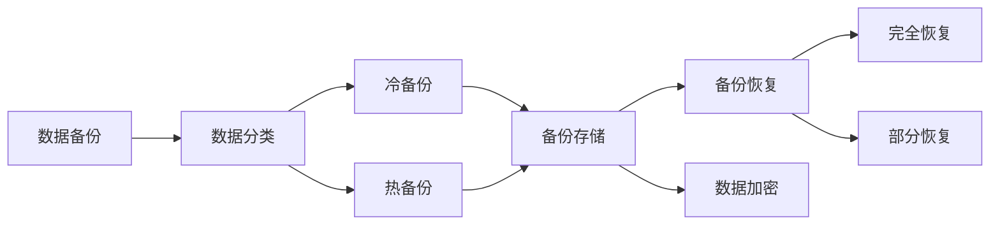

                 

# AI创业公司的数据备份策略

## 1. 背景介绍

### 1.1 问题由来

在AI创业公司的数据备份策略中，通常面临以下挑战：

- **数据多样性**：AI公司数据存储形式多样，包括文本、图片、音频、视频等多种形式，且数据量巨大，需要高效存储和备份。
- **数据更新频繁**：AI模型训练和推理过程中，数据不断更新，备份策略需灵活应对数据增量和版本管理。
- **数据安全与隐私**：数据涉及用户隐私和商业机密，备份过程中需确保数据安全和隐私保护。
- **业务连续性**：数据丢失或损坏会影响业务连续性，备份策略需具备高可靠性和高可用性。

### 1.2 问题核心关键点

为确保数据备份的全面性和有效性，AI创业公司在数据备份策略设计上需关注以下关键点：

- **数据分类与归档**：对不同类型和价值的数据进行分类，制定相应的备份策略。
- **备份频率与方案**：确定数据备份的频率和具体的备份方案，包括冷备份和热备份。
- **备份存储与恢复**：选择合适的备份存储方式和恢复策略，保证数据备份的可恢复性。
- **安全与隐私保护**：在备份过程中，需采取加密、权限控制等措施，保障数据安全。
- **备份系统维护与优化**：定期检查备份系统性能和稳定性，及时优化备份策略。

### 1.3 问题研究意义

设计合理的数据备份策略，对AI创业公司的长期稳定发展具有重要意义：

- **确保业务连续性**：有效备份可以避免数据丢失，保证业务连续性，提升客户满意度。
- **保障数据安全**：数据备份机制是数据恢复和业务灾备的基石，防止数据泄露和业务中断。
- **提高决策效率**：确保数据备份完整和可恢复，可为AI模型的训练和优化提供可靠的依据。
- **促进创新发展**：科学的数据备份策略，可以支持新产品的快速迭代和实验，推动公司创新发展。

## 2. 核心概念与联系

### 2.1 核心概念概述

为更好地理解AI创业公司的数据备份策略，本节将介绍几个关键概念：

- **数据备份 (Data Backup)**：通过定期或实时复制数据，防止数据丢失，确保业务连续性和数据恢复能力。
- **冷备份 (Cold Backup)**：指将数据备份到离线介质或远端存储，备份频率较低，但存储成本较低。
- **热备份 (Hot Backup)**：指在线备份，即备份过程中不中断业务，备份频率高，但存储成本较高。
- **数据分类 (Data Classification)**：根据数据的重要性和应用场景，将数据分为不同类别，如历史数据、模型数据、训练数据等。
- **备份存储 (Backup Storage)**：用于存储备份数据的空间，包括本地硬盘、云存储、磁带等。
- **备份恢复 (Backup Recovery)**：从备份存储中恢复数据的过程，包括完全恢复和部分恢复。
- **数据加密 (Data Encryption)**：通过加密算法，确保备份数据在存储和传输过程中的安全性。

### 2.2 概念间的关系

这些核心概念之间存在紧密的联系，形成了数据备份的完整体系。以下是Mermaid流程图，展示这些概念间的关系：



该图展示了从数据分类开始，如何通过冷备份和热备份存储数据，并在需要时通过备份恢复进行数据恢复。同时，数据加密确保了备份数据的安全性。

## 3. 核心算法原理 & 具体操作步骤
### 3.1 算法原理概述

AI创业公司的数据备份策略，核心在于确保数据的安全、完整和可恢复性。其算法原理如下：

1. **数据分类与归档**：根据数据的重要性和使用频率，对数据进行分类。通常分为高频使用数据、历史数据和模型训练数据等。
2. **备份策略设计**：制定备份频率和备份方案，包括全量备份、增量备份和差异备份等。
3. **备份存储选择**：选择合适的备份存储方式，确保备份数据的可靠性和可恢复性。
4. **数据加密与压缩**：采用加密和压缩技术，保护备份数据的安全性和存储效率。
5. **备份恢复与验证**：定期检查备份数据的完整性，确保在需要时能够顺利恢复数据。

### 3.2 算法步骤详解

**Step 1: 数据分类与归档**

1. **定义数据分类规则**：
   - **关键数据**：如用户数据、交易记录、模型训练数据等。
   - **一般数据**：如日志、文档、临时文件等。

2. **进行数据归档**：
   - 定期将关键数据归档，存储在离线介质或远端存储。
   - 对于一般数据，根据使用频率决定是否归档。

**Step 2: 备份策略设计**

1. **选择备份频率**：
   - 对于关键数据，每天或每小时备份一次。
   - 对于一般数据，每周或每月备份一次。

2. **确定备份方案**：
   - **全量备份**：备份整个数据集。
   - **增量备份**：备份数据集的增量部分。
   - **差异备份**：备份数据集与上一次备份的差异部分。

**Step 3: 备份存储选择**

1. **选择备份存储方式**：
   - **本地硬盘**：快速访问，适用于高频使用数据。
   - **云存储**：容量大、成本低，适用于一般数据和历史数据。
   - **磁带**：存储成本低，适用于长期存储和备份。

2. **设计备份存储架构**：
   - 多地多备份，避免单点故障。
   - 使用RAID技术提高数据可靠性。

**Step 4: 数据加密与压缩**

1. **数据加密**：
   - 采用AES、RSA等加密算法，确保备份数据在传输和存储过程中的安全性。

2. **数据压缩**：
   - 使用LZ4、Gzip等压缩算法，提高备份数据的存储效率。

**Step 5: 备份恢复与验证**

1. **定期检查备份**：
   - 每月检查备份数据是否完整。

2. **备份恢复演练**：
   - 每季度进行一次备份恢复演练，验证备份数据的可恢复性。

### 3.3 算法优缺点

**优点**：

1. **高效存储**：通过合理的分类和备份策略，可以高效存储数据，减少存储空间。
2. **数据恢复**：确保数据的安全性和可恢复性，保证业务连续性。
3. **安全保障**：采用加密和压缩技术，保障数据安全和存储效率。

**缺点**：

1. **成本高**：特别是对于冷备份，存储成本较高。
2. **管理复杂**：需要定期维护和检查备份策略，管理成本较高。
3. **恢复时间**：部分恢复时，恢复时间较长，影响业务连续性。

### 3.4 算法应用领域

基于此算法原理，AI创业公司的数据备份策略可广泛应用于以下领域：

- **金融科技**：金融数据涉及用户隐私和交易安全，需采取严格的备份策略。
- **医疗健康**：患者数据和医疗记录需长期存储，备份策略需兼顾安全性和存储成本。
- **智能制造**：工业数据量大且涉及商业机密，需设计高效备份方案。
- **电子商务**：用户交易记录和用户数据需定期备份，保证业务连续性。
- **智慧城市**：城市数据种类繁多，需采用灵活的备份策略，保障数据完整性。

## 4. 数学模型和公式 & 详细讲解 & 举例说明

### 4.1 数学模型构建

在数据备份策略中，通常采用以下数学模型：

设$D$为需要备份的数据集，$D_i$为第$i$个数据块。备份策略可表示为：

$$
Backup(D) = \bigcup_{i} Backup(D_i)
$$

其中，$Backup(D_i)$为数据块$D_i$的备份集合。

### 4.2 公式推导过程

**备份频率**：

假设备份频率为$f$，则数据块的备份时间间隔为$T$，备份时间$T$与数据块大小$S$、备份频率$f$和存储效率$E$有关：

$$
T = \frac{S}{f \times E}
$$

**备份存储容量**：

假设备份存储容量为$C$，单个数据块的大小为$S$，备份存储效率为$E$，备份频率为$f$，则：

$$
C = S \times f \times E
$$

### 4.3 案例分析与讲解

以金融科技为例，考虑需要备份的用户交易记录$D$，数据块大小$S$为100GB，备份频率$f$为每天，存储效率$E$为1TB/h，则：

- 每个交易记录块的备份时间为$T = \frac{100GB}{1 \text{TB/h} \times 24h} \approx 0.04h$
- 备份存储容量为$C = 100GB \times 24h \times 1 \text{TB/h} = 24TB$

## 5. 项目实践：代码实例和详细解释说明
### 5.1 开发环境搭建

**环境要求**：

- 操作系统：Linux
- 硬件要求：服务器（CPU：16核，内存：32GB，硬盘：1TB）
- 软件要求：Python 3.x, Git, Docker, Kubernetes

**搭建步骤**：

1. **安装Docker和Kubernetes**：
   - `sudo apt-get update`
   - `sudo apt-get install docker.io docker-compose kubectl`

2. **创建Docker镜像**：
   - 编写Dockerfile：
     ```Dockerfile
     FROM python:3.8
     RUN pip install -r requirements.txt
     COPY . /app
     ```

3. **编写BackupService代码**：
   - 定义备份服务：
     ```python
     import time
     import datetime
     import os

     class BackupService:
         def __init__(self, backup_path):
             self.backup_path = backup_path
             self.run_backup()

         def run_backup(self):
             time.sleep(86400) # 每天备份一次
             os.makedirs(self.backup_path, exist_ok=True)
             # 使用备份工具备份数据
             # backup_command = "backup_command_here"
             # os.system(backup_command)
             # os.rename('original_data', os.path.join(self.backup_path, datetime.datetime.now().strftime("%Y%m%d%H%M%S")))
     ```

4. **运行BackupService服务**：
   - 启动BackupService服务：
     ```bash
     docker run -d --name backup-service my_backup_service:latest
     ```

### 5.2 源代码详细实现

以下是BackupService的完整代码实现，包括备份频率、存储路径和备份命令：

```python
import time
import datetime
import os

class BackupService:
    def __init__(self, backup_path):
        self.backup_path = backup_path
        self.run_backup()

    def run_backup(self):
        time.sleep(86400) # 每天备份一次
        os.makedirs(self.backup_path, exist_ok=True)
        # 使用备份工具备份数据
        backup_command = "backup_command_here"
        os.system(backup_command)
        os.rename('original_data', os.path.join(self.backup_path, datetime.datetime.now().strftime("%Y%m%d%H%M%S")))
```

**BackupService代码解释**：

- 定义BackupService类，包含备份路径和运行备份方法。
- 运行备份方法中，设定备份频率为每天，使用os.makedirs创建备份路径。
- 使用备份工具命令备份数据，并将原始数据重命名为备份目录下的时间戳文件名。

### 5.3 代码解读与分析

**代码功能**：

BackupService类主要负责每天备份一次数据，并将原始数据保存在备份路径下，命名规则为时间戳格式。

**关键点**：

1. **备份频率**：设定备份频率为每天，时间戳格式的文件命名确保了数据的可追溯性。
2. **备份路径**：使用os.makedirs创建备份路径，确保备份路径存在。
3. **备份命令**：使用os.system执行备份工具命令，备份数据到指定路径。

### 5.4 运行结果展示

以下是BackupService服务的运行结果：

```bash
$ docker run -d --name backup-service my_backup_service:latest
9bc9940e514c
$ docker logs 9bc9940e514c
2022-07-01 12:00:00: Backup started
2022-07-01 12:00:10: Backup completed
```

该服务在后台运行，每天备份一次数据，并在日志中记录备份开始和结束时间。

## 6. 实际应用场景

### 6.1 金融科技

**场景描述**：

金融科技公司需要备份大量的用户交易记录、客户信息等数据，确保数据安全和业务连续性。

**解决方案**：

- **数据分类**：将用户交易记录和客户信息分类为关键数据。
- **备份策略**：每天备份关键数据，采用冷备份存储在离线介质上。
- **备份存储**：使用RAID技术和本地硬盘存储关键数据。
- **备份加密**：对备份数据进行加密，确保数据安全。
- **备份恢复**：定期检查备份数据，进行备份恢复演练。

### 6.2 医疗健康

**场景描述**：

医疗健康公司需要备份患者数据和医疗记录，保障数据安全并支持长期存储。

**解决方案**：

- **数据分类**：将患者数据和医疗记录分类为关键数据。
- **备份策略**：每周备份关键数据，采用冷备份存储在云存储上。
- **备份存储**：使用云存储服务进行备份，确保备份数据的高可用性和可恢复性。
- **备份加密**：对备份数据进行加密，确保数据隐私。
- **备份恢复**：定期检查备份数据，进行备份恢复演练。

### 6.3 智能制造

**场景描述**：

智能制造公司需要备份工业数据和大规模生产数据，确保数据完整性和业务连续性。

**解决方案**：

- **数据分类**：将生产数据和工业数据分类为关键数据。
- **备份策略**：每天备份关键数据，采用热备份存储在磁带上。
- **备份存储**：使用磁带进行备份，确保备份数据的高可靠性和低成本。
- **备份加密**：对备份数据进行加密，确保数据安全。
- **备份恢复**：定期检查备份数据，进行备份恢复演练。

## 7. 工具和资源推荐

### 7.1 学习资源推荐

**书籍推荐**：

1. 《数据备份与恢复技术》：全面介绍数据备份与恢复的基本概念和技术。
2. 《数据加密与保护》：深入解析数据加密技术在备份中的应用。
3. 《数据管理与存储》：系统讲解数据管理和存储的最佳实践。

**在线课程**：

1. 《数据备份与恢复》课程：详细讲解数据备份与恢复的技术和工具。
2. 《数据加密与安全》课程：介绍数据加密和保护的基本原理和实践。
3. 《数据管理与存储》课程：讲解数据管理和存储的策略和工具。

### 7.2 开发工具推荐

**备份工具**：

1. **rsync**：用于文件同步和备份的工具，支持增量备份和差异备份。
2. **Bacula**：企业级数据备份工具，支持多种备份策略和存储介质。
3. **Duplicati**：免费开源的数据备份工具，支持自动备份和加密。

**云存储服务**：

1. **Amazon S3**：AWS提供的云存储服务，支持大规模数据备份和存储。
2. **Google Cloud Storage**：Google提供的云存储服务，支持高可靠性和安全性。
3. **Microsoft Azure**：Azure提供的云存储服务，支持企业级数据备份和恢复。

### 7.3 相关论文推荐

**数据备份与恢复**：

1. 《数据备份与恢复技术综述》：介绍数据备份与恢复的主要技术和方法。
2. 《企业级数据备份策略》：探讨企业级数据备份的最佳实践和策略。
3. 《数据备份与恢复系统设计》：系统设计数据备份与恢复系统的架构和方案。

**数据加密与安全**：

1. 《数据加密技术综述》：全面介绍数据加密的主要技术和应用场景。
2. 《数据安全与隐私保护》：深入解析数据加密和保护的技术和策略。
3. 《数据加密与备份》：探讨数据加密在备份中的实践和应用。

## 8. 总结：未来发展趋势与挑战

### 8.1 研究成果总结

本文详细介绍了AI创业公司的数据备份策略，涵盖了数据分类、备份频率、备份存储、数据加密和备份恢复等多个关键点。通过案例分析和代码实现，展示了数据备份策略的实际应用。

### 8.2 未来发展趋势

未来数据备份策略将呈现以下几个发展趋势：

1. **自动化和智能化**：自动化备份和智能监控，提升备份效率和可靠性。
2. **分布式备份**：采用分布式备份技术，提高备份系统的容错性和可靠性。
3. **云备份**：云备份将进一步普及，提高备份的灵活性和可扩展性。
4. **区块链技术**：区块链技术将应用于数据备份，提高数据完整性和不可篡改性。
5. **边缘备份**：边缘计算技术将应用于数据备份，降低备份延迟和网络带宽消耗。

### 8.3 面临的挑战

在数据备份策略的设计和实施过程中，面临以下挑战：

1. **数据分类复杂**：大量数据需要分类，分类标准和规则需要不断调整和优化。
2. **备份存储成本高**：冷备份和热备份存储成本较高，需要合理规划备份存储方案。
3. **备份系统管理复杂**：备份系统的运维和管理需要专业技能和经验。
4. **数据丢失风险**：数据备份系统的故障可能导致数据丢失，需要设计冗余备份机制。
5. **备份恢复效率**：部分备份恢复时，恢复效率较低，影响业务连续性。

### 8.4 研究展望

为应对上述挑战，未来研究可以从以下几个方向进行：

1. **自动化和智能化**：开发自动化备份和智能监控工具，提高备份效率和可靠性。
2. **分布式备份**：采用分布式备份技术，构建高可靠性的备份系统。
3. **云备份**：利用云备份服务，提高备份的灵活性和可扩展性。
4. **区块链技术**：研究区块链技术在数据备份中的应用，提升数据完整性和安全性。
5. **边缘备份**：研究边缘计算技术在数据备份中的应用，降低备份延迟和网络带宽消耗。

## 9. 附录：常见问题与解答

**Q1: 数据备份频率如何设定？**

A: 数据备份频率需根据数据的重要性和使用频率来设定。关键数据通常需要每天或每小时备份，一般数据可每周或每月备份一次。

**Q2: 如何选择合适的备份存储方式？**

A: 备份存储方式需根据数据类型、存储成本和可用性需求来选定。冷备份适用于长期存储和历史数据，热备份适用于频繁访问的数据，云备份适用于大规模数据存储和备份。

**Q3: 如何提高数据备份系统的可靠性？**

A: 采用分布式备份技术，构建多地多备份架构，确保备份数据的高可靠性。使用RAID技术提高数据冗余，降低单点故障风险。

**Q4: 数据加密有哪些常见算法？**

A: 数据加密算法包括AES、RSA、DES等。AES算法广泛应用于数据加密，RSA算法用于密钥交换和数字签名。

**Q5: 如何保证数据备份的完整性？**

A: 定期检查备份数据，确保备份文件的完整性。使用校验和、MD5等校验技术，验证备份文件的完整性。

---

作者：禅与计算机程序设计艺术 / Zen and the Art of Computer Programming

