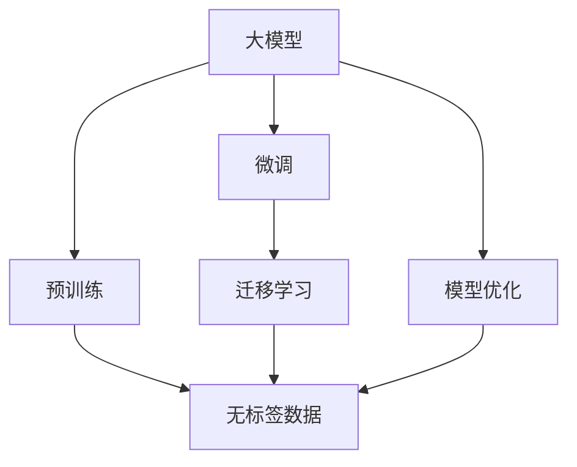

                 

# AI大模型创业：如何抓住未来机遇？

## 1. 背景介绍

### 1.1 问题由来

随着人工智能技术的不断进步，大模型（如GPT-3、BERT等）已经在自然语言处理（NLP）、计算机视觉（CV）等领域取得了显著的突破。这些大模型通过大规模无监督学习，学习了通用的知识表示，具备强大的自适应能力，已经在包括文本生成、翻译、问答系统等多个任务上表现优异。

大模型的发展不仅极大地提升了模型的性能，也催生了众多的创业机会。对于希望在AI领域创业的人来说，了解大模型的发展趋势、应用场景以及如何利用这些技术进行商业化，成为至关重要的一课。

### 1.2 问题核心关键点

大模型创业的核心在于：
1. **理解大模型的技术原理和应用场景**：掌握大模型的工作机制、优点和缺点，以及如何在具体业务场景中进行优化。
2. **掌握大模型的商业化策略**：了解如何将大模型技术转化为商业产品或服务，如何实现盈利和增长。
3. **关注大模型的最新进展**：持续关注大模型的最新研究进展，及时调整创业方向。

### 1.3 问题研究意义

对于AI领域的创业者而言，掌握大模型技术不仅能够提高公司的技术竞争力，还能在激烈的市场竞争中占据先机。了解大模型创业的基本路径，可以加速创业进程，降低失败风险，提升公司的市场竞争力。

## 2. 核心概念与联系

### 2.1 核心概念概述

在AI大模型创业过程中，涉及的关键概念包括：

- **大模型（Large Model）**：指的是具有大规模参数量、高性能的深度学习模型，能够在大规模数据上训练，具备强大的学习能力和泛化能力。
- **预训练（Pre-training）**：指在大规模无标签数据上训练模型，学习通用的知识表示。
- **微调（Fine-tuning）**：指在大模型基础上，通过特定任务的数据进行有监督的训练，使得模型在该任务上表现更好。
- **迁移学习（Transfer Learning）**：指在预训练的基础上，通过微调等方法将知识迁移到新任务上。
- **模型优化（Model Optimization）**：指在模型训练和推理过程中，采用各种技术手段提高模型的性能和效率。

这些概念之间存在着紧密的联系，形成一个完整的AI大模型生态系统。

### 2.2 核心概念间的关系

以下是一个Mermaid流程图，展示了大模型生态系统中各个核心概念之间的关系：



这个流程图展示了从预训练到大模型微调，再到迁移学习，最终通过模型优化实现商业化的过程。

## 3. 核心算法原理 & 具体操作步骤

### 3.1 算法原理概述

大模型的商业化主要依赖于微调和迁移学习等技术手段。通过在大规模无标签数据上预训练，模型学习到通用的知识表示。在特定任务的数据上微调，将通用知识迁移到特定任务上，从而实现商业化。

具体来说，微调过程如下：
1. 准备预训练模型和大规模标注数据。
2. 设计任务特定的输出层和损失函数。
3. 设置合适的超参数，如学习率、批大小等。
4. 在特定任务的数据上执行梯度训练，更新模型参数。
5. 评估模型在测试集上的性能。

### 3.2 算法步骤详解

以下是一个详细的微调步骤：

1. **数据准备**：
   - 收集预训练数据和特定任务的数据集。
   - 对数据进行预处理，如分词、标注等。

2. **模型选择**：
   - 选择适合的预训练模型，如BERT、GPT等。
   - 根据需要，决定是否冻结部分预训练参数。

3. **任务适配层设计**：
   - 设计任务特定的输出层，如线性分类器、解码器等。
   - 确定损失函数，如交叉熵、均方误差等。

4. **超参数设置**：
   - 选择合适的优化器，如AdamW、SGD等。
   - 设置学习率、批大小、迭代轮数等。
   - 设置正则化技术，如L2正则、Dropout等。

5. **模型训练**：
   - 使用优化器更新模型参数。
   - 在验证集上评估模型性能。
   - 根据评估结果调整超参数。

6. **模型评估**：
   - 在测试集上评估模型性能。
   - 对比微调前后的性能变化。

### 3.3 算法优缺点

大模型微调具有以下优点：
- **高效**：在少量标注数据上即可实现高效的模型优化。
- **灵活**：能够快速适应新的任务和数据。

但同时也有缺点：
- **数据依赖**：依赖标注数据，数据质量影响模型效果。
- **泛化能力有限**：在小规模数据上训练，模型泛化能力可能不足。
- **可解释性差**：黑盒模型，难以解释模型决策过程。

### 3.4 算法应用领域

大模型微调已经在文本分类、命名实体识别、问答系统、翻译等多个领域得到了广泛应用。以下是一些具体的应用场景：

1. **文本分类**：如情感分析、主题分类等。
2. **命名实体识别**：如识别文本中的人名、地名等。
3. **问答系统**：回答用户提出的问题。
4. **机器翻译**：将源语言翻译成目标语言。
5. **文本摘要**：将长文本压缩成简短摘要。

## 4. 数学模型和公式 & 详细讲解

### 4.1 数学模型构建

大模型微调的数学模型可以表示为：
- 输入：$x$，表示输入文本。
- 输出：$y$，表示任务标签。
- 损失函数：$\mathcal{L}$，表示模型的预测输出与真实标签之间的差距。
- 模型参数：$\theta$，表示模型的权重。

### 4.2 公式推导过程

以二分类任务为例，微调的损失函数可以表示为：
$$
\mathcal{L}(\theta) = -\frac{1}{N}\sum_{i=1}^N [y_i\log \hat{y}_i+(1-y_i)\log(1-\hat{y}_i)]
$$

其中，$\hat{y}_i$ 表示模型在输入 $x_i$ 上的预测结果。

### 4.3 案例分析与讲解

假设我们要对BERT模型进行微调，用于文本分类任务。具体步骤如下：
1. 准备训练集和测试集。
2. 使用BERT模型作为初始化参数，设计输出层和损失函数。
3. 设置学习率为1e-5，使用AdamW优化器。
4. 执行梯度训练，更新模型参数。
5. 在验证集上评估模型性能。

## 5. 项目实践：代码实例和详细解释说明

### 5.1 开发环境搭建

要开始大模型的微调实践，需要先准备好开发环境。以下是Python和PyTorch的配置步骤：

1. 安装Anaconda，创建虚拟环境。
2. 安装PyTorch、Transformers库。
3. 安装必要的工具包，如numpy、pandas等。

### 5.2 源代码详细实现

以下是一个简单的代码实例：

```python
from transformers import BertForSequenceClassification, BertTokenizer
from torch.utils.data import Dataset, DataLoader
from torch.nn import CrossEntropyLoss
from torch.optim import AdamW

class MyDataset(Dataset):
    def __init__(self, texts, labels):
        self.tokenizer = BertTokenizer.from_pretrained('bert-base-uncased')
        self.texts = texts
        self.labels = labels

    def __len__(self):
        return len(self.texts)

    def __getitem__(self, index):
        text = self.texts[index]
        label = self.labels[index]
        encoding = self.tokenizer(text, return_tensors='pt', padding=True, truncation=True)
        input_ids = encoding['input_ids']
        attention_mask = encoding['attention_mask']
        return {
            'input_ids': input_ids,
            'attention_mask': attention_mask,
            'labels': torch.tensor(label, dtype=torch.long)
        }

# 加载数据
train_dataset = MyDataset(train_texts, train_labels)
val_dataset = MyDataset(val_texts, val_labels)
test_dataset = MyDataset(test_texts, test_labels)

# 模型和优化器设置
model = BertForSequenceClassification.from_pretrained('bert-base-uncased', num_labels=num_labels)
optimizer = AdamW(model.parameters(), lr=1e-5)

# 训练过程
for epoch in range(num_epochs):
    model.train()
    total_loss = 0
    for batch in DataLoader(train_dataset, batch_size=batch_size):
        input_ids = batch['input_ids'].to(device)
        attention_mask = batch['attention_mask'].to(device)
        labels = batch['labels'].to(device)
        model.zero_grad()
        outputs = model(input_ids, attention_mask=attention_mask, labels=labels)
        loss = CrossEntropyLoss()(outputs.logits, labels)
        total_loss += loss.item()
        loss.backward()
        optimizer.step()
    print(f"Epoch {epoch+1}, train loss: {total_loss/len(train_dataset)}")

# 评估模型
model.eval()
total_correct = 0
total_labels = 0
for batch in DataLoader(val_dataset, batch_size=batch_size):
    input_ids = batch['input_ids'].to(device)
    attention_mask = batch['attention_mask'].to(device)
    labels = batch['labels'].to(device)
    outputs = model(input_ids, attention_mask=attention_mask)
    predictions = torch.argmax(outputs.logits, dim=1)
    total_correct += (predictions == labels).sum().item()
    total_labels += labels.size(0)
print(f"Validation accuracy: {total_correct/total_labels}")
```

### 5.3 代码解读与分析

- `MyDataset`类：用于数据预处理，将文本转换为模型的输入格式。
- 模型和优化器设置：选择合适的预训练模型和优化器。
- 训练过程：使用PyTorch的DataLoader进行数据批次化加载，执行梯度训练。
- 模型评估：在验证集上评估模型性能。

## 6. 实际应用场景

### 6.1 智能客服系统

智能客服系统可以通过微调大模型，实现自动回答用户咨询，提升客户满意度。具体步骤如下：
1. 收集历史客服数据，构建监督数据集。
2. 使用BERT模型进行微调，学习客服对话的语义表示。
3. 将微调后的模型集成到智能客服平台，自动回答用户咨询。

### 6.2 金融舆情监测

金融舆情监测可以通过微调大模型，实时监测网络舆情，及时预警风险。具体步骤如下：
1. 收集金融新闻、评论等文本数据。
2. 使用BERT模型进行微调，学习金融文本的情感和主题表示。
3. 实时监测网络舆情，评估舆情情绪，及时预警风险。

### 6.3 个性化推荐系统

个性化推荐系统可以通过微调大模型，实现推荐内容的个性化。具体步骤如下：
1. 收集用户浏览、购买等行为数据。
2. 使用BERT模型进行微调，学习用户行为与商品之间的关联。
3. 根据用户行为预测其感兴趣的商品，实现个性化推荐。

### 6.4 未来应用展望

未来，大模型微调技术将会在更多的领域得到应用，带来更广泛的影响。例如：
- **智慧医疗**：通过微调大模型，实现疾病诊断、药物研发等医疗应用。
- **智能教育**：通过微调大模型，实现智能作业批改、个性化教学等教育应用。
- **智慧城市**：通过微调大模型，实现城市事件监测、应急指挥等城市治理应用。

## 7. 工具和资源推荐

### 7.1 学习资源推荐

- **《深度学习》课程**：斯坦福大学深度学习课程，涵盖深度学习的基本概念和实践。
- **《TensorFlow官方文档》**：TensorFlow官方文档，提供完整的API和实例代码。
- **《PyTorch官方文档》**：PyTorch官方文档，提供完整的API和实例代码。
- **Kaggle**：Kaggle数据科学竞赛平台，提供大量真实世界的数据集和比赛。

### 7.2 开发工具推荐

- **Anaconda**：Python的虚拟环境管理工具。
- **Jupyter Notebook**：Jupyter Notebook是一个交互式的数据科学平台。
- **GitHub**：GitHub代码托管平台，提供代码版本控制和协作开发。

### 7.3 相关论文推荐

- **Attention is All You Need**：Transformer模型的论文，奠定了现代大模型的基础。
- **BERT: Pre-training of Deep Bidirectional Transformers for Language Understanding**：BERT模型的论文，展示了预训练语言模型的力量。
- **Parameter-Efficient Transfer Learning for NLP**：研究了参数高效微调方法，降低了微调成本。

## 8. 总结：未来发展趋势与挑战

### 8.1 总结

大模型微调技术在AI创业中具有重要意义。通过微调，我们可以将通用大模型的知识迁移到特定任务上，提升模型的性能和泛化能力。掌握大模型微调技术，能够加速AI创业进程，提升创业成功率。

### 8.2 未来发展趋势

未来，大模型微调技术将会持续发展，带来更多的商业化机会。例如：
- **预训练模型的多样化**：更多的预训练模型将涌现，涵盖不同的领域和任务。
- **微调技术的智能化**：引入更多的智能算法，如因果推断、强化学习等，提升微调效果。
- **跨模态微调**：将文本、图像、语音等多种模态数据进行协同微调，实现更全面、精准的模型。

### 8.3 面临的挑战

大模型微调技术在发展过程中，也面临一些挑战：
- **数据质量**：数据质量直接影响微调效果，数据标注成本较高。
- **模型泛化能力**：小规模数据上的微调，模型泛化能力有限。
- **模型可解释性**：黑盒模型，难以解释模型的决策过程。
- **资源消耗**：大模型微调需要大量计算资源，资源消耗较大。

### 8.4 研究展望

未来，大模型微调技术需要在以下几个方面进行进一步研究：
- **数据增强**：使用数据增强技术，提升小规模数据的微调效果。
- **对抗训练**：引入对抗训练技术，提高模型鲁棒性。
- **参数优化**：研究参数高效微调方法，降低微调成本。
- **跨模态微调**：将不同模态的数据进行协同微调，实现更全面的知识表示。

## 9. 附录：常见问题与解答

**Q1: 如何选择合适的预训练模型？**

A: 根据任务类型选择合适的预训练模型。例如，文本分类任务可以选择BERT、GPT等模型。

**Q2: 如何设计任务适配层？**

A: 根据任务类型，设计合适的输出层和损失函数。例如，文本分类任务可以使用线性分类器和交叉熵损失函数。

**Q3: 如何避免过拟合？**

A: 使用正则化技术，如L2正则、Dropout等。设置合适的学习率和批大小。

**Q4: 如何评估模型性能？**

A: 在测试集上使用常见的评估指标，如准确率、召回率、F1分数等。

**Q5: 如何实现实时推理？**

A: 使用模型压缩、量化等技术，降低模型的计算资源消耗。使用模型部署工具，如TensorFlow Serving、Farenda等，实现实时推理。

