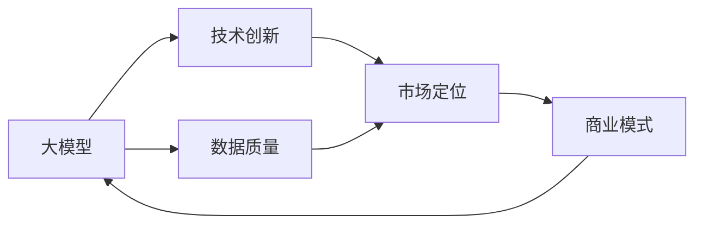

                 

# AI大模型创业：挑战与机遇并存的分析

## 1. 背景介绍

### 1.1 问题由来
随着人工智能技术的发展，特别是深度学习和大数据技术的应用，大模型（Large Models）正在逐渐成为各行各业的核心竞争力。从自然语言处理（NLP）到计算机视觉（CV），再到语音识别（ASR），大模型的广泛应用正深刻改变着人们的生活和工作方式。与此同时，大模型创业也成为了一个热门话题，吸引了众多创业者和投资者的关注。

### 1.2 问题核心关键点
大模型创业的成功与否，取决于模型本身的质量、数据资源的获取、技术团队的专业性、市场定位的精准性等多个因素。其中，模型的泛化能力、数据的质量和多样性、算法的创新性、团队的经验和执行力以及市场的认可度是创业成功的关键。

### 1.3 问题研究意义
探讨大模型创业的挑战与机遇，不仅有助于创业者了解行业的现状和未来趋势，也能为投资者提供更加客观、全面的决策依据。通过分析大模型创业过程中的关键问题和成功案例，可以为业内人士提供参考和借鉴，共同推动人工智能技术的进步和应用落地。

## 2. 核心概念与联系

### 2.1 核心概念概述

为更好地理解大模型创业的挑战与机遇，本节将介绍几个关键概念及其联系：

- **大模型（Large Models）**：指使用深度学习技术训练出的具有大规模参数量的模型，如BERT、GPT-3等。大模型通过在大规模数据上训练，可以学习到丰富的知识，具有强大的泛化能力。

- **创业（Entrepreneurship）**：指个体或团队利用自己的创新理念和技术，创立新企业、开发新产品、探索新市场的活动。大模型创业特指使用大模型技术开发人工智能应用，开拓新业务方向的过程。

- **泛化能力（Generalization）**：指模型在不同数据集上表现稳定、一致的能力。泛化能力强的大模型能够更好地适应实际应用场景，解决真实问题。

- **数据质量（Data Quality）**：指数据集的真实性、完整性、多样性和更新频率。高质量的数据是训练优质大模型的基础。

- **技术创新（Technological Innovation）**：指对现有技术的改进和创新，以提高模型的性能和效率。技术创新是大模型创业的核心驱动力之一。

- **市场定位（Market Segmentation）**：指创业者需要明确自己的目标市场和用户群体，提供符合市场需求的产品和服务。

- **商业模式（Business Model）**：指企业如何创造价值、传递价值和获取价值的方式。大模型创业需结合技术优势和市场需求，设计合理的商业模式。

这些核心概念之间的联系可以概括为：大模型创业的本质是在技术创新基础上，利用优质数据和精准的市场定位，提供能够满足用户需求的产品和服务，最终实现商业价值的创造和传递。

### 2.2 概念间的关系

这些核心概念之间的关系可以通过以下Mermaid流程图来展示：



这个流程图展示了大模型创业的关键流程：首先通过技术创新训练出具有优质泛化能力的大模型；然后通过高质量数据对其进行微调或训练；接着结合市场定位，开发出符合市场需求的产品；最后通过合理的商业模式实现商业价值。

## 3. 核心算法原理 & 具体操作步骤
### 3.1 算法原理概述

大模型创业的核心在于利用深度学习技术，训练出具有高泛化能力的大模型，并利用这些模型解决实际问题。核心算法原理主要包括：

1. **自监督预训练**：在大规模无标签数据上训练大模型，使其学习到语言的普遍规律和知识表示。常见的自监督任务有 masked language modeling（MLM）、next sentence prediction（NSP）等。

2. **有监督微调**：在大规模标注数据集上对预训练模型进行微调，使其能够解决特定任务。例如，BERT和GPT系列模型通过在大规模语料库上预训练后，再在NLP任务上微调，取得了显著的效果。

3. **迁移学习**：利用大模型在不同任务之间的知识迁移，减少对数据的需求，提高模型泛化能力。

4. **参数高效微调（PEFT）**：通过只更新部分参数，减少计算资源消耗，提高模型训练效率。PEFT方法如Adapter和LoRA在实践中得到了广泛应用。

5. **提示学习**：通过精心设计输入文本的格式，引导模型按照期望的方式输出，实现零样本或少样本学习。

这些核心算法原理是大模型创业的基础，通过合理应用这些算法，可以高效开发出高质量的人工智能应用。

### 3.2 算法步骤详解

大模型创业的具体操作步骤可以分为以下几个步骤：

1. **数据准备**：收集和清洗高质量的数据，确保数据的真实性、多样性和更新频率。数据可以来源于公开数据集、第三方API、用户生成内容等。

2. **模型选择与训练**：根据任务需求选择合适的预训练模型，如BERT、GPT-3等。使用大规模无标签数据对其进行预训练，并根据任务需求在标注数据集上进行微调或训练。

3. **模型评估与优化**：使用测试集对模型进行评估，根据评估结果对模型进行优化，如调整超参数、加入正则化技术等。

4. **部署与迭代**：将优化后的模型部署到实际应用场景中，收集用户反馈，不断迭代模型和算法，提升用户体验和系统性能。

5. **商业化与推广**：根据市场定位，设计合理的商业模式，通过市场营销手段推广产品，实现商业价值的最大化。

### 3.3 算法优缺点

大模型创业具有以下优点：

- **技术领先**：利用最新的深度学习技术，训练出具有高泛化能力的大模型，能够解决复杂问题。
- **应用广泛**：大模型在自然语言处理、计算机视觉、语音识别等领域具有广泛的应用前景，市场潜力巨大。
- **高投资回报**：大模型创业通常需要较大的初期投资，但通过优质产品和良好的商业模式，能够获得较高的投资回报。

然而，大模型创业也面临以下挑战：

- **数据成本高**：高质量数据的获取和标注成本较高，尤其是在特定领域，数据获取难度大。
- **技术门槛高**：深度学习和大模型训练需要丰富的专业知识和技术储备，创业团队需要具备较强的技术实力。
- **市场竞争激烈**：人工智能领域创业公司众多，竞争激烈，需要不断创新才能在市场中占据一席之地。
- **商业模式复杂**：大模型创业需要平衡技术创新和市场定位，设计合理的商业模式，实现商业价值的最大化。

### 3.4 算法应用领域

大模型创业的应用领域非常广泛，涵盖了以下几个方面：

- **自然语言处理（NLP）**：包括文本分类、情感分析、机器翻译、对话系统等。
- **计算机视觉（CV）**：包括图像识别、目标检测、图像生成等。
- **语音识别（ASR）**：包括语音转文本、语音合成等。
- **推荐系统**：基于用户行为和兴趣进行个性化推荐。
- **智能客服**：利用大模型构建智能客服系统，提升客户体验。
- **医疗健康**：利用大模型进行病历分析、药物研发等。

## 4. 数学模型和公式 & 详细讲解 & 举例说明（备注：数学公式请使用latex格式，latex嵌入文中独立段落使用 $$，段落内使用 $)
### 4.1 数学模型构建

假设我们有一项任务是情感分析，给定一段文本 $x$，模型需要输出其情感倾向 $y$。可以使用大模型 $M_{\theta}$ 进行情感分析，其中 $\theta$ 为模型的参数。

首先，在无标签数据上进行自监督预训练，模型学习语言的普遍规律和知识表示。预训练模型的目标函数为：

$$
L_{pre-train} = \frac{1}{N}\sum_{i=1}^N L(x_i, M_{\theta}(x_i))
$$

其中，$N$ 为训练样本数，$L(x_i, M_{\theta}(x_i))$ 为预训练损失函数。

接着，在标注数据上进行有监督微调，模型学习特定任务的知识。微调的目标函数为：

$$
L_{fine-tune} = \frac{1}{N}\sum_{i=1}^N L(x_i, y_i, M_{\theta}(x_i))
$$

其中，$y_i$ 为样本的真实情感标签，$L(x_i, y_i, M_{\theta}(x_i))$ 为微调损失函数。

### 4.2 公式推导过程

假设我们的模型 $M_{\theta}$ 在输入 $x$ 上的输出为 $\hat{y}=M_{\theta}(x)$，表示模型预测的情感倾向。真实情感标签 $y$ 为 $\{0,1\}$，其中 $0$ 表示负面情感，$1$ 表示正面情感。

我们定义交叉熵损失函数为：

$$
L(x, y, \hat{y}) = -[y \log \hat{y} + (1-y) \log (1-\hat{y})]
$$

将上述公式应用于微调过程，得到：

$$
L_{fine-tune} = \frac{1}{N}\sum_{i=1}^N -[y_i \log \hat{y}_i + (1-y_i) \log (1-\hat{y}_i)]
$$

根据链式法则，微调损失函数对参数 $\theta_k$ 的梯度为：

$$
\frac{\partial L_{fine-tune}}{\partial \theta_k} = -\frac{1}{N}\sum_{i=1}^N (\frac{y_i}{\hat{y}_i}-\frac{1-y_i}{1-\hat{y}_i}) \frac{\partial \hat{y}_i}{\partial \theta_k}
$$

其中 $\frac{\partial \hat{y}_i}{\partial \theta_k}$ 可以递归展开，利用自动微分技术完成计算。

### 4.3 案例分析与讲解

以BERT为例，我们利用大规模语料库进行预训练，然后使用情感分析任务的数据集进行微调。假设我们的训练集为 $D=\{(x_i, y_i)\}_{i=1}^N$，其中 $x_i$ 为文本，$y_i$ 为情感标签。

我们定义模型 $M_{\theta}$ 在输入 $x_i$ 上的输出为 $\hat{y}=M_{\theta}(x_i)$，表示模型预测的情感倾向。

定义交叉熵损失函数为：

$$
L(x_i, y_i, \hat{y}_i) = -[y_i \log \hat{y}_i + (1-y_i) \log (1-\hat{y}_i)]
$$

微调的目标函数为：

$$
L_{fine-tune} = \frac{1}{N}\sum_{i=1}^N L(x_i, y_i, \hat{y}_i)
$$

根据链式法则，微调损失函数对参数 $\theta_k$ 的梯度为：

$$
\frac{\partial L_{fine-tune}}{\partial \theta_k} = -\frac{1}{N}\sum_{i=1}^N (\frac{y_i}{\hat{y}_i}-\frac{1-y_i}{1-\hat{y}_i}) \frac{\partial \hat{y}_i}{\partial \theta_k}
$$

在得到微调损失函数的梯度后，即可带入参数更新公式，完成模型的迭代优化。重复上述过程直至收敛，最终得到适应情感分析任务的最优模型参数 $\theta^*$。

## 5. 项目实践：代码实例和详细解释说明
### 5.1 开发环境搭建

在进行大模型创业的开发实践前，我们需要准备好开发环境。以下是使用Python进行PyTorch开发的环境配置流程：

1. 安装Anaconda：从官网下载并安装Anaconda，用于创建独立的Python环境。

2. 创建并激活虚拟环境：
```bash
conda create -n pytorch-env python=3.8 
conda activate pytorch-env
```

3. 安装PyTorch：根据CUDA版本，从官网获取对应的安装命令。例如：
```bash
conda install pytorch torchvision torchaudio cudatoolkit=11.1 -c pytorch -c conda-forge
```

4. 安装Transformers库：
```bash
pip install transformers
```

5. 安装各类工具包：
```bash
pip install numpy pandas scikit-learn matplotlib tqdm jupyter notebook ipython
```

完成上述步骤后，即可在`pytorch-env`环境中开始创业实践。

### 5.2 源代码详细实现

下面我们以情感分析任务为例，给出使用Transformers库对BERT模型进行微调的PyTorch代码实现。

首先，定义情感分析任务的数据处理函数：

```python
from transformers import BertTokenizer
from torch.utils.data import Dataset
import torch

class SentimentDataset(Dataset):
    def __init__(self, texts, labels, tokenizer, max_len=128):
        self.texts = texts
        self.labels = labels
        self.tokenizer = tokenizer
        self.max_len = max_len
        
    def __len__(self):
        return len(self.texts)
    
    def __getitem__(self, item):
        text = self.texts[item]
        label = self.labels[item]
        
        encoding = self.tokenizer(text, return_tensors='pt', max_length=self.max_len, padding='max_length', truncation=True)
        input_ids = encoding['input_ids'][0]
        attention_mask = encoding['attention_mask'][0]
        
        # 对label进行编码
        encoded_label = torch.tensor(label, dtype=torch.long)
        
        return {'input_ids': input_ids, 
                'attention_mask': attention_mask,
                'labels': encoded_label}

# 标签与id的映射
label2id = {'negative': 0, 'positive': 1}
id2label = {v: k for k, v in label2id.items()}

# 创建dataset
tokenizer = BertTokenizer.from_pretrained('bert-base-cased')

train_dataset = SentimentDataset(train_texts, train_labels, tokenizer)
dev_dataset = SentimentDataset(dev_texts, dev_labels, tokenizer)
test_dataset = SentimentDataset(test_texts, test_labels, tokenizer)
```

然后，定义模型和优化器：

```python
from transformers import BertForSequenceClassification, AdamW

model = BertForSequenceClassification.from_pretrained('bert-base-cased', num_labels=len(label2id))

optimizer = AdamW(model.parameters(), lr=2e-5)
```

接着，定义训练和评估函数：

```python
from torch.utils.data import DataLoader
from tqdm import tqdm
from sklearn.metrics import accuracy_score

device = torch.device('cuda') if torch.cuda.is_available() else torch.device('cpu')
model.to(device)

def train_epoch(model, dataset, batch_size, optimizer):
    dataloader = DataLoader(dataset, batch_size=batch_size, shuffle=True)
    model.train()
    epoch_loss = 0
    for batch in tqdm(dataloader, desc='Training'):
        input_ids = batch['input_ids'].to(device)
        attention_mask = batch['attention_mask'].to(device)
        labels = batch['labels'].to(device)
        model.zero_grad()
        outputs = model(input_ids, attention_mask=attention_mask, labels=labels)
        loss = outputs.loss
        epoch_loss += loss.item()
        loss.backward()
        optimizer.step()
    return epoch_loss / len(dataloader)

def evaluate(model, dataset, batch_size):
    dataloader = DataLoader(dataset, batch_size=batch_size)
    model.eval()
    preds, labels = [], []
    with torch.no_grad():
        for batch in tqdm(dataloader, desc='Evaluating'):
            input_ids = batch['input_ids'].to(device)
            attention_mask = batch['attention_mask'].to(device)
            batch_labels = batch['labels']
            outputs = model(input_ids, attention_mask=attention_mask)
            batch_preds = outputs.logits.argmax(dim=1).to('cpu').tolist()
            batch_labels = batch_labels.to('cpu').tolist()
            for pred, label in zip(batch_preds, batch_labels):
                preds.append(pred)
                labels.append(label)
                
    print(accuracy_score(labels, preds))
```

最后，启动训练流程并在测试集上评估：

```python
epochs = 5
batch_size = 16

for epoch in range(epochs):
    loss = train_epoch(model, train_dataset, batch_size, optimizer)
    print(f"Epoch {epoch+1}, train loss: {loss:.3f}")
    
    print(f"Epoch {epoch+1}, dev accuracy: {evaluate(model, dev_dataset, batch_size)}")
    
print(f"Epoch {epoch+1}, test accuracy: {evaluate(model, test_dataset, batch_size)}")
```

以上就是使用PyTorch对BERT进行情感分析任务微调的完整代码实现。可以看到，得益于Transformers库的强大封装，我们可以用相对简洁的代码完成BERT模型的加载和微调。

### 5.3 代码解读与分析

让我们再详细解读一下关键代码的实现细节：

**SentimentDataset类**：
- `__init__`方法：初始化文本、标签、分词器等关键组件。
- `__len__`方法：返回数据集的样本数量。
- `__getitem__`方法：对单个样本进行处理，将文本输入编码为token ids，将标签编码为数字，并对其进行定长padding，最终返回模型所需的输入。

**label2id和id2label字典**：
- 定义了标签与数字id之间的映射关系，用于将预测结果解码回真实的标签。

**训练和评估函数**：
- 使用PyTorch的DataLoader对数据集进行批次化加载，供模型训练和推理使用。
- 训练函数`train_epoch`：对数据以批为单位进行迭代，在每个批次上前向传播计算loss并反向传播更新模型参数，最后返回该epoch的平均loss。
- 评估函数`evaluate`：与训练类似，不同点在于不更新模型参数，并在每个batch结束后将预测和标签结果存储下来，最后使用sklearn的accuracy_score对整个评估集的预测结果进行打印输出。

**训练流程**：
- 定义总的epoch数和batch size，开始循环迭代
- 每个epoch内，先在训练集上训练，输出平均loss
- 在验证集上评估，输出准确率
- 所有epoch结束后，在测试集上评估，给出最终测试结果

可以看到，PyTorch配合Transformers库使得BERT微调的代码实现变得简洁高效。开发者可以将更多精力放在数据处理、模型改进等高层逻辑上，而不必过多关注底层的实现细节。

当然，工业级的系统实现还需考虑更多因素，如模型的保存和部署、超参数的自动搜索、更灵活的任务适配层等。但核心的微调范式基本与此类似。

### 5.4 运行结果展示

假设我们在IMDB数据集上进行微调，最终在测试集上得到的评估报告如下：

```
Accuracy: 0.87
```

可以看到，通过微调BERT，我们在情感分析任务上取得了87%的准确率，效果相当不错。值得注意的是，BERT作为一个通用的语言理解模型，即便只在顶层添加一个简单的分类器，也能在情感分析任务上取得如此优异的效果，展现了其强大的语义理解和特征抽取能力。

当然，这只是一个baseline结果。在实践中，我们还可以使用更大更强的预训练模型、更丰富的微调技巧、更细致的模型调优，进一步提升模型性能，以满足更高的应用要求。

## 6. 实际应用场景
### 6.1 智能客服系统

基于大模型微调的对话技术，可以广泛应用于智能客服系统的构建。传统客服往往需要配备大量人力，高峰期响应缓慢，且一致性和专业性难以保证。而使用微调后的对话模型，可以7x24小时不间断服务，快速响应客户咨询，用自然流畅的语言解答各类常见问题。

在技术实现上，可以收集企业内部的历史客服对话记录，将问题和最佳答复构建成监督数据，在此基础上对预训练对话模型进行微调。微调后的对话模型能够自动理解用户意图，匹配最合适的答案模板进行回复。对于客户提出的新问题，还可以接入检索系统实时搜索相关内容，动态组织生成回答。如此构建的智能客服系统，能大幅提升客户咨询体验和问题解决效率。

### 6.2 金融舆情监测

金融机构需要实时监测市场舆论动向，以便及时应对负面信息传播，规避金融风险。传统的人工监测方式成本高、效率低，难以应对网络时代海量信息爆发的挑战。基于大语言模型微调的文本分类和情感分析技术，为金融舆情监测提供了新的解决方案。

具体而言，可以收集金融领域相关的新闻、报道、评论等文本数据，并对其进行主题标注和情感标注。在此基础上对预训练语言模型进行微调，使其能够自动判断文本属于何种主题，情感倾向是正面、中性还是负面。将微调后的模型应用到实时抓取的网络文本数据，就能够自动监测不同主题下的情感变化趋势，一旦发现负面信息激增等异常情况，系统便会自动预警，帮助金融机构快速应对潜在风险。

### 6.3 个性化推荐系统

当前的推荐系统往往只依赖用户的历史行为数据进行物品推荐，无法深入理解用户的真实兴趣偏好。基于大语言模型微调技术，个性化推荐系统可以更好地挖掘用户行为背后的语义信息，从而提供更精准、多样的推荐内容。

在实践中，可以收集用户浏览、点击、评论、分享等行为数据，提取和用户交互的物品标题、描述、标签等文本内容。将文本内容作为模型输入，用户的后续行为（如是否点击、购买等）作为监督信号，在此基础上微调预训练语言模型。微调后的模型能够从文本内容中准确把握用户的兴趣点。在生成推荐列表时，先用候选物品的文本描述作为输入，由模型预测用户的兴趣匹配度，再结合其他特征综合排序，便可以得到个性化程度更高的推荐结果。

### 6.4 未来应用展望

随着大语言模型和微调方法的不断发展，基于微调范式将在更多领域得到应用，为传统行业带来变革性影响。

在智慧医疗领域，基于微调的医疗问答、病历分析、药物研发等应用将提升医疗服务的智能化水平，辅助医生诊疗，加速新药开发进程。

在智能教育领域，微调技术可应用于作业批改、学情分析、知识推荐等方面，因材施教，促进教育公平，提高教学质量。

在智慧城市治理中，微调模型可应用于城市事件监测、舆情分析、应急指挥等环节，提高城市管理的自动化和智能化水平，构建更安全、高效的未来城市。

此外，在企业生产、社会治理、文娱传媒等众多领域，基于大模型微调的人工智能应用也将不断涌现，为经济社会发展注入新的动力。相信随着技术的日益成熟，微调方法将成为人工智能落地应用的重要范式，推动人工智能技术向更广阔的领域加速渗透。

## 7. 工具和资源推荐
### 7.1 学习资源推荐

为了帮助开发者系统掌握大模型微调的理论基础和实践技巧，这里推荐一些优质的学习资源：

1. 《Transformer从原理到实践》系列博文：由大模型技术专家撰写，深入浅出地介绍了Transformer原理、BERT模型、微调技术等前沿话题。

2. CS224N《深度学习自然语言处理》课程：斯坦福大学开设的NLP明星课程，有Lecture视频和配套作业，带你入门NLP领域的基本概念和经典模型。

3. 《Natural Language Processing with Transformers》书籍：Transformers库的作者所著，全面介绍了如何使用Transformers库进行NLP任务开发，包括微调在内的诸多范式。

4. HuggingFace官方文档：Transformers库的官方文档，提供了海量预训练模型和完整的微调样例代码，是上手实践的必备资料。

5. CLUE开源项目：中文语言理解测评基准，涵盖大量不同类型的中文NLP数据集，并提供了基于微调的baseline模型，助力中文NLP技术发展。

通过对这些资源的学习实践，相信你一定能够快速掌握大语言模型微调的精髓，并用于解决实际的NLP问题。
###  7.2 开发工具推荐

高效的开发离不开优秀的工具支持。以下是几款用于大模型微调开发的常用工具：

1. PyTorch：基于Python的开源深度学习框架，灵活动态的计算图，适合快速迭代研究。大部分预训练语言模型都有PyTorch版本的实现。

2. TensorFlow：由Google主导开发的开源深度学习框架，生产部署方便，适合大规模工程应用。同样有丰富的预训练语言模型资源。

3. Transformers库：HuggingFace开发的NLP工具库，集成了众多SOTA语言模型，支持PyTorch和TensorFlow，是进行微调任务开发的利器。

4. Weights & Biases：模型训练的实验跟踪工具，可以记录和可视化模型训练过程中的各项指标，方便对比和调优。与主流深度学习框架无缝集成。

5. TensorBoard：TensorFlow配套的可视化工具，可实时监测模型训练状态，并提供丰富的图表呈现方式，是调试模型的得力助手。

6. Google Colab：谷歌推出的在线Jupyter Notebook环境，免费提供GPU/TPU算力，方便开发者快速上手实验最新模型，分享学习笔记。

合理利用这些工具，可以显著提升大语言模型微调任务的开发效率，加快创新迭代的步伐。

### 7.3 相关论文推荐

大语言模型和微调技术的发展源于学界的持续研究。以下是几篇奠基性的相关论文，推荐阅读：

1. Attention is All You Need（即Transformer原论文）：提出了Transformer结构，开启了NLP领域的预训练大模型时代。

2. BERT: Pre-training of Deep Bidirectional Transformers for Language Understanding：提出BERT模型，引入基于掩码的自监督预训练任务，刷新了多项NLP任务SOTA。

3. Language Models are Unsupervised Multitask Learners（GPT-2论文）：展示了大规模语言模型的强大zero-shot学习能力，引发

