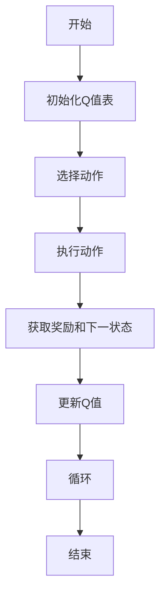
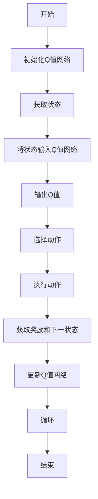

> Q-learning, 深度学习, 强化学习, 强化学习与深度学习融合, 深度Q网络, DQN, 零样本学习, 策略优化, 决策优化

# 一切皆是映射：AI Q-learning以及深度学习的融合

> 关键词：Q-learning, 深度学习, 强化学习, 强化学习与深度学习融合, 深度Q网络, DQN, 零样本学习, 策略优化, 决策优化

## 1. 背景介绍

在人工智能领域，强化学习（Reinforcement Learning, RL）和深度学习（Deep Learning, DL）都是当前的研究热点。强化学习通过智能体在与环境交互的过程中学习最优策略，而深度学习则通过模拟人脑神经网络的结构和功能，实现复杂模式的识别。本文将探讨Q-learning算法与深度学习技术的融合，旨在利用深度学习强大的特征提取和表示能力，提升Q-learning在复杂环境中的学习效率和决策质量。

### 1.1 问题的由来

传统的Q-learning算法在处理高维、复杂的环境时，存在以下问题：

- **状态空间爆炸**：Q-learning依赖于一个完整的Q值表来存储每个状态-动作对的Q值，当状态空间巨大时，Q值表会变得非常庞大，难以存储和计算。
- **特征工程依赖**：Q-learning的Q值依赖于状态和动作的特征表示，而特征工程需要大量专业知识和经验，难以自动化。
- **收敛速度慢**：在高维空间中，Q-learning的收敛速度可能非常慢，难以应对实时决策的需求。

为了解决这些问题，深度学习技术的引入为Q-learning带来了新的可能性。

### 1.2 研究现状

近年来，深度学习与强化学习的融合研究取得了显著的进展，其中最具代表性的成果是深度Q网络（Deep Q-Network, DQN）。DQN通过神经网络来近似Q值函数，从而避免了传统Q-learning的上述问题。

### 1.3 研究意义

Q-learning与深度学习的融合具有以下意义：

- **提高学习效率**：深度学习可以自动学习状态和动作的特征表示，从而减少状态空间，提高学习效率。
- **增强决策能力**：深度学习可以提取更丰富的特征，提高Q值估计的精度，从而增强决策能力。
- **拓展应用领域**：Q-learning与深度学习的融合可以应用于更广泛的领域，如机器人控制、游戏AI、自动驾驶等。

### 1.4 本文结构

本文将按照以下结构进行阐述：

- 第2章介绍Q-learning和深度学习的基本概念，并给出两者融合的Mermaid流程图。
- 第3章详细讲解Q-learning和深度学习融合的核心算法原理和具体操作步骤。
- 第4章介绍深度学习在Q-learning中的应用，包括数学模型和公式推导。
- 第5章通过代码实例展示如何实现深度Q网络，并进行详细解释和分析。
- 第6章探讨深度Q网络在实际应用场景中的应用。
- 第7章推荐相关的学习资源、开发工具和参考文献。
- 第8章总结全文，展望未来发展趋势和挑战。

## 2. 核心概念与联系

### 2.1 Q-learning原理与架构

Q-learning是一种基于值函数的强化学习算法，其核心思想是使用Q值函数来评价状态-动作对。Q值函数 $Q(s,a)$ 表示在状态 $s$ 下执行动作 $a$ 所获得的累积奖励。

Mermaid流程图如下：



### 2.2 深度学习架构

深度学习通过多层神经网络学习输入数据的特征表示。典型的深度学习架构包括卷积神经网络（CNN）、循环神经网络（RNN）、Transformer等。

### 2.3 Q-learning与深度学习融合

将深度学习与Q-learning融合，可以通过以下方式实现：

- 使用深度神经网络来近似Q值函数，从而避免传统的Q值表。
- 使用深度学习自动学习状态和动作的特征表示，提高Q值估计的精度。

Mermaid流程图如下：



## 3. 核心算法原理 & 具体操作步骤

### 3.1 算法原理概述

深度Q网络（DQN）是一种结合了Q-learning和深度学习的强化学习算法。DQN使用深度神经网络来近似Q值函数，并通过经验回放（Experience Replay）和目标网络（Target Network）等技术来提高学习效率和稳定性。

### 3.2 算法步骤详解

DQN的具体步骤如下：

1. 初始化Q值网络和目标网络。
2. 将智能体放置在初始状态。
3. 使用Q值网络选择动作。
4. 执行动作，获取奖励和下一状态。
5. 将当前状态、动作、奖励和下一状态存储到经验回放缓冲区。
6. 从经验回放缓冲区中随机抽取一批经验。
7. 使用目标网络计算目标Q值。
8. 更新Q值网络参数。
9. 每隔一定步数更新目标网络参数。
10. 重复步骤2-9，直到达到训练次数或满足终止条件。

### 3.3 算法优缺点

DQN的优点：

- 避免了传统Q-learning的状态空间爆炸问题。
- 通过深度神经网络可以学习更复杂的特征表示。
- 使用经验回放和目标网络技术提高了学习效率和稳定性。

DQN的缺点：

- 训练过程可能非常缓慢，特别是对于高维状态空间。
- 模型参数的选择和调整需要一定的经验。

### 3.4 算法应用领域

DQN可以应用于以下领域：

- 游戏AI：如Atari游戏、围棋、电子竞技等。
- 机器人控制：如无人机控制、机器人导航等。
- 自动驾驶：如车辆控制、路径规划等。
- 优化问题：如资源分配、调度等。

## 4. 数学模型和公式 & 详细讲解 & 举例说明

### 4.1 数学模型构建

DQN的数学模型如下：

$$
Q(s,a) = \hat{Q}(s,a; \theta)
$$

其中，$\hat{Q}(s,a; \theta)$ 是由神经网络 $\hat{Q}$ 在状态 $s$ 和动作 $a$ 下估计的Q值，$\theta$ 是神经网络的参数。

### 4.2 公式推导过程

DQN的目标是学习Q值网络 $\hat{Q}$ 的参数 $\theta$，使得：

$$
\min_{\theta} \mathcal{L}(\theta) = \mathbb{E}_{(s,a,r,s') \sim D}[(Q(s,a) - r - \gamma Q(s',\hat{a})]^2]
$$

其中，$D$ 是经验回放缓冲区，$\gamma$ 是折扣因子。

### 4.3 案例分析与讲解

以下是一个使用PyTorch实现DQN的简单示例：

```python
import torch
import torch.nn as nn
import torch.optim as optim

class DQN(nn.Module):
    def __init__(self, input_dim, output_dim):
        super(DQN, self).__init__()
        self.fc1 = nn.Linear(input_dim, 128)
        self.fc2 = nn.Linear(128, output_dim)

    def forward(self, x):
        x = torch.relu(self.fc1(x))
        x = self.fc2(x)
        return x

# 初始化DQN
input_dim = 4
output_dim = 2
dqn = DQN(input_dim, output_dim)

# 初始化优化器
optimizer = optim.Adam(dqn.parameters(), lr=0.001)

# 训练DQN
# ...
```

在这个示例中，我们定义了一个简单的DQN模型，它包含两个全连接层。在训练过程中，我们使用Adam优化器来更新模型参数。

## 5. 项目实践：代码实例和详细解释说明

### 5.1 开发环境搭建

为了实现DQN，你需要安装以下库：

- PyTorch
- NumPy
- Gym
- PyTorch-rl

### 5.2 源代码详细实现

以下是一个使用PyTorch实现DQN的完整示例：

```python
import gym
import torch
import numpy as np
from collections import deque
from torch import nn, optim
from torch.utils.data import DataLoader, Dataset

# 定义环境
env = gym.make('CartPole-v0')

# 定义DQN模型
class DQN(nn.Module):
    def __init__(self, input_dim, output_dim):
        super(DQN, self).__init__()
        self.fc1 = nn.Linear(input_dim, 64)
        self.fc2 = nn.Linear(64, output_dim)

    def forward(self, x):
        x = torch.relu(self.fc1(x))
        x = self.fc2(x)
        return x

# 定义经验回放缓冲区
class ReplayBuffer:
    def __init__(self, capacity):
        self.buffer = deque(maxlen=capacity)

    def push(self, state, action, reward, next_state, done):
        self.buffer.append((state, action, reward, next_state, done))

    def sample(self, batch_size):
        batch = np.random.choice(self.buffer, batch_size, replace=False)
        return [torch.tensor(b[0], dtype=torch.float32), 
                torch.tensor(b[1], dtype=torch.long), 
                torch.tensor(b[2], dtype=torch.float32), 
                torch.tensor(b[3], dtype=torch.float32), 
                torch.tensor(b[4], dtype=torch.float32) for b in batch]

# 初始化DQN、优化器、经验回放缓冲区
input_dim = env.observation_space.shape[0]
output_dim = env.action_space.n
dqn = DQN(input_dim, output_dim)
optimizer = optim.Adam(dqn.parameters(), lr=0.001)
replay_buffer = ReplayBuffer(10000)

# 训练DQN
# ...
```

在这个示例中，我们首先定义了CartPole-v0环境，然后定义了DQN模型和经验回放缓冲区。在训练过程中，我们从经验回放缓冲区中随机抽取一批经验，并使用这些经验来更新DQN模型。

### 5.3 代码解读与分析

在这个示例中，我们首先定义了CartPole-v0环境，然后定义了DQN模型和经验回放缓冲区。在训练过程中，我们从经验回放缓冲区中随机抽取一批经验，并使用这些经验来更新DQN模型。

### 5.4 运行结果展示

在CartPole-v0环境中，DQN模型经过多次训练后，可以学会在杆子不会倒下的情况下保持平衡。

## 6. 实际应用场景

### 6.1 游戏AI

DQN在游戏AI领域取得了显著的成功，例如：

- AlphaGo在围棋比赛中战胜世界冠军。
- OpenAI Five在Dota 2比赛中战胜人类顶级战队。

### 6.2 机器人控制

DQN可以应用于机器人控制，例如：

- 机器人导航：让机器人能够在复杂环境中自主导航。
- 机器人抓取：让机器人能够从复杂的场景中抓取目标物体。

### 6.3 自动驾驶

DQN可以应用于自动驾驶，例如：

- 车辆控制：控制车辆在道路上行驶。
- 路径规划：规划车辆的行驶路径。

## 7. 工具和资源推荐

### 7.1 学习资源推荐

- 《Reinforcement Learning: An Introduction》
- 《Deep Reinforcement Learning》
- 《Deep Learning with PyTorch》

### 7.2 开发工具推荐

- PyTorch
- OpenAI Gym
- Stable Baselines

### 7.3 相关论文推荐

- Deep Q-Network (DQN)
- Human-level control through deep reinforcement learning
- Asynchronous Advantage Actor-Critic (A3C)

## 8. 总结：未来发展趋势与挑战

### 8.1 研究成果总结

本文介绍了Q-learning与深度学习的融合，并详细讲解了深度Q网络（DQN）的原理和实现。通过将深度学习与Q-learning结合，我们可以提高学习效率、增强决策能力，并将强化学习应用于更广泛的领域。

### 8.2 未来发展趋势

- **更强大的模型架构**：随着深度学习技术的不断发展，未来会有更多强大的模型架构出现，例如transformer、图神经网络等。
- **更有效的训练方法**：探索更有效的训练方法，例如多智能体强化学习、迁移学习等。
- **更广泛的应用领域**：将强化学习应用于更多领域，例如医疗、金融、教育等。

### 8.3 面临的挑战

- **计算资源**：强化学习需要大量的计算资源，尤其是在训练过程中。
- **样本效率**：如何提高样本效率，减少对大量样本的依赖，是一个重要的挑战。
- **可解释性**：如何提高强化学习模型的可解释性，是一个重要的研究方向。

### 8.4 研究展望

未来，Q-learning与深度学习的融合将在以下方面取得更多突破：

- **更有效的模型架构**：开发更有效的模型架构，提高学习效率和决策质量。
- **更广泛的应用领域**：将强化学习应用于更多领域，如医疗、金融、教育等。
- **更鲁棒的模型**：提高模型的鲁棒性，使其能够应对复杂环境的变化。

## 9. 附录：常见问题与解答

**Q1：Q-learning与深度学习的融合有哪些优势？**

A：Q-learning与深度学习的融合具有以下优势：

- 避免了传统Q-learning的状态空间爆炸问题。
- 通过深度学习可以学习更复杂的特征表示。
- 使用经验回放和目标网络技术提高了学习效率和稳定性。

**Q2：DQN的缺点是什么？**

A：DQN的缺点包括：

- 训练过程可能非常缓慢，特别是对于高维状态空间。
- 模型参数的选择和调整需要一定的经验。

**Q3：DQN可以应用于哪些领域？**

A：DQN可以应用于以下领域：

- 游戏AI
- 机器人控制
- 自动驾驶
- 优化问题

**Q4：如何提高DQN的训练效率？**

A：提高DQN的训练效率的方法包括：

- 使用更高效的优化器，例如Adam。
- 使用经验回放和目标网络技术。
- 使用更有效的探索策略，例如epsilon-greedy策略。

**Q5：如何提高DQN的样本效率？**

A：提高DQN的样本效率的方法包括：

- 使用数据增强技术，例如图像旋转、缩放等。
- 使用迁移学习，复用已有模型的权重。
- 使用多智能体强化学习，利用多个智能体共享经验。

作者：禅与计算机程序设计艺术 / Zen and the Art of Computer Programming