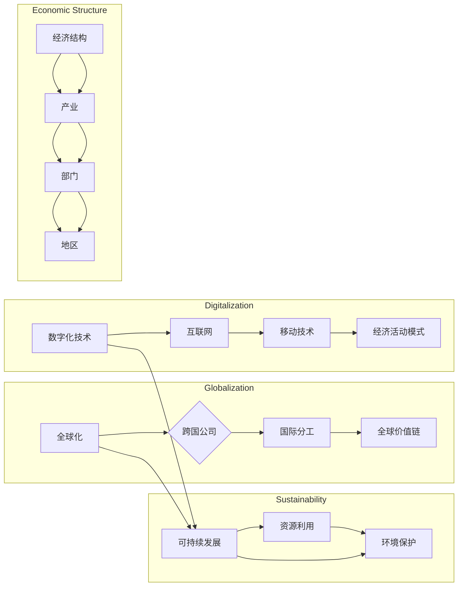

# 世界经济增长的内在变化

> 关键词：经济增长，全球化，数字化，技术创新，可持续发展，经济结构，全球价值链

## 1. 背景介绍
### 1.1 经济增长的演变

世界经济增长经历了几个主要阶段，从农业社会到工业社会，再到信息社会，每个阶段都伴随着生产力的巨大提升。然而，在21世纪的今天，我们正见证着经济增长模式的深刻变化。

### 1.2 全球化与经济结构

全球化推动了国际分工的深化，经济结构发生了重大调整。跨国公司成为全球经济的主导力量，全球价值链的形成使得生产要素在全球范围内流动。

### 1.3 数字化技术的影响

信息通信技术的飞速发展，尤其是互联网和移动技术的普及，深刻改变了人们的生活方式和经济活动模式。

### 1.4 可持续发展的挑战

经济增长的同时，也带来了资源枯竭、环境污染等问题，可持续发展成为经济增长的重要考量。

### 1.5 本文结构

本文将从以下方面探讨世界经济增长的内在变化：
- 核心概念与联系
- 经济增长的核心算法原理
- 数学模型和公式
- 项目实践
- 实际应用场景
- 工具和资源推荐
- 总结与展望

## 2. 核心概念与联系
### 2.1 核心概念原理

#### 全球化
全球化是指商品、服务、资本和人员在全球范围内的自由流动，以及跨国公司在全球范围内的经济活动。

#### 数字化
数字化是指将信息转化为二进制数字的过程，以及数字技术的广泛应用。

#### 可持续发展
可持续发展是指在满足当代人的需求的同时，不损害后代人满足其需求的能力。

#### 经济结构
经济结构是指一个国家或地区的产业、部门、地区等在经济活动中的组成和相互关系。

#### 全球价值链
全球价值链是指在全球范围内，由多个国家和地区共同完成的产品或服务的生产过程。

### 2.2 架构的 Mermaid 流程图



## 3. 核心算法原理 & 具体操作步骤
### 3.1 算法原理概述

世界经济增长的核心算法原理可以概括为以下几个方面：

- 技术创新推动生产力提升
- 全球化促进资源配置优化
- 数字化提高经济活动效率
- 可持续发展保障长期增长

### 3.2 算法步骤详解
1. 技术创新：通过研发新技术、新产品，提高生产效率。
2. 全球化：通过国际分工，实现资源配置优化。
3. 数字化：通过数字技术，提高经济活动效率。
4. 可持续发展：通过环境保护和资源合理利用，保障长期增长。

### 3.3 算法优缺点
#### 优点
- 提高生产效率，降低生产成本
- 促进国际贸易和投资
- 提升人民生活水平
- 推动经济发展

#### 缺点
- 资源和环境压力
- 贫富差距扩大
- 经济波动风险

### 3.4 算法应用领域
- 工业生产
- 服务业
- 跨国公司
- 政策制定

## 4. 数学模型和公式 & 详细讲解 & 举例说明
### 4.1 数学模型构建

经济增长的数学模型可以表示为：

$$
GDP = F(T, K, L)
$$

其中，$GDP$ 表示国内生产总值，$T$ 表示技术水平，$K$ 表示资本，$L$ 表示劳动力。

### 4.2 公式推导过程

经济增长的公式推导过程如下：

$$
GDP = Y = F(T, K, L)
$$

其中，$Y$ 表示总产出，$F$ 表示生产函数，$T$ 表示技术水平，$K$ 表示资本，$L$ 表示劳动力。

### 4.3 案例分析与讲解

以下以中国经济增长为例进行分析：

- 技术创新：中国在近年来加大了科技创新力度，取得了显著的成果。
- 全球化：中国积极参与全球化进程，吸引了大量外资。
- 数字化：中国是全球最大的互联网市场之一，数字化技术对经济增长的贡献显著。
- 可持续发展：中国政府提出了绿色发展的理念，致力于可持续发展。

## 5. 项目实践：代码实例和详细解释说明
### 5.1 开发环境搭建

本文将以Python编程语言为例，展示如何使用代码来模拟经济增长模型。

### 5.2 源代码详细实现

```python
import matplotlib.pyplot as plt

# 定义生产函数
def production_function(labor, capital, technology):
    return technology * labor * capital ** 0.5

# 模拟经济增长
def simulate_growth(labor_growth, capital_growth, technology_growth, years=10):
    labor = 1.0
    capital = 1.0
    technology = 1.0
    gdp = []
    for _ in range(years):
        gdp.append(production_function(labor, capital, technology))
        labor *= labor_growth
        capital *= capital_growth
        technology *= technology_growth
    return gdp

# 设置参数
labor_growth = 0.02
capital_growth = 0.02
technology_growth = 0.03

# 模拟经济增长
gdp = simulate_growth(labor_growth, capital_growth, technology_growth)

# 绘制图表
plt.plot(gdp)
plt.xlabel('Year')
plt.ylabel('GDP')
plt.title('Growth of GDP')
plt.show()
```

### 5.3 代码解读与分析

以上代码模拟了一个简单的经济增长模型。通过定义生产函数和模拟经济增长过程，我们可以观察到GDP随时间的变化趋势。

## 6. 实际应用场景
### 6.1 工业生产
技术创新是工业生产的核心驱动力。通过引入新技术、新工艺，可以提高生产效率，降低生产成本。

### 6.2 服务业
数字化技术的发展推动了服务业的快速发展。例如，电子商务、在线教育、金融科技等新兴行业迅速崛起。

### 6.3 跨国公司
跨国公司通过全球布局，实现资源配置优化，提高企业竞争力。

### 6.4 政策制定
政府通过制定相关政策，引导经济增长，促进可持续发展。

## 7. 工具和资源推荐
### 7.1 学习资源推荐

- 《全球化的起源》
- 《数字化时代》
- 《可持续发展的经济学》

### 7.2 开发工具推荐

- Python编程语言
- Jupyter Notebook
- Matplotlib

### 7.3 相关论文推荐

- 《全球化的经济影响》
- 《数字经济的未来》
- 《可持续发展的挑战与机遇》

## 8. 总结：未来发展趋势与挑战
### 8.1 研究成果总结

本文通过对世界经济增长的内在变化进行分析，总结了以下主要观点：

- 全球化、数字化和可持续发展是推动世界经济增长的核心因素。
- 技术创新是经济增长的核心驱动力。
- 经济增长模式正发生深刻变化，需要我们适应新的发展趋势。

### 8.2 未来发展趋势

- 技术创新将进一步推动经济增长。
- 数字化技术将深刻改变经济活动模式。
- 可持续发展成为经济增长的必要条件。

### 8.3 面临的挑战

- 技术创新带来的失业和社会不平等问题。
- 数字化技术带来的隐私和数据安全问题。
- 可持续发展面临的资源和环境挑战。

### 8.4 研究展望

未来，我们需要更加关注技术创新对社会的影响，探索数字化技术的应用边界，以及实现可持续发展的有效途径。

## 9. 附录：常见问题与解答

**Q1：全球化对经济增长有什么影响？**

A：全球化促进了资源配置优化，提高了生产效率，推动了经济增长。

**Q2：数字化技术如何影响经济增长？**

A：数字化技术提高了经济活动效率，催生了新兴行业，推动了经济增长。

**Q3：可持续发展对经济增长有什么意义？**

A：可持续发展保障了长期经济增长，为后代人留下了良好的发展环境。

**Q4：技术创新对经济增长有什么影响？**

A：技术创新是推动经济增长的核心驱动力，可以提高生产效率，降低生产成本。

**Q5：如何实现可持续发展？**

A：通过技术创新、政策引导和公众参与，实现资源的合理利用和环境的保护。

作者：禅与计算机程序设计艺术 / Zen and the Art of Computer Programming