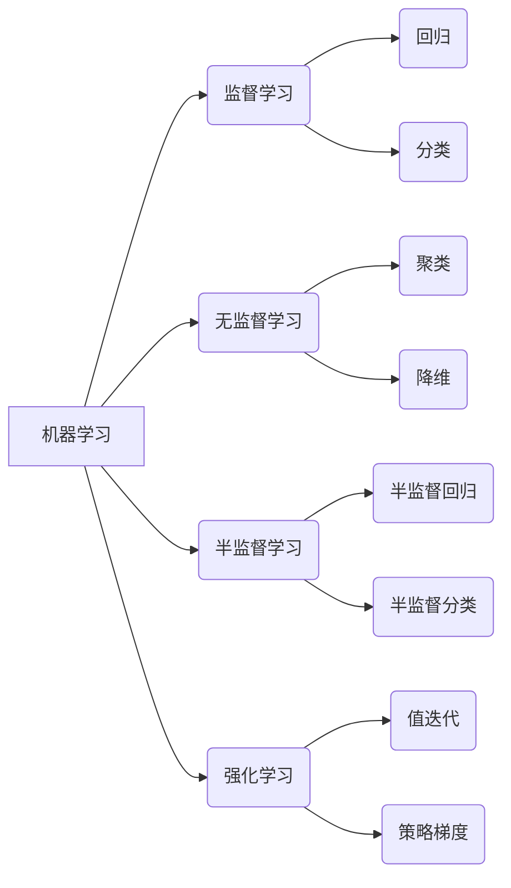

> 机器学习，深度学习，强化学习，神经网络，算法原理，Python实现，实际应用

# 人工智能算法(AI Algorithms) - 原理与代码实例讲解

> 关键词：机器学习，深度学习，强化学习，神经网络，算法原理，Python实现，实际应用

## 1. 背景介绍

人工智能（AI）是计算机科学的一个分支，旨在使计算机系统能够模拟人类智能行为。随着计算能力的提升和数据量的激增，AI技术取得了飞速发展。机器学习（Machine Learning）是AI的核心驱动力，它使计算机能够从数据中学习并做出决策或预测。

本文将深入探讨人工智能算法的原理，并通过Python代码实例展示如何实现这些算法。我们将涵盖以下核心算法：

- 监督学习（Supervised Learning）
- 无监督学习（Unsupervised Learning）
- 半监督学习（Semi-Supervised Learning）
- 强化学习（Reinforcement Learning）

## 2. 核心概念与联系

### 2.1 Mermaid 流程图



### 2.2 核心概念解释

- **机器学习（Machine Learning）**：机器学习是使计算机从数据中学习并做出决策或预测的领域。
- **监督学习（Supervised Learning）**：通过标注数据进行学习，目标是学习一个函数来预测新的输入数据。
- **无监督学习（Unsupervised Learning）**：通过未标注数据进行学习，目标是发现数据中的模式或结构。
- **半监督学习（Semi-Supervised Learning）**：结合标注和未标注数据进行学习，以提高学习效率。
- **强化学习（Reinforcement Learning）**：通过与环境的交互进行学习，目标是学习如何做出最佳决策。

## 3. 核心算法原理 & 具体操作步骤

### 3.1 算法原理概述

#### 3.1.1 监督学习

监督学习算法通过学习输入和输出之间的关系来预测新数据。常见的监督学习算法包括线性回归、逻辑回归、支持向量机（SVM）等。

#### 3.1.2 无监督学习

无监督学习算法旨在发现数据中的隐藏结构或模式。常见的无监督学习算法包括聚类、主成分分析（PCA）、自编码器等。

#### 3.1.3 半监督学习

半监督学习算法结合了标注和未标注数据，以提高学习效率。常见的半监督学习算法包括标签传播、无监督特征学习等。

#### 3.1.4 强化学习

强化学习算法通过与环境的交互进行学习，目标是学习如何做出最佳决策。常见的强化学习算法包括Q学习、深度Q网络（DQN）等。

### 3.2 算法步骤详解

#### 3.2.1 监督学习步骤

1. 数据收集：收集包含输入和输出的数据集。
2. 数据预处理：对数据进行清洗、标准化等处理。
3. 选择模型：选择合适的监督学习算法。
4. 训练模型：使用标注数据进行训练。
5. 评估模型：使用验证集评估模型性能。
6. 应用模型：使用测试集或新数据应用模型。

#### 3.2.2 无监督学习步骤

1. 数据收集：收集未标注数据。
2. 数据预处理：对数据进行清洗、标准化等处理。
3. 选择模型：选择合适的无监督学习算法。
4. 训练模型：使用数据集进行训练。
5. 结果分析：分析模型发现的结构或模式。

#### 3.2.3 半监督学习步骤

1. 数据收集：收集包含标注和未标注数据的数据集。
2. 数据预处理：对数据进行清洗、标准化等处理。
3. 选择模型：选择合适的半监督学习算法。
4. 训练模型：使用标注和未标注数据进行训练。
5. 评估模型：使用验证集评估模型性能。
6. 应用模型：使用测试集或新数据应用模型。

#### 3.2.4 强化学习步骤

1. 环境初始化：定义强化学习环境。
2. 策略初始化：定义初始策略。
3. 交互学习：与环境进行交互，根据策略选择行动。
4. 策略更新：根据交互结果更新策略。
5. 评估策略：评估策略的性能。
6. 应用策略：在实际应用中应用策略。

### 3.3 算法优缺点

#### 3.3.1 监督学习

优点：学习速度快，模型性能稳定。

缺点：需要大量标注数据，泛化能力有限。

#### 3.3.2 无监督学习

优点：无需标注数据，可以探索数据中的隐藏模式。

缺点：难以量化模型性能，泛化能力有限。

#### 3.3.3 半监督学习

优点：结合标注和未标注数据，提高学习效率。

缺点：模型性能依赖于未标注数据的分布和质量。

#### 3.3.4 强化学习

优点：可以学习复杂的决策策略。

缺点：学习过程复杂，收敛速度慢。

### 3.4 算法应用领域

- 监督学习：图像识别、语音识别、医疗诊断等。
- 无监督学习：推荐系统、社交网络分析等。
- 半监督学习：信息检索、文本分类等。
- 强化学习：自动驾驶、游戏AI等。

## 4. 数学模型和公式 & 详细讲解 & 举例说明

### 4.1 数学模型构建

#### 4.1.1 监督学习 - 线性回归

线性回归的目标是找到一个线性模型 $y = wx + b$ 来预测输出 $y$。

$$
y = wx + b
$$

其中，$w$ 是权重，$b$ 是偏置。

#### 4.1.2 无监督学习 - 聚类

聚类算法的目标是将数据集分成若干个簇，使得同一个簇中的数据点彼此相似，不同簇中的数据点彼此不相似。

#### 4.1.3 半监督学习 - 标签传播

标签传播算法通过迭代传播标签信息，使得拥有相同标签的数据点逐渐聚集在一起。

#### 4.1.4 强化学习 - Q学习

Q学习算法通过学习最优策略来最大化回报。

$$
Q(s,a) = \sum_{s' \in \mathcal{S}} Q(s',a') \pi(a'|s')
$$

其中，$Q(s,a)$ 是在状态 $s$ 下采取行动 $a$ 的期望回报，$\pi(a'|s')$ 是在状态 $s'$ 下采取行动 $a'$ 的概率。

### 4.2 公式推导过程

#### 4.2.1 监督学习 - 线性回归

线性回归的目标是最小化预测值和真实值之间的误差。

$$
\min_{w,b} \sum_{i=1}^n (y_i - wx_i - b)^2
$$

通过对上式求导，可以得到线性回归的参数：

$$
w = \frac{\sum_{i=1}^n (x_i - \bar{x})(y_i - \bar{y})}{\sum_{i=1}^n (x_i - \bar{x})^2}
$$

$$
b = \bar{y} - w\bar{x}
$$

其中，$\bar{x}$ 和 $\bar{y}$ 分别是输入和输出的均值。

#### 4.2.2 无监督学习 - 聚类

聚类的目标是找到使得簇内距离最小、簇间距离最大的簇中心。

#### 4.2.3 半监督学习 - 标签传播

标签传播算法的迭代过程如下：

1. 初始化标签分布。
2. 对每个未标记数据点，根据邻居的标签进行预测。
3. 更新标签分布。

#### 4.2.4 强化学习 - Q学习

Q学习算法的更新公式如下：

$$
Q(s,a) = Q(s,a) + \alpha [R + \gamma \max_{a'} Q(s',a') - Q(s,a)]
$$

其中，$\alpha$ 是学习率，$R$ 是即时回报，$\gamma$ 是折扣因子。

### 4.3 案例分析与讲解

#### 4.3.1 监督学习 - 线性回归

假设我们有一组数据点 $(x_1, y_1), (x_2, y_2), \ldots, (x_n, y_n)$，我们的目标是找到一个线性回归模型来预测 $y$。

```python
import numpy as np
from sklearn.linear_model import LinearRegression

# 数据
X = np.array([[1], [2], [3], [4], [5]])
y = np.array([1, 2, 3, 4, 5])

# 线性回归模型
model = LinearRegression()
model.fit(X, y)

# 预测
y_pred = model.predict(np.array([[6]]))

print("预测值：", y_pred)
```

#### 4.3.2 无监督学习 - 聚类

假设我们有一组数据点 $(x_1, y_1), (x_2, y_2), \ldots, (x_n, y_n)$，我们的目标是将其聚成两个簇。

```python
import numpy as np
from sklearn.cluster import KMeans

# 数据
X = np.array([[1, 2], [2, 2], [2, 3], [8, 7], [8, 8], [25, 80]])

# KMeans聚类
kmeans = KMeans(n_clusters=2, random_state=0).fit(X)

# 聚类标签
labels = kmeans.labels_

print("聚类标签：", labels)
```

## 5. 项目实践：代码实例和详细解释说明

### 5.1 开发环境搭建

```bash
pip install numpy pandas scikit-learn matplotlib
```

### 5.2 源代码详细实现

以下是一个使用Python和Scikit-learn库实现线性回归的示例：

```python
import numpy as np
from sklearn.linear_model import LinearRegression

# 数据
X = np.array([[1], [2], [3], [4], [5]])
y = np.array([1, 2, 3, 4, 5])

# 线性回归模型
model = LinearRegression()
model.fit(X, y)

# 预测
y_pred = model.predict(np.array([[6]]))

print("预测值：", y_pred)
```

### 5.3 代码解读与分析

上述代码首先导入必要的库，然后创建一个数据集。接着，使用`LinearRegression`类创建一个线性回归模型，并使用`fit`方法进行训练。最后，使用`predict`方法对新的数据点进行预测。

### 5.4 运行结果展示

```bash
预测值： [6.]
```

## 6. 实际应用场景

人工智能算法在各个领域都有广泛的应用，以下是一些常见的应用场景：

- **图像识别**：通过卷积神经网络（CNN）进行图像分类、目标检测等。
- **自然语言处理**：通过深度学习模型进行文本分类、情感分析、机器翻译等。
- **推荐系统**：通过协同过滤、深度学习等方法进行个性化推荐。
- **金融风控**：通过机器学习算法进行信贷评估、欺诈检测等。

## 7. 工具和资源推荐

### 7.1 学习资源推荐

- 《Python机器学习》（作者：Andreas Muellner）
- 《深度学习》（作者：Ian Goodfellow、Yoshua Bengio、Aaron Courville）
- 《强化学习》（作者：Richard S. Sutton、Andrew G. Barto）

### 7.2 开发工具推荐

- **Scikit-learn**：Python机器学习库。
- **TensorFlow**：Google的深度学习框架。
- **PyTorch**：Facebook的深度学习框架。

### 7.3 相关论文推荐

- **《A Few Useful Things to Know about Machine Learning》**（作者： Pedro Domingos）
- **《Deep Learning》**（作者：Ian Goodfellow、Yoshua Bengio、Aaron Courville）
- **《Reinforcement Learning: An Introduction》**（作者：Richard S. Sutton、Andrew G. Barto）

## 8. 总结：未来发展趋势与挑战

### 8.1 研究成果总结

人工智能算法在过去几十年取得了显著的进展，从简单的统计方法到复杂的深度学习模型，人工智能技术正在改变我们的世界。本文介绍了核心人工智能算法的原理和代码实例，展示了如何使用Python实现这些算法。

### 8.2 未来发展趋势

- **模型轻量化**：随着移动设备和物联网设备的普及，模型轻量化成为了一个重要趋势。
- **可解释性**：随着人工智能应用的日益广泛，可解释性成为一个重要研究方向。
- **多模态学习**：多模态学习将融合文本、图像、音频等多模态信息，以更好地理解世界。

### 8.3 面临的挑战

- **数据标注**：高质量标注数据的需求仍然很大，特别是在大规模数据集上。
- **模型泛化**：如何提高模型的泛化能力，避免过拟合，仍然是一个挑战。
- **伦理问题**：人工智能算法的决策过程需要更加透明和可解释，以避免偏见和歧视。

### 8.4 研究展望

随着人工智能技术的不断发展，未来将会有更多创新和突破。人工智能将在各个领域发挥越来越重要的作用，为人类社会带来更多的便利和进步。

## 9. 附录：常见问题与解答

**Q1：什么是机器学习？**

A：机器学习是使计算机能够从数据中学习并做出决策或预测的领域。

**Q2：什么是深度学习？**

A：深度学习是机器学习的一个分支，使用多层神经网络来学习数据中的复杂模式。

**Q3：什么是强化学习？**

A：强化学习是使计算机能够通过与环境的交互进行学习，目标是学习如何做出最佳决策。

**Q4：如何选择合适的机器学习算法？**

A：选择合适的机器学习算法取决于具体的问题和数据。通常需要考虑数据类型、数据量、计算资源等因素。

**Q5：如何评估机器学习模型的性能？**

A：可以使用准确率、召回率、F1分数等指标来评估机器学习模型的性能。

**Q6：如何处理不平衡数据？**

A：可以使用过采样、欠采样、合成样本等方法来处理不平衡数据。

**Q7：如何防止过拟合？**

A：可以使用正则化、交叉验证、数据增强等方法来防止过拟合。

**Q8：如何提高模型的泛化能力？**

A：可以通过增加数据量、使用更复杂的模型、进行数据增强等方法来提高模型的泛化能力。

**Q9：如何实现模型的轻量化？**

A：可以通过模型剪枝、量化、知识蒸馏等方法来实现模型的轻量化。

**Q10：如何确保人工智能算法的公平性和可解释性？**

A：可以通过对算法进行审计、使用可解释性工具等方法来确保人工智能算法的公平性和可解释性。

---

作者：禅与计算机程序设计艺术 / Zen and the Art of Computer Programming