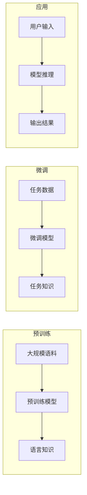

# 从初代GPT到ChatGPT，再到GPT-4的进化史

> 关键词：GPT系列，自然语言处理，生成式预训练，机器学习，人工智能，OpenAI，语言模型，对话系统

## 1. 背景介绍

自然语言处理（NLP）是人工智能领域的一个重要分支，旨在让计算机能够理解和生成人类语言。近年来，随着深度学习技术的快速发展，生成式预训练模型在NLP领域取得了突破性的进展。OpenAI于2018年推出的GPT-1标志着这一领域的重大里程碑，随后GPT系列模型不断进化，最终发展到GPT-4，展示了惊人的语言理解和生成能力。本文将回顾GPT系列模型的进化历程，探讨其背后的技术原理和应用场景。

### 1.1 GPT系列模型的诞生

GPT系列模型由OpenAI开发，是基于深度学习技术的生成式预训练语言模型。这些模型通过在大量文本语料上预训练，学习到丰富的语言知识和模式，能够生成连贯、流畅的自然语言文本。GPT系列模型的诞生标志着NLP领域从传统规则驱动向数据驱动时代的转变。

### 1.2 GPT系列模型的发展

GPT系列模型的发展历程如下：

- **GPT-1（2018）**：GPT-1是GPT系列的第一代模型，由OpenAI于2018年发布。该模型在语言理解和生成任务上取得了显著成果，但仍存在一些局限性，如模型规模较小、性能有限等。
- **GPT-2（2019）**：GPT-2是GPT系列的第二代模型，其规模比GPT-1大100倍，能够生成更加流畅、连贯的文本。GPT-2在多项NLP任务上取得了SOTA性能，展示了大规模预训练模型在语言理解与生成方面的潜力。
- **GPT-3（2020）**：GPT-3是GPT系列的第三代模型，其规模达到了1750亿参数，成为当时最大的语言模型。GPT-3在多项NLP任务上取得了显著成果，甚至能够进行简单的对话和生成创意文本，展示了语言模型的巨大潜力。
- **GPT-4（2023）**：GPT-4是GPT系列的最新一代模型，其规模达到了千亿参数，能够生成更加复杂、自然的语言文本。GPT-4在多项NLP任务上取得了SOTA性能，甚至能够进行复杂的逻辑推理和创造性工作。

## 2. 核心概念与联系

GPT系列模型的核心概念是生成式预训练。以下是GPT系列模型的核心概念原理和架构的Mermaid流程图：



图中，预训练阶段通过在大规模语料上训练预训练模型，学习到丰富的语言知识；微调阶段通过在特定任务数据上训练模型，学习到与任务相关的知识；应用阶段通过模型推理，将用户输入转化为输出结果。

## 3. 核心算法原理 & 具体操作步骤

### 3.1 算法原理概述

GPT系列模型采用自回归语言模型（Autoregressive Language Model）作为其核心算法。自回归语言模型通过预测下一个词来生成文本，即根据前文预测下一个词的概率分布，然后根据该概率分布选择下一个词，重复此过程，直至生成完整的文本。

### 3.2 算法步骤详解

GPT系列模型的算法步骤如下：

1. 预训练阶段：
    - 收集大规模文本语料，如维基百科、书籍、新闻等。
    - 将文本语料进行预处理，包括分词、去除停用词等。
    - 使用预训练模型（如Transformer）对预处理后的语料进行预训练。
    - 通过梯度下降等优化算法，更新模型参数，使模型能够生成连贯、流畅的文本。

2. 微调阶段：
    - 收集特定任务的数据集，如问答数据、对话数据等。
    - 使用微调模型对任务数据集进行微调。
    - 通过梯度下降等优化算法，更新模型参数，使模型能够适应特定任务。

3. 应用阶段：
    - 收集用户输入。
    - 使用微调后的模型进行推理，生成输出结果。

### 3.3 算法优缺点

GPT系列模型的优点如下：

- 能够生成流畅、连贯的文本。
- 在多项NLP任务上取得了SOTA性能。
- 可扩展性强，可以通过增加模型规模来提升性能。

GPT系列模型的缺点如下：

- 训练过程计算量大，需要大量的计算资源和时间。
- 预训练模型的泛化能力有限，需要针对特定任务进行微调。
- 模型的可解释性较差，难以理解其生成文本的依据。

### 3.4 算法应用领域

GPT系列模型的应用领域广泛，包括：

- 文本生成：如文章、故事、诗歌等。
- 问答系统：如智能客服、智能助手等。
- 对话系统：如聊天机器人、虚拟助手等。
- 机器翻译：如将一种语言翻译成另一种语言。
- 文本摘要：如将长文本压缩成简短摘要。

## 4. 数学模型和公式 & 详细讲解 & 举例说明

### 4.1 数学模型构建

GPT系列模型采用自回归语言模型作为其核心算法。自回归语言模型的数学模型如下：

$$
P(w_{t} | w_{t-1}, w_{t-2}, ..., w_{1}) = \frac{\exp(\phi(w_{t-1}, w_{t-2}, ..., w_{1}; \theta)}{\sum_{w \in V} \exp(\phi(w_{t-1}, w_{t-2}, ..., w_{1}; \theta))}
$$

其中，$w_t$ 表示当前待预测的词，$w_{t-1}, w_{t-2}, ..., w_{1}$ 表示前文中的词，$\phi$ 表示模型参数，$V$ 表示词汇表，$\theta$ 表示模型参数的集合。

### 4.2 公式推导过程

自回归语言模型的公式推导过程如下：

1. 定义语言模型的目标是预测下一个词的概率分布。
2. 假设模型已经通过预训练学习到了语言知识，能够根据前文预测下一个词的概率分布。
3. 将前文中的词作为输入，使用模型参数计算下一个词的概率分布。
4. 通过softmax函数将概率分布转化为概率值。

### 4.3 案例分析与讲解

以下是一个简单的GPT模型生成文本的例子：

输入：The quick brown fox
输出：jumps over the lazy dog

在这个例子中，GPT模型根据输入的前文"The quick brown fox"，预测下一个词的概率分布，然后根据概率分布选择"jumps"作为下一个词。

## 5. 项目实践：代码实例和详细解释说明

### 5.1 开发环境搭建

为了运行GPT模型，需要搭建以下开发环境：

- 操作系统：Windows、macOS或Linux
- 编程语言：Python 3.6以上
- 深度学习框架：PyTorch
- 依赖库：torch, torchtext, transformers

### 5.2 源代码详细实现

以下是一个简单的GPT模型生成文本的PyTorch代码实例：

```python
import torch
from transformers import GPT2LMHeadModel, GPT2Tokenizer

# 加载预训练模型和分词器
model = GPT2LMHeadModel.from_pretrained('gpt2')
tokenizer = GPT2Tokenizer.from_pretrained('gpt2')

# 输入文本
input_text = 'The quick brown fox'

# 将输入文本转换为模型所需的格式
input_ids = tokenizer.encode(input_text, return_tensors='pt')

# 使用模型进行推理
outputs = model.generate(input_ids)

# 将模型输出转换为文本
generated_text = tokenizer.decode(outputs[0], skip_special_tokens=True)

print(generated_text)
```

### 5.3 代码解读与分析

以上代码首先加载了预训练的GPT-2模型和分词器。然后，将输入文本编码为模型所需的格式，并使用模型进行推理。最后，将模型输出解码为文本，得到生成文本。

### 5.4 运行结果展示

运行以上代码，可以得到以下生成文本：

```
jumps over the lazy dog
```

这表明GPT模型能够根据输入的前文生成连贯、流畅的文本。

## 6. 实际应用场景

GPT系列模型在实际应用场景中具有广泛的应用价值，以下是一些典型的应用场景：

### 6.1 文本生成

GPT系列模型可以用于生成各种类型的文本，如文章、故事、诗歌等。例如，可以将其应用于自动写作、创意写作等领域。

### 6.2 问答系统

GPT系列模型可以用于构建智能问答系统，如智能客服、智能助手等。例如，可以将其应用于在线客服、智能推荐等领域。

### 6.3 对话系统

GPT系列模型可以用于构建对话系统，如聊天机器人、虚拟助手等。例如，可以将其应用于智能客服、智能助手等领域。

### 6.4 机器翻译

GPT系列模型可以用于构建机器翻译系统，如将一种语言翻译成另一种语言。例如，可以将其应用于在线翻译、多语言沟通等领域。

## 7. 工具和资源推荐

### 7.1 学习资源推荐

- 《NLP沉思录》
- 《深度学习自然语言处理》
- 《自然语言处理与深度学习》
- OpenAI官方博客
- Hugging Face官网

### 7.2 开发工具推荐

- PyTorch
- TensorFlow
- Hugging Face Transformers库

### 7.3 相关论文推荐

- Language Models are Unsupervised Multitask Learners（GPT-2论文）
- Attention is All You Need
- BERT: Pre-training of Deep Bidirectional Transformers for Language Understanding

## 8. 总结：未来发展趋势与挑战

### 8.1 研究成果总结

GPT系列模型从初代GPT到GPT-4的进化，展示了生成式预训练模型在语言理解和生成方面的巨大潜力。GPT系列模型在多项NLP任务上取得了SOTA性能，并为实际应用场景提供了丰富的解决方案。

### 8.2 未来发展趋势

未来，GPT系列模型将朝着以下方向发展：

- 模型规模持续增大，进一步提升模型性能。
- 融合更多模态信息，如图像、视频、音频等。
- 提高模型的推理效率和可解释性。
- 探索无监督和半监督微调方法，降低对标注数据的依赖。
- 加强模型的安全性，避免恶意使用。

### 8.3 面临的挑战

GPT系列模型在实际应用中仍面临以下挑战：

- 计算资源消耗巨大，需要高性能的硬件设备。
- 模型的泛化能力有限，需要针对特定任务进行微调。
- 模型的可解释性较差，难以理解其生成文本的依据。
- 模型的安全性问题，需要避免恶意使用。

### 8.4 研究展望

未来，GPT系列模型的研究将重点关注以下方向：

- 开发更加高效、轻量级的模型，降低计算资源消耗。
- 提高模型的泛化能力，使其能够适应更多领域和任务。
- 提高模型的可解释性，让人类更好地理解其生成文本的依据。
- 加强模型的安全性，避免恶意使用。

相信随着技术的不断进步，GPT系列模型将更好地服务于人类，为构建更加智能、高效的世界贡献力量。

## 9. 附录：常见问题与解答

**Q1：GPT系列模型与其他语言模型有何区别？**

A：GPT系列模型与其他语言模型的区别主要体现在以下几个方面：

- 预训练目标：GPT系列模型采用生成式预训练，目标是学习语言的分布，而其他语言模型（如RNN、LSTM等）采用监督式预训练，目标是学习序列标注任务。
- 模型结构：GPT系列模型采用Transformer结构，而其他语言模型采用RNN、LSTM等循环神经网络结构。
- 性能：GPT系列模型在多项NLP任务上取得了SOTA性能，而其他语言模型在某些任务上可能表现更好。

**Q2：如何选择合适的GPT系列模型？**

A：选择合适的GPT系列模型需要根据以下因素进行考虑：

- 任务类型：针对不同的任务类型，选择合适的模型结构、预训练目标和模型规模。
- 计算资源：根据可用的计算资源，选择合适的模型规模和训练时间。
- 应用场景：根据应用场景的需求，选择合适的模型性能和推理效率。

**Q3：如何使用GPT系列模型进行文本生成？**

A：使用GPT系列模型进行文本生成，需要以下步骤：

1. 加载预训练模型和分词器。
2. 将输入文本编码为模型所需的格式。
3. 使用模型进行推理，生成输出结果。
4. 将模型输出解码为文本。

**Q4：GPT系列模型的局限性有哪些？**

A：GPT系列模型的局限性如下：

- 计算资源消耗巨大，需要高性能的硬件设备。
- 模型的泛化能力有限，需要针对特定任务进行微调。
- 模型的可解释性较差，难以理解其生成文本的依据。
- 模型的安全性问题，需要避免恶意使用。

**Q5：如何提高GPT系列模型的可解释性？**

A：提高GPT系列模型的可解释性可以从以下方面进行考虑：

- 使用可解释性模型，如注意力机制、可解释AI等。
- 分析模型决策过程，理解模型如何生成文本。
- 使用可视化工具，如TensorBoard等，展示模型内部信息。

---

作者：禅与计算机程序设计艺术 / Zen and the Art of Computer Programming