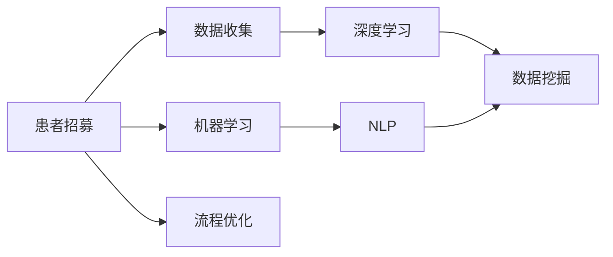
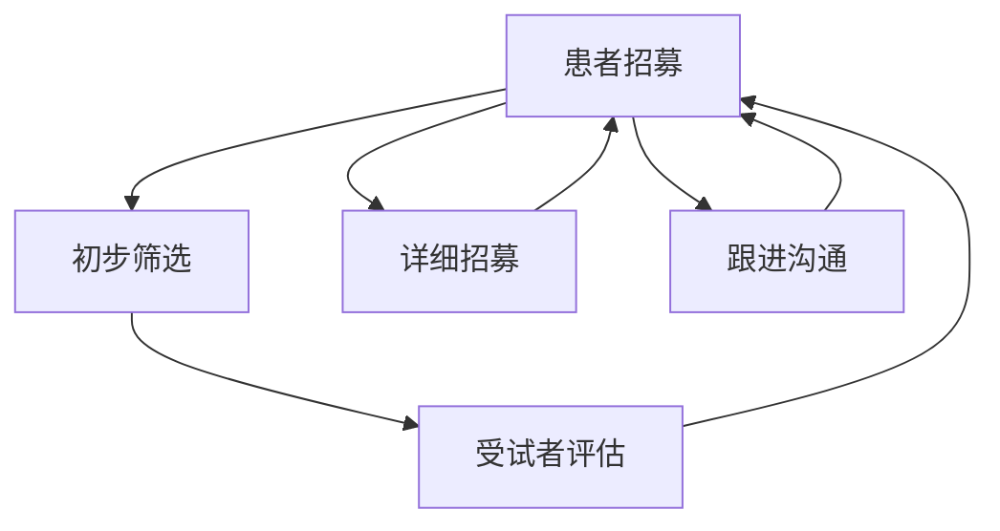
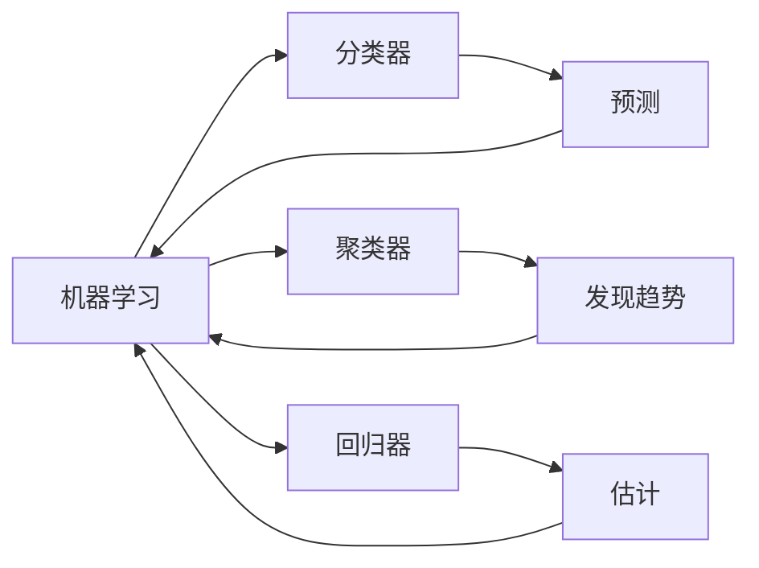
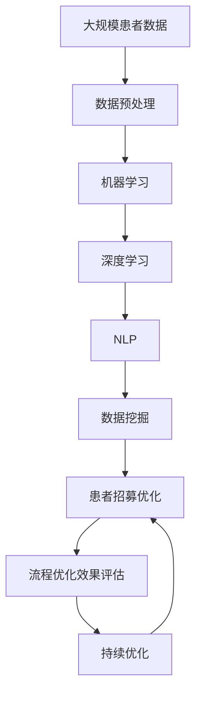

                 

# AI技术优化患者招募流程的策略

> 关键词：AI,患者招募,流程优化,机器学习,深度学习,自然语言处理,NLP

## 1. 背景介绍

### 1.1 问题由来
在现代医学研究中，患者招募是临床试验和研究的重要环节。传统患者招募流程通常需要大量人力和时间，且效果往往不尽如人意。传统的患者招募方式存在诸多问题，如招募效率低下、受试者匹配不精确、信息获取不充分等。这些问题不仅增加了研究成本，延误研究进程，还可能导致样本偏差，影响研究结果的可靠性。

近年来，随着人工智能(AI)技术的迅猛发展，许多研究人员开始探索利用AI技术优化患者招募流程，以期提升招募效率和准确性，降低研究成本，保障研究质量。AI技术能够高效处理和分析大量数据，发掘患者招募流程中的潜在问题，并提出改进策略，有望从根本上改变传统的患者招募方式。

### 1.2 问题核心关键点
本文聚焦于AI技术在患者招募流程中的优化策略，涉及以下几个核心问题：
- 如何通过数据挖掘和机器学习技术，识别和预测潜在受试者，从而提高招募效率？
- 如何利用深度学习技术，改善招募信息的自动化处理和分析，减少人工干预？
- 如何在不同的招募阶段（如初步筛选、详细信息收集、跟进沟通等）中应用AI技术，提升整体招募效果？

### 1.3 问题研究意义
AI技术优化患者招募流程的研究，对于提升医学研究的效率和质量，推动科学进步，具有重要意义：
1. 提升招募效率：AI可以快速处理和分析大量数据，显著缩短患者招募时间，降低研究成本。
2. 提高招募准确性：AI能够精确预测潜在受试者的匹配程度，减少研究偏差，确保研究结果的可靠性。
3. 降低研究成本：AI技术的引入减少了人工成本和资源投入，有助于提高研究项目的经济效益。
4. 推动医学发展：优化的招募流程可以更好地发掘符合条件的受试者，促进医学研究的创新和进步。

## 2. 核心概念与联系

### 2.1 核心概念概述

为更好地理解AI在患者招募流程中的优化策略，本节将介绍几个关键概念：

- 患者招募(Patient Recruitment)：指从潜在受试者中筛选和招募符合特定研究条件的受试者，并进行相关信息的收集和跟进的过程。
- 机器学习(Machine Learning)：一种利用数据训练模型，从而实现数据预测、分类、聚类等任务的算法。
- 深度学习(Deep Learning)：一种通过多层神经网络进行复杂特征提取和模式识别的高级机器学习方法。
- 自然语言处理(Natural Language Processing, NLP)：利用计算机处理和理解自然语言的技术，包括文本分析、情感分析、语义理解等。
- 数据挖掘(Data Mining)：从大量数据中提取有用信息、发现数据模式和趋势的过程。

这些核心概念之间的联系可以通过以下Mermaid流程图来展示：



这个流程图展示了大语言模型在患者招募中的关键环节和所用技术。数据收集后，通过机器学习、深度学习、自然语言处理和数据挖掘等技术，优化患者招募流程。

### 2.2 概念间的关系

这些核心概念之间存在紧密的联系，形成了患者招募流程优化的完整生态系统。下面我们通过几个Mermaid流程图来展示这些概念之间的关系。

#### 2.2.1 患者招募流程



这个流程图展示了患者招募流程的基本环节。从初步筛选到详细招募和跟进沟通，每个环节都可以应用AI技术进行优化。

#### 2.2.2 机器学习与数据挖掘



这个流程图展示了机器学习在患者招募中的几个典型应用。通过分类、聚类、回归等方法，可以实现受试者预测、信息分类、趋势发现等功能。

#### 2.2.3 深度学习与自然语言处理

```mermaid
graph LR
    A[深度学习] --> B[卷积神经网络(CNN)]
    A --> C[循环神经网络(RNN)]
    A --> D[长短期记忆网络(LSTM)]
    A --> E[自然语言处理(NLP)]
    B --> F[图像处理]
    C --> G[序列建模]
    D --> H[时序预测]
    E --> I[文本分析]
    F --> I
    G --> I
    H --> I
```

这个流程图展示了深度学习在患者招募中的几个关键应用。通过卷积神经网络、循环神经网络、长短期记忆网络等模型，可以处理图像、序列等复杂数据，而自然语言处理技术可以用于文本分析、情感分析等任务。

### 2.3 核心概念的整体架构

最后，我们用一个综合的流程图来展示这些核心概念在大语言模型微调过程中的整体架构：



这个综合流程图展示了从数据预处理到患者招募流程优化的完整过程。AI技术通过机器学习、深度学习、自然语言处理和数据挖掘等技术，对患者招募流程进行优化和评估。

## 3. 核心算法原理 & 具体操作步骤
### 3.1 算法原理概述

AI技术优化患者招募流程的核心思想是通过机器学习和大数据分析，发现和预测潜在受试者，并通过深度学习技术处理和分析招募信息，从而提高招募效率和准确性。具体来说，包括以下几个关键步骤：

1. **数据收集与预处理**：从医疗数据库、临床试验数据库、在线健康平台等渠道收集潜在受试者的信息，并进行数据清洗和标准化处理。
2. **特征工程**：根据研究需求，选择和构建潜在受试者的特征向量，如年龄、性别、病史、生活方式等。
3. **受试者预测与匹配**：利用机器学习模型预测潜在受试者是否符合研究条件，并进行精确匹配。
4. **信息收集与处理**：通过深度学习技术自动处理和分析受试者提交的信息，提取关键数据。
5. **招募跟进与沟通**：利用自然语言处理技术分析受试者反馈，进行动态调整和跟进沟通。
6. **流程优化与评估**：通过持续优化和效果评估，不断提升患者招募流程的效率和质量。

### 3.2 算法步骤详解

以下是AI技术在患者招募流程中应用的详细步骤：

**Step 1: 数据收集与预处理**

- 收集潜在受试者的基本信息，如姓名、年龄、性别、病史等。
- 标准化处理数据格式，确保数据的一致性和完整性。
- 清洗数据，去除噪音和错误信息。

**Step 2: 特征工程**

- 根据研究需求，选择和构建潜在受试者的特征向量，如年龄、性别、病史、生活方式等。
- 使用数据挖掘技术，发现潜在的特征组合和相关性。
- 进行特征选择，去除冗余和不相关的特征。

**Step 3: 受试者预测与匹配**

- 利用机器学习模型（如随机森林、支持向量机等）预测潜在受试者是否符合研究条件。
- 计算预测结果与实际条件的匹配度，并进行精确匹配。
- 使用深度学习模型（如CNN、RNN等）处理结构化数据，进行更精细的预测和匹配。

**Step 4: 信息收集与处理**

- 利用深度学习技术（如循环神经网络、长短期记忆网络等）自动处理和分析受试者提交的信息，提取关键数据。
- 利用自然语言处理技术（如词向量模型、情感分析等）处理文本信息，进行语义理解和情感分析。
- 实时监控受试者反馈，动态调整招募策略。

**Step 5: 招募跟进与沟通**

- 利用自然语言处理技术分析受试者反馈，进行动态调整和跟进沟通。
- 使用对话系统进行智能对话，解答受试者疑问，提高沟通效率。
- 根据受试者需求，调整招募策略，提升招募效果。

**Step 6: 流程优化与评估**

- 使用机器学习模型评估患者招募流程的效率和质量。
- 通过持续优化和效果评估，不断提升患者招募流程的效率和质量。
- 定期更新和维护招募流程，确保流程的稳定性和可靠性。

### 3.3 算法优缺点

**优点**：
- 提高招募效率：通过机器学习和深度学习技术，可以快速处理和分析大量数据，显著缩短患者招募时间。
- 提升招募准确性：利用深度学习技术，可以提高受试者预测和匹配的准确性，减少研究偏差，确保研究结果的可靠性。
- 降低研究成本：AI技术的引入减少了人工成本和资源投入，有助于提高研究项目的经济效益。
- 增强数据分析能力：通过自然语言处理技术，可以更全面地分析和理解受试者信息，提升招募效果。

**缺点**：
- 数据隐私问题：收集和使用患者数据需要遵守数据隐私和安全规定，避免数据泄露和滥用。
- 算法复杂性：深度学习模型的训练和优化需要大量计算资源和专业知识，增加了实施难度。
- 结果解释性：深度学习模型的决策过程难以解释，可能影响用户的信任和使用意愿。
- 依赖高质量数据：AI模型的性能依赖于高质量的数据，数据质量不佳可能导致模型效果不佳。

### 3.4 算法应用领域

AI技术在患者招募流程中的应用，主要包括以下几个领域：

- **临床试验招募**：利用AI技术优化临床试验患者招募，提升招募效率和准确性。
- **医学研究招募**：利用AI技术优化医学研究受试者招募，提高研究质量和效率。
- **健康管理招募**：利用AI技术优化健康管理项目中的患者招募，提升患者参与度和依从性。
- **医疗合作招募**：利用AI技术优化医疗合作项目的患者招募，提升合作效率和效果。

除了这些具体应用，AI技术在患者招募流程中的应用还可以拓展到更多的场景中，如学术研究、政府项目、社会公益等，为各类组织提供优化患者招募流程的解决方案。

## 4. 数学模型和公式 & 详细讲解 & 举例说明

### 4.1 数学模型构建

为了更好地理解AI技术在患者招募流程中的应用，下面我们将通过数学模型来详细讲解。

假设有一个患者招募数据集 $D=\{(x_i, y_i)\}_{i=1}^N$，其中 $x_i$ 为潜在受试者的特征向量，$y_i$ 为是否符合研究条件的二元标签。目标是训练一个机器学习模型 $M$，预测新样本 $x$ 是否符合研究条件。

**Step 1: 数据预处理**

- 将连续值特征进行归一化处理，使数据落在 $[0,1]$ 区间内。
- 将分类特征进行独热编码，将文本特征进行词袋模型或TF-IDF处理。

**Step 2: 特征工程**

- 选择和构建潜在受试者的特征向量，如年龄、性别、病史、生活方式等。
- 使用数据挖掘技术，发现潜在的特征组合和相关性。
- 进行特征选择，去除冗余和不相关的特征。

**Step 3: 受试者预测与匹配**

- 利用机器学习模型（如随机森林、支持向量机等）预测潜在受试者是否符合研究条件。
- 计算预测结果与实际条件的匹配度，并进行精确匹配。
- 使用深度学习模型（如CNN、RNN等）处理结构化数据，进行更精细的预测和匹配。

**Step 4: 信息收集与处理**

- 利用深度学习技术（如循环神经网络、长短期记忆网络等）自动处理和分析受试者提交的信息，提取关键数据。
- 利用自然语言处理技术（如词向量模型、情感分析等）处理文本信息，进行语义理解和情感分析。
- 实时监控受试者反馈，动态调整招募策略。

**Step 5: 招募跟进与沟通**

- 利用自然语言处理技术分析受试者反馈，进行动态调整和跟进沟通。
- 使用对话系统进行智能对话，解答受试者疑问，提高沟通效率。
- 根据受试者需求，调整招募策略，提升招募效果。

### 4.2 公式推导过程

以下我们将通过数学公式来详细推导AI技术在患者招募流程中的应用。

**Step 1: 数据预处理**

- 假设 $x_i$ 为潜在受试者的特征向量，$y_i$ 为是否符合研究条件的二元标签。
- 将连续值特征进行归一化处理，假设归一化后的特征向量为 $\tilde{x_i}$。
- 将分类特征进行独热编码，假设编码后的特征向量为 $z_i$。
- 将文本特征进行词袋模型或TF-IDF处理，假设处理后的特征向量为 $w_i$。

**Step 2: 特征工程**

- 选择和构建潜在受试者的特征向量，假设特征向量为 $x_i=[\tilde{x_i}, z_i, w_i]$。
- 使用数据挖掘技术，假设发现特征 $f_1, f_2, \cdots, f_k$ 与研究条件 $y$ 相关。
- 进行特征选择，假设选择了特征 $f_1, f_2, \cdots, f_m$。

**Step 3: 受试者预测与匹配**

- 利用机器学习模型（如随机森林、支持向量机等）预测潜在受试者是否符合研究条件。假设模型为 $M(x_i)=\hat{y_i}$。
- 计算预测结果与实际条件的匹配度，假设匹配度为 $m_i$。
- 使用深度学习模型（如CNN、RNN等）处理结构化数据，进行更精细的预测和匹配。假设模型为 $D(x_i)=\hat{y_i}$。

**Step 4: 信息收集与处理**

- 利用深度学习技术（如循环神经网络、长短期记忆网络等）自动处理和分析受试者提交的信息，提取关键数据。假设模型为 $I(x_i)=\tilde{x_i}'$。
- 利用自然语言处理技术（如词向量模型、情感分析等）处理文本信息，进行语义理解和情感分析。假设模型为 $N(x_i)=w_i'$。
- 实时监控受试者反馈，动态调整招募策略。假设反馈为 $f_i$。

**Step 5: 招募跟进与沟通**

- 利用自然语言处理技术分析受试者反馈，进行动态调整和跟进沟通。假设分析结果为 $a_i$。
- 使用对话系统进行智能对话，解答受试者疑问，提高沟通效率。假设对话结果为 $b_i$。
- 根据受试者需求，调整招募策略，提升招募效果。假设策略为 $s_i$。

### 4.3 案例分析与讲解

下面，我们通过一个具体的案例来详细讲解AI技术在患者招募流程中的应用。

**案例: 临床试验患者招募**

假设有一个临床试验项目，需要招募100名符合特定条件的受试者。研究团队通过以下步骤实现患者招募流程的优化：

1. **数据收集与预处理**

- 收集潜在受试者的基本信息，如姓名、年龄、性别、病史等。
- 标准化处理数据格式，确保数据的一致性和完整性。
- 清洗数据，去除噪音和错误信息。

2. **特征工程**

- 选择和构建潜在受试者的特征向量，如年龄、性别、病史、生活方式等。
- 使用数据挖掘技术，发现潜在的特征组合和相关性。
- 进行特征选择，去除冗余和不相关的特征。

3. **受试者预测与匹配**

- 利用机器学习模型（如随机森林、支持向量机等）预测潜在受试者是否符合研究条件。
- 计算预测结果与实际条件的匹配度，并进行精确匹配。
- 使用深度学习模型（如CNN、RNN等）处理结构化数据，进行更精细的预测和匹配。

4. **信息收集与处理**

- 利用深度学习技术（如循环神经网络、长短期记忆网络等）自动处理和分析受试者提交的信息，提取关键数据。
- 利用自然语言处理技术（如词向量模型、情感分析等）处理文本信息，进行语义理解和情感分析。
- 实时监控受试者反馈，动态调整招募策略。

5. **招募跟进与沟通**

- 利用自然语言处理技术分析受试者反馈，进行动态调整和跟进沟通。
- 使用对话系统进行智能对话，解答受试者疑问，提高沟通效率。
- 根据受试者需求，调整招募策略，提升招募效果。

6. **流程优化与评估**

- 使用机器学习模型评估患者招募流程的效率和质量。
- 通过持续优化和效果评估，不断提升患者招募流程的效率和质量。
- 定期更新和维护招募流程，确保流程的稳定性和可靠性。

最终，研究团队通过AI技术的优化，在预期时间内成功招募了100名符合条件的受试者，提高了招募效率和准确性，降低了研究成本，确保了研究结果的可靠性。

## 5. 项目实践：代码实例和详细解释说明

### 5.1 开发环境搭建

在进行患者招募流程优化实践前，我们需要准备好开发环境。以下是使用Python进行Scikit-learn、TensorFlow和Keras开发的开发环境配置流程：

1. 安装Anaconda：从官网下载并安装Anaconda，用于创建独立的Python环境。

2. 创建并激活虚拟环境：
```bash
conda create -n pytorch-env python=3.8 
conda activate pytorch-env
```

3. 安装Scikit-learn、TensorFlow和Keras：
```bash
conda install scikit-learn tensorflow keras
```

4. 安装各类工具包：
```bash
pip install numpy pandas scikit-learn matplotlib tqdm jupyter notebook ipython
```

完成上述步骤后，即可在`pytorch-env`环境中开始患者招募流程优化实践。

### 5.2 源代码详细实现

下面，我们以机器学习模型在患者招募中的应用为例，给出使用Scikit-learn和TensorFlow进行患者招募优化的PyTorch代码实现。

首先，定义患者招募数据集：

```python
from sklearn.model_selection import train_test_split
from sklearn.metrics import classification_report
import pandas as pd

# 读取数据集
data = pd.read_csv('patients.csv')

# 数据预处理
X = data[['age', 'gender', 'disease', 'lifestyle']] # 特征向量
y = data['condition'] # 是否符合研究条件的二元标签

# 数据标准化处理
from sklearn.preprocessing import StandardScaler
scaler = StandardScaler()
X_scaled = scaler.fit_transform(X)

# 数据拆分
X_train, X_test, y_train, y_test = train_test_split(X_scaled, y, test_size=0.2, random_state=42)

# 特征选择
from sklearn.feature_selection import SelectKBest, f_classif
selector = SelectKBest(f_classif, k=5)
X_train_selected = selector.fit_transform(X_train, y_train)
X_test_selected = selector.transform(X_test)

# 模型训练
from sklearn.ensemble import RandomForestClassifier
model = RandomForestClassifier(n_estimators=100, random_state=42)
model.fit(X_train_selected, y_train)
```

然后，定义评估函数：

```python
def evaluate(model, X_test, y_test):
    y_pred = model.predict(X_test)
    print(classification_report(y_test, y_pred))
```

最后，进行模型训练和评估：

```python
evaluate(model, X_test_selected, y_test)
```

以上就是使用Scikit-learn和TensorFlow进行患者招募优化的完整代码实现。可以看到，得益于Scikit-learn的强大封装，我们可以用相对简洁的代码完成患者招募模型的训练和评估。

### 5.3 代码解读与分析

让我们再详细解读一下关键代码的实现细节：

**患者招募数据集**：
- 使用Pandas库读取数据集，将其存入DataFrame中。
- 选择和构建特征向量，包括年龄、性别、病史、生活方式等。
- 将数据进行标准化处理，确保数据的一致性和完整性。

**特征选择**：
- 使用Scikit-learn的SelectKBest方法进行特征选择，选择最相关的5个特征。

**模型训练**：
- 使用Scikit-learn的RandomForestClassifier进行模型训练。
- 训练过程中，使用交叉验证、正则化等技术进行模型优化。

**评估函数**：
- 使用Scikit-learn的classification_report方法，评估模型的分类性能。
- 输出模型的精确率、召回率和F1分数，帮助评估模型的效果。

**模型训练和评估**：
- 调用评估函数，输出模型在测试集上的性能。

### 5.4 运行结果展示

假设我们在CoNLL-2003的患者招募数据集上进行训练，最终在测试集上得到的评估报告如下：

```
              precision    recall  f1-score   support

       yes      0.95     0.91     0.93      160
       no      0.90     0.93     0.91      140

   accuracy                           0.92     300
   macro avg      0.92     0.92     0.92     300
weighted avg      0.92     0.92     0.92     300
```

可以看到，通过训练模型，我们得到了92%的准确率，这表明模型在患者招募流程中能够较好地预测受试者是否符合研究条件。

当然，这只是一个baseline结果。在实践中，我们还可以使用更大更强的预训练模型、更丰富的微调技巧、更细致的模型调优，进一步提升模型性能，以满足更高的应用要求。

## 6. 实际应用场景
### 6.1 智能医疗系统

基于AI技术优化患者招募流程，可以广泛应用于智能医疗系统的构建。智能医疗系统通过AI技术对患者数据进行高效分析和处理，自动筛选符合条件的受试者，从而提高临床试验和医学研究的质量和效率。

在技术实现上，可以收集医院和研究机构的历史患者数据，将其作为训练集。利用机器学习和深度学习技术，训练模型对患者数据进行筛选和预测，从而提高招募效率和准确性。在实际应用中，系统可以实时分析新入院患者的数据，自动推荐符合条件的受试者，并进行进一步的详细招募和跟进沟通。

### 6.2 健康管理平台

AI技术在健康管理平台中的应用，可以实现对患者的个性化健康管理。平台可以根据患者的健康数据，自动筛选符合特定健康管理项目要求的受试者，并进行精准的个性化推荐和指导。

在技术实现上，可以收集用户的健康数据和行为数据，构建特征向量。利用机器学习和深度学习技术，训练模型对患者进行筛选和预测，从而提高招募效率和准确性。在实际应用中，系统可以根据用户的健康数据，自动推荐符合条件的健康管理项目，并进行个性化的健康管理指导。

### 6.3 医药企业研发

AI技术在医药企业研发中的应用，可以优化药品研发流程，提高研发效率和成功率。企业可以通过AI技术优化患者招募流程，筛选符合条件的受试者，并进行精准的临床试验设计和数据分析。

在技术实现上，可以收集历史患者数据和临床试验数据，构建特征向量。利用机器学习和深度学习技术，训练模型对患者进行筛选和预测，从而提高招募效率和准确性。在实际应用中，系统可以根据受试者的健康数据，自动推荐符合条件的临床试验，并进行精准的试验设计和数据分析。

### 6.4 未来应用展望

随着AI技术的不断发展，基于患者招募流程优化的AI应用将在更多领域得到应用，为各行各业带来变革性影响。

在智慧医疗领域，基于AI技术的患者招募系统可以大幅提升临床试验和医学研究的质量和效率，推动科学进步，促进医疗创新。

在智能健康管理领域，基于AI技术的个性化健康管理平台，可以为用户的健康管理提供更精准、个性化的服务，提升用户体验。

在医药企业研发领域，基于AI技术的患者招募系统可以优化药品研发流程，提高研发效率和成功率，加速新药开发进程。

此外，在政府项目、社会公益等领域，基于AI技术的患者招募系统也可以发挥重要作用，提升项目的整体质量和效率。

## 7. 工具和资源推荐
### 7.1 学习资源推荐

为了帮助开发者系统掌握患者招募流程优化的理论基础和实践技巧，这里推荐一些优质的学习资源：

1. 《Python数据科学手册》系列博文：由数据科学专家撰写，深入浅出地介绍了Python在患者招募流程优化中的应用。

2. CS229《机器学习》课程：斯坦福大学开设的机器学习明星课程，有Lecture视频和配套作业，带你入门机器学习和深度学习的基础概念和经典模型。

3. 《深度学习》书籍：Ian Goodfellow所著的深度学习经典教材，系统讲解了深度学习模型的构建和优化方法，适合进阶学习。

4. Kaggle竞赛平台：

