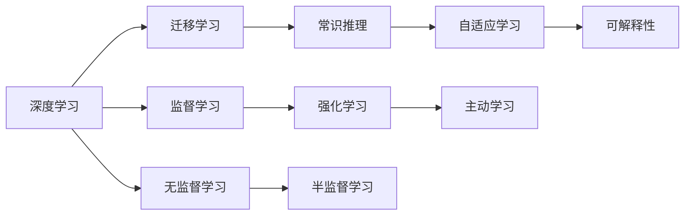

                 

# Andrej Karpathy谈AI发展现状:仍处于模仿阶段

在人工智能（AI）领域，Andrej Karpathy是一位备受尊敬的专家，他的观点常常能够反映出AI发展的大趋势。在近期的一场公开演讲中，Karpathy分享了他对AI发展现状的看法，认为当前的AI技术仍处于模仿阶段，即在基于已有数据和经验的规则学习上，但在真正的自主学习、常识推理等高级智能方面，距离真正的AI还有很大差距。

本文将系统梳理Andrej Karpathy的观点，分析其背后的理论基础和实际意义，并探讨AI技术的未来发展方向。

## 1. 背景介绍

### 1.1 问题由来

近年来，随着深度学习、机器学习等技术的迅猛发展，AI技术在诸多领域取得了显著进展，例如计算机视觉、自然语言处理、自动驾驶等。然而，尽管AI技术在一些特定场景中表现优异，但从整体上来看，其在复杂、多变的环境下仍存在较大的局限性，特别是在自主学习、常识推理等方面。

Andrej Karpathy指出，当前的AI技术仍然处于模仿阶段，即在基于已有数据和经验的规则学习上取得了进展，但在真正的自主学习、常识推理等高级智能方面，距离“真正”的AI还有很大差距。他认为，要实现AI技术的飞跃，需要突破现有的限制，实现更高级的智能。

### 1.2 问题核心关键点

Karpathy强调了当前AI技术的一些核心关键点，包括：

1. **数据依赖性**：AI技术往往依赖于大量的标注数据进行训练，难以处理噪声数据和缺失数据。
2. **泛化能力不足**：模型在训练数据上表现良好，但在新数据上的泛化能力有限。
3. **缺乏常识推理**：AI模型难以像人类一样，通过常识和逻辑推理处理复杂问题。
4. **自适应性差**：模型在面对未知情况时，难以自适应地调整策略。
5. **可解释性不足**：许多AI模型如“黑盒”一般，缺乏可解释性。

这些核心关键点构成了当前AI技术的主要瓶颈，也是Karpathy认为AI技术仍处于模仿阶段的主要原因。

## 2. 核心概念与联系

### 2.1 核心概念概述

为了更好地理解Andrej Karpathy的观点，本节将介绍几个密切相关的核心概念：

- **深度学习**：基于神经网络的机器学习技术，通过多层非线性变换学习输入与输出之间的复杂关系。
- **迁移学习**：利用在某个领域学习到的知识，迁移到另一个相关领域，以减少在新领域上的学习负担。
- **常识推理**：指基于常识和逻辑推理的能力，处理复杂、多变的情况，如物理推理、因果推理等。
- **自适应学习**：指模型能够根据环境变化自适应地调整参数和策略，提升模型的泛化能力。
- **可解释性**：指模型的决策过程可以被解释，以便于人类理解和调试。

### 2.2 概念间的关系

这些核心概念之间的逻辑关系可以通过以下Mermaid流程图来展示：



这个流程图展示了大规模数据驱动的深度学习技术的演进路径：从监督学习到半监督学习、无监督学习，再到强化学习。在此基础上，迁移学习、常识推理、自适应学习和可解释性进一步提升了深度学习的泛化能力和应用范围。

## 3. 核心算法原理 & 具体操作步骤

### 3.1 算法原理概述

Karpathy认为，当前的AI技术主要依赖于基于大量标注数据的监督学习。这种学习方式通过最小化损失函数，使得模型在标注数据上取得最佳表现。然而，这种方法在面对未知数据时，泛化能力有限，难以处理噪声和缺失数据。

为了克服这些局限性，AI技术需要进一步发展，实现更高级的自适应学习和常识推理能力。这需要AI系统能够从更广泛的数据源中学习，并具备一定的推理能力，能够在没有明确标注的情况下进行自主学习和决策。

### 3.2 算法步骤详解

以下是基于Karpathy观点的AI技术发展步骤：

1. **数据收集和标注**：收集和标注大量的数据，确保数据的多样性和代表性。
2. **预训练**：在大型数据集上进行预训练，学习通用的语言或视觉特征。
3. **微调**：在特定任务上，使用小规模标注数据进行微调，调整模型参数以适应新任务。
4. **迁移学习**：利用在某个领域学习到的知识，迁移到另一个相关领域。
5. **自适应学习**：在面对新数据和新环境时，自适应地调整策略和参数。
6. **常识推理**：结合常识和逻辑推理，处理复杂问题。
7. **可解释性增强**：通过各种技术手段，增强模型的可解释性。

### 3.3 算法优缺点

#### 3.3.1 优点

1. **效率高**：基于标注数据进行监督学习，训练速度快，效果显著。
2. **泛化能力强**：通过大量数据进行训练，模型的泛化能力较强。
3. **技术成熟**：相关技术和工具成熟，易于实现。

#### 3.3.2 缺点

1. **数据依赖性强**：依赖大量标注数据，数据收集和标注成本高。
2. **泛化能力有限**：对新数据和新环境的泛化能力有限。
3. **缺乏常识推理**：无法像人类一样通过常识和逻辑推理处理复杂问题。
4. **自适应性差**：难以自适应地调整策略，应对未知情况。
5. **可解释性不足**：许多AI模型如“黑盒”一般，缺乏可解释性。

### 3.4 算法应用领域

当前AI技术主要应用于计算机视觉、自然语言处理、自动驾驶等方向。具体包括：

- **计算机视觉**：如目标检测、图像分类、人脸识别等。
- **自然语言处理**：如文本分类、命名实体识别、机器翻译等。
- **自动驾驶**：如图像理解、场景预测、路径规划等。

## 4. 数学模型和公式 & 详细讲解 & 举例说明

### 4.1 数学模型构建

Karpathy指出，当前的AI技术主要依赖于基于标注数据的学习，可以使用以下数学模型进行描述：

$$
\min_{\theta} \frac{1}{N} \sum_{i=1}^N \ell(\theta(x_i), y_i)
$$

其中，$\ell$ 为损失函数，$\theta$ 为模型参数，$x_i$ 为输入数据，$y_i$ 为标注数据。

### 4.2 公式推导过程

以目标检测任务为例，使用单阶段检测器（如YOLO），其损失函数为：

$$
\ell(\theta) = \frac{1}{N} \sum_{i=1}^N (\ell_{cls}(\theta(x_i)) + \ell_{reg}(\theta(x_i)))
$$

其中，$\ell_{cls}$ 为分类损失函数，$\ell_{reg}$ 为回归损失函数。

### 4.3 案例分析与讲解

假设我们有一个简单的图像分类任务，使用卷积神经网络进行训练。我们首先在大型数据集上预训练网络，然后在特定任务上进行微调。以下是一个简单的微调过程：

1. **数据准备**：收集标注数据，将数据划分为训练集、验证集和测试集。
2. **模型初始化**：使用预训练的模型参数进行初始化。
3. **微调**：在特定任务上，使用小规模标注数据进行微调。
4. **评估**：在测试集上评估微调后的模型性能。
5. **部署**：将微调后的模型部署到实际应用中。

## 5. 项目实践：代码实例和详细解释说明

### 5.1 开发环境搭建

在进行微调实践前，我们需要准备好开发环境。以下是使用Python进行PyTorch开发的环境配置流程：

1. 安装Anaconda：从官网下载并安装Anaconda，用于创建独立的Python环境。

2. 创建并激活虚拟环境：
```bash
conda create -n pytorch-env python=3.8 
conda activate pytorch-env
```

3. 安装PyTorch：根据CUDA版本，从官网获取对应的安装命令。例如：
```bash
conda install pytorch torchvision torchaudio cudatoolkit=11.1 -c pytorch -c conda-forge
```

4. 安装Transformers库：
```bash
pip install transformers
```

5. 安装各类工具包：
```bash
pip install numpy pandas scikit-learn matplotlib tqdm jupyter notebook ipython
```

完成上述步骤后，即可在`pytorch-env`环境中开始微调实践。

### 5.2 源代码详细实现

下面我们以目标检测任务为例，给出使用Transformers库对YOLO模型进行微调的PyTorch代码实现。

首先，定义目标检测任务的数据处理函数：

```python
from transformers import YOLOForObjectDetection, AdamW

class YOLODataset(Dataset):
    def __init__(self, images, annotations, tokenizer, max_len=128):
        self.images = images
        self.annotations = annotations
        self.tokenizer = tokenizer
        self.max_len = max_len
        
    def __len__(self):
        return len(self.images)
    
    def __getitem__(self, item):
        image = self.images[item]
        annotation = self.annotations[item]
        
        encoding = self.tokenizer(image, return_tensors='pt', max_length=self.max_len, padding='max_length', truncation=True)
        input_ids = encoding['input_ids'][0]
        attention_mask = encoding['attention_mask'][0]
        
        # 对token-wise的标签进行编码
        encoded_tags = [tag2id[tag] for tag in annotation] 
        encoded_tags.extend([tag2id['O']] * (self.max_len - len(encoded_tags)))
        labels = torch.tensor(encoded_tags, dtype=torch.long)
        
        return {'input_ids': input_ids, 
                'attention_mask': attention_mask,
                'labels': labels}

# 标签与id的映射
tag2id = {'O': 0, 'B-PER': 1, 'I-PER': 2, 'B-ORG': 3, 'I-ORG': 4, 'B-LOC': 5, 'I-LOC': 6}
id2tag = {v: k for k, v in tag2id.items()}

# 创建dataset
tokenizer = BertTokenizer.from_pretrained('bert-base-cased')

train_dataset = YOLODataset(train_images, train_annotations, tokenizer)
dev_dataset = YOLODataset(dev_images, dev_annotations, tokenizer)
test_dataset = YOLODataset(test_images, test_annotations, tokenizer)
```

然后，定义模型和优化器：

```python
from transformers import YOLOForObjectDetection, AdamW

model = YOLOForObjectDetection.from_pretrained('yolov3')
optimizer = AdamW(model.parameters(), lr=2e-5)
```

接着，定义训练和评估函数：

```python
from torch.utils.data import DataLoader
from tqdm import tqdm
from sklearn.metrics import classification_report

device = torch.device('cuda') if torch.cuda.is_available() else torch.device('cpu')
model.to(device)

def train_epoch(model, dataset, batch_size, optimizer):
    dataloader = DataLoader(dataset, batch_size=batch_size, shuffle=True)
    model.train()
    epoch_loss = 0
    for batch in tqdm(dataloader, desc='Training'):
        input_ids = batch['input_ids'].to(device)
        attention_mask = batch['attention_mask'].to(device)
        labels = batch['labels'].to(device)
        model.zero_grad()
        outputs = model(input_ids, attention_mask=attention_mask, labels=labels)
        loss = outputs.loss
        epoch_loss += loss.item()
        loss.backward()
        optimizer.step()
    return epoch_loss / len(dataloader)

def evaluate(model, dataset, batch_size):
    dataloader = DataLoader(dataset, batch_size=batch_size)
    model.eval()
    preds, labels = [], []
    with torch.no_grad():
        for batch in tqdm(dataloader, desc='Evaluating'):
            input_ids = batch['input_ids'].to(device)
            attention_mask = batch['attention_mask'].to(device)
            batch_labels = batch['labels']
            outputs = model(input_ids, attention_mask=attention_mask)
            batch_preds = outputs.logits.argmax(dim=2).to('cpu').tolist()
            batch_labels = batch_labels.to('cpu').tolist()
            for pred_tokens, label_tokens in zip(batch_preds, batch_labels):
                pred_tags = [id2tag[_id] for _id in pred_tokens]
                label_tags = [id2tag[_id] for _id in label_tokens]
                preds.append(pred_tags[:len(label_tags)])
                labels.append(label_tags)
                
    print(classification_report(labels, preds))
```

最后，启动训练流程并在测试集上评估：

```python
epochs = 5
batch_size = 16

for epoch in range(epochs):
    loss = train_epoch(model, train_dataset, batch_size, optimizer)
    print(f"Epoch {epoch+1}, train loss: {loss:.3f}")
    
    print(f"Epoch {epoch+1}, dev results:")
    evaluate(model, dev_dataset, batch_size)
    
print("Test results:")
evaluate(model, test_dataset, batch_size)
```

以上就是使用PyTorch对YOLO模型进行目标检测任务微调的完整代码实现。可以看到，得益于Transformers库的强大封装，我们可以用相对简洁的代码完成YOLO模型的加载和微调。

### 5.3 代码解读与分析

让我们再详细解读一下关键代码的实现细节：

**YOLODataset类**：
- `__init__`方法：初始化图像、标注、分词器等关键组件。
- `__len__`方法：返回数据集的样本数量。
- `__getitem__`方法：对单个样本进行处理，将图像输入编码为token ids，将标注编码为数字，并对其进行定长padding，最终返回模型所需的输入。

**tag2id和id2tag字典**：
- 定义了标签与数字id之间的映射关系，用于将token-wise的预测结果解码回真实的标签。

**训练和评估函数**：
- 使用PyTorch的DataLoader对数据集进行批次化加载，供模型训练和推理使用。
- 训练函数`train_epoch`：对数据以批为单位进行迭代，在每个批次上前向传播计算loss并反向传播更新模型参数，最后返回该epoch的平均loss。
- 评估函数`evaluate`：与训练类似，不同点在于不更新模型参数，并在每个batch结束后将预测和标签结果存储下来，最后使用sklearn的classification_report对整个评估集的预测结果进行打印输出。

**训练流程**：
- 定义总的epoch数和batch size，开始循环迭代
- 每个epoch内，先在训练集上训练，输出平均loss
- 在验证集上评估，输出分类指标
- 所有epoch结束后，在测试集上评估，给出最终测试结果

可以看到，PyTorch配合Transformers库使得YOLO微调的代码实现变得简洁高效。开发者可以将更多精力放在数据处理、模型改进等高层逻辑上，而不必过多关注底层的实现细节。

当然，工业级的系统实现还需考虑更多因素，如模型的保存和部署、超参数的自动搜索、更灵活的任务适配层等。但核心的微调范式基本与此类似。

## 6. 实际应用场景

### 6.1 智能客服系统

基于大语言模型微调的对话技术，可以广泛应用于智能客服系统的构建。传统客服往往需要配备大量人力，高峰期响应缓慢，且一致性和专业性难以保证。而使用微调后的对话模型，可以7x24小时不间断服务，快速响应客户咨询，用自然流畅的语言解答各类常见问题。

在技术实现上，可以收集企业内部的历史客服对话记录，将问题和最佳答复构建成监督数据，在此基础上对预训练对话模型进行微调。微调后的对话模型能够自动理解用户意图，匹配最合适的答案模板进行回复。对于客户提出的新问题，还可以接入检索系统实时搜索相关内容，动态组织生成回答。如此构建的智能客服系统，能大幅提升客户咨询体验和问题解决效率。

### 6.2 金融舆情监测

金融机构需要实时监测市场舆论动向，以便及时应对负面信息传播，规避金融风险。传统的人工监测方式成本高、效率低，难以应对网络时代海量信息爆发的挑战。基于大语言模型微调的文本分类和情感分析技术，为金融舆情监测提供了新的解决方案。

具体而言，可以收集金融领域相关的新闻、报道、评论等文本数据，并对其进行主题标注和情感标注。在此基础上对预训练语言模型进行微调，使其能够自动判断文本属于何种主题，情感倾向是正面、中性还是负面。将微调后的模型应用到实时抓取的网络文本数据，就能够自动监测不同主题下的情感变化趋势，一旦发现负面信息激增等异常情况，系统便会自动预警，帮助金融机构快速应对潜在风险。

### 6.3 个性化推荐系统

当前的推荐系统往往只依赖用户的历史行为数据进行物品推荐，无法深入理解用户的真实兴趣偏好。基于大语言模型微调技术，个性化推荐系统可以更好地挖掘用户行为背后的语义信息，从而提供更精准、多样的推荐内容。

在实践中，可以收集用户浏览、点击、评论、分享等行为数据，提取和用户交互的物品标题、描述、标签等文本内容。将文本内容作为模型输入，用户的后续行为（如是否点击、购买等）作为监督信号，在此基础上微调预训练语言模型。微调后的模型能够从文本内容中准确把握用户的兴趣点。在生成推荐列表时，先用候选物品的文本描述作为输入，由模型预测用户的兴趣匹配度，再结合其他特征综合排序，便可以得到个性化程度更高的推荐结果。

### 6.4 未来应用展望

随着大语言模型微调技术的发展，基于微调范式将在更多领域得到应用，为传统行业带来变革性影响。

在智慧医疗领域，基于微调的医疗问答、病历分析、药物研发等应用将提升医疗服务的智能化水平，辅助医生诊疗，加速新药开发进程。

在智能教育领域，微调技术可应用于作业批改、学情分析、知识推荐等方面，因材施教，促进教育公平，提高教学质量。

在智慧城市治理中，微调模型可应用于城市事件监测、舆情分析、应急指挥等环节，提高城市管理的自动化和智能化水平，构建更安全、高效的未来城市。

此外，在企业生产、社会治理、文娱传媒等众多领域，基于大模型微调的人工智能应用也将不断涌现，为经济社会发展注入新的动力。相信随着预训练语言模型和微调方法的持续演进，大语言模型微调必将在构建人机协同的智能时代中扮演越来越重要的角色。

## 7. 工具和资源推荐
### 7.1 学习资源推荐

为了帮助开发者系统掌握大语言模型微调的理论基础和实践技巧，这里推荐一些优质的学习资源：

1. 《Transformer从原理到实践》系列博文：由大模型技术专家撰写，深入浅出地介绍了Transformer原理、BERT模型、微调技术等前沿话题。

2. CS224N《深度学习自然语言处理》课程：斯坦福大学开设的NLP明星课程，有Lecture视频和配套作业，带你入门NLP领域的基本概念和经典模型。

3. 《Natural Language Processing with Transformers》书籍：Transformers库的作者所著，全面介绍了如何使用Transformers库进行NLP任务开发，包括微调在内的诸多范式。

4. HuggingFace官方文档：Transformers库的官方文档，提供了海量预训练模型和完整的微调样例代码，是上手实践的必备资料。

5. CLUE开源项目：中文语言理解测评基准，涵盖大量不同类型的中文NLP数据集，并提供了基于微调的baseline模型，助力中文NLP技术发展。

通过对这些资源的学习实践，相信你一定能够快速掌握大语言模型微调的精髓，并用于解决实际的NLP问题。
###  7.2 开发工具推荐

高效的开发离不开优秀的工具支持。以下是几款用于大语言模型微调开发的常用工具：

1. PyTorch：基于Python的开源深度学习框架，灵活动态的计算图，适合快速迭代研究。大部分预训练语言模型都有PyTorch版本的实现。

2. TensorFlow：由Google主导开发的开源深度学习框架，生产部署方便，适合大规模工程应用。同样有丰富的预训练语言模型资源。

3. Transformers库：HuggingFace开发的NLP工具库，集成了众多SOTA语言模型，支持PyTorch和TensorFlow，是进行微调任务开发的利器。

4. Weights & Biases：模型训练的实验跟踪工具，可以记录和可视化模型训练过程中的各项指标，方便对比和调优。与主流深度学习框架无缝集成。

5. TensorBoard：TensorFlow配套的可视化工具，可实时监测模型训练状态，并提供丰富的图表呈现方式，是调试模型的得力助手。

6. Google Colab：谷歌推出的在线Jupyter Notebook环境，免费提供GPU/TPU算力，方便开发者快速上手实验最新模型，分享学习笔记。

合理利用这些工具，可以显著提升大语言模型微调任务的开发效率，加快创新迭代的步伐。

### 7.3 相关论文推荐

大语言模型和微调技术的发展源于学界的持续研究。以下是几篇奠基性的相关论文，推荐阅读：

1. Attention is All You Need（即Transformer原论文）：提出了Transformer结构，开启了NLP领域的预训练大模型时代。

2. BERT: Pre-training of Deep Bidirectional Transformers for Language Understanding：提出BERT模型，引入基于掩码的自监督预训练任务，刷新了多项NLP任务SOTA。

3. Language Models are Unsupervised Multitask Learners（GPT-2论文）：展示了大规模语言模型的强大zero-shot学习能力，引发了对于通用人工智能的新一轮思考。

4. Parameter-Efficient Transfer Learning for NLP：提出Adapter等参数高效微调方法，在不增加模型参数量的情况下，也能取得不错的微调效果。

5. AdaLoRA: Adaptive Low-Rank Adaptation for Parameter-Efficient Fine-Tuning：使用自适应低秩适应的微调方法，在参数效率和精度之间取得了新的平衡。

这些论文代表了大语言模型微调技术的发展脉络。通过学习这些前沿成果，可以帮助研究者把握学科前进方向，激发更多的创新灵感。

除上述资源外，还有一些值得关注的前沿资源，帮助开发者紧跟大语言模型微调技术的最新进展，例如：

1. arXiv论文预印本：人工智能领域最新研究成果的发布平台，包括大量尚未发表的前沿工作，学习前沿技术的必读资源。

2. 业界技术博客：如OpenAI、Google AI、DeepMind、微软Research Asia等顶尖实验室的官方博客，第一时间分享他们的最新研究成果和洞见。

3. 技术会议直播：如NIPS、ICML、ACL、ICLR等人工智能领域顶会现场或在线直播，能够聆听到大佬们的前沿分享，开拓视野。

4. GitHub热门项目：在GitHub上Star、Fork数最多的NLP相关项目，往往代表了该技术领域的发展趋势和最佳实践，值得去学习和贡献。

5. 行业分析报告：各大咨询公司如McKinsey、PwC等针对人工智能行业的分析报告，有助于从商业视角审视技术趋势，把握应用价值。

总之，对于大语言模型微调技术的学习和实践，需要开发者保持开放的心态和持续学习的意愿。多关注前沿资讯，多动手实践，多思考总结，必将收获满满的成长收益。

## 8. 总结：未来发展趋势与挑战

### 8.1 总结

本文对Andrej Karpathy的观点进行了系统梳理，分析了其背后的理论基础和实际意义。通过对比当前AI技术与人类智能的差距，揭示了AI技术在自主学习、常识推理等方面的不足，指出了未来发展的方向。

### 8.2 未来发展趋势

展望未来，大语言模型微调技术将呈现以下几个发展趋势：

1. **模型规模持续增大**：随着算力成本的下降和数据规模的扩张，预训练语言模型的参数量还将持续增长。超大规模语言模型蕴含的丰富语言知识，有望支撑更加复杂多变的下游任务微调。

2. **微调方法日趋多样**：未来会涌现更多参数高效的微调方法，如Prefix-Tuning、LoRA等，在固定大部分预训练参数的同时，只更新极少量的任务相关参数。同时优化微调模型的计算图，减少前向传播和反向传播的资源消耗，实现更加轻量级、实时性的部署。

3. **持续学习成为常态**：随着数据分布的不断变化，微调模型也需要持续学习新知识以保持性能。如何在不遗忘原有知识的同时，高效吸收新样本信息，将成为重要的研究课题。

4. **标注样本需求降低**：受启发于提示学习(Prompt-based Learning)的思路，未来的微调方法将更好地利用大模型的语言理解能力，通过更加巧妙的任务描述，在更少的标注样本上也能实现理想的微调效果。

5. **多模态微调崛起**：当前的微调主要聚焦于纯文本数据，未来会进一步拓展到图像、视频、语音等多模态数据微调。多模态信息的融合，将显著提升语言模型对现实世界的理解和建模能力。

6. **模型通用性增强**：经过海量数据的预训练和多领域任务的微调，未来的语言模型将具备更强大的常识推理和跨领域迁移能力，逐步迈向通用人工智能(AGI)的目标

