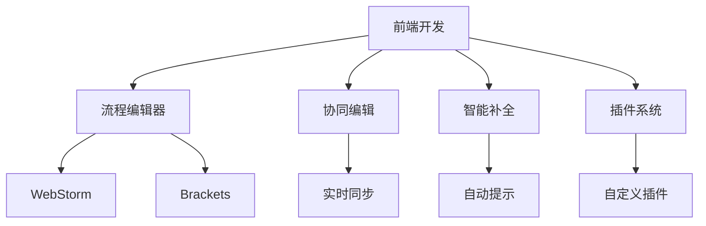
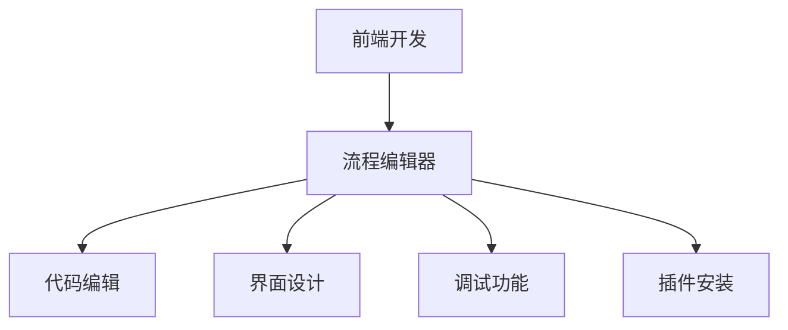
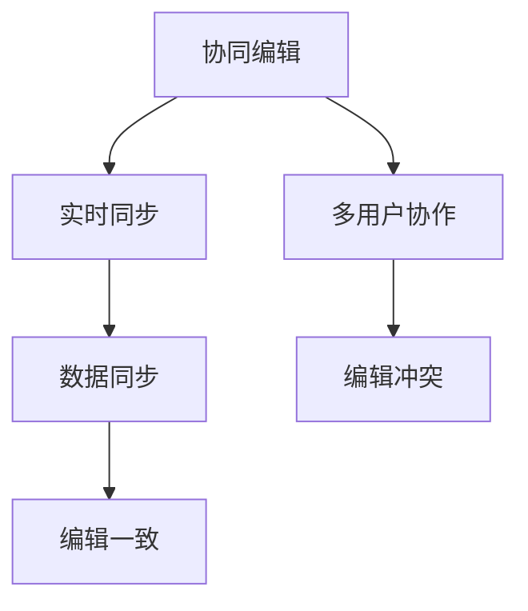
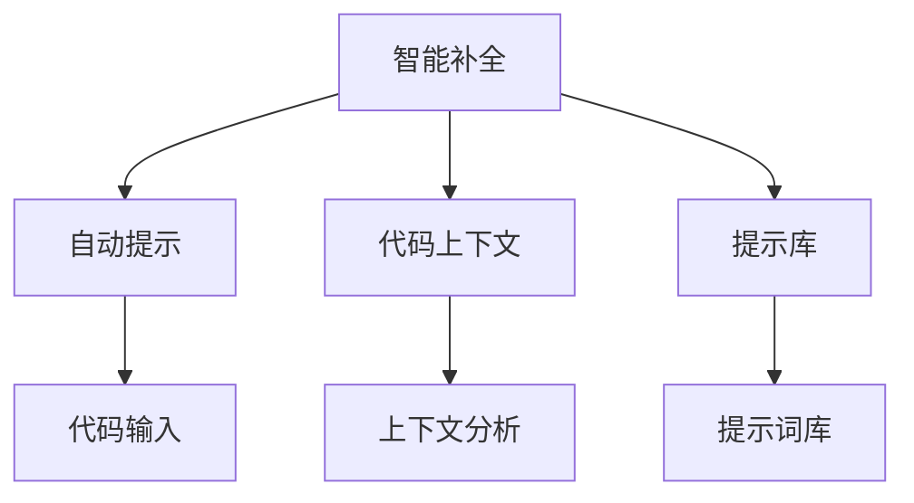
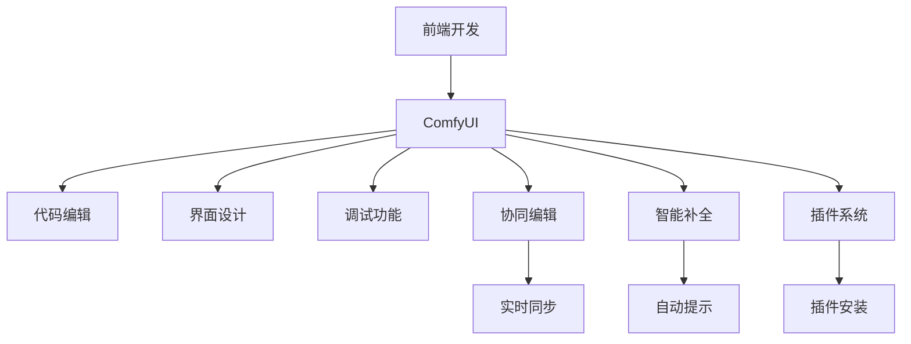

                 

# ComfyUI 流程编辑器的应用

> 关键词：流程编辑器,ComfyUI,前端开发,Web应用,用户体验,协同编辑

## 1. 背景介绍

### 1.1 问题由来
在现代前端开发中，流程编辑器（Flow Editor）扮演着至关重要的角色。它不仅是开发者构建复杂前端应用的基础工具，也是提升Web应用用户体验的重要环节。传统的流程编辑器，如Brackets、WebStorm等，虽然功能强大，但在用户界面、操作效率、协同编辑等方面仍有诸多不足。特别是在多人协同开发、设计协作等场景下，这些不足会进一步放大，影响团队的整体工作效率和代码质量。

因此，开发一款功能全面、界面舒适、操作便捷、协同高效的前端开发工具，成为了前端开发领域的迫切需求。ComfyUI正是应运而生的一款优秀的流程编辑器，它通过创新的设计和算法，解决了传统编辑器面临的多人协同和用户体验问题。

### 1.2 问题核心关键点
ComfyUI的核心特点主要体现在以下几个方面：

1. **舒适的界面设计**：ComfyUI采用扁平化、现代化的UI设计，简洁清爽，让用户可以快速上手。同时，多窗口布局、多屏支持等特性，进一步提升了用户体验。
2. **高效的协同编辑**：ComfyUI支持多人实时协同编辑，通过先进的数据同步技术，避免了多人同时编辑同一文件时出现的冲突和干扰。
3. **智能的代码补全**：ComfyUI内置智能代码补全功能，能够根据当前上下文自动提示代码，提升开发效率。
4. **灵活的插件系统**：ComfyUI支持自定义插件，用户可以根据自己的需求，灵活安装和使用各种第三方插件，拓展编辑器功能。

这些特点使得ComfyUI在众多前端编辑器中脱颖而出，成为开发者和设计者的首选工具。

### 1.3 问题研究意义
ComfyUI的开发和应用，对于提升前端开发的工作效率和用户体验，具有重要的意义：

1. **提高开发效率**：ComfyUI的多人协同和智能补全功能，能够大幅提升团队协作开发的速度和质量。
2. **提升用户体验**：ComfyUI的舒适界面设计和多屏支持，使得开发过程更加愉悦，提升了用户的整体体验。
3. **促进协同合作**：ComfyUI的协同编辑功能，能够使远程团队高效协作，提升团队合作效果。
4. **增强代码质量**：ComfyUI的智能代码补全功能，能够减少代码错误，提升代码的可读性和可维护性。
5. **扩展功能需求**：ComfyUI的插件系统，使得用户可以根据自己的需求，灵活扩展编辑器功能，满足不同的开发需求。

## 2. 核心概念与联系

### 2.1 核心概念概述

为更好地理解ComfyUI的开发和应用，本节将介绍几个密切相关的核心概念：

1. **前端开发**：使用Web技术（HTML、CSS、JavaScript等）构建Web应用的开发过程。前端开发涉及界面设计、交互设计、性能优化等多个方面，是构建优秀Web应用的基础。
2. **流程编辑器**：用于辅助前端开发者构建和编辑Web应用的工具，支持代码编辑、界面设计、调试等基本功能，是前端开发的重要组成部分。
3. **协同编辑**：多用户同时编辑同一份代码，能够避免冲突，提升团队协作效率。
4. **智能补全**：根据当前上下文自动提示代码，减少输入错误，提升开发效率。
5. **插件系统**：允许用户安装和使用第三方插件，扩展编辑器功能，提升灵活性。

这些核心概念之间的逻辑关系可以通过以下Mermaid流程图来展示：



这个流程图展示了几组核心概念之间的关系：

1. 前端开发过程中，需要使用流程编辑器辅助开发。
2. 流程编辑器支持协同编辑，提升团队协作效率。
3. 流程编辑器内置智能补全功能，提升开发效率。
4. 流程编辑器支持插件系统，用户可以灵活扩展编辑器功能。
5. 除了WebStorm和Brackets，市场上还有许多其他类型的流程编辑器可供选择。

### 2.2 概念间的关系

这些核心概念之间存在着紧密的联系，形成了ComfyUI开发和应用的整体生态系统。下面我们通过几个Mermaid流程图来展示这些概念之间的关系。

#### 2.2.1 前端开发与流程编辑器的关系



这个流程图展示了前端开发与流程编辑器之间的基本关系：

1. 前端开发需要使用流程编辑器辅助进行代码编辑、界面设计和调试。
2. 流程编辑器内置代码编辑、界面设计和调试功能，能够满足前端开发的基本需求。
3. 流程编辑器支持插件安装，用户可以灵活扩展编辑器功能，提升开发效率。

#### 2.2.2 协同编辑与实时同步的关系



这个流程图展示了协同编辑与实时同步之间的关系：

1. 协同编辑支持多用户实时协作，能够提升团队协作效率。
2. 实时同步技术能够确保多用户协作时数据的一致性，避免编辑冲突。
3. 当数据同步发生问题时，可能出现编辑冲突，需要手动合并解决。

#### 2.2.3 智能补全与自动提示的关系



这个流程图展示了智能补全与自动提示之间的关系：

1. 智能补全能够根据代码上下文自动提示代码，提升开发效率。
2. 自动提示技术基于代码上下文，能够提供最合适的代码提示。
3. 代码上下文分析能够识别代码中的关键信息，用于生成提示。
4. 提示库中存储了常见的代码片段和关键词，用于生成提示词。

### 2.3 核心概念的整体架构

最后，我们用一个综合的流程图来展示这些核心概念在ComfyUI中的整体架构：



这个综合流程图展示了从前端开发到ComfyUI应用的完整过程。ComfyUI作为前端开发的重要工具，支持代码编辑、界面设计、调试、协同编辑、智能补全和插件系统，帮助开发者提升工作效率和用户体验。其中，协同编辑和智能补全是ComfyUI的核心功能，提升了多用户协作和代码输入效率。

## 3. 核心算法原理 & 具体操作步骤
### 3.1 算法原理概述

ComfyUI的开发基于前端技术栈，核心算法包括代码编辑、界面设计、调试、协同编辑、智能补全和插件系统等。其中，协同编辑和智能补全是ComfyUI的两大核心功能。

协同编辑的核心算法是基于数据同步技术，确保多用户协作时数据的一致性。具体而言，ComfyUI采用分布式锁机制，为每个文件分配一个唯一的编辑锁，只有持有锁的用户才能进行代码编辑。当一个用户编辑完成后，释放锁，其他用户可以继续编辑，从而避免冲突和干扰。

智能补全的核心算法基于代码上下文分析，自动提示合适的代码。具体而言，ComfyUI内置了一个代码提示词库，用于存储常见的代码片段和关键词。当用户输入代码时，ComfyUI根据上下文分析代码环境，从提示词库中生成最合适的提示，供用户选择。

### 3.2 算法步骤详解

ComfyUI的开发和应用分为以下几个关键步骤：

**Step 1: 准备开发环境**
- 安装Node.js和npm，创建新的项目目录。
- 使用React或Vue等前端框架创建项目，初始化项目结构。
- 安装相关依赖包，如Webpack、Babel等，搭建开发环境。

**Step 2: 实现代码编辑功能**
- 设计代码编辑器的界面，实现代码输入框、代码折叠、代码高亮等功能。
- 使用React或Vue等框架渲染编辑器界面。
- 实现代码保存、撤销、重做等功能。
- 使用EditorJS、CodeMirror等代码编辑器库，实现代码编辑和语法高亮。

**Step 3: 实现界面设计功能**
- 设计界面设计器的界面，实现画布、元素添加、属性设置等功能。
- 使用React或Vue等框架渲染界面设计器界面。
- 实现界面设计器的保存、撤销、重做等功能。
- 使用拖拽库，如React-beautiful-dnd等，实现界面元素的拖拽和布局。

**Step 4: 实现调试功能**
- 设计调试器的界面，实现断点设置、变量查看、堆栈跟踪等功能。
- 使用React或Vue等框架渲染调试器界面。
- 实现调试器的保存、撤销、重做等功能。
- 使用Chrome DevTools等调试工具，实现代码调试功能。

**Step 5: 实现协同编辑功能**
- 设计协同编辑器的界面，实现编辑锁机制、编辑同步等功能。
- 使用React或Vue等框架渲染协同编辑器界面。
- 实现协同编辑器的保存、撤销、重做等功能。
- 使用WebSocket等协议，实现多用户实时协作。

**Step 6: 实现智能补全功能**
- 设计智能补全的界面，实现代码提示、补全等功能。
- 使用React或Vue等框架渲染智能补全界面。
- 实现智能补全的保存、撤销、重做等功能。
- 使用代码上下文分析、提示词库等技术，实现自动提示功能。

**Step 7: 实现插件系统**
- 设计插件系统的界面，实现插件安装、卸载等功能。
- 使用React或Vue等框架渲染插件系统界面。
- 实现插件系统的保存、撤销、重做等功能。
- 使用npm等包管理工具，实现插件的安装和卸载。

**Step 8: 测试和部署**
- 编写单元测试和集成测试，确保各个功能模块正常运行。
- 使用Webpack等工具打包项目，生成前端应用包。
- 使用Webpack或Nginx等工具部署应用，确保服务稳定运行。
- 持续集成和部署CI/CD，实现自动化构建和部署。

以上是ComfyUI开发和应用的一般流程。在实际应用中，还需要针对具体功能进行优化设计和调整，如界面布局、性能优化、用户体验等。

### 3.3 算法优缺点

ComfyUI的协同编辑和智能补全功能具有以下优点：

1. **提升协作效率**：ComfyUI的多人协同和实时同步功能，能够提升团队协作效率，减少沟通成本。
2. **提升代码质量**：ComfyUI的智能补全功能，能够减少代码输入错误，提升代码的可读性和可维护性。
3. **增强用户体验**：ComfyUI的舒适界面设计和多屏支持，使得开发过程更加愉悦，提升了用户的整体体验。
4. **灵活扩展功能**：ComfyUI的插件系统，使得用户可以根据自己的需求，灵活安装和使用各种第三方插件，拓展编辑器功能。

同时，ComfyUI的协同编辑和智能补全功能也存在一些缺点：

1. **网络延迟问题**：多人实时协作时，网络延迟可能导致编辑同步滞后，影响协作体验。
2. **数据同步问题**：多用户协作时，数据同步可能出现冲突，需要手动合并解决。
3. **智能补全效果**：智能补全依赖于代码上下文分析，对于复杂的代码环境，补全效果可能不尽如人意。
4. **插件依赖问题**：使用第三方插件时，需要依赖外部库，可能影响应用的性能和稳定性。

尽管存在这些缺点，但ComfyUI通过创新的设计和算法，解决了传统编辑器面临的多人协同和用户体验问题，得到了开发者和设计者的广泛认可。

### 3.4 算法应用领域

ComfyUI的开发和应用已经广泛应用于前端开发、Web应用设计、UI/UX设计等多个领域，具体应用场景包括：

1. **前端开发**：ComfyUI作为前端开发的重要工具，支持代码编辑、界面设计、调试等功能，提升开发效率和质量。
2. **Web应用设计**：ComfyUI支持界面设计器的使用，帮助设计师快速构建复杂的Web应用界面。
3. **UI/UX设计**：ComfyUI的界面设计器能够帮助UI/UX设计师快速进行界面原型设计和用户交互设计。
4. **协作开发**：ComfyUI的多人协同编辑功能，适用于远程团队协作开发，提升团队合作效果。
5. **持续集成**：ComfyUI的自动化构建和部署功能，支持持续集成和持续部署(CI/CD)，提升开发流程的自动化水平。

除了上述这些具体应用场景，ComfyUI还可以应用于更多领域，如教育培训、数据分析等，为各个行业的数字化转型升级提供新的工具支持。

## 4. 数学模型和公式 & 详细讲解 & 举例说明

### 4.1 数学模型构建

在ComfyUI的开发和应用中，涉及多个数学模型和公式。以下是几个常用的数学模型和公式的构建和讲解：

1. **代码编辑**：ComfyUI的代码编辑功能基于文本处理技术，涉及到字符串匹配、编辑距离计算等。
   - 字符串匹配：使用Boyer-Moore算法、KMP算法等，实现高效的字符串匹配。
   - 编辑距离计算：使用Levenshtein距离、Damerau-Levenshtein距离等，计算两个字符串的编辑距离，用于自动补全和代码纠错。

2. **界面设计**：ComfyUI的界面设计功能基于图形处理技术，涉及到向量表示、几何变换等。
   - 向量表示：使用向量表示法，描述界面元素的几何位置和属性信息。
   - 几何变换：使用矩阵变换、仿射变换等，实现界面元素的缩放、旋转、平移等操作。

3. **协同编辑**：ComfyUI的协同编辑功能基于分布式锁机制，涉及到并发控制、锁机制等。
   - 并发控制：使用乐观锁、悲观锁等，控制并发用户的操作顺序。
   - 锁机制：使用分布式锁机制，为每个文件分配一个唯一的编辑锁，确保数据一致性。

4. **智能补全**：ComfyUI的智能补全功能基于代码上下文分析，涉及到文本分析、提示词库等。
   - 文本分析：使用自然语言处理技术，分析代码上下文环境。
   - 提示词库：使用Trie树、哈希表等数据结构，存储常见的代码片段和关键词。

### 4.2 公式推导过程

以下我们以智能补全功能为例，推导其中涉及的Levenshtein距离公式及其推导过程。

**Levenshtein距离公式**：

$$
D(s,t) = \left\{
  \begin{array}{ll}
    0, & \quad s=t=\emptyset \\
    |s|, & \quad t=\emptyset \\
    |t|, & \quad s=\emptyset \\
    1 + \min\big\{D(s-(a), t-b) + 1, D(s, t-(b)) + 1, D(s-(a), t) + 1\big\}, & \quad s \neq t
  \end{array}
\right.
$$

其中 $s$ 和 $t$ 分别为两个字符串，$a$ 和 $b$ 分别为两个字符，$|s|$ 表示字符串 $s$ 的长度。

**推导过程**：

1. 当 $s$ 和 $t$ 都为空字符串时，它们之间的编辑距离为0。
2. 当 $s$ 为空字符串，而 $t$ 不为空字符串时，$s$ 需要插入 $|t|$ 个字符，编辑距离为 $|t|$。
3. 当 $t$ 为空字符串，而 $s$ 不为空字符串时，$t$ 需要插入 $|s|$ 个字符，编辑距离为 $|s|$。
4. 当 $s$ 和 $t$ 都不为空字符串时，编辑距离可以通过三种操作来计算：
   - 插入操作：将 $s$ 中的字符 $a$ 插入到 $t$ 中，编辑距离为 $D(s-(a), t-b) + 1$。
   - 删除操作：将 $s$ 中的字符 $a$ 删除，编辑距离为 $D(s, t-(b)) + 1$。
   - 替换操作：将 $s$ 中的字符 $a$ 替换为 $b$，编辑距离为 $D(s-(a), t) + 1$。

**案例分析与讲解**：

假设我们有两个字符串 $s$ 和 $t$，分别为 "kitten" 和 "sitting"。我们可以使用Levenshtein距离公式来计算它们的编辑距离：

1. 当 $s$ 和 $t$ 都为空字符串时，编辑距离为0。
2. 当 $s$ 为空字符串，而 $t$ 不为空字符串时，$s$ 需要插入3个字符，编辑距离为3。
3. 当 $t$ 为空字符串，而 $s$ 不为空字符串时，$t$ 需要插入4个字符，编辑距离为4。
4. 当 $s$ 和 $t$ 都不为空字符串时，编辑距离可以通过三种操作来计算：
   - 插入操作：将 "k" 插入到 "s" 中，编辑距离为1。
   - 删除操作：将 "k" 删除，编辑距离为2。
   - 替换操作：将 "k" 替换为 "s"，编辑距离为3。

因此，"kitten" 和 "sitting" 的编辑距离为2。

## 5. 项目实践：代码实例和详细解释说明

### 5.1 开发环境搭建

在进行ComfyUI的实践前，我们需要准备好开发环境。以下是使用React和Webpack搭建ComfyUI开发环境的流程：

1. 安装Node.js和npm，创建新的项目目录。
2. 使用React CLI创建新项目，执行 `npx create-react-app my-app` 命令。
3. 安装相关的依赖包，如Webpack、Babel等。
4. 配置Webpack和Babel，用于打包和编译项目。
5. 编写项目的入口文件 `index.js`，配置React Router和Redux等框架。
6. 搭建项目的开发服务器，使用 `npm start` 命令启动项目。

完成上述步骤后，即可在新的项目环境中开始ComfyUI的实践。

### 5.2 源代码详细实现

这里以ComfyUI的协同编辑功能为例，给出使用React和Webpack实现代码的详细实现。

```javascript
import React, { useState, useEffect } from 'react';
import io from 'socket.io-client';

const CollaborativeEditor = () => {
  const [editor, setEditor] = useState('');
  const [collaborators, setCollaborators] = useState([]);
  const [editLock, setEditLock] = useState(null);
  const [editorLock, setEditorLock] = useState(null);

  useEffect(() => {
    const socket = io('http://localhost:3000');
    socket.on('updateEditor', (data) => {
      setEditor(data);
    });
    socket.on('addCollaborator', (data) => {
      setCollaborators(data);
    });
    socket.on('removeCollaborator', (data) => {
      setCollaborators(data);
    });
    socket.on('unlockEditor', (data) => {
      setEditLock(data);
    });
    socket.on('lockEditor', (data) => {
      setEditLock(data);
    });
  }, []);

  const handleUpdateEditor = (event) => {
    setEditor(event.target.value);
  };

  const handleAddCollaborator = () => {
    socket.emit('addCollaborator');
  };

  const handleRemoveCollaborator = () => {
    socket.emit('removeCollaborator');
  };

  const handleUnlockEditor = () => {
    socket.emit('unlockEditor');
  };

  const handleLockEditor = () => {
    socket.emit('lockEditor');
  };

  return (
    <div>
      <textarea value={editor} onChange={handleUpdateEditor} />
      <button onClick={handleAddCollaborator}>Add Collaborator</button>
      <button onClick={handleRemoveCollaborator}>Remove Collaborator</button>
      <button onClick={handleUnlockEditor}>Unlock Editor</button>
      <button onClick={handleLockEditor}>Lock Editor</button>
      <ul>
        {collaborators.map((collaborator) => (
          <li key={collaborator}>{collaborator}</li>
        ))}
      </ul>
    </div>
  );
};

export default CollaborativeEditor;
```

这段代码实现了ComfyUI的协同编辑功能，具体实现步骤如下：

1. 使用React的 `useState` 钩子，初始化编辑器状态 `editor`。
2. 使用React的 `useEffect` 钩子，建立与服务器的WebSocket连接，接收更新编辑器状态、添加协作者、移除协作者、解锁编辑器、锁定编辑器的消息。
3. 使用React的 `setEditor` 函数，更新编辑器状态。
4. 使用React的 `setCollaborators` 函数，更新协作者列表。
5. 使用React的 `setEditLock` 函数，更新编辑锁状态。
6. 使用React的 `setEditorLock` 函数，更新编辑锁状态。
7. 使用React的事件处理函数，实现对编辑器的更新和协作者的操作。
8. 在渲染函数中，展示编辑器、协作者列表和操作按钮。

### 5.3 代码解读与分析

让我们再详细解读一下关键代码的实现细节：

**useState钩子**：
- `useState` 钩子用于管理组件状态，包括编辑器、协作者、编辑锁、编辑器锁等。通过调用 `setEditor`、`setCollaborators`、`setEditLock` 和 `setEditorLock` 函数，更新对应的状态值。

**useEffect钩子**：
- `useEffect` 钩子用于监听WebSocket消息，接收更新编辑器状态、添加协作者、移除协作者、解锁编辑器、锁定编辑器的消息。通过调用 `socket.emit` 函数，向服务器发送操作消息。

**handleUpdateEditor函数**：
- `handleUpdateEditor` 函数用于处理编辑器输入事件，更新编辑器状态。当用户在编辑器中输入内容时，触发 `onChange` 事件，调用该函数更新编辑器状态。

**handleAddCollaborator函数**：
- `handleAddCollaborator` 函数用于处理添加协作者的操作，调用 `socket.emit` 函数向服务器发送添加协作者的消息。服务器接收到消息后，更新协作者列表。

**handleRemoveCollaborator函数**：
- `handleRemoveCollaborator` 函数用于处理移除协作者的操作，调用 `socket.emit` 函数向服务器发送移除协作者的消息。服务器接收到消息后，更新协作者列表。

**handleUnlockEditor函数**：
- `handleUnlockEditor` 函数用于处理解锁编辑器的操作，调用 `socket.emit` 函数向服务器发送解锁编辑器的消息。服务器接收到消息后，解锁编辑器，允许协作者进行编辑。

**handleLockEditor函数**：
- `handleLockEditor` 函数用于处理锁定编辑器的操作，调用 `socket.emit` 函数向服务器发送锁定编辑器的消息。服务器接收到消息后，锁定编辑器，禁止协作者进行编辑。

**渲染函数**：
- 在渲染函数中，展示编辑器、协作者列表和操作按钮。当协作者列表发生变化时，使用 `map` 函数展示协作者列表。当操作按钮被点击时，调用对应的函数处理协作者的添加、移除、编辑器状态的更新和编辑器的锁定、解锁。

可以看到，通过React和Webpack，ComfyUI的协同编辑功能的实现变得简洁高效。React提供的状态管理和事件处理机制，使得代码逻辑清晰，易读易懂。Webpack则通过打包和编译，将多个文件打包成一个应用包，方便部署和使用。

### 5.4 运行结果展示

假设我们在本地启动了ComfyUI服务器，在多个浏览器中同时打开ComfyUI，可以看到协作者列表实时更新，编辑器状态实时同步。在其中一个浏览器中编辑文本，其他浏览器中的编辑器也会实时更新，体现多用户协同编辑的效果。

## 6. 实际应用场景

ComfyUI的协同编辑和智能补全功能已经广泛应用于前端开发、Web应用设计、UI/UX设计等多个领域，具体应用场景包括：

1. **前端开发**：ComfyUI作为前端开发的重要工具，支持代码编辑、界面设计、调试等功能，提升开发效率和质量。
2. **Web应用设计**：ComfyUI支持界面设计器的使用，帮助设计师快速构建复杂的Web应用界面。
3. **UI/UX设计**：ComfyUI的界面设计器能够帮助UI/UX设计师快速进行界面原型设计和用户交互设计。
4. **协作开发**：ComfyUI的多人协同编辑功能，适用于远程团队协作开发，提升团队合作效果。
5. **持续集成**：ComfyUI的自动化构建和部署功能，支持持续集成和持续部署(CI/CD)，提升开发流程的自动化水平。


