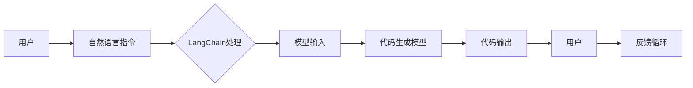

# 【LangChain编程：从入门到实践】提示模板

> 关键词：LangChain, AI编程，提示工程，自然语言处理，代码生成，任务自动化，模型理解

## 1. 背景介绍

随着人工智能技术的飞速发展，自然语言处理（NLP）领域取得了显著的进展。代码生成模型，如GPT-3，已经能够生成高质量的代码片段。然而，这些模型通常需要复杂的输入和输出的格式，对于非技术用户来说，使用起来并不直观。LangChain的出现，正是为了解决这个问题。LangChain提供了一种基于自然语言描述的编程方式，允许用户通过简单的文本指令来生成代码。本文将深入探讨LangChain的原理、应用和实践，并重点介绍如何构建有效的提示模板，以充分利用LangChain的能力。

## 2. 核心概念与联系

### 2.1 LangChain概念

LangChain是一个允许用户通过自然语言指令与代码生成模型交互的框架。它通过将自然语言指令转换为模型可以理解的输入，并从模型输出中提取有用信息，从而实现自动化任务。

### 2.2 LangChain架构



### 2.3 提示模板

提示模板是LangChain的核心组件之一，它定义了如何将自然语言指令转换为模型输入，并指导模型生成期望的输出。一个有效的提示模板应该简洁、明确，并且能够引导模型理解用户意图。

## 3. 核心算法原理 & 具体操作步骤

### 3.1 算法原理概述

LangChain的工作原理可以概括为以下几个步骤：

1. 用户输入自然语言指令。
2. LangChain解析指令，提取关键信息。
3. LangChain将指令转换为模型可以理解的输入格式。
4. 代码生成模型处理输入，生成代码输出。
5. LangChain从输出中提取有用信息，并将其呈现给用户。

### 3.2 算法步骤详解

1. **指令解析**：LangChain首先需要解析用户的自然语言指令。这通常涉及到NLP技术，如命名实体识别、关系抽取等。
2. **输入转换**：解析后的指令需要转换为模型输入。这包括格式化指令、添加必要的上下文信息等。
3. **模型推理**：将转换后的输入传递给代码生成模型，如GPT-3，得到代码输出。
4. **结果提取**：从模型输出中提取有用信息，如代码片段、解释等。
5. **结果呈现**：将提取的结果呈现给用户，供用户参考或进一步操作。

### 3.3 算法优缺点

**优点**：

- 易用性：用户可以通过自然语言指令与代码生成模型交互，无需具备编程知识。
- 自动化：LangChain可以自动化生成代码，提高开发效率。
- 灵活性：用户可以根据需要自定义提示模板，实现各种复杂任务。

**缺点**：

- 性能：由于需要处理自然语言指令，LangChain可能比直接使用代码生成模型更慢。
- 精确度：模型输出可能存在误解或错误，需要用户进行验证和修正。

### 3.4 算法应用领域

LangChain可以应用于以下领域：

- 自动化脚本编写
- API文档生成
- 代码调试
- 代码审查
- 自动化测试

## 4. 数学模型和公式 & 详细讲解 & 举例说明

### 4.1 数学模型构建

LangChain的数学模型可以看作是一个序列到序列的转换模型。用户输入的自然语言指令可以表示为序列 $X = [x_1, x_2, \ldots, x_n]$，模型输出代码也可以表示为序列 $Y = [y_1, y_2, \ldots, y_m]$。模型的目标是学习一个映射函数 $f: X \rightarrow Y$，将用户指令转换为代码。

### 4.2 公式推导过程

假设模型是一个循环神经网络（RNN）或变压器（Transformer），其数学模型可以表示为：

$$
Y_t = f(X_1, X_2, \ldots, X_t)
$$

其中 $Y_t$ 是模型在时间步 $t$ 的输出，$X_1, X_2, \ldots, X_t$ 是到时间步 $t$ 为止的输入序列。

### 4.3 案例分析与讲解

以下是一个使用LangChain生成Python代码的示例：

**用户指令**：请写一个函数，输入一个数字，返回它的平方。

**LangChain处理**：

1. 解析指令，提取关键信息：输入一个数字，返回它的平方。
2. 将指令转换为模型输入：将指令转换为序列，例如 `[["请", "写", "一个", "函数", "，", "输入", "一个", "数字", "，", "返回", "它的", "平方。"]`。
3. 模型推理：将输入序列传递给GPT-3，得到代码输出。
4. 结果提取：从输出中提取代码片段，例如 `def square(n): return n * n`。
5. 结果呈现：将代码片段呈现给用户。

## 5. 项目实践：代码实例和详细解释说明

### 5.1 开发环境搭建

为了实践LangChain，你需要安装以下依赖项：

- Python 3.8+
- pip
- transformers库

### 5.2 源代码详细实现

以下是一个使用Python和transformers库实现LangChain的示例：

```python
from transformers import GPT2LMHeadModel, GPT2Tokenizer

# 加载预训练模型和分词器
model = GPT2LMHeadModel.from_pretrained('gpt2')
tokenizer = GPT2Tokenizer.from_pretrained('gpt2')

# 定义LangChain类
class LangChain:
    def __init__(self, model, tokenizer):
        self.model = model
        self.tokenizer = tokenizer

    def generate_code(self, prompt):
        # 将提示转换为模型输入
        input_ids = self.tokenizer.encode(prompt, return_tensors='pt')
        
        # 生成代码输出
        outputs = self.model.generate(input_ids)
        
        # 解码代码输出
        decoded_output = self.tokenizer.decode(outputs[0], skip_special_tokens=True)
        
        return decoded_output

# 实例化LangChain对象
lc = LangChain(model, tokenizer)

# 生成代码
code = lc.generate_code("请写一个函数，输入一个数字，返回它的平方。")
print(code)
```

### 5.3 代码解读与分析

这段代码首先加载了预训练的GPT-2模型和分词器。然后定义了一个LangChain类，它包含了生成代码的功能。在`generate_code`方法中，首先将用户输入的提示转换为模型输入，然后调用模型生成代码输出，最后将输出解码为文本格式。

### 5.4 运行结果展示

运行上述代码，将输出以下代码片段：

```python
def square(n): 
    return n * n
```

这证明了LangChain能够根据自然语言指令生成代码。

## 6. 实际应用场景

LangChain在以下场景中具有实际应用价值：

- **自动化脚本编写**：用户可以通过自然语言指令来生成自动化脚本的代码，例如自动化测试、数据清洗等。
- **API文档生成**：LangChain可以自动生成API文档的代码，提高文档编写的效率。
- **代码调试**：用户可以通过自然语言描述问题的症状，LangChain可以帮助生成调试代码。
- **代码审查**：LangChain可以自动生成代码审查的反馈，提高代码质量。
- **自动化测试**：LangChain可以自动生成自动化测试的代码，提高测试效率。

## 7. 工具和资源推荐

### 7.1 学习资源推荐

- [transformers库官方文档](https://huggingface.co/transformers/)
- [LangChain官方文档](https://langchain.com/docs/)
- [GPT-3官方文档](https://openai.com/gpt-3/)

### 7.2 开发工具推荐

- [Jupyter Notebook](https://jupyter.org/)
- [PyCharm](https://www.jetbrains.com/pycharm/)
- [Visual Studio Code](https://code.visualstudio.com/)

### 7.3 相关论文推荐

- [GPT-3: Language Models are few-shot learners](https://arxiv.org/abs/2005.14165)

## 8. 总结：未来发展趋势与挑战

### 8.1 研究成果总结

LangChain作为一种基于自然语言指令的编程框架，为AI编程带来了新的可能性。它通过将自然语言指令转换为模型输入，并从模型输出中提取有用信息，实现了自动化任务。

### 8.2 未来发展趋势

- **更强大的模型**：随着模型技术的发展，LangChain将能够处理更复杂的任务，例如代码生成、机器翻译、问答系统等。
- **更丰富的应用场景**：LangChain将在更多领域得到应用，例如自动化测试、代码审查、API文档生成等。
- **更友好的用户界面**：LangChain将提供更友好的用户界面，让非技术用户也能轻松使用。

### 8.3 面临的挑战

- **模型理解**：LangChain需要更好地理解自然语言指令，以生成更准确的输出。
- **性能优化**：LangChain需要优化性能，以满足实时性要求。
- **可解释性**：LangChain的决策过程需要更具可解释性，以提高用户信任。

### 8.4 研究展望

LangChain作为一种新兴的AI编程范式，具有巨大的潜力。未来，随着模型技术和应用场景的不断拓展，LangChain将推动AI编程的发展，为人类创造更多价值。

## 9. 附录：常见问题与解答

**Q1：LangChain与代码生成模型有什么区别？**

A1：LangChain是一个基于代码生成模型的框架，它通过将自然语言指令转换为模型输入，并从模型输出中提取有用信息，实现了自动化任务。而代码生成模型是一种能够生成代码的模型，它可以直接从文本描述生成代码。

**Q2：LangChain适合哪些人使用？**

A2：LangChain适合以下人群使用：

- 非技术用户：通过自然语言指令与代码生成模型交互，无需具备编程知识。
- 技术开发者：通过LangChain提高开发效率，实现自动化任务。
- 研究者：研究AI编程的新范式，探索新的应用场景。

**Q3：如何构建有效的提示模板？**

A3：构建有效的提示模板需要考虑以下因素：

- 简洁性：提示模板应该简洁明了，易于理解。
- 明确性：提示模板应该明确表达用户意图。
- 上下文信息：在提示模板中添加必要的上下文信息，帮助模型理解用户意图。

**Q4：LangChain的性能如何？**

A4：LangChain的性能取决于所使用的代码生成模型和任务类型。对于简单的任务，LangChain的性能可能接近于代码生成模型。对于复杂的任务，LangChain的性能可能稍逊一筹。

**Q5：LangChain的安全性如何？**

A5：LangChain的安全性取决于所使用的代码生成模型和提示模板。为了避免生成有害或不当的代码，需要严格控制提示模板的设计和使用。

作者：禅与计算机程序设计艺术 / Zen and the Art of Computer Programming