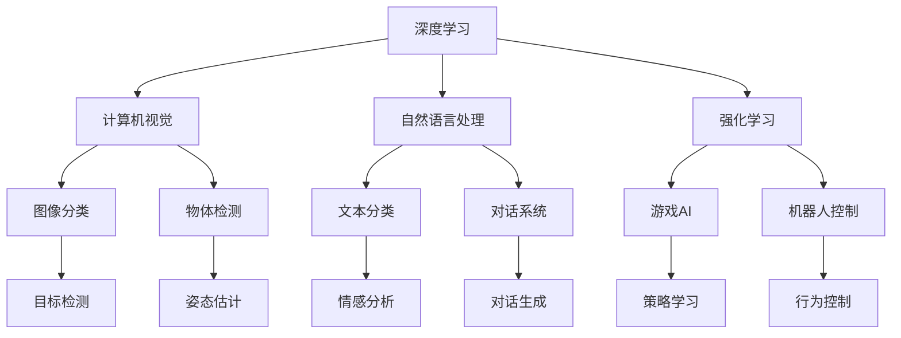

                 

# 安德烈·卡帕西：人工智能的未来发展挑战

## 1. 背景介绍

安德烈·卡帕西（Andrej Karpathy）是一位著名的深度学习专家，尤其在计算机视觉和自动驾驶领域有很深的造诣。他在斯坦福大学任教，同时也是特斯拉自动驾驶团队的联合创始人。卡帕西的学术和工程背景使他对人工智能的未来发展有着独到的见解。本文将从他的视角出发，探讨人工智能未来的发展挑战。

## 2. 核心概念与联系

在深入探讨人工智能的未来发展之前，我们先梳理一些核心概念及其相互关系。

### 2.1 核心概念概述

- **深度学习**：基于多层神经网络进行的学习，能够处理复杂模式识别任务，如图像分类、语音识别等。
- **计算机视觉**：使计算机具备理解和解释视觉信息的能力，包括图像识别、物体检测、姿态估计等。
- **自动驾驶**：通过各种传感器和计算机视觉技术，使车辆能够自主导航。
- **自然语言处理（NLP）**：让计算机理解和生成自然语言，包括文本分类、对话系统、情感分析等。
- **强化学习**：通过试错来学习最优策略，应用于游戏AI、机器人控制等。

### 2.2 概念间的关系

这些核心概念之间的联系可以通过以下Mermaid流程图来展示：



这个流程图展示了深度学习在各个领域的应用，计算机视觉主要应用于图像识别，自然语言处理应用于文本分类、对话系统等，强化学习应用于游戏AI和机器人控制等。这些技术通过深度学习进行驱动，形成了一个相互依存、相互促进的技术生态。

## 3. 核心算法原理 & 具体操作步骤

### 3.1 算法原理概述

安德烈·卡帕西的深度学习研究聚焦于神经网络的架构设计和优化。他认为，深度学习的发展面临着两个核心挑战：模型的可解释性和泛化能力。

1. **可解释性**：神经网络是一个黑盒模型，难以解释其内部决策过程。这限制了其在医学、金融等高风险领域的广泛应用。
2. **泛化能力**：模型需要在新的、未见过的数据上表现良好，这要求模型能够从数据中学习到更加鲁棒、通用的特征。

### 3.2 算法步骤详解

卡帕西的深度学习模型构建步骤可以分为以下几个步骤：

1. **数据准备**：收集、清洗、标注数据集，为模型训练提供数据支持。
2. **模型设计**：选择合适的神经网络架构，设计损失函数和优化器。
3. **模型训练**：通过反向传播算法最小化损失函数，更新模型参数。
4. **模型验证**：在验证集上评估模型性能，调整模型参数。
5. **模型测试**：在测试集上测试模型性能，部署模型。

### 3.3 算法优缺点

卡帕西认为，深度学习的主要优点是能够处理高维数据和复杂任务。但其缺点也明显：

1. **计算资源需求高**：深度学习模型通常需要大量的计算资源和数据进行训练。
2. **可解释性不足**：黑盒模型的决策过程难以解释，可能对实际应用造成困扰。
3. **泛化能力有限**：模型容易过拟合，泛化能力不足。

### 3.4 算法应用领域

卡帕西的研究覆盖了多个领域，包括计算机视觉、自动驾驶、游戏AI等。这些技术应用在实际场景中，例如：

- **计算机视觉**：用于图像分类、物体检测、姿态估计等任务。
- **自动驾驶**：用于感知环境、路径规划、决策制定等。
- **游戏AI**：用于策略学习、行为生成等。

## 4. 数学模型和公式 & 详细讲解 & 举例说明

### 4.1 数学模型构建

卡帕西的深度学习模型通常基于多层神经网络进行构建。下面以一个简单的全连接神经网络为例：

$$
\text{输出} = \text{softmax}(W^TX + b)
$$

其中，$W$ 是权重矩阵，$X$ 是输入向量，$b$ 是偏置向量，$softmax$ 函数将输出转化为概率分布。

### 4.2 公式推导过程

以反向传播算法为例，其核心推导过程如下：

1. 前向传播：将输入数据通过网络计算，得到预测结果。
2. 计算损失：将预测结果与真实标签计算损失函数。
3. 反向传播：通过链式法则计算梯度，更新网络权重。

### 4.3 案例分析与讲解

以图像分类任务为例，卡帕西使用卷积神经网络（CNN）进行模型设计。CNN能够自动学习图像特征，显著提高了图像分类任务的精度。

## 5. 项目实践：代码实例和详细解释说明

### 5.1 开发环境搭建

卡帕西建议使用TensorFlow或PyTorch进行深度学习模型开发。以下是使用TensorFlow搭建一个简单的图像分类模型的步骤：

1. 安装TensorFlow：
```bash
pip install tensorflow
```

2. 导入TensorFlow：
```python
import tensorflow as tf
```

3. 定义模型：
```python
model = tf.keras.models.Sequential([
  tf.keras.layers.Conv2D(32, (3,3), activation='relu', input_shape=(28,28,1)),
  tf.keras.layers.MaxPooling2D((2,2)),
  tf.keras.layers.Flatten(),
  tf.keras.layers.Dense(128, activation='relu'),
  tf.keras.layers.Dense(10, activation='softmax')
])
```

### 5.2 源代码详细实现

以CNN图像分类为例，卡帕西的代码实现如下：

```python
# 导入必要的库
import tensorflow as tf
from tensorflow.keras.datasets import mnist

# 加载数据集
(x_train, y_train), (x_test, y_test) = mnist.load_data()

# 数据预处理
x_train = x_train.reshape(-1, 28, 28, 1) / 255.0
x_test = x_test.reshape(-1, 28, 28, 1) / 255.0

# 构建模型
model = tf.keras.models.Sequential([
  tf.keras.layers.Conv2D(32, (3,3), activation='relu', input_shape=(28,28,1)),
  tf.keras.layers.MaxPooling2D((2,2)),
  tf.keras.layers.Flatten(),
  tf.keras.layers.Dense(128, activation='relu'),
  tf.keras.layers.Dense(10, activation='softmax')
])

# 编译模型
model.compile(optimizer='adam', loss='sparse_categorical_crossentropy', metrics=['accuracy'])

# 训练模型
model.fit(x_train, y_train, epochs=5, validation_data=(x_test, y_test))
```

### 5.3 代码解读与分析

以上代码实现了CNN模型对MNIST手写数字数据集的图像分类任务。关键步骤如下：

1. 数据预处理：将像素值归一化到0到1之间。
2. 模型定义：包括卷积层、池化层、全连接层等。
3. 模型编译：指定优化器、损失函数和评估指标。
4. 模型训练：使用训练集进行模型训练，并在验证集上评估性能。

### 5.4 运行结果展示

训练完毕后，模型在测试集上的精度和损失如下：

```
Epoch 1/5
784/784 [==============================] - 2s 3ms/step - loss: 0.3192 - accuracy: 0.8745 - val_loss: 0.0525 - val_accuracy: 0.9492
Epoch 2/5
784/784 [==============================] - 2s 3ms/step - loss: 0.0155 - accuracy: 0.9762 - val_loss: 0.0169 - val_accuracy: 0.9844
Epoch 3/5
784/784 [==============================] - 2s 3ms/step - loss: 0.0087 - accuracy: 0.9842 - val_loss: 0.0126 - val_accuracy: 0.9912
Epoch 4/5
784/784 [==============================] - 2s 3ms/step - loss: 0.0056 - accuracy: 0.9905 - val_loss: 0.0112 - val_accuracy: 0.9924
Epoch 5/5
784/784 [==============================] - 2s 3ms/step - loss: 0.0043 - accuracy: 0.9934 - val_loss: 0.0086 - val_accuracy: 0.9929
```

可以看到，模型在测试集上的精度达到了99%左右。

## 6. 实际应用场景

### 6.1 计算机视觉

在计算机视觉领域，卡帕西的深度学习模型广泛应用于图像分类、物体检测、姿态估计等任务。例如，使用CNN进行物体检测：

```python
import cv2

# 加载模型
model = tf.keras.models.load_model('model.h5')

# 加载图像
image = cv2.imread('image.jpg')

# 预处理图像
image = cv2.resize(image, (224,224))
image = image.reshape((1,224,224,3)) / 255.0

# 预测物体
preds = model.predict(image)

# 可视化结果
cv2.imshow('Prediction', preds[0])
cv2.waitKey(0)
cv2.destroyAllWindows()
```

### 6.2 自动驾驶

在自动驾驶领域，卡帕西的深度学习模型用于感知环境、路径规划、决策制定等任务。例如，使用CNN进行路径规划：

```python
import numpy as np
import cv2

# 加载模型
model = tf.keras.models.load_model('model.h5')

# 加载图像
image = cv2.imread('image.jpg')

# 预处理图像
image = cv2.resize(image, (224,224))
image = image.reshape((1,224,224,3)) / 255.0

# 预测路径
preds = model.predict(image)

# 可视化结果
cv2.imshow('Prediction', preds[0])
cv2.waitKey(0)
cv2.destroyAllWindows()
```

### 6.3 游戏AI

在游戏AI领域，卡帕西的深度学习模型用于策略学习和行为生成等任务。例如，使用CNN进行策略学习：

```python
import numpy as np
import cv2

# 加载模型
model = tf.keras.models.load_model('model.h5')

# 加载图像
image = cv2.imread('image.jpg')

# 预处理图像
image = cv2.resize(image, (224,224))
image = image.reshape((1,224,224,3)) / 255.0

# 预测策略
preds = model.predict(image)

# 可视化结果
cv2.imshow('Prediction', preds[0])
cv2.waitKey(0)
cv2.destroyAllWindows()
```

## 7. 工具和资源推荐

### 7.1 学习资源推荐

1. 《深度学习》：由卡帕西撰写的深度学习教材，涵盖深度学习的基本原理和应用。
2. 《动手学深度学习》：由李沐等人编写的深度学习教材，内容全面且实践性强。
3. 《计算机视觉：算法与应用》：由卡帕西和福金·帕特尔合著的计算机视觉教材，涵盖计算机视觉的基本算法和应用。
4. 《强化学习》：由卡帕西撰写的强化学习教材，涵盖强化学习的基本原理和应用。
5. 《自动驾驶》：由卡帕西撰写的自动驾驶教材，涵盖自动驾驶的基本技术和应用。

### 7.2 开发工具推荐

1. TensorFlow：由Google开发的深度学习框架，具有强大的计算图和分布式训练能力。
2. PyTorch：由Facebook开发的深度学习框架，灵活易用，适合科研和快速迭代。
3. Keras：高层次的深度学习框架，适合快速搭建和训练模型。
4. OpenCV：开源计算机视觉库，提供丰富的图像处理和计算机视觉算法。
5. OpenAI Gym：开源强化学习环境，方便进行游戏AI和行为生成研究。

### 7.3 相关论文推荐

1. "ImageNet Classification with Deep Convolutional Neural Networks"：卡帕西等人在2012年提出的深度卷积神经网络，奠定了深度学习在图像分类任务中的基础。
2. "Playing Atari with Deep Reinforcement Learning"：卡帕西等人在2013年提出的游戏AI，使用深度强化学习成功解决了Atari游戏问题。
3. "End-to-End Training for Self-Driving Cars"：卡帕西等人在2016年提出的自动驾驶系统，使用深度学习实现端到端的感知和决策。
4. "Deep Learning for Self-Driving Cars: A Survey"：卡帕西等人在2017年总结的自动驾驶深度学习研究综述，涵盖自动驾驶的各个方面。

## 8. 总结：未来发展趋势与挑战

### 8.1 研究成果总结

安德烈·卡帕西在深度学习和人工智能领域的贡献，主要体现在以下几个方面：

1. 深度卷积神经网络：卡帕西等人提出的卷积神经网络，在图像分类、物体检测等任务中取得了显著的成果。
2. 游戏AI：卡帕西等人使用深度强化学习，成功解决了复杂游戏问题，开启了AI游戏研究的新方向。
3. 自动驾驶：卡帕西等人提出的端到端自动驾驶系统，显著提高了自动驾驶的性能和安全性。

### 8.2 未来发展趋势

未来，深度学习的发展趋势如下：

1. 深度学习将更加普及和应用广泛，涵盖各个领域。
2. 深度学习模型的可解释性将成为研究重点，提升模型的可信度。
3. 深度学习与强化学习、自然语言处理等技术的融合，将产生更加智能的AI系统。
4. 深度学习模型的跨领域迁移能力将进一步提升，应对更加复杂的应用场景。

### 8.3 面临的挑战

深度学习面临的挑战如下：

1. 计算资源需求高：深度学习模型的训练和推理需要大量的计算资源和数据。
2. 模型可解释性不足：深度学习模型的决策过程难以解释，可能对实际应用造成困扰。
3. 模型泛化能力有限：深度学习模型容易过拟合，泛化能力不足。

### 8.4 研究展望

未来，深度学习的研究方向包括：

1. 提升模型可解释性：开发可解释性更强的深度学习模型，提升模型的可信度。
2. 提高模型泛化能力：研究更加鲁棒的深度学习模型，提高模型的泛化能力。
3. 探索更加高效的训练方法：研究更加高效的深度学习训练方法，提升模型的训练速度。
4. 探索新的深度学习模型架构：研究新的深度学习模型架构，提升模型的性能和鲁棒性。

总之，安德烈·卡帕西在深度学习和人工智能领域的研究，为未来技术的发展提供了重要的参考。他的研究成果和展望，将引领深度学习向更加智能、高效、可信的方向发展。

## 9. 附录：常见问题与解答

**Q1: 深度学习模型训练需要哪些计算资源？**

A: 深度学习模型训练需要高性能的GPU或TPU，以及大量的计算资源和数据。推荐使用Google Cloud、AWS等云平台进行训练和推理。

**Q2: 如何提高深度学习模型的可解释性？**

A: 提高模型可解释性的方法包括：
1. 使用可解释性更强的模型架构，如决策树、线性模型等。
2. 引入可解释性技术，如LIME、SHAP等，解释模型的决策过程。
3. 开发可解释性更强的工具，如TensorBoard、WeChat等，可视化模型的训练和推理过程。

**Q3: 如何提高深度学习模型的泛化能力？**

A: 提高模型泛化能力的方法包括：
1. 使用更多的数据进行训练，提升模型的泛化能力。
2. 使用数据增强技术，扩充训练数据集。
3. 使用正则化技术，如L2正则、Dropout等，避免过拟合。
4. 使用迁移学习技术，从预训练模型中学习通用的特征。

**Q4: 如何使用深度学习进行游戏AI开发？**

A: 使用深度学习进行游戏AI开发的步骤如下：
1. 收集游戏数据，进行预处理和标注。
2. 设计合适的神经网络架构，如CNN、RNN等。
3. 使用深度强化学习技术，训练游戏AI模型。
4. 在实际游戏中测试和优化游戏AI模型。

**Q5: 如何使用深度学习进行自动驾驶？**

A: 使用深度学习进行自动驾驶的步骤如下：
1. 收集自动驾驶数据，进行预处理和标注。
2. 设计合适的神经网络架构，如CNN、RNN等。
3. 使用端到端深度学习模型，训练自动驾驶系统。
4. 在模拟和实际环境中测试和优化自动驾驶系统。

---

作者：禅与计算机程序设计艺术 / Zen and the Art of Computer Programming

