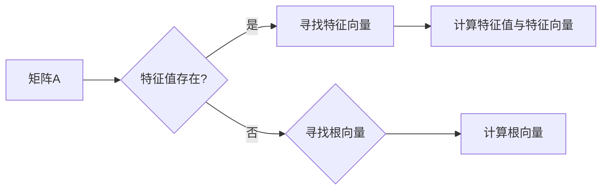

# 线性代数导引：根与线性因子

> 关键词：线性代数，特征值，特征向量，根，线性因子，矩阵分解，奇异值分解，应用领域

## 1. 背景介绍

线性代数是数学的一个重要分支，它在科学和工程领域中有着广泛的应用。特别是在计算机科学中，线性代数为理解数据的结构和变换提供了强有力的数学工具。在矩阵理论中，矩阵的根与线性因子是两个核心概念，它们揭示了矩阵的本质属性，并在解决实际问题中发挥着关键作用。

本文将深入探讨线性代数中的根与线性因子的概念、原理和应用，旨在帮助读者建立起对这些重要数学概念的清晰认识。

## 2. 核心概念与联系

### 2.1 核心概念

#### 2.1.1 特征值与特征向量

特征值和特征向量是线性代数中最基础的概念之一。对于一个给定的方阵 $A$，如果存在一个非零向量 $v$，使得 $Av = \lambda v$ 成立，其中 $\lambda$ 是一个标量，那么 $\lambda$ 被称为矩阵 $A$ 的一个特征值，$v$ 被称为对应的特征向量。

$$
Av = \lambda v
$$

#### 2.1.2 根

矩阵的根是特征值的一个特例，即当特征值为0时，对应的特征向量被称为矩阵的根向量。对于方阵 $A$，如果存在非零向量 $v$，使得 $Av = 0$，那么 $0$ 是矩阵 $A$ 的一个根。

$$
Av = 0
$$

#### 2.1.3 线性因子

线性因子是指矩阵可以通过某种分解方法分解成更简单的矩阵的因子。常见的线性因子分解包括LU分解、QR分解、奇异值分解(SVD)等。

### 2.2 Mermaid 流程图



### 2.3 核心概念的联系

特征值、特征向量和根之间的关系紧密相连。特征值是矩阵的一种内在属性，特征向量揭示了矩阵如何作用于向量，而根则是特征值的一种特殊情况。

## 3. 核心算法原理 & 具体操作步骤

### 3.1 算法原理概述

矩阵的根与线性因子可以通过多种方法进行计算，其中最常见的是利用数值分析中的迭代方法。

### 3.2 算法步骤详解

#### 3.2.1 特征值与特征向量的计算

1. 选择合适的算法，如幂法、逆幂法等。
2. 对矩阵进行预处理，如对角化、施密特正交化等。
3. 迭代计算，直到收敛到特征值和特征向量。

#### 3.2.2 根的计算

1. 选择合适的算法，如高斯消元法、迭代法等。
2. 迭代计算，直到找到根向量。

#### 3.2.3 线性因子的计算

1. 选择合适的分解方法，如LU分解、QR分解、SVD等。
2. 对矩阵进行分解，得到线性因子。

### 3.3 算法优缺点

#### 3.3.1 特征值与特征向量的计算

**优点**：能够揭示矩阵的内在属性，应用于数据分析、图像处理等领域。

**缺点**：计算复杂度高，对于大型矩阵难以进行精确计算。

#### 3.3.2 根的计算

**优点**：能够解线性方程组，应用于数值求解、优化等领域。

**缺点**：可能存在数值不稳定性和收敛性问题。

#### 3.3.3 线性因子的计算

**优点**：能够简化矩阵运算，提高计算效率。

**缺点**：分解方法的选择和计算复杂度不同，可能存在数值不稳定性。

### 3.4 算法应用领域

特征值与特征向量的计算应用于数据分析、图像处理、物理模拟等领域。根的计算应用于数值求解、优化、控制等领域。线性因子的计算应用于数值计算、科学计算、工程等领域。

## 4. 数学模型和公式 & 详细讲解 & 举例说明

### 4.1 数学模型构建

线性代数的数学模型主要包括矩阵、向量、线性变换等。

### 4.2 公式推导过程

#### 4.2.1 特征值与特征向量的计算

特征值与特征向量的计算可以通过求解特征方程 $det(A-\lambda I) = 0$ 来获得。

#### 4.2.2 根的计算

根的计算可以通过求解线性方程组 $Ax = 0$ 来获得。

#### 4.2.3 线性因子的计算

线性因子的计算可以通过不同的分解方法获得，如LU分解、QR分解、SVD等。

### 4.3 案例分析与讲解

#### 4.3.1 特征值与特征向量的计算

考虑矩阵 $A = \begin{pmatrix} 4 & -2 \\ 2 & 1 \end{pmatrix}$，计算其特征值与特征向量。

解特征方程 $det(A-\lambda I) = 0$，得到特征值 $\lambda_1 = 3, \lambda_2 = 1$。

计算对应的特征向量，得到 $v_1 = \begin{pmatrix} 1 \\ 2 \end{pmatrix}, v_2 = \begin{pmatrix} 2 \\ 1 \end{pmatrix}$。

#### 4.3.2 根的计算

考虑线性方程组 $Ax = 0$，其中 $A = \begin{pmatrix} 1 & 2 \\ 2 & 1 \end{pmatrix}$，计算其根向量。

解线性方程组，得到根向量 $v = \begin{pmatrix} -2 \\ 1 \end{pmatrix}$。

#### 4.3.3 线性因子的计算

考虑矩阵 $A = \begin{pmatrix} 1 & 2 \\ 2 & 1 \end{pmatrix}$，进行LU分解。

LU分解得到 $A = LU$，其中 $L = \begin{pmatrix} 1 & 0 \\ 2 & 1 \end{pmatrix}, U = \begin{pmatrix} 1 & 2 \\ 0 & -1 \end{pmatrix}$。

## 5. 项目实践：代码实例和详细解释说明

### 5.1 开发环境搭建

使用Python进行线性代数计算的常用库包括NumPy、SciPy等。

### 5.2 源代码详细实现

```python
import numpy as np

def eigenvalue_eigenvector(A):
    eigenvalues, eigenvectors = np.linalg.eig(A)
    return eigenvalues, eigenvectors

def lu_decomposition(A):
    L, U, P = np.linalg.lu(A)
    return L, U, P

# 示例矩阵
A = np.array([[4, -2], [2, 1]])

# 计算特征值与特征向量
eigenvalues, eigenvectors = eigenvalue_eigenvector(A)
print("Eigenvalues:", eigenvalues)
print("Eigenvectors:
", eigenvectors)

# LU分解
L, U, P = lu_decomposition(A)
print("L:
", L)
print("U:
", U)
print("P:
", P)
```

### 5.3 代码解读与分析

以上代码示例中，我们首先导入了NumPy库，并定义了计算特征值与特征向量以及LU分解的函数。然后，我们创建了一个示例矩阵 $A$，并调用相应的函数进行计算。最后，我们打印出了计算结果。

## 6. 实际应用场景

线性代数的根与线性因子在多个领域都有广泛的应用，以下是一些常见的应用场景：

- **图像处理**：通过计算图像的奇异值分解，可以分析图像的形状和结构，实现图像压缩、去噪等功能。
- **信号处理**：特征值和特征向量的计算可以用于信号分析，如频率分析、时域分析等。
- **优化问题**：线性方程组的求解可以用于求解线性规划问题，如背包问题、指派问题等。

## 7. 工具和资源推荐

### 7.1 学习资源推荐

- 《线性代数及其应用》
- 《线性代数的几何意义》
- 《线性代数与矩阵理论》

### 7.2 开发工具推荐

- NumPy
- SciPy
- SymPy

### 7.3 相关论文推荐

- "Matrix Computations" by Gene H. Golub and Charles F. Van Loan
- "Numerical Linear Algebra" by Lloyd N. Trefethen and David Bau III

## 8. 总结：未来发展趋势与挑战

### 8.1 研究成果总结

线性代数的根与线性因子是矩阵理论中的重要概念，它们在多个领域有着广泛的应用。通过对这些概念的理解和掌握，可以更好地解决实际问题。

### 8.2 未来发展趋势

随着计算技术的发展，线性代数的计算方法将更加高效，应用领域也将不断拓展。

### 8.3 面临的挑战

线性代数的计算方法可能存在数值不稳定性，这对于实际应用来说是一个挑战。

### 8.4 研究展望

未来，线性代数的计算方法将更加高效，应用领域也将不断拓展。同时，我们需要解决数值不稳定性等问题，以更好地应用于实际领域。

## 9. 附录：常见问题与解答

### 9.1 常见问题

**Q1：什么是特征值和特征向量？**

A1：特征值和特征向量是矩阵理论中的基本概念，它们揭示了矩阵如何作用于向量。

**Q2：什么是矩阵的根？**

A2：矩阵的根是特征值的一种特殊情况，即当特征值为0时，对应的特征向量被称为矩阵的根向量。

**Q3：什么是线性因子？**

A3：线性因子是指矩阵可以通过某种分解方法分解成更简单的矩阵的因子。

### 9.2 解答

**Q1：特征值和特征向量的计算方法有哪些？**

A1：特征值和特征向量的计算方法包括幂法、逆幂法等。

**Q2：如何计算矩阵的根？**

A2：矩阵的根可以通过求解线性方程组 $Ax = 0$ 来获得。

**Q3：如何计算矩阵的线性因子？**

A3：矩阵的线性因子可以通过LU分解、QR分解、SVD等分解方法获得。

作者：禅与计算机程序设计艺术 / Zen and the Art of Computer Programming