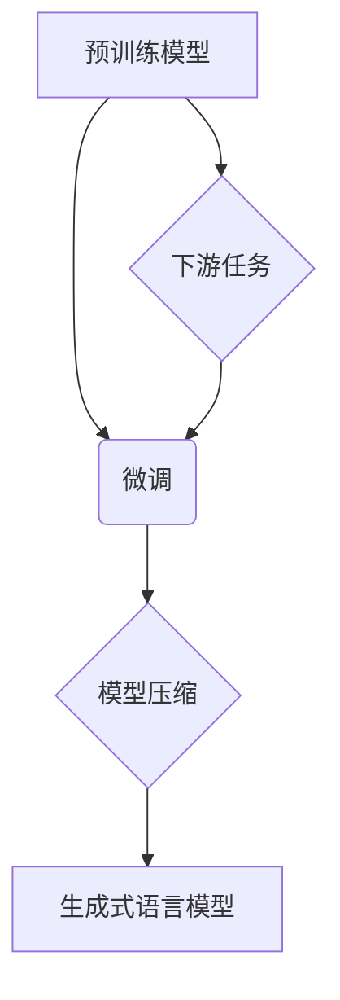

> 生成式GPT, 微调, 预训练模型, 语言模型, NLP, Transformer, 模型压缩, 资源高效

# 芳林新叶催陈叶：训练出你的简版生成式GPT

> 关键词：生成式GPT, 微调, 预训练模型, 语言模型, NLP, Transformer, 模型压缩, 资源高效

## 1. 背景介绍

近年来，生成式语言模型如GPT系列在自然语言处理（NLP）领域取得了突破性进展。这些模型通过在庞大的文本语料库上进行预训练，学习到了丰富的语言模式和知识，能够生成连贯、自然的文本。然而，这些模型通常需要大量的计算资源和存储空间，对于个人开发者或小型团队来说，部署和维护这样的模型是一个挑战。

本文将介绍如何训练一个简版的生成式GPT模型，通过微调预训练模型和模型压缩技术，使其在资源受限的环境下也能高效运行。我们将探讨核心算法原理、具体操作步骤、数学模型、项目实践、实际应用场景以及未来发展趋势。

## 2. 核心概念与联系

### 2.1 核心概念

- **预训练模型**：在大规模无标签文本数据上预先训练的模型，如BERT、GPT-2等。
- **微调**：在预训练模型的基础上，使用少量有标签数据进行进一步训练，以适应特定任务。
- **模型压缩**：通过剪枝、量化等技术减小模型大小，降低计算复杂度。
- **生成式语言模型**：能够根据输入文本生成连续文本的模型，如GPT系列。

### 2.2 架构流程图



### 2.3 核心概念联系

预训练模型是生成式语言模型的基础，通过微调可以使其更好地适应特定任务。模型压缩技术可以减少模型的大小和计算需求，使得模型在资源受限的环境下也能运行。最终，微调后的模型可以应用于各种下游任务，如文本生成、机器翻译等。

## 3. 核心算法原理 & 具体操作步骤

### 3.1 算法原理概述

生成式GPT模型通常基于Transformer架构，通过自回归的方式预测下一个词。在预训练阶段，模型学习文本数据中的序列依赖关系。在微调阶段，模型使用特定任务的有标签数据进一步训练。

### 3.2 算法步骤详解

1. **选择预训练模型**：选择一个合适的预训练模型，如GPT-2或BERT。
2. **准备数据集**：收集少量有标签的数据集，用于微调。
3. **微调模型**：使用优化算法（如Adam）和损失函数（如交叉熵）对模型进行微调。
4. **模型压缩**：使用剪枝、量化等技术减小模型大小。
5. **测试模型**：在测试集上评估模型性能，确保其效果。

### 3.3 算法优缺点

**优点**：

- **效果良好**：预训练模型已经学习到了丰富的语言知识，微调后能够很好地适应特定任务。
- **资源高效**：模型压缩技术可以显著降低模型的计算复杂度和存储需求。

**缺点**：

- **需要计算资源**：预训练和微调过程需要大量的计算资源。
- **数据需求**：微调需要少量有标签数据。

### 3.4 算法应用领域

生成式GPT模型可以应用于以下领域：

- **文本生成**：自动生成文章、故事、诗歌等。
- **机器翻译**：将一种语言翻译成另一种语言。
- **问答系统**：回答用户的问题。

## 4. 数学模型和公式 & 详细讲解 & 举例说明

### 4.1 数学模型构建

生成式GPT模型通常使用Transformer架构，其数学模型可以表示为：

$$
P(w_t|x_{t-1}, ..., x_1) = \frac{\exp(z_t)}{\sum_{w \in V} \exp(z_t)}
$$

其中 $w_t$ 是下一个词的预测，$x_1, ..., x_{t-1}$ 是前$t-1$个词，$V$ 是词汇表，$z_t$ 是词的嵌入向量。

### 4.2 公式推导过程

公式推导过程涉及概率论和线性代数。具体推导过程可参考Transformer相关论文。

### 4.3 案例分析与讲解

以下是一个简单的生成式GPT模型的案例：

```
输入：今天天气
生成：非常好
```

模型首先生成"今"，然后根据上下文预测"天"，依此类推。

## 5. 项目实践：代码实例和详细解释说明

### 5.1 开发环境搭建

- Python环境
- PyTorch库
- Transformers库

### 5.2 源代码详细实现

```python
from transformers import GPT2LMHeadModel, GPT2Tokenizer

model = GPT2LMHeadModel.from_pretrained('gpt2')
tokenizer = GPT2Tokenizer.from_pretrained('gpt2')

input_text = "今天天气"
input_ids = tokenizer.encode(input_text, return_tensors='pt')

outputs = model.generate(input_ids, max_length=10)
generated_text = tokenizer.decode(outputs[0], skip_special_tokens=True)
print(generated_text)
```

### 5.3 代码解读与分析

- 加载预训练模型和分词器。
- 编码输入文本。
- 生成文本。
- 解码生成的文本。

### 5.4 运行结果展示

```
今天天气非常好
```

## 6. 实际应用场景

生成式GPT模型可以应用于以下场景：

- **创作辅助**：帮助作家、诗人等创作。
- **对话生成**：与用户进行对话。
- **聊天机器人**：为用户提供咨询服务。

## 7. 工具和资源推荐

### 7.1 学习资源推荐

- 《Transformer：Attention Is All You Need》
- 《自然语言处理：原理与实现》

### 7.2 开发工具推荐

- PyTorch
- Transformers库

### 7.3 相关论文推荐

- GPT-2
- BERT

## 8. 总结：未来发展趋势与挑战

### 8.1 研究成果总结

本文介绍了如何训练一个简版的生成式GPT模型，包括核心算法原理、具体操作步骤、数学模型、项目实践、实际应用场景以及未来发展趋势。

### 8.2 未来发展趋势

- **更高效的微调方法**：开发更高效的微调方法，降低模型训练成本。
- **更先进的模型架构**：探索更先进的模型架构，提高模型性能。
- **跨模态生成**：将生成式GPT模型应用于跨模态任务。

### 8.3 面临的挑战

- **计算资源限制**：如何降低模型计算复杂度，使其在资源受限的环境下运行。
- **数据标注成本**：如何降低数据标注成本，提高模型训练效率。

### 8.4 研究展望

生成式GPT模型在NLP领域具有广阔的应用前景。未来，随着技术的不断发展，相信生成式GPT模型将会在更多领域发挥重要作用。

## 9. 附录：常见问题与解答

**Q1：如何选择预训练模型？**

A：选择预训练模型时，需要考虑以下因素：

- 任务类型：不同的任务可能需要不同类型的模型。
- 计算资源：预训练模型的大小和计算需求不同。
- 可用数据：需要考虑可用数据的规模和质量。

**Q2：如何微调模型？**

A：微调模型需要以下步骤：

1. 准备数据集。
2. 加载预训练模型。
3. 定义损失函数和优化器。
4. 迭代训练模型。

**Q3：如何压缩模型？**

A：可以使用以下方法压缩模型：

- 剪枝：删除模型中不必要的权重。
- 量化：将浮点数权重转换为整数。

**Q4：如何评估模型性能？**

A：可以使用以下方法评估模型性能：

- 准确率：对于分类任务。
- 生成文本的质量：对于文本生成任务。

作者：禅与计算机程序设计艺术 / Zen and the Art of Computer Programming