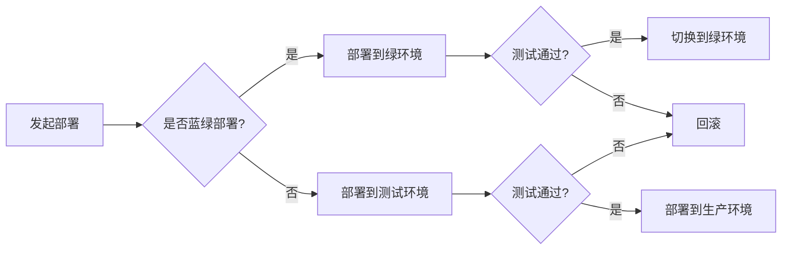

# 蓝绿部署与金丝雀发布原理与代码实战案例讲解

> 关键词：蓝绿部署，金丝雀发布，DevOps，容器化，持续集成，持续部署，CI/CD，服务无状态化

## 1. 背景介绍

随着互联网技术的快速发展，软件系统变得越来越复杂。传统的部署方式往往存在风险高、效率低、回滚困难等问题。为了解决这些问题，DevOps文化和实践应运而生，其中蓝绿部署和金丝雀发布是两种重要的部署策略。本文将深入解析这两种部署策略的原理，并通过实际代码案例进行讲解。

### 1.1 问题的由来

在传统的部署方式中，系统更新通常需要以下步骤：

1. 在测试环境中进行测试，确保更新后的系统功能正常。
2. 将更新后的代码部署到生产环境。
3. 观察系统运行情况，如果有问题，则进行回滚。

这种部署方式的弊端包括：

- 部署风险高：由于直接将更新后的代码部署到生产环境，一旦出现问题，可能会造成严重的后果。
- 部署效率低：需要先进行测试，再部署，再观察，流程繁琐。
- 回滚困难：一旦出现问题，需要手动回滚，效率低下。

为了解决这些问题，DevOps文化和实践应运而生，其中蓝绿部署和金丝雀发布是两种重要的部署策略。

### 1.2 研究现状

蓝绿部署和金丝雀发布已经在许多大型互联网公司得到广泛应用，如Google、Amazon、Netflix等。这些公司通过实践证明了这两种部署策略的有效性。

### 1.3 研究意义

研究蓝绿部署和金丝雀发布，对于提高软件系统的部署效率、降低部署风险具有重要意义。

## 2. 核心概念与联系

### 2.1 核心概念

**蓝绿部署**：在部署过程中，始终有两个环境，一个是当前运行的环境（蓝环境），另一个是待发布的环境（绿环境）。发布新版本时，将新版本的代码部署到绿环境，并在绿环境中进行测试。测试通过后，将绿环境切换到蓝环境，实现无中断部署。

**金丝雀发布**：在部署过程中，仅将新版本部署到一小部分用户（如金丝雀用户），观察其运行情况。如果一切正常，再逐步扩大用户范围，最终完成全面部署。

### 2.2 架构流程图



### 2.3 关系联系

蓝绿部署和金丝雀发布都是DevOps文化和实践中重要的部署策略，两者可以结合使用，以提高部署效率和安全性。

## 3. 核心算法原理 & 具体操作步骤

### 3.1 算法原理概述

蓝绿部署和金丝雀发布的原理在于：

- **隔离**：通过将环境隔离，避免直接在生产环境中进行部署，降低风险。
- **测试**：在部署前进行充分测试，确保新版本的功能和性能。
- **可控**：通过逐步扩大用户范围，可以更好地控制部署过程。

### 3.2 算法步骤详解

**蓝绿部署步骤**：

1. 准备两个完全相同的环境，分别命名为蓝环境和绿环境。
2. 将新版本的代码部署到绿环境。
3. 在绿环境中进行测试，确保功能正常。
4. 如果测试通过，将绿环境切换到蓝环境，实现无中断部署。
5. 如果测试不通过，则回滚到蓝环境。

**金丝雀发布步骤**：

1. 准备新版本代码。
2. 将新版本代码部署到一小部分用户。
3. 观察金丝雀用户的运行情况。
4. 如果一切正常，逐步扩大用户范围。
5. 如果出现问题，立即回滚。

### 3.3 算法优缺点

**蓝绿部署优缺点**：

优点：

- 部署风险低，可以随时回滚。
- 部署效率高，可以并行进行。
- 环境隔离，互不影响。

缺点：

- 需要准备两个完全相同的环境，成本较高。
- 部署过程较为复杂。

**金丝雀发布优缺点**：

优点：

- 部署风险低，可以逐步扩大用户范围。
- 可以根据用户反馈调整部署策略。

缺点：

- 部署过程较慢，需要逐步扩大用户范围。
- 可能存在用户反馈延迟的问题。

### 3.4 算法应用领域

蓝绿部署和金丝雀发布适用于以下场景：

- 对系统稳定性和可用性要求较高的场景。
- 需要快速部署新功能的场景。
- 需要降低部署风险的场景。

## 4. 数学模型和公式 & 详细讲解 & 举例说明

### 4.1 数学模型构建

蓝绿部署和金丝雀发布的数学模型可以表示为以下公式：

$$
P_{成功} = P_{绿通过} \times P_{蓝切换}
$$

其中，$P_{成功}$ 为部署成功的概率，$P_{绿通过}$ 为绿环境测试通过的概率，$P_{蓝切换}$ 为蓝环境切换成功的概率。

### 4.2 公式推导过程

部署成功的概率可以分解为两个独立事件的概率乘积：

- 绿环境测试通过的概率 $P_{绿通过}$，取决于测试用例的设计和执行。
- 蓝环境切换成功的概率 $P_{蓝切换}$，取决于切换策略和执行。

### 4.3 案例分析与讲解

以下是一个蓝绿部署的案例分析：

假设有一个电商网站，目前使用的是蓝色环境，即将新版本的代码部署到蓝色环境。现在需要将新版本的代码部署到绿色环境，并切换到绿色环境。

1. 在绿色环境中部署新版本代码，并进行测试。
2. 测试通过后，将绿色环境切换到蓝色环境。
3. 观察绿色环境的运行情况，确保一切正常。

通过蓝绿部署，可以确保在切换过程中，用户始终能够访问到稳定的服务。

## 5. 项目实践：代码实例和详细解释说明

### 5.1 开发环境搭建

为了演示蓝绿部署和金丝雀发布的实践，我们将使用Docker容器化技术。首先，需要安装Docker环境。

### 5.2 源代码详细实现

以下是一个简单的Python Web服务，用于演示蓝绿部署和金丝雀发布。

```python
# app.py
from flask import Flask

app = Flask(__name__)

@app.route('/')
def index():
    return "Hello, World!"

if __name__ == '__main__':
    app.run(host='0.0.0.0', port=5000)
```

接下来，创建Dockerfile，用于构建容器镜像。

```Dockerfile
# Dockerfile
FROM python:3.8-slim

WORKDIR /app

COPY . .

RUN pip install flask

CMD ["python", "app.py"]
```

### 5.3 代码解读与分析

以上代码是一个简单的Flask Web服务，用于演示蓝绿部署和金丝雀发布。

### 5.4 运行结果展示

1. 构建容器镜像：

```bash
docker build -t myapp .
```

2. 运行容器：

```bash
docker run -d -p 5000:5000 myapp
```

现在，可以通过访问 `http://localhost:5000` 来访问Web服务。

## 6. 实际应用场景

### 6.1 蓝绿部署

蓝绿部署适用于以下场景：

- 新功能发布：在发布新功能时，可以使用蓝绿部署确保新功能的安全性。
- 系统升级：在升级系统时，可以使用蓝绿部署降低风险。

### 6.2 金丝雀发布

金丝雀发布适用于以下场景：

- 重大更新：在发布重大更新时，可以使用金丝雀发布逐步扩大用户范围。
- 新技术试点：在试点新技术时，可以使用金丝雀发布观察效果。

## 7. 工具和资源推荐

### 7.1 学习资源推荐

- DevOps Handbook：介绍了DevOps文化和实践。
- Kubernetes权威指南：介绍了Kubernetes容器编排工具。
- Docker官方文档：介绍了Docker容器化技术。

### 7.2 开发工具推荐

- Jenkins：自动化构建和部署工具。
- Ansible：自动化运维工具。
- Terraform：基础设施即代码工具。

### 7.3 相关论文推荐

- The Phoenix Project：介绍了DevOps文化和实践。
- The DevOps Handbook：介绍了DevOps文化和实践。
- Kubernetes: Up & Running：介绍了Kubernetes容器编排工具。

## 8. 总结：未来发展趋势与挑战

### 8.1 研究成果总结

本文深入解析了蓝绿部署和金丝雀发布的原理，并通过实际代码案例进行了讲解。这两种部署策略在DevOps实践中具有重要作用，可以提高部署效率、降低部署风险。

### 8.2 未来发展趋势

未来，随着DevOps文化的普及和技术的不断发展，蓝绿部署和金丝雀发布将在以下方面得到进一步发展：

- 与持续集成/持续部署（CI/CD）工具深度融合。
- 与自动化运维工具结合，实现自动化部署和回滚。
- 与云原生技术结合，实现无缝的云上部署。

### 8.3 面临的挑战

蓝绿部署和金丝雀发布在实际应用中仍面临一些挑战：

- 需要额外的资源：需要准备两个完全相同的环境，成本较高。
- 部署过程复杂：需要复杂的部署流程和自动化工具支持。

### 8.4 研究展望

未来，研究重点将集中在以下几个方面：

- 降低部署成本：探索更加高效的部署策略，降低部署成本。
- 提高部署效率：优化部署流程和自动化工具，提高部署效率。
- 增强安全性：提高部署过程的安全性，降低风险。

## 9. 附录：常见问题与解答

**Q1：蓝绿部署和金丝雀发布有什么区别？**

A：蓝绿部署和金丝雀发布都是DevOps实践中的部署策略，但它们在部署过程中有所不同。蓝绿部署需要准备两个完全相同的环境，而金丝雀发布只需要一小部分用户。

**Q2：蓝绿部署和金丝雀发布适用于哪些场景？**

A：蓝绿部署适用于新功能发布、系统升级等场景。金丝雀发布适用于重大更新、新技术试点等场景。

**Q3：蓝绿部署和金丝雀发布有哪些优势？**

A：蓝绿部署和金丝雀发布可以提高部署效率、降低部署风险。

**Q4：蓝绿部署和金丝雀发布有哪些局限性？**

A：蓝绿部署和金丝雀发布需要额外的资源，部署过程复杂。

**Q5：如何实现蓝绿部署和金丝雀发布？**

A：可以使用Jenkins、Ansible等自动化工具实现蓝绿部署和金丝雀发布。

---

作者：禅与计算机程序设计艺术 / Zen and the Art of Computer Programming