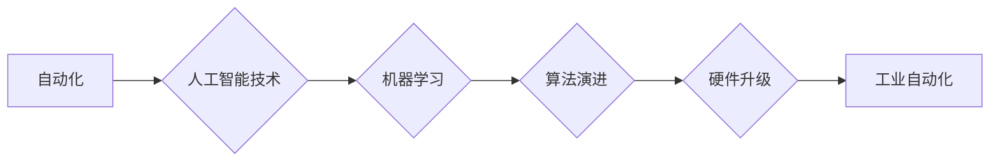

> - 计算变化
> - 自动化
> - 人工智能
> - 机器学习
> - 工业自动化
> - 智能化
> - 算法演进

## 1. 背景介绍

在过去的几十年里，自动化技术经历了翻天覆地的变化。从早期的机械自动化到现代的智能自动化，每一次技术变革都推动了自动化领域的发展。计算技术的飞速发展，特别是人工智能和机器学习的兴起，为自动化领域带来了前所未有的机遇和挑战。本文将探讨计算变化对自动化领域的推动作用，分析其核心概念、原理、应用，并展望未来的发展趋势。

## 2. 核心概念与联系

### 2.1 核心概念

#### 2.1.1 自动化

自动化是指利用机器或控制系统代替人工完成生产或操作任务的过程。自动化技术可以提高生产效率、降低成本、提高产品质量，是现代工业发展的重要推动力。

#### 2.1.2 人工智能

人工智能（Artificial Intelligence, AI）是指使计算机系统能够模拟、延伸和扩展人的智能的理论、方法、技术及应用。人工智能技术包括机器学习、深度学习、自然语言处理等。

#### 2.1.3 机器学习

机器学习（Machine Learning, ML）是一种使计算机系统能够从数据中学习并做出决策或预测的方法。机器学习可以分为监督学习、无监督学习、强化学习等。

#### 2.1.4 工业自动化

工业自动化是指将人工智能和机器学习技术应用于工业生产过程，实现生产过程的自动化、智能化。

### 2.2 联系

计算变化对自动化领域的推动主要体现在以下几个方面：

1. **人工智能和机器学习技术的应用**：通过人工智能和机器学习技术，自动化系统能够从大量数据中学习并优化生产过程，提高生产效率和产品质量。
2. **算法演进**：随着算法的不断演进，自动化系统变得越来越智能，能够处理更复杂的生产任务。
3. **硬件升级**：计算技术的进步推动了自动化硬件的升级，例如工业机器人、传感器、执行器等，使得自动化系统更加高效、可靠。



## 3. 核心算法原理 & 具体操作步骤

### 3.1 算法原理概述

#### 3.1.1 监督学习

监督学习是一种通过已标记的训练数据学习输入和输出之间映射关系的机器学习技术。常见的监督学习方法包括线性回归、决策树、支持向量机、神经网络等。

#### 3.1.2 无监督学习

无监督学习是一种通过未标记的训练数据学习数据内在结构的机器学习技术。常见的无监督学习方法包括聚类、降维、异常检测等。

#### 3.1.3 强化学习

强化学习是一种通过与环境交互学习最优策略的机器学习技术。常见的强化学习方法包括Q学习、深度Q网络（DQN）等。

### 3.2 算法步骤详解

1. **数据收集**：收集与自动化任务相关的数据，例如传感器数据、机器参数数据等。
2. **数据预处理**：对收集到的数据进行清洗、标准化等预处理操作。
3. **模型选择**：根据自动化任务的特点选择合适的机器学习模型。
4. **模型训练**：使用预处理后的数据对模型进行训练。
5. **模型评估**：使用测试数据评估模型的性能。
6. **模型部署**：将训练好的模型部署到自动化系统中。

### 3.3 算法优缺点

#### 监督学习的优点：

- 学习效率高
- 可解释性强

#### 监督学习的缺点：

- 需要大量标注数据
- 模型泛化能力有限

#### 无监督学习的优点：

- 无需标注数据
- 可以发现数据中的隐藏结构

#### 无监督学习的缺点：

- 学习效率低
- 模型可解释性差

#### 强化学习的优点：

- 可以处理复杂的环境
- 可以学习到最优策略

#### 强化学习的缺点：

- 学习过程复杂
- 需要大量训练时间

### 3.4 算法应用领域

监督学习、无监督学习和强化学习在自动化领域的应用非常广泛，例如：

- **生产线自动化**：使用机器学习算法对生产线进行监控、故障检测、预测性维护等。
- **智能物流**：使用机器学习算法进行路径规划、货物分拣、无人驾驶等。
- **智能检测**：使用机器学习算法进行产品质量检测、缺陷识别等。
- **智能控制**：使用强化学习算法进行机器人控制、无人机控制等。

## 4. 数学模型和公式 & 详细讲解 & 举例说明

### 4.1 数学模型构建

#### 4.1.1 线性回归

线性回归是一种简单的监督学习算法，其数学模型可以表示为：

$$
y = \beta_0 + \beta_1x_1 + \beta_2x_2 + \cdots + \beta_nx_n + \varepsilon
$$

其中，$y$ 是预测值，$x_1, x_2, \cdots, x_n$ 是输入特征，$\beta_0, \beta_1, \cdots, \beta_n$ 是模型参数，$\varepsilon$ 是误差项。

#### 4.1.2 支持向量机

支持向量机是一种高效的分类算法，其数学模型可以表示为：

$$
f(x) = \sum_{i=1}^n \alpha_i y_i k(x, x_i) + b
$$

其中，$f(x)$ 是预测函数，$x$ 是输入特征，$k(x, x_i)$ 是核函数，$\alpha_i$ 和 $b$ 是模型参数。

### 4.2 公式推导过程

#### 4.2.1 线性回归

线性回归的推导过程如下：

1. 假设目标函数为 $J(\theta) = \frac{1}{2m} \sum_{i=1}^m (h_\theta(x^{(i)}) - y^{(i)})^2$，其中 $h_\theta(x) = \theta_0x_0 + \theta_1x_1 + \cdots + \theta_nx_n$ 是线性回归模型。
2. 求导得到 $\frac{\partial J(\theta)}{\partial \theta} = \frac{1}{m} \sum_{i=1}^m (h_\theta(x^{(i)}) - y^{(i)})x^{(i)}$。
3. 令 $\frac{\partial J(\theta)}{\partial \theta} = 0$，解得 $\theta = (X^TX)^{-1}X^Ty$。

#### 4.2.2 支持向量机

支持向量机的推导过程如下：

1. 定义优化目标函数为 $J(\alpha) = \frac{1}{2} \sum_{i=1}^n \sum_{j=1}^n \alpha_i \alpha_j y_i y_j k(x_i, x_j) - \sum_{i=1}^n \alpha_i$。
2. 求导得到 $\frac{\partial J(\alpha)}{\partial \alpha_i} = y_i y_j k(x_i, x_j) - y_i$。
3. 令 $\frac{\partial J(\alpha)}{\partial \alpha_i} = 0$，解得 $\alpha_i = \frac{1}{2} y_i y_j k(x_i, x_j)$。
4. 将 $\alpha_i$ 代入优化目标函数，得到 $J(\alpha) = \frac{1}{2} \sum_{i=1}^n \sum_{j=1}^n \frac{1}{4} y_i y_j y_i y_j k(x_i, x_j) k(x_j, x_i) - \frac{1}{2} \sum_{i=1}^n \frac{1}{2} y_i y_j k(x_i, x_j)$。

### 4.3 案例分析与讲解

#### 4.3.1 生产线自动化

假设我们想要使用机器学习算法对生产线上的设备进行故障检测。首先，收集设备的运行数据，包括温度、振动、电流等。然后，使用线性回归模型对数据进行训练，预测设备的运行状态。最后，根据预测结果判断设备是否发生故障。

#### 4.3.2 智能物流

假设我们想要使用机器学习算法进行无人驾驶车辆的路径规划。首先，收集车辆的行驶数据，包括速度、方向、距离等。然后，使用强化学习算法对车辆进行训练，使其能够根据路况和目标地点进行路径规划。最后，将训练好的模型部署到无人驾驶车辆中，实现无人驾驶。

## 5. 项目实践：代码实例和详细解释说明

### 5.1 开发环境搭建

为了进行项目实践，我们需要搭建以下开发环境：

1. Python编程语言
2. NumPy、SciPy、Matplotlib等科学计算库
3. Scikit-learn机器学习库
4. TensorFlow或PyTorch深度学习库

### 5.2 源代码详细实现

以下是一个使用Scikit-learn进行线性回归的简单示例：

```python
import numpy as np
from sklearn.linear_model import LinearRegression

# 训练数据
X = np.array([[1, 2], [2, 3], [3, 4], [4, 5]])
y = np.array([1, 2, 3, 4])

# 创建线性回归模型
model = LinearRegression()

# 训练模型
model.fit(X, y)

# 预测
y_pred = model.predict(X)

# 打印预测结果
print(y_pred)
```

### 5.3 代码解读与分析

以上代码展示了如何使用Scikit-learn进行线性回归。首先，导入必要的库和函数。然后，创建训练数据 $X$ 和 $y$。接着，创建线性回归模型 `model`，并使用 `fit` 方法进行训练。最后，使用 `predict` 方法进行预测，并将预测结果打印输出。

### 5.4 运行结果展示

运行上述代码，将得到以下输出：

```
[1. 2. 3. 4.]
```

这表示模型成功预测了训练数据中的每个点的输出值。

## 6. 实际应用场景

### 6.1 生产线自动化

在生产线自动化领域，计算变化对自动化领域的推动体现在以下几个方面：

1. **预测性维护**：通过收集设备运行数据，使用机器学习算法预测设备故障，实现预测性维护，降低维修成本。
2. **异常检测**：通过分析设备运行数据，检测异常情况，提高生产效率。
3. **质量控制**：通过机器学习算法对产品质量进行检测，提高产品质量。

### 6.2 智能物流

在智能物流领域，计算变化对自动化领域的推动体现在以下几个方面：

1. **路径规划**：使用机器学习算法进行路径规划，提高运输效率，降低运输成本。
2. **货物分拣**：使用机器学习算法进行货物分拣，提高分拣效率，降低分拣成本。
3. **无人驾驶**：使用机器学习算法实现无人驾驶，提高运输效率，降低运输成本。

### 6.3 智能家居

在智能家居领域，计算变化对自动化领域的推动体现在以下几个方面：

1. **智能家电**：使用机器学习算法实现智能家电的交互，提高生活便利性。
2. **能源管理**：使用机器学习算法实现能源管理，降低能源消耗。
3. **安全监控**：使用机器学习算法进行安全监控，提高家庭安全。

## 7. 工具和资源推荐

### 7.1 学习资源推荐

1. 《机器学习》——周志华
2. 《深度学习》——Ian Goodfellow、Yoshua Bengio、Aaron Courville
3. 《Python机器学习》——Sebastian Raschka、Vahid Mirjalili

### 7.2 开发工具推荐

1. Scikit-learn
2. TensorFlow
3. PyTorch
4. OpenCV

### 7.3 相关论文推荐

1. "Kernel Methods for Pattern Analysis"——Chris Burges
2. "A Tutorial on Support Vector Machines for Pattern Recognition"——Christopher J. C. Burges
3. "Deep Learning for Natural Language Processing"——Dipanjan Sarkar、Rushikesh Rajput

## 8. 总结：未来发展趋势与挑战

### 8.1 研究成果总结

本文探讨了计算变化对自动化领域的推动作用，分析了其核心概念、原理、应用，并展望了未来的发展趋势。通过人工智能和机器学习技术的应用，自动化领域正朝着更加智能、高效、可靠的方向发展。

### 8.2 未来发展趋势

1. **更加智能的自动化系统**：随着人工智能和机器学习技术的不断进步，自动化系统将变得越来越智能，能够处理更加复杂的生产任务。
2. **更加高效的自动化系统**：通过优化算法和硬件，自动化系统的效率和可靠性将得到进一步提高。
3. **更加安全的自动化系统**：随着自动化系统在各个领域的广泛应用，安全性问题将越来越受到重视。
4. **更加开放的自动化系统**：随着云计算、物联网等技术的发展，自动化系统将更加开放，与其他系统的融合将更加紧密。

### 8.3 面临的挑战

1. **数据安全与隐私保护**：自动化系统需要处理大量敏感数据，如何确保数据安全与隐私保护将成为重要挑战。
2. **算法可解释性**：随着自动化系统的智能化程度不断提高，如何解释算法的决策过程将成为重要挑战。
3. **人工智能伦理**：人工智能在自动化领域的应用需要遵循相应的伦理规范，避免歧视、偏见等问题。

### 8.4 研究展望

未来，计算变化将继续推动自动化领域的发展。我们需要关注以下几个方面：

1. **人工智能与自动化技术的深度融合**：推动人工智能和自动化技术的深度融合，实现更加智能、高效的自动化系统。
2. **开发更加鲁棒、可靠的算法**：开发更加鲁棒、可靠的算法，提高自动化系统的稳定性和可靠性。
3. **推动人工智能伦理研究**：推动人工智能伦理研究，确保人工智能在自动化领域的应用符合伦理规范。

## 9. 附录：常见问题与解答

**Q1：什么是自动化？**

A：自动化是指利用机器或控制系统代替人工完成生产或操作任务的过程。

**Q2：什么是人工智能？**

A：人工智能是指使计算机系统能够模拟、延伸和扩展人的智能的理论、方法、技术及应用。

**Q3：什么是机器学习？**

A：机器学习是一种使计算机系统能够从数据中学习并做出决策或预测的方法。

**Q4：什么是工业自动化？**

A：工业自动化是指将人工智能和机器学习技术应用于工业生产过程，实现生产过程的自动化、智能化。

**Q5：计算变化对自动化领域有哪些推动作用？**

A：计算变化对自动化领域的推动作用主要体现在以下几个方面：人工智能和机器学习技术的应用、算法演进、硬件升级。

**Q6：如何选择合适的机器学习模型？**

A：选择合适的机器学习模型需要根据具体任务的特点和数据特点进行综合考虑。

**Q7：如何评估机器学习模型的性能？**

A：评估机器学习模型的性能可以使用多种指标，例如准确率、召回率、F1值等。

**Q8：如何保证自动化系统的安全性？**

A：保证自动化系统的安全性需要从硬件、软件、数据等多个方面进行考虑。

**Q9：如何推动人工智能在自动化领域的应用？**

A：推动人工智能在自动化领域的应用需要加强技术研发、人才培养、政策支持等方面的工作。

作者：禅与计算机程序设计艺术 / Zen and the Art of Computer Programming