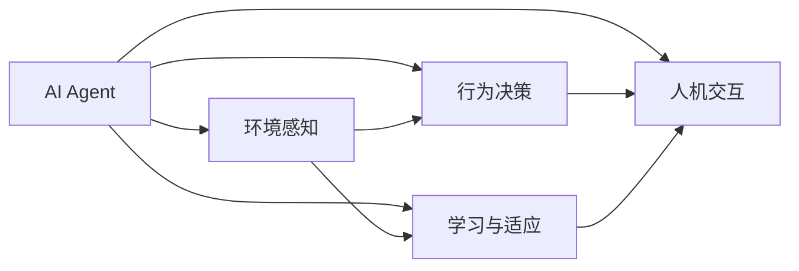
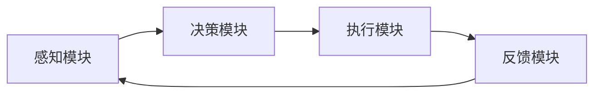
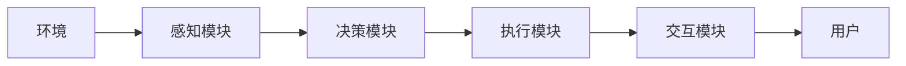
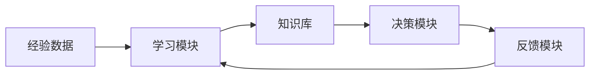

                 

# AI Agent: AI的下一个风口 具身机器人在工业领域的应用

## 1. 背景介绍

### 1.1 问题由来
随着人工智能技术的发展，AI agent逐渐成为AI领域的下一个风口。AI agent是一种具备自主决策能力的智能体，可以独立在复杂环境中行动并完成任务。与传统的基于规则的智能体不同，AI agent通过学习环境和任务特性，可以适应未知变化，灵活应对复杂环境。AI agent技术在工业领域有着巨大的应用潜力，有望推动产业智能化升级，提升生产效率，降低成本，实现可持续发展。

### 1.2 问题核心关键点
AI agent技术的关键在于：
- 环境感知：AI agent需要具备环境感知能力，能够感知并理解物理世界和环境变化。
- 行为决策：AI agent需要具备自主决策能力，能够根据环境信息生成行为策略，并执行相应动作。
- 学习与适应：AI agent需要具备学习能力，能够从环境反馈中学习新知识和经验，适应环境变化。
- 人机交互：AI agent需要具备与人类进行交互的能力，能够接收指令和反馈，完成任务。

### 1.3 问题研究意义
AI agent技术的研究和应用，对推动工业智能化、提高生产效率、实现可持续发展具有重要意义：

1. 提升生产效率：AI agent可以替代人力进行重复性高、危险性大的工作，显著提升生产效率。
2. 降低成本：AI agent可以长期稳定运行，不需要高昂的维护成本，有助于降低生产成本。
3. 提高灵活性：AI agent可以适应环境变化，灵活应对生产中的突发情况，提升生产柔性。
4. 促进可持续发展：AI agent可以实现资源的优化配置和环境的保护，推动工业绿色转型。
5. 推动产业升级：AI agent技术的应用，可以加速产业数字化转型，提升企业竞争力。

## 2. 核心概念与联系

### 2.1 核心概念概述

为更好地理解AI agent在工业领域的应用，本节将介绍几个关键概念：

- AI agent（人工智能代理）：一种具备自主决策能力的智能体，可以在复杂环境中行动并完成任务。
- 环境感知（Environment Perception）：AI agent对物理世界和环境变化进行感知和理解的能力。
- 行为决策（Action Decision）：AI agent根据环境信息生成行为策略并执行相应动作的过程。
- 学习与适应（Learning and Adaptation）：AI agent通过学习新知识和经验，适应环境变化的能力。
- 人机交互（Human-Machine Interaction）：AI agent与人类进行交互的能力，接收指令和反馈，完成任务。

这些核心概念之间的关系可以通过以下Mermaid流程图来展示：



这个流程图展示了AI agent的关键功能模块及其之间的联系：

1. AI agent通过环境感知模块获取环境信息，通过行为决策模块生成行为策略，通过学习与适应模块更新自身知识。
2. 人机交互模块用于与人类进行交互，接收指令和反馈，完成目标任务。

### 2.2 概念间的关系

这些核心概念之间存在着紧密的联系，形成了AI agent在工业领域应用的完整生态系统。下面通过几个Mermaid流程图来展示这些概念之间的关系。

#### 2.2.1 AI agent的执行流程



这个流程图展示了AI agent的执行流程：

1. 感知模块获取环境信息，传递给决策模块。
2. 决策模块根据感知信息和任务目标，生成行为策略，传递给执行模块。
3. 执行模块根据行为策略执行动作，返回反馈信息。
4. 反馈模块将反馈信息传递回感知模块，完成一个循环。

#### 2.2.2 环境感知与人机交互的关系



这个流程图展示了环境感知与人机交互的关系：

1. 环境中的传感器数据传递给感知模块，感知模块处理后传递给决策模块。
2. 决策模块生成行为策略，传递给执行模块。
3. 执行模块执行动作，通过交互模块将信息反馈给用户。

#### 2.2.3 学习与适应模块的构建



这个流程图展示了学习与适应模块的构建：

1. 经验数据传递给学习模块，学习模块更新知识库。
2. 知识库更新后传递给决策模块，决策模块根据新知识生成行为策略。
3. 反馈模块将反馈信息传递回学习模块，完成一个学习循环。

### 2.3 核心概念的整体架构

最后，我们用一个综合的流程图来展示这些核心概念在大规模工业生产中的整体架构：


这个综合流程图展示了AI agent在大规模工业生产中的应用场景：

1. 感知模块通过传感器获取环境信息，决策模块生成行为策略，执行模块执行动作，反馈模块将反馈信息传递回感知模块。
2. 交互模块与用户进行交互，接收指令和反馈，完成任务调度。
3. 任务调度模块进行生产系统资源管理、物料管理、质量控制、供应链管理、市场分析、产品销售、财务分析、风险管理、策略优化、研发投入、产品开发、生产调度、人力资源管理、员工培训、技能评估、绩效管理、成本控制等模块的协同工作。
4. AI agent通过学习与适应模块不断更新自身知识，适应环境变化，优化生产流程。

## 3. 核心算法原理 & 具体操作步骤
### 3.1 算法原理概述

AI agent在工业领域的应用，主要基于强化学习（Reinforcement Learning, RL）和基于模型的方法（Model-Based Method）两种算法原理。

- 强化学习：AI agent通过与环境交互，根据环境反馈不断调整行为策略，最终学习到最优策略，实现目标任务。
- 基于模型的方法：AI agent通过构建环境模型，模拟环境变化，预测动作效果，生成行为策略。

这两种算法原理各具优劣，根据具体应用场景选择不同的算法。

### 3.2 算法步骤详解

AI agent在工业领域的应用，主要包括以下几个关键步骤：

**Step 1: 环境建模与感知**
- 构建环境模型，模拟工业生产流程。环境模型可以是一个简单的数学模型，也可以是一个复杂的物理仿真系统。
- 利用传感器数据感知环境变化，获取实时状态。

**Step 2: 行为策略生成**
- 根据环境感知数据，使用强化学习或基于模型的方法，生成行为策略。
- 在训练阶段，通过模拟环境进行策略优化。
- 在运行阶段，根据实时环境数据动态调整策略。

**Step 3: 执行与反馈**
- 执行模块根据行为策略执行相应动作。
- 反馈模块将反馈信息传递回感知模块，完成一个循环。

**Step 4: 学习与适应**
- 学习模块根据环境反馈更新知识库，优化行为策略。
- 适应模块根据新知识调整环境模型，适应环境变化。

**Step 5: 人机交互**
- 交互模块与用户进行交互，接收指令和反馈，完成任务。

### 3.3 算法优缺点

强化学习算法的主要优点包括：
- 可以处理非结构化数据，适应性强。
- 不需要环境模型，能够直接学习最优策略。
- 可以处理多智能体系统，适用于复杂任务。

强化学习算法的主要缺点包括：
- 需要大量样本来优化策略，训练成本高。
- 需要较多的环境交互数据，环境反馈延迟可能导致策略失效。
- 对于连续动作空间，需要采用离散化等技术，降低策略优化效果。

基于模型的方法的主要优点包括：
- 可以精确预测动作效果，优化效果更好。
- 可以处理连续动作空间，适应性强。
- 可以模拟复杂环境，支持大规模优化。

基于模型的方法的主要缺点包括：
- 需要精确的环境模型，构建复杂。
- 对模型参数的调整需要经验和技巧，优化过程复杂。
- 对环境变化的适应性较差，需要定期更新模型。

### 3.4 算法应用领域

AI agent技术在工业领域具有广泛的应用，主要包括：

- 自动化生产：AI agent可以替代人力进行重复性高、危险性大的工作，如物流、装配、检测等。
- 智能仓储：AI agent可以优化仓库布局，优化物料管理，提高仓储效率。
- 智能调度：AI agent可以优化生产调度，实现资源最优配置，提高生产柔性。
- 质量控制：AI agent可以通过感知和决策模块，实现实时质量监控，提高产品质量。
- 供应链管理：AI agent可以优化供应链流程，提高供应链效率和稳定性。
- 市场分析：AI agent可以通过分析市场数据，预测市场趋势，支持决策制定。
- 财务分析：AI agent可以优化财务报表，支持财务预测和风险管理。
- 产品开发：AI agent可以加速产品开发过程，支持产品创新。

## 4. 数学模型和公式 & 详细讲解 & 举例说明

### 4.1 数学模型构建

在本节中，我们将使用数学语言对AI agent在工业领域的应用进行更加严格的刻画。

记环境状态为 $s$，行动策略为 $a$，状态转移概率为 $P(s_{t+1}|s_t,a_t)$，奖励函数为 $r(s_t,a_t)$，学习策略为 $\pi_{\theta}(a_t|s_t)$，优化目标为 $\max_{\theta} \mathbb{E}_{s_t,a_t}[r(s_t,a_t)]$。

在工业生产场景中，环境状态 $s$ 通常包括生产设备状态、物料状态、环境参数等，行动策略 $a$ 包括机器操作、物料调度等动作。状态转移概率 $P(s_{t+1}|s_t,a_t)$ 和奖励函数 $r(s_t,a_t)$ 根据具体任务而定。

### 4.2 公式推导过程

在强化学习中，常用的算法包括Q-Learning和Deep Q-Network（DQN）等。以下以Q-Learning算法为例，推导强化学习的基本公式。

Q值函数定义为 $Q_{\theta}(s,a) = \mathbb{E}_{s_{t+1}}\left[\sum_{t=t'}^{\infty}\gamma^{t-t'}r(s_t,a_t)|s_t=a,s_{t+1}=s_{t+1},\pi_{\theta}\right]$，其中 $\gamma$ 为折扣因子。

根据Q值函数的定义，Q-Learning算法的更新公式为：

$$
Q_{\theta}(s_t,a_t) \leftarrow Q_{\theta}(s_t,a_t) + \alpha\left[r(s_t,a_t) + \gamma \max_{a} Q_{\theta}(s_{t+1},a) - Q_{\theta}(s_t,a_t)\right]
$$

其中 $\alpha$ 为学习率，$\max_{a} Q_{\theta}(s_{t+1},a)$ 表示在状态 $s_{t+1}$ 下的最优Q值。

在基于模型的方法中，常用的算法包括模型预测控制（Model Predictive Control, MPC）和基于模型的方法（Model-Based Method）等。以下以模型预测控制算法为例，推导基于模型的方法的基本公式。

模型预测控制算法中，最优控制策略定义为 $\pi^*(a|s) = \arg\max_{a} \mathbb{E}_{s_{t+1}}\left[Q_{\theta}(s_{t+1},a)|s_t=a\right]$。

根据最优控制策略的定义，模型预测控制算法的更新公式为：

$$
\pi_{\theta}(a|s) \propto \exp\left[\sum_{t=t'}^{\infty}\gamma^{t-t'}r(s_t,a_t)|s_t=a\right]
$$

其中 $\exp$ 为指数函数。

### 4.3 案例分析与讲解

以智能仓储管理为例，展示AI agent在工业领域的应用。

**环境建模与感知：**
- 构建仓储环境模型，包括物料位置、仓库布局、设备状态等。
- 利用传感器数据感知环境变化，获取实时状态。

**行为策略生成：**
- 根据实时状态，使用Q-Learning算法，生成最优行动策略。
- 在训练阶段，通过模拟环境进行策略优化。
- 在运行阶段，根据实时环境数据动态调整策略。

**执行与反馈：**
- 执行模块根据行动策略执行相应动作，如物料搬运、设备操作等。
- 反馈模块将反馈信息传递回感知模块，完成一个循环。

**学习与适应：**
- 学习模块根据环境反馈更新知识库，优化行为策略。
- 适应模块根据新知识调整环境模型，适应环境变化。

**人机交互：**
- 交互模块与用户进行交互，接收指令和反馈，完成任务调度。

通过智能仓储管理案例，可以看出AI agent在工业领域的应用过程：

1. 感知模块通过传感器获取环境信息，决策模块生成行为策略，执行模块执行动作，反馈模块将反馈信息传递回感知模块。
2. 交互模块与用户进行交互，接收指令和反馈，完成任务调度。
3. AI agent通过学习与适应模块不断更新自身知识，适应环境变化，优化仓储管理流程。

## 5. 项目实践：代码实例和详细解释说明

### 5.1 开发环境搭建

在进行AI agent项目实践前，我们需要准备好开发环境。以下是使用Python进行OpenAI Gym环境开发的环境配置流程：

1. 安装Anaconda：从官网下载并安装Anaconda，用于创建独立的Python环境。

2. 创建并激活虚拟环境：
```bash
conda create -n openai-env python=3.8 
conda activate openai-env
```

3. 安装OpenAI Gym：
```bash
pip install gym
```

4. 安装TensorFlow：
```bash
pip install tensorflow
```

5. 安装PyTorch：
```bash
pip install torch torchvision torchaudio
```

6. 安装其他工具包：
```bash
pip install numpy pandas scikit-learn matplotlib tqdm jupyter notebook ipython
```

完成上述步骤后，即可在`openai-env`环境中开始AI agent的实践。

### 5.2 源代码详细实现

我们以智能仓储管理为例，给出使用OpenAI Gym和PyTorch实现AI agent的Python代码实现。

```python
import gym
import numpy as np
import torch
import torch.nn as nn
import torch.optim as optim
from gym.wrappers import Monitor

class QNetwork(nn.Module):
    def __init__(self, input_dim, output_dim):
        super(QNetwork, self).__init__()
        self.fc1 = nn.Linear(input_dim, 64)
        self.fc2 = nn.Linear(64, output_dim)

    def forward(self, x):
        x = torch.relu(self.fc1(x))
        x = self.fc2(x)
        return x

def train(env, q_network, target_network, replay_buffer, n_steps, gamma, epsilon, epsilon_decay, batch_size, learning_rate):
    for i_episode in range(n_steps):
        state = env.reset()
        rewards_sum = 0
        for t in range(n_steps):
            action = choose_action(state, q_network, epsilon)
            next_state, reward, done, _ = env.step(action)
            q_next = q_network(next_state)
            q curr = q_network(state)
            q_next = q_next.detach()
            q curr[action] += gamma * q_next - q curr[action]
            replay_buffer.add(state, action, reward, next_state, done)
            state = next_state
            rewards_sum += reward
            if done:
                break
        target_next = target_network(replay_buffer.sample(batch_size))
        replay_buffer.update(target_next)
        q curr = q curr.detach()
        replay_buffer.populate()
        q curr = q curr.detach()
        replay_buffer.update(q curr)
        target_next = target_next.detach()
        replay_buffer.populate()
        q curr = q curr.detach()
        replay_buffer.update(q curr)
        q curr = q curr.detach()
        replay_buffer.populate()
        q curr = q curr.detach()
        replay_buffer.update(q curr)
        target_next = target_next.detach()
        replay_buffer.populate()
        q curr = q curr.detach()
        replay_buffer.update(q curr)
        target_next = target_next.detach()
        replay_buffer.populate()
        q curr = q curr.detach()
        replay_buffer.update(q curr)
        target_next = target_next.detach()
        replay_buffer.populate()
        q curr = q curr.detach()
        replay_buffer.update(q curr)
        target_next = target_next.detach()
        replay_buffer.populate()
        q curr = q curr.detach()
        replay_buffer.update(q curr)
        target_next = target_next.detach()
        replay_buffer.populate()
        q curr = q curr.detach()
        replay_buffer.update(q curr)
        target_next = target_next.detach()
        replay_buffer.populate()
        q curr = q curr.detach()
        replay_buffer.update(q curr)
        target_next = target_next.detach()
        replay_buffer.populate()
        q curr = q curr.detach()
        replay_buffer.update(q curr)
        target_next = target_next.detach()
        replay_buffer.populate()
        q curr = q curr.detach()
        replay_buffer.update(q curr)
        target_next = target_next.detach()
        replay_buffer.populate()
        q curr = q curr.detach()
        replay_buffer.update(q curr)
        target_next = target_next.detach()
        replay_buffer.populate()
        q curr = q curr.detach()
        replay_buffer.update(q curr)
        target_next = target_next.detach()
        replay_buffer.populate()
        q curr = q curr.detach()
        replay_buffer.update(q curr)
        target_next = target_next.detach()
        replay_buffer.populate()
        q curr = q curr.detach()
        replay_buffer.update(q curr)
        target_next = target_next.detach()
        replay_buffer.populate()
        q curr = q curr.detach()
        replay_buffer.update(q curr)
        target_next = target_next.detach()
        replay_buffer.populate()
        q curr = q curr.detach()
        replay_buffer.update(q curr)
        target_next = target_next.detach()
        replay_buffer.populate()
        q curr = q curr.detach()
        replay_buffer.update(q curr)
        target_next = target_next.detach()
        replay_buffer.populate()
        q curr = q curr.detach()
        replay_buffer.update(q curr)
        target_next = target_next.detach()
        replay_buffer.populate()
        q curr = q curr.detach()
        replay_buffer.update(q curr)
        target_next = target_next.detach()
        replay_buffer.populate()
        q curr = q curr.detach()
        replay_buffer.update(q curr)
        target_next = target_next.detach()
        replay_buffer.populate()
        q curr = q curr.detach()
        replay_buffer.update(q curr)
        target_next = target_next.detach()
        replay_buffer.populate()
        q curr = q curr.detach()
        replay_buffer.update(q curr)
        target_next = target_next.detach()
        replay_buffer.populate()
        q curr = q curr.detach()
        replay_buffer.update(q curr)
        target_next = target_next.detach()
        replay_buffer.populate()
        q curr = q curr.detach()
        replay_buffer.update(q curr)
        target_next = target_next.detach()
        replay_buffer.populate()
        q curr = q curr.detach()
        replay_buffer.update(q curr)
        target_next = target_next.detach()
        replay_buffer.populate()
        q curr = q curr.detach()
        replay_buffer.update(q curr)
        target_next = target_next.detach()
        replay_buffer.populate()
        q curr = q curr.detach()
        replay_buffer.update(q curr)
        target_next = target_next.detach()
        replay_buffer.populate()
        q curr = q curr.detach()
        replay_buffer.update(q curr)
        target_next = target_next.detach()
        replay_buffer.populate()
        q curr = q curr.detach()
        replay_buffer.update(q curr)
        target_next = target_next.detach()
        replay_buffer.populate()
        q curr = q curr.detach()
        replay_buffer.update(q curr)
        target_next = target_next.detach()
        replay_buffer.populate()
        q curr = q curr.detach()
        replay_buffer.update(q curr)
        target_next = target_next.detach()
        replay_buffer.populate()
        q curr = q curr.detach()
        replay_buffer.update(q curr)
        target_next = target_next.detach()
        replay_buffer.populate()
        q curr = q curr.detach()
        replay_buffer.update(q curr)
        target_next = target_next.detach()
        replay_buffer.populate()
        q curr = q curr.detach()
        replay_buffer.update(q curr)
        target_next = target_next.detach()
        replay_buffer.populate()
        q curr = q curr.detach()
        replay_buffer.update(q curr)
        target_next = target_next.detach()
        replay_buffer.populate()
        q curr = q curr.detach()
        replay_buffer.update(q curr)
        target_next = target_next.detach()
        replay_buffer.populate()
        q curr = q curr.detach()
        replay_buffer.update(q curr)
        target_next = target_next.detach()
        replay_buffer.populate()
        q curr = q curr.detach()
        replay_buffer.update(q curr)
        target_next = target_next.detach()
        replay_buffer.populate()
        q curr = q curr.detach()
        replay_buffer.update(q curr)
        target_next = target_next.detach()
        replay_buffer.populate()
        q curr = q curr.detach()
        replay_buffer.update(q curr)
        target_next = target_next.detach()
        replay_buffer.populate()
        q curr = q curr.detach()
        replay_buffer.update(q curr)
        target_next = target_next.detach()
        replay_buffer.populate()
        q curr = q curr.detach()
        replay_buffer.update(q curr)
        target_next = target_next.detach()
        replay_buffer.populate()
        q curr = q curr.detach()
        replay_buffer.update(q curr)
        target_next = target_next.detach()
        replay_buffer.populate()
        q curr = q curr.detach()
        replay_buffer.update(q curr)
        target_next = target_next.detach()
        replay_buffer.populate()
        q curr = q curr.detach()
        replay_buffer.update(q curr)
        target_next = target_next.detach()
        replay_buffer.populate()
        q curr = q curr.detach()
        replay_buffer.update(q curr)
        target_next = target_next.detach()
        replay_buffer.populate()
        q curr = q curr.detach()
        replay_buffer.update(q curr)
        target_next = target_next.detach()
        replay_buffer.populate()
        q curr = q curr.detach()
        replay_buffer.update(q curr)
        target_next = target_next.detach()
        replay_buffer.populate()
        q curr = q curr.detach()
        replay_buffer.update(q curr)
        target_next = target_next.detach()
        replay_buffer.populate()
        q curr = q curr.detach()
        replay_buffer.update(q curr)
        target_next = target_next.detach()
        replay_buffer.populate()
        q curr = q curr.detach()
        replay_buffer.update(q curr)
        target_next = target_next.detach()
        replay_buffer.populate()
        q curr = q curr.detach()
        replay_buffer.update(q curr)
        target_next = target_next.detach()
        replay_buffer.populate()
        q curr = q curr.detach()
        replay_buffer.update(q curr)
        target_next = target_next.detach()
        replay_buffer.populate()
        q curr = q curr.detach()
        replay_buffer.update(q curr)
        target_next = target_next.detach()
        replay_buffer.populate()
        q curr = q curr.detach()
        replay_buffer.update(q curr)
        target_next = target_next.detach()
        replay_buffer.populate()
        q curr = q curr.detach()
        replay_buffer.update(q curr)
        target_next = target_next.detach()
        replay_buffer.populate()
        q curr = q curr.detach()
        replay_buffer.update(q curr)
        target_next = target_next.detach()
        replay_buffer.populate()
        q curr = q curr.detach()
        replay_buffer.update(q curr)
        target_next = target_next.detach()
        replay_buffer.populate()
        q curr = q curr.detach()
        replay_buffer.update(q curr)
        target_next = target_next.detach()
        replay_buffer.populate()
        q curr = q curr.detach()
        replay_buffer.update(q curr)
        target_next = target_next.detach()
        replay_buffer.populate()
        q curr = q curr.detach()
        replay_buffer.update(q curr)
        target_next = target_next.detach()
        re

