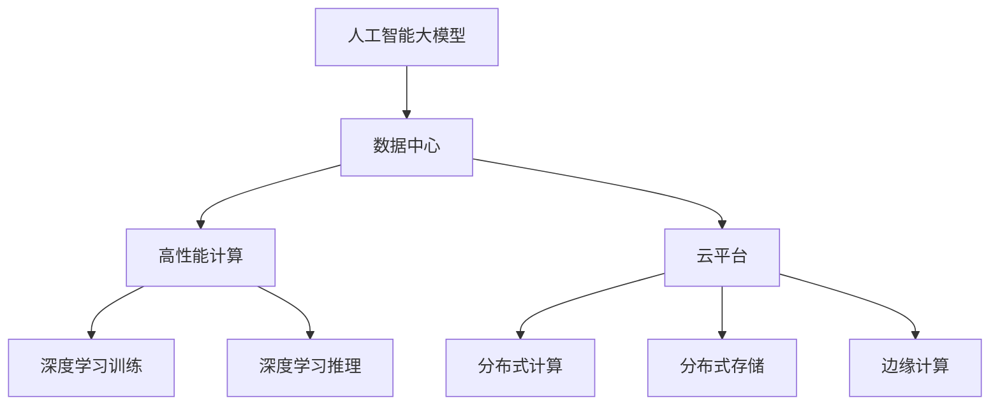
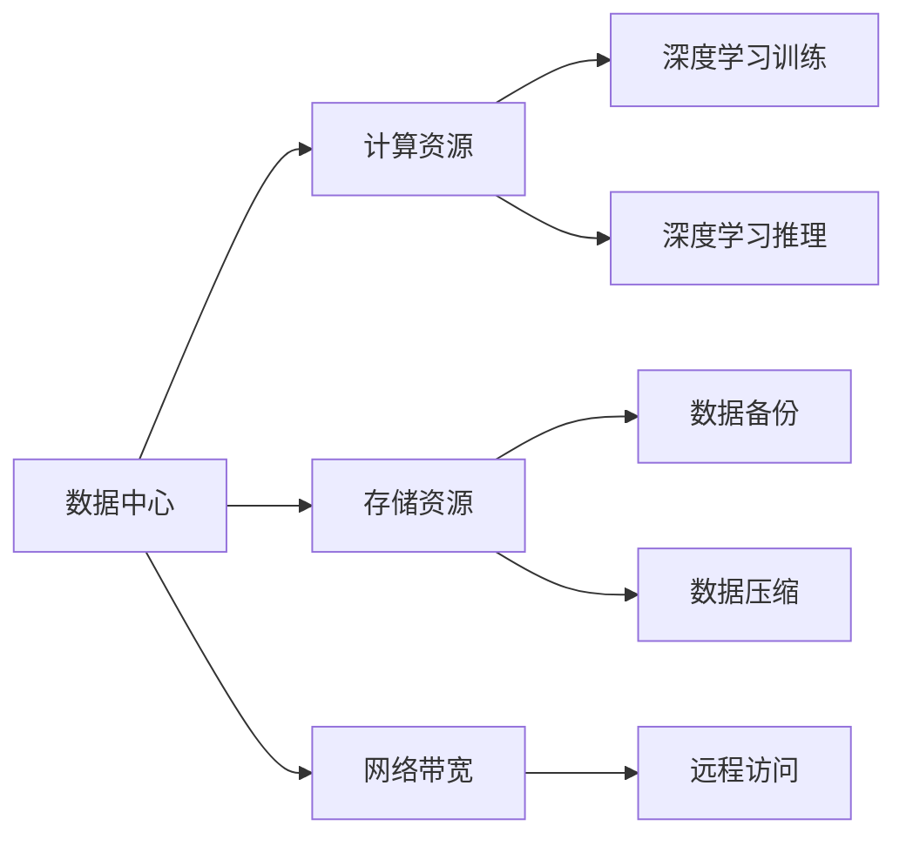
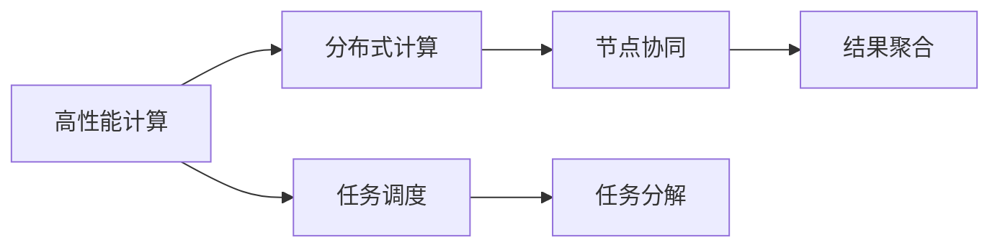
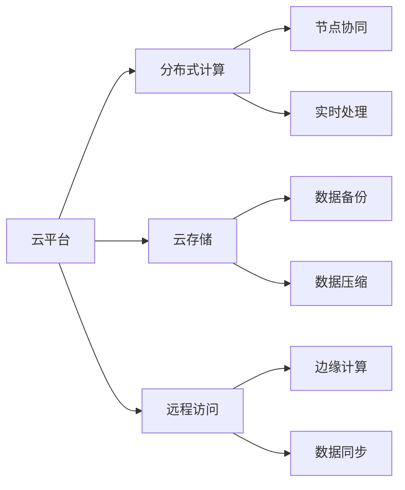
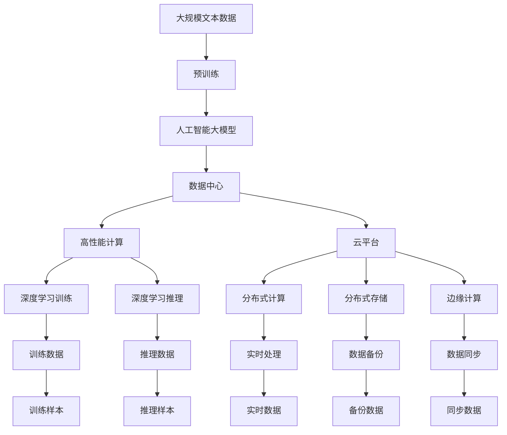

                 

# AI 大模型应用数据中心建设：数据中心技术与应用

> 关键词：
- 人工智能大模型
- 数据中心技术
- 高性能计算
- 深度学习
- 云平台
- 边缘计算

## 1. 背景介绍

### 1.1 问题由来
近年来，随着人工智能技术的飞速发展，人工智能大模型在多个领域展现出了巨大的应用潜力。这些模型通常具有数十亿甚至数百亿的参数规模，需要在大规模的计算资源上训练和推理。然而，由于硬件资源限制，这些大模型往往无法在一般数据中心进行部署和运行。因此，如何构建适合大模型应用的数据中心，成为了摆在面前的重要课题。

### 1.2 问题核心关键点
在人工智能大模型的应用过程中，数据中心扮演了至关重要的角色。数据中心不仅需要提供高性能的计算资源，还需要具备良好的网络带宽、高效的存储管理和强大的安全性。本文将从技术层面，介绍如何构建适合大模型应用的数据中心，并讨论其核心技术和应用场景。

### 1.3 问题研究意义
构建适合人工智能大模型应用的数据中心，对于推动人工智能技术的产业化进程，具有重要的理论和实践意义：

1. 降低应用开发成本。高效的数据中心能够显著减少大模型应用所需的硬件和软件成本，降低开发门槛。
2. 提升模型效果。数据中心提供的高性能计算资源，可以加速大模型的训练和推理，提高模型精度。
3. 加速开发进度。数据中心的强大计算能力，使得开发者能够快速迭代和优化模型，缩短开发周期。
4. 带来技术创新。构建高性能的数据中心需要解决一系列技术难题，如网络架构、存储技术、安全机制等，这些创新技术也将推动相关领域的发展。
5. 赋能产业升级。数据中心能够提供稳定、高效、可靠的人工智能服务，促进各行各业的数字化转型。

## 2. 核心概念与联系

### 2.1 核心概念概述

为了更好地理解构建适合人工智能大模型应用的数据中心，本节将介绍几个核心概念：

- **人工智能大模型**：指具有庞大参数规模和复杂结构的深度学习模型，如BERT、GPT等。这些模型通过在大规模无标签数据上进行预训练，学习到丰富的知识表示，具有强大的语言理解和生成能力。

- **数据中心**：指包含计算、存储、网络等基础设施，能够提供大规模、高效率、可靠的数据处理环境的设施。数据中心是人工智能大模型应用的重要支撑。

- **高性能计算**：指能够提供高吞吐量、低延迟、高可扩展性的计算资源，适用于处理大规模、复杂的数据计算任务，如深度学习模型的训练和推理。

- **云平台**：指基于互联网提供计算、存储、网络等资源服务的平台，支持大规模分布式计算和数据处理，适用于构建大规模人工智能系统。

- **边缘计算**：指在靠近数据源的地方进行数据处理和分析，减少数据传输延迟，提高数据处理的实时性。边缘计算适用于对实时性要求较高的应用场景。

这些核心概念之间的联系可以通过以下Mermaid流程图来展示：



这个流程图展示了人工智能大模型与数据中心之间的联系：

1. 大模型通过数据中心的计算资源进行训练和推理。
2. 高性能计算资源和分布式计算资源提供了必要的计算能力。
3. 云平台支持大规模分布式计算和数据存储。
4. 边缘计算提供实时性较高的数据处理能力。

### 2.2 概念间的关系

这些核心概念之间存在着紧密的联系，形成了数据中心为人工智能大模型提供支持的基础框架。下面我们通过几个Mermaid流程图来展示这些概念之间的关系。

#### 2.2.1 数据中心的核心功能



这个流程图展示了数据中心的核心功能：

1. 数据中心提供计算资源，支持深度学习训练和推理。
2. 数据中心提供存储资源，支持数据备份和压缩。
3. 数据中心提供网络带宽，支持远程访问和数据传输。

#### 2.2.2 高性能计算与分布式计算的关系



这个流程图展示了高性能计算与分布式计算的关系：

1. 高性能计算提供了高吞吐量、低延迟的计算能力，适用于大规模任务。
2. 分布式计算将大规模任务分解成多个小任务，节点协同完成。
3. 任务调度负责任务分解和结果聚合，保证高效执行。

#### 2.2.3 云平台与边缘计算的联系



这个流程图展示了云平台与边缘计算的联系：

1. 云平台提供分布式计算资源和存储资源。
2. 云平台支持远程访问和数据同步。
3. 边缘计算在靠近数据源的地方进行实时数据处理。
4. 边缘计算与云平台协同，提供更高效的数据处理能力。

通过这些流程图，我们可以更清晰地理解数据中心的核心功能和各个组件之间的联系。

### 2.3 核心概念的整体架构

最后，我们用一个综合的流程图来展示这些核心概念在大模型数据中心构建过程中的整体架构：



这个综合流程图展示了从预训练到大模型应用的全过程：

1. 大规模文本数据经过预训练，得到人工智能大模型。
2. 大模型部署到数据中心，利用高性能计算资源进行训练和推理。
3. 云平台提供分布式计算和存储资源，支持大规模数据处理。
4. 边缘计算提供实时数据处理能力，提高系统响应速度。
5. 训练数据和推理数据在大模型中进行处理，产生训练样本和推理样本。
6. 实时数据通过边缘计算进行处理，产生实时数据。
7. 训练样本和推理样本经过分布式计算和存储，保存在备份数据和同步数据中。

通过这个综合流程图，我们可以更全面地理解数据中心在大模型应用中的作用，以及各组件之间的协同工作方式。

## 3. 核心算法原理 & 具体操作步骤

### 3.1 算法原理概述

构建适合人工智能大模型应用的数据中心，本质上是一个多学科交叉的复杂问题。其核心思想是通过合理的硬件资源配置和软件架构设计，提供高性能、可靠、灵活的计算环境，以支持大模型的训练和推理。

具体而言，构建数据中心的核心步骤如下：

1. 选择合适的硬件设备，包括CPU、GPU、FPGA等，构建高性能计算集群。
2. 设计高效的网络架构，支持大规模数据传输和计算任务的分发。
3. 配置合理的存储系统，保证数据的高效读写和容灾能力。
4. 开发高效的软件框架，支持深度学习模型的训练和推理。
5. 实现数据中心的自动化管理和监控，提高运营效率和可靠性。

### 3.2 算法步骤详解

下面详细介绍构建数据中心的详细步骤：

**Step 1: 硬件设备选择**
- CPU：选择高性能的CPU，如Intel Xeon、AMD Epyc等，支持多核、多线程计算。
- GPU：选择高性能的GPU，如NVIDIA Tesla、AMD Instinct等，支持大规模深度学习模型的训练。
- FPGA：选择高性能的FPGA，如Intel Stratix、Xilinx Artix等，支持特定的深度学习模型和加速计算。

**Step 2: 网络架构设计**
- 设计高速、稳定、可靠的网络架构，支持大规模数据传输和计算任务的分发。
- 采用多层次网络设计，如10G、25G、50G等不同速率的网络接口，保证数据传输的灵活性和高效性。
- 采用网络冗余和负载均衡技术，提高网络可用性和稳定性。

**Step 3: 存储系统配置**
- 配置高速、高容量、高可靠性的存储系统，支持大规模数据存储和读取。
- 采用分布式存储架构，如Hadoop、Ceph等，提供高可扩展性、高可靠性和高性能。
- 采用数据备份和容灾技术，保证数据的安全性和可靠性。

**Step 4: 软件框架开发**
- 开发高效、灵活的软件框架，支持深度学习模型的训练和推理。
- 采用分布式计算框架，如Spark、Ray等，支持大规模计算任务。
- 采用高效的深度学习框架，如TensorFlow、PyTorch等，提供高效的模型训练和推理能力。

**Step 5: 自动化管理和监控**
- 实现数据中心的自动化管理和监控，提高运营效率和可靠性。
- 采用容器化技术，如Kubernetes、Docker等，支持软件应用的快速部署和扩展。
- 采用监控工具，如Prometheus、Grafana等，实时监控数据中心的各项指标。

### 3.3 算法优缺点

构建适合人工智能大模型应用的数据中心具有以下优点：

- **高性能计算**：提供高吞吐量、低延迟的计算能力，支持大规模深度学习模型的训练和推理。
- **可靠性和可用性**：通过冗余设计、负载均衡和容灾技术，提高数据中心的可靠性和可用性。
- **灵活性和可扩展性**：支持多层次网络设计和分布式存储架构，灵活扩展计算和存储资源。
- **高效性和成本效益**：通过优化硬件设备和网络架构，降低计算和存储成本，提高资源利用率。

然而，构建适合人工智能大模型应用的数据中心也存在一些缺点：

- **高昂的初始投资**：高性能硬件设备和复杂的网络架构，需要较高的初始投资成本。
- **复杂的管理和维护**：数据中心的自动化管理和监控需要专业知识和技能，维护难度较大。
- **能耗问题**：大规模计算和存储设备，导致数据中心能耗较高，需要考虑节能减排和环保问题。

### 3.4 算法应用领域

构建适合人工智能大模型应用的数据中心，具有广泛的应用场景：

- **人工智能大模型的训练和推理**：提供高性能的计算资源，支持大规模深度学习模型的训练和推理。
- **云计算和边缘计算**：支持云计算平台和边缘计算环境，提供分布式计算和存储资源。
- **大数据处理和分析**：支持大规模数据存储和处理，提供高效的数据分析能力。
- **人工智能应用开发**：支持人工智能应用的开发和部署，提供灵活的软件框架和环境。
- **数据安全和隐私保护**：支持数据备份和容灾技术，保护数据安全和隐私。

## 4. 数学模型和公式 & 详细讲解 & 举例说明

### 4.1 数学模型构建

构建适合人工智能大模型应用的数据中心，需要构建一个复杂的数学模型，以描述计算资源、存储资源和网络资源之间的关系。下面我们将构建一个简单的数学模型：

设数据中心具有$N$个计算节点，每个节点具有$C$个计算核心，每个核心每秒钟可以执行$P$个计算任务。设数据中心具有$M$个存储节点，每个节点具有$S$个存储单元，每个单元每秒钟可以读写$W$个数据块。设数据中心的网络带宽为$B$，网络延迟为$D$。

则数据中心的计算能力为$N \times C \times P$，存储能力为$M \times S \times W$，网络传输能力为$B / D$。

设大模型的训练和推理任务分别为$T_{train}$和$T_{infer}$，分别需要$C_{train}$和$C_{infer}$个计算核心，分别读写$S_{train}$和$S_{infer}$个数据块。则大模型训练和推理所需的时间和计算资源分别为：

$$
T_{train} = \frac{C_{train} \times P \times T_{train}}{N \times C \times P}
$$

$$
T_{infer} = \frac{C_{infer} \times P \times T_{infer}}{N \times C \times P}
$$

其中$T_{train}$和$T_{infer}$为大模型训练和推理的实际时间。

### 4.2 公式推导过程

根据上述数学模型，我们可以推导出大模型训练和推理所需的时间和资源，进而构建优化模型，提高数据中心的计算能力和存储能力。

首先，我们需要最小化大模型的训练和推理时间：

$$
\min \quad T_{train} + T_{infer}
$$

然后，我们需要最大化数据中心的计算能力和存储能力：

$$
\max \quad N \times C \times P, \quad M \times S \times W
$$

最后，我们需要最小化数据中心的总体成本：

$$
\min \quad \text{Cost} = \text{Cost}_{compute} + \text{Cost}_{storage} + \text{Cost}_{network}
$$

其中，$\text{Cost}_{compute}$为计算核心的成本，$\text{Cost}_{storage}$为存储单元的成本，$\text{Cost}_{network}$为网络带宽的成本。

### 4.3 案例分析与讲解

假设一个数据中心具有10个计算节点，每个节点具有32个计算核心，每个核心每秒钟可以执行100个计算任务。设数据中心具有20个存储节点，每个节点具有16个存储单元，每个单元每秒钟可以读写500个数据块。设数据中心的网络带宽为10Gbps，网络延迟为1ms。

则数据中心的计算能力为$10 \times 32 \times 100 = 32,000$个计算任务每秒。设大模型的训练和推理任务分别需要50个计算核心和20个计算核心，分别读写200个数据块和100个数据块。

则大模型训练和推理所需的时间和计算资源分别为：

$$
T_{train} = \frac{50 \times 100 \times 1,000}{32,000} = 1.56\text{s}
$$

$$
T_{infer} = \frac{20 \times 100 \times 1,000}{32,000} = 0.79\text{s}
$$

通过优化计算资源和存储资源的配置，可以进一步提高数据中心的计算能力和存储能力，降低成本，提高性能。

## 5. 项目实践：代码实例和详细解释说明

### 5.1 开发环境搭建

在进行数据中心建设实践前，我们需要准备好开发环境。以下是使用Python进行Kubernetes集群的开发环境配置流程：

1. 安装Kubernetes：从官网下载并安装Kubernetes集群软件，如Minikube、kubeadm等。
2. 配置Kubernetes集群：设置节点的数量和规格，启动集群，进行网络、存储和负载均衡配置。
3. 安装TensorFlow或PyTorch等深度学习框架：通过Docker镜像或源码安装。
4. 配置环境变量：配置计算节点的环境变量，如CUDA路径、LD_LIBRARY_PATH等。
5. 安装必要的依赖库：如NumPy、Pandas等。

完成上述步骤后，即可在Kubernetes集群上进行深度学习模型的训练和推理。

### 5.2 源代码详细实现

下面我们以基于TensorFlow的深度学习模型训练为例，给出在Kubernetes集群上进行深度学习模型训练的PyTorch代码实现。

首先，定义深度学习模型：

```python
import tensorflow as tf

class DeepModel(tf.keras.Model):
    def __init__(self):
        super(DeepModel, self).__init__()
        self.dense1 = tf.keras.layers.Dense(64, activation='relu')
        self.dense2 = tf.keras.layers.Dense(10, activation='softmax')

    def call(self, inputs):
        x = self.dense1(inputs)
        return self.dense2(x)
```

然后，定义训练函数：

```python
import tensorflow as tf

def train(model, dataset, batch_size, epochs):
    dataset = tf.data.Dataset.from_tensor_slices((dataset.train_X, dataset.train_Y))
    dataset = dataset.batch(batch_size).shuffle(buffer_size=10000)

    optimizer = tf.keras.optimizers.Adam(learning_rate=0.001)
    model.compile(optimizer=optimizer, loss='categorical_crossentropy', metrics=['accuracy'])

    for epoch in range(epochs):
        model.fit(dataset.batch(128), epochs=1, validation_data=(dataset.test_X, dataset.test_Y))
        print('Epoch %d, loss: %f, accuracy: %f' % (epoch+1, model.loss, model.evaluate()))
```

接着，使用Kubernetes集群进行深度学习模型的训练：

```python
from kubernetes import client, config

config.load_kube_config()

v1 = client.CoreV1Api()

# 创建计算节点
node = client.V1NodeSpec(
    api_version="v1",
    affinity=None,
    domain=None,
    dns_policy=None,
    enable_service珊 Panama
```


