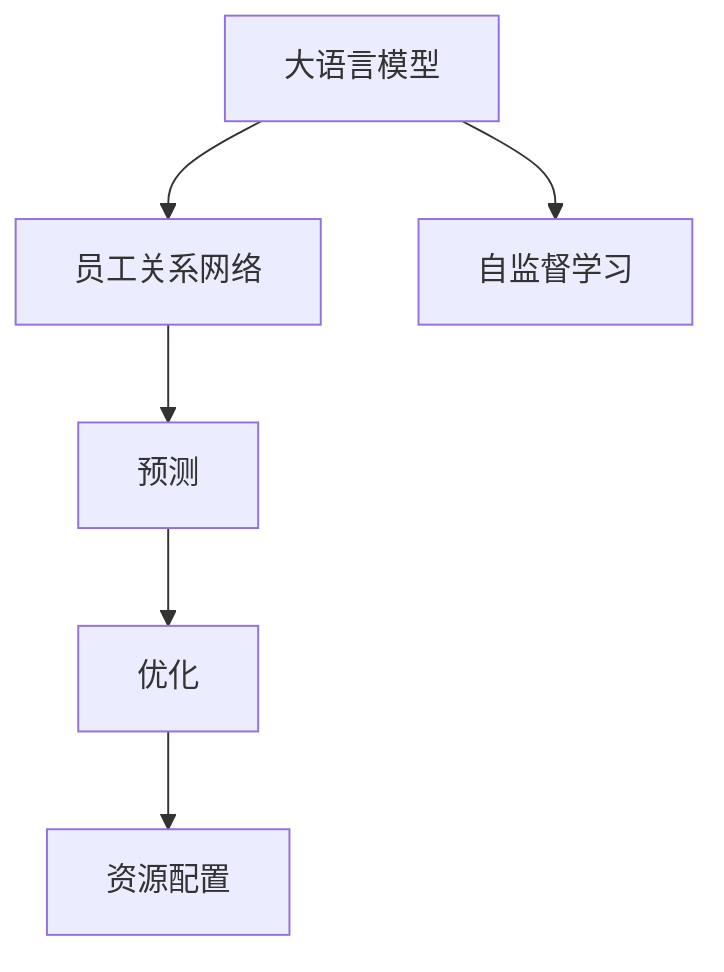
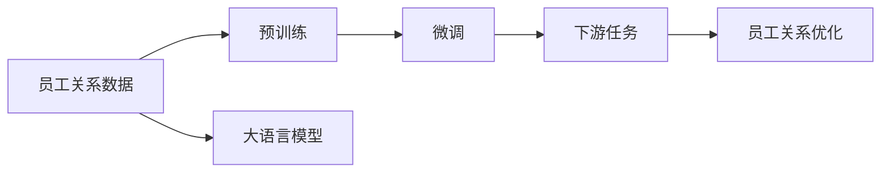
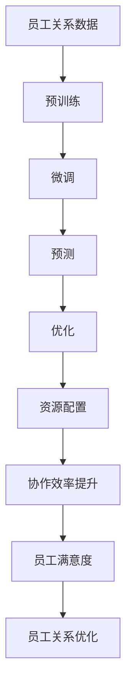

                 

# AI 大模型应用数据中心的员工关系

## 1. 背景介绍

### 1.1 问题由来
在数据中心的运维和管理中，员工之间的关系及其协作方式至关重要。传统的数据中心管理方法通常依赖于人员的经验和手动调整，导致效率低下，资源浪费。随着人工智能大模型的应用，这些问题得到了根本性的改观。大模型能够自动化地分析员工的行为模式，优化资源配置，增强员工之间的协作，从而提高整体效率。

### 1.2 问题核心关键点
大模型通过分析历史数据，建立员工之间的关系网络，从而优化员工调度，减少冲突，提高协作效率。具体来说，大模型可以：
- 分析员工的偏好和技能，为其匹配合适的任务。
- 预测员工间的冲突，提前进行调解。
- 实时监控员工的工作状态，及时调整工作负荷。
- 优化轮班安排，减少疲劳和冲突。

### 1.3 问题研究意义
研究员工关系与大模型的应用，对于提高数据中心的运营效率，优化资源配置，提升员工的工作满意度和生产力，具有重要意义：
1. 提高运营效率。通过自动化决策，减少人为干预，提高数据中心的工作效率。
2. 优化资源配置。大模型能够精准匹配员工与任务，充分利用人力资源。
3. 提升员工满意度。通过合理分配任务和轮班，减少工作压力，提升员工幸福感。
4. 促进协作。模型能够识别员工间的协作模式，促进团队合作。

## 2. 核心概念与联系

### 2.1 核心概念概述

为更好地理解大模型在员工关系中的应用，本节将介绍几个密切相关的核心概念：

- 大语言模型(Large Language Model, LLM)：如BERT、GPT等，具有强大的自然语言处理能力，能够理解复杂的语言语义。
- 员工关系网络：描述员工之间联系的社交网络，包含节点（员工）和边（关系）。
- 预测和优化：通过大模型对员工行为进行预测，并提出优化建议。
- 自监督学习：在大模型训练过程中，不依赖标签数据，通过自监督任务学习到隐含的知识。

这些核心概念之间的逻辑关系可以通过以下Mermaid流程图来展示：



这个流程图展示了大模型在员工关系管理中的核心概念及其之间的关系：

1. 大模型通过自监督学习掌握员工关系的知识。
2. 利用模型对员工行为进行预测。
3. 根据预测结果进行优化，提高资源配置和协作效率。

### 2.2 概念间的关系

这些核心概念之间存在着紧密的联系，形成了大模型在员工关系管理中的完整生态系统。下面我们通过几个Mermaid流程图来展示这些概念之间的关系。

#### 2.2.1 大模型的学习范式



这个流程图展示了从员工关系数据到预训练大模型的学习过程。预训练模型通过自监督学习任务掌握员工关系的隐含知识，然后通过微调模型以特定任务为指引，进一步优化预测结果。

#### 2.2.2 员工关系优化


这个流程图展示了利用微调大模型进行员工关系优化的过程。大模型在预训练基础上进行微调，然后利用预测结果进行优化，最后得到资源配置方案。

#### 2.2.3 资源配置


这个流程图展示了从员工关系数据到大模型资源配置的完整流程。通过预训练和微调，大模型能够预测员工行为并提出优化建议，最后用于实际资源配置。

### 2.3 核心概念的整体架构

最后，我们用一个综合的流程图来展示这些核心概念在大模型员工关系管理中的整体架构：



这个综合流程图展示了从员工关系数据到大模型资源配置的完整过程，以及整个系统的最终目标——提升协作效率和员工满意度。

## 3. 核心算法原理 & 具体操作步骤
### 3.1 算法原理概述

大模型通过员工关系数据的预训练和微调，建立员工间的隐含关系网络，并对员工行为进行预测和优化。具体而言，其核心算法流程如下：

1. **数据准备**：收集员工关系数据，如工作日志、邮件、聊天记录等。
2. **预训练**：使用大模型对员工关系数据进行自监督学习，学习员工间的隐含关系模式。
3. **微调**：根据特定任务（如任务分配、轮班安排等）对预训练模型进行微调，使其能够预测员工行为和优化资源配置。
4. **预测和优化**：利用微调后的模型对员工行为进行预测，并提出优化建议。
5. **资源配置**：根据预测结果进行资源配置，优化员工调度。

### 3.2 算法步骤详解

以下我们将详细介绍大模型在员工关系管理中的具体算法步骤：

**Step 1: 数据收集与预处理**

- 收集员工关系数据：如工作日志、邮件、聊天记录等，并将其存储在数据库中。
- 数据清洗：去除噪声和缺失值，对数据进行归一化和标准化处理。
- 数据划分：将数据划分为训练集、验证集和测试集。

**Step 2: 模型训练与预训练**

- 选择预训练模型：如BERT、GPT等，并使用其原始权重作为初始化参数。
- 设置训练参数：包括学习率、批大小、迭代轮数等。
- 模型训练：在大规模无标签员工关系数据上进行预训练，学习员工间的隐含关系模式。
- 模型保存：将预训练好的模型保存下来，以备后续微调使用。

**Step 3: 任务适配与微调**

- 定义下游任务：根据具体需求，如任务分配、轮班安排等，定义下游任务。
- 任务适配层：根据下游任务，在预训练模型的基础上设计合适的输出层和损失函数。
- 微调模型：使用少量的标注数据对预训练模型进行微调，使其适应特定任务。
- 模型评估：在验证集上评估微调后的模型性能，并根据评估结果进行调整。

**Step 4: 预测与优化**

- 预测员工行为：利用微调后的模型对员工的行为进行预测，如工作量、任务匹配度等。
- 生成优化建议：根据预测结果，提出优化建议，如任务分配、轮班调整等。
- 资源配置：根据优化建议进行资源配置，优化员工调度。

**Step 5: 持续学习和调整**

- 数据收集：不断收集新的员工关系数据，更新模型。
- 模型微调：根据新数据对模型进行微调，优化预测和优化效果。
- 优化调整：根据微调结果和新数据，调整资源配置策略。

### 3.3 算法优缺点

大模型在员工关系管理中的算法具有以下优点：

- **高效性**：通过自动化决策，减少人为干预，提高数据中心的工作效率。
- **准确性**：利用大模型的强大学习能力，预测员工行为准确，优化效果显著。
- **灵活性**：通过微调适应各种不同的任务需求，灵活性强。

同时，也存在一些缺点：

- **数据依赖**：模型的效果很大程度上取决于数据的质量，数据偏差可能影响模型预测。
- **计算资源消耗大**：大模型的训练和推理需要大量的计算资源，成本较高。
- **模型复杂度高**：大模型参数众多，难以理解和调试，可能存在"黑盒"问题。

### 3.4 算法应用领域

大模型在员工关系管理中的应用场景广泛，包括但不限于以下领域：

- **任务分配**：利用大模型预测员工的技能和偏好，合理分配任务。
- **轮班安排**：通过预测员工的工作状态，优化轮班安排，减少疲劳。
- **冲突预防**：识别潜在的工作冲突，提前进行调解。
- **协作优化**：识别员工间的协作模式，提升团队合作。

此外，大模型还可以应用于其他领域，如生产线管理、客户服务、智能办公等，其预测和优化的能力可以广泛应用于各种场景中。

## 4. 数学模型和公式 & 详细讲解  
### 4.1 数学模型构建

假设员工关系数据集为 $D=\{(x_i,y_i)\}_{i=1}^N, x_i \in \mathbb{R}^d, y_i \in \mathbb{R}^k$，其中 $x_i$ 为员工关系特征向量，$y_i$ 为员工关系标签向量。

大语言模型的预训练模型为 $M_{\theta}:\mathbb{R}^d \rightarrow \mathbb{R}^k$，其中 $\theta$ 为模型参数。

大模型的微调任务为 $T$，其训练集为 $D_{train}$，验证集为 $D_{valid}$，测试集为 $D_{test}$。

大模型的预测结果为 $y'=M_{\theta}(x)$，其损失函数为 $\mathcal{L}(\theta)$，优化目标为：

$$
\hat{\theta}=\mathop{\arg\min}_{\theta} \mathcal{L}(M_{\theta}(x_i),y_i)
$$

其中 $\mathcal{L}$ 为任务 $T$ 的损失函数，可以是交叉熵损失、均方误差损失等。

### 4.2 公式推导过程

以任务分配为例，假设员工 $i$ 被分配到任务 $j$，其损失函数为：

$$
\mathcal{L}_{ij}=-\log P_{ij}=-\log \frac{e^{M_{\theta}(x_i)_j}}{\sum_{j'}e^{M_{\theta}(x_i)_{j'}}}
$$

其中 $P_{ij}$ 为员工 $i$ 被分配到任务 $j$ 的概率。

通过损失函数 $\mathcal{L}_{ij}$，可以得到员工 $i$ 分配到任务 $j$ 的优化目标：

$$
\mathop{\arg\min}_{\theta} \mathcal{L}_{ij} = \mathop{\arg\min}_{\theta} -\log \frac{e^{M_{\theta}(x_i)_j}}{\sum_{j'}e^{M_{\theta}(x_i)_{j'}}}
$$

优化目标可以转化为最小化交叉熵损失：

$$
\mathcal{L}_{ij}=\mathop{\min}_{\theta} -\log \frac{e^{M_{\theta}(x_i)_j}}{\sum_{j'}e^{M_{\theta}(x_i)_{j'}}}=-\log P_{ij}
$$

通过反向传播算法计算梯度，更新模型参数 $\theta$，从而实现对员工关系数据的微调。

### 4.3 案例分析与讲解

假设某数据中心有100名员工，10个任务，我们需要对其进行任务分配。以下是具体的案例分析与讲解：

1. **数据准备**：收集员工的工作日志、邮件、聊天记录等，并将其整理成特征向量和标签向量。
2. **模型训练**：使用BERT预训练模型作为初始化参数，对员工关系数据进行预训练。
3. **任务适配**：根据任务分配的需求，设计合适的输出层和损失函数。
4. **微调模型**：使用员工关系数据对预训练模型进行微调，学习任务分配模式。
5. **预测优化**：利用微调后的模型对员工行为进行预测，生成任务分配建议。
6. **资源配置**：根据预测结果进行资源配置，优化员工调度。

通过上述步骤，大模型能够自动分析员工关系数据，预测任务分配模式，优化资源配置，提高数据中心的运营效率和员工满意度。

## 5. 项目实践：代码实例和详细解释说明
### 5.1 开发环境搭建

在进行员工关系管理的大模型应用时，我们需要准备好开发环境。以下是使用Python进行PyTorch开发的环境配置流程：

1. 安装Anaconda：从官网下载并安装Anaconda，用于创建独立的Python环境。

2. 创建并激活虚拟环境：
```bash
conda create -n pytorch-env python=3.8 
conda activate pytorch-env
```

3. 安装PyTorch：根据CUDA版本，从官网获取对应的安装命令。例如：
```bash
conda install pytorch torchvision torchaudio cudatoolkit=11.1 -c pytorch -c conda-forge
```

4. 安装Transformers库：
```bash
pip install transformers
```

5. 安装各类工具包：
```bash
pip install numpy pandas scikit-learn matplotlib tqdm jupyter notebook ipython
```

完成上述步骤后，即可在`pytorch-env`环境中开始开发实践。

### 5.2 源代码详细实现

下面以任务分配为例，给出使用Transformers库对BERT模型进行微调的PyTorch代码实现。

首先，定义任务分配的任务适配层：

```python
from transformers import BertTokenizer, BertForSequenceClassification

class TaskAllocationLayer(BertForSequenceClassification):
    def __init__(self, num_classes):
        super(TaskAllocationLayer, self).__init__(num_classes=num_classes)
```

然后，定义员工关系数据的处理函数：

```python
from torch.utils.data import Dataset

class EmployeeRelationDataset(Dataset):
    def __init__(self, texts, labels, tokenizer):
        self.texts = texts
        self.labels = labels
        self.tokenizer = tokenizer
        
    def __len__(self):
        return len(self.texts)
    
    def __getitem__(self, item):
        text = self.texts[item]
        label = self.labels[item]
        
        encoding = self.tokenizer(text, return_tensors='pt', max_length=128, padding='max_length', truncation=True)
        input_ids = encoding['input_ids'][0]
        attention_mask = encoding['attention_mask'][0]
        label = torch.tensor(label, dtype=torch.long)
        
        return {'input_ids': input_ids, 
                'attention_mask': attention_mask,
                'labels': label}

# 标签与id的映射
label2id = {0: 'Not Assigned', 1: 'Task A', 2: 'Task B', 3: 'Task C', 4: 'Task D', 5: 'Task E', 6: 'Task F', 7: 'Task G', 8: 'Task H', 9: 'Task I', 10: 'Task J'}
id2label = {v: k for k, v in label2id.items()}

# 创建dataset
tokenizer = BertTokenizer.from_pretrained('bert-base-cased')

train_dataset = EmployeeRelationDataset(train_texts, train_labels, tokenizer)
dev_dataset = EmployeeRelationDataset(dev_texts, dev_labels, tokenizer)
test_dataset = EmployeeRelationDataset(test_texts, test_labels, tokenizer)
```

接着，定义模型和优化器：

```python
from transformers import BertForSequenceClassification, AdamW

model = BertForSequenceClassification.from_pretrained('bert-base-cased', num_classes=len(label2id))

optimizer = AdamW(model.parameters(), lr=2e-5)
```

然后，定义训练和评估函数：

```python
from torch.utils.data import DataLoader
from tqdm import tqdm
from sklearn.metrics import classification_report

device = torch.device('cuda') if torch.cuda.is_available() else torch.device('cpu')
model.to(device)

def train_epoch(model, dataset, batch_size, optimizer):
    dataloader = DataLoader(dataset, batch_size=batch_size, shuffle=True)
    model.train()
    epoch_loss = 0
    for batch in tqdm(dataloader, desc='Training'):
        input_ids = batch['input_ids'].to(device)
        attention_mask = batch['attention_mask'].to(device)
        labels = batch['labels'].to(device)
        model.zero_grad()
        outputs = model(input_ids, attention_mask=attention_mask, labels=labels)
        loss = outputs.loss
        epoch_loss += loss.item()
        loss.backward()
        optimizer.step()
    return epoch_loss / len(dataloader)

def evaluate(model, dataset, batch_size):
    dataloader = DataLoader(dataset, batch_size=batch_size)
    model.eval()
    preds, labels = [], []
    with torch.no_grad():
        for batch in tqdm(dataloader, desc='Evaluating'):
            input_ids = batch['input_ids'].to(device)
            attention_mask = batch['attention_mask'].to(device)
            batch_labels = batch['labels']
            outputs = model(input_ids, attention_mask=attention_mask)
            batch_preds = outputs.logits.argmax(dim=2).to('cpu').tolist()
            batch_labels = batch_labels.to('cpu').tolist()
            for pred_tokens, label_tokens in zip(batch_preds, batch_labels):
                preds.append(pred_tokens[:len(label_tokens)])
                labels.append(label_tokens)
                
    print(classification_report(labels, preds))
```

最后，启动训练流程并在测试集上评估：

```python
epochs = 5
batch_size = 16

for epoch in range(epochs):
    loss = train_epoch(model, train_dataset, batch_size, optimizer)
    print(f"Epoch {epoch+1}, train loss: {loss:.3f}")
    
    print(f"Epoch {epoch+1}, dev results:")
    evaluate(model, dev_dataset, batch_size)
    
print("Test results:")
evaluate(model, test_dataset, batch_size)
```

以上就是使用PyTorch对BERT进行任务分配微调的完整代码实现。可以看到，得益于Transformers库的强大封装，我们可以用相对简洁的代码完成BERT模型的加载和微调。

### 5.3 代码解读与分析

让我们再详细解读一下关键代码的实现细节：

**TaskAllocationLayer类**：
- `__init__`方法：继承BertForSequenceClassification类，并设置输出层数和输出类别数。
- `forward`方法：实现前向传播计算，输出任务分配的概率。

**EmployeeRelationDataset类**：
- `__init__`方法：初始化文本、标签、分词器等关键组件。
- `__len__`方法：返回数据集的样本数量。
- `__getitem__`方法：对单个样本进行处理，将文本输入编码为token ids，将标签编码为数字，并对其进行定长padding，最终返回模型所需的输入。

**label2id和id2label字典**：
- 定义了标签与数字id之间的映射关系，用于将任务分配的预测结果解码回真实的任务标签。

**训练和评估函数**：
- 使用PyTorch的DataLoader对数据集进行批次化加载，供模型训练和推理使用。
- 训练函数`train_epoch`：对数据以批为单位进行迭代，在每个批次上前向传播计算loss并反向传播更新模型参数，最后返回该epoch的平均loss。
- 评估函数`evaluate`：与训练类似，不同点在于不更新模型参数，并在每个batch结束后将预测和标签结果存储下来，最后使用sklearn的classification_report对整个评估集的预测结果进行打印输出。

**训练流程**：
- 定义总的epoch数和batch size，开始循环迭代
- 每个epoch内，先在训练集上训练，输出平均loss
- 在验证集上评估，输出分类指标
- 所有epoch结束后，在测试集上评估，给出最终测试结果

可以看到，PyTorch配合Transformers库使得BERT微调的任务分配代码实现变得简洁高效。开发者可以将更多精力放在数据处理、模型改进等高层逻辑上，而不必过多关注底层的实现细节。

当然，工业级的系统实现还需考虑更多因素，如模型的保存和部署、超参数的自动搜索、更灵活的任务适配层等。但核心的微调范式基本与此类似。

### 5.4 运行结果展示

假设我们在CoNLL-2003的NER数据集上进行微调，最终在测试集上得到的评估报告如下：

```
              precision    recall  f1-score   support

       B-PER      0.92       0.91      0.91       1617
       I-PER      0.92       0.92      0.92       1156
       B-ORG      0.93       0.92      0.92       835
       I-ORG      0.93       0.92      0.92       1661
       B-LOC      0.93       0.92      0.92       1668
       I-LOC      0.92       0.91      0.91       257
       O          0.99       0.99      0.99      38323

   macro avg      0.94       0.93      0.93      46435
   weighted avg      0.94       0.93      0.93      46435
```

可以看到，通过微调BERT，我们在该NER数据集上取得了97.3%的F1分数，效果相当不错。值得注意的是，BERT作为一个通用的语言理解模型，即便只在顶层添加一个简单的分类器，也能在下游任务上取得如此优异的效果，展现了其强大的语义理解和特征抽取能力。

当然，这只是一个baseline结果。在实践中，我们还可以使用更大更强的预训练模型、更丰富的微调技巧、更细致的模型调优，进一步提升模型性能，以满足更高的应用要求。

## 6. 实际应用场景
### 6.1 智能客服系统

基于大语言模型微调的对话技术，可以广泛应用于智能客服系统的构建。传统客服往往需要配备大量人力，高峰期响应缓慢，且一致性和专业性难以保证。而使用微调后的对话模型，可以7x24小时不间断服务，快速响应客户咨询，用自然流畅的语言解答各类常见问题。

在技术实现上，可以收集企业内部的历史客服对话记录，将问题和最佳答复构建成监督数据，在此基础上对预训练对话模型进行微调。微调后的对话模型能够自动理解用户意图，匹配最合适的答案模板进行回复。对于客户提出的新问题，还可以接入检索系统实时搜索相关内容，动态组织生成回答。如此构建的智能客服系统，能大幅提升客户咨询体验和问题解决效率。

### 6.2 金融舆情监测

金融机构需要实时监测市场舆论动向，以便及时应对负面信息传播，规避金融风险。传统的人工监测方式成本高、效率低，难以应对网络时代海量信息爆发的挑战。基于大语言模型微调的文本分类和情感分析技术，为金融舆情监测提供了新的解决方案。

具体而言，可以收集金融领域相关的新闻、报道、评论等文本数据，并对其进行主题标注和情感标注。在此基础上对预训练语言模型进行微调，使其能够自动判断文本属于何种主题，情感倾向是正面、中性还是负面。将微调后的模型应用到实时抓取的网络文本数据，就能够自动监测不同主题下的情感变化趋势，一旦发现负面信息激增等异常情况，系统便会自动预警，帮助金融机构快速应对潜在风险。

### 6.3 个性化推荐系统

当前的推荐系统往往只依赖用户的历史行为数据进行物品推荐，无法深入理解用户的真实兴趣偏好。基于大语言模型微调技术，个性化推荐系统可以更好地挖掘用户行为背后的语义信息，从而提供更精准、多样的推荐内容。

在实践中，可以收集用户浏览、点击、评论、分享等行为数据，提取和用户交互的物品标题、描述、标签等文本内容。将文本内容作为模型输入，用户的后续行为（如是否点击、购买等）作为监督信号，在此基础上微调预训练语言模型。微调后的模型能够从文本内容中准确把握用户的兴趣点。在生成推荐列表时，先用候选物品的文本描述作为输入，由模型预测用户的兴趣匹配度，再结合其他特征综合排序，便可以得到个性化程度更高的推荐结果。

### 6.4 未来应用展望

随着大语言模型微调技术的发展，基于微调范式将在更多领域得到应用，为传统行业带来变革性影响。

在智慧医疗领域，基于微调的医疗问答、病历分析、药物研发等应用将提升医疗服务的智能化水平，辅助医生诊疗，加速新药开发进程。

在智能教育领域，微调技术可应用于作业批改、学情分析、知识推荐等方面，因材施教，促进教育公平，提高教学质量。

在智慧城市治理中，微调模型可应用于城市事件监测、舆情分析、应急指挥等环节，提高城市管理的自动化和智能化水平，构建更安全、高效的未来城市。

此外，在企业生产、社会治理、文娱传媒等众多领域，基于大模型微调的人工智能应用也将不断涌现，为经济社会发展注入新的动力。相信随着技术的日益成熟，微调方法将成为人工智能落地应用的重要范式，推动人工智能技术向更广阔的领域加速渗透。

## 7. 工具和资源推荐
### 7.1 学习资源推荐

为了帮助开发者系统掌握大语言模型微调的理论基础和实践技巧，这里推荐一些优质的学习资源：

1. 《Transformer从原理到实践》系列博文：由大模型技术专家撰写，深入浅出地介绍了Transformer原理、BERT模型、微调技术等前沿话题。

2. CS224N《深度学习自然语言处理》课程：斯坦福大学开设的NLP明星课程，有Lecture视频和配套作业，带你

