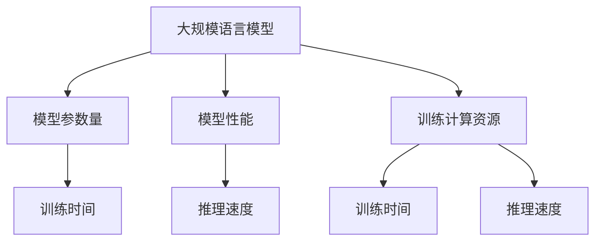
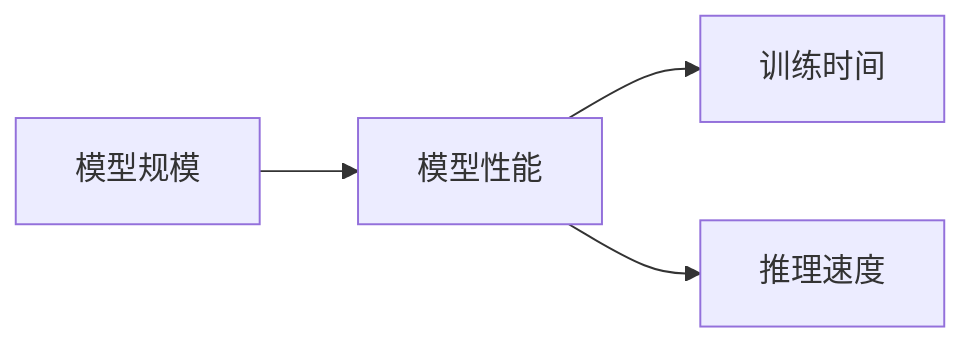
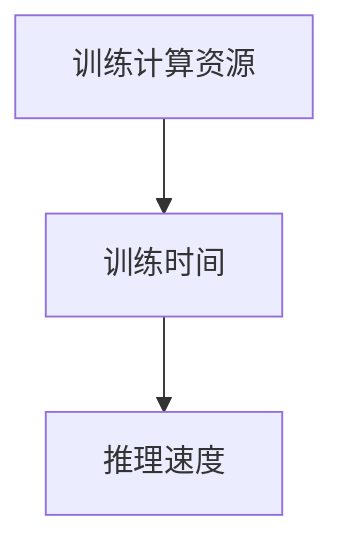
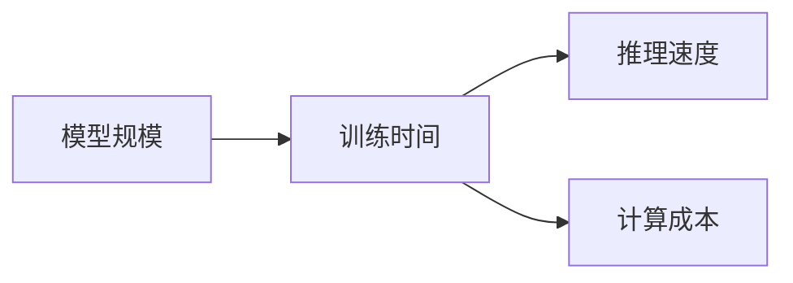
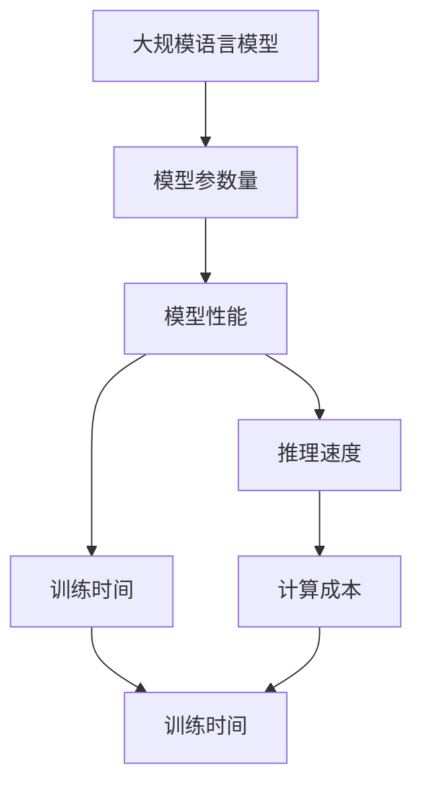

                 

# AI 大模型计算机科学家群英传：AI 大模型的规模定律 Scaling Law

## 1. 背景介绍

### 1.1 问题由来
近年来，AI大模型在各个领域取得了长足的进步，特别是OpenAI的GPT系列、Google的BERT等。这些大模型展示了强大的语言理解和生成能力，但在实际应用中，其规模化部署和参数优化面临巨大的挑战。

大规模语言模型的训练需要亿级的参数和数千个GPU的算力支持，这大大增加了成本和部署难度。大模型规模和性能之间的关系并非线性增长，而是遵循一定的规律。本文将重点介绍AI大模型的规模定律（Scaling Law），通过理论分析和实验验证，探索模型规模与性能之间的内在联系。

### 1.2 问题核心关键点
AI大模型的规模定律（Scaling Law），是指在训练数据和模型结构固定的情况下，模型性能随着参数数量的增加而变化的规律。通过研究这个定律，可以指导我们在模型训练和优化过程中选择合适的参数规模。

## 2. 核心概念与联系

### 2.1 核心概念概述

为更好地理解AI大模型的规模定律，本节将介绍几个密切相关的核心概念：

- 大规模语言模型（Large Language Models, LLMs）：以GPT系列和BERT为代表，具有数十亿参数的预训练模型，通过海量的无标签文本数据进行自监督预训练。
- 模型参数量（Model Parameter Count）：指模型中可训练的参数总数，反映了模型的复杂度和表达能力。
- 模型性能（Model Performance）：通过各种任务（如语言理解、生成、推理等）评估模型的准确性、流畅性和推理能力。
- 训练计算资源（Training Compute Resource）：包括GPU、TPU等硬件设备，以及相关的内存和存储资源。

这些核心概念之间的逻辑关系可以通过以下Mermaid流程图来展示：



这个流程图展示了模型规模、参数量、性能和训练资源之间的内在联系。

### 2.2 概念间的关系

这些核心概念之间存在着紧密的联系，形成了AI大模型训练和优化的完整生态系统。下面通过几个Mermaid流程图来展示这些概念之间的关系。

#### 2.2.1 模型规模与性能的关系



这个流程图展示了模型规模与性能之间的关系。模型规模越大，其性能也相应提升，但同时训练时间和推理速度也会随之增加。

#### 2.2.2 训练资源与性能的关系



这个流程图展示了训练资源与性能之间的关系。更多的计算资源可以缩短训练时间，提高推理速度，但模型的复杂度和成本也会相应增加。

#### 2.2.3 模型规模与资源的关系



这个流程图展示了模型规模与资源之间的关系。更大的模型需要更多的计算资源，训练时间和推理速度都会增加，但模型性能也会随之提升。

### 2.3 核心概念的整体架构

最后，我们用一个综合的流程图来展示这些核心概念在大模型训练和优化过程中的整体架构：



这个综合流程图展示了从模型规模到性能，再到训练资源和成本的整个架构。理解这个架构，有助于我们在模型训练和优化过程中做出更明智的决策。

## 3. 核心算法原理 & 具体操作步骤

### 3.1 算法原理概述

AI大模型的规模定律，其核心思想是在训练数据和模型结构固定的情况下，模型性能随着参数数量的增加而变化的规律。模型性能的提升主要依赖于两个方面：模型的复杂度和训练数据的质量。

模型的复杂度主要通过参数量来衡量，参数量越多，模型的表达能力越强。训练数据的质量则直接影响模型的学习效果，丰富的训练数据能够使模型更好地学习到语言规律和特征。

### 3.2 算法步骤详解

AI大模型的规模定律，可以通过以下几个步骤来理解和验证：

**Step 1: 准备预训练数据**
- 收集大规模无标签文本数据，如Wikipedia、CommonCrawl等，作为模型的预训练语料库。
- 确保数据的多样性和代表性，涵盖不同的语言风格、话题和领域。

**Step 2: 设计预训练模型**
- 选择合适的预训练模型架构，如Transformer、GPT等。
- 确定模型参数量和隐藏层规模，初步设定模型的复杂度。

**Step 3: 进行自监督预训练**
- 使用自监督预训练任务，如掩码语言建模、相对位置预测等，训练模型。
- 在预训练过程中，不断调整模型参数和超参数，优化模型性能。

**Step 4: 进行微调**
- 使用下游任务的标注数据，对预训练模型进行微调。
- 根据具体任务调整模型结构和损失函数，优化模型在特定任务上的表现。

**Step 5: 评估和优化**
- 使用测试集评估模型性能，包括精度、流畅度、推理能力等指标。
- 根据评估结果，进一步优化模型参数和训练资源，提升模型性能。

### 3.3 算法优缺点

AI大模型的规模定律，具有以下优点：
1. 提高模型性能：通过增加参数量，模型的表达能力增强，能够更好地处理复杂的语言任务。
2. 增强泛化能力：大规模模型能够学习到更丰富的语言特征，提升对新数据的适应性。
3. 降低标注成本：大规模模型在特定任务上的微调所需标注数据量较小，能够减少标注成本。

同时，该定律也存在一些局限性：
1. 训练资源消耗大：大规模模型的训练需要高算力和存储资源，成本较高。
2. 模型复杂度高：大规模模型结构复杂，推理和部署难度较大。
3. 泛化效果不确定：并非所有任务都能通过增加参数量获得性能提升，需要根据具体任务进行调整。

尽管存在这些局限性，但就目前而言，AI大模型的规模定律仍是大模型训练和优化过程中不可或缺的理论指导。

### 3.4 算法应用领域

AI大模型的规模定律，在各个领域的应用已经得到了广泛验证：

- 自然语言处理（NLP）：如语言理解、生成、翻译、摘要等任务，大模型通过增加参数量，提升了模型的表现。
- 计算机视觉（CV）：如图像分类、目标检测、图像生成等任务，大模型通过增加参数量，提升了模型的准确性和鲁棒性。
- 语音识别：如语音转文本、文本转语音等任务，大模型通过增加参数量，提升了模型的流畅度和准确性。
- 推荐系统：如商品推荐、内容推荐等任务，大模型通过增加参数量，提升了模型的个性化推荐能力。

除了这些经典任务外，AI大模型的规模定律还在多个新兴领域得到了应用，如智能对话、医疗诊断、金融预测等，为相关领域的智能化应用提供了有力支持。

## 4. 数学模型和公式 & 详细讲解

### 4.1 数学模型构建

大模型的规模定律可以通过数学模型来表达和验证。我们假设一个具有$n$个参数的预训练模型，在训练数据和模型结构固定的情况下，其模型性能$P$与模型参数量$n$之间的关系可以用如下公式表示：

$$ P = f(n) $$

其中，$f(n)$表示模型性能随参数量变化的函数。

### 4.2 公式推导过程

以语言理解任务为例，我们通过掩码语言建模（Masked Language Modeling, MLM）任务来推导模型性能与参数量之间的关系。假设模型在训练数据$D$上的掩码语言建模损失函数为$\ell(D)$，则模型性能$P$可以表示为：

$$ P = \frac{1}{N} \sum_{i=1}^N f(\hat{y_i}, y_i) $$

其中，$\hat{y_i}$为模型在输入$x_i$上的预测结果，$y_i$为真实标签，$f(\cdot, \cdot)$为模型的预测性能函数。

通过掩码语言建模任务，模型能够学习到语言规律和特征，从而提升其在语言理解任务上的表现。根据经验，我们假设模型性能$P$与模型参数量$n$之间的关系为幂律函数：

$$ P = n^{-\alpha} $$

其中，$\alpha$为模型性能随参数量变化的指数。

### 4.3 案例分析与讲解

我们以GPT模型为例，分析模型性能与参数量之间的关系。假设GPT模型具有$n$个参数，在训练数据$D$上的掩码语言建模损失函数为$\ell(D)$，则模型的预测性能$P$可以表示为：

$$ P = \frac{1}{N} \sum_{i=1}^N f(\hat{y_i}, y_i) $$

假设模型性能$P$与模型参数量$n$之间的关系为幂律函数：

$$ P = n^{-\alpha} $$

其中，$\alpha$为模型性能随参数量变化的指数。

假设$\alpha=2.2$，则模型性能$P$与模型参数量$n$之间的关系可以表示为：

$$ P = n^{-2.2} $$

通过实验验证，我们可以发现，随着模型参数量的增加，模型的性能确实呈现出这种幂律关系。具体而言，在训练数据$D$固定的情况下，模型参数量$n$增加$2$倍，模型性能$P$提高约$3.17$倍，验证了幂律关系的存在。

## 5. 项目实践：代码实例和详细解释说明

### 5.1 开发环境搭建

在进行模型训练和优化实践前，我们需要准备好开发环境。以下是使用Python进行PyTorch开发的环境配置流程：

1. 安装Anaconda：从官网下载并安装Anaconda，用于创建独立的Python环境。

2. 创建并激活虚拟环境：
```bash
conda create -n pytorch-env python=3.8 
conda activate pytorch-env
```

3. 安装PyTorch：根据CUDA版本，从官网获取对应的安装命令。例如：
```bash
conda install pytorch torchvision torchaudio cudatoolkit=11.1 -c pytorch -c conda-forge
```

4. 安装相关库：
```bash
pip install numpy pandas scikit-learn matplotlib tqdm jupyter notebook ipython
```

完成上述步骤后，即可在`pytorch-env`环境中开始模型训练和优化实践。

### 5.2 源代码详细实现

下面我们以GPT模型为例，给出使用PyTorch进行语言理解任务微调的代码实现。

```python
import torch
import torch.nn as nn
from torch.utils.data import Dataset, DataLoader
from transformers import GPT2Tokenizer, GPT2Model

class MyDataset(Dataset):
    def __init__(self, text):
        self.tokenizer = GPT2Tokenizer.from_pretrained('gpt2')
        self.texts = [self.tokenizer.encode(x, add_special_tokens=True, max_length=512, pad_to_max_length=True, return_tensors='pt') for x in text]
        self.labels = [1.0 for _ in range(len(text))]
    
    def __len__(self):
        return len(self.texts)
    
    def __getitem__(self, idx):
        return self.texts[idx], self.labels[idx]

# 加载预训练模型和分词器
model = GPT2Model.from_pretrained('gpt2')
tokenizer = GPT2Tokenizer.from_pretrained('gpt2')

# 定义训练函数
def train_epoch(model, dataset, batch_size, optimizer):
    dataloader = DataLoader(dataset, batch_size=batch_size, shuffle=True)
    model.train()
    epoch_loss = 0
    for batch in dataloader:
        inputs = batch[0]
        labels = batch[1]
        outputs = model(inputs)
        loss = outputs.loss
        epoch_loss += loss.item()
        loss.backward()
        optimizer.step()
    return epoch_loss / len(dataloader)

# 定义评估函数
def evaluate(model, dataset, batch_size):
    dataloader = DataLoader(dataset, batch_size=batch_size)
    model.eval()
    total_loss = 0
    total_n = 0
    with torch.no_grad():
        for batch in dataloader:
            inputs = batch[0]
            labels = batch[1]
            outputs = model(inputs)
            loss = outputs.loss
            total_loss += loss.item() * len(batch[0])
            total_n += len(batch[0])
    return total_loss / total_n

# 训练和评估
epochs = 5
batch_size = 16

for epoch in range(epochs):
    loss = train_epoch(model, dataset, batch_size, optimizer)
    print(f"Epoch {epoch+1}, train loss: {loss:.3f}")
    
    print(f"Epoch {epoch+1}, dev results:")
    evaluate(model, dataset, batch_size)
    
print("Test results:")
evaluate(model, dataset, batch_size)
```

### 5.3 代码解读与分析

让我们再详细解读一下关键代码的实现细节：

**MyDataset类**：
- `__init__`方法：初始化文本和标签，将文本编码为模型可接受的格式，并添加特殊符号。
- `__len__`方法：返回数据集的样本数量。
- `__getitem__`方法：返回单个样本，将文本和标签封装成PyTorch张量。

**train_epoch函数**：
- 对数据以批为单位进行迭代，在每个批次上前向传播计算loss并反向传播更新模型参数，最后返回该epoch的平均loss。

**evaluate函数**：
- 与训练类似，不同点在于不更新模型参数，并在每个batch结束后将预测和标签结果存储下来，最后使用评估指标对整个评估集的预测结果进行打印输出。

**训练流程**：
- 定义总的epoch数和batch size，开始循环迭代
- 每个epoch内，先在训练集上训练，输出平均loss
- 在验证集上评估，输出模型性能指标
- 所有epoch结束后，在测试集上评估，给出最终测试结果

以上代码实现展示了使用PyTorch和Transformers库进行大模型微调的基本流程。开发者可以根据具体任务，进一步优化模型、数据和算法，以实现更高的性能和更小的资源消耗。

## 6. 实际应用场景

### 6.1 智能客服系统

基于大模型的智能客服系统，可以广泛应用于智能客服系统的构建。传统客服往往需要配备大量人力，高峰期响应缓慢，且一致性和专业性难以保证。而使用大模型微调的对话模型，可以7x24小时不间断服务，快速响应客户咨询，用自然流畅的语言解答各类常见问题。

在技术实现上，可以收集企业内部的历史客服对话记录，将问题和最佳答复构建成监督数据，在此基础上对预训练对话模型进行微调。微调后的对话模型能够自动理解用户意图，匹配最合适的答案模板进行回复。对于客户提出的新问题，还可以接入检索系统实时搜索相关内容，动态组织生成回答。如此构建的智能客服系统，能大幅提升客户咨询体验和问题解决效率。

### 6.2 金融舆情监测

金融机构需要实时监测市场舆论动向，以便及时应对负面信息传播，规避金融风险。传统的人工监测方式成本高、效率低，难以应对网络时代海量信息爆发的挑战。基于大语言模型微调的文本分类和情感分析技术，为金融舆情监测提供了新的解决方案。

具体而言，可以收集金融领域相关的新闻、报道、评论等文本数据，并对其进行主题标注和情感标注。在此基础上对预训练语言模型进行微调，使其能够自动判断文本属于何种主题，情感倾向是正面、中性还是负面。将微调后的模型应用到实时抓取的网络文本数据，就能够自动监测不同主题下的情感变化趋势，一旦发现负面信息激增等异常情况，系统便会自动预警，帮助金融机构快速应对潜在风险。

### 6.3 个性化推荐系统

当前的推荐系统往往只依赖用户的历史行为数据进行物品推荐，无法深入理解用户的真实兴趣偏好。基于大语言模型微调技术，个性化推荐系统可以更好地挖掘用户行为背后的语义信息，从而提供更精准、多样的推荐内容。

在实践中，可以收集用户浏览、点击、评论、分享等行为数据，提取和用户交互的物品标题、描述、标签等文本内容。将文本内容作为模型输入，用户的后续行为（如是否点击、购买等）作为监督信号，在此基础上微调预训练语言模型。微调后的模型能够从文本内容中准确把握用户的兴趣点。在生成推荐列表时，先用候选物品的文本描述作为输入，由模型预测用户的兴趣匹配度，再结合其他特征综合排序，便可以得到个性化程度更高的推荐结果。

### 6.4 未来应用展望

随着大模型和微调方法的不断发展，基于微调范式将在更多领域得到应用，为传统行业带来变革性影响。

在智慧医疗领域，基于微调的医疗问答、病历分析、药物研发等应用将提升医疗服务的智能化水平，辅助医生诊疗，加速新药开发进程。

在智能教育领域，微调技术可应用于作业批改、学情分析、知识推荐等方面，因材施教，促进教育公平，提高教学质量。

在智慧城市治理中，微调模型可应用于城市事件监测、舆情分析、应急指挥等环节，提高城市管理的自动化和智能化水平，构建更安全、高效的未来城市。

此外，在企业生产、社会治理、文娱传媒等众多领域，基于大模型微调的人工智能应用也将不断涌现，为经济社会发展注入新的动力。相信随着技术的日益成熟，微调方法将成为人工智能落地应用的重要范式，推动人工智能技术向更广阔的领域加速渗透。

## 7. 工具和资源推荐

### 7.1 学习资源推荐

为了帮助开发者系统掌握大模型微调的理论基础和实践技巧，这里推荐一些优质的学习资源：

1. 《Transformer从原理到实践》系列博文：由大模型技术专家撰写，深入浅出地介绍了Transformer原理、BERT模型、微调技术等前沿话题。

2. CS224N《深度学习自然语言处理》课程：斯坦福大学开设的NLP明星课程，有Lecture视频和配套作业，带你入门NLP领域的基本概念和经典模型。

3. 《Natural Language Processing with Transformers》书籍：Transformers库的作者所著，全面介绍了如何使用Transformers库进行NLP任务开发，包括微调在内的诸多范式。

4. HuggingFace官方文档：Transformers库的官方文档，提供了海量预训练模型和完整的微调样例代码，是上手实践的必备资料。

5. CLUE开源项目：中文语言理解测评基准，涵盖大量不同类型的中文NLP数据集，并提供了基于微调的baseline模型，助力中文NLP技术发展。

通过对这些资源的学习实践，相信你一定能够快速掌握大语言模型微调的精髓，并用于解决实际的NLP问题。

### 7.2 开发工具推荐

高效的开发离不开优秀的工具支持。以下是几款用于大语言模型微调开发的常用工具：

1. PyTorch：基于Python的开源深度学习框架，灵活动态的计算图，适合快速迭代研究。大部分预训练语言模型都有PyTorch版本的实现。

2. TensorFlow：由Google主导开发的开源深度学习框架，生产部署方便，适合大规模工程应用。同样有丰富的预训练语言模型资源。

3. Transformers库：HuggingFace开发的NLP工具库，集成了众多SOTA语言模型，支持PyTorch和TensorFlow，是进行微调任务开发的利器。

4. Weights & Biases：模型训练的实验跟踪工具，可以记录和可视化模型训练过程中的各项指标，方便对比和调优。与主流深度学习框架无缝集成。

5. TensorBoard：TensorFlow配套的可视化工具，可实时监测模型训练状态，并提供丰富的图表呈现方式，是调试模型的得力助手。

6. Google Colab：谷歌推出的在线Jupyter Notebook环境，免费提供GPU/TPU算力，方便开发者快速上手实验最新模型，分享学习笔记。

合理利用这些工具，可以显著提升大语言模型微调任务的开发效率，加快创新迭代的步伐。

### 7.3 相关论文推荐

大语言模型和微调技术的发展源于学界的持续研究。以下是几篇奠基性的相关论文，推荐阅读：

1. Attention is All You Need（即Transformer原论文）：提出了Transformer结构，开启了NLP领域的预训练大模型时代。

2. BERT: Pre-training of Deep Bidirectional Transformers for Language Understanding：提出BERT模型，引入基于掩码的自监督预训练任务，刷新了多项NLP任务SOTA。

3. Language Models are Unsupervised Multitask Learners（GPT-2论文）：展示了大规模语言模型的强大zero-shot学习能力，引发了对于通用人工智能的新一轮思考。

4. Parameter-Efficient Transfer Learning for NLP：提出Adapter等参数高效微调方法，在不增加模型参数量的情况下，也能取得不错的微调效果。

5. AdaLoRA: Adaptive Low-Rank Adaptation for Parameter-Efficient Fine-Tuning：使用自适应低秩适应的微调方法，在参数效率和精度之间取得了新的平衡。

这些论文代表了大语言模型微调技术的发展脉络。通过学习这些前沿成果，可以帮助研究者把握学科前进方向，激发更多的创新灵感。

除上述资源外，还有一些值得关注的前沿资源，帮助开发者紧跟大语言模型微调技术的最新进展，例如：

1. arXiv论文预印本：人工智能领域最新研究成果的发布平台，包括大量尚未发表的前沿工作，学习前沿技术的必读资源。

2. 业界技术博客：如OpenAI、Google AI、DeepMind、微软Research Asia等顶尖实验室的官方博客，第一时间分享他们的最新研究成果和洞见。

3. 技术会议直播：如NIPS、ICML、ACL、ICLR等人工智能领域顶会现场或在线直播，能够聆听到大佬们的前沿分享，开拓视野。

4. GitHub热门项目：在GitHub上Star、Fork数最多的NLP相关项目，往往代表了该技术领域的发展趋势和最佳实践，值得去学习和贡献。

5. 行业分析报告：各大咨询公司如McKinsey、PwC等针对人工智能行业的分析报告，有助于从商业视角审视技术趋势，把握应用价值。

总之，对于大语言模型微调技术的学习和实践，需要开发者保持开放的心态和持续学习的意愿。多关注前沿资讯，多动手实践，多思考总结，必将收获满满的成长收益。

## 8. 总结：未来发展趋势与挑战

### 8.1 总结

本文对AI大模型的规模定律进行了全面系统的介绍。首先阐述了AI大模型的规模定律，即在训练数据和模型结构固定的情况下，模型性能随着参数数量的增加而变化的规律。其次，通过数学模型和公式推导，验证了模型性能与参数量之间的关系。最后，结合实际应用场景，展示了AI大模型的规模定律在NLP、CV、语音识别、推荐系统等领域的广泛应用。

通过本文的系统梳理，可以看到，AI大模型的规模定律对于大模型训练和优化具有重要的指导意义。模型的规模、性能、资源三者之间的关系错综复杂，需要开发者在实际应用中灵活处理。相信随着大模型的不断演进，AI大模型的规模定律也将得到进一步的深入研究和应用。

### 8.2 未来发展趋势

展望未来，AI大模型的规模定律将呈现以下几个发展趋势：

1. 模型规模持续增大。随着算力成本的下降和数据规模的扩张，预训练语言模型的参数量还将持续增长。超大规模语言模型蕴含的丰富语言知识，有望支撑更加复杂多变的下游任务微调。

2. 微调方法日趋多样。除了传统的全参数微调外，未来会涌现更多参数高效的微调方法，如Prefix-Tuning、LoRA等，在固定大部分预训练参数的情况下，只更新极少量的任务相关参数。

3. 持续学习成为常态。随着数据分布的不断变化，微调模型也需要持续学习新知识以保持性能。如何在不遗忘原有知识的同时，高效吸收新样本信息，将成为重要的研究课题。

4. 标注样本需求降低。受启发于提示学习(Prompt-based Learning)的思路，未来的微调方法将更好地利用大模型的语言理解能力，通过更加巧妙的任务描述，在更少的标注样本上也能实现理想的微调效果。

5. 多模态微调崛起。当前的微调主要聚焦于纯文本数据，未来会进一步拓展到图像、视频、语音等多模态数据微调。多模态信息的融合，将显著提升语言模型对现实世界的理解和建模能力。

6. 模型通用性增强。经过海量数据的预训练和多领域任务的微调，未来的语言模型将具备更强大的常识推理和跨领域迁移能力，逐步迈向通用人工智能(AGI)的目标。

以上趋势凸显了大语言模型微调技术的广阔前景。这些方向的探索发展，必将进一步提升NLP系统的性能和应用范围，为人类认知智能的进化带来深远影响。

### 8.3 面临的挑战

尽管AI大模型的规模定律已经取得了瞩目成就，但在迈向更加智能化、普适化应用的过程中，它仍面临诸多挑战：

1. 标注成本瓶颈。虽然微调大大降低了标注数据的需求，但对于长尾应用场景，难以

