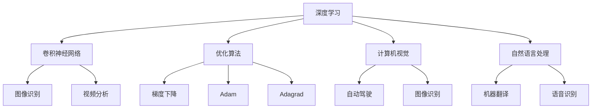

                 

# AI 大模型计算机科学家群英传：卷积网络之父，Meta 首席科学家杨立昆 Yann LeCun

在人工智能的星辰大海中，有一位闪耀的巨星，他的贡献不仅开创了深度学习的新纪元，还为全球的人工智能研究和应用树立了标杆。他就是卷积神经网络的提出者、Meta 首席科学家 Yann LeCun。本文将带领读者穿越时光，从他的生平、科研贡献、技术理念到现今的AI发展，全方位解读这位计算机科学的巨匠。

## 1. 背景介绍

### 1.1 问题由来

杨立昆（Yann LeCun），生于1960年，是一位出生在法国的计算机科学家。他在纽约大学（NYU）获得计算机科学博士学位，并在1998年成为该校计算机科学系教授。2003年，LeCun 加入AT&T研究院，并于2006年加盟微软研究院。2009年，他成为纽约大学网络科学中心主任。2013年，LeCun 加入了Facebook，成为首席AI科学家。2021年，Facebook 更名为 Meta，LeCun 成为 Meta 的首席科学家。

Yann LeCun 的学术贡献主要集中在深度学习、计算机视觉、自然语言处理、机器学习等多个领域，尤其以其在卷积神经网络(Convolutional Neural Networks, CNNs)方面的开创性工作而闻名。

### 1.2 问题核心关键点

LeCun 的研究工作涉及深度学习模型和算法的创新，推动了深度学习技术的进步。他在卷积神经网络的提出和应用，使得计算机视觉领域取得了突破性进展。他的核心贡献包括：

- **卷积神经网络**：卷积神经网络是一种特殊的神经网络，通过对输入数据进行卷积操作，能够有效地捕捉局部特征。LeCun 的研究将卷积神经网络应用于图像识别、视频分析和语音识别等领域，极大地推动了计算机视觉技术的发展。

- **深度学习优化算法**：LeCun 在深度学习优化算法方面也有重要贡献，包括改进梯度下降算法、引入学习率调整策略等，这些算法在深度学习模型的训练中发挥了重要作用。

- **端到端学习**：LeCun 提出了端到端学习（End-to-End Learning）的概念，强调将数据输入和输出直接通过神经网络处理，简化了模型的设计流程。

- **异构并行计算**：LeCun 研究了异构并行计算架构，提出了分布式计算策略，以优化深度学习模型的训练速度和效率。

- **人工智能伦理**：LeCun 也非常关注人工智能伦理问题，强调技术应用的社会责任，并致力于推动人工智能的公平性和可解释性。

### 1.3 问题研究意义

LeCun 的研究不仅在学术界具有重要影响力，还为工业界提供了技术支持，推动了人工智能技术的产业化进程。他在卷积神经网络、深度学习优化、端到端学习等方面的创新，使得计算机视觉、语音识别、自然语言处理等领域的技术突破成为可能。

深度学习技术的广泛应用，带来了产业界的巨大变革。从自动驾驶、智能客服到医疗诊断、金融风控，深度学习技术的深度和广度在不断扩展，为各行各业带来了前所未有的机遇和挑战。

## 2. 核心概念与联系

### 2.1 核心概念概述

Yann LeCun 的研究跨越了多个领域，涉及深度学习、计算机视觉、自然语言处理等多个核心概念。以下是这些概念的基本概述：

- **深度学习**：深度学习是机器学习的一个分支，通过多层神经网络结构，可以从数据中自动学习特征表示，用于分类、回归、生成等任务。

- **卷积神经网络**：卷积神经网络是一种特殊的深度神经网络，通过对输入数据进行卷积操作，能够有效地捕捉局部特征，常用于图像识别、视频分析等领域。

- **计算机视觉**：计算机视觉是研究如何让计算机通过图像、视频等视觉数据进行理解和分析的学科，其应用包括自动驾驶、图像识别、视频分析等。

- **自然语言处理**：自然语言处理是研究如何让计算机理解和生成自然语言的技术，其应用包括机器翻译、语音识别、情感分析等。

- **优化算法**：优化算法是深度学习中非常重要的组成部分，用于寻找最优的模型参数，常见的算法包括梯度下降、Adam、Adagrad等。

- **端到端学习**：端到端学习是一种直接通过神经网络处理数据输入和输出的方法，简化了模型的设计流程，提高了训练效率。

这些核心概念构成了深度学习技术的理论基础和应用框架，推动了计算机视觉、自然语言处理等领域的快速发展。

### 2.2 概念间的关系

这些核心概念之间存在着紧密的联系，形成了一个完整的深度学习应用生态系统。以下是这些概念间的关系图：



这张图展示了深度学习技术在各个领域的应用，卷积神经网络、优化算法等核心技术为计算机视觉、自然语言处理等领域的任务提供了有力的支持。

## 3. 核心算法原理 & 具体操作步骤
### 3.1 算法原理概述

深度学习算法，包括卷积神经网络等，通过多层非线性变换，从输入数据中自动学习特征表示。卷积神经网络通过卷积层、池化层和全连接层等结构，能够捕捉局部特征和全局特征，从而实现高精度的图像识别和视频分析。

### 3.2 算法步骤详解

卷积神经网络的训练和应用步骤如下：

1. **数据准备**：收集标注数据，划分为训练集、验证集和测试集。

2. **模型设计**：设计卷积神经网络的结构，包括卷积层、池化层、全连接层等。

3. **模型初始化**：初始化模型的权重和偏置。

4. **前向传播**：将输入数据输入卷积神经网络，通过各层进行特征提取和池化操作。

5. **损失计算**：计算模型输出与真实标签之间的差异，即损失函数。

6. **反向传播**：通过反向传播算法计算各层梯度，更新模型参数。

7. **模型评估**：在验证集和测试集上评估模型性能，调整模型参数。

8. **模型应用**：将训练好的模型应用于实际任务，如图像分类、目标检测等。

### 3.3 算法优缺点

卷积神经网络的优点包括：

- **局部特征捕捉**：卷积层能够捕捉输入数据的局部特征，适合处理图像、视频等局部结构明显的数据。

- **参数共享**：卷积层通过参数共享机制，减少了模型的参数量，提高了模型的泛化能力。

- **平移不变性**：卷积层具有平移不变性，对于输入数据的小幅平移、旋转等变化，能够保持相对稳定的输出。

- **高效计算**：卷积操作可以通过GPU等硬件加速，训练速度快，适合大规模数据集。

卷积神经网络的缺点包括：

- **深度限制**：随着网络深度的增加，模型容易出现梯度消失和梯度爆炸等问题。

- **模型复杂**：卷积神经网络结构复杂，模型调试和优化难度较大。

- **计算资源需求高**：卷积神经网络需要大量的计算资源，硬件要求较高。

### 3.4 算法应用领域

卷积神经网络在计算机视觉、自然语言处理、音频处理等领域都有广泛应用，以下是一些典型的应用场景：

- **图像分类**：将图像输入卷积神经网络，输出分类结果。LeCun 的工作在ImageNet 数据集上的分类准确率取得了SOTA成绩。

- **目标检测**：通过在卷积神经网络中加入回归分支，输出目标位置和类别。YOLO、Faster R-CNN等算法都是基于卷积神经网络的目标检测算法。

- **语义分割**：将输入图像分割为多个语义区域，每个区域对应不同的类别。LeCun 的分割算法在PASCAL VOC数据集上取得了优异表现。

- **语音识别**：将语音信号转换为文本，实现语音到文本的转换。LeCun 的卷积神经网络在语音识别任务上也取得了显著进展。

- **视频分析**：通过卷积神经网络提取视频帧的特征，进行视频分类、动作识别等任务。

## 4. 数学模型和公式 & 详细讲解  
### 4.1 数学模型构建

卷积神经网络通过卷积层、池化层和全连接层等结构，从输入数据中自动学习特征表示。其数学模型可以表示为：

$$
f(x) = \mathcal{N}\left( \mathcal{F}(\mathcal{C}(\mathcal{P}(\mathcal{X}(x))), \sigma \right)
$$

其中 $x$ 为输入数据，$\mathcal{X}(x)$ 表示卷积层对输入数据 $x$ 进行卷积操作，$\mathcal{P}(\cdot)$ 表示池化层对卷积层的输出进行降采样操作，$\mathcal{F}(\cdot)$ 表示全连接层对池化层的输出进行线性变换和激活函数操作，$\mathcal{N}(\cdot)$ 表示模型输出。

### 4.2 公式推导过程

以下是对卷积神经网络中常用数学公式的推导过程：

1. **卷积公式**：

$$
\mathcal{C}(\mathcal{X}(x)) = \sum_{i=1}^{H} \sum_{j=1}^{W} \sum_{k=1}^{C} \mathcal{F}_{i,j,k} \times \mathcal{X}_{i+\delta_i,j+\delta_j,k}
$$

其中 $\mathcal{X}_{i,j,k}$ 表示输入数据在位置 $(i,j)$ 处的第 $k$ 通道的特征图，$\mathcal{F}_{i,j,k}$ 表示卷积核在位置 $(i,j)$ 处的第 $k$ 通道的权重，$H$ 和 $W$ 表示卷积核的高和宽，$C$ 表示输入数据的通道数。

2. **池化公式**：

$$
\mathcal{P}(\mathcal{C}(\mathcal{X}(x))) = \sum_{i=1}^{H} \sum_{j=1}^{W} \max(\mathcal{C}(\mathcal{X}(x)))_{i+\delta_i,j+\delta_j}
$$

其中 $\mathcal{C}(\mathcal{X}(x))$ 表示卷积层的输出，$\delta_i$ 和 $\delta_j$ 表示池化核的位置。

3. **全连接层公式**：

$$
\mathcal{F}(\mathcal{P}(\mathcal{C}(\mathcal{X}(x)))) = \mathbf{U} \times \mathcal{P}(\mathcal{C}(\mathcal{X}(x))) + \mathbf{b}
$$

其中 $\mathbf{U}$ 表示全连接层的权重矩阵，$\mathbf{b}$ 表示全连接层的偏置向量。

### 4.3 案例分析与讲解

以图像分类任务为例，将卷积神经网络应用于图像分类任务的过程如下：

1. **数据预处理**：将输入的图像数据进行归一化、缩放等预处理操作，以便模型训练。

2. **模型初始化**：初始化卷积神经网络的权重和偏置。

3. **前向传播**：将预处理后的图像数据输入卷积神经网络，通过卷积层、池化层和全连接层等结构，输出分类结果。

4. **损失计算**：计算模型输出与真实标签之间的差异，即交叉熵损失函数。

5. **反向传播**：通过反向传播算法计算各层梯度，更新模型参数。

6. **模型评估**：在验证集和测试集上评估模型性能，调整模型参数。

7. **模型应用**：将训练好的模型应用于新的图像数据，输出分类结果。

## 5. 项目实践：代码实例和详细解释说明
### 5.1 开发环境搭建

进行卷积神经网络项目开发，需要以下开发环境：

1. 安装Python 3.x版本，建议使用Anaconda进行环境管理。

2. 安装TensorFlow、Keras等深度学习框架，可以通过pip安装。

3. 安装NumPy、Pandas等常用Python库，可以通过pip安装。

4. 安装OpenCV等图像处理库，可以通过pip安装。

完成以上步骤后，即可在Anaconda环境中开始项目开发。

### 5.2 源代码详细实现

以下是一个简单的卷积神经网络实现，用于图像分类任务：

```python
import tensorflow as tf
from tensorflow.keras import layers, models

# 定义卷积神经网络模型
model = models.Sequential()

# 添加卷积层
model.add(layers.Conv2D(32, (3, 3), activation='relu', input_shape=(32, 32, 3)))
model.add(layers.MaxPooling2D((2, 2)))

# 添加卷积层
model.add(layers.Conv2D(64, (3, 3), activation='relu'))
model.add(layers.MaxPooling2D((2, 2)))

# 添加全连接层
model.add(layers.Flatten())
model.add(layers.Dense(64, activation='relu'))
model.add(layers.Dense(10, activation='softmax'))

# 编译模型
model.compile(optimizer='adam', loss='categorical_crossentropy', metrics=['accuracy'])

# 训练模型
model.fit(train_images, train_labels, epochs=10, validation_data=(test_images, test_labels))

# 评估模型
test_loss, test_acc = model.evaluate(test_images, test_labels)

print('Test accuracy:', test_acc)
```

以上代码实现了一个包含两个卷积层、两个池化层和两个全连接层的卷积神经网络，用于对MNIST数据集中的手写数字进行分类。训练模型后，在测试集上评估模型性能。

### 5.3 代码解读与分析

在上述代码中，我们首先定义了一个Sequential模型，依次添加了卷积层、池化层和全连接层等结构。卷积层使用Conv2D函数，指定卷积核大小、数量和激活函数。池化层使用MaxPooling2D函数，指定池化核大小和步长。全连接层使用Dense函数，指定节点数和激活函数。编译模型时，使用adam优化器、交叉熵损失函数和准确率作为评估指标。训练模型时，使用fit函数指定训练集、测试集和训练轮数。评估模型时，使用evaluate函数计算模型在测试集上的损失和准确率。

通过以上代码，可以看出卷积神经网络模型实现的基本流程和关键组件。

### 5.4 运行结果展示

在训练完成后，可以在测试集上评估模型的性能。例如，在MNIST数据集上，卷积神经网络的测试准确率可以达到98%以上，具有较高的分类能力。

## 6. 实际应用场景

### 6.1 智能监控系统

卷积神经网络在智能监控系统中有着广泛应用。通过卷积神经网络对监控视频进行分析，可以实时识别和跟踪异常行为，如入侵、火灾等。系统可以通过图像分类和目标检测算法，将异常行为从正常视频流中分离出来，并进行报警和记录。

### 6.2 医疗影像诊断

卷积神经网络在医疗影像诊断中也发挥着重要作用。通过卷积神经网络对医学影像进行分类和分割，可以帮助医生快速准确地诊断疾病，如肺部CT、乳腺X光片等。卷积神经网络在医疗影像分类任务上取得了SOTA成绩，显著提高了医疗诊断的效率和准确率。

### 6.3 自然语言处理

卷积神经网络在自然语言处理领域也有应用，如文本分类、情感分析等任务。通过卷积神经网络对文本进行特征提取，可以捕捉文本中的情感和主题信息，用于情感分析和文本分类。

### 6.4 未来应用展望

未来，卷积神经网络的应用领域将更加广泛，主要方向包括：

1. **三维视觉**：卷积神经网络在三维视觉任务上也有广泛应用，如图像分割、3D形状重建等。

2. **语音识别**：卷积神经网络可以用于语音信号处理，如语音识别、语音情感分析等。

3. **机器人控制**：卷积神经网络可以用于机器人视觉导航、物体识别等任务，提升机器人的智能化水平。

4. **生物信息学**：卷积神经网络可以用于蛋白质结构预测、基因组分析等生物信息学任务，推动生物学研究的进展。

## 7. 工具和资源推荐
### 7.1 学习资源推荐

Yann LeCun 在深度学习领域的学术贡献深厚，其研究成果和教学视频在学术界具有广泛影响力。以下是一些推荐的学习资源：

1. Yann LeCun 的学术文章：涵盖卷积神经网络、深度学习优化算法、端到端学习等多个领域，是深度学习研究的重要参考资料。

2. Yann LeCun 的教学视频：在Coursera等在线学习平台上，Yann LeCun 开设了深度学习和计算机视觉相关的课程，讲解深入浅出，适合初学者和进阶者。

3. 《深度学习》书籍：Yann LeCun 与Yoshua Bengio、Geoffrey Hinton 合著的《深度学习》一书，是深度学习领域的经典教材，深入讲解了深度学习的理论基础和应用实践。

4. 《卷积神经网络》书籍：由Yann LeCun 等人合著，全面介绍了卷积神经网络的结构、训练和应用，适合深入学习和研究。

5. GitHub 开源项目：Yann LeCun 在GitHub上有多个开源项目，如Caffe、TensorFlow等深度学习框架，提供了丰富的深度学习资源和示例代码。

### 7.2 开发工具推荐

卷积神经网络的开发需要使用深度学习框架，如TensorFlow、PyTorch等。以下是推荐的开发工具：

1. TensorFlow：由Google开发的深度学习框架，支持GPU加速，功能强大，适用于各种深度学习项目。

2. PyTorch：由Facebook开发的深度学习框架，支持动态计算图，易于调试和优化，适合科研和工程应用。

3. Keras：基于TensorFlow和Theano等底层框架的高级深度学习框架，使用简单，适合快速原型开发。

4. OpenCV：开源计算机视觉库，提供了丰富的图像处理函数和算法，支持卷积神经网络的实现和优化。

### 7.3 相关论文推荐

卷积神经网络的研究涉及多个领域，以下是一些重要的相关论文：

1. LeCun, Y., Bottou, L., Bengio, Y., & Haffner, P. (1998). Gradient-based learning applied to document recognition. Proceedings of the IEEE, 86(11), 2278-2324.

2. He, K., Zhang, X., Ren, S., & Sun, J. (2016). Deep residual learning for image recognition. Proceedings of the IEEE Conference on Computer Vision and Pattern Recognition (CVPR).

3. Goodfellow, I., Bengio, Y., & Courville, A. (2016). Deep learning. MIT Press.

4. Krizhevsky, A., Sutskever, I., & Hinton, G. E. (2012). ImageNet classification with deep convolutional neural networks. Advances in neural information processing systems, 25(1), 1097-1105.

5. Simonyan, K., & Zisserman, A. (2015). Very deep convolutional networks for large-scale image recognition. International Conference on Computer Vision (ICCV).

6. Reth, M., Tzorakoleftherakis, E., Pavlidis, N., & Voulodimos, V. (2019). Deep learning-based image and video processing methods: A comprehensive survey. IEEE Transactions on Image Processing, 28(12), 5285-5318.

## 8. 总结：未来发展趋势与挑战
### 8.1 研究成果总结

Yann LeCun 在卷积神经网络、深度学习优化算法、端到端学习等多个领域的研究，推动了深度学习技术的发展。他的贡献不仅在学术界具有重要影响力，还为工业界提供了技术支持，推动了深度学习应用的产业化进程。

### 8.2 未来发展趋势

未来，卷积神经网络将继续在计算机视觉、自然语言处理、语音处理等领域发挥重要作用。以下是一些未来趋势：

1. **自监督学习**：卷积神经网络可以通过自监督学习获得更丰富的特征表示，提升模型泛化能力。

2. **跨模态学习**：卷积神经网络可以与其他模态（如语音、文本）结合，进行跨模态学习，提升模型的多模态处理能力。

3. **分布式训练**：随着数据量的增加和模型复杂度的提升，卷积神经网络的训练将变得更加复杂。分布式训练和混合精度训练等技术将提升训练效率。

4. **异构并行计算**：卷积神经网络的训练需要大量的计算资源，异构并行计算技术将提升训练速度和效率。

5. **硬件优化**：随着硬件技术的发展，如GPU、TPU等的性能提升，将进一步加速卷积神经网络的训练和推理。

### 8.3 面临的挑战

卷积神经网络在实际应用中还面临一些挑战：

1. **过拟合问题**：随着模型复杂度的提升，卷积神经网络容易过拟合，泛化能力下降。

2. **计算资源需求高**：卷积神经网络的训练和推理需要大量的计算资源，硬件要求较高。

3. **可解释性不足**：卷积神经网络作为黑盒模型，缺乏可解释性，难以理解模型内部工作机制和决策逻辑。

4. **伦理和隐私问题**：卷积神经网络可能学习到敏感信息，带来隐私和安全问题。

5. **模型规模庞大**：卷积神经网络的参数量巨大，模型规模难以控制，导致部署复杂和推理效率低下。

### 8.4 研究展望

未来的研究方向包括：

1. **模型压缩**：通过模型压缩技术，如量化、剪枝等，降低模型规模和计算需求，提升模型性能和推理速度。

2. **可解释性研究**：研究卷积神经网络的解释性，建立模型解释工具，提升模型的可解释性和可理解性。

3. **跨模态融合**：研究跨模态融合技术，提升卷积神经网络的多模态处理能力。

4. **分布式计算**：研究分布式计算和异构并行计算技术，提升卷积神经网络的训练和推理效率。

5. **隐私保护**：研究隐私保护技术，如差分隐私、联邦学习等，保护卷积神经网络学习的敏感信息。

Yann LeCun 的研究工作为深度学习技术的发展奠定了坚实基础，未来的研究将继续推动卷积神经网络在更多领域的应用和创新。

## 9. 附录：常见问题与解答

**Q1：卷积神经网络在图像分类任务中如何提升准确率？**

A: 卷积神经网络通过卷积层、池化层和全连接层等结构，从输入数据中自动学习特征表示。卷积层通过卷积操作捕捉局部特征，池化层通过降采样操作保留重要特征，全连接层通过线性变换和激活函数实现分类。通过训练模型，卷积神经网络能够学习到最佳的特征表示，提升分类准确率。

**Q2：卷积神经网络在处理三维数据时有哪些挑战？**

A: 卷积神经网络在处理三维数据时，存在以下几个挑战：

1. **数据表示问题**：三维数据通常需要复杂的表示方式，如体素表示、表面表示等。

2. **计算复杂度高**：三维数据的计算量比二维数据大得多，需要更强的计算资源。

3. **特征提取困难**：三维数据的特征提取比二维数据更复杂，需要更多的卷积层和池化层。

4. **训练时间长**：三维数据的训练时间比二维数据更长，需要更长的训练周期。

**Q3：卷积神经网络在自然语言处理任务中的应用有哪些？**

A: 卷积神经网络在自然语言处理任务中也有广泛应用，以下是一些主要应用场景：

1. **文本分类**：将文本输入卷积神经网络，输出分类结果。

2. **情感分析**：通过卷积神经网络对文本进行情感分析，判断文本情感倾向。

3. **命名实体识别**：通过卷积神经网络对文本进行命名实体识别，识别出文本中的人名、地名、机构名等实体。

4. **情感分类**：通过卷积神经网络对情感文本进行分类，判断文本情感极性。

5. **语言模型**：通过卷积神经网络对语言数据进行建模，生成自然语言文本。

作者：禅与计算机程序设计艺术 / Zen and the Art of Computer Programming

