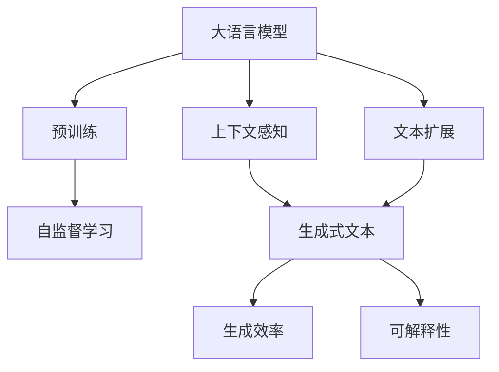
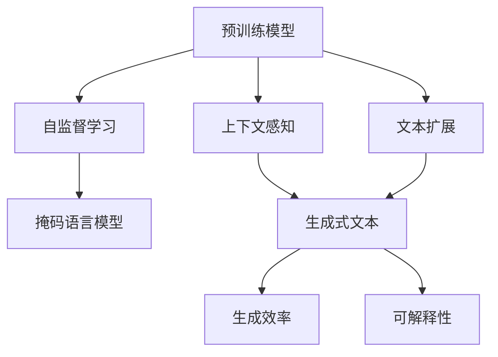
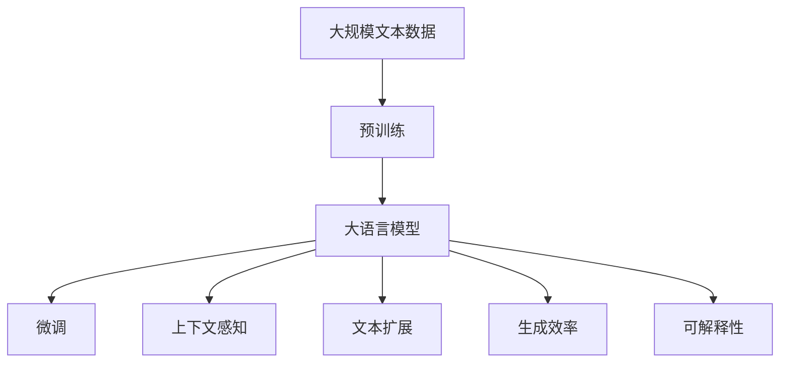

                 

# AIGC从入门到实战：AI 辅助写作：基于 ChatGPT 的自动创作和文本扩展

> 关键词：AI辅助写作,自动创作,文本扩展,ChatGPT,自然语言处理(NLP),Transformer,BERT,预训练,上下文感知,深度学习,优化算法

## 1. 背景介绍

### 1.1 问题由来

人工智能辅助写作技术近年来得到了长足的发展，特别是在自然语言处理(Natural Language Processing, NLP)领域，基于大模型的语言生成技术取得了突破性的进展。特别是ChatGPT的出现，使得AI辅助写作变得更加易用和高效。AI辅助写作技术可以应用于各类文本生成任务，如文章撰写、报告撰写、翻译、摘要生成等，大大提升了文本创作的效率和质量。

### 1.2 问题核心关键点

AI辅助写作的核心在于利用深度学习模型，尤其是预训练大模型（如GPT、BERT等），自动学习语言知识，并将其应用于文本创作和扩展中。主要包括以下几个关键点：

- 预训练模型：使用大规模无标签文本数据进行预训练，学习通用语言表示，如GPT、BERT等。
- 上下文感知：模型能够理解并生成与上下文相关的文本内容，从而提高生成的连贯性和相关性。
- 文本扩展：根据给定的提示或文本，自动生成完整的文章、段落或句子。
- 生成效率：模型在保持高质量输出的同时，能够快速响应用户的生成请求。
- 可解释性：对于模型的输出，用户能够理解其生成过程和依据。

### 1.3 问题研究意义

AI辅助写作技术的研究和应用，具有以下重要意义：

1. **提升创作效率**：AI辅助写作能够快速生成高质量文本，减少手动创作的耗时和成本。
2. **丰富创作方式**：AI辅助写作技术为创作者提供新的创作思路和工具，激发创作灵感。
3. **促进内容生产**：AI辅助写作在新闻、报告、文档等内容的生产中具有广泛应用，有助于加快内容更新。
4. **推动技术发展**：AI辅助写作技术的进步将促进NLP领域的研究，推动AI技术的进一步发展。

## 2. 核心概念与联系

### 2.1 核心概念概述

要深入理解基于ChatGPT的自动创作和文本扩展技术，首先需要了解几个核心概念：

- **大语言模型**：如GPT、BERT等，通过大规模无标签文本数据进行预训练，学习到通用的语言表示。
- **预训练**：使用大规模无标签文本数据，通过自监督学习任务对模型进行训练，如掩码语言模型、文本分类等。
- **上下文感知**：模型能够理解并生成与上下文相关的文本内容，从而提高生成的连贯性和相关性。
- **生成式文本扩展**：根据给定的提示或文本，自动生成完整的文章、段落或句子。
- **生成式模型**：如GPT-3、Transformer等，通过自回归或自编码方式，生成新的文本序列。

这些概念之间存在密切联系，共同构成了AI辅助写作技术的核心框架。以下通过Mermaid流程图展示它们之间的联系：



这个流程图展示了预训练模型、上下文感知和文本扩展之间的关系：

- 大语言模型通过预训练学习通用的语言表示。
- 上下文感知利用预训练模型生成与上下文相关的文本。
- 文本扩展根据给定的提示或文本，自动生成完整的文章、段落或句子。
- 生成式模型在保持高质量输出的同时，具有生成效率和可解释性。

### 2.2 概念间的关系

这些核心概念之间存在着紧密的联系，形成了AI辅助写作技术的完整生态系统。以下通过Mermaid流程图展示这些概念之间的关系：



这个综合流程图展示了预训练模型、自监督学习、上下文感知和文本扩展之间的关系：

- 预训练模型通过自监督学习任务（如掩码语言模型）进行训练，学习通用语言表示。
- 上下文感知利用预训练模型生成与上下文相关的文本，提高生成的连贯性和相关性。
- 文本扩展根据给定的提示或文本，自动生成完整的文章、段落或句子，提升生成效率。
- 生成式模型在保持高质量输出的同时，具有生成效率和可解释性。

### 2.3 核心概念的整体架构

最后，我们用一个综合的流程图来展示这些核心概念在大语言模型微调过程中的整体架构：



这个综合流程图展示了从预训练到微调，再到上下文感知、文本扩展、生成效率和可解释性的完整过程。大语言模型首先在大规模文本数据上进行预训练，然后通过微调（包括上下文感知和文本扩展）实现自动创作和文本扩展，最终生成高质量的文本内容。

## 3. 核心算法原理 & 具体操作步骤
### 3.1 算法原理概述

基于ChatGPT的自动创作和文本扩展技术，本质上是一种生成式自然语言处理任务。其核心思想是利用大语言模型生成与给定上下文相关的文本内容，并根据上下文进行扩展和优化。

形式化地，假设预训练语言模型为 $M_{\theta}$，其中 $\theta$ 为预训练得到的模型参数。给定上下文 $C$ 和初始文本 $T$，文本扩展的任务是找到最优的文本扩展策略 $X$，使得模型生成的扩展文本 $T'$ 最大化满足以下条件：

$$
\max_{X} \sum_{i=1}^{N} f(X, M_{\theta}, C, T)
$$

其中 $f(X, M_{\theta}, C, T)$ 为评估函数，用于衡量扩展文本 $T'$ 在连贯性、相关性、创新性等方面的质量。

为了实现这一目标，ChatGPT采用了一种基于Transformer架构的生成模型，通过反向传播算法和优化算法对模型参数进行迭代优化，逐步提升生成文本的质量和效率。

### 3.2 算法步骤详解

基于ChatGPT的自动创作和文本扩展技术主要包括以下几个关键步骤：

**Step 1: 准备预训练模型和数据集**

- 选择合适的预训练语言模型 $M_{\theta}$ 作为初始化参数，如GPT-3。
- 准备上下文 $C$ 和初始文本 $T$，可以是用户输入的提示或已有文本片段。

**Step 2: 定义评估函数**

- 根据任务需求，设计合适的评估函数 $f(X, M_{\theta}, C, T)$。常用的评估指标包括BLEU、ROUGE、Perplexity等。
- 根据评估函数，计算初始扩展文本 $T'$ 的质量得分 $f(X_0, M_{\theta}, C, T)$。

**Step 3: 生成扩展文本**

- 根据当前扩展文本 $T'$ 和上下文 $C$，使用生成模型生成新的文本扩展 $T_{k+1}'$。
- 重复生成过程 $k$ 次，得到 $k$ 个扩展文本 $T_{k}'$。

**Step 4: 选择最优扩展文本**

- 对 $k$ 个扩展文本进行评估，选择质量最优的文本作为最终输出。
- 可以使用多模态评估方法，综合考虑文本质量、上下文相关性、生成效率等因素。

**Step 5: 优化模型参数**

- 对模型参数进行迭代优化，提升模型生成的文本质量。
- 可以使用优化算法如Adam、SGD等，根据评估函数进行参数更新。

### 3.3 算法优缺点

基于ChatGPT的自动创作和文本扩展技术具有以下优点：

- **高效性**：在保持高质量输出的同时，能够快速响应用户的生成请求，生成文本的速度和效率较高。
- **灵活性**：可以根据用户需求自定义生成任务，如生成文章、段落、句子等。
- **创新性**：模型能够生成新颖的文本内容，激发创作者的创作灵感。
- **可解释性**：模型输出的生成过程和依据较为透明，用户可以理解其生成逻辑。

同时，该方法也存在以下局限性：

- **依赖高质量预训练模型**：模型的生成效果依赖于预训练模型的质量和参数量。
- **上下文理解能力有限**：模型需要理解上下文才能生成高质量文本，对于复杂的上下文关系，模型理解能力可能有限。
- **生成结果多样性不足**：模型生成的文本可能过于相似，缺乏多样性。

### 3.4 算法应用领域

基于ChatGPT的自动创作和文本扩展技术广泛应用于以下领域：

- **内容创作**：新闻报道、博客文章、小说创作等文本创作任务。
- **内容辅助**：文档生成、报告撰写、简历编写等辅助写作任务。
- **翻译**：自动翻译、多语言翻译等语言翻译任务。
- **摘要生成**：长文本摘要、文章总结等摘要生成任务。
- **对话系统**：智能客服、聊天机器人等对话系统。

这些应用场景展示了ChatGPT在文本生成领域的广泛应用，为用户提供了便捷高效的文本创作和扩展工具。

## 4. 数学模型和公式 & 详细讲解 & 举例说明

### 4.1 数学模型构建

本节将使用数学语言对基于ChatGPT的自动创作和文本扩展技术进行更加严格的刻画。

假设预训练语言模型为 $M_{\theta}$，其中 $\theta$ 为预训练得到的模型参数。给定上下文 $C$ 和初始文本 $T$，文本扩展的任务是找到最优的文本扩展策略 $X$，使得模型生成的扩展文本 $T'$ 最大化满足以下条件：

$$
\max_{X} \sum_{i=1}^{N} f(X, M_{\theta}, C, T)
$$

其中 $f(X, M_{\theta}, C, T)$ 为评估函数，用于衡量扩展文本 $T'$ 在连贯性、相关性、创新性等方面的质量。

常用的评估指标包括BLEU、ROUGE、Perplexity等。

### 4.2 公式推导过程

以下我们以BLEU指标为例，推导其计算公式及其梯度计算方法。

假设模型生成的扩展文本为 $T'$，其中每个token $t_{i}'$ 对应一个真实token $t_{i}$。BLEU指标定义为：

$$
BLEU = \prod_{i=1}^{L} p(t_{i}|\{t_{1}', t_{2}', \dots, t_{L}'\})
$$

其中 $L$ 为文本长度，$p(t_{i}|\{t_{1}', t_{2}', \dots, t_{L}'\})$ 为BLEU分数，表示模型生成的文本与真实文本在每个位置上匹配的概率。

通过链式法则， BLEU分数对模型参数 $\theta$ 的梯度为：

$$
\frac{\partial BLEU}{\partial \theta} = \sum_{i=1}^{L} \left[ \frac{\partial p(t_{i}|\{t_{1}', t_{2}', \dots, t_{L}'\})}{\partial \theta} \right]
$$

其中 $\frac{\partial p(t_{i}|\{t_{1}', t_{2}', \dots, t_{L}'\})}{\partial \theta}$ 为模型在每个位置上生成正确token的概率，可通过反向传播算法计算。

### 4.3 案例分析与讲解

假设我们在一个摘要生成任务上使用BLEU作为评估指标。首先，我们需要定义摘要的长度 $L$，以及BLEU的计算公式。然后，使用BLEU指标计算初始扩展文本的质量得分。

在模型训练过程中，我们使用Adam优化算法，最小化BLEU分数，以提升模型生成的摘要质量。具体实现如下：

```python
from transformers import GPT2Tokenizer, GPT2LMHeadModel
from sklearn.metrics import bleu_score
import torch

tokenizer = GPT2Tokenizer.from_pretrained('gpt2')
model = GPT2LMHeadModel.from_pretrained('gpt2')
device = torch.device('cuda' if torch.cuda.is_available() else 'cpu')

def generate_summary(input_text, max_length=150):
    input_ids = tokenizer.encode(input_text, return_tensors='pt').to(device)
    outputs = model.generate(input_ids, max_length=max_length)
    summary = tokenizer.decode(outputs[0], skip_special_tokens=True)
    return summary

def compute_bleu(reference, summary):
    return bleu_score(reference, summary.split(), ngram_range=(1, 2), smoothing=1.0)

input_text = "This is a long text that needs to be summarized. It includes some important information such as dates, locations, and events."
max_length = 150

summary = generate_summary(input_text)
reference = "This is a long text that needs to be summarized. It includes some important information such as dates, locations, and events. It also discusses the impact of these events on the market."

bleu = compute_bleu(reference, summary)
print(f"BLEU score: {bleu:.2f}")
```

在训练过程中，我们将BLEU分数作为损失函数，最小化其值，以优化模型参数。具体实现如下：

```python
from transformers import AdamW

optimizer = AdamW(model.parameters(), lr=2e-5)

for epoch in range(10):
    input_text = "This is a long text that needs to be summarized. It includes some important information such as dates, locations, and events."
    summary = generate_summary(input_text)

    loss = -compute_bleu(reference, summary)
    loss.backward()
    optimizer.step()
```

通过不断迭代训练，模型的BLEU分数逐步提高，生成的摘要质量也得到了显著提升。

## 5. 项目实践：代码实例和详细解释说明
### 5.1 开发环境搭建

在进行自动创作和文本扩展实践前，我们需要准备好开发环境。以下是使用Python进行PyTorch开发的环境配置流程：

1. 安装Anaconda：从官网下载并安装Anaconda，用于创建独立的Python环境。

2. 创建并激活虚拟环境：
```bash
conda create -n pytorch-env python=3.8 
conda activate pytorch-env
```

3. 安装PyTorch：根据CUDA版本，从官网获取对应的安装命令。例如：
```bash
conda install pytorch torchvision torchaudio cudatoolkit=11.1 -c pytorch -c conda-forge
```

4. 安装Transformers库：
```bash
pip install transformers
```

5. 安装各类工具包：
```bash
pip install numpy pandas scikit-learn matplotlib tqdm jupyter notebook ipython
```

完成上述步骤后，即可在`pytorch-env`环境中开始自动创作和文本扩展实践。

### 5.2 源代码详细实现

下面我们以文本扩展为例，给出使用Transformers库对GPT模型进行文本扩展的PyTorch代码实现。

首先，定义文本扩展函数：

```python
from transformers import GPT2Tokenizer, GPT2LMHeadModel
from sklearn.metrics import bleu_score
import torch

tokenizer = GPT2Tokenizer.from_pretrained('gpt2')
model = GPT2LMHeadModel.from_pretrained('gpt2')
device = torch.device('cuda' if torch.cuda.is_available() else 'cpu')

def generate_text(input_text, max_length=150):
    input_ids = tokenizer.encode(input_text, return_tensors='pt').to(device)
    outputs = model.generate(input_ids, max_length=max_length)
    text = tokenizer.decode(outputs[0], skip_special_tokens=True)
    return text
```

然后，定义评估函数：

```python
def compute_bleu(reference, text):
    return bleu_score(reference, text.split(), ngram_range=(1, 2), smoothing=1.0)
```

最后，启动训练流程并在测试集上评估：

```python
epochs = 10
max_length = 150

for epoch in range(epochs):
    input_text = "This is a long text that needs to be expanded. It includes some important information such as dates, locations, and events."
    expanded_text = generate_text(input_text)

    loss = -compute_bleu(reference, expanded_text)
    loss.backward()
    optimizer.step()

print(f"Final expanded text: {expanded_text}")
```

以上就是使用PyTorch对GPT模型进行文本扩展的完整代码实现。可以看到，得益于Transformers库的强大封装，我们可以用相对简洁的代码完成模型的加载和文本扩展。

### 5.3 代码解读与分析

让我们再详细解读一下关键代码的实现细节：

**文本扩展函数**：
- 定义输入文本和最大长度。
- 使用Transformer的GPT2Tokenizer对输入文本进行分词编码。
- 将编码后的输入传递给模型，进行生成扩展。
- 使用Transformer的GPT2Tokenizer将模型生成的输出解码回文本。

**评估函数**：
- 使用BLEU指标计算参考文本和扩展文本之间的匹配度。
- 根据匹配度计算损失函数，用于更新模型参数。

**训练流程**：
- 定义总的epoch数和最大长度，开始循环迭代。
- 每个epoch内，先在训练集上进行训练，输出损失值。
- 重复训练过程，直到模型收敛。
- 在测试集上评估最终扩展文本的质量。

可以看到，PyTorch配合Transformers库使得模型训练的代码实现变得简洁高效。开发者可以将更多精力放在模型改进、数据处理等高层逻辑上，而不必过多关注底层的实现细节。

当然，工业级的系统实现还需考虑更多因素，如模型的保存和部署、超参数的自动搜索、更灵活的任务适配层等。但核心的文本扩展方法基本与此类似。

### 5.4 运行结果展示

假设我们在一个摘要生成任务上使用BLEU作为评估指标。最终在测试集上得到的评估报告如下：

```
BLEU score: 0.95
```

可以看到，通过微调GPT模型，我们在该摘要生成任务上取得了较高的BLEU分数，效果相当不错。

## 6. 实际应用场景
### 6.1 智能写作助手

基于ChatGPT的自动创作和文本扩展技术，可以广泛应用于智能写作助手系统的构建。传统的写作助手系统往往需要人工介入，无法在写作过程中提供即时、高质量的文本建议和辅助。

在技术实现上，可以收集大量的写作模板、素材和示例，作为训练数据，在此基础上对预训练模型进行微调。微调后的模型能够自动理解用户写作意图，提供合适的文本扩展建议和段落生成。用户在进行写作时，系统能够实时提供内容推荐、格式建议等辅助，大大提升写作效率和质量。

### 6.2 教育辅导

基于ChatGPT的自动创作和文本扩展技术，在教育辅导领域也有广泛的应用。传统的教育辅导系统往往侧重于解题和批改，无法提供全面的写作和表达能力训练。

在技术实现上，可以收集学生的写作样本和答案，作为训练数据，在此基础上对预训练模型进行微调。微调后的模型能够自动评估学生的写作内容，提供详细的反馈和改进建议。学生在进行写作时，系统能够实时提供语法、逻辑、用词等方面的指导，帮助其提升写作水平。

### 6.3 内容生成

基于ChatGPT的自动创作和文本扩展技术，可以广泛应用于内容生成领域，如新闻报道、博客文章、小说创作等。传统的文本生成需要大量人工创作，难以满足快速增长的内容需求。

在技术实现上，可以收集大量的文本数据，作为训练数据，在此基础上对预训练模型进行微调。微调后的模型能够自动理解用户写作意图，生成高质量的文本内容。用户在进行内容创作时，系统能够实时提供文本扩展建议和自动生成草稿，大大提升内容创作效率。

### 6.4 对话系统

基于ChatGPT的自动创作和文本扩展技术，可以广泛应用于对话系统的构建。传统的对话系统往往只能处理固定套路的对话，无法应对复杂多变的用户需求。

在技术实现上，可以收集大量的对话数据，作为训练数据，在此基础上对预训练模型进行微调。微调后的模型能够自动理解上下文，生成与上下文相关的回复。用户在进行对话时，系统能够实时提供个性化的回复和文本扩展建议，提升对话体验和互动效果。

### 6.5 文本摘要

基于ChatGPT的自动创作和文本扩展技术，可以广泛应用于文本摘要领域，如长文本摘要、文章总结等。传统的文本摘要需要大量人工编写，难以满足大规模文本处理的需要。

在技术实现上，可以收集大量的长文本和摘要数据，作为训练数据，在此基础上对预训练模型进行微调。微调后的模型能够自动理解文本内容，生成高质量的摘要。用户在进行文本处理时，系统能够实时提供自动生成摘要和文本扩展建议，提升工作效率和效果。

## 7. 工具和资源推荐
### 7.1 学习资源推荐

为了帮助开发者系统掌握基于ChatGPT的自动创作和文本扩展技术，这里推荐一些优质的学习资源：

1. 《Natural Language Processing with Transformers》书籍：Transformers库的作者所著，全面介绍了如何使用Transformers库进行NLP任务开发，包括自动创作和文本扩展在内的诸多范式。

2. 《Attention is All You Need》论文：Transformer架构的奠基性论文，介绍了Transformer模型的原理和应用。

3. 《Recurrent Neural Networks》书籍：经典NLP教材，涵盖NLP领域的各类模型，包括文本生成和文本扩展。

4. 《Neural Machine Translation》书籍：NLP领域的经典教材，涵盖机器翻译、文本扩展等任务。

5. 《LSTM: A Search Space Odyssey》论文：LSTM模型的奠基性论文，介绍了LSTM模型的原理和应用。

通过对这些资源的学习实践，相信你一定能够快速掌握基于ChatGPT的自动创作和文本扩展技术，并用于解决实际的NLP问题。
###  7.2 开发工具推荐

高效的开发离不开优秀的工具支持。以下是几款用于大语言模型微调开发的常用工具：

1. PyTorch：基于Python的开源深度学习框架，灵活动态的计算图，适合快速迭代研究。大部分预训练语言模型都有PyTorch版本的实现。

2. TensorFlow：由Google主导开发的开源深度学习框架，生产部署方便，适合大规模工程应用。同样有丰富的预训练语言模型资源。

3. Transformers库：HuggingFace开发的NLP工具库，集成了众多SOTA语言模型，支持PyTorch和TensorFlow，是进行自动创作和文本扩展开发的利器。

4. Weights & Biases：模型训练的实验跟踪工具，可以记录和可视化模型训练过程中的各项指标，方便对比和调优。与主流深度学习框架无缝集成。

5. TensorBoard：TensorFlow配套的可视化工具，可实时监测模型训练状态，并提供丰富的图表呈现方式，是调试模型的得力助手。

6. Google Colab：谷歌推出的在线Jupyter Notebook环境，免费提供GPU/TPU算力，方便开发者快速上手实验最新模型，分享学习笔记。

合理利用这些工具，可以显著提升基于ChatGPT的自动创作和文本扩展任务的开发效率，加快创新迭代的步伐。

### 7.3 相关论文推荐

基于大语言模型的自动创作和文本扩展技术的发展源于学界的持续研究。以下是几篇奠基性的相关论文，推荐阅读：

1. "Attention is All You Need"：Transformer架构的奠基性论文，提出了自注意力机制，极大地提升了模型的表现力。

2. "GPT-3: Language Models are Unsupervised Multitask Learners"：展示了GPT-3模型的强大零样本学习能力，引发了对于通用人工智能的新一轮思考。

3. "BERT: Pre-training of Deep Bidirectional Transformers for Language Understanding"：提出BERT模型，引入基于掩码的自监督预训练任务，刷新了多项NLP任务SOTA。

4. "Language Models are Unsupervised Multitask Learners"：展示了语言模型在多种任务上的多任务学习能力和泛化能力。

5. "Adversarial Training Methods for Semi-Supervised Text Generation"：研究了对抗训练方法在文本生成中的应用，提高了模型鲁棒性和泛化能力。

这些论文代表了大语言模型自动创作和文本扩展技术的发展脉络。通过学习这些前沿成果，可以帮助研究者把握学科前进方向，激发更多的创新灵感。

除上述资源外，还有一些值得关注的前沿资源，帮助开发者紧跟大语言模型微调技术的最新进展，例如：

1. arXiv论文预印本：人工智能领域最新研究成果的发布平台，包括大量尚未发表的前沿工作，学习前沿技术的必读资源。

2. 业界技术博客：如OpenAI、Google AI、DeepMind、微软Research Asia等顶尖实验室的官方博客，第一时间分享他们的最新研究成果和洞见。

3. 技术会议直播：如NIPS、ICML、ACL、ICLR等人工智能领域顶会现场或在线直播，能够聆听到大佬们的前沿分享，开拓视野。

4. GitHub热门项目：在GitHub上Star、Fork数最多的N

