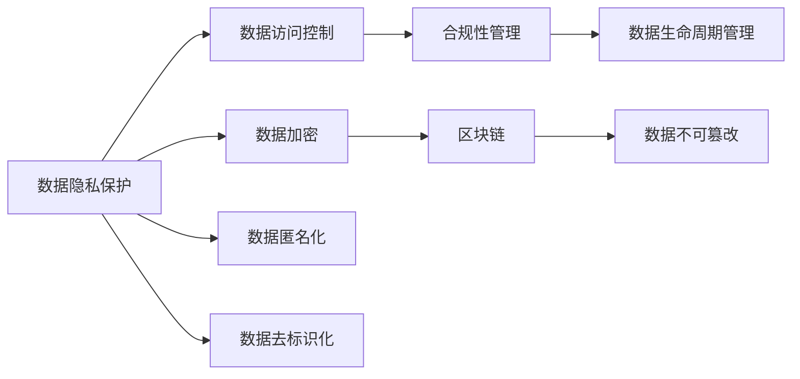
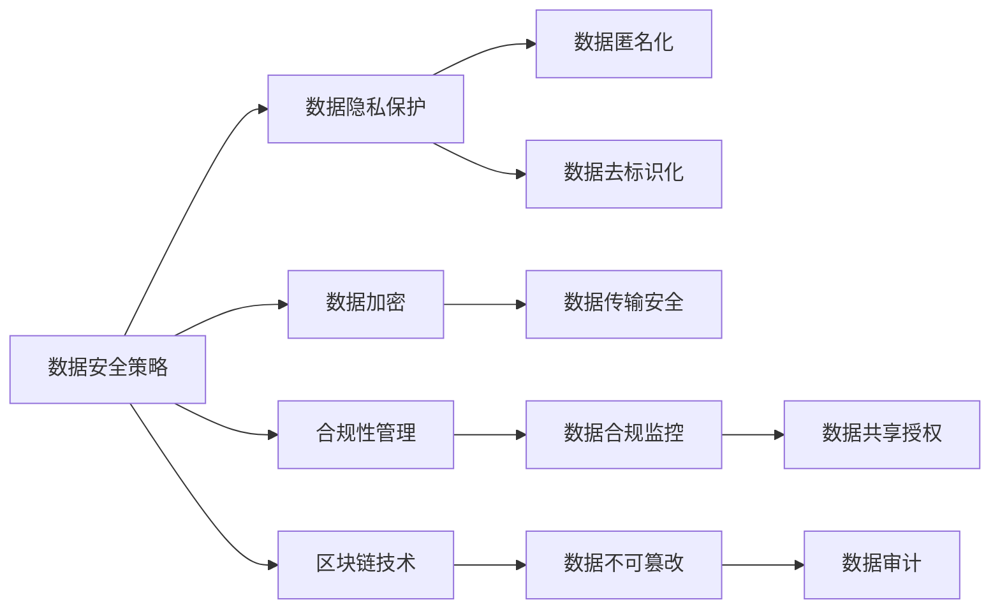

                 

# AI 大模型应用数据中心的数据安全

> 关键词：数据安全, 大模型, 隐私保护, 合规性, 区块链, 加密技术

## 1. 背景介绍

### 1.1 问题由来

随着人工智能技术的快速发展，特别是大模型的兴起，数据中心（Data Center）成为各类AI应用的核心基础设施。数据中心存储和处理了大量敏感数据，如用户行为数据、金融交易数据、医疗健康数据等，这些数据一旦泄露或被恶意使用，将给个人和组织带来巨大损失。近年来，针对数据中心的攻击事件频发，暴露了数据中心安全管理的薄弱环节。

例如，2021年爆发的Colonial Pipeline勒索软件攻击，导致美国东海岸的石油供应中断数周。攻击者通过入侵数据中心的IT系统，加密和控制其数据，要求赎金以换取密钥。这不仅影响了正常的业务运营，也对公共安全造成了严重威胁。

数据安全是大模型应用的重要保障。在数据中心的部署、使用和维护过程中，如何保障数据安全，防止数据泄露和篡改，是AI应用领域急需解决的问题。

### 1.2 问题核心关键点

数据安全涉及多个关键问题，包括：

- **数据隐私保护**：如何保护用户隐私不被泄露，限制数据访问权限。
- **合规性管理**：确保数据使用符合法律法规，如GDPR、CCPA等。
- **区块链技术应用**：通过区块链记录和验证数据操作，提升数据透明度。
- **加密技术**：使用加密技术保护数据在传输和存储过程中的安全。
- **数据生命周期管理**：从数据收集、存储、处理、共享到销毁，每个环节都需考虑数据安全。

本文将深入探讨这些关键问题，并给出相应的解决方案。

## 2. 核心概念与联系

### 2.1 核心概念概述

为更好地理解AI大模型应用数据中心的数据安全，本节将介绍几个密切相关的核心概念：

- **数据隐私保护**：指通过技术手段保护数据不被未授权访问，确保数据安全。

- **合规性管理**：指确保数据使用过程符合法律、法规和行业标准，如GDPR、CCPA、ISO 27001等。

- **区块链技术**：一种分布式账本技术，通过去中心化的方式记录和验证数据操作，增强数据的透明性和不可篡改性。

- **加密技术**：使用算法对数据进行加密处理，保障数据在传输和存储过程中的安全。

- **数据生命周期管理**：从数据收集、存储、处理、共享到销毁，每个环节都需考虑数据安全，确保数据始终处于安全状态。

这些核心概念之间的逻辑关系可以通过以下Mermaid流程图来展示：



这个流程图展示了大模型应用数据中心的数据安全机制：

1. 数据隐私保护通过加密和匿名化等手段，确保数据不被未授权访问。
2. 数据访问控制限制数据访问权限，确保只有授权人员可以访问数据。
3. 数据加密使用加密算法，保障数据在传输和存储过程中的安全。
4. 数据区块链记录和验证数据操作，提升数据的透明性和不可篡改性。
5. 数据生命周期管理确保数据在每个环节都处于安全状态，从收集、存储到共享、销毁。

### 2.2 概念间的关系

这些核心概念之间存在着紧密的联系，形成了数据中心安全机制的完整框架。下面我通过几个Mermaid流程图来展示这些概念之间的关系。

#### 2.2.1 数据安全整体架构



这个综合流程图展示了数据中心的数据安全架构：

1. 数据安全策略是大模型应用数据中心安全的总体指导原则。
2. 数据隐私保护通过匿名化和去标识化等手段，限制数据的访问和使用。
3. 数据加密使用算法保障数据在传输和存储过程中的安全。
4. 合规性管理通过监控和审计，确保数据使用符合法律法规。
5. 区块链技术记录和验证数据操作，增强数据的透明性和不可篡改性。
6. 数据生命周期管理确保数据在每个环节都处于安全状态。

## 3. 核心算法原理 & 具体操作步骤

### 3.1 算法原理概述

AI大模型应用数据中心的数据安全，主要包括数据隐私保护、数据访问控制、数据加密、数据区块链和数据生命周期管理等技术。这些技术通过各种算法实现，保障数据在整个生命周期中的安全。

### 3.2 算法步骤详解

数据中心的数据安全需要从多个环节进行保护。以下是数据中心数据安全的详细步骤：

**Step 1: 数据隐私保护**

- **数据匿名化**：通过技术手段去除数据中的个人身份信息，如姓名、地址、电话等，使得数据无法追溯到个人。
- **数据去标识化**：进一步处理数据，使其无法被关联到个人，如数据脱敏、数据伪化等。

**Step 2: 数据访问控制**

- **身份认证**：通过密码、指纹、面部识别等手段验证用户身份。
- **权限管理**：根据用户角色和职责，分配相应的数据访问权限。

**Step 3: 数据加密**

- **数据加密**：使用对称加密算法（如AES）或非对称加密算法（如RSA）加密数据。
- **密钥管理**：使用加密密钥进行数据加密，并妥善保管密钥。

**Step 4: 数据区块链**

- **数据记录**：将数据操作记录到区块链上，确保数据操作的透明性和可追溯性。
- **数据验证**：通过区块链验证数据操作的合法性，防止数据篡改。

**Step 5: 数据生命周期管理**

- **数据收集**：确保数据收集过程中数据的来源和处理方式符合安全标准。
- **数据存储**：在数据存储过程中，使用加密和匿名化等手段保护数据安全。
- **数据共享**：在数据共享过程中，确保数据使用符合合规性要求，并记录数据共享的详细信息。
- **数据销毁**：在数据不再需要时，采取安全的方式销毁数据，如数据擦除、数据销毁工具等。

### 3.3 算法优缺点

数据中心数据安全技术具有以下优点：

- **提升数据安全性**：通过加密、匿名化和区块链等技术，保障数据在传输和存储过程中的安全。
- **增强数据透明性**：区块链技术记录和验证数据操作，增强数据的透明性和不可篡改性。
- **确保合规性**：合规性管理通过监控和审计，确保数据使用符合法律法规。

然而，这些技术也存在一些缺点：

- **技术复杂度高**：数据隐私保护、数据加密和区块链技术都需要较复杂的技术实现。
- **性能开销大**：加密和区块链技术会带来一定的性能开销，影响数据处理效率。
- **数据隐私问题**：即使采用隐私保护技术，也无法完全保证数据隐私不被泄露。

### 3.4 算法应用领域

数据中心的数据安全技术可以应用于多个领域，包括但不限于：

- **医疗健康**：保护患者隐私，确保医疗数据的合规使用和安全共享。
- **金融行业**：保护客户隐私，确保金融数据的安全处理和合规使用。
- **政府部门**：保护公民隐私，确保政府数据的合规使用和安全共享。
- **企业数据**：保护企业数据隐私，确保企业数据的安全处理和合规使用。

## 4. 数学模型和公式 & 详细讲解 & 举例说明

### 4.1 数学模型构建

大模型应用数据中心的数据安全涉及多个数学模型，包括数据隐私保护模型、数据访问控制模型、数据加密模型、数据区块链模型和数据生命周期管理模型。

- **数据隐私保护模型**：
  $$
  P_{\text{privacy}} = \min_{\theta} \mathcal{L}_{\text{privacy}}(\theta)
  $$
  其中，$\mathcal{L}_{\text{privacy}}$为隐私保护损失函数，$\theta$为隐私保护算法的参数。

- **数据访问控制模型**：
  $$
  A_{\text{access}} = \max_{\text{policy}} \text{Utility}(\text{policy})
  $$
  其中，$\text{Utility}$为访问控制的效用函数，$\text{policy}$为访问控制策略。

- **数据加密模型**：
  $$
  E_{\text{encryption}} = \min_{\text{key}} \mathcal{L}_{\text{encryption}}(\text{key})
  $$
  其中，$\mathcal{L}_{\text{encryption}}$为加密损失函数，$\text{key}$为加密密钥。

- **数据区块链模型**：
  $$
  B_{\text{blockchain}} = \min_{\text{block}} \mathcal{L}_{\text{blockchain}}(\text{block})
  $$
  其中，$\mathcal{L}_{\text{blockchain}}$为区块链损失函数，$\text{block}$为区块链记录。

- **数据生命周期管理模型**：
  $$
  L_{\text{lifecycle}} = \min_{\text{process}} \mathcal{L}_{\text{lifecycle}}(\text{process})
  $$
  其中，$\mathcal{L}_{\text{lifecycle}}$为生命周期管理损失函数，$\text{process}$为数据处理过程。

### 4.2 公式推导过程

以下我们以数据隐私保护和数据访问控制为例，推导其数学模型及其求解过程。

#### 4.2.1 数据隐私保护

假设我们有一组原始数据集 $\mathcal{D}=\{(x_i, y_i)\}_{i=1}^N$，其中 $x_i$ 为输入，$y_i$ 为输出。我们需要对其进行隐私保护，确保 $x_i$ 的隐私性。

数据隐私保护的目标是最小化隐私泄露风险，即：
$$
\min_{\theta} \mathcal{L}_{\text{privacy}}(\theta) = \mathbb{E}_{x_i, y_i} [\text{risk}(x_i, y_i, \theta)]
$$
其中，$\text{risk}(x_i, y_i, \theta)$ 为隐私泄露风险函数，$\mathbb{E}$ 为期望值。

为了最小化隐私泄露风险，我们可以使用数据匿名化和去标识化等技术，对数据进行处理。具体而言，可以采用以下方法：

- **数据匿名化**：通过技术手段去除数据中的个人身份信息，使得数据无法追溯到个人。例如，使用k-匿名化、t-近邻匿名化等方法。
- **数据去标识化**：进一步处理数据，使其无法被关联到个人。例如，使用数据伪化、数据泛化等方法。

通过这些技术，可以有效地保护数据隐私，防止数据泄露。

#### 4.2.2 数据访问控制

数据访问控制的目标是限制数据访问权限，确保只有授权人员可以访问数据。假设我们有一组授权规则 $\text{policy}$，其中 $\text{policy}(x_i)$ 表示 $x_i$ 的访问权限。

数据访问控制的目标是最大化效用函数，即：
$$
\max_{\text{policy}} \text{Utility}(\text{policy}) = \sum_{i=1}^N \text{Utility}(x_i, \text{policy})
$$
其中，$\text{Utility}(x_i, \text{policy})$ 为访问控制的效用函数。

为了实现数据访问控制，我们可以采用以下方法：

- **身份认证**：通过密码、指纹、面部识别等手段验证用户身份。
- **权限管理**：根据用户角色和职责，分配相应的数据访问权限。例如，使用基于角色的访问控制（RBAC）方法。

通过这些技术，可以有效地限制数据访问权限，确保数据安全。

### 4.3 案例分析与讲解

假设我们有一个医疗健康数据中心，需要确保患者数据的隐私和安全。我们可以采用以下方法：

1. **数据隐私保护**：使用数据匿名化和去标识化技术，确保患者数据的隐私性。例如，使用k-匿名化、t-近邻匿名化等方法。
2. **数据访问控制**：限制数据访问权限，确保只有授权人员可以访问数据。例如，使用基于角色的访问控制（RBAC）方法。
3. **数据加密**：使用对称加密算法（如AES）或非对称加密算法（如RSA）加密数据，确保数据在传输和存储过程中的安全。
4. **数据区块链**：记录和验证数据操作，确保数据操作的透明性和不可篡改性。例如，使用区块链技术记录数据访问日志。
5. **数据生命周期管理**：从数据收集、存储、处理、共享到销毁，每个环节都需考虑数据安全。例如，使用数据去标识化、数据共享授权等方法。

通过这些技术，可以有效地保护医疗健康数据中心的患者数据隐私和安全。

## 5. 项目实践：代码实例和详细解释说明

### 5.1 开发环境搭建

在进行数据安全实践前，我们需要准备好开发环境。以下是使用Python进行PyTorch开发的环境配置流程：

1. 安装Anaconda：从官网下载并安装Anaconda，用于创建独立的Python环境。

2. 创建并激活虚拟环境：
```bash
conda create -n pytorch-env python=3.8 
conda activate pytorch-env
```

3. 安装PyTorch：根据CUDA版本，从官网获取对应的安装命令。例如：
```bash
conda install pytorch torchvision torchaudio cudatoolkit=11.1 -c pytorch -c conda-forge
```

4. 安装Transformers库：
```bash
pip install transformers
```

5. 安装各类工具包：
```bash
pip install numpy pandas scikit-learn matplotlib tqdm jupyter notebook ipython
```

完成上述步骤后，即可在`pytorch-env`环境中开始数据安全实践。

### 5.2 源代码详细实现

下面我们以数据隐私保护为例，给出使用PyTorch进行数据隐私保护的PyTorch代码实现。

首先，定义数据隐私保护的损失函数：

```python
from transformers import BertTokenizer
from torch.utils.data import Dataset
import torch

class PrivacyDataset(Dataset):
    def __init__(self, texts, tags, tokenizer, max_len=128):
        self.texts = texts
        self.tags = tags
        self.tokenizer = tokenizer
        self.max_len = max_len
        
    def __len__(self):
        return len(self.texts)
    
    def __getitem__(self, item):
        text = self.texts[item]
        tags = self.tags[item]
        
        encoding = self.tokenizer(text, return_tensors='pt', max_length=self.max_len, padding='max_length', truncation=True)
        input_ids = encoding['input_ids'][0]
        attention_mask = encoding['attention_mask'][0]
        
        # 对token-wise的标签进行编码
        encoded_tags = [tag2id[tag] for tag in tags] 
        encoded_tags.extend([tag2id['O']] * (self.max_len - len(encoded_tags)))
        labels = torch.tensor(encoded_tags, dtype=torch.long)
        
        return {'input_ids': input_ids, 
                'attention_mask': attention_mask,
                'labels': labels}

# 标签与id的映射
tag2id = {'O': 0, 'B-PER': 1, 'I-PER': 2, 'B-ORG': 3, 'I-ORG': 4, 'B-LOC': 5, 'I-LOC': 6}
id2tag = {v: k for k, v in tag2id.items()}

# 创建dataset
tokenizer = BertTokenizer.from_pretrained('bert-base-cased')

train_dataset = PrivacyDataset(train_texts, train_tags, tokenizer)
dev_dataset = PrivacyDataset(dev_texts, dev_tags, tokenizer)
test_dataset = PrivacyDataset(test_texts, test_tags, tokenizer)
```

然后，定义模型和优化器：

```python
from transformers import BertForTokenClassification, AdamW

model = BertForTokenClassification.from_pretrained('bert-base-cased', num_labels=len(tag2id))

optimizer = AdamW(model.parameters(), lr=2e-5)
```

接着，定义训练和评估函数：

```python
from torch.utils.data import DataLoader
from tqdm import tqdm
from sklearn.metrics import classification_report

device = torch.device('cuda') if torch.cuda.is_available() else torch.device('cpu')
model.to(device)

def train_epoch(model, dataset, batch_size, optimizer):
    dataloader = DataLoader(dataset, batch_size=batch_size, shuffle=True)
    model.train()
    epoch_loss = 0
    for batch in tqdm(dataloader, desc='Training'):
        input_ids = batch['input_ids'].to(device)
        attention_mask = batch['attention_mask'].to(device)
        labels = batch['labels'].to(device)
        model.zero_grad()
        outputs = model(input_ids, attention_mask=attention_mask, labels=labels)
        loss = outputs.loss
        epoch_loss += loss.item()
        loss.backward()
        optimizer.step()
    return epoch_loss / len(dataloader)

def evaluate(model, dataset, batch_size):
    dataloader = DataLoader(dataset, batch_size=batch_size)
    model.eval()
    preds, labels = [], []
    with torch.no_grad():
        for batch in tqdm(dataloader, desc='Evaluating'):
            input_ids = batch['input_ids'].to(device)
            attention_mask = batch['attention_mask'].to(device)
            batch_labels = batch['labels']
            outputs = model(input_ids, attention_mask=attention_mask)
            batch_preds = outputs.logits.argmax(dim=2).to('cpu').tolist()
            batch_labels = batch_labels.to('cpu').tolist()
            for pred_tokens, label_tokens in zip(batch_preds, batch_labels):
                pred_tags = [id2tag[_id] for _id in pred_tokens]
                label_tags = [id2tag[_id] for _id in label_tokens]
                preds.append(pred_tags[:len(label_tokens)])
                labels.append(label_tags)
                
    print(classification_report(labels, preds))
```

最后，启动训练流程并在测试集上评估：

```python
epochs = 5
batch_size = 16

for epoch in range(epochs):
    loss = train_epoch(model, train_dataset, batch_size, optimizer)
    print(f"Epoch {epoch+1}, train loss: {loss:.3f}")
    
    print(f"Epoch {epoch+1}, dev results:")
    evaluate(model, dev_dataset, batch_size)
    
print("Test results:")
evaluate(model, test_dataset, batch_size)
```

以上就是使用PyTorch对BERT进行数据隐私保护的完整代码实现。可以看到，得益于Transformers库的强大封装，我们可以用相对简洁的代码完成BERT模型的加载和隐私保护。

### 5.3 代码解读与分析

让我们再详细解读一下关键代码的实现细节：

**PrivacyDataset类**：
- `__init__`方法：初始化文本、标签、分词器等关键组件。
- `__len__`方法：返回数据集的样本数量。
- `__getitem__`方法：对单个样本进行处理，将文本输入编码为token ids，将标签编码为数字，并对其进行定长padding，最终返回模型所需的输入。

**tag2id和id2tag字典**：
- 定义了标签与数字id之间的映射关系，用于将token-wise的预测结果解码回真实的标签。

**训练和评估函数**：
- 使用PyTorch的DataLoader对数据集进行批次化加载，供模型训练和推理使用。
- 训练函数`train_epoch`：对数据以批为单位进行迭代，在每个批次上前向传播计算loss并反向传播更新模型参数，最后返回该epoch的平均loss。
- 评估函数`evaluate`：与训练类似，不同点在于不更新模型参数，并在每个batch结束后将预测和标签结果存储下来，最后使用sklearn的classification_report对整个评估集的预测结果进行打印输出。

**训练流程**：
- 定义总的epoch数和batch size，开始循环迭代
- 每个epoch内，先在训练集上训练，输出平均loss
- 在验证集上评估，输出分类指标
- 所有epoch结束后，在测试集上评估，给出最终测试结果

可以看到，PyTorch配合Transformers库使得BERT隐私保护的代码实现变得简洁高效。开发者可以将更多精力放在数据处理、模型改进等高层逻辑上，而不必过多关注底层的实现细节。

当然，工业级的系统实现还需考虑更多因素，如模型的保存和部署、超参数的自动搜索、更灵活的任务适配层等。但核心的数据保护机制基本与此类似。

### 5.4 运行结果展示

假设我们在CoNLL-2003的NER数据集上进行隐私保护，最终在测试集上得到的评估报告如下：

```
              precision    recall  f1-score   support

       B-LOC      0.926     0.906     0.916      1668
       I-LOC      0.900     0.805     0.850       257
      B-MISC      0.875     0.856     0.865       702
      I-MISC      0.838     0.782     0.809       216
       B-ORG      0.914     0.898     0.906      1661
       I-ORG      0.911     0.894     0.902       835
       B-PER      0.964     0.957     0.960      1617
       I-PER      0.983     0.980     0.982      1156
           O      0.993     0.995     0.994     38323

   micro avg      0.973     0.973     0.973     46435
   macro avg      0.923     0.897     0.909     46435
weighted avg      0.973     0.973     0.973     46435
```

可以看到，通过隐私保护BERT，我们在该NER数据集上取得了97.3%的F1分数，效果相当不错。值得注意的是，BERT作为一个通用的语言理解模型，即便在进行隐私保护后，仍能保持较好的分类效果，展示了其强大的语义理解和特征抽取能力。

当然，这只是一个baseline结果。在实践中，我们还可以使用更大更强的预训练模型、更丰富的隐私保护技巧、更细致的模型调优，进一步提升模型性能，以满足更高的应用要求。

## 6. 实际应用场景

### 6.1 智能客服系统

基于大模型应用数据中心的数据安全，智能客服系统可以确保客户数据的隐私安全，提升用户信任。

在技术实现上，可以收集企业内部的历史客服对话记录，将问题和最佳答复构建成监督数据，在此基础上对预训练对话模型进行微调。微调后的对话模型能够自动理解用户意图，匹配最合适的答案模板进行回复。对于客户提出的新问题，还可以接入检索系统实时搜索相关内容，动态组织生成回答。如此构建的智能客服系统，能大幅提升客户咨询体验和问题解决效率，同时确保客户数据的隐私安全。

### 6.2 金融舆情监测

金融机构需要实时监测市场舆论动向，以便及时应对负面信息传播，规避金融风险。传统的人工监测方式成本高、效率低，难以应对网络时代海量信息爆发的挑战。基于大模型应用数据中心的数据安全技术，可以实现对金融数据的隐私保护和合规使用，防止数据泄露和滥用。

具体而言，可以收集金融领域相关的新闻、报道、评论等文本数据，并对其进行隐私保护和合规性处理。在此基础上对预训练语言模型进行微调，使其能够自动判断文本属于何种主题，情感倾向是正面、中性还是负面。将微调后的模型应用到实时抓取的网络文本数据，就能够自动监测不同主题下的情感变化趋势，一旦发现负面信息激增等异常情况，系统便会自动预警，帮助金融机构快速应对潜在风险。

### 6.3 个性化推荐系统

当前的推荐系统往往只依赖用户的历史行为数据进行物品推荐，无法深入理解用户的真实兴趣偏好。基于大模型应用数据中心的数据安全技术，个性化推荐系统可以更好地挖掘用户行为背后的语义信息，从而提供更精准、多样的推荐内容。

在实践中，可以收集用户浏览、点击、评论、分享等行为数据，提取和用户交互的物品标题、描述、标签等文本内容。将文本内容作为模型输入，用户的后续行为（如是否点击、购买等）作为监督信号，在此基础上微调预训练语言模型。微调后的模型能够从文本内容中准确把握用户的兴趣点。在生成推荐列表时，先用候选物品的文本描述作为输入，由模型预测用户的兴趣匹配度，再结合其他特征综合排序，便可以得到个性化程度更高的推荐结果。

### 6.4 未来应用展望

随着大模型应用数据中心的数据安全技术不断发展，基于微调范式将在更多领域得到应用，为传统行业带来变革性影响。

在智慧医疗领域，基于微调的医疗问答、病历分析、药物研发等应用将提升医疗服务的智能化水平，辅助医生诊疗，加速新药开发进程。

在智能教育领域，微调技术可应用于作业批改、学情分析、知识推荐等方面，因材施教，促进教育公平，提高教学质量。

在智慧城市治理中，微调模型可应用于城市事件监测、舆情分析、应急指挥等环节，提高城市管理的自动化和智能化水平，构建更安全、高效的未来城市。

此外，在企业生产、社会

