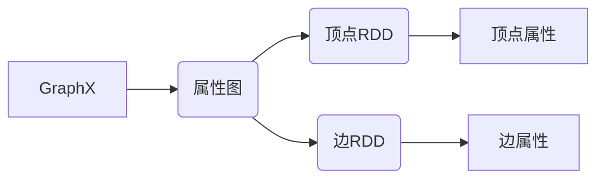
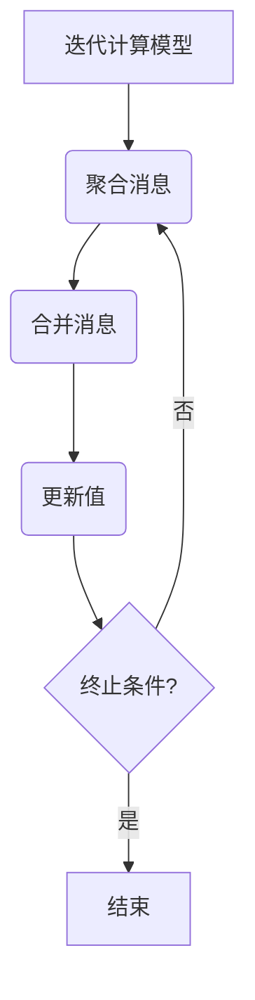
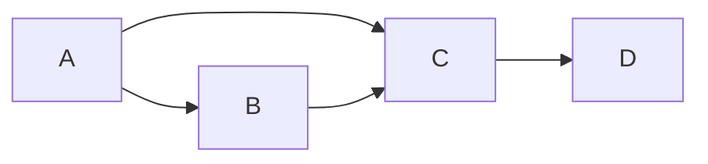

# Spark GraphX原理与代码实例讲解

## 1. 背景介绍

### 1.1 问题的由来

在当今大数据时代,海量的数据不仅包括结构化数据,还包括大量的非结构化数据,如社交网络、物联网、生物信息学等领域产生的关系数据。这些数据可以用图(Graph)的形式进行高效的建模和表示。传统的关系数据库管理系统在处理这些海量关系数据时,效率低下且扩展性差。因此,针对大规模图数据的高效处理和分析成为一个迫切的需求。

### 1.2 研究现状

Apache Spark是一种用于大数据处理的统一分析引擎,它提供了一个称为Spark GraphX的图形处理系统。GraphX是Spark的一个核心组件,旨在简化图形处理,并提供了一种高效的图形计算模型。它基于Spark RDD(Resilient Distributed Dataset)构建,能够在大规模分布式环境中高效地执行图形并行计算。

### 1.3 研究意义

GraphX的出现为大规模图形数据的处理提供了高效的解决方案。它不仅能够处理静态图形数据,还可以处理动态变化的图形数据。GraphX提供了丰富的图形算法库,如PageRank、连通分量、最短路径等,这些算法在许多领域都有广泛的应用,如社交网络分析、Web链接分析、交通网络分析等。

### 1.4 本文结构

本文将从以下几个方面详细介绍Spark GraphX:

1. 核心概念与联系
2. 核心算法原理与具体操作步骤
3. 数学模型和公式详细讲解与案例分析
4. 项目实践:代码实例和详细解释说明
5. 实际应用场景
6. 工具和资源推荐
7. 总结:未来发展趋势与挑战
8. 附录:常见问题与解答

## 2. 核心概念与联系

GraphX将图形数据抽象为由顶点(Vertex)和边(Edge)组成的属性图(Property Graph)。每个顶点和边都可以关联任意的属性数据,如标量值、向量、元组等。GraphX使用弹性分布式数据集(RDD)来分布式存储和处理图形数据。

GraphX提供了两种视图来操作图形数据:

1. **顶点视图(Vertex View)**: 以顶点为中心,每个顶点维护着与之相邻的所有边和远端顶点的信息。
2. **三元组视图(Triplet View)**: 以边为中心,每个边维护着它连接的两个顶点及其属性信息。

这两种视图为图形计算提供了灵活性,开发者可以根据具体的应用场景选择合适的视图进行操作。

## 3. 核心算法原理与具体操作步骤

### 3.1 算法原理概述

GraphX提供了一系列经典的图形算法,如PageRank、连通分量、最短路径等。这些算法基于图形的迭代计算模型(Iterative Graph Computation Model)实现。

迭代计算模型的核心思想是将图形计算转化为一系列的迭代步骤,每个迭代步骤包括以下三个阶段:

1. **聚合消息(Aggregate Messages)**: 在这个阶段,每个顶点根据当前的数据和邻居的数据生成消息,并将这些消息发送给邻居。
2. **合并消息(Merge Messages)**: 每个顶点收集来自邻居的消息,并将这些消息合并为一个新的值。
3. **更新值(Update Values)**: 每个顶点使用合并后的值来更新自己的数据。

这个过程会重复执行,直到满足某个终止条件(如收敛或达到最大迭代次数)。

### 3.2 算法步骤详解

以PageRank算法为例,我们详细介绍其在GraphX中的实现步骤:

1. **初始化**: 为每个顶点赋予初始的PageRank值(通常为1/N,其中N是顶点总数)。
2. **聚合消息**: 每个顶点将自己的PageRank值平均分配给所有出边的目标顶点,生成消息。
3. **合并消息**: 每个顶点收集来自所有入边的消息,并将它们相加得到新的PageRank值。
4. **更新值**: 每个顶点使用新的PageRank值更新自己的数据。
5. **终止条件检查**: 如果PageRank值收敛或达到最大迭代次数,则算法终止;否则,返回步骤2继续迭代。

### 3.3 算法优缺点

GraphX基于Spark RDD实现,具有以下优点:

1. **容错性**: 由于RDD的容错机制,GraphX能够自动从故障中恢复,保证计算的可靠性。
2. **可扩展性**: GraphX可以在大规模分布式环境中运行,具有良好的扩展性。
3. **内存管理**: GraphX采用了高效的内存管理策略,能够处理大规模图形数据。

然而,GraphX也存在一些缺点:

1. **加载时间**: 将大规模图形数据加载到RDD中需要一定的时间开销。
2. **迭代开销**: 迭代计算模型在每次迭代时都需要进行数据洗牌(Shuffle),这可能会导致性能下降。
3. **内存限制**: GraphX需要将整个图形数据保存在内存中,对于超大规模图形数据可能会面临内存限制。

### 3.4 算法应用领域

GraphX提供的图形算法在许多领域都有广泛的应用,包括但不限于:

1. **社交网络分析**: 分析社交网络中的影响力、社区发现等。
2. **Web链接分析**: 计算网页的PageRank值,优化搜索引擎排名。
3. **推荐系统**: 基于用户之间的关系进行协同过滤推荐。
4. **交通网络分析**: 寻找最短路径、交通流量预测等。
5. **生物信息学**: 分析蛋白质互作网络、基因调控网络等。

## 4. 数学模型和公式详细讲解与举例说明

### 4.1 数学模型构建

在GraphX中,图形数据被建模为一个无向图$G=(V,E)$,其中$V$是顶点集合,而$E$是边集合。每个顶点$v \in V$都与一个属性值$x_v$相关联,而每条边$e \in E$也与一个属性值$y_e$相关联。

我们可以将图形数据表示为以下数学形式:

$$
G = (V, E, X, Y)
$$

其中:

- $V$是顶点集合
- $E \subseteq V \times V$是边集合
- $X: V \rightarrow \mathcal{X}$是顶点属性函数,将每个顶点映射到相应的属性值
- $Y: E \rightarrow \mathcal{Y}$是边属性函数,将每条边映射到相应的属性值

### 4.2 公式推导过程

以PageRank算法为例,我们推导其数学公式。PageRank算法的基本思想是,一个网页的重要性由指向它的其他网页的重要性决定。

设$N$为网页总数,对于任意网页$p_i$,其PageRank值$PR(p_i)$可以表示为:

$$
PR(p_i) = (1 - d) + d \sum_{p_j \in B_i} \frac{PR(p_j)}{L(p_j)}
$$

其中:

- $d$是一个阻尼系数(damping factor),通常取值0.85
- $B_i$是所有链接到$p_i$的网页集合
- $L(p_j)$是网页$p_j$的出链接数量

上式的直观解释是:一个网页的PageRank值由两部分组成。第一部分$(1 - d)$是所有网页初始时平均分配的权重。第二部分是该网页通过其他网页的链接获得的权重,其中每个链接网页$p_j$将自身的PageRank值$PR(p_j)$平均分配给所有出链接。

### 4.3 案例分析与讲解

考虑一个简单的网页图形,如下所示:

假设初始时,每个网页的PageRank值都是0.25。我们来计算第一次迭代后的PageRank值:

1. 网页A:
   - 出链接数量: 2
   - 从自身获得的权重: $(1 - 0.85) \times 0.25 = 0.0375$
   - 从B获得的权重: $0.85 \times \frac{0.25}{1} = 0.2125$
   - 从C获得的权重: $0.85 \times \frac{0.25}{2} = 0.1062$
   - 新的PageRank值: $0.0375 + 0.2125 + 0.1062 = 0.3562$

2. 网页B:
   - 出链接数量: 1
   - 从自身获得的权重: $0.0375$
   - 从A获得的权重: $0.85 \times \frac{0.25}{2} = 0.1062$
   - 从C获得的权重: $0.85 \times \frac{0.25}{2} = 0.1062$
   - 新的PageRank值: $0.0375 + 0.1062 + 0.1062 = 0.2499$

3. 网页C:
   - 出链接数量: 1
   - 从自身获得的权重: $0.0375$
   - 从A获得的权重: $0.85 \times \frac{0.25}{2} = 0.1062$
   - 从B获得的权重: $0.85 \times 0.25 = 0.2125$
   - 新的PageRank值: $0.0375 + 0.1062 + 0.2125 = 0.3562$

4. 网页D:
   - 出链接数量: 0
   - 从自身获得的权重: $0.0375$
   - 从C获得的权重: $0.85 \times 0.25 = 0.2125$
   - 新的PageRank值: $0.0375 + 0.2125 = 0.25$

通过上述计算,我们可以看到网页A和C的PageRank值较高,因为它们接收了来自多个网页的链接。而网页D的PageRank值较低,因为它没有任何入链接。

### 4.4 常见问题解答

1. **为什么需要阻尼系数d?**

   阻尼系数$d$的引入是为了解决PageRank算法中的"环路"问题。如果一组网页之间形成了一个环路,它们之间会不断传递PageRank值,导致算法无法收敛。引入$(1 - d)$项可以确保每个网页都有一定的初始权重,从而避免了这个问题。

2. **如何处理孤立节点?**

   孤立节点是指没有任何入链接或出链接的节点。对于这种节点,PageRank算法无法计算其权重。一种解决方案是为所有孤立节点赋予一个较小的固定PageRank值。

3. **PageRank算法的收敛条件是什么?**

   PageRank算法的收敛条件通常是PageRank值的变化小于某个阈值,或者达到最大迭代次数。在实践中,我们可以设置合理的阈值和最大迭代次数,以平衡计算精度和效率。

4. **PageRank算法的时间复杂度是多少?**

   PageRank算法的时间复杂度与图形的规模和稀疏程度有关。在密集图中,每次迭代的时间复杂度为$O(|V| + |E|)$,其中$|V|$和$|E|$分别表示顶点数和边数。而在稀疏图中,由于大部分顶点只有少量邻居,时间复杂度可以近似为$O(|E|)$。

## 5. 项目实践:代码实例和详细解释说明

在本节中,我们将通过一个实际的项目示例,展示如何使用Spark GraphX进行图形数据处理和分析。

### 5.1 开发环境搭建

1. **安装Apache Spark**

   首先,我们需要安装Apache Spark。您可以从官方网站下载Spark的预编译版