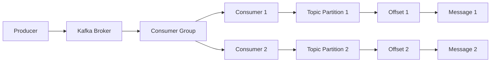

## 1. 背景介绍

### 1.1 问题的由来

在现代的分布式系统中，消息队列扮演着至关重要的角色。它能够有效地解耦系统组件，提高系统性能，并增强系统的可扩展性和可靠性。Kafka作为一款高吞吐量、低延迟、可扩展的分布式消息队列系统，已成为众多企业和组织的首选。

然而，在实际应用中，我们不仅需要将消息发送到Kafka，还需要从Kafka中消费消息并进行处理。Kafka Consumer作为Kafka生态系统中的重要组成部分，负责从Kafka Broker中读取消息并进行处理。理解Kafka Consumer的原理和代码实现，对于我们有效地利用Kafka进行消息处理至关重要。

### 1.2 研究现状

目前，Kafka Consumer已经发展到多个版本，并拥有丰富的功能和特性，例如：

* **消费者组:** 允许多个消费者共同消费同一个主题的消息，并保证消息被消费一次。
* **消息偏移量:** 每个消费者都维护着一个消息偏移量，记录它已经消费了哪些消息。
* **分区分配策略:**  消费者组中的消费者会根据一定的策略分配主题的分区，确保每个分区只被一个消费者消费。
* **消息确认机制:** 消费者可以根据不同的需求选择不同的消息确认机制，例如自动提交、手动提交等。

尽管Kafka Consumer已经拥有丰富的功能，但一些问题仍然存在，例如：

* **消费者组的负载均衡:** 如何在消费者组中公平地分配分区，并根据消费者的负载情况进行动态调整？
* **消息丢失问题:** 如何保证消息在消费过程中不被丢失？
* **消费者故障:** 如何处理消费者故障，并保证消息消费的连续性？

### 1.3 研究意义

深入研究Kafka Consumer的原理和代码实现，能够帮助我们更好地理解Kafka的机制，并解决实际应用中遇到的问题。具体而言，研究意义包括：

* **提高消息处理效率:** 了解Kafka Consumer的机制，可以帮助我们优化消费者的配置，提高消息处理效率。
* **保证消息可靠性:** 理解消息确认机制和消费者故障处理机制，可以帮助我们保证消息在消费过程中不被丢失。
* **提升系统可扩展性:** 了解消费者组的负载均衡策略，可以帮助我们扩展消费者组，提高系统的可扩展性。

### 1.4 本文结构

本文将从以下几个方面对Kafka Consumer进行详细讲解：

* **核心概念与联系:** 介绍Kafka Consumer的核心概念，以及它与其他组件之间的关系。
* **核心算法原理 & 具体操作步骤:** 深入剖析Kafka Consumer的核心算法原理，并详细介绍其操作步骤。
* **数学模型和公式 & 详细讲解 & 举例说明:**  使用数学模型和公式对Kafka Consumer进行建模，并通过案例分析和讲解帮助读者理解其原理。
* **项目实践：代码实例和详细解释说明:**  提供完整的代码实例，并对代码进行详细的解释说明，帮助读者快速上手。
* **实际应用场景:**  介绍Kafka Consumer在实际应用中的常见场景，并探讨其未来应用展望。
* **工具和资源推荐:**  推荐一些学习资源、开发工具、相关论文和其他的资源，帮助读者进一步学习。
* **总结：未来发展趋势与挑战:**  总结Kafka Consumer的研究成果，展望其未来发展趋势，并分析其面临的挑战。
* **附录：常见问题与解答:**  解答一些常见的关于Kafka Consumer的问题。


## 2. 核心概念与联系

Kafka Consumer是Kafka生态系统中的一个重要组成部分，负责从Kafka Broker中读取消息并进行处理。它与其他组件之间存在着密切的联系，共同构成了完整的Kafka消息处理流程。

**核心概念:**

* **消费者组 (Consumer Group):**  消费者组是一个逻辑上的概念，它代表了一组共同消费同一个主题消息的消费者。每个消费者组都有一个唯一的名称，并且每个消费者都必须属于一个消费者组。
* **消费者 (Consumer):** 消费者是实际进行消息消费的实体，它会从Kafka Broker中读取消息并进行处理。
* **分区 (Partition):**  主题被划分为多个分区，每个分区都是一个独立的消息序列。
* **偏移量 (Offset):**  每个消费者都会维护一个偏移量，记录它已经消费了哪些消息。
* **消息确认机制 (Acknowledgement):**  消费者可以根据不同的需求选择不同的消息确认机制，例如自动提交、手动提交等。

**联系:**

* **消费者组与消费者:**  每个消费者都必须属于一个消费者组，消费者组中的消费者共同消费同一个主题的消息。
* **消费者与分区:**  消费者组中的消费者会根据一定的策略分配主题的分区，确保每个分区只被一个消费者消费。
* **消费者与偏移量:**  消费者会维护一个偏移量，记录它已经消费了哪些消息，以便下次消费时从上次消费的偏移量开始消费。
* **消费者与消息确认机制:**  消费者可以根据不同的需求选择不同的消息确认机制，例如自动提交、手动提交等，以确保消息被消费一次。

**图示:**



**解释:**

* Producer将消息发送到Kafka Broker。
* Kafka Broker将消息存储到主题中，主题被划分为多个分区。
* Consumer Group中的消费者会根据一定的策略分配主题的分区，每个分区只被一个消费者消费。
* 每个消费者都会维护一个偏移量，记录它已经消费了哪些消息。
* 消费者可以根据不同的需求选择不同的消息确认机制，例如自动提交、手动提交等，以确保消息被消费一次。


## 3. 核心算法原理 & 具体操作步骤

### 3.1 算法原理概述

Kafka Consumer的核心算法原理主要包括以下几个方面：

* **分区分配:**  消费者组中的消费者会根据一定的策略分配主题的分区，确保每个分区只被一个消费者消费。
* **偏移量管理:**  每个消费者都会维护一个偏移量，记录它已经消费了哪些消息。
* **消息确认:**  消费者可以根据不同的需求选择不同的消息确认机制，例如自动提交、手动提交等。
* **故障处理:**  当消费者出现故障时，需要保证消息消费的连续性。

### 3.2 算法步骤详解

下面以自动提交为例，详细介绍Kafka Consumer的消费流程：

1. **消费者启动:**  消费者启动时，会加入到指定的消费者组，并向Kafka Broker发送一个请求，获取主题的分区信息。
2. **分区分配:**  Kafka Broker会根据一定的策略，将主题的分区分配给消费者组中的消费者。
3. **获取偏移量:**  消费者会从Kafka Broker中获取它所分配的分区的偏移量，记录它已经消费了哪些消息。
4. **消费消息:**  消费者会从Kafka Broker中读取消息，并进行处理。
5. **提交偏移量:**  消费者会定期将它消费的消息的偏移量提交给Kafka Broker，以记录它已经消费了哪些消息。
6. **消息确认:**  Kafka Broker会根据消费者的消息确认机制，确认消息是否被成功消费。
7. **故障处理:**  当消费者出现故障时，其他消费者会接管它所分配的分区，并继续消费消息。

### 3.3 算法优缺点

**优点:**

* **高吞吐量:**  Kafka Consumer能够以高吞吐量消费消息。
* **低延迟:**  Kafka Consumer能够以低延迟消费消息。
* **可扩展性:**  Kafka Consumer可以根据需要扩展消费者组，以提高系统的可扩展性。
* **可靠性:**  Kafka Consumer提供了多种消息确认机制，可以保证消息被消费一次。
* **容错性:**  Kafka Consumer能够处理消费者故障，并保证消息消费的连续性。

**缺点:**

* **消费者组的负载均衡:**  如何保证消费者组中的消费者能够公平地分配分区，并根据消费者的负载情况进行动态调整？
* **消息丢失问题:**  如何保证消息在消费过程中不被丢失？
* **消费者故障:**  如何处理消费者故障，并保证消息消费的连续性？

### 3.4 算法应用领域

Kafka Consumer广泛应用于各种消息处理场景，例如：

* **日志收集:**  将应用程序的日志消息发送到Kafka，并使用Kafka Consumer进行消费和处理。
* **实时数据处理:**  将实时数据发送到Kafka，并使用Kafka Consumer进行实时数据处理，例如数据分析、数据聚合等。
* **事件驱动架构:**  将事件发送到Kafka，并使用Kafka Consumer进行事件驱动，例如消息通知、任务调度等。

## 4. 数学模型和公式 & 详细讲解 & 举例说明

### 4.1 数学模型构建

Kafka Consumer的消费流程可以抽象成一个数学模型，如下所示：

$$
Consumer = \{C_1, C_2, ..., C_n\}
$$

$$
Topic = \{P_1, P_2, ..., P_m\}
$$

$$
Partition = \{O_1, O_2, ..., O_k\}
$$

其中：

* $Consumer$ 表示消费者组，包含 $n$ 个消费者。
* $Topic$ 表示主题，包含 $m$ 个分区。
* $Partition$ 表示分区，包含 $k$ 个偏移量。

### 4.2 公式推导过程

Kafka Consumer的消费流程可以描述为以下公式：

$$
Consumer_i \leftarrow Partition_j, O_k
$$

其中：

* $Consumer_i$ 表示消费者组中的第 $i$ 个消费者。
* $Partition_j$ 表示主题中的第 $j$ 个分区。
* $O_k$ 表示分区中的第 $k$ 个偏移量。

该公式表示消费者 $Consumer_i$ 被分配了主题中的分区 $Partition_j$，并从偏移量 $O_k$ 开始消费消息。

### 4.3 案例分析与讲解

假设有一个主题名为 "my-topic"，包含 3 个分区，分别为 "partition-0"，"partition-1"，"partition-2"。消费者组名为 "my-group"，包含 2 个消费者，分别为 "consumer-1"，"consumer-2"。

**分区分配:**

Kafka Broker会根据一定的策略，将主题的分区分配给消费者组中的消费者。例如，可以采用轮询分配策略，将分区依次分配给消费者。

* "consumer-1" 被分配了 "partition-0" 和 "partition-2"。
* "consumer-2" 被分配了 "partition-1"。

**偏移量管理:**

每个消费者都会维护一个偏移量，记录它已经消费了哪些消息。例如，"consumer-1" 在 "partition-0" 中的偏移量为 10，表示它已经消费了 "partition-0" 中的前 10 条消息。

**消息确认:**

消费者可以根据不同的需求选择不同的消息确认机制，例如自动提交、手动提交等。

* **自动提交:**  消费者会定期将它消费的消息的偏移量提交给Kafka Broker。
* **手动提交:**  消费者需要手动调用 API 将偏移量提交给Kafka Broker。

**故障处理:**

当消费者出现故障时，其他消费者会接管它所分配的分区，并继续消费消息。例如，"consumer-1" 出现故障，"consumer-2" 会接管 "partition-0" 和 "partition-2"，并继续消费消息。

### 4.4 常见问题解答

**Q: 如何保证消息不被丢失？**

**A:**  可以使用手动提交偏移量，并在处理完消息后才提交偏移量。这样，即使消费者出现故障，也不会丢失消息。

**Q: 如何处理消费者故障？**

**A:**  可以使用消费者组的 rebalance 机制，当消费者出现故障时，其他消费者会接管它所分配的分区，并继续消费消息。

**Q: 如何选择合适的消费者组和分区分配策略？**

**A:**  需要根据实际应用场景选择合适的消费者组和分区分配策略。例如，如果需要保证消息被消费一次，可以使用单个消费者组，并采用轮询分配策略。


## 5. 项目实践：代码实例和详细解释说明

### 5.1 开发环境搭建

**依赖:**

```xml
<dependency>
  <groupId>org.apache.kafka</groupId>
  <artifactId>kafka-clients</artifactId>
  <version>3.5.0</version>
</dependency>
```

**配置:**

```properties
bootstrap.servers=localhost:9092
group.id=my-group
enable.auto.commit=false
auto.commit.interval.ms=1000
key.deserializer=org.apache.kafka.common.serialization.StringDeserializer
value.deserializer=org.apache.kafka.common.serialization.StringDeserializer
```

### 5.