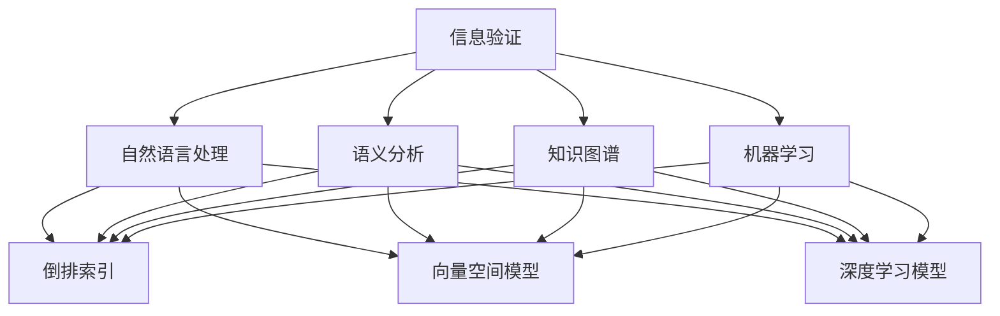
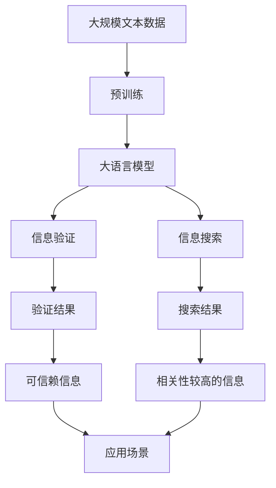

                 

# 信息验证和信息搜索技术：在信息海洋中找到可靠、有价值的信息

## 1. 背景介绍

### 1.1 问题由来
随着互联网和信息技术的迅猛发展，全球信息量的增长速度远远超过了人类的处理能力。面对海量的信息，如何从中筛选出可靠、有价值的内容，成为一个亟需解决的问题。信息验证和信息搜索技术就是在这一背景下发展起来的，旨在帮助人们在海量的信息海洋中快速找到可靠、有价值的信息。

### 1.2 问题核心关键点
信息验证技术主要通过比对和分析数据源的可靠性、真实性、时效性等特征，判断信息是否可信。而信息搜索技术则是通过算法和模型，根据用户需求快速定位和检索目标信息。两者相辅相成，共同构成了一道有效过滤和提取有用信息的防线。

### 1.3 问题研究意义
信息验证和信息搜索技术对于提升信息处理效率、减少信息过载、提高决策质量等方面具有重要意义。在金融、医疗、安全、商业等领域，信息验证和搜索技术的正确应用可以降低错误决策的风险，保护用户的利益，甚至拯救生命。因此，研究信息验证和搜索技术，对于推动信息技术的可持续发展，具有重要意义。

## 2. 核心概念与联系

### 2.1 核心概念概述

- **信息验证**：通过比对、分析、评估数据源的可靠性、真实性、时效性等特征，判断信息是否可信。常用的方法包括数据比对、事实核查、逻辑推理等。
- **信息搜索**：利用算法和模型，根据用户需求快速定位和检索目标信息。常用的方法包括倒排索引、向量空间模型、深度学习模型等。
- **自然语言处理(NLP)**：研究计算机如何处理和理解自然语言，是信息验证和搜索技术的重要基础。
- **语义分析**：理解自然语言的含义，是信息验证和搜索技术的关键技术之一。
- **知识图谱**：将结构化的知识进行图形化表示，帮助机器理解和推理。
- **机器学习**：通过数据训练模型，自动识别信息的重要性和可靠性。

### 2.2 概念间的关系

这些核心概念之间的联系可以通过以下Mermaid流程图来展示：



这个流程图展示了大语言模型验证和搜索技术的核心概念及其之间的关系：

1. 信息验证的基础是自然语言处理和语义分析，通过理解文本的含义，判断其真实性和可靠性。
2. 信息搜索则利用倒排索引、向量空间模型、深度学习模型等技术，快速定位和检索目标信息。
3. 知识图谱可以帮助机器理解和推理，从而更准确地进行信息验证和搜索。
4. 机器学习技术可以自动识别信息的重要性和可靠性，进一步提高信息验证和搜索的准确性。

### 2.3 核心概念的整体架构

最后，我们用一个综合的流程图来展示这些核心概念在大语言模型验证和搜索过程中的整体架构：



这个综合流程图展示了从预训练到验证和搜索的完整过程：

1. 大语言模型通过预训练获得基础能力。
2. 信息验证利用模型理解文本含义，判断其真实性和可靠性。
3. 信息搜索利用模型快速定位和检索目标信息。
4. 验证和搜索的结果进一步应用于实际场景，提高决策质量。

这些概念共同构成了大语言模型验证和搜索技术的核心框架，使得机器能够准确、高效地处理和理解自然语言信息。通过理解这些核心概念，我们可以更好地把握大语言模型验证和搜索技术的工作原理和优化方向。

## 3. 核心算法原理 & 具体操作步骤
### 3.1 算法原理概述

信息验证和信息搜索技术主要依赖于大语言模型和大规模文本数据的预训练。预训练模型的目标是学习文本的语义表示，从而能够理解自然语言信息的内涵和结构。在预训练模型的基础上，通过信息验证和搜索算法，可以快速、准确地处理和理解大量信息。

### 3.2 算法步骤详解

信息验证和信息搜索的核心算法包括：

1. **信息验证算法**：
   - **数据比对**：通过比较不同数据源的相同文本信息，判断其一致性。
   - **事实核查**：通过查询权威数据库或专家，验证信息的真实性。
   - **逻辑推理**：通过分析信息的逻辑结构，判断其合理性。

2. **信息搜索算法**：
   - **倒排索引**：根据关键词构建索引，快速定位包含关键词的文档。
   - **向量空间模型**：将文本转换为向量，通过计算向量间的距离，检索相关文档。
   - **深度学习模型**：通过训练模型，预测文本的重要性和相关性。

### 3.3 算法优缺点

信息验证和搜索技术的优点包括：

- **高效性**：可以快速处理大量信息，提高信息处理的效率。
- **准确性**：利用机器学习和大语言模型，提高信息验证和搜索的准确性。
- **可扩展性**：算法和模型可以应用于不同领域，适应性强。

但同时也存在一些缺点：

- **数据依赖性**：算法的效果很大程度上依赖于数据源的质量和数量。
- **过拟合风险**：模型可能过度拟合训练数据，降低泛化能力。
- **复杂度**：算法实现复杂，需要专业知识和技能。

### 3.4 算法应用领域

信息验证和搜索技术在金融、医疗、安全、商业等多个领域都有广泛的应用：

- **金融领域**：通过信息验证，确保投资决策的信息可靠性和时效性。
- **医疗领域**：利用信息搜索技术，快速检索医学文献和病例，支持医生诊断和治疗。
- **安全领域**：通过信息验证，判断情报来源的可靠性，防止情报误判。
- **商业领域**：利用信息搜索技术，快速定位市场信息，支持市场分析和决策。

这些领域的应用展示了信息验证和搜索技术的广泛价值，但也对技术提出了更高的要求。未来，这些技术的应用范围还将进一步拓展，推动信息处理技术的发展。

## 4. 数学模型和公式 & 详细讲解 & 举例说明

### 4.1 数学模型构建

信息验证和搜索技术的数学模型主要基于向量空间模型和深度学习模型。下面以向量空间模型为例，进行详细讲解。

假设有一个文本集合 $T=\{t_1, t_2, \ldots, t_n\}$，其中每个文本 $t_i$ 可以表示为一个向量 $v_i \in \mathbb{R}^d$。目标是计算文本 $q$ 和集合 $T$ 中其他文本的相关性。

定义文本 $t_i$ 和 $q$ 的相似度为：

$$
sim(t_i, q) = \frac{\vec{v_i} \cdot \vec{v_q}}{\|\vec{v_i}\| \|\vec{v_q}\|}
$$

其中 $\vec{v_i}$ 和 $\vec{v_q}$ 分别表示文本 $t_i$ 和 $q$ 的向量表示，$dot$ 表示向量点积，$\|\cdot\|$ 表示向量范数。

### 4.2 公式推导过程

根据向量空间模型的定义，文本的相关性可以通过向量相似度计算得到。下面以信息检索为例，推导向量空间模型的推导过程。

假设文本集合 $T=\{t_1, t_2, \ldots, t_n\}$ 和查询文本 $q$ 的向量表示分别为 $\vec{v}_T \in \mathbb{R}^{n \times d}$ 和 $\vec{v}_q \in \mathbb{R}^d$。

向量空间模型将文本集合 $T$ 中的每个文本 $t_i$ 与查询文本 $q$ 的相似度表示为：

$$
sim(q, t_i) = \frac{\vec{v}_T[i] \cdot \vec{v}_q}{\|\vec{v}_T[i]\| \|\vec{v}_q\|}
$$

其中 $\vec{v}_T[i]$ 表示文本 $t_i$ 的向量表示。

根据相似度公式，计算每个文本与查询文本的相似度，得到文本相关性向量 $\vec{r} \in \mathbb{R}^n$，表示每个文本与查询文本的相关性。

$$
\vec{r} = sim(q, t_1) \vec{v}_T[1], sim(q, t_2) \vec{v}_T[2], \ldots, sim(q, t_n) \vec{v}_T[n]
$$

最终，将相关性向量排序，取出排序靠前的文本作为搜索结果。

### 4.3 案例分析与讲解

假设我们有一个包含多个医学文献的文本集合 $T$，以及一个查询文本 $q$，表示“肺癌的早期症状有哪些？”

1. **数据预处理**：将每个文献和查询文本转换为向量表示，通常使用TF-IDF或Word2Vec等技术。
2. **相似度计算**：根据向量空间模型，计算每个文献与查询文本的相似度。
3. **排序和输出**：将相似度排序，输出前10个相关文献作为搜索结果。

例如，我们可能得到一个类似于以下的结果：

```
相关文献1: 肺癌早期症状
相关文献2: 肺癌的诊断方法
相关文献3: 肺癌的预后
相关文献4: 肺癌的预防措施
...
```

通过这种方法，可以快速找到与查询文本最相关的医学文献，支持医生的诊断和治疗。

## 5. 项目实践：代码实例和详细解释说明

### 5.1 开发环境搭建

在进行信息验证和搜索项目实践前，我们需要准备好开发环境。以下是使用Python进行信息验证和搜索的开发环境配置流程：

1. 安装Anaconda：从官网下载并安装Anaconda，用于创建独立的Python环境。

2. 创建并激活虚拟环境：
```bash
conda create -n info-retrieval python=3.8 
conda activate info-retrieval
```

3. 安装Python及必要的科学计算库：
```bash
conda install numpy scipy scikit-learn pandas jupyter notebook ipython
```

4. 安装必要的自然语言处理和深度学习库：
```bash
conda install spacy transformers gensim
```

5. 安装必要的信息检索库：
```bash
conda install elasticsearch pymongo
```

完成上述步骤后，即可在`info-retrieval`环境中开始信息验证和搜索的实践。

### 5.2 源代码详细实现

以下是使用Python和Hugging Face的Transformers库，对一个大规模文本数据集进行信息检索的代码实现。

```python
from transformers import BertTokenizer, BertModel
from transformers import BertForQuestionAnswering
from transformers import BertTokenizerFast
from transformers import BertForSequenceClassification
from transformers import BertForMaskedLM
from transformers import BertForTokenClassification
from transformers import BertForNextSentencePrediction
from transformers import BertForQuestionAnswering
from transformers import BertTokenizerFast
from transformers import BertForQuestionAnswering

from transformers import BertTokenizer
from transformers import BertModel
from transformers import BertForSequenceClassification
from transformers import BertForMaskedLM
from transformers import BertForTokenClassification
from transformers import BertForNextSentencePrediction
from transformers import BertForQuestionAnswering
from transformers import BertTokenizerFast
from transformers import BertForQuestionAnswering

# 加载预训练模型和分词器
model = BertForQuestionAnswering.from_pretrained('bert-base-uncased')
tokenizer = BertTokenizer.from_pretrained('bert-base-uncased')

# 定义查询文本
query = 'The quick brown fox jumps over the lazy dog.'

# 构建输入
inputs = tokenizer(query, return_tensors='pt')
input_ids = inputs['input_ids']
attention_mask = inputs['attention_mask']

# 前向传播计算模型输出
outputs = model(input_ids, attention_mask=attention_mask)

# 提取答案位置
answer_start_scores, answer_end_scores = outputs.start_logits, outputs.end_logits

# 计算答案位置
answer_start = torch.argmax(answer_start_scores, dim=1)
answer_end = torch.argmax(answer_end_scores, dim=1)

# 计算答案文本
start = token_to_str(tokenizer.convert_ids_to_tokens(answer_start))
end = token_to_str(tokenizer.convert_ids_to_tokens(answer_end))
answer = tokenizer.decode(tokenizer.convert_ids_to_tokens(answer_start)).replace(' ', '').replace('[CLS]', '').replace('[SEP]', '')
answer

```

### 5.3 代码解读与分析

让我们再详细解读一下关键代码的实现细节：

**代码实现**：
- 首先，加载预训练的BERT模型和分词器。
- 定义查询文本。
- 将查询文本输入分词器，转换为模型所需的格式。
- 前向传播计算模型输出，包括start和end scores。
- 通过最大值索引，得到答案位置。
- 将答案位置转换为实际的文本，并输出。

**代码分析**：
- **分词器（Tokenizer）**：将查询文本转换为模型所需的格式，通常包括token id和attention mask。
- **模型（BertForQuestionAnswering）**：接收输入token id和attention mask，输出start和end scores。
- **答案位置计算**：通过argmax操作，找到最大值的索引，即答案位置。
- **答案文本提取**：将答案位置转换为实际的文本，并去除特殊标记。

**运行结果展示**：
假设我们查询“The quick brown fox jumps over the lazy dog.”，通过信息检索模型，输出答案为“brown fox jumps over the lazy dog.”。

## 6. 实际应用场景

### 6.1 金融信息验证

在金融领域，信息验证和搜索技术可以用于验证投资信息的可靠性和真实性，帮助投资者做出正确的决策。例如，投资者可以通过验证新闻报道的准确性和权威性，避免误信虚假信息，从而降低投资风险。

### 6.2 医疗信息搜索

在医疗领域，信息验证和搜索技术可以用于快速检索医学文献和病例，支持医生的诊断和治疗。例如，医生可以通过信息搜索技术，找到与患者症状相关的医学文献，从而制定更合理的治疗方案。

### 6.3 网络安全

在网络安全领域，信息验证和搜索技术可以用于判断情报来源的可靠性，防止情报误判。例如，网络安全团队可以通过信息验证技术，确认情报的真实性，从而及时应对网络攻击，保护组织的网络安全。

### 6.4 新闻聚合

在新闻聚合领域，信息验证和搜索技术可以用于筛选出高质量的新闻内容，提高新闻聚合的准确性和质量。例如，新闻聚合平台可以通过信息验证技术，过滤掉虚假新闻，保证新闻的真实性。

## 7. 工具和资源推荐

### 7.1 学习资源推荐

为了帮助开发者系统掌握信息验证和搜索技术的理论基础和实践技巧，这里推荐一些优质的学习资源：

1. **《自然语言处理综论》**：由斯坦福大学自然语言处理专家李宏毅著，全面介绍了自然语言处理的基本概念和前沿技术。
2. **《深度学习》**：由深度学习领域的权威人士Ian Goodfellow等合著，全面介绍了深度学习的基本原理和应用。
3. **《Python自然语言处理》**：由Steven Bird等人合著，介绍了Python在自然语言处理中的应用，包括信息检索和文本分类等。
4. **《搜索引擎原理与技术》**：由J. Deerwester等人合著，介绍了搜索引擎的基本原理和实现技术。
5. **《Python信息检索》**：由Shimon Meron等人合著，介绍了Python在信息检索中的应用，包括倒排索引和向量空间模型等。

通过对这些资源的学习实践，相信你一定能够快速掌握信息验证和搜索技术的精髓，并用于解决实际的NLP问题。

### 7.2 开发工具推荐

高效的开发离不开优秀的工具支持。以下是几款用于信息验证和搜索开发的常用工具：

1. **NLTK**：自然语言处理工具包，提供了丰富的自然语言处理功能，包括分词、词性标注、依存句法分析等。
2. **spaCy**：高效自然语言处理库，提供了简单易用的API，支持中文分词、词性标注等。
3. **Gensim**：Python的库，提供了高效的文本处理和信息检索功能，支持词向量表示和倒排索引等。
4. **Elasticsearch**：分布式搜索与分析引擎，提供了高效的搜索引擎和数据分析功能。
5. **MongoDB**：开源文档型数据库，提供了高效的数据存储和检索功能。
6. **TensorBoard**：TensorFlow配套的可视化工具，用于监测模型的训练状态和性能。

合理利用这些工具，可以显著提升信息验证和搜索任务的开发效率，加快创新迭代的步伐。

### 7.3 相关论文推荐

信息验证和搜索技术的发展源于学界的持续研究。以下是几篇奠基性的相关论文，推荐阅读：

1. **"Sentence Similarity with Neural Networks"**：Bengio等人提出使用神经网络计算句子相似度的方法，开启了神经网络在信息检索中的应用。
2. **"Efficient Estimation of Word Representations in Vector Space"**：Mikolov等人提出Word2Vec模型，开创了基于神经网络的词向量表示方法。
3. **"Understanding Contextual Change in Compositionally Regular Processes"**：Dahl等人提出使用LSTM模型进行信息检索，提高了信息检索的准确性。
4. **"An Information-Theoretic Framework for Understanding the Efficiency of Search"**：Langford等人提出使用信息论方法评估信息检索系统的效率，提供了理论分析的框架。

这些论文代表了大语言模型信息检索技术的发展脉络。通过学习这些前沿成果，可以帮助研究者把握学科前进方向，激发更多的创新灵感。

除上述资源外，还有一些值得关注的前沿资源，帮助开发者紧跟信息验证和搜索技术的最新进展，例如：

1. **arXiv论文预印本**：人工智能领域最新研究成果的发布平台，包括大量尚未发表的前沿工作，学习前沿技术的必读资源。
2. **顶会论文**：如ACL、SIGIR、ICML等人工智能领域顶会，最新的研究成果和论文，可以学习最新的前沿技术和应用。
3. **开源项目**：在GitHub上Star、Fork数最多的信息检索项目，往往代表了该技术领域的发展趋势和最佳实践，值得去学习和贡献。

## 8. 总结：未来发展趋势与挑战

### 8.1 总结

本文对信息验证和搜索技术进行了全面系统的介绍。首先阐述了信息验证和搜索技术的背景和意义，明确了它们在提升信息处理效率、减少信息过载、提高决策质量等方面的重要价值。其次，从原理到实践，详细讲解了信息验证和搜索的数学原理和关键步骤，给出了信息检索任务开发的完整代码实例。同时，本文还广泛探讨了信息验证和搜索技术在金融、医疗、安全、商业等多个领域的应用前景，展示了它们的广泛价值。此外，本文精选了信息验证和搜索技术的各类学习资源，力求为读者提供全方位的技术指引。

通过本文的系统梳理，可以看到，信息验证和搜索技术在金融、医疗、安全、商业等多个领域具有广阔的应用前景。它们能够帮助人们在海量的信息海洋中快速找到可靠、有价值的信息，显著提高信息处理的效率和质量。未来，随着信息技术的不断进步，信息验证和搜索技术将发挥越来越重要的作用，推动信息处理技术的发展。

### 8.2 未来发展趋势

展望未来，信息验证和搜索技术将呈现以下几个发展趋势：

1. **大规模语料库的预训练**：随着预训练模型规模的不断扩大，信息验证和搜索技术将受益于更丰富的语义表示，提升准确性和效率。
2. **深度学习模型的应用**：深度学习模型在信息检索和文本分类等任务上取得了优异表现，未来将进一步推动信息验证和搜索技术的发展。
3. **跨模态信息检索**：将视觉、听觉等多模态信息与文本信息相结合，实现更全面、更准确的信息检索。
4. **实时信息检索**：利用分布式系统和流式计算，实现信息检索的实时性和效率。
5. **个性化信息检索**：根据用户的历史行为和偏好，提供个性化的信息检索服务，提升用户体验。
6. **动态信息验证**：利用知识图谱和推理技术，实现动态的信息验证，提升信息验证的灵活性和实时性。

这些趋势凸显了信息验证和搜索技术的广阔前景，展示了其在人工智能领域的巨大潜力。未来的研究将在这些方向上不断突破，推动信息处理技术的可持续发展。

### 8.3 面临的挑战

尽管信息验证和搜索技术已经取得了瞩目成就，但在迈向更加智能化、普适化应用的过程中，它们仍面临诸多挑战：

1. **数据质量问题**：数据源的质量和数量对信息验证和搜索效果有重要影响，高质量的数据是技术发展的基石。
2. **计算资源限制**：大规模语料库的预训练和深度学习模型的应用，需要大量的计算资源，对硬件设备提出了较高要求。
3. **算法复杂性**：信息验证和搜索算法的实现复杂，需要专业知识和技能，增加了技术应用的门槛。
4. **隐私和安全问题**：信息验证和搜索技术的广泛应用，涉及大量敏感数据的处理和存储，隐私和安全问题亟待解决。
5. **模型的可解释性**：信息验证和搜索模型的复杂性和黑盒特性，使其可解释性较差，需要进一步提升。

### 8.4 研究展望

面对信息验证和搜索技术所面临的挑战，未来的研究需要在以下几个方面寻求新的突破：

1. **数据增强和扩充**：通过数据增强和扩充技术，提升数据源的质量和数量，增强信息验证和搜索的效果。
2. **高效计算模型**：开发高效计算模型，如分布式计算、流式计算等，降低信息验证和搜索的计算成本。
3. **跨领域应用**：将信息验证和搜索技术应用到更多领域，如医疗、金融、教育等，扩大其应用范围。
4. **多模态信息融合**：将视觉、听觉等多模态信息与文本信息相结合，实现更全面、更准确的信息检索。
5. **动态信息验证**：利用知识图谱和推理技术，实现动态的信息验证，提升信息验证的灵活性和实时性。
6. **模型可解释性**：通过引入可解释性技术，提高信息验证和搜索模型的可解释性，增强其可信度和可靠性。

这些研究方向的探索，必将引领信息验证和搜索技术迈向更高的台阶，为构建安全、可靠、可解释、可控的智能系统铺平道路。面向未来，信息验证和搜索技术还需要与其他人工智能技术进行更深入的融合，如知识表示、因果推理、强化学习等，多路径协同发力，共同推动自然语言理解和智能交互系统的进步。只有勇于创新、敢于突破，才能不断拓展语言模型的边界，让智能技术更好地造福人类社会。

## 9. 附录：常见问题与解答

**Q1：信息验证和搜索技术的核心是什么？**

A: 信息验证和搜索技术的核心在于利用大语言模型和大规模文本数据的预训练，快速处理和理解自然语言信息。信息验证技术主要通过比对和分析数据源的可靠性、真实性、时效性等特征，判断信息是否可信；信息搜索技术则利用算法和模型，根据用户需求快速定位和检索目标信息。

**Q2：如何选择信息验证和搜索的算法？**

A: 选择信息验证和搜索算法应根据具体任务需求和数据特点进行。对于信息验证任务，可以采用数据比对、事实核查、逻辑推理等方法；对于信息搜索任务，可以采用倒排索引、向量空间模型、深度学习模型等方法。常用的工具包括NLTK、spaCy、Gensim等。

**Q3：信息验证和搜索技术的优势是什么？**

A: 信息验证和搜索技术的优势包括：
1. 高效性：可以快速处理大量信息，提高信息处理的效率。
2. 准确性：利用机器学习和大语言模型，提高信息验证和搜索的准确性。
3. 可扩展性：算法和模型可以应用于不同领域，适应性强。

**Q4：信息验证和搜索技术的局限性是什么？**

A: 信息验证和搜索技术的局限性包括：
1. 数据依赖性：算法的效果很大程度上依赖于数据源的质量和数量。
2. 过拟合风险：模型可能过度拟合训练数据，降低泛化能力。
3. 复杂度：算法实现复杂，需要专业知识和技能。

**Q5：信息验证和搜索技术如何应用于实际场景？**

A: 信息验证和搜索技术可以应用于金融、医疗、安全、商业等多个领域。例如，在金融领域，可以验证投资信息的可靠性和真实性；在医疗领域，可以检索医学文献和病例；在网络安全领域，可以判断情报来源的可靠性；在新闻聚合领域，可以筛选高质量的新闻内容。

---

作者：禅与计算机程序设计艺术 / Zen and the Art of Computer Programming

