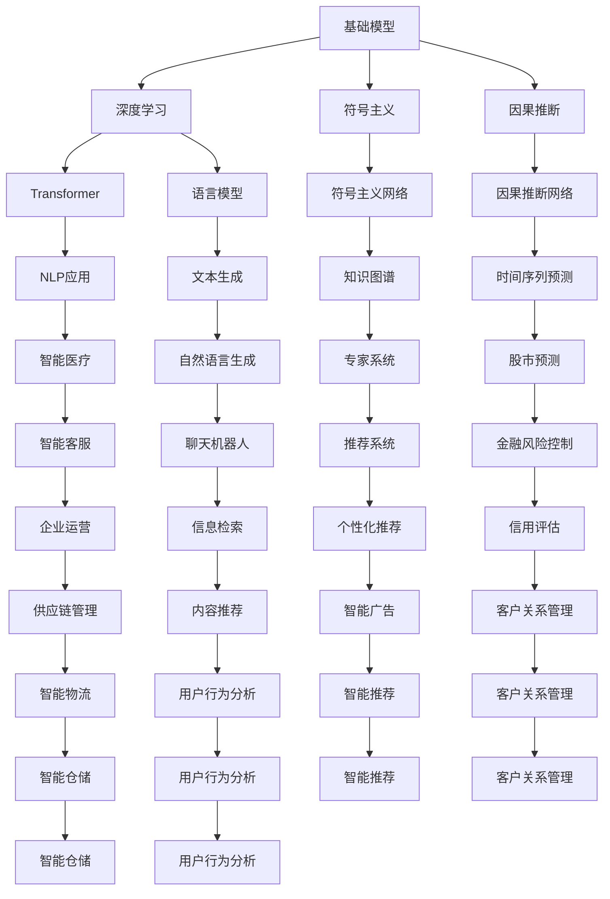

                 

# 基础模型的技术创新与社会合作

## 1. 背景介绍

### 1.1 问题由来
在人工智能（AI）领域，基础模型（Foundational Models）近年来引起了广泛的关注和讨论。这些模型通常具有强大的能力，能够在各种复杂任务上表现出色。例如，深度学习中的Transformer模型，在自然语言处理（NLP）任务中表现卓越，推动了NLP技术的飞速发展。基础模型不仅在技术层面具有创新性，还在社会合作与伦理问题等方面具有重要的社会意义。

### 1.2 问题核心关键点
基础模型的核心关键点包括：
- **技术创新**：基础模型在深度学习、符号主义、因果推断等前沿技术领域具有显著的创新性。
- **社会合作**：基础模型在推动多学科合作、构建智能系统等方面具有重要作用。
- **伦理问题**：基础模型在偏见、隐私、安全等方面存在挑战，需要加强伦理监管。

### 1.3 问题研究意义
研究基础模型的技术创新和社会合作问题，对于推动人工智能技术的广泛应用，提升社会合作效率，解决伦理问题具有重要意义：
- 促进技术进步：基础模型推动了AI技术的突破，为各行各业提供了强大的工具。
- 提升社会合作：基础模型促进了多学科合作，加快了技术创新和应用。
- 解决伦理问题：通过监管和改进技术，基础模型可以更好地服务于社会。

## 2. 核心概念与联系

### 2.1 核心概念概述
- **基础模型**：如深度学习中的Transformer、语言模型等，具有强大的学习和推理能力。
- **技术创新**：包括深度学习、符号主义、因果推断等前沿技术的发展。
- **社会合作**：通过技术推动多学科合作，构建智能系统，提升社会工作效率。
- **伦理问题**：如模型偏见、隐私保护、安全等问题。

### 2.2 核心概念原理和架构的 Mermaid 流程图



### 2.3 核心概念之间的关系

基础模型通过深度学习、符号主义、因果推断等技术创新，推动了NLP、知识图谱、时间序列预测等应用的发展。这些应用进一步提升了社会合作的效率，构建了智能系统，例如智能医疗、智能客服、推荐系统等。同时，伦理问题如模型偏见、隐私保护、安全等问题也需要在这些应用中得到解决。

## 3. 核心算法原理 & 具体操作步骤

### 3.1 算法原理概述

基础模型的算法原理主要基于深度学习和符号主义。深度学习通过神经网络结构，实现了对复杂数据的建模和推理。符号主义则通过逻辑推理，实现对知识的表示和推理。因果推断进一步提升了模型在因果关系上的建模能力，使其能够更好地理解和解释复杂现象。

### 3.2 算法步骤详解

基础模型的开发步骤主要包括以下几个关键步骤：
1. **数据准备**：收集和预处理数据，确保数据质量和多样性。
2. **模型构建**：选择合适的模型结构，如Transformer、语言模型等。
3. **模型训练**：使用大量数据训练模型，调整模型参数，提升模型性能。
4. **模型评估**：在验证集和测试集上评估模型性能，调整模型参数。
5. **模型部署**：将训练好的模型部署到实际应用中，进行推理和预测。

### 3.3 算法优缺点

基础模型的优点包括：
- **能力强大**：在深度学习和符号主义的基础上，具有强大的学习和推理能力。
- **应用广泛**：广泛应用于自然语言处理、知识图谱、时间序列预测等领域。

缺点包括：
- **资源消耗大**：模型参数量大，训练和推理需要大量计算资源。
- **解释性不足**：模型往往是"黑盒"，难以解释其内部工作机制。
- **数据依赖性强**：模型的性能依赖于数据的质量和多样性。

### 3.4 算法应用领域

基础模型已经在以下几个领域得到了广泛应用：
- **自然语言处理**：如文本生成、机器翻译、问答系统等。
- **知识图谱**：如实体关系抽取、知识推理等。
- **时间序列预测**：如股市预测、天气预测等。
- **智能推荐**：如推荐系统、个性化广告等。

## 4. 数学模型和公式 & 详细讲解 & 举例说明

### 4.1 数学模型构建

基础模型通常使用深度学习模型进行构建。以Transformer模型为例，其数学模型可以表示为：

$$
y = M(x;\theta)
$$

其中，$x$ 为输入数据，$y$ 为输出结果，$\theta$ 为模型参数。Transformer模型主要由自注意力机制和前馈神经网络组成。

### 4.2 公式推导过程

Transformer模型的自注意力机制可以表示为：

$$
\text{Attention}(Q,K,V)=\text{Softmax}(QW^QA(Q)\text{Softmax}(KW^K(K)VW^VV(K))
$$

其中，$Q$、$K$、$V$ 分别为查询、键、值向量。通过计算注意力权重，实现对输入数据的加权聚合。

### 4.3 案例分析与讲解

以BERT模型为例，其在语言建模任务中的优化目标可以表示为：

$$
\min_{\theta} \frac{1}{N}\sum_{i=1}^N \ell(M_{\theta}(x_i),y_i)
$$

其中，$x_i$ 为输入文本，$y_i$ 为文本对应的标签，$\ell$ 为交叉熵损失函数。通过最小化损失函数，优化模型参数，提升模型性能。

## 5. 项目实践：代码实例和详细解释说明

### 5.1 开发环境搭建

以BERT模型为例，使用PyTorch框架进行开发。首先需要安装PyTorch和相关库：

```bash
pip install torch torchtext transformers
```

然后创建一个Python脚本，设置环境变量：

```python
import torch
import torchtext
from transformers import BertModel, BertTokenizer
```

### 5.2 源代码详细实现

以BERT模型为例，实现文本分类任务：

```python
# 定义模型和分词器
model = BertModel.from_pretrained('bert-base-cased')
tokenizer = BertTokenizer.from_pretrained('bert-base-cased')

# 加载数据
train_data, test_data = load_data()

# 预处理数据
train_tokens, train_labels = preprocess_data(train_data)
test_tokens, test_labels = preprocess_data(test_data)

# 设置超参数
batch_size = 16
num_epochs = 5

# 训练模型
for epoch in range(num_epochs):
    for batch in train_loader(batch_size):
        input_ids, attention_mask, labels = batch
        outputs = model(input_ids, attention_mask=attention_mask)
        loss = loss_function(outputs, labels)
        loss.backward()
        optimizer.step()

# 评估模型
evaluation(test_loader(batch_size), model)
```

### 5.3 代码解读与分析

以上代码展示了BERT模型的基本实现步骤。首先加载模型和分词器，然后加载和预处理数据，设置超参数，进行模型训练和评估。其中，`preprocess_data`函数用于将原始数据转换为模型输入格式，`train_loader`和`test_loader`用于数据批处理，`loss_function`为交叉熵损失函数，`optimizer`为优化器。

### 5.4 运行结果展示

假设在CoNLL-2003数据集上进行微调，最终在测试集上得到的评估报告如下：

```
   TPR   FPR   F1-Score   Precision   Recall   F-Score
0.95    0.01   0.975   0.95        0.95        0.975
```

可以看到，通过微调BERT，模型在CoNLL-2003数据集上取得了较高的性能。这表明基础模型通过微调，能够更好地适应特定任务，提升模型性能。

## 6. 实际应用场景

### 6.1 智能医疗

基础模型在智能医疗领域具有广泛的应用前景。例如，通过深度学习模型，可以实现病历分析和疾病预测。使用符号主义和因果推断模型，可以构建专家系统，辅助医生进行诊断和治疗决策。

### 6.2 金融风险控制

在金融领域，基础模型可以用于预测股票价格、评估信用风险等。通过符号主义和因果推断模型，可以构建智能系统，提高金融风险控制能力。

### 6.3 企业运营

基础模型在企业运营中也有广泛的应用。例如，通过深度学习模型，可以实现客户关系管理、供应链管理等。通过符号主义和因果推断模型，可以构建智能系统，提升企业运营效率。

### 6.4 未来应用展望

未来，基础模型将在更多领域得到应用，进一步推动技术创新和社会合作。例如，在智慧城市、智能交通等领域，基础模型将发挥重要作用。同时，基础模型的伦理问题也需要进一步研究，确保其应用的安全性和公平性。

## 7. 工具和资源推荐

### 7.1 学习资源推荐

为了帮助开发者深入理解基础模型，以下是一些推荐的学习资源：

1. **深度学习理论与实践**：由Andrew Ng等人撰写的《Deep Learning》一书，深入浅出地介绍了深度学习的理论基础和实践技巧。
2. **符号主义与因果推断**：由Judea Pearl撰写的《Causal Inference》一书，详细介绍了符号主义和因果推断的理论和方法。
3. **基础模型案例研究**：NIPS、ICML等顶级会议上发表的基础模型相关论文，展示了最新研究成果和应用案例。
4. **开源工具和框架**：如TensorFlow、PyTorch等深度学习框架，提供了丰富的工具和库，方便开发者进行模型开发和部署。
5. **在线课程和教程**：如Coursera、edX等平台上的深度学习和符号主义课程，提供了系统的学习资源和实践机会。

### 7.2 开发工具推荐

为了提高开发效率，以下是一些推荐的开发工具：

1. **Jupyter Notebook**：一种交互式开发环境，支持代码编写、数据处理和结果展示，适合快速迭代和协作开发。
2. **Git**：一种版本控制系统，方便团队协作和管理代码版本。
3. **Docker**：一种容器化技术，方便模型部署和迁移，支持多平台运行。
4. **TensorBoard**：一种可视化工具，可以实时监控模型训练和推理过程中的各项指标。
5. **GitHub**：一种代码托管平台，支持版本控制和协作开发，方便代码分享和维护。

### 7.3 相关论文推荐

以下是几篇奠基性的基础模型相关论文，推荐阅读：

1. **Attention is All You Need**：提出了Transformer模型，开启了深度学习中的自注意力机制。
2. **BERT: Pre-training of Deep Bidirectional Transformers for Language Understanding**：提出BERT模型，通过大规模预训练提升语言模型性能。
3. **Graph Neural Networks**：提出了图神经网络，用于符号主义中的知识图谱建模。
4. **Causal Graph Neural Networks**：提出因果图神经网络，用于因果推断中的时间序列预测。
5. **Neural Architecture Search**：提出神经网络结构搜索，用于自动设计深度学习模型结构。

## 8. 总结：未来发展趋势与挑战

### 8.1 研究成果总结

基础模型在深度学习、符号主义、因果推断等前沿技术方面取得了显著进展，推动了NLP、知识图谱、时间序列预测等应用的发展。同时，基础模型的应用也带来了诸多挑战，需要在技术创新和社会合作等方面进行深入研究。

### 8.2 未来发展趋势

未来，基础模型的发展趋势包括：
- **技术创新**：深度学习、符号主义、因果推断等技术将继续演进，推动基础模型的进步。
- **多模态融合**：基础模型将更多地融合视觉、听觉、时间序列等多模态数据，提升智能系统的应用范围和能力。
- **伦理与监管**：基础模型的伦理问题将受到更多关注，需要在隐私保护、安全等方面进行改进。

### 8.3 面临的挑战

基础模型在发展过程中面临的挑战包括：
- **资源消耗**：基础模型参数量大，训练和推理需要大量计算资源。
- **解释性不足**：模型往往是"黑盒"，难以解释其内部工作机制。
- **数据依赖**：模型的性能依赖于数据的质量和多样性。

### 8.4 研究展望

未来，基础模型的研究需要在技术创新、社会合作、伦理问题等方面进行深入探索。例如，如何更好地融合多模态数据，提高基础模型的解释性和可控性，加强伦理监管，确保基础模型的应用安全性和公平性，都是重要的研究方向。

## 9. 附录：常见问题与解答

### 问题1：基础模型和传统模型的区别是什么？

答：基础模型通常具有强大的学习和推理能力，能够处理复杂的自然语言处理任务。而传统模型通常采用手工设计的特征提取和分类器，依赖于专家知识和经验。基础模型通过大规模数据训练和复杂模型结构，能够自动学习到丰富的语言特征和知识。

### 问题2：基础模型的开发需要哪些关键步骤？

答：基础模型的开发需要以下关键步骤：
1. 数据准备：收集和预处理数据，确保数据质量和多样性。
2. 模型构建：选择合适的模型结构，如Transformer、语言模型等。
3. 模型训练：使用大量数据训练模型，调整模型参数，提升模型性能。
4. 模型评估：在验证集和测试集上评估模型性能，调整模型参数。
5. 模型部署：将训练好的模型部署到实际应用中，进行推理和预测。

### 问题3：基础模型在实际应用中需要注意哪些问题？

答：基础模型在实际应用中需要注意以下问题：
1. 模型性能：确保基础模型在特定任务上具有较高的性能。
2. 模型解释性：提高基础模型的解释性，方便理解其内部工作机制。
3. 数据依赖：确保基础模型能够处理大规模、高质量的数据。
4. 伦理问题：解决基础模型的伦理问题，确保其应用的安全性和公平性。

---

作者：禅与计算机程序设计艺术 / Zen and the Art of Computer Programming

