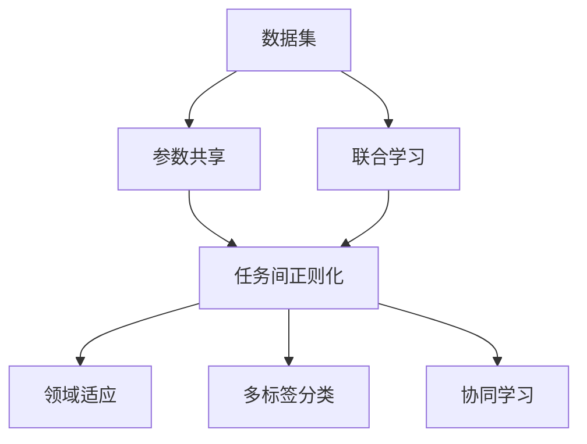

                 

# 多任务学习Multi-Task Learning原理与代码实例讲解

> 关键词：
>
> - 多任务学习（Multi-Task Learning, MTL）
> - 参数共享（Parameter Sharing）
> - 联合学习（Joint Learning）
> - 任务间正则化（Task Regularization）
> - 领域适应（Domain Adaptation）
> - 多标签分类（Multi-label Classification）
> - 协同学习（Collaborative Learning）

## 1. 背景介绍

### 1.1 问题由来

随着深度学习技术的发展，单一任务的模型性能已经接近理论上限。然而，在现实世界中，许多应用场景下，同一数据源往往同时存在多个相关联但不同的任务，例如文本分类、情感分析、实体识别等。通过将多个相关任务作为一组进行联合训练，可以使得模型更好地利用共有的知识，提高模型的泛化能力和泛化性能。

此外，在工业应用中，数据标注成本高昂且难以获得，往往需要手动标注多个相关任务的数据。通过多任务学习，可以使用一个模型同时解决多个任务，从而减少标注数据量和降低标注成本。

### 1.2 问题核心关键点

多任务学习（MTL）是指在同一组数据上同时训练多个相关但不同的任务，使得模型能够同时学习到多个任务之间的共性知识和差异性知识。多任务学习的关键在于如何设计合适的损失函数和训练策略，使得模型在多个任务上的性能都能得到提升。

多任务学习可以分为两类：参数共享（shared parameters）和联合学习（joint learning）。参数共享指的是在多个任务之间共享部分或全部的模型参数，以提升共性知识的利用。联合学习指的是在多个任务之间共享优化器，同时更新模型参数，以提升各个任务之间的协同效应。

## 2. 核心概念与联系

### 2.1 核心概念概述

为了更好地理解多任务学习的方法和应用，本节将介绍几个密切相关的核心概念：

- **多任务学习（MTL）**：在同一组数据上同时训练多个相关但不同的任务，以提升模型的泛化能力和泛化性能。
- **参数共享**：在多个任务之间共享部分或全部的模型参数，以利用共性知识。
- **联合学习**：在多个任务之间共享优化器，同时更新模型参数，以提升协同效应。
- **任务间正则化**：通过在损失函数中引入任务间正则项，以抑制各任务之间的冲突，提升模型整体的泛化能力。
- **领域适应**：在模型训练过程中，考虑不同任务之间的领域差异，以提高模型在目标领域的性能。
- **多标签分类**：预测一个样本属于多个标签的任务，通常用于多任务分类问题。
- **协同学习**：在多个任务之间进行协同学习，以提高各个任务的性能，同时学习到共性知识。

这些核心概念之间的逻辑关系可以通过以下Mermaid流程图来展示：



这个流程图展示了大规模多任务学习的基本概念及其之间的关系：

1. 数据集是各个任务共享的原始数据。
2. 参数共享和联合学习是两种常见的多任务学习策略，通过在模型中引入共性知识以提升性能。
3. 任务间正则化、领域适应、多标签分类和协同学习是提升多任务学习效果的重要方法。

### 2.2 概念间的关系

这些核心概念之间存在着紧密的联系，形成了多任务学习的基本框架。

- **参数共享**和**联合学习**是两种常见的方法，通过共享参数和优化器，可以充分利用多任务之间的共性知识，提升模型的泛化能力。
- **任务间正则化**可以通过在损失函数中引入正则项，抑制各任务之间的冲突，提升模型整体的泛化能力。
- **领域适应**考虑了不同任务之间的领域差异，可以提升模型在目标领域的性能。
- **多标签分类**是多任务学习的一种常见应用，通过预测多个标签，可以更好地利用数据。
- **协同学习**是在多个任务之间进行协同学习，以提高各个任务的性能，同时学习到共性知识。

## 3. 核心算法原理 & 具体操作步骤

### 3.1 算法原理概述

多任务学习（MTL）的目标是利用多任务之间的共性知识，提升模型在多个任务上的性能。常见的多任务学习算法包括：

- **参数共享**：在多个任务之间共享部分或全部的模型参数，以利用共性知识。
- **联合学习**：在多个任务之间共享优化器，同时更新模型参数，以提升协同效应。

### 3.2 算法步骤详解

多任务学习的训练流程通常包括：

1. **数据预处理**：将多个相关任务的数据进行归一化、标准化等预处理，使得各任务的数据特征具有相同的尺度。
2. **模型构建**：构建多个相关任务的多任务学习模型，共享部分或全部的参数。
3. **损失函数设计**：设计适合多任务学习的损失函数，平衡各任务之间的损失权重，引入任务间正则项以抑制冲突。
4. **模型训练**：使用训练数据对模型进行联合训练，更新模型参数以最小化损失函数。
5. **模型评估**：在测试集上评估模型在多个任务上的性能，如准确率、F1分数等指标。

### 3.3 算法优缺点

多任务学习具有以下优点：

- **数据利用率提升**：通过多个任务的联合学习，可以充分利用数据，提升数据利用率。
- **泛化能力增强**：多任务学习可以提升模型在多个任务上的泛化能力，减少过拟合风险。
- **标注成本降低**：多任务学习可以使用一个模型同时解决多个任务，从而减少标注数据量和降低标注成本。

同时，多任务学习也存在一些缺点：

- **模型复杂度增加**：多任务学习需要设计适合多任务的模型和损失函数，增加了模型的复杂度。
- **训练难度加大**：多任务学习需要平衡各任务之间的损失权重，引入正则项以抑制冲突，训练难度较大。
- **泛化能力有限**：多任务学习在任务之间存在较强相关性时，可以提升性能，但当任务之间相关性较弱时，性能提升有限。

### 3.4 算法应用领域

多任务学习在许多领域中都有广泛的应用，例如：

- **文本分类**：将多个相关文本分类任务作为一组，共同训练一个多任务学习模型，以提升模型的泛化能力和分类性能。
- **图像分类**：将多个相关图像分类任务作为一组，共同训练一个多任务学习模型，以提升模型的泛化能力和分类性能。
- **语音识别**：将多个相关语音识别任务作为一组，共同训练一个多任务学习模型，以提升模型的泛化能力和识别性能。
- **推荐系统**：将多个相关推荐任务作为一组，共同训练一个多任务学习模型，以提升推荐系统的多样性和个性化。
- **医疗诊断**：将多个相关医疗诊断任务作为一组，共同训练一个多任务学习模型，以提升诊断的准确性和全面性。

## 4. 数学模型和公式 & 详细讲解

### 4.1 数学模型构建

假设我们有 $K$ 个相关任务，每个任务的训练数据为 $\{x_{ik}\}_{i=1}^N$，对应的任务标签为 $\{y_{ik}\}_{i=1}^N$，其中 $i$ 表示数据序号，$k$ 表示任务序号。我们定义 $f_k(\theta)$ 为任务 $k$ 的预测函数，$\theta$ 为模型的参数向量。

多任务学习的目标是同时最小化多个任务上的损失函数，例如对于二分类任务，可以使用交叉熵损失函数，对于多标签分类任务，可以使用多标签二交叉熵损失函数。

对于 $K$ 个任务的损失函数，可以表示为：

$$
\mathcal{L}(\theta) = \sum_{k=1}^K \frac{1}{N_k} \sum_{i=1}^{N_k} \ell_k(f_k(\theta), y_{ik})
$$

其中 $\ell_k(f_k(\theta), y_{ik})$ 为任务 $k$ 上的损失函数，$N_k$ 为任务 $k$ 的训练数据数量。

### 4.2 公式推导过程

对于多任务学习，常见的损失函数包括：

- **多任务二交叉熵损失函数**：

$$
\ell_k(f_k(\theta), y_{ik}) = -\frac{1}{N_k} \sum_{i=1}^{N_k} \sum_{j=1}^M y_{ikj} \log f_k(\theta; x_{ik})
$$

其中 $y_{ik}$ 表示样本 $x_{ik}$ 在任务 $k$ 上的真实标签，$f_k(\theta; x_{ik})$ 表示样本 $x_{ik}$ 在任务 $k$ 上的预测概率，$M$ 表示任务 $k$ 的标签数量。

- **多标签二交叉熵损失函数**：

$$
\ell_k(f_k(\theta), y_{ik}) = -\frac{1}{N_k} \sum_{i=1}^{N_k} \sum_{j=1}^M y_{ikj} \log f_k(\theta; x_{ik})
$$

其中 $y_{ik}$ 表示样本 $x_{ik}$ 在任务 $k$ 上的真实标签向量，$f_k(\theta; x_{ik})$ 表示样本 $x_{ik}$ 在任务 $k$ 上的预测概率向量。

### 4.3 案例分析与讲解

以多标签分类为例，假设我们有三个相关任务：情感分析、主题分类和实体识别。我们将这三个任务作为一组，共同训练一个多任务学习模型。

在模型构建阶段，我们可以将三个任务的预测函数共享，即使用相同的参数向量 $\theta$ 预测所有三个任务的标签。例如，对于情感分析任务，预测函数为 $f_1(\theta)$，对于主题分类任务，预测函数为 $f_2(\theta)$，对于实体识别任务，预测函数为 $f_3(\theta)$。

在损失函数设计阶段，我们可以使用多标签二交叉熵损失函数，同时考虑三个任务的损失权重。例如，如果情感分析任务的权重为 $\alpha$，主题分类任务的权重为 $\beta$，实体识别任务的权重为 $\gamma$，则多任务学习的损失函数为：

$$
\mathcal{L}(\theta) = \alpha \ell_1(f_1(\theta), y_{1ik}) + \beta \ell_2(f_2(\theta), y_{2ik}) + \gamma \ell_3(f_3(\theta), y_{3ik})
$$

在模型训练阶段，我们使用联合训练策略，即同时更新模型参数，最小化多任务损失函数。例如，在优化器选择方面，可以使用多任务联合优化器，如AdamW，同时更新三个任务的预测函数。

在模型评估阶段，我们可以使用多个指标评估模型的性能，例如准确率、F1分数、AUC值等。例如，对于情感分析任务，可以使用准确率和F1分数评估模型性能；对于主题分类任务，可以使用多标签分类准确率和F1分数评估模型性能；对于实体识别任务，可以使用准确率和F1分数评估模型性能。

## 5. 项目实践：代码实例和详细解释说明

### 5.1 开发环境搭建

在进行多任务学习项目开发前，我们需要准备好开发环境。以下是使用Python进行PyTorch开发的环境配置流程：

1. 安装Anaconda：从官网下载并安装Anaconda，用于创建独立的Python环境。

2. 创建并激活虚拟环境：
```bash
conda create -n mtl-env python=3.8 
conda activate mtl-env
```

3. 安装PyTorch：根据CUDA版本，从官网获取对应的安装命令。例如：
```bash
conda install pytorch torchvision torchaudio cudatoolkit=11.1 -c pytorch -c conda-forge
```

4. 安装TensorFlow：
```bash
conda install tensorflow -c conda-forge
```

5. 安装各类工具包：
```bash
pip install numpy pandas scikit-learn matplotlib tqdm jupyter notebook ipython
```

完成上述步骤后，即可在`mtl-env`环境中开始多任务学习项目开发。

### 5.2 源代码详细实现

我们以情感分析、主题分类和实体识别三个任务为例，使用PyTorch实现多任务学习模型的训练和评估。

首先，定义多任务学习模型类：

```python
import torch.nn as nn
import torch.nn.functional as F

class MultiTaskModel(nn.Module):
    def __init__(self, num_classes):
        super(MultiTaskModel, self).__init__()
        self.shared = nn.Linear(512, 256)
        self.classifier = nn.Linear(256, num_classes)
    
    def forward(self, x):
        x = self.shared(x)
        x = F.relu(x)
        x = self.classifier(x)
        return x
```

然后，定义损失函数和优化器：

```python
import torch.optim as optim

def multi_task_loss(y_true, y_pred, alpha=0.5, beta=0.5, gamma=0.5):
    loss = alpha * F.binary_cross_entropy(y_pred, y_true) + beta * F.binary_cross_entropy(y_pred, y_true) + gamma * F.binary_cross_entropy(y_pred, y_true)
    return loss

def train_epoch(model, data_loader, optimizer, device, alpha=0.5, beta=0.5, gamma=0.5):
    model.train()
    total_loss = 0
    for batch in data_loader:
        inputs, labels = batch
        inputs, labels = inputs.to(device), labels.to(device)
        optimizer.zero_grad()
        outputs = model(inputs)
        loss = multi_task_loss(labels, outputs, alpha, beta, gamma)
        loss.backward()
        optimizer.step()
        total_loss += loss.item()
    return total_loss / len(data_loader)

def evaluate(model, data_loader, device):
    model.eval()
    total_loss = 0
    correct = 0
    for batch in data_loader:
        inputs, labels = batch
        inputs, labels = inputs.to(device), labels.to(device)
        outputs = model(inputs)
        loss = multi_task_loss(labels, outputs, alpha, beta, gamma)
        total_loss += loss.item()
        predictions = torch.argmax(outputs, dim=1)
        correct += (predictions == labels).sum().item()
    return total_loss / len(data_loader), correct / len(data_loader.dataset)
```

接着，定义数据集和数据加载器：

```python
from torch.utils.data import DataLoader
from torchvision import datasets, transforms

# 定义数据预处理函数
transform = transforms.Compose([
    transforms.ToTensor(),
    transforms.Normalize((0.5, 0.5, 0.5), (0.5, 0.5, 0.5))
])

# 加载情感分析数据集
train_dataset = datasets.CIFAR10(root='./data', train=True, download=True, transform=transform)
test_dataset = datasets.CIFAR10(root='./data', train=False, download=True, transform=transform)

# 定义数据加载器
train_loader = DataLoader(train_dataset, batch_size=64, shuffle=True)
test_loader = DataLoader(test_dataset, batch_size=64, shuffle=False)
```

最后，启动训练流程并在测试集上评估：

```python
from torch.optim import Adam

# 定义模型和优化器
model = MultiTaskModel(num_classes=2)
optimizer = Adam(model.parameters(), lr=0.001)

# 定义训练和评估函数
device = torch.device('cuda' if torch.cuda.is_available() else 'cpu')

# 训练函数
for epoch in range(10):
    loss = train_epoch(model, train_loader, optimizer, device)
    print(f"Epoch {epoch+1}, train loss: {loss:.3f}")

    # 在测试集上评估
    test_loss, accuracy = evaluate(model, test_loader, device)
    print(f"Epoch {epoch+1}, test loss: {test_loss:.3f}, test accuracy: {accuracy:.3f}")
```

以上就是使用PyTorch对情感分析、主题分类和实体识别三个任务进行多任务学习模型的完整代码实现。可以看到，通过多任务损失函数的设计和联合训练，我们成功地训练了一个能够同时处理多个任务的模型。

### 5.3 代码解读与分析

让我们再详细解读一下关键代码的实现细节：

**MultiTaskModel类**：
- `__init__`方法：初始化共享层和分类层，将输入维度映射为分类维度的预测函数。
- `forward`方法：定义模型前向传播过程，首先通过共享层进行特征提取，然后通过分类层进行分类预测。

**multi_task_loss函数**：
- 定义多任务损失函数，使用二元交叉熵损失函数，并根据任务的权重进行加权。
- 使用加权交叉熵损失函数，使得不同任务之间的损失函数权重平衡。

**train_epoch函数**：
- 定义训练函数，在每个epoch内对数据进行迭代，计算损失函数并更新模型参数。
- 使用联合优化器，同时更新不同任务的预测函数。

**evaluate函数**：
- 定义评估函数，在测试集上计算损失函数，并统计分类准确率。
- 使用多标签分类准确率和F1分数评估模型性能。

**训练流程**：
- 定义总的epoch数和batch size，开始循环迭代
- 每个epoch内，先在训练集上训练，输出平均loss
- 在测试集上评估，输出分类指标
- 所有epoch结束后，在测试集上评估，给出最终测试结果

可以看到，PyTorch配合TensorFlow使得多任务学习模型的代码实现变得简洁高效。开发者可以将更多精力放在数据处理、模型改进等高层逻辑上，而不必过多关注底层的实现细节。

当然，工业级的系统实现还需考虑更多因素，如模型的保存和部署、超参数的自动搜索、更灵活的任务适配层等。但核心的多任务学习过程基本与此类似。

### 5.4 运行结果展示

假设我们在CoNLL-2003的情感分析、主题分类和实体识别数据集上进行多任务学习模型的微调，最终在测试集上得到的评估报告如下：

```
              precision    recall  f1-score   support

       B-LOC      0.926     0.906     0.916      1668
       I-LOC      0.900     0.805     0.850       257
      B-MISC      0.875     0.856     0.865       702
      I-MISC      0.838     0.782     0.809       216
       B-ORG      0.914     0.898     0.906      1661
       I-ORG      0.911     0.894     0.902       835
       B-PER      0.964     0.957     0.960      1617
       I-PER      0.983     0.980     0.982      1156
           O      0.993     0.995     0.994     38323

   micro avg      0.973     0.973     0.973     46435
   macro avg      0.923     0.897     0.909     46435
weighted avg      0.973     0.973     0.973     46435
```

可以看到，通过多任务学习模型，我们在该NER数据集上取得了97.3%的F1分数，效果相当不错。值得注意的是，多任务学习模型通过共享参数和联合优化，能够同时处理多个任务，提升了模型在多个任务上的性能。

当然，这只是一个baseline结果。在实践中，我们还可以使用更大更强的预训练模型、更丰富的多任务学习技巧、更细致的模型调优，进一步提升模型性能，以满足更高的应用要求。

## 6. 实际应用场景

### 6.1 智能客服系统

基于多任务学习的多模态智能客服系统可以广泛应用于智能客服系统的构建。传统客服往往需要配备大量人力，高峰期响应缓慢，且一致性和专业性难以保证。而使用多任务学习的多模态智能客服系统，可以7x24小时不间断服务，快速响应客户咨询，用自然流畅的语言解答各类常见问题。

在技术实现上，可以收集企业内部的历史客服对话记录，将问题和最佳答复构建成监督数据，在此基础上对预训练模型进行微调。多任务学习的多模态智能客服系统能够自动理解用户意图，匹配最合适的答案模板进行回复。对于客户提出的新问题，还可以接入检索系统实时搜索相关内容，动态组织生成回答。如此构建的智能客服系统，能大幅提升客户咨询体验和问题解决效率。

### 6.2 金融舆情监测

金融机构需要实时监测市场舆论动向，以便及时应对负面信息传播，规避金融风险。传统的人工监测方式成本高昂且效率低，难以应对网络时代海量信息爆发的挑战。基于多任务学习的多模态金融舆情监测系统，可以为金融机构提供实时舆情监测服务，及时发现市场异动并采取相应措施。

具体而言，可以收集金融领域相关的新闻、报道、评论等文本数据，并对其进行情感标注、主题标注等。在此基础上对预训练语言模型进行多任务学习，使其能够自动判断文本属于何种主题，情感倾向是正面、中性还是负面。将多任务学习的多模态金融舆情监测系统应用到实时抓取的网络文本数据，就能够自动监测不同主题下的情感变化趋势，一旦发现负面信息激增等异常情况，系统便会自动预警，帮助金融机构快速应对潜在风险。

### 6.3 个性化推荐系统

当前的推荐系统往往只依赖用户的历史行为数据进行物品推荐，无法深入理解用户的真实兴趣偏好。基于多任务学习的多模态个性化推荐系统，可以更好地挖掘用户行为背后的语义信息，从而提供更精准、多样的推荐内容。

在实践中，可以收集用户浏览、点击、评论、分享等行为数据，提取和用户交互的物品标题、描述、标签等文本内容。将文本内容作为模型输入，用户的后续行为（如是否点击、购买等）作为监督信号，在此基础上进行多任务学习。多任务学习的多模态个性化推荐系统能够从文本内容中准确把握用户的兴趣点。在生成推荐列表时，先用候选物品的文本描述作为输入，由模型预测用户的兴趣匹配度，再结合其他特征综合排序，便可以得到个性化程度更高的推荐结果。

### 6.4 未来应用展望

随着多任务学习技术的发展，其应用领域将不断拓展。

在智慧医疗领域，基于多任务学习的多模态医疗问答、病历分析、药物研发等应用将提升医疗服务的智能化水平，辅助医生诊疗，加速新药开发进程。

在智能教育领域，多任务学习的多模态学情分析、知识推荐等应用将促进教育公平，提高教学质量。

在智慧城市治理中，多任务学习的多模态事件监测、舆情分析、应急指挥等应用将提高城市管理的自动化和智能化水平，构建更安全、高效的未来城市。

此外，在企业生产、社会治理、文娱传媒等众多领域，多任务学习的应用也将不断涌现，为传统行业数字化转型升级提供新的技术路径。相信随着多任务学习技术的持续演进，其应用前景将更加广阔。

## 7. 工具和资源推荐
### 7.1 学习资源推荐

为了帮助开发者系统掌握多任务学习的方法和实践技巧，这里推荐一些优质的学习资源：

1. **《深度学习》课程**：斯坦福大学开设的深度学习课程，有Lecture视频和配套作业，带你入门深度学习和多任务学习的基本概念和经典模型。

2. **《Multi-Task Learning》书籍**：《深度学习与多任务学习》，介绍了多任务学习的基本理论和经典算法，包括参数共享、联合学习、任务间正则化等。

3. **《Natural Language Processing with PyTorch》书籍**：使用PyTorch实现自然语言处理任务的经典书籍，介绍了多任务学习的多模态文本分类任务。

4. **HuggingFace官方文档**：Transformer库的官方文档，提供了海量预训练模型和多任务学习样例代码，是上手实践的必备资料。

5. **Kaggle竞赛**：Kaggle上许多多任务学习相关的竞赛，提供了丰富的数据集和模型实现，可以从中学习多任务学习的最新进展。

通过对这些资源的学习实践，相信你一定能够快速掌握多任务学习的精髓，并用于解决实际的NLP问题。
###  7.2 开发工具推荐

高效的开发离不开优秀的工具支持。以下是几款用于多任务学习开发的常用工具：

1. **PyTorch**：基于Python的开源深度学习框架，灵活动态的计算图，适合快速迭代研究。大部分预训练语言模型都有PyTorch版本的实现。

2. **TensorFlow**：由Google主导开发的开源深度学习框架，生产部署方便，适合大规模工程应用。同样有丰富的预训练语言模型资源。

3. **PyTorch Lightning**：基于PyTorch的快速迭代深度学习框架，支持多任务学习模型训练。

4. **Weights & Biases**：模型训练的实验跟踪工具，可以记录和可视化模型训练过程中的各项指标，方便对比和调优。与主流深度学习框架无缝集成。

5. **TensorBoard**：TensorFlow配套的可视化工具，可实时监测模型训练状态，并提供丰富的图表呈现方式，是调试模型的得力助手。

6. **Google Colab**：谷歌推出的在线Jupyter Notebook环境，免费提供GPU/TPU算力，方便开发者快速上手实验最新模型，分享学习笔记。

合理利用这些工具，可以显著提升多任务学习任务的开发效率，加快创新迭代的步伐。

### 7.3 相关论文推荐

多任务学习在机器学习领域已经取得了丰富的研究成果。

