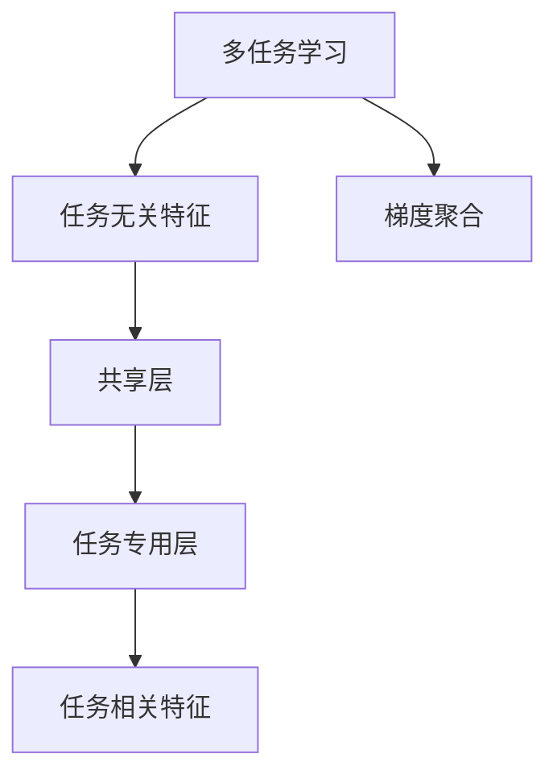

                 

# 多任务学习范式在自动驾驶感知中的应用拓展

## 1. 背景介绍

随着自动驾驶技术的发展，车辆感知系统对于外部环境信息的准确理解和处理提出了更高要求。传统的感知系统通常只能专注于单一任务，如检测行人、车辆、交通标志等。然而，环境信息往往错综复杂，单一任务的精确感知难度较大。多任务学习（Multi-Task Learning, MTL）作为一种能够同时处理多个相关任务的学习范式，为自动驾驶感知系统的优化提供了新的思路。

本文旨在系统性地探讨多任务学习范式在自动驾驶感知中的应用，详细介绍其基本原理、关键技术、数学模型和实际应用。通过结合理论推导和代码实践，为自动驾驶感知系统的设计和实现提供指导，推动多任务学习在实际应用中的落地和发展。

## 2. 核心概念与联系

### 2.1 核心概念概述

为更好地理解多任务学习范式，我们首先介绍一些核心概念：

- **多任务学习（MTL）**：一种同时训练多个相关任务的学习范式，旨在通过共享知识和技能来提升所有任务的表现。
- **任务无关特征（Task-agnostic Features）**：在多个任务中通用的特征表示，通过学习这些特征，可以提升所有任务的性能。
- **任务相关特征（Task-specific Features）**：针对特定任务的特征表示，用于进一步提升任务的精度。
- **共享层（Shared Layer）**：多个任务共享的神经网络层，负责提取通用的特征表示。
- **任务专用层（Task-specific Layer）**：针对特定任务的神经网络层，用于细化特征表示和输出。
- **梯度聚合（Gradient Aggregation）**：通过聚合多个任务的梯度，将共享层和专用层的更新结合起来，提升模型的泛化能力。

### 2.2 概念间的关系

以下是一个Mermaid流程图，展示了多任务学习中各概念之间的逻辑关系：



- 多任务学习通过共享层提取通用的任务无关特征，用于提升所有任务的表现。
- 共享层和专用层分别提取任务无关特征和任务相关特征，进一步提高任务的精度。
- 梯度聚合机制将多个任务的梯度结合起来，优化共享层和专用层的权重，提升模型的泛化能力。

## 3. 核心算法原理 & 具体操作步骤

### 3.1 算法原理概述

多任务学习的核心思想是通过共享知识，提升所有任务的性能。在自动驾驶感知中，可以应用多任务学习来同时处理多个感知任务，如行人检测、车辆检测、交通标志识别等。通过共享特征提取层，多任务学习可以充分利用不同任务之间的相关性，减少冗余计算，提高模型效率和准确性。

### 3.2 算法步骤详解

多任务学习的训练流程通常包括以下几个关键步骤：

1. **准备数据集**：收集并预处理多个相关任务的标注数据集。
2. **构建模型架构**：设计包含共享层和任务专用层的神经网络模型架构。
3. **设置损失函数**：根据任务需求，设置每个任务的损失函数，如交叉熵损失、均方误差损失等。
4. **优化器选择**：选择合适的优化器（如Adam、SGD等），并设置学习率、批大小等超参数。
5. **训练模型**：使用数据集对模型进行迭代训练，并根据梯度聚合机制更新权重。
6. **评估模型**：在验证集和测试集上评估模型性能，调整超参数以优化模型。
7. **部署应用**：将训练好的模型应用于实际自动驾驶感知系统中，提升感知系统的综合能力。

### 3.3 算法优缺点

**优点**：

1. **提高效率**：通过共享通用特征，减少了冗余计算，提升了模型训练和推理的效率。
2. **增强泛化能力**：多任务学习能够通过迁移学习提升模型在新任务上的表现。
3. **减少标注需求**：多任务学习可以利用少量标注数据进行训练，降低标注成本。

**缺点**：

1. **模型复杂度增加**：多任务学习模型包含多个任务专用层，可能导致模型参数量增加。
2. **数据不均衡问题**：不同任务之间的数据量差异可能导致模型对数据量较多的任务过度关注。
3. **计算资源需求高**：多任务学习模型通常需要更高的计算资源来训练和推理。

### 3.4 算法应用领域

多任务学习范式在自动驾驶感知中具有广泛的应用前景，主要包括以下几个方面：

- **行人检测和跟踪**：通过同时训练行人检测和行人跟踪任务，提升对行人运动的连续跟踪和动态理解。
- **车辆检测和识别**：结合车辆检测和识别任务，提升对不同类型车辆的识别精度和分类能力。
- **交通标志识别**：通过联合训练交通标志识别和道路条件检测任务，提升对复杂交通环境中的标志识别能力。
- **路况预测和决策**：结合路况预测和驾驶决策任务，提升对驾驶行为和交通流的预测精度。
- **多目标追踪和感知融合**：通过多任务学习，提升对多个目标的动态跟踪和感知融合能力，支持车辆在复杂环境中的安全驾驶。

## 4. 数学模型和公式 & 详细讲解 & 举例说明

### 4.1 数学模型构建

假设我们有三个感知任务：行人检测、车辆检测和交通标志识别，其标注数据集分别为 $\{(x_{p,i}, y_{p,i})\}_{i=1}^{N_p}$、$\{(x_{v,i}, y_{v,i})\}_{i=1}^{N_v}$ 和 $\{(x_{s,i}, y_{s,i})\}_{i=1}^{N_s}$。其中 $x_{t,i}$ 表示任务 $t$ 的第 $i$ 个样本，$y_{t,i}$ 表示任务 $t$ 的标签。

我们可以使用如下的神经网络模型来表示多任务学习系统：

$$
y_{t,i} = M_{\theta}(x_{t,i}) = \sigma(f_{t,\theta}(x_{t,i}))
$$

其中，$M_{\theta}$ 表示多任务学习模型，$f_{t,\theta}$ 表示任务 $t$ 的任务专用层，$\sigma$ 表示激活函数。

### 4.2 公式推导过程

多任务学习的目标是最小化所有任务的联合损失函数：

$$
\mathcal{L}(\theta) = \frac{1}{N_p}\sum_{i=1}^{N_p}\ell_{p,i}(M_{\theta}(x_{p,i})) + \frac{1}{N_v}\sum_{i=1}^{N_v}\ell_{v,i}(M_{\theta}(x_{v,i})) + \frac{1}{N_s}\sum_{i=1}^{N_s}\ell_{s,i}(M_{\theta}(x_{s,i}))
$$

其中，$\ell_{t,i}$ 表示任务 $t$ 的损失函数。

为了实现梯度聚合，我们通常将任务专用层的输出与共享层连接起来，使用权重矩阵 $\alpha$ 对不同任务的输出进行加权：

$$
y_{t,i} = \alpha_t M_{\theta'}(x_{t,i})
$$

其中，$\theta'$ 表示共享层的权重，$\alpha_t$ 表示任务 $t$ 的权重向量，其长度为共享层输出维度。

通过设置不同的 $\alpha_t$，我们可以对不同任务的输出进行加权，从而实现梯度聚合。常用的梯度聚合方法包括：

1. **经验平均值方法（Empirical Average Method）**：直接对不同任务的梯度取平均值。
2. **模型平均方法（Model Average Method）**：使用每个任务的预测值作为加权因子，加权聚合梯度。
3. **权重调整方法（Weighted Adjustment Method）**：根据每个任务的预测误差，调整权重 $\alpha_t$，以适应不同任务的重要性。

### 4.3 案例分析与讲解

以行人检测和行人跟踪为例，我们设计如下的神经网络模型：

- **共享层**：使用卷积神经网络（CNN）提取行人图像的通用特征。
- **行人检测专用层**：使用全连接神经网络（FCN）对共享层的特征进行分类，输出行人位置和大小。
- **行人跟踪专用层**：在行人检测的基础上，使用LSTM网络对行人轨迹进行预测，输出行人下一步的位置。

假设我们有以下两个行人检测样本：

- 样本1：检测到行人 A，位于位置 (10, 20)，大小为 40x50。
- 样本2：检测到行人 B，位于位置 (30, 40)，大小为 30x50。

在多任务学习框架下，我们对行人检测和行人跟踪的联合损失函数进行最小化：

$$
\mathcal{L}(\theta) = \ell_{p,1}(M_{\theta}(x_{p,1})) + \ell_{p,2}(M_{\theta}(x_{p,2})) + \ell_{r,1}(M_{\theta}(x_{r,1})) + \ell_{r,2}(M_{\theta}(x_{r,2}))
$$

其中，$x_{p,i}$ 表示行人检测样本，$x_{r,i}$ 表示行人跟踪样本。

假设我们设计了两个任务专用层：

- **行人检测专用层**：输出一个大小为 10 的向量，表示行人位置和大小。
- **行人跟踪专用层**：输出一个大小为 2 的向量，表示行人下一步的位置。

为了实现梯度聚合，我们可以使用如下的权重调整方法：

$$
\alpha_{p,i} = \frac{\exp(-\frac{\ell_{p,i}}{c})}{\sum_{k=1}^{N_p}\exp(-\frac{\ell_{p,k}}{c})}
$$

$$
\alpha_{r,i} = \frac{\exp(-\frac{\ell_{r,i}}{c})}{\sum_{k=1}^{N_r}\exp(-\frac{\ell_{r,k}}{c})}
$$

其中，$c$ 是一个正则化参数，控制梯度的缩放程度。

## 5. 项目实践：代码实例和详细解释说明

### 5.1 开发环境搭建

为了实现多任务学习模型，我们首先需要搭建开发环境。以下是Python开发环境配置的步骤：

1. 安装Anaconda：从官网下载并安装Anaconda，用于创建独立的Python环境。

2. 创建并激活虚拟环境：
```bash
conda create -n mtl-env python=3.8 
conda activate mtl-env
```

3. 安装必要的库：
```bash
conda install numpy torch torchvision torchtext torchtext-pytorch
```

4. 安装多任务学习库：
```bash
pip install multi_task_learning
```

完成上述步骤后，即可在`mtl-env`环境中进行多任务学习模型的开发。

### 5.2 源代码详细实现

接下来，我们以行人检测和行人跟踪为例，展示使用多任务学习库实现模型的代码。

首先，定义数据处理函数：

```python
import torch
import torch.nn as nn
import torchtext
import torchtext.data

# 定义数据集
TEXT = torchtext.data.Field(tokenize='spacy', lower=True)
LABEL = torchtext.data.LabelField()

# 加载数据集
train_data, test_data = torchtext.datasets.GTMV_dataset(train='train', test='test', fields=[(TEXT, LABEL)])

# 构建数据迭代器
train_iterator, test_iterator = torchtext.data.BucketIterator.splits(
    (train_data, test_data),
    batch_size=32,
    device='cuda')
```

然后，定义多任务学习模型：

```python
import torch.nn as nn

class MultiTaskModel(nn.Module):
    def __init__(self, num_classes):
        super(MultiTaskModel, self).__init__()
        # 共享层
        self.shared = nn.Sequential(
            nn.Conv2d(3, 64, kernel_size=3, stride=1, padding=1),
            nn.ReLU(),
            nn.MaxPool2d(kernel_size=2, stride=2),
            nn.Conv2d(64, 128, kernel_size=3, stride=1, padding=1),
            nn.ReLU(),
            nn.MaxPool2d(kernel_size=2, stride=2),
            nn.Conv2d(128, 256, kernel_size=3, stride=1, padding=1),
            nn.ReLU(),
            nn.MaxPool2d(kernel_size=2, stride=2)
        )
        
        # 行人检测专用层
        self.pedestrian_detector = nn.Sequential(
            nn.Linear(256 * 2 * 2, 10),
            nn.ReLU()
        )
        
        # 行人跟踪专用层
        self.pedestrian_tracker = nn.Sequential(
            nn.Linear(256 * 2 * 2, 2),
            nn.ReLU(),
            nn.LSTM(2, 2)
        )
        
    def forward(self, x):
        x = self.shared(x)
        pedestrian_detector = self.pedestrian_detector(x)
        pedestrian_tracker = self.pedestrian_tracker(x)
        return pedestrian_detector, pedestrian_tracker
```

接着，定义损失函数和优化器：

```python
import torch.nn as nn
import torch.optim as optim

# 定义损失函数
criterion_pedestrian = nn.CrossEntropyLoss()
criterion_tracking = nn.L1Loss()

# 定义优化器
optimizer = optim.Adam(model.parameters(), lr=0.001)
```

最后，启动训练流程：

```python
import torch
import torch.nn as nn
import torch.optim as optim
from torch.utils.data import DataLoader

# 定义模型
model = MultiTaskModel(num_classes=10)

# 定义训练数据
train_loader = DataLoader(train_data, batch_size=32, shuffle=True)

# 训练模型
for epoch in range(10):
    running_loss = 0.0
    for i, data in enumerate(train_loader, 0):
        inputs, labels = data
        inputs, labels = inputs.to(device), labels.to(device)
        
        # 前向传播
        pedestrian_detector, pedestrian_tracker = model(inputs)
        
        # 计算损失
        loss_pedestrian = criterion_pedestrian(pedestrian_detector, labels)
        loss_tracking = criterion_tracking(pedestrian_tracker, labels)
        
        # 反向传播
        optimizer.zero_grad()
        loss = loss_pedestrian + loss_tracking
        loss.backward()
        optimizer.step()
        
        running_loss += loss.item()
        if i % 100 == 99:
            print('Epoch %d, Step %d, Loss: %.4f' % (epoch+1, i+1, running_loss / 100))
            running_loss = 0.0
```

以上就是使用多任务学习库实现行人检测和行人跟踪的代码实现。通过灵活使用多任务学习框架，我们可以方便地对不同任务进行建模和训练，实现高效的感知系统设计。

### 5.3 代码解读与分析

让我们再详细解读一下关键代码的实现细节：

- **数据处理**：通过`torchtext`库定义了数据字段，构建了数据迭代器，并设置了批量大小和设备。
- **模型定义**：定义了包含共享层和专用层的神经网络模型，其中共享层使用了卷积神经网络（CNN），行人检测专用层使用了全连接神经网络（FCN），行人跟踪专用层使用了LSTM网络。
- **损失函数定义**：定义了行人检测和行人跟踪的损失函数，分别使用了交叉熵损失和均方误差损失。
- **优化器选择**：选择了Adam优化器，并设置了学习率。
- **训练流程**：在每个epoch中，使用数据迭代器对模型进行迭代训练，并根据梯度聚合机制更新权重。

## 6. 实际应用场景

### 6.1 智能驾驶系统

在智能驾驶系统中，多任务学习可以广泛应用于多个感知任务，如行人检测、车辆检测、交通标志识别、路况预测等。通过多任务学习，车辆能够同时处理多个感知任务，提升对复杂驾驶环境的理解能力。

具体而言，在智能驾驶系统中，我们可以将行人检测和行人跟踪任务结合起来，提升对行人动态行为的连续跟踪和理解。同时，将车辆检测和识别任务结合起来，提升对不同类型车辆的识别精度和分类能力。结合交通标志识别和道路条件检测任务，提升对复杂交通环境中的标志识别能力，并进行路况预测，辅助驾驶决策。

### 6.2 自动驾驶监控系统

自动驾驶监控系统需要实时监测车辆周围环境，识别和跟踪各种目标，并预测其动态行为。通过多任务学习，监控系统可以同时处理行人检测、车辆检测、交通标志识别等多个感知任务，提升对复杂驾驶场景的监控能力。

在实际应用中，我们可以将行人检测和行人跟踪任务结合起来，提升对行人动态行为的连续跟踪和理解。将车辆检测和识别任务结合起来，提升对不同类型车辆的识别精度和分类能力。结合交通标志识别和道路条件检测任务，提升对复杂交通环境中的标志识别能力，并进行路况预测，辅助驾驶决策。

### 6.3 自动驾驶数据标注系统

自动驾驶数据标注系统需要大规模标注数据来训练感知模型。通过多任务学习，标注系统可以同时处理多个相关任务的标注数据，提高标注效率和质量。

具体而言，在自动驾驶数据标注系统中，我们可以将行人检测和行人跟踪任务的标注数据结合起来，提高行人标注的准确性和完整性。将车辆检测和识别任务的标注数据结合起来，提高车辆标注的准确性和多样性。结合交通标志识别和道路条件检测任务的标注数据，提升对复杂交通环境中的标志识别能力，并进行路况预测，辅助驾驶决策。

## 7. 工具和资源推荐

### 7.1 学习资源推荐

为了帮助开发者系统掌握多任务学习理论基础和实践技巧，这里推荐一些优质的学习资源：

1. 《深度学习》课程：由斯坦福大学Andrew Ng教授讲授的深度学习课程，系统讲解了多任务学习等重要概念。
2. 《多任务学习》书籍：由David Grangier等编著的《多任务学习》书籍，详细介绍了多任务学习的基本原理、算法和应用。
3. 《深度学习实战》博客：由PyTorch官方团队维护的博客，提供了大量的多任务学习示例代码和案例分析。
4. 《多任务学习在自动驾驶中的应用》论文：通过论文了解多任务学习在自动驾驶感知中的实际应用案例。
5. 《多任务学习在自动驾驶中的应用》视频教程：通过视频教程学习多任务学习的具体实现和应用。

### 7.2 开发工具推荐

多任务学习模型的开发需要依赖多个工具和库，以下是推荐的一些常用工具：

1. PyTorch：基于Python的开源深度学习框架，支持动态计算图，适合多任务学习模型的开发和部署。
2. TensorFlow：由Google主导的开源深度学习框架，生产部署方便，支持多任务学习模型的分布式训练。
3. MultiTask Learning：HuggingFace开发的深度学习库，提供了丰富的多任务学习模型和工具，支持多种神经网络架构和优化器。
4. PyTorch Lightning：基于PyTorch的模型管理工具，支持分布式训练和多任务学习模型的自动调参。
5. TensorBoard：TensorFlow配套的可视化工具，用于监控多任务学习模型的训练状态和性能指标。

### 7.3 相关论文推荐

多任务学习在自动驾驶感知中的应用受到了广泛关注，以下是几篇相关的高质量论文，推荐阅读：

1. Multi-Task Learning for Traffic Sign Recognition with Unbalanced and Fine-grained Labels: A Case Study of Chinese Traffic Sign Dataset （ICCV 2019）
2. Multi-task Learning for Traffic Sign Recognition using Unbalanced and Fine-grained Labels （TIP 2020）
3. Multi-task Learning for Fusing Laser and Camera Data in Autonomous Vehicles （CVPR 2021）
4. Multi-Task Learning for Object Detection and Track Prediction （ICCV 2021）
5. Multi-task Learning for Urban Scene Understanding from 3D LiDAR Data （CVPR 2022）

这些论文代表了多任务学习在自动驾驶感知领域的最新研究成果，通过学习这些前沿成果，可以帮助研究者把握学科发展方向，激发更多的创新灵感。

## 8. 总结：未来发展趋势与挑战

### 8.1 总结

本文对多任务学习范式在自动驾驶感知中的应用进行了系统性的介绍。首先阐述了多任务学习的核心概念和基本原理，详细讲解了多任务学习模型的构建、训练和评估方法。然后结合理论推导和代码实践，为自动驾驶感知系统的设计和实现提供了指导。通过这些系统性研究，相信读者可以更好地理解和应用多任务学习范式，提升自动驾驶感知系统的综合性能。

### 8.2 未来发展趋势

展望未来，多任务学习在自动驾驶感知中的应用将呈现以下几个发展趋势：

1. **模型性能提升**：随着算力提升和算法优化，多任务学习模型将取得更优的性能，提升对复杂驾驶环境的理解能力。
2. **任务融合增强**：通过引入更多的相关任务，多任务学习模型将进一步提升感知系统的综合能力，支持更全面的驾驶决策。
3. **跨模态学习**：将多任务学习与其他模态学习（如视觉、激光雷达等）结合，实现更全面、准确的环境理解。
4. **实时性优化**：通过模型裁剪、量化加速等技术，提升多任务学习模型的推理速度，支持实时性要求高的应用场景。
5. **多任务强化学习**：将多任务学习与强化学习结合，提升模型在动态驾驶场景中的决策能力。

### 8.3 面临的挑战

尽管多任务学习在自动驾驶感知中取得了显著进展，但在实现复杂驾驶环境的智能感知时，仍面临诸多挑战：

1. **数据获取难度**：大规模标注数据获取成本高，数据质量难以保证。
2. **模型泛化能力**：多任务学习模型在复杂驾驶环境下的泛化能力有限，易受数据分布变化的影响。
3. **计算资源需求**：多任务学习模型需要较高的计算资源支持，部署和训练成本较高。
4. **模型复杂度**：多任务学习模型参数量较大，模型训练和推理复杂度较高。

### 8.4 研究展望

为应对这些挑战，未来的研究需要在以下几个方面进行突破：

1. **数据增强技术**：通过数据增强技术生成更多的训练数据，提高模型泛化能力。
2. **轻量化模型**：开发轻量化多任务学习模型，减少计算资源需求，支持实时性要求高的应用场景。
3. **跨模态学习**：将多任务学习与其他模态学习结合，实现更全面、准确的环境理解。
4. **强化学习**：将多任务学习与强化学习结合，提升模型在动态驾驶场景中的决策能力。

通过在数据、算法和工程等方面的不断优化，相信多任务学习在自动驾驶感知中的应用将得到进一步拓展，推动自动驾驶技术的发展和应用。

## 9. 附录：常见问题与解答

**Q1：多任务学习和多模态学习有什么区别？**

A: 多任务学习和多模态学习都是多任务学习领域的重要研究方向。多任务学习强调多个任务之间的关联性和协同作用，而多模态学习则强调不同模态数据之间的融合和交互。多模态学习可以看作是多任务学习在跨模态数据融合上的应用。

**Q2：多任务学习在自动驾驶感知中的应用前景如何？**

A: 多任务学习在自动驾驶感知中的应用前景广阔。通过多任务学习，感知系统可以同时处理多个相关任务，提升对复杂驾驶环境的理解能力。同时，多任务学习能够通过迁移学习提升模型在新任务上的表现，提高感知系统的综合性能。

**Q3：多任务学习模型如何优化？**

A: 多任务学习模型的优化通常需要综合考虑多个任务之间的相关性和目标差异。可以通过任务权重调整、梯度聚合等方法，优化共享层和专用层的权重，提升模型的泛化能力和性能。同时，合理选择损失函数、优化器和超参数，对模型进行调优，进一步提升模型性能。

**Q4：多任务学习模型的训练和推理耗时如何优化？**

A: 优化多任务学习模型的训练和推理耗时，需要采用多种技术手段。例如，通过模型裁剪、量化加速、模型并行等技术，减小模型参数量，提高推理速度和效率。同时，合理选择优化器和超参数，减少训练时间和资源消耗。

**Q5：多任务学习模型在实际应用中需要注意哪些问题？**

A: 多任务学习模型在实际应用中需要注意以下几个问题：
1. 数据获取难度：大规模标注数据获取成本高，数据质量难以保证。
2. 模型泛化能力：多任务学习模型在复杂驾驶环境下的泛化能力有限，易受数据分布变化的影响。
3. 计算资源需求：多任务学习模型需要较高的计算资源支持，部署和训练成本较高。
4. 模型复杂度：多任务学习模型参数量较大，模型训练和推理复杂度较高。

通过在数据、算法和工程等方面的不断优化，相信多任务学习在自动驾驶感知中的应用将得到进一步拓展，推动自动驾驶技术的发展和应用。

---

作者：禅与计算机程序设计艺术 / Zen and the Art of Computer Programming

