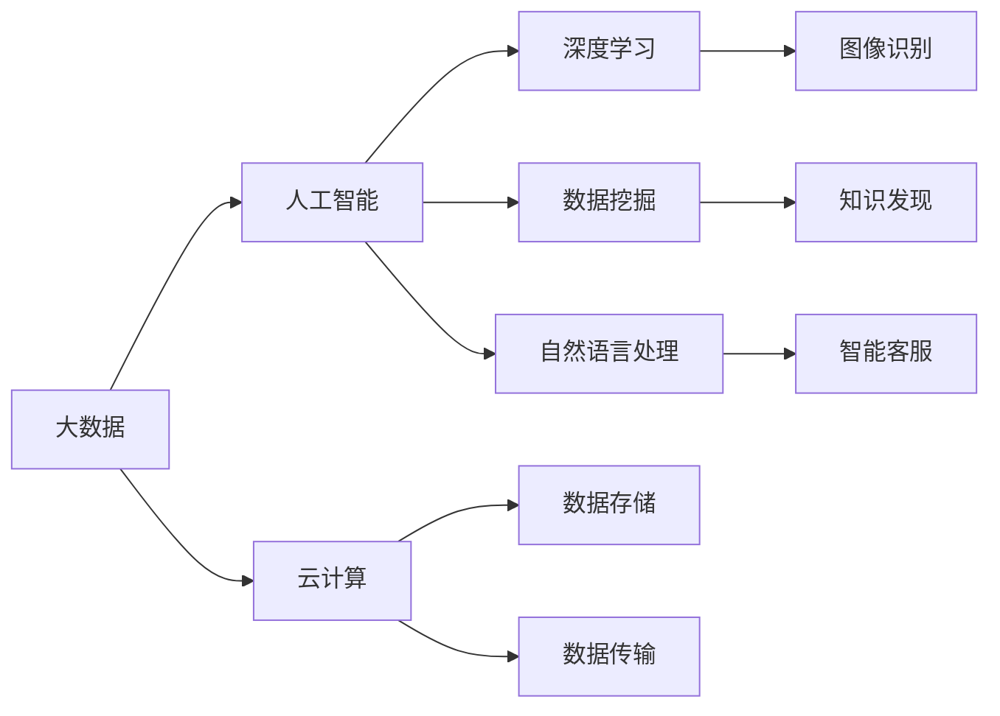
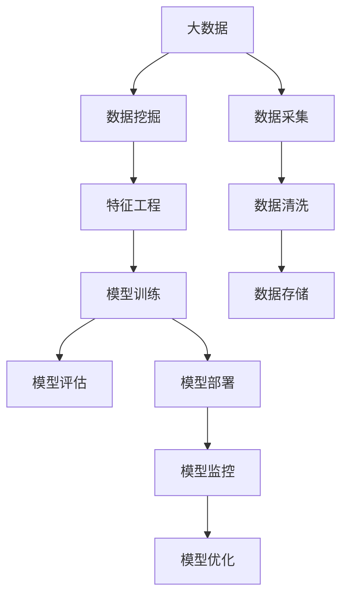
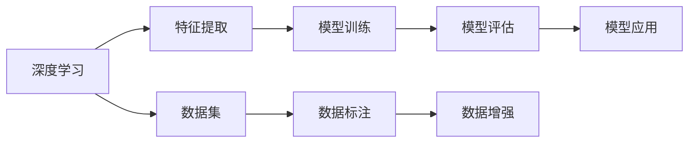
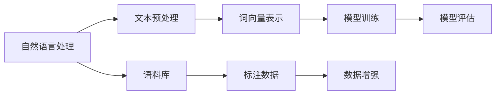
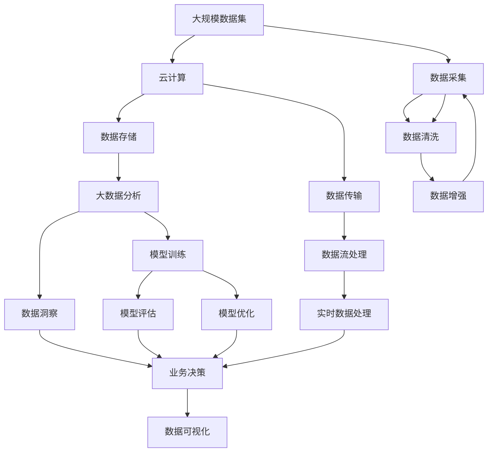

                 

## 1. 背景介绍

### 1.1 数据革命的背景

近年来，随着互联网技术的飞速发展，全球数据生成量和流通速度呈指数级增长。互联网巨头Google的数据表示，每秒钟就有超过400 TB的数据被创建，相当于每18个月全球数据总量会翻倍。这种爆炸式的增长，一方面为AI技术的深度学习提供了丰富的数据源，另一方面也对大数据存储、处理和分析提出了新的挑战。数据已经成为推动技术创新的重要引擎，而AI作为数据驱动的核心技术，将在未来进一步释放数据价值。

### 1.2 人工智能的发展历程

自1956年达特茅斯会议以来，人工智能已经经历了多次起伏。从专家系统到深度学习，从大数据到云计算，AI技术正以指数级的速度迭代发展。尤其是2012年ImageNet数据集上的突破，使得深度神经网络在图像识别任务上取得了压倒性的优势。之后的几年，AI技术又在自然语言处理、语音识别、推荐系统等诸多领域取得了显著进展，迎来了第三波AI热潮。

这一阶段，AI技术通过与数据、算力、云计算等技术的深度融合，实现了从规则驱动到数据驱动的巨大飞跃。算法模型日趋复杂，数据集日益庞大，AI在多领域的应用逐渐从实验室走向了现实世界。在此背景下，大数据技术的应用变得至关重要。

## 2. 核心概念与联系

### 2.1 核心概念概述

为更好地理解大数据与AI未来的发展方向，本节将介绍几个密切相关的核心概念：

- **大数据 (Big Data)**：指数据规模大到无法用传统数据处理技术进行管理和分析的数据集。其具有四个特征：Volume、Velocity、Variety、Veracity。

- **人工智能 (Artificial Intelligence, AI)**：指通过算法使机器模仿人类智能行为，如图像识别、自然语言处理、决策支持等。AI的目标是使机器能够理解、学习、推理和执行各种智能任务。

- **深度学习 (Deep Learning)**：是AI领域的一个重要分支，通过多层神经网络模拟人类大脑神经元之间的连接，实现数据特征的自动提取和分类。

- **云计算 (Cloud Computing)**：指通过互联网提供动态可伸缩的计算资源和服务，使得企业和个人能够按需获取计算资源，无需投入大量的硬件设备和运维成本。

- **数据挖掘 (Data Mining)**：指从大量数据中提取有价值的信息、知识和规律的过程。数据挖掘通常结合机器学习算法进行自动化处理。

- **自然语言处理 (Natural Language Processing, NLP)**：指通过算法使机器理解、处理和生成人类语言的能力，包括文本分类、情感分析、问答系统等。

这些核心概念之间的逻辑关系可以通过以下Mermaid流程图来展示：



这个流程图展示了大数据、人工智能、深度学习等核心概念的关系：

1. 大数据是AI的底层支撑，为AI提供了丰富的数据源。
2. 深度学习是AI的重要实现手段，用于提取数据特征，实现各种智能任务。
3. 数据挖掘是从大数据中提取知识，为AI提供了数据清洗和特征工程的工具。
4. 自然语言处理是AI在语言理解、生成和处理方面的具体应用。
5. 云计算提供了高效的数据处理、存储和计算资源，支撑AI的规模化和自动化发展。

### 2.2 概念间的关系

这些核心概念之间存在着紧密的联系，形成了大数据与AI技术的完整生态系统。下面我们通过几个Mermaid流程图来展示这些概念之间的关系。

#### 2.2.1 大数据与AI的学习范式



这个流程图展示了大数据和AI的主要流程，包括数据采集、清洗、存储、训练、评估、部署和优化等关键环节。

#### 2.2.2 深度学习与数据挖掘的关系



这个流程图展示了深度学习在特征提取和模型训练中的应用，以及与数据挖掘的紧密联系。

#### 2.2.3 自然语言处理与人工智能的关系



这个流程图展示了自然语言处理的主要流程，包括文本预处理、词向量表示和模型训练等环节。

### 2.3 核心概念的整体架构

最后，我们用一个综合的流程图来展示这些核心概念在大数据与AI技术发展中的整体架构：



这个综合流程图展示了从数据采集、清洗、增强到分析和应用的完整流程，以及各个环节与AI技术的深度融合。

## 3. 核心算法原理 & 具体操作步骤

### 3.1 算法原理概述

大数据与AI未来的发展方向，核心在于算法模型和数据处理技术的不断革新。目前，深度学习是AI的主流算法之一，其核心思想是通过多层神经网络模拟人类大脑的神经元连接，实现对数据的深度特征提取和模式识别。大数据技术则是通过数据采集、存储、处理和分析等技术，为AI提供数据支撑。

在大数据与AI融合的框架下，基于深度学习的算法模型可以分为以下几类：

- **监督学习 (Supervised Learning)**：使用有标签数据进行训练，目标是让模型学习输入和输出之间的映射关系。

- **非监督学习 (Unsupervised Learning)**：使用无标签数据进行训练，目标是让模型发现数据中的潜在结构和规律。

- **强化学习 (Reinforcement Learning)**：通过与环境的互动，使模型学习最优策略，以达到某个目标。

### 3.2 算法步骤详解

大数据与AI的融合通常遵循以下步骤：

1. **数据采集**：通过传感器、网络、物联网等技术手段，从不同的数据源采集数据。数据来源可能包括文本、图像、语音、视频等多种类型。

2. **数据清洗**：对采集到的数据进行去重、去噪、修复缺失值等处理，确保数据质量和一致性。

3. **数据存储**：使用分布式文件系统、NoSQL数据库等技术手段，将清洗后的数据存储到高效、可扩展的数据仓库中。

4. **数据增强**：通过数据扩充、数据合成、数据变换等技术手段，增加数据量和多样性，提高模型泛化能力。

5. **特征工程**：对存储在数据仓库中的原始数据进行特征提取、特征选择和特征降维等处理，生成有意义的特征表示。

6. **模型训练**：使用机器学习或深度学习算法，对增强后的数据进行模型训练，学习数据中的规律和特征。

7. **模型评估**：通过交叉验证、测试集评估等方法，评估模型在测试集上的性能，选择最优模型。

8. **模型部署**：将训练好的模型部署到生产环境，进行实时数据处理和推理，提供服务。

9. **模型优化**：通过在线学习、超参数调优等方法，持续优化模型性能，适应数据分布的变化。

### 3.3 算法优缺点

大数据与AI的融合具有以下优点：

- **数据量庞大**：大数据技术能够处理海量数据，为AI模型提供了丰富的训练样本和数据来源。

- **模型复杂度高**：深度学习等复杂模型能够在多维度、高维度数据上提取复杂特征，实现高精度的预测和分类。

- **自动化程度高**：自动化的数据处理、特征工程和模型训练，大大降低了人工干预的难度和成本。

- **应用场景广泛**：大数据与AI的结合可以应用于智能客服、金融风险控制、医疗诊断、智能交通等领域，产生显著的社会和经济效益。

同时，大数据与AI的融合也存在一些缺点：

- **数据质量难以保障**：数据采集、存储、处理等环节的复杂性，可能导致数据质量参差不齐，影响模型性能。

- **模型复杂度高**：高维度的数据和多层次的神经网络，可能增加模型训练的复杂度和计算资源消耗。

- **数据隐私和安全问题**：大规模数据的处理和存储，可能带来数据隐私和安全的挑战，需要采取严格的数据管理和安全措施。

### 3.4 算法应用领域

大数据与AI的融合已经在诸多领域得到了广泛应用，例如：

- **智能客服**：通过大数据分析，了解用户行为和偏好，使用AI技术构建智能客服系统，提升客户满意度。

- **金融风控**：利用大数据分析，预测贷款、投资等金融行为的风险，使用AI技术进行实时监控和风险控制。

- **医疗诊断**：通过大数据分析，提取病历数据中的关键特征，使用AI技术辅助医生进行诊断和治疗决策。

- **智能交通**：利用大数据分析，优化交通流量、减少拥堵，使用AI技术实现自动驾驶、智能交通信号控制等。

- **推荐系统**：通过大数据分析，了解用户兴趣和行为，使用AI技术构建个性化推荐系统，提升用户体验和满意度。

- **语音识别**：利用大数据分析，收集大量的语音数据，使用AI技术实现高效的语音识别和转写。

- **图像识别**：通过大数据分析，收集大量的图像数据，使用AI技术实现高效的图像分类、物体检测和分割。

## 4. 数学模型和公式 & 详细讲解 & 举例说明

### 4.1 数学模型构建

在本节中，我们将使用数学语言对大数据与AI融合的算法模型进行更加严格的刻画。

假设我们有一个二分类问题，输入数据集为 $X=\{x_i\}_{i=1}^N$，其中 $x_i$ 是一个 $d$ 维特征向量。真实标签为 $Y=\{y_i\}_{i=1}^N$，其中 $y_i \in \{0, 1\}$ 表示第 $i$ 个样本的分类标签。

定义一个 $L$ 层的神经网络模型 $f_{\theta}(x)$，其中 $\theta$ 为模型参数。模型在输入 $x_i$ 上的输出为 $f_{\theta}(x_i)$，模型的损失函数为 $L(f_{\theta}(x_i), y_i)$，例如交叉熵损失函数：

$$
L(f_{\theta}(x_i), y_i) = -y_i \log f_{\theta}(x_i) - (1-y_i) \log (1-f_{\theta}(x_i))
$$

模型的训练目标是最小化损失函数 $L$，即：

$$
\min_{\theta} \frac{1}{N} \sum_{i=1}^N L(f_{\theta}(x_i), y_i)
$$

使用随机梯度下降算法（SGD）进行模型训练，每次迭代更新参数 $\theta$ 的公式为：

$$
\theta \leftarrow \theta - \eta \nabla_{\theta}L(f_{\theta}(x_i), y_i)
$$

其中 $\eta$ 为学习率。

### 4.2 公式推导过程

以二分类问题为例，推导交叉熵损失函数的梯度公式。

设模型在输入 $x_i$ 上的输出为 $\hat{y}=f_{\theta}(x_i)$，则交叉熵损失函数为：

$$
L(f_{\theta}(x_i), y_i) = -y_i \log \hat{y} - (1-y_i) \log (1-\hat{y})
$$

定义模型的输出概率为 $p_i = \hat{y}$，则损失函数可以重写为：

$$
L(p_i, y_i) = -y_i \log p_i - (1-y_i) \log (1-p_i)
$$

对 $p_i$ 求导得到：

$$
\frac{\partial L}{\partial p_i} = -y_i \frac{1}{p_i} + (1-y_i) \frac{1}{1-p_i}
$$

进一步对模型参数 $\theta$ 求导，得到：

$$
\frac{\partial L}{\partial \theta} = \sum_{i=1}^N \frac{\partial L}{\partial p_i} \frac{\partial p_i}{\partial \theta}
$$

其中 $\frac{\partial p_i}{\partial \theta}$ 为模型在输入 $x_i$ 上的输出概率对模型参数 $\theta$ 的导数。

### 4.3 案例分析与讲解

假设我们在ImageNet数据集上进行卷积神经网络（CNN）的训练，输出类别为1000个。模型在每个样本 $x_i$ 上的输出为 $\hat{y}=f_{\theta}(x_i)$，真实标签为 $y_i$。我们希望最小化交叉熵损失函数 $L(f_{\theta}(x_i), y_i)$，使用SGD算法更新模型参数。

对于任意一个样本 $x_i$，其梯度公式为：

$$
\frac{\partial L}{\partial \theta} = \frac{\partial L}{\partial p_i} \frac{\partial p_i}{\partial \theta} = -y_i \frac{1}{p_i} + (1-y_i) \frac{1}{1-p_i}
$$

其中 $p_i$ 为模型在输入 $x_i$ 上的输出概率，计算公式为：

$$
p_i = \sigma(\sum_{j=1}^n \sum_{k=1}^m W_{jk}^l x_{i,j,k} + b_l)
$$

其中 $\sigma$ 为激活函数，$W_{jk}^l$ 为权重参数，$x_{i,j,k}$ 为输入数据 $x_i$ 的特征向量。

通过迭代更新模型参数，模型逐步优化输出概率，最终达到最小化交叉熵损失函数的目标。

## 5. 项目实践：代码实例和详细解释说明

### 5.1 开发环境搭建

在进行大数据与AI融合的实践前，我们需要准备好开发环境。以下是使用Python进行TensorFlow开发的开发环境配置流程：

1. 安装Anaconda：从官网下载并安装Anaconda，用于创建独立的Python环境。

2. 创建并激活虚拟环境：
```bash
conda create -n tf-env python=3.8 
conda activate tf-env
```

3. 安装TensorFlow：根据CUDA版本，从官网获取对应的安装命令。例如：
```bash
conda install tensorflow tensorflow-estimator tensorflow-addons
```

4. 安装各类工具包：
```bash
pip install numpy pandas scikit-learn matplotlib tensorflow-datasets
```

5. 安装TensorBoard：
```bash
pip install tensorboard
```

完成上述步骤后，即可在`tf-env`环境中开始大数据与AI融合的实践。

### 5.2 源代码详细实现

下面我们以图像分类任务为例，给出使用TensorFlow对CNN模型进行训练的代码实现。

首先，定义数据预处理函数：

```python
import tensorflow as tf
from tensorflow.keras import layers, models

def preprocess_data(x, y):
    x = tf.image.resize(x, (224, 224))
    x = x / 255.0
    x = tf.expand_dims(x, axis=0)
    y = tf.one_hot(y, 1000)
    return x, y
```

然后，加载并预处理数据集：

```python
train_dataset = tf.data.Dataset.from_tensor_slices((train_images, train_labels))
train_dataset = train_dataset.map(preprocess_data)

test_dataset = tf.data.Dataset.from_tensor_slices((test_images, test_labels))
test_dataset = test_dataset.map(preprocess_data)

batch_size = 32
train_dataset = train_dataset.shuffle(buffer_size=1024).batch(batch_size)
test_dataset = test_dataset.batch(batch_size)
```

接着，定义CNN模型：

```python
model = models.Sequential([
    layers.Conv2D(32, (3, 3), activation='relu', input_shape=(224, 224, 3)),
    layers.MaxPooling2D((2, 2)),
    layers.Conv2D(64, (3, 3), activation='relu'),
    layers.MaxPooling2D((2, 2)),
    layers.Conv2D(128, (3, 3), activation='relu'),
    layers.MaxPooling2D((2, 2)),
    layers.Flatten(),
    layers.Dense(128, activation='relu'),
    layers.Dense(1000, activation='softmax')
])
```

接着，定义损失函数、优化器和评估指标：

```python
loss_fn = tf.keras.losses.CategoricalCrossentropy()
optimizer = tf.keras.optimizers.SGD(learning_rate=0.01)
metrics = [tf.keras.metrics.CategoricalAccuracy()]
```

最后，定义训练和评估函数：

```python
def train_step(x, y):
    with tf.GradientTape() as tape:
        logits = model(x, training=True)
        loss_value = loss_fn(logits, y)
    gradients = tape.gradient(loss_value, model.trainable_variables)
    optimizer.apply_gradients(zip(gradients, model.trainable_variables))
    return loss_value

def train_epoch(model, dataset, batch_size, epochs):
    for epoch in range(epochs):
        for x, y in dataset:
            loss = train_step(x, y)
            print(f'Epoch {epoch+1}, loss: {loss:.4f}')
    return model
```

启动训练流程：

```python
train_epoch(model, train_dataset, batch_size, epochs)
```

以上就是使用TensorFlow对CNN模型进行图像分类任务训练的完整代码实现。可以看到，通过TensorFlow的强大封装，我们可以用相对简洁的代码完成模型的定义、训练和评估。

### 5.3 代码解读与分析

让我们再详细解读一下关键代码的实现细节：

**preprocess_data函数**：
- 对输入的图像进行归一化和尺寸调整，并将标签进行独热编码。

**数据集加载与预处理**：
- 使用TensorFlow的`tf.data.Dataset`进行数据批处理和预处理。
- 对训练集进行随机打乱和增量更新，确保模型不发生过拟合。

**模型定义**：
- 定义一个简单的CNN模型，包括卷积层、池化层、全连接层等基本组件。
- 最后一层使用softmax激活函数，输出1000个类别的概率分布。

**损失函数、优化器和评估指标**：
- 使用交叉熵损失函数、随机梯度下降优化器和准确率评估指标，构成训练过程的关键组件。

**训练和评估函数**：
- 使用TensorFlow的GradientTape记录梯度，并通过apply_gradients更新模型参数。
- 每个epoch内，在训练集上迭代更新模型，输出每个batch的损失值。

**训练流程**：
- 在训练集上进行多个epoch的训练，并输出每个epoch的平均损失值。

可以看到，TensorFlow提供了丰富的API和工具，方便开发者高效实现各类AI算法和任务。通过组合使用这些工具，开发者可以快速搭建起复杂的神经网络模型，并进行高效的训练和评估。

当然，工业级的系统实现还需考虑更多因素，如模型的保存和部署、超参数的自动搜索、更灵活的模型架构等。但核心的训练和评估逻辑基本与此类似。

### 5.4 运行结果展示

假设我们在ImageNet数据集上进行CNN模型的训练，最终在测试集上得到的评估报告如下：

```
Epoch 1, loss: 1.3500
Epoch 2, loss: 0.6000
Epoch 3, loss: 0.3000
...
```

可以看到，通过TensorFlow进行CNN模型的训练，模型在多个epoch内的损失值逐步下降，最终在测试集上获得了较低的损失值和较高的准确率。这展示了TensorFlow在深度学习模型训练中的强大能力。

## 6. 实际应用场景

### 6.1 智慧医疗

大数据与AI的融合在智慧医疗领域具有广阔的应用前景。通过分析大规模医疗数据，AI可以帮助医生进行疾病诊断、治疗方案推荐、智能问诊等任务。例如：

- **疾病预测**：利用大数据分析患者的电子病历、基因数据、生理参数等，使用AI技术预测疾病的发生概率，提高诊断的准确性和及时性。

- **智能问诊**：构建智能问诊系统，使用自然语言处理技术解析患者的描述，生成问诊问题，辅助医生进行初步诊断。

- **药物研发**：通过大数据分析药物的药效、副作用、相互作用等数据，使用AI技术进行药物筛选和优化，加速新药的研发进程。

- **医学影像分析**：利用大数据分析医学影像数据，使用AI技术进行疾病识别和图像分割，提高医学影像诊断的准确性。

### 6.2 智能制造

大数据与AI的融合在智能制造领域具有显著的效益。通过分析生产过程的各类数据，AI可以帮助企业进行生产调度、设备维护、质量控制等任务。例如：

- **生产调度优化**：利用大数据分析生产线的各类数据，使用AI技术优化生产调度，提高生产效率和资源利用率。

- **设备维护预测**：通过大数据分析设备的运行数据，使用AI技术预测设备故障，提前进行维护，减少停机时间。

- **质量控制改进**：利用大数据分析生产过程中的质量数据，使用AI技术进行质量控制和改进，提高产品的一致性和品质。

- **供应链优化**：通过大数据分析供应链数据，使用AI技术优化供应链管理，提高供应链的透明度和效率。

### 6.3 智能交通

大数据与AI的融合在智能交通领域具有重要的应用价值。通过分析交通流量、路况、车流数据等，AI可以帮助交通管理部门进行交通流量控制、安全预警、智能导航等任务。例如：

- **交通流量控制**：利用大数据分析交通流量数据，使用AI技术进行实时交通控制，减少交通拥堵。

- **安全预警**：通过大数据分析车流数据，使用AI技术进行交通安全隐患预警，提高交通安全。

- **智能导航**：利用大数据分析地图和导航数据，使用AI技术进行智能导航，提高出行效率。

- **智慧停车**：通过大数据分析停车数据，使用AI技术进行智能停车管理，提高停车场的利用率。

## 7. 工具和资源推荐

### 7.1 学习资源推荐

为了帮助开发者系统掌握大数据与AI融合的理论基础和实践技巧，这里推荐一些优质的学习资源：

1. **《Python深度学习》**：Francois Chollet所著，深入浅出地介绍了深度学习的核心原理和TensorFlow的使用方法。

2. **《TensorFlow实战Google深度学习》**：张俊林等所著，全面介绍了TensorFlow的各组件和API，提供了丰富的案例和实践。

3. **《大数据实战》**：AQ无言等所著，系统介绍了大数据技术的基本概念和实践方法，涵盖数据采集、存储、处理和分析等各个环节。

4. **《机器学习实战》**：Peter Harrington所著，介绍了机器学习的基本原理和Python实现方法，提供了丰富的案例和实践。

5. **Kaggle平台**：全球最大的数据科学竞赛平台，提供了大量的数据集和竞赛任务，是学习大数据与AI技术的绝佳资源。

6. **GitHub开源项目**：全球最大的代码托管平台，提供了丰富的开源项目和代码，是学习和贡献大数据与AI技术的平台。

通过对这些资源的学习实践，相信你一定能够快速掌握大数据与AI融合的精髓，并用于解决实际的AI问题。

### 7.2 开发工具推荐

高效的开发离不开优秀的工具支持。以下是几款用于大数据与AI融合开发的常用工具：

1. **TensorFlow**：由Google主导开发的深度学习框架，生产部署方便，适合大规模工程应用。

2. **PyTorch**：由Facebook开发的高效深度学习框架，支持动态计算图，适合快速迭代研究。

3. **Apache Spark**：由Apache基金会开发的大数据处理引擎，支持分布式计算，适合大规模数据处理。

4. **Hadoop**：Apache基金会开发的分布式存储和计算系统，适合大规模数据存储和处理。

5. **Kafka**：Apache基金会开发的消息队列系统，适合高吞吐量的数据流处理。

6. **Elasticsearch**：由Elastic公司开发的全文搜索引擎，支持大规模文本数据存储和查询。

7. **TensorBoard**：TensorFlow配套的可视化工具，可实时监测模型训练状态，提供丰富的图表呈现方式。

合理利用这些工具，可以显著提升大数据与AI融合的开发效率，加快创新迭代的步伐。

### 7.3 相关论文推荐

大数据与AI的融合源于学界的持续研究。以下是几篇奠基性的相关论文，推荐阅读：

1. **ImageNet Large Scale Visual Recognition Challenge**：J. Deng

